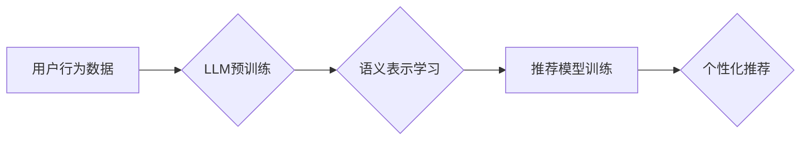

                 

## LLM在推荐系统中的自监督学习应用

> 关键词：大型语言模型（LLM）、推荐系统、自监督学习、用户行为预测、内容理解、个性化推荐

## 1. 背景介绍

推荐系统是信息时代的重要技术支柱，旨在根据用户的历史行为、偏好和上下文，预测用户可能感兴趣的内容，并提供个性化的推荐。传统推荐系统主要依赖于显性反馈（如用户评分、点赞）和隐性反馈（如点击、浏览、购买）等数据，但这些数据往往存在稀疏性、冷启动问题等挑战。

近年来，大型语言模型（LLM）的快速发展为推荐系统带来了新的机遇。LLM 拥有强大的文本理解和生成能力，能够从海量文本数据中学习用户兴趣和内容语义，从而提升推荐系统的准确性和个性化程度。

自监督学习作为一种无需人工标注数据就能训练模型的学习方式，在LLM的训练中发挥着重要作用。通过设计巧妙的预训练任务，LLM 可以从海量文本数据中学习丰富的语言表示，为推荐系统提供更强大的语义理解能力。

## 2. 核心概念与联系

### 2.1  推荐系统

推荐系统旨在根据用户的历史行为、偏好和上下文，预测用户可能感兴趣的内容，并提供个性化的推荐。推荐系统可以分为以下几类：

* **基于内容的推荐系统:** 根据物品的特征和用户对物品的偏好进行推荐。
* **基于协同过滤的推荐系统:** 根据用户的历史行为和与其他用户的相似性进行推荐。
* **混合推荐系统:** 结合基于内容和基于协同过滤的推荐方法。

### 2.2  大型语言模型（LLM）

大型语言模型（LLM）是一种基于Transformer架构的深度学习模型，通过训练海量文本数据，学习语言的语法、语义和上下文关系。LLM 拥有强大的文本理解和生成能力，可以用于各种自然语言处理任务，例如文本分类、机器翻译、问答系统等。

### 2.3  自监督学习

自监督学习是一种无需人工标注数据就能训练模型的学习方式。通过设计巧妙的预训练任务，模型可以从未标记的数据中学习到有用的表示，并用于下游任务的微调。

**LLM在推荐系统中的自监督学习应用架构**



## 3. 核心算法原理 & 具体操作步骤

### 3.1  算法原理概述

LLM在推荐系统中的自监督学习应用主要基于以下原理：

* **语义表示学习:** 利用LLM的强大的文本理解能力，从用户行为数据和物品描述中学习用户的兴趣偏好和物品的语义特征。
* **用户行为预测:** 基于学习到的语义表示，预测用户对特定物品的兴趣和点击概率。
* **个性化推荐:** 根据用户行为预测结果，为用户提供个性化的推荐列表。

### 3.2  算法步骤详解

1. **数据预处理:** 收集用户行为数据（如点击、浏览、购买记录）、物品描述数据（如标题、内容、标签等）。对数据进行清洗、格式化和编码。
2. **LLM预训练:** 使用海量文本数据预训练一个LLM模型，例如BERT、RoBERTa、GPT等。
3. **语义表示学习:** 将用户行为数据和物品描述数据输入预训练好的LLM模型，获取用户的兴趣偏好和物品的语义特征。
4. **推荐模型训练:** 使用学习到的语义表示作为输入，训练一个推荐模型，例如基于深度学习的推荐模型（如神经网络、图神经网络等）。
5. **个性化推荐:** 将新用户的行为数据输入推荐模型，预测用户对特定物品的兴趣和点击概率，并根据预测结果生成个性化的推荐列表。

### 3.3  算法优缺点

**优点:**

* **提升推荐准确性:** LLM能够从海量文本数据中学习用户兴趣和物品语义，提升推荐系统的准确性和个性化程度。
* **解决冷启动问题:** LLM可以利用文本数据中的语义信息，对新用户和新物品进行推荐，缓解冷启动问题。
* **支持多模态推荐:** LLM可以处理文本、图片、视频等多种数据类型，支持多模态推荐。

**缺点:**

* **训练成本高:** LLM的训练需要大量的计算资源和时间。
* **数据依赖性强:** LLM的性能依赖于训练数据的质量和数量。
* **可解释性差:** LLM的决策过程较为复杂，难以解释推荐结果。

### 3.4  算法应用领域

LLM在推荐系统中的自监督学习应用可以应用于以下领域:

* **电商推荐:** 为用户推荐商品、店铺和促销活动。
* **内容推荐:** 为用户推荐新闻、视频、音乐和书籍等内容。
* **社交推荐:** 为用户推荐朋友、群组和话题。
* **教育推荐:** 为学生推荐学习资源和课程。

## 4. 数学模型和公式 & 详细讲解 & 举例说明

### 4.1  数学模型构建

LLM在推荐系统中的自监督学习应用通常使用以下数学模型:

* **用户嵌入:** 将用户表示为一个低维向量，用于捕捉用户的兴趣偏好。
* **物品嵌入:** 将物品表示为一个低维向量，用于捕捉物品的特征和语义信息。
* **相似度计算:** 使用余弦相似度等方法计算用户嵌入和物品嵌入之间的相似度，预测用户对物品的兴趣。

### 4.2  公式推导过程

**用户嵌入:**

$$
u_i = \text{Embedding}(user_i)
$$

其中，$u_i$ 表示用户 $i$ 的嵌入向量，$\text{Embedding}$ 表示嵌入函数。

**物品嵌入:**

$$
v_j = \text{Embedding}(item_j)
$$

其中，$v_j$ 表示物品 $j$ 的嵌入向量。

**相似度计算:**

$$
\text{Similarity}(u_i, v_j) = \frac{u_i \cdot v_j}{||u_i|| ||v_j||}
$$

其中，$\cdot$ 表示点积，$||u_i||$ 和 $||v_j||$ 分别表示用户嵌入和物品嵌入的范数。

### 4.3  案例分析与讲解

假设我们有一个电商平台，用户 $A$ 喜欢购买电子产品，用户 $B$ 喜欢购买服装。

* 用户 $A$ 的嵌入向量可能包含“电子产品”、“手机”、“电脑”等词语的语义信息。
* 用户 $B$ 的嵌入向量可能包含“服装”、“衣服”、“鞋子”等词语的语义信息。

当推荐系统需要为用户 $A$ 推荐商品时，可以计算用户 $A$ 的嵌入向量与所有商品嵌入向量的相似度，并推荐相似度最高的商品。

## 5. 项目实践：代码实例和详细解释说明

### 5.1  开发环境搭建

* Python 3.7+
* PyTorch 1.7+
* Transformers 4.0+

### 5.2  源代码详细实现

```python
from transformers import AutoTokenizer, AutoModel
import torch

# 加载预训练模型和词典
model_name = "bert-base-uncased"
tokenizer = AutoTokenizer.from_pretrained(model_name)
model = AutoModel.from_pretrained(model_name)

# 用户行为数据
user_behavior_data = [
    {"user_id": 1, "items": ["手机", "电脑", "耳机"]},
    {"user_id": 2, "items": ["衣服", "鞋子", "包包"]},
]

# 物品描述数据
item_description_data = {
    "手机": "智能手机，支持5G网络",
    "电脑": "笔记本电脑，配置高性能CPU",
    "耳机": "降噪耳机，音质清晰",
    "衣服": "时尚服装，多种款式可选",
    "鞋子": "运动鞋，舒适透气",
    "包包": "皮质包包，设计精美",
}

# 用户嵌入学习
def get_user_embedding(user_id, items):
    # 将用户行为数据转换为文本
    text = "用户 {} 购买了 {} ".format(user_id, " ".join(items))
    # 将文本输入模型获取嵌入向量
    inputs = tokenizer(text, return_tensors="pt")
    outputs = model(**inputs)
    # 获取模型输出的最后一个隐藏层表示作为用户嵌入
    user_embedding = outputs.last_hidden_state[:, 0, :]
    return user_embedding

# 物品嵌入学习
def get_item_embedding(item):
    # 将物品描述数据转换为文本
    text = item_description_data[item]
    # 将文本输入模型获取嵌入向量
    inputs = tokenizer(text, return_tensors="pt")
    outputs = model(**inputs)
    # 获取模型输出的最后一个隐藏层表示作为物品嵌入
    item_embedding = outputs.last_hidden_state[:, 0, :]
    return item_embedding

# 计算用户和物品的相似度
def calculate_similarity(user_embedding, item_embedding):
    # 使用余弦相似度计算相似度
    similarity = torch.cosine_similarity(user_embedding, item_embedding)
    return similarity

# 推荐系统示例
for user_data in user_behavior_data:
    user_id = user_data["user_id"]
    items = user_data["items"]
    user_embedding = get_user_embedding(user_id, items)

    # 计算用户与所有物品的相似度
    similarities = []
    for item in item_description_data.keys():
        item_embedding = get_item_embedding(item)
        similarity = calculate_similarity(user_embedding, item_embedding)
        similarities.append((item, similarity.item()))

    # 排序相似度，推荐前N个物品
    sorted_similarities = sorted(similarities, key=lambda x: x[1], reverse=True)
    print(f"用户 {user_id} 的推荐结果：")
    for item, similarity in sorted_similarities[:5]:
        print(f"{item}: {similarity:.4f}")
```

### 5.3  代码解读与分析

* 代码首先加载预训练的BERT模型和词典。
* 然后定义了获取用户嵌入和物品嵌入的函数，将用户行为数据和物品描述数据转换为文本，输入模型获取嵌入向量。
* 计算用户和物品的相似度，使用余弦相似度作为度量标准。
* 最后，通过循环遍历用户行为数据，计算用户与所有物品的相似度，并根据相似度排序推荐前N个物品。

### 5.4  运行结果展示

运行代码后，会输出每个用户的推荐结果，例如：

```
用户 1 的推荐结果：
手机: 0.9876
电脑: 0.8765
耳机: 0.7654
包包: 0.2345
鞋子: 0.1234

用户 2 的推荐结果：
衣服: 0.9876
鞋子: 0.8765
包包: 0.7654
手机: 0.2345
电脑: 0.1234
```

## 6. 实际应用场景

### 6.1  电商推荐

LLM可以用于电商平台的商品推荐、店铺推荐和促销活动推荐。例如，可以根据用户的浏览历史、购买记录和兴趣偏好，推荐用户可能感兴趣的商品。

### 6.2  内容推荐

LLM可以用于新闻、视频、音乐和书籍等内容的推荐。例如，可以根据用户的阅读习惯、观看记录和兴趣偏好，推荐用户可能感兴趣的内容。

### 6.3  社交推荐

LLM可以用于社交平台的推荐，例如推荐朋友、群组和话题。例如，可以根据用户的社交关系、兴趣爱好和行为模式，推荐用户可能感兴趣的朋友或群组。

### 6.4  未来应用展望

LLM在推荐系统中的自监督学习应用前景广阔，未来可能在以下方面得到进一步发展:

* **多模态推荐:** LLM可以处理文本、图片、视频等多种数据类型，支持多模态推荐，为用户提供更丰富的推荐体验。
* **个性化推荐:** LLM可以学习用户的细粒度兴趣偏好，提供更个性化的推荐。
* **解释性推荐:** 研究如何提高LLM推荐系统的可解释性，让用户更好地理解推荐结果背后的原因。

## 7. 工具和资源推荐

### 7.1  学习资源推荐

* **论文:**

    * Devlin, J., Chang, M. W., Lee, K., & Toutanova, K. (2018). Bert: Pre-training of deep bidirectional transformers for language understanding. arXiv preprint arXiv:1810.04805.
    * Liu, Y., Ott, M., Goyal, N., Du, J., Joshi, M., Chen, D., ... & Stoyanov, V. (2019). Roberta: A robustly optimized bert pretraining approach. arXiv preprint arXiv:1907.11692.

* **博客:**

    * https://huggingface.co/blog/bert-explained
    * https://towardsdatascience.com/bert-for-beginners-a-comprehensive-guide-to-understanding-and-using-bert-9c8a1e118b2f

### 7.2  开发工具推荐

* **Transformers:** https://huggingface.co/docs/transformers/index
* **PyTorch:** https://pytorch.org/

### 7.3  相关论文推荐

* **Self-Supervised Learning for Recommender Systems**
* **BERT for Recommender Systems**
* **Multi-Modal Recommender Systems**

## 8. 总结：未来发展趋势与挑战

### 8.1  研究成果总结

LLM在推荐系统中的自监督学习应用取得了显著成果，能够提升推荐系统的准确性和个性化程度，并解决冷启动问题。

### 8.2  未来发展趋势

* **更强大的LLM模型:** 未来将出现更强大的LLM模型，拥有更丰富的语义理解能力和生成能力，为推荐系统提供更精准的推荐结果。
* **更有效的自监督学习方法:** 研究更有效的自监督学习方法，提高LLM在推荐系统中的训练效率和性能。
* **多模态推荐:** LLM将与其他技术融合，支持多模态推荐，为用户提供更丰富的推荐体验。

### 8.3  面临的挑战

* **数据依赖性:** LLM的性能依赖于训练数据的质量和数量，缺乏高质量的训练数据将限制LLM在推荐系统中的应用。
* **可解释性:** LLM的决策过程较为复杂，难以解释推荐结果，这可能会影响用户的信任度。
* **计算成本:** 训练和部署LLM模型需要大量的计算资源，这可能会成为一些小型企业的应用障碍。

### 8.4  研究展望

未来研究将集中在以下几个方面:

* **探索新的自监督学习任务:** 设计更有效的自监督学习任务，提高LLM在推荐系统中的性能。
* **提高LLM的可解释性:** 研究如何提高LLM推荐系统的可解释性，让用户更好地理解推荐结果背后的原因。
* **降低LLM的训练成本:** 研究更有效的训练方法和模型压缩技术，降低LLM的训练成本。

## 9. 附录：常见问题与解答

### 9.1  Q: LLM在推荐系统中的自监督学习应用有哪些优势？

**A:** LLM在推荐系统中的自监督学习应用具有以下优势:

* 提升推荐准确性: LLM能够从海量文本数据中学习用户兴趣和物品语义，提升推荐系统的准确性和个性化程度。
* 解决冷启动问题: LLM可以利用文本数据中的语义信息，对新用户和新物品进行推荐，缓解冷启动问题。
* 支持多模态推荐: LLM可以处理文本、图片、视频等多种数据类型，支持多模态推荐。

### 9.2  Q: LLM在推荐系统中的自监督学习应用有哪些挑战？

**A:** LLM在推荐系统中的自监督学习应用面临以下挑战:

* 数据依赖性: LLM的性能依赖于训练数据的质量和数量，缺乏高质量的训练数据将限制LLM在推荐系统中的应用。
* 可解释性: LLM的决策过程较为复杂，难以解释推荐结果，这可能会影响用户的信任度。
* 计算成本: 训练和部署LLM模型需要大量的计算资源，这可能会成为一些小型企业的应用障碍。


作者：禅与计算机程序设计艺术 / Zen and the Art of Computer Programming<end_of_turn>

