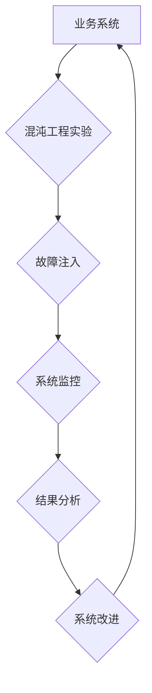

                 

## SRE混沌工程应用实践

> 关键词：SRE, 混沌工程, 可靠性工程, 系统稳定性, 故障演练, 容错设计, 持续交付, DevOps

## 1. 背景介绍

在当今数字化时代，软件系统日益复杂，其可靠性和稳定性对业务运营至关重要。传统的软件开发模式难以应对快速变化的业务需求和不断增长的系统规模，因此，Site Reliability Engineering (SRE) 应运而生。SRE 是一种将软件工程和运维实践相结合的理念，旨在提高软件系统的可靠性、可用性和可扩展性。

混沌工程 (Chaos Engineering) 作为 SRE 的重要组成部分，旨在通过在生产环境中模拟故障，以评估系统对故障的鲁棒性，并提前发现潜在的风险。它强调主动探测和预演系统故障，而不是被动地应对突发事件。

## 2. 核心概念与联系

### 2.1  SRE 与混沌工程

SRE 致力于构建可靠、可扩展和可维护的软件系统，而混沌工程则是 SRE 的重要实践之一。

SRE 的目标是：

* **提高系统可靠性:** 确保系统能够持续运行，并能够在故障发生时快速恢复。
* **提高系统可用性:** 确保系统能够在任何时候都为用户提供服务。
* **提高系统可扩展性:** 确保系统能够随着业务需求的增长而扩展。

混沌工程通过在生产环境中模拟故障，帮助 SRE 团队实现上述目标。

### 2.2  混沌工程的原理

混沌工程的核心原理是“主动探测和预演”。通过在生产环境中故意引入故障，可以评估系统对故障的鲁棒性，并提前发现潜在的风险。

混沌工程的流程通常包括以下步骤：

1. **识别关键业务指标 (KPI):** 确定哪些指标对业务至关重要。
2. **设计实验:** 设计模拟故障的实验，并确定实验的目标和预期结果。
3. **执行实验:** 在生产环境中执行实验，并监控系统的行为。
4. **分析结果:** 分析实验的结果，并根据结果改进系统设计和运营流程。

### 2.3  架构图



## 3. 核心算法原理 & 具体操作步骤

### 3.1  算法原理概述

混沌工程并不依赖于特定的算法，而是基于对系统行为的观察和分析。通过设计和执行各种类型的故障注入实验，可以了解系统在不同情况下是如何响应的，并从中发现潜在的风险和改进点。

### 3.2  算法步骤详解

1. **目标定义:** 明确混沌工程实验的目标，例如评估系统对网络延迟的容忍度，或者测试数据库故障恢复机制。
2. **故障类型选择:** 根据实验目标选择合适的故障类型，例如网络延迟、服务不可用、数据丢失等。
3. **实验设计:** 设计实验方案，包括故障注入的程度、持续时间、触发条件等。
4. **监控指标:** 确定需要监控的指标，例如系统响应时间、错误率、资源利用率等。
5. **故障注入:** 在生产环境中安全地注入故障，并监控系统的行为。
6. **结果分析:** 分析实验结果，评估系统对故障的鲁棒性，并找出潜在的风险和改进点。
7. **系统改进:** 根据实验结果，改进系统设计、运营流程或自动化脚本，提高系统的可靠性和稳定性。

### 3.3  算法优缺点

**优点:**

* **主动探测风险:** 通过模拟故障，可以提前发现潜在的风险，避免突发事件。
* **提高系统鲁棒性:** 通过不断测试和改进，可以提高系统的容错能力和故障恢复能力。
* **提升团队意识:** 通过共同参与混沌工程实验，可以提高团队成员对系统可靠性的意识，并促进团队协作。

**缺点:**

* **需要专业知识:** 设计和执行混沌工程实验需要一定的专业知识和经验。
* **可能带来风险:** 如果实验设计不当，可能会导致系统不可用或数据丢失。
* **需要投入时间和资源:** 设计、执行和分析混沌工程实验需要投入一定的资源和时间。

### 3.4  算法应用领域

混沌工程适用于各种类型的软件系统，例如：

* **电商平台:** 测试系统对流量高峰、订单处理和支付系统的容忍度。
* **金融系统:** 测试系统对数据安全、交易处理和风险控制的可靠性。
* **云计算平台:** 测试系统对网络故障、虚拟机故障和数据存储故障的容错能力。

## 4. 数学模型和公式 & 详细讲解 & 举例说明

### 4.1  数学模型构建

混沌工程中常用的数学模型包括：

* **概率模型:** 用于评估系统在不同故障场景下的故障概率。
* **统计模型:** 用于分析系统在故障发生后的行为，例如故障恢复时间、错误率等。
* **网络模型:** 用于模拟系统中的网络拓扑结构和数据流，评估系统对网络故障的鲁棒性。

### 4.2  公式推导过程

例如，可以使用泊松分布来估计系统在特定时间段内发生故障的概率。泊松分布的概率质量函数为：

$$P(k) = \frac{e^{-\lambda} \lambda^k}{k!}$$

其中：

* $P(k)$ 是系统在特定时间段内发生 $k$ 次故障的概率。
* $\lambda$ 是系统在特定时间段内发生故障的平均次数。
* $k$ 是故障次数。

### 4.3  案例分析与讲解

假设一个网站的平均每小时发生 2 次故障，可以使用泊松分布计算在 1 小时内发生 3 次故障的概率：

$$P(3) = \frac{e^{-2} 2^3}{3!} = 0.14$$

因此，在 1 小时内发生 3 次故障的概率为 14%。

## 5. 项目实践：代码实例和详细解释说明

### 5.1  开发环境搭建

混沌工程实验可以使用各种工具进行，例如：

* **Chaos Monkey:** Netflix 开发的工具，用于在生产环境中随机杀死服务。
* **Gremlin:** 一款开源的混沌工程平台，提供多种故障注入类型和监控功能。
* **LitmusChaos:** 一款开源的混沌工程平台，支持 Kubernetes 和其他云平台。

### 5.2  源代码详细实现

以下是一个使用 Gremlin 进行故障注入的简单代码示例：

```python
from gremlin_client import GremlinClient

# 连接到 Gremlin 服务器
client = GremlinClient(host="localhost", port=8182)

# 创建一个故障注入任务
task = client.create_task(
    name="network_latency",
    target="http://example.com",
    duration=60,
    latency=100,
)

# 执行故障注入任务
task.run()

# 监控系统行为
# ...
```

### 5.3  代码解读与分析

这段代码首先连接到 Gremlin 服务器，然后创建一个名为 "network_latency" 的故障注入任务。该任务的目标是模拟网络延迟，持续时间为 60 秒，延迟值为 100 毫秒。最后，代码执行故障注入任务，并监控系统行为。

### 5.4  运行结果展示

运行该代码后，Gremlin 会在目标网站上注入网络延迟，并监控系统的行为。可以观察到网站的响应时间会增加，错误率可能会上升。

## 6. 实际应用场景

### 6.1  金融系统

金融系统对可靠性和安全性要求极高，混沌工程可以帮助金融机构测试系统对网络故障、数据丢失和攻击的容错能力，确保系统能够在突发事件中正常运行。

### 6.2  电商平台

电商平台需要应对高流量和高峰期，混沌工程可以帮助电商平台测试系统对流量高峰、订单处理和支付系统的容忍度，确保系统能够稳定运行。

### 6.3  云计算平台

云计算平台需要提供高可用性和弹性，混沌工程可以帮助云计算平台测试系统对网络故障、虚拟机故障和数据存储故障的容错能力，确保平台能够持续提供服务。

### 6.4  未来应用展望

随着技术的不断发展，混沌工程的应用场景将会更加广泛。例如，可以应用于人工智能、物联网和区块链等领域，帮助这些新兴技术更好地应对挑战。

## 7. 工具和资源推荐

### 7.1  学习资源推荐

* **Chaos Engineering: Building Resilient Systems** by Casey Rosenthal
* **The Phoenix Project** by Gene Kim, Kevin Behr, and George Spafford

### 7.2  开发工具推荐

* **Chaos Monkey:** https://github.com/Netflix/chaosmonkey
* **Gremlin:** https://gremlin.com/
* **LitmusChaos:** https://litmuschaos.io/

### 7.3  相关论文推荐

* **Chaos Engineering: A Practical Guide** by Netflix
* **Building Resilient Systems: A Practical Guide to Chaos Engineering** by Gremlin

## 8. 总结：未来发展趋势与挑战

### 8.1  研究成果总结

混沌工程已经成为 SRE 的重要组成部分，并取得了一定的成果。通过混沌工程，可以提高系统的可靠性、可用性和可扩展性，并帮助团队更好地应对突发事件。

### 8.2  未来发展趋势

未来，混沌工程的发展趋势包括：

* **自动化:** 更加自动化地进行故障注入和结果分析。
* **智能化:** 利用人工智能技术，自动识别潜在的风险和优化实验设计。
* **可视化:** 提供更加直观的可视化工具，帮助团队更好地理解系统行为。

### 8.3  面临的挑战

混沌工程也面临一些挑战，例如：

* **安全风险:** 故障注入可能会导致系统不可用或数据丢失，需要谨慎设计和执行实验。
* **成本:** 设计和执行混沌工程实验需要投入一定的资源和时间。
* **人才缺口:** 缺乏经验丰富的混沌工程工程师。

### 8.4  研究展望

未来，需要进一步研究混沌工程的理论基础、实践方法和应用场景，并开发更加成熟的工具和技术，以更好地应对复杂系统的挑战。

## 9. 附录：常见问题与解答

### 9.1  混沌工程和测试的区别是什么？

混沌工程和测试都是为了提高软件系统的可靠性，但它们侧重点不同。测试通常是针对已知的缺陷进行验证，而混沌工程则是通过模拟故障来探测系统对未知风险的容忍度。

### 9.2  混沌工程会破坏生产环境吗？

如果设计和执行得当，混沌工程不会破坏生产环境。混沌工程实验通常是有限度的，并且可以进行回滚。

### 9.3  如何评估混沌工程实验的成功与否？

混沌工程实验的成功与否需要根据实验目标进行评估。例如，如果实验目标是测试系统对网络延迟的容忍度，则可以评估系统在延迟情况下是否能够正常运行，以及延迟对系统性能的影响。

### 9.4  混沌工程需要哪些技能？

混沌工程需要以下技能：

* **软件开发经验:** 能够理解软件系统的架构和工作原理。
* **运维经验:** 能够监控和管理系统性能。
* **实验设计能力:** 能够设计和执行有效的混沌工程实验。
* **分析能力:** 能够分析实验结果，并从中发现改进点。


作者：禅与计算机程序设计艺术 / Zen and the Art of Computer Programming 
<end_of_turn>

