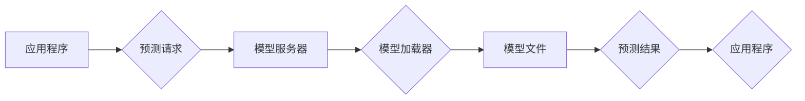

                 

## TensorFlow Serving性能优化

> 关键词：TensorFlow Serving, 模型部署, 性能优化, 模型压缩, 分布式部署, 预测加速

## 1. 背景介绍

随着深度学习技术的蓬勃发展，机器学习模型在各个领域得到广泛应用。然而，将训练好的模型部署到生产环境中并提供高效的预测服务仍然是一个重要的挑战。TensorFlow Serving (TFS) 作为 Google 开发的开源模型服务框架，为部署和管理 TensorFlow 模型提供了高效、可扩展的解决方案。

然而，在实际应用中，我们常常遇到 TFS 模型服务性能瓶颈的问题，例如预测延迟过高、吞吐量不足等。为了满足对实时性和高性能的需求，优化 TFS 模型服务的性能至关重要。

本篇文章将深入探讨 TensorFlow Serving 的性能优化策略，涵盖模型压缩、分布式部署、预测加速等多个方面，并结合实际案例和代码示例，帮助读者理解和实践 TFS 性能优化技术。

## 2. 核心概念与联系

TensorFlow Serving (TFS) 是一种高性能、可扩展的模型服务框架，用于部署和管理 TensorFlow 模型。它提供了一个统一的接口，允许应用程序轻松调用预训练的模型进行预测。

TFS 的核心概念包括：

* **模型仓库:** 用于存储模型文件的目录。
* **模型版本:** 模型的不同版本，方便管理和回滚。
* **模型服务器:** 负责加载模型并提供预测服务。
* **模型加载器:** 用于加载模型文件并将其转换为可执行的格式。
* **预测请求:** 来自应用程序的预测请求。
* **预测响应:** 模型服务器返回的预测结果。

TFS 的架构可以概括为以下流程：



## 3. 核心算法原理 & 具体操作步骤

### 3.1  算法原理概述

TFS 的性能优化主要围绕以下几个方面：

* **模型压缩:** 通过减少模型参数量，降低模型大小和内存占用，从而提高模型加载和推理速度。
* **模型并行:** 将模型拆分成多个子模型，并行执行预测任务，提高吞吐量。
* **预测加速:** 利用硬件加速器，例如 GPU 和 TPU，加速模型推理过程。
* **缓存机制:** 缓存模型预测结果，减少重复计算，提高预测效率。

### 3.2  算法步骤详解

**模型压缩:**

1. **量化:** 将模型参数的精度降低，例如将 32 位浮点数转换为 8 位整数。
2. **剪枝:** 删除模型中不重要的参数或连接，减少模型参数量。
3. **知识蒸馏:** 使用一个较小的模型学习一个较大的模型的知识，从而获得一个更小的模型。

**模型并行:**

1. **数据并行:** 将输入数据分成多个批次，分别输入到不同的模型实例进行预测。
2. **模型并行:** 将模型拆分成多个子模型，分别负责预测模型的不同部分。

**预测加速:**

1. **GPU 加速:** 利用 GPU 的并行计算能力加速模型推理过程。
2. **TPU 加速:** 利用 TPU 的专门设计架构加速模型推理过程。

**缓存机制:**

1. **模型缓存:** 将模型文件缓存到内存中，减少模型加载时间。
2. **预测结果缓存:** 将模型预测结果缓存到内存或磁盘中，减少重复计算。

### 3.3  算法优缺点

**模型压缩:**

* **优点:** 降低模型大小和内存占用，提高模型部署效率。
* **缺点:** 可能导致模型精度下降。

**模型并行:**

* **优点:** 提高模型推理速度和吞吐量。
* **缺点:** 需要额外的硬件资源和复杂度。

**预测加速:**

* **优点:** 显着提高模型推理速度。
* **缺点:** 需要专门的硬件设备。

**缓存机制:**

* **优点:** 减少重复计算，提高预测效率。
* **缺点:** 需要额外的内存空间和管理复杂度。

### 3.4  算法应用领域

TFS 性能优化技术广泛应用于以下领域：

* **图像识别:** 优化图像分类、目标检测等模型的推理速度。
* **自然语言处理:** 优化文本分类、机器翻译等模型的预测效率。
* **推荐系统:** 优化用户个性化推荐模型的响应时间。
* **工业控制:** 优化工业设备预测维护模型的实时性。

## 4. 数学模型和公式 & 详细讲解 & 举例说明

### 4.1  数学模型构建

模型压缩常用的数学模型包括：

* **量化模型:** 将模型参数从高精度浮点数转换为低精度整数。

量化公式:

$$
q(x) = \text{round}(x \cdot q_s)
$$

其中，$x$ 是原始参数，$q_s$ 是量化步长。

* **剪枝模型:** 通过移除模型中不重要的参数或连接，减少模型参数量。

剪枝算法通常基于模型权重大小或梯度信息进行选择。

### 4.2  公式推导过程

量化模型的精度损失可以通过以下公式推导:

$$
\text{Error} = |q(x) - x|
$$

其中，$q(x)$ 是量化后的参数，$x$ 是原始参数。

### 4.3  案例分析与讲解

假设一个模型参数为 3.14159，使用 8 位整数量化，量化步长为 0.1，则量化后的参数为 3.1。

$$
q(3.14159) = \text{round}(3.14159 \cdot 10) = 31
$$

此时，精度损失为:

$$
\text{Error} = |3.14159 - 3.1| = 0.04159
$$

## 5. 项目实践：代码实例和详细解释说明

### 5.1  开发环境搭建

* 安装 TensorFlow Serving:

```bash
pip install tensorflow-serving
```

* 下载预训练模型:

从 TensorFlow Hub 或其他模型仓库下载预训练模型文件。

### 5.2  源代码详细实现

```python
# 模型服务配置
model_config = {
    "model_name": "my_model",
    "model_base_path": "/path/to/model",
    "model_version": "1",
}

# 启动模型服务
from tensorflow_serving.apis import predict_pb2
from tensorflow_serving.model_servers import model_server

model_server.start(model_config)
```

### 5.3  代码解读与分析

* 模型服务配置: 定义模型名称、模型路径和模型版本。
* 启动模型服务: 使用 `model_server.start()` 方法启动模型服务。

### 5.4  运行结果展示

启动模型服务后，可以使用 `curl` 或其他工具发送预测请求到模型服务地址。

## 6. 实际应用场景

### 6.1  图像识别

TFS 可以部署图像分类、目标检测等模型，用于自动识别图像中的物体。

### 6.2  自然语言处理

TFS 可以部署文本分类、机器翻译等模型，用于处理自然语言文本。

### 6.3  推荐系统

TFS 可以部署用户个性化推荐模型，用于推荐用户感兴趣的内容。

### 6.4  未来应用展望

随着深度学习技术的不断发展，TFS 将在更多领域得到应用，例如：

* **医疗诊断:** 辅助医生进行疾病诊断。
* **金融风险控制:** 识别和预防金融风险。
* **智能驾驶:** 辅助车辆进行自动驾驶。

## 7. 工具和资源推荐

### 7.1  学习资源推荐

* TensorFlow Serving 官方文档: https://www.tensorflow.org/tfx/serving
* TensorFlow Serving GitHub 仓库: https://github.com/tensorflow/serving

### 7.2  开发工具推荐

* Docker: 用于容器化部署 TFS 模型服务。
* Kubernetes: 用于管理和部署 TFS 模型服务集群。

### 7.3  相关论文推荐

* TensorFlow Serving: A Flexible and Efficient Serving System for Machine Learning Models
* Model Compression and Optimization Techniques for Deep Learning

## 8. 总结：未来发展趋势与挑战

### 8.1  研究成果总结

TFS 提供了一个高效、可扩展的模型服务框架，为部署和管理 TensorFlow 模型提供了强大的工具。

### 8.2  未来发展趋势

* **更强大的模型压缩技术:** 进一步降低模型大小和内存占用，提高模型部署效率。
* **更智能的模型调度:** 根据模型负载和资源可用性，智能调度模型实例，提高资源利用率。
* **更完善的监控和管理工具:** 提供更全面的模型监控和管理功能，方便用户管理和维护模型服务。

### 8.3  面临的挑战

* **模型推理效率:** 随着模型规模的不断增长，模型推理效率仍然是一个挑战。
* **模型安全:** 模型服务的安全性和隐私保护也是一个重要的挑战。
* **模型可解释性:** 深度学习模型的决策过程往往难以解释，这对于一些应用场景来说是一个限制。

### 8.4  研究展望

未来，TFS 将继续朝着更高效、更智能、更安全的方向发展，为深度学习模型的部署和应用提供更强大的支持。

## 9. 附录：常见问题与解答

* **如何部署 TFS 模型服务?**

可以使用 Docker 或 Kubernetes 部署 TFS 模型服务。

* **如何优化 TFS 模型服务的性能?**

可以使用模型压缩、模型并行、预测加速和缓存机制等技术优化 TFS 模型服务的性能。

* **如何监控 TFS 模型服务的运行状态?**

可以使用 TFS 提供的监控工具或第三方监控工具监控模型服务的运行状态。


作者：禅与计算机程序设计艺术 / Zen and the Art of Computer Programming 
<end_of_turn>

