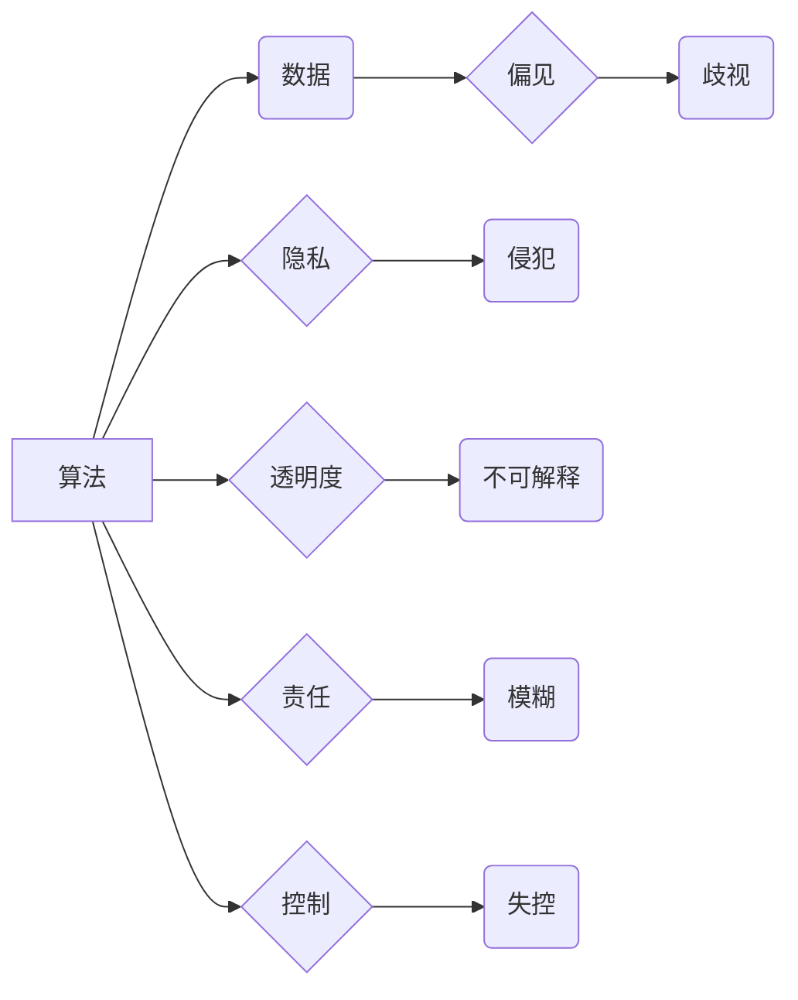

                 

## 人工智能伦理：人类计算的道德与责任

> 关键词：人工智能伦理、算法偏见、数据隐私、透明度、可解释性、责任归属、人类控制

### 1. 背景介绍

人工智能（AI）正以惊人的速度发展，其应用领域不断扩展，从医疗保健和金融到交通和娱乐，AI正在深刻地改变着我们的生活。然而，随着AI技术的进步，也引发了越来越多的伦理问题。如何确保AI技术的发展和应用符合人类的价值观和利益，成为一个亟待解决的难题。

人工智能伦理研究旨在探讨AI技术在各个领域的应用对人类社会产生的影响，并提出相应的道德准则和规范。它涉及到多个方面，包括算法的公平性、数据隐私的保护、透明度和可解释性、责任归属以及人类对AI技术的控制。

### 2. 核心概念与联系

**2.1 核心概念**

* **算法偏见:** 算法的训练数据可能包含社会偏见，导致算法在决策过程中产生歧视性结果。
* **数据隐私:** AI系统通常需要大量的数据进行训练和运行，这可能会侵犯个人的隐私权。
* **透明度和可解释性:** 许多AI算法过于复杂，其决策过程难以理解，这使得人们难以信任和监管AI系统。
* **责任归属:** 当AI系统导致负面后果时，谁应该承担责任？这个问题在法律和伦理上都存在争议。
* **人类控制:** 如何确保人类能够对AI系统进行有效控制，避免AI技术失控？

**2.2 核心概念架构**



### 3. 核心算法原理 & 具体操作步骤

**3.1 算法原理概述**

机器学习算法是AI的核心，它通过分析数据并学习模式来进行预测和决策。常见的机器学习算法包括监督学习、无监督学习和强化学习。

* **监督学习:**  算法通过标记数据进行训练，学习输入与输出之间的关系。例如，图像分类算法通过标记图像中的物体类别进行训练。
* **无监督学习:** 算法通过未标记数据进行训练，学习数据中的隐藏结构和模式。例如，聚类算法可以将数据点分组到不同的类别。
* **强化学习:** 算法通过与环境交互并获得奖励或惩罚来学习最佳策略。例如，游戏AI可以通过玩游戏并获得分数来学习最佳的游戏策略。

**3.2 算法步骤详解**

1. **数据收集和预处理:** 收集相关数据并进行清洗、转换和特征工程等预处理步骤。
2. **模型选择:** 根据具体任务选择合适的机器学习算法。
3. **模型训练:** 使用训练数据训练模型，调整模型参数以最小化预测误差。
4. **模型评估:** 使用测试数据评估模型的性能，例如准确率、召回率和F1-score。
5. **模型部署:** 将训练好的模型部署到实际应用场景中。

**3.3 算法优缺点**

* **优点:** 能够自动学习数据模式，提高预测精度，处理复杂数据。
* **缺点:** 容易受到数据偏见的影响，解释性较差，需要大量数据进行训练。

**3.4 算法应用领域**

* **医疗保健:** 疾病诊断、药物研发、个性化治疗。
* **金融:** 欺诈检测、风险评估、投资决策。
* **交通:** 自动驾驶、交通流量预测、道路安全。
* **娱乐:** 内容推荐、游戏AI、虚拟助手。

### 4. 数学模型和公式 & 详细讲解 & 举例说明

**4.1 数学模型构建**

机器学习算法通常使用数学模型来表示数据之间的关系。例如，线性回归模型使用线性方程来预测连续变量的值。

**4.2 公式推导过程**

线性回归模型的目标是找到一条直线，使得这条直线与数据点之间的距离最小。可以使用最小二乘法来推导模型参数。

**损失函数:**

$$
J(\theta) = \frac{1}{2m} \sum_{i=1}^{m} (h_\theta(x^{(i)}) - y^{(i)})^2
$$

其中：

* $J(\theta)$ 是损失函数，表示模型预测值与真实值之间的误差。
* $\theta$ 是模型参数。
* $m$ 是训练数据的样本数量。
* $h_\theta(x^{(i)})$ 是模型预测值。
* $y^{(i)}$ 是真实值。

**梯度下降法:**

$$
\theta = \theta - \alpha \nabla J(\theta)
$$

其中：

* $\alpha$ 是学习率。
* $\nabla J(\theta)$ 是损失函数的梯度。

**4.3 案例分析与讲解**

假设我们想要预测房屋价格，可以使用线性回归模型。

* **输入特征:** 房屋面积、房间数量、地理位置等。
* **输出变量:** 房屋价格。

我们可以使用训练数据来训练线性回归模型，并使用测试数据来评估模型的性能。

### 5. 项目实践：代码实例和详细解释说明

**5.1 开发环境搭建**

可以使用Python语言和相关的机器学习库，例如Scikit-learn，来实现AI项目。

**5.2 源代码详细实现**

```python
from sklearn.linear_model import LinearRegression
from sklearn.model_selection import train_test_split
import pandas as pd

# 加载数据
data = pd.read_csv('house_price.csv')

# 分割数据
X = data[['area', 'rooms']]
y = data['price']
X_train, X_test, y_train, y_test = train_test_split(X, y, test_size=0.2)

# 创建线性回归模型
model = LinearRegression()

# 训练模型
model.fit(X_train, y_train)

# 预测测试数据
y_pred = model.predict(X_test)

# 评估模型性能
print('模型准确率:', model.score(X_test, y_test))
```

**5.3 代码解读与分析**

* 首先，我们加载数据并将其分割成训练集和测试集。
* 然后，我们创建线性回归模型并使用训练集进行训练。
* 训练完成后，我们可以使用测试集来评估模型的性能。

**5.4 运行结果展示**

运行代码后，会输出模型的准确率，例如0.85，表示模型在预测房屋价格方面达到了85%的准确率。

### 6. 实际应用场景

**6.1 医疗保健**

* **疾病诊断:** AI算法可以分析患者的医疗影像、基因数据和病历信息，辅助医生进行疾病诊断。
* **药物研发:** AI可以加速药物研发过程，例如预测药物的有效性、安全性以及潜在的副作用。

**6.2 金融**

* **欺诈检测:** AI可以分析交易数据，识别异常行为并预防金融欺诈。
* **风险评估:** AI可以评估客户的信用风险，帮助金融机构做出更明智的贷款决策。

**6.3 交通**

* **自动驾驶:** AI是自动驾驶汽车的核心技术，可以帮助车辆感知周围环境、做出决策并控制行驶。
* **交通流量预测:** AI可以分析交通数据，预测交通流量变化，帮助优化交通管理。

**6.4 未来应用展望**

* **个性化教育:** AI可以根据学生的学习进度和风格提供个性化的学习方案。
* **智能制造:** AI可以提高制造业的效率和自动化程度。
* **环境保护:** AI可以帮助监测环境污染、预测自然灾害和开发可持续能源。

### 7. 工具和资源推荐

**7.1 学习资源推荐**

* **在线课程:** Coursera、edX、Udacity等平台提供丰富的AI课程。
* **书籍:** 《深度学习》、《人工智能：一种现代方法》等书籍。
* **开源项目:** TensorFlow、PyTorch等开源项目可以帮助你实践AI技术。

**7.2 开发工具推荐**

* **Python:** 广泛用于AI开发的编程语言。
* **Scikit-learn:** Python机器学习库。
* **TensorFlow:** Google开发的开源深度学习框架。
* **PyTorch:** Facebook开发的开源深度学习框架。

**7.3 相关论文推荐**

* **《ImageNet Classification with Deep Convolutional Neural Networks》**
* **《Attention Is All You Need》**
* **《BERT: Pre-training of Deep Bidirectional Transformers for Language Understanding》**

### 8. 总结：未来发展趋势与挑战

**8.1 研究成果总结**

近年来，AI技术取得了长足的进步，在各个领域都展现出巨大的潜力。

**8.2 未来发展趋势**

* **更强大的计算能力:** 随着硬件技术的进步，AI模型将变得更加强大和复杂。
* **更丰富的应用场景:** AI技术将应用到更多领域，例如医疗保健、教育、金融等。
* **更注重伦理和可解释性:** 人们将更加关注AI技术的伦理问题和可解释性。

**8.3 面临的挑战**

* **数据隐私和安全:** AI系统需要大量数据进行训练，如何保护数据隐私和安全是一个重要的挑战。
* **算法偏见:** 算法的训练数据可能包含社会偏见，导致算法产生歧视性结果。
* **责任归属:** 当AI系统导致负面后果时，谁应该承担责任？这个问题在法律和伦理上都存在争议。

**8.4 研究展望**

未来，AI研究将更加注重伦理、可解释性和安全性。我们需要开发出更加公平、透明和可控的AI系统，确保AI技术真正造福人类。

### 9. 附录：常见问题与解答

**9.1 如何避免算法偏见？**

* 使用更加多样化的训练数据。
* 开发算法检测和缓解偏见的机制。
* 提高算法的可解释性，以便更好地理解算法的决策过程。

**9.2 如何保护数据隐私？**

* 使用匿名化技术处理敏感数据。
* 加强数据安全防护措施。
* 明确数据使用规则和隐私政策。

**9.3 如何确保人类对AI技术的控制？**

* 开发人类-AI协作的系统。
* 建立AI伦理规范和监管机制。
* 提高公众对AI技术的理解和参与。


作者：禅与计算机程序设计艺术 / Zen and the Art of Computer Programming 
<end_of_turn>

