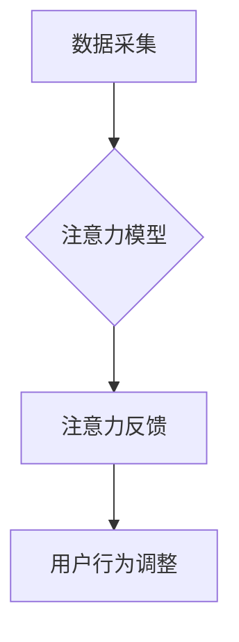

                 

## 人类注意力增强：提升专注力和注意力在商业中的未来发展机遇分析机遇挑战机遇趋势

> 关键词：注意力增强、专注力、深度学习、脑机接口、商业应用、未来趋势、挑战

## 1. 背景介绍

在当今信息爆炸的时代，人类面临着前所未有的注意力挑战。来自社交媒体、电子邮件、新闻推送等各种信息源的不断轰炸，使得人们难以集中精力完成任务，效率低下，认知疲劳加剧。注意力力的下降不仅影响个人生活，也对商业发展造成严重阻碍。

商业领域对专注力的需求日益增长。高效的决策、创新思维、高质量的客户服务都离不开高度的注意力集中。然而，注意力力的下降正在成为企业面临的一大难题。员工难以专注于工作，容易分心，导致工作效率降低，项目进度延误，最终影响企业竞争力。

因此，如何提升人类注意力，增强专注力，成为当今社会和商业领域亟待解决的关键问题。

## 2. 核心概念与联系

**2.1 注意力增强**

注意力增强是指通过技术手段帮助人们提升专注力，减少干扰，提高信息处理效率的策略。

**2.2 专注力**

专注力是指人们能够将注意力集中在特定目标或任务上，排除干扰的能力。

**2.3 商业应用**

注意力增强技术在商业领域有着广泛的应用前景，例如：

* **提升员工工作效率:** 通过注意力增强工具，帮助员工集中注意力，提高工作效率，减少错误率。
* **增强客户服务体验:** 利用注意力增强技术，帮助客服人员更好地理解客户需求，提供更精准的服务。
* **促进创新思维:** 通过注意力增强，帮助员工突破思维定式，激发创新灵感。
* **提高营销效果:** 利用注意力增强技术，帮助广告更精准地触达目标受众，提高营销效果。

**2.4 核心架构**

注意力增强技术通常由以下几个核心模块组成：



* **数据采集:** 收集用户脑电波、眼动轨迹、生理指标等数据，作为注意力模型的输入。
* **注意力模型:** 利用深度学习算法，分析用户数据，识别注意力状态，并预测用户注意力可能转移的趋势。
* **注意力反馈:** 将注意力模型的预测结果反馈给用户，例如通过声音提示、视觉提醒等方式，提醒用户注意力的转移。
* **用户行为调整:** 根据注意力反馈，用户可以调整自己的行为，例如减少干扰、调整工作姿势等，以提高注意力集中度。

## 3. 核心算法原理 & 具体操作步骤

### 3.1 算法原理概述

注意力增强技术主要依赖于深度学习算法，特别是卷积神经网络（CNN）和循环神经网络（RNN）。

* **CNN:** 用于提取用户脑电波、眼动轨迹等数据中的特征，识别注意力状态。
* **RNN:** 用于分析用户行为序列，预测用户注意力可能转移的趋势。

### 3.2 算法步骤详解

1. **数据预处理:** 收集用户脑电波、眼动轨迹、生理指标等数据，进行清洗、去噪、特征提取等预处理操作。
2. **模型训练:** 利用深度学习算法，训练CNN和RNN模型，使其能够准确识别用户注意力状态和预测注意力转移趋势。
3. **注意力反馈:** 将训练好的模型应用于实时数据，预测用户注意力状态，并根据预测结果生成注意力反馈信号。
4. **用户行为调整:** 用户根据注意力反馈信号，调整自己的行为，例如减少干扰、调整工作姿势等，以提高注意力集中度。

### 3.3 算法优缺点

**优点:**

* **高精度:** 深度学习算法能够学习到复杂的数据模式，识别用户注意力状态的精度较高。
* **实时性:** 注意力增强技术能够实时监测用户注意力状态，并及时提供反馈。
* **可定制性:** 注意力增强技术可以根据用户的不同需求和场景进行定制。

**缺点:**

* **数据依赖:** 深度学习算法需要大量的训练数据，数据质量直接影响模型性能。
* **计算资源:** 训练深度学习模型需要大量的计算资源，成本较高。
* **隐私问题:** 注意力增强技术需要收集用户的脑电波、眼动轨迹等敏感数据，需要妥善处理用户隐私问题。

### 3.4 算法应用领域

注意力增强技术在以下领域有着广泛的应用前景：

* **教育:** 帮助学生集中注意力，提高学习效率。
* **医疗:** 辅助医生诊断疾病，提高治疗效果。
* **游戏:** 提升游戏体验，增强玩家沉浸感。
* **交通安全:** 帮助驾驶员保持注意力，预防交通事故。

## 4. 数学模型和公式 & 详细讲解 & 举例说明

### 4.1 数学模型构建

注意力增强模型通常采用基于深度学习的架构，例如Transformer模型。Transformer模型的核心是注意力机制，它能够学习到输入序列中不同元素之间的关系，并根据这些关系分配注意力权重。

### 4.2 公式推导过程

注意力机制的核心公式如下：

$$
Attention(Q, K, V) = softmax(\frac{QK^T}{\sqrt{d_k}})V
$$

其中：

* $Q$：查询矩阵
* $K$：键矩阵
* $V$：值矩阵
* $d_k$：键向量的维度
* $softmax$：softmax函数

该公式计算了查询向量与键向量的相似度，并根据相似度分配注意力权重。注意力权重乘以值矩阵，得到最终的注意力输出。

### 4.3 案例分析与讲解

假设我们有一个句子：“我爱学习编程”。

* $Q$：查询向量表示“学习”这个词。
* $K$：键向量表示每个词的语义信息。
* $V$：值向量表示每个词的词向量表示。

注意力机制会计算“学习”这个词与每个词的相似度，并根据相似度分配注意力权重。例如，“编程”这个词与“学习”的相似度较高，因此会获得更高的注意力权重。最终的注意力输出会包含每个词的加权平均值，其中“编程”的权重较高。

## 5. 项目实践：代码实例和详细解释说明

### 5.1 开发环境搭建

* Python 3.7+
* TensorFlow 2.0+
* PyTorch 1.0+
* Jupyter Notebook

### 5.2 源代码详细实现

```python
import tensorflow as tf

# 定义注意力机制
def attention_mechanism(query, key, value, mask=None):
    # 计算查询向量与键向量的相似度
    scores = tf.matmul(query, key, transpose_b=True) / tf.math.sqrt(tf.cast(key.shape[-1], tf.float32))
    # 应用掩码
    if mask is not None:
        scores += (1 - tf.cast(mask, tf.float32)) * -1e9
    # 计算注意力权重
    attention_weights = tf.nn.softmax(scores, axis=-1)
    # 计算注意力输出
    attention_output = tf.matmul(attention_weights, value)
    return attention_output, attention_weights

# 示例代码
query = tf.random.normal([1, 5, 64])
key = tf.random.normal([1, 10, 64])
value = tf.random.normal([1, 10, 128])

attention_output, attention_weights = attention_mechanism(query, key, value)
print(attention_output.shape)
print(attention_weights.shape)
```

### 5.3 代码解读与分析

* `attention_mechanism` 函数实现了注意力机制的核心逻辑。
* `scores` 计算了查询向量与键向量的相似度。
* `mask` 用于屏蔽不需要关注的元素。
* `attention_weights` 计算了注意力权重。
* `attention_output` 计算了注意力输出。

### 5.4 运行结果展示

运行上述代码，会输出注意力输出和注意力权重的形状。

## 6. 实际应用场景

### 6.1 提升员工工作效率

注意力增强技术可以帮助员工集中注意力，减少干扰，提高工作效率。例如，一些企业已经开始使用脑机接口设备，帮助员工在工作时监测注意力状态，并提供及时提醒，避免分心。

### 6.2 增强客户服务体验

注意力增强技术可以帮助客服人员更好地理解客户需求，提供更精准的服务。例如，一些客服系统已经开始使用语音识别和自然语言处理技术，结合注意力增强模型，能够更准确地识别客户的意图，并提供更个性化的服务。

### 6.3 促进创新思维

注意力增强技术可以帮助员工突破思维定式，激发创新灵感。例如，一些企业已经开始使用沉浸式虚拟现实技术，结合注意力增强模型，帮助员工进行沉浸式思考，更容易产生新的创意。

### 6.4 未来应用展望

注意力增强技术在未来将有更广泛的应用场景，例如：

* **个性化教育:** 根据学生的注意力状态，提供个性化的学习内容和学习方式。
* **远程医疗:** 帮助医生远程诊断疾病，并提供个性化的治疗方案。
* **智能驾驶:** 帮助驾驶员保持注意力，预防交通事故。
* **增强现实:** 增强现实应用中，注意力增强技术可以帮助用户更好地沉浸在虚拟世界中。

## 7. 工具和资源推荐

### 7.1 学习资源推荐

* **书籍:**
    * 《深度学习》
    * 《注意力机制》
* **在线课程:**
    * Coursera: 深度学习
    * Udacity: 自然语言处理
* **博客:**
    * TensorFlow Blog
    * PyTorch Blog

### 7.2 开发工具推荐

* **TensorFlow:** 开源深度学习框架
* **PyTorch:** 开源深度学习框架
* **Keras:** 高级深度学习API

### 7.3 相关论文推荐

* **Attention Is All You Need**
* **BERT: Pre-training of Deep Bidirectional Transformers for Language Understanding**
* **Transformer-XL: Attentive Language Models Beyond a Fixed-Length Context**

## 8. 总结：未来发展趋势与挑战

### 8.1 研究成果总结

注意力增强技术近年来取得了显著进展，特别是深度学习算法的应用，使得注意力增强模型的精度和效率大幅提升。

### 8.2 未来发展趋势

* **更精准的注意力模型:** 研究更精准的注意力模型，能够更准确地识别用户注意力状态和预测注意力转移趋势。
* **更广泛的应用场景:** 将注意力增强技术应用到更多领域，例如教育、医疗、交通安全等。
* **更便捷的用户体验:** 开发更便捷的用户体验，例如无感注意力增强、脑机接口等。

### 8.3 面临的挑战

* **数据隐私:** 注意力增强技术需要收集用户的敏感数据，需要妥善处理用户隐私问题。
* **算法解释性:** 深度学习模型的解释性较差，难以理解模型的决策过程。
* **成本问题:** 训练深度学习模型需要大量的计算资源，成本较高。

### 8.4 研究展望

未来，注意力增强技术将继续朝着更精准、更广泛、更便捷的方向发展。研究人员将继续探索更有效的注意力模型，并解决数据隐私、算法解释性和成本等问题，推动注意力增强技术在商业领域的应用。

## 9. 附录：常见问题与解答

**Q1: 注意力增强技术是否安全可靠？**

A1: 目前，注意力增强技术已经取得了一定的安全性和可靠性，但仍存在一些潜在风险。例如，恶意攻击者可能利用注意力增强技术进行信息窃取或心理操控。因此，在使用注意力增强技术时，需要谨慎选择供应商，并采取必要的安全措施。

**Q2: 注意力增强技术是否会让人变得过度依赖？**

A2: 注意力增强技术本身不会让人变得过度依赖，但过度使用可能会导致一些负面影响，例如降低用户的自主学习能力和注意力调节能力。因此，需要合理使用注意力增强技术，并保持用户的自主性。

**Q3: 注意力增强技术对个人隐私有哪些影响？**

A3: 注意力增强技术需要收集用户的脑电波、眼动轨迹等敏感数据，因此需要妥善处理用户隐私问题。例如，数据加密、匿名化处理等技术可以帮助保护用户的隐私。

**Q4: 注意力增强技术的发展前景如何？**

A4: 注意力增强技术的发展前景非常广阔，未来将有更广泛的应用场景，例如教育、医疗、交通安全等。随着技术的进步，注意力增强技术将更加精准、便捷、安全可靠，为人们的生活和工作带来更多便利。


作者：禅与计算机程序设计艺术 / Zen and the Art of Computer Programming 
<end_of_turn>

