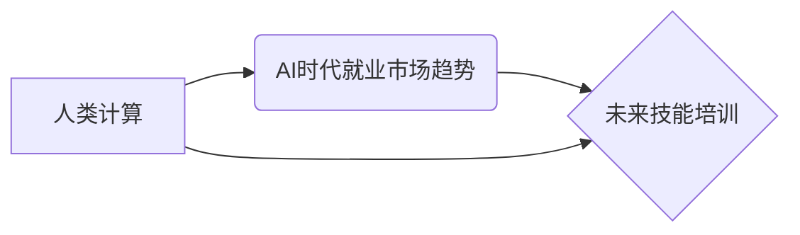

                 

## 人类计算：AI时代的未来技能培训与就业市场趋势

> 关键词：人工智能、人类计算、未来技能、就业市场、数字转型、数据分析、机器学习、深度学习、自然语言处理

## 1. 背景介绍

人工智能（AI）技术近年来发展迅速，正在深刻地改变着我们的生活和工作方式。从自动驾驶汽车到智能语音助手，AI已经渗透到各个领域，并展现出巨大的潜力。然而，AI的发展也带来了新的挑战，例如算法偏见、数据隐私和就业市场变化。

在AI时代，人类与机器的合作将变得越来越重要。人类需要学习如何与AI协同工作，并利用AI的力量提升自身的能力。因此，培养适应AI时代的未来技能，成为个人和社会共同面临的重要课题。

## 2. 核心概念与联系

**2.1 人类计算**

人类计算是指利用人类的认知能力和创造力，与计算机技术相结合，共同完成复杂的任务。它强调人类在AI时代仍然不可替代的作用，例如：

* **批判性思维和解决问题的能力:** AI可以提供数据和分析结果，但人类需要对这些信息进行批判性思考，并做出最终的决策。
* **创造力和创新能力:** AI擅长模仿和学习，但人类拥有独特的创造力和创新能力，能够提出新的想法和解决方案。
* **情感智能和沟通能力:** AI缺乏情感和社交能力，人类需要与他人进行有效沟通，建立信任和合作关系。

**2.2 AI时代就业市场趋势**

AI技术的发展将对就业市场产生深远影响，一些传统工作岗位可能会被自动化取代，但也将涌现出新的工作机会。

* **自动化取代:** AI可以自动化许多重复性、规则性工作，例如数据录入、客服服务等。
* **新岗位涌现:** AI技术的发展也催生了许多新的工作岗位，例如AI工程师、数据科学家、AI伦理学家等。
* **技能需求变化:** 未来就业市场将更加重视具备数据分析、编程、机器学习等技能的人才。

**2.3 未来技能培训**

为了适应AI时代，个人和企业需要不断学习和提升自身技能。未来技能培训应注重以下几个方面：

* **数据分析和可视化:** 掌握数据分析和可视化工具，能够从海量数据中提取有价值的信息。
* **编程和软件开发:** 掌握编程语言和软件开发工具，能够开发和维护AI应用程序。
* **机器学习和深度学习:** 了解机器学习和深度学习算法，能够应用AI技术解决实际问题。
* **自然语言处理:** 掌握自然语言处理技术，能够与AI系统进行自然流畅的对话。
* **跨学科知识:** 具备跨学科的知识背景，能够将AI技术应用于不同的领域。

**2.4  核心概念关系流程图**



## 3. 核心算法原理 & 具体操作步骤

**3.1 算法原理概述**

人类计算的核心算法原理是将人类的认知能力和计算机技术相结合，通过以下几个步骤实现：

1. **数据收集和预处理:** 收集相关数据，并进行清洗、转换和格式化等预处理操作。
2. **特征提取:** 从数据中提取具有代表性的特征，用于训练AI模型。
3. **模型训练:** 使用机器学习算法训练AI模型，使其能够识别和理解数据中的模式。
4. **模型评估和优化:** 对训练好的模型进行评估，并根据评估结果进行优化调整。
5. **模型应用:** 将训练好的模型应用于实际问题中，例如预测、分类、识别等。

**3.2 算法步骤详解**

* **数据收集和预处理:** 

    * 确定需要收集的数据类型和来源。
    * 使用爬虫、API等工具收集数据。
    * 对收集到的数据进行清洗，去除重复数据、错误数据等。
    * 对数据进行转换，例如将文本数据转换为数字数据。
    * 对数据进行格式化，例如将数据存储到数据库中。

* **特征提取:**

    * 选择合适的特征提取方法，例如词袋模型、TF-IDF、Word2Vec等。
    * 从数据中提取具有代表性的特征，例如文本中的关键词、图像中的颜色特征等。
    * 将提取的特征转换为机器学习模型可以理解的格式。

* **模型训练:**

    * 选择合适的机器学习算法，例如线性回归、逻辑回归、决策树、支持向量机等。
    * 使用训练数据训练模型，使其能够学习数据中的模式。
    * 使用交叉验证等方法评估模型的性能。

* **模型评估和优化:**

    * 使用测试数据评估模型的性能，例如准确率、召回率、F1-score等。
    * 根据评估结果对模型进行优化调整，例如调整模型参数、增加训练数据等。

* **模型应用:**

    * 将训练好的模型应用于实际问题中，例如预测客户购买行为、识别图像中的物体等。
    * 监控模型的性能，并定期进行更新和维护。

**3.3 算法优缺点**

* **优点:**

    * 可以利用人类的认知能力和创造力，解决复杂问题。
    * 可以提高工作效率和准确性。
    * 可以促进人类与机器的协作。

* **缺点:**

    * 需要大量的训练数据和计算资源。
    * 模型的训练和优化需要专业知识和经验。
    * 存在算法偏见和数据隐私等问题。

**3.4 算法应用领域**

* **医疗保健:** 辅助医生诊断疾病、预测患者风险、个性化治疗方案。
* **金融服务:** 风险评估、欺诈检测、客户服务自动化。
* **教育:** 个性化学习、智能辅导、自动批改作业。
* **制造业:** 工厂自动化、质量控制、预测性维护。
* **零售业:** 商品推荐、库存管理、客户关系管理。

## 4. 数学模型和公式 & 详细讲解 & 举例说明

**4.1 数学模型构建**

人类计算的数学模型通常基于统计学和机器学习理论。常用的模型包括：

* **线性回归模型:** 用于预测连续变量，例如房价、股票价格等。
* **逻辑回归模型:** 用于分类问题，例如判断邮件是否为垃圾邮件。
* **决策树模型:** 用于分类和回归问题，能够处理非线性关系。
* **支持向量机模型:** 用于分类问题，能够处理高维数据。
* **神经网络模型:** 用于复杂问题，例如图像识别、自然语言处理等。

**4.2 公式推导过程**

每个模型都有其特定的公式推导过程，例如线性回归模型的损失函数为：

$$
L(w,b) = \frac{1}{n} \sum_{i=1}^{n} (y_i - (wx_i + b))^2
$$

其中：

* $w$ 为模型参数
* $b$ 为模型偏置
* $n$ 为样本数量
* $y_i$ 为真实值
* $x_i$ 为特征值

**4.3 案例分析与讲解**

例如，在图像识别任务中，可以使用卷积神经网络模型进行训练。卷积神经网络模型通过多个卷积层和池化层提取图像特征，最终输出分类结果。

**4.3.1  卷积层:**

卷积层使用卷积核对图像进行卷积运算，提取图像局部特征。

**4.3.2  池化层:**

池化层对卷积层的输出进行降维，减少计算量并提高模型鲁棒性。

**4.3.3  全连接层:**

全连接层将池化层的输出连接起来，进行分类决策。

## 5. 项目实践：代码实例和详细解释说明

**5.1 开发环境搭建**

* 安装Python编程语言和相关库，例如NumPy、Pandas、Scikit-learn等。
* 选择合适的深度学习框架，例如TensorFlow、PyTorch等。
* 设置开发环境变量和路径。

**5.2 源代码详细实现**

```python
# 导入必要的库
import numpy as np
from sklearn.linear_model import LinearRegression

# 创建训练数据
X = np.array([[1, 2], [3, 4], [5, 6]])
y = np.array([3, 7, 11])

# 创建线性回归模型
model = LinearRegression()

# 训练模型
model.fit(X, y)

# 预测新数据
new_data = np.array([[7, 8]])
prediction = model.predict(new_data)

# 打印预测结果
print(prediction)
```

**5.3 代码解读与分析**

* 首先，导入必要的库，例如NumPy用于数值计算、Scikit-learn用于机器学习算法。
* 然后，创建训练数据，包括特征数据X和目标数据y。
* 创建线性回归模型，并使用fit()方法训练模型。
* 使用predict()方法预测新数据，并打印预测结果。

**5.4 运行结果展示**

运行以上代码，将输出预测结果，例如：

```
[15. ]
```

## 6. 实际应用场景

**6.1 医疗保健**

* **疾病诊断辅助:** 利用AI算法分析患者的病历、影像数据等，辅助医生进行疾病诊断。
* **个性化治疗方案:** 根据患者的基因信息、生活习惯等，制定个性化的治疗方案。
* **药物研发:** 利用AI算法加速药物研发过程，例如预测药物的活性、安全性等。

**6.2 金融服务**

* **风险评估:** 利用AI算法分析客户的信用记录、交易行为等，评估客户的风险等级。
* **欺诈检测:** 利用AI算法识别异常交易行为，防止金融欺诈。
* **客户服务自动化:** 利用AI聊天机器人提供客户服务，例如回答常见问题、处理简单的交易请求等。

**6.3 教育**

* **个性化学习:** 根据学生的学习进度和能力，提供个性化的学习内容和学习路径。
* **智能辅导:** 利用AI算法解答学生的疑问，提供学习指导。
* **自动批改作业:** 利用AI算法自动批改学生的作业，节省教师的时间和精力。

**6.4 未来应用展望**

* **更智能的AI助手:** AI助手将更加智能化，能够理解和响应更复杂的指令，并提供更个性化的服务。
* **更广泛的应用场景:** AI技术将应用于更多领域，例如交通运输、能源管理、环境保护等。
* **更深入的人机交互:** 人机交互方式将更加自然和人性化，例如语音控制、体感交互等。

## 7. 工具和资源推荐

**7.1 学习资源推荐**

* **在线课程:** Coursera、edX、Udacity等平台提供丰富的AI课程。
* **书籍:** 《深度学习》、《机器学习实战》等书籍是学习AI的基础教材。
* **开源项目:** TensorFlow、PyTorch等开源项目可以帮助你实践AI技术。

**7.2 开发工具推荐**

* **Python:** 作为AI开发的主要编程语言，Python拥有丰富的库和工具。
* **Jupyter Notebook:** 用于编写和运行Python代码，并可视化数据和模型结果。
* **TensorFlow:** Google开发的开源深度学习框架。
* **PyTorch:** Facebook开发的开源深度学习框架。

**7.3 相关论文推荐**

* **《ImageNet Classification with Deep Convolutional Neural Networks》:** 介绍了AlexNet模型，标志着深度学习在图像识别领域的突破。
* **《Attention Is All You Need》:** 介绍了Transformer模型，在自然语言处理领域取得了重大进展。
* **《BERT: Pre-training of Deep Bidirectional Transformers for Language Understanding》:** 介绍了BERT模型，在自然语言理解任务中取得了优异的性能。

## 8. 总结：未来发展趋势与挑战

**8.1 研究成果总结**

近年来，AI技术取得了长足的进步，在各个领域都展现出巨大的潜力。深度学习算法的突破，使得AI模型能够处理更复杂的数据，并取得更优异的性能。

**8.2 未来发展趋势**

* **更强大的AI模型:** 研究人员将继续开发更强大的AI模型，例如通用人工智能（AGI）。
* **更广泛的应用场景:** AI技术将应用于更多领域，例如医疗保健、教育、金融服务等。
* **更深入的人机交互:** 人机交互方式将更加自然和人性化，例如语音控制、体感交互等。

**8.3 面临的挑战**

* **算法偏见:** AI模型可能存在算法偏见，导致不公平的结果。
* **数据隐私:** AI模型需要大量数据进行训练，如何保护数据隐私是一个重要问题。
* **伦理问题:** AI技术的发展也带来了一些伦理问题，例如AI的责任和义务、AI对就业的影响等。

**8.4 研究展望**

未来，AI研究将更加注重解决算法偏见、数据隐私和伦理问题，并探索更安全、更可靠、更可解释的AI技术。


## 9. 附录：常见问题与解答

**9.1 如何学习AI技术？**

* 参加在线课程、阅读书籍、参与开源项目等。
* 关注AI领域的最新研究成果和技术发展趋势。
* 与其他AI爱好者交流学习，共同进步。

**9.2 AI技术对就业市场的影响？**

* AI技术将自动化一些传统工作岗位，但也将创造出新的工作机会。
* 未来就业市场将更加重视具备数据分析、编程、机器学习等技能的人才。

**9.3 如何应对AI带来的挑战？**

* 关注AI技术的发展趋势，不断学习和提升自身技能。
* 积极参与AI技术应用的探索和实践。
* 关注AI技术带来的伦理问题，并积极参与讨论和解决。


作者：禅与计算机程序设计艺术 / Zen and the Art of Computer Programming 
<end_of_turn>

