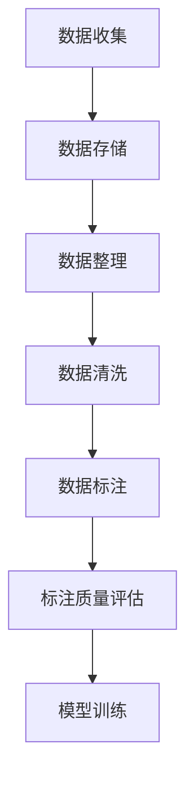
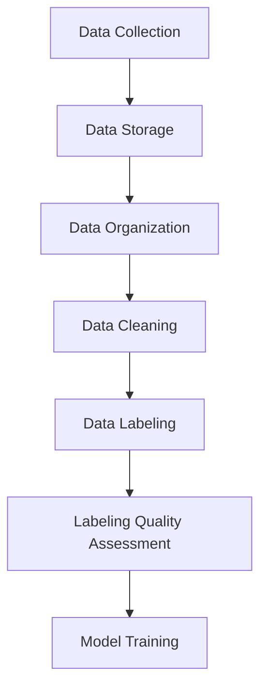
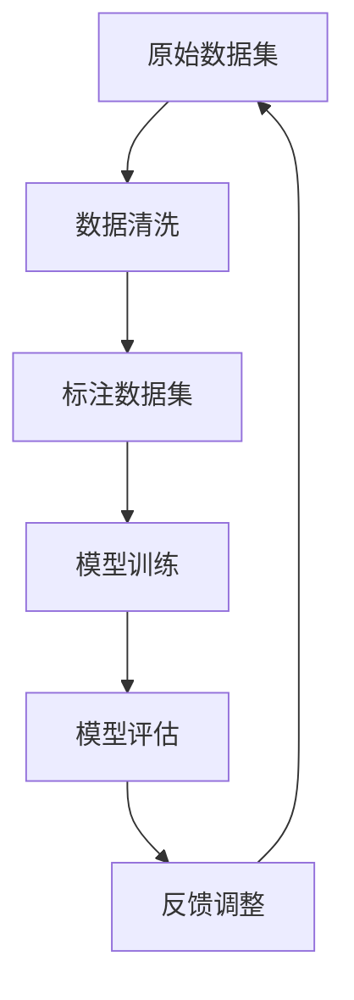
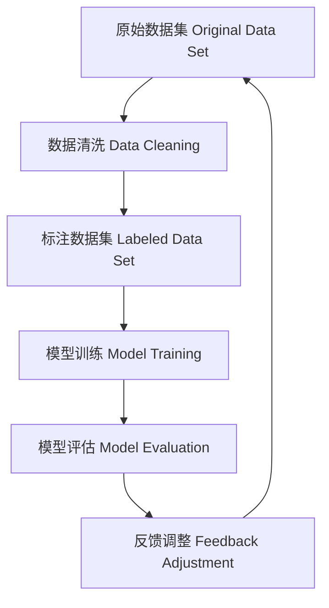

                 

## 1. 背景介绍（Background Introduction）

在当今的数据驱动时代，数据集的积累、清洗和标注成为软件工程领域中的重要环节。特别是在软件2.0时代，数据质量和标注的准确性对模型性能和应用效果具有决定性的影响。软件2.0工程师不仅需要具备传统的编程技能，更需要对数据集积累、清洗和标注有深刻的理解和实践经验。

### 1.1 数据集积累的重要性

数据集积累是构建高质量机器学习模型的基础。一个丰富且多样性的数据集能够帮助模型更好地理解现实世界的复杂性，从而提高模型的泛化能力。然而，数据集的积累并非易事，它涉及到数据来源的确定、数据格式的标准化、数据质量的控制等多个方面。

### 1.2 数据清洗的必要性

数据清洗是数据预处理的关键步骤，其目的是去除数据集中的噪声和异常值，确保数据的一致性和完整性。在数据清洗过程中，软件2.0工程师需要运用多种技术和工具，如缺失值处理、重复值删除、数据转换等，以确保数据的质量。

### 1.3 数据标注的价值

数据标注是将原始数据转化为可用于训练模型的数据的关键步骤。在标注过程中，软件2.0工程师需要定义标注标准、选择合适的标注工具，并组织标注团队进行大规模的标注工作。数据标注的质量直接影响到模型训练的效果。

### 1.4 软件2.0工程师的角色

软件2.0工程师在数据集积累、清洗和标注过程中扮演着多重角色。他们需要熟悉数据处理技术和工具，能够设计和实施高效的数据清洗流程，同时还需要具备良好的项目管理能力，确保数据标注的顺利进行。

## 1. Background Introduction

In today's data-driven era, data accumulation, cleaning, and labeling have become critical aspects in the field of software engineering. In particular, during the software 2.0 era, the quality and accuracy of data sets are crucial for model performance and application effectiveness. Software 2.0 engineers not only need traditional programming skills but also a deep understanding and practical experience in data accumulation, cleaning, and labeling.

### 1.1 The Importance of Data Accumulation

Data accumulation is the foundation for building high-quality machine learning models. A rich and diverse data set can help models better understand the complexity of the real world, thereby improving their generalization ability. However, data accumulation is not easy, involving aspects such as determining data sources, standardizing data formats, and controlling data quality.

### 1.2 The Necessity of Data Cleaning

Data cleaning is a key step in data preprocessing, aimed at removing noise and outliers from data sets to ensure consistency and integrity. In the process of data cleaning, software 2.0 engineers need to apply various techniques and tools, such as handling missing values, deleting duplicates, and data transformation, to ensure data quality.

### 1.3 The Value of Data Labeling

Data labeling is the crucial step of transforming raw data into data that can be used for model training. In the labeling process, software 2.0 engineers need to define labeling standards, select appropriate labeling tools, and organize labeling teams for large-scale labeling work. The quality of data labeling directly affects the effectiveness of model training.

### 1.4 The Role of Software 2.0 Engineers

Software 2.0 engineers play multiple roles in the process of data accumulation, cleaning, and labeling. They need to be familiar with data processing techniques and tools, capable of designing and implementing efficient data cleaning workflows, and also need to have good project management skills to ensure the smooth progress of data labeling.

## 2. 核心概念与联系（Core Concepts and Connections）

在数据集积累、清洗和标注的过程中，软件2.0工程师需要掌握一系列核心概念和工具。以下是几个关键概念及其相互联系：

### 2.1 数据集积累

数据集积累涉及到数据的收集、存储和整理。它通常包括以下步骤：

1. **数据收集**：通过Web爬虫、API调用、数据库导入等方式获取数据。
2. **数据存储**：使用数据库、数据湖或云存储服务来存储大量数据。
3. **数据整理**：通过去重、去噪声、数据转换等步骤，将原始数据转化为适合模型训练的形式。

### 2.2 数据清洗

数据清洗是确保数据质量的关键步骤。它包括以下技术：

1. **缺失值处理**：通过填充、删除或预测缺失值来处理缺失数据。
2. **异常值处理**：检测并处理异常值，如错误输入或重复数据。
3. **数据转换**：将数据格式、类型或规模转换为适合模型训练的形式。

### 2.3 数据标注

数据标注是将原始数据转化为标注数据的过程，其质量直接影响到模型的准确性。数据标注涉及以下方面：

1. **标注标准**：定义标注规则和标准，确保标注的一致性。
2. **标注工具**：使用自动或半自动标注工具进行大规模标注工作。
3. **标注质量评估**：通过交叉验证、一致性评估等方法评估标注质量。

### 2.4 数据集积累、清洗和标注的联系

数据集积累、清洗和标注是紧密联系的。一个高质量的数据集不仅需要丰富的数据来源和良好的数据收集方法，还需要通过有效的数据清洗和精确的数据标注来确保其质量。以下是一个Mermaid流程图，展示了数据集积累、清洗和标注的主要步骤及其相互关系：



### 2. Core Concepts and Connections

In the process of data accumulation, cleaning, and labeling, software 2.0 engineers need to master a series of core concepts and tools. Here are several key concepts and their interconnections:

### 2.1 Data Accumulation

Data accumulation involves the collection, storage, and organization of data. It typically includes the following steps:

1. **Data Collection**: Gathering data through web crawling, API calls, database imports, etc.
2. **Data Storage**: Storing large amounts of data in databases, data lakes, or cloud storage services.
3. **Data Organization**: Removing duplicates, noise, and transforming raw data into a format suitable for model training.

### 2.2 Data Cleaning

Data cleaning is crucial for ensuring data quality. It includes the following techniques:

1. **Missing Value Handling**: Filling, deleting, or predicting missing values.
2. **Outlier Detection and Handling**: Detecting and handling outliers, such as incorrect inputs or duplicates.
3. **Data Transformation**: Converting data formats, types, or scales to a format suitable for model training.

### 2.3 Data Labeling

Data labeling is the process of transforming raw data into labeled data, which directly affects model accuracy. Data labeling involves the following aspects:

1. **Labeling Standards**: Defining labeling rules and standards to ensure consistency.
2. **Labeling Tools**: Using automated or semi-automated labeling tools for large-scale labeling work.
3. **Labeling Quality Assessment**: Assessing labeling quality through cross-validation, consistency evaluation, etc.

### 2.4 Connections Between Data Accumulation, Cleaning, and Labeling

Data accumulation, cleaning, and labeling are closely interconnected. A high-quality data set not only requires rich data sources and good data collection methods but also effective data cleaning and precise data labeling to ensure its quality. Here is a Mermaid flowchart illustrating the main steps and their interconnections in data accumulation, cleaning, and labeling:



## 3. 核心算法原理 & 具体操作步骤（Core Algorithm Principles and Specific Operational Steps）

在数据集积累、清洗和标注的过程中，有许多核心算法和操作步骤是不可或缺的。以下我们将介绍几个关键步骤及其算法原理。

### 3.1 数据收集

数据收集是数据集积累的第一步，其核心算法主要包括Web爬虫、API调用和数据库导入。

**算法原理：**

- **Web爬虫**：通过分析网页的HTML结构，自动获取并下载网页内容。
- **API调用**：使用编程接口（API）从第三方服务或数据库中获取数据。
- **数据库导入**：将存储在数据库中的数据导入到数据处理系统。

**具体操作步骤：**

1. **Web爬虫**：
   - 确定爬取目标：选择需要爬取的网站和网页。
   - 网页分析：解析HTML结构，提取有用数据。
   - 数据下载：下载网页内容，存储为本地文件。

2. **API调用**：
   - 选择API：根据需求选择合适的API服务。
   - 发起请求：使用HTTP请求向API服务器发送请求。
   - 处理响应：解析API返回的数据，存储到本地。

3. **数据库导入**：
   - 连接数据库：使用数据库连接库连接到数据库。
   - 查询数据：执行SQL查询，获取所需数据。
   - 数据存储：将查询结果存储到本地文件或数据处理系统。

### 3.2 数据清洗

数据清洗是确保数据质量的关键步骤，其核心算法包括缺失值处理、异常值处理和数据转换。

**算法原理：**

- **缺失值处理**：通过填充、删除或预测缺失值来处理缺失数据。
- **异常值处理**：检测并处理异常值，如错误输入或重复数据。
- **数据转换**：将数据格式、类型或规模转换为适合模型训练的形式。

**具体操作步骤：**

1. **缺失值处理**：
   - **填充缺失值**：使用平均值、中位数或最近邻等方法填充缺失值。
   - **删除缺失值**：删除包含缺失值的记录，以减少数据噪声。
   - **预测缺失值**：使用机器学习模型预测缺失值。

2. **异常值处理**：
   - **检测异常值**：使用统计方法（如3倍标准差法）、机器学习方法（如孤立森林）检测异常值。
   - **处理异常值**：删除、修改或保留异常值，根据具体情况决定。

3. **数据转换**：
   - **数据格式转换**：将数据从一种格式转换为另一种格式（如JSON到CSV）。
   - **数据类型转换**：将数据类型从一种类型转换为另一种类型（如字符串到浮点数）。
   - **数据规模转换**：通过缩放、标准化或归一化等方法调整数据规模。

### 3.3 数据标注

数据标注是将原始数据转化为标注数据的过程，其核心算法包括标注规则定义、标注工具选择和标注质量评估。

**算法原理：**

- **标注规则定义**：根据任务需求定义标注标准，确保标注的一致性。
- **标注工具选择**：选择合适的标注工具，提高标注效率和准确性。
- **标注质量评估**：通过交叉验证、一致性评估等方法评估标注质量。

**具体操作步骤：**

1. **标注规则定义**：
   - 确定标注任务：明确标注的具体目标和要求。
   - 制定标注规则：定义标注的标准和准则，确保标注的一致性。

2. **标注工具选择**：
   - **自动标注工具**：使用自动化标注工具（如自然语言处理工具）进行标注。
   - **半自动标注工具**：使用半自动标注工具（如标注平台）结合人工标注进行标注。
   - **手动标注工具**：使用手动标注工具（如Excel或文本编辑器）进行标注。

3. **标注质量评估**：
   - **交叉验证**：通过将数据集划分为训练集和验证集，评估标注的一致性。
   - **一致性评估**：计算不同标注者之间的标注一致性，评估标注的质量。

### 3. Core Algorithm Principles and Specific Operational Steps

In the process of data accumulation, cleaning, and labeling, there are several core algorithms and operational steps that are indispensable. Here, we will introduce several key steps and their algorithmic principles.

### 3.1 Data Collection

Data collection is the first step in data set accumulation, and its core algorithms mainly include web crawling, API calls, and database imports.

**Algorithm Principles:**

- **Web crawling**: Automatically downloading web content by analyzing the HTML structure of web pages.
- **API calls**: Retrieving data from third-party services or databases using programming interfaces (APIs).
- **Database import**: Importing data stored in databases into data processing systems.

**Specific Operational Steps:**

1. **Web crawling**:
   - **Determine the target for crawling**: Choose the websites and web pages to be crawled.
   - **Web page analysis**: Parse the HTML structure to extract useful data.
   - **Data download**: Download web content and store it locally.

2. **API calls**:
   - **Select an API**: Choose the appropriate API service based on the requirements.
   - **Initiate requests**: Send HTTP requests to the API server.
   - **Handle responses**: Parse the data returned by the API and store it locally.

3. **Database import**:
   - **Connect to the database**: Use a database connection library to connect to the database.
   - **Query data**: Execute SQL queries to retrieve the required data.
   - **Data storage**: Store the query results in local files or data processing systems.

### 3.2 Data Cleaning

Data cleaning is a critical step for ensuring data quality, and its core algorithms include missing value handling, outlier detection and handling, and data transformation.

**Algorithm Principles:**

- **Missing value handling**: Handling missing data by filling, deleting, or predicting missing values.
- **Outlier detection and handling**: Detecting and handling outliers, such as incorrect inputs or duplicates.
- **Data transformation**: Converting data formats, types, or scales to a format suitable for model training.

**Specific Operational Steps:**

1. **Missing value handling**:
   - **Fill missing values**: Use methods such as mean, median, or k-nearest neighbors to fill missing values.
   - **Delete missing values**: Delete records with missing values to reduce data noise.
   - **Predict missing values**: Use machine learning models to predict missing values.

2. **Outlier detection and handling**:
   - **Detect outliers**: Use statistical methods (such as the 3-sigma rule) or machine learning methods (such as isolation forest) to detect outliers.
   - **Handle outliers**: Decide on deletion, modification, or retention of outliers based on the specific situation.

3. **Data transformation**:
   - **Data format conversion**: Convert data from one format to another (such as JSON to CSV).
   - **Data type conversion**: Convert data types from one type to another (such as strings to floating-point numbers).
   - **Data scale conversion**: Adjust data scales using methods such as scaling, normalization, or standardization.

### 3.3 Data Labeling

Data labeling is the process of transforming raw data into labeled data, and its core algorithms include labeling rule definition, labeling tool selection, and labeling quality assessment.

**Algorithm Principles:**

- **Labeling rule definition**: Defining labeling standards based on task requirements to ensure consistency.
- **Labeling tool selection**: Choosing appropriate labeling tools to improve labeling efficiency and accuracy.
- **Labeling quality assessment**: Assessing labeling quality through methods such as cross-validation and consistency evaluation.

**Specific Operational Steps:**

1. **Labeling rule definition**:
   - **Determine the labeling task**: Clearly define the specific objectives and requirements of the labeling task.
   - **Develop labeling rules**: Define the standards and guidelines for labeling to ensure consistency.

2. **Labeling tool selection**:
   - **Automated labeling tools**: Use automated labeling tools (such as natural language processing tools) for labeling.
   - **Semi-automated labeling tools**: Use semi-automated labeling tools (such as labeling platforms) in combination with manual labeling.
   - **Manual labeling tools**: Use manual labeling tools (such as Excel or text editors) for labeling.

3. **Labeling quality assessment**:
   - **Cross-validation**: Divide the data set into training and validation sets to assess the consistency of labeling.
   - **Consistency assessment**: Calculate the consistency of labeling between different annotators to assess labeling quality.

## 4. 数学模型和公式 & 详细讲解 & 举例说明（Mathematical Models and Formulas: Detailed Explanation and Examples）

在数据集积累、清洗和标注过程中，数学模型和公式起到了关键作用。以下我们将介绍几个重要的数学模型和公式，并详细讲解其应用和举例说明。

### 4.1 缺失值处理

缺失值处理是数据清洗的重要环节。以下介绍几种常见的缺失值处理方法及其数学模型：

#### 4.1.1 平均值填充

平均值填充是一种简单的缺失值处理方法，通过计算特征的平均值来填充缺失值。

**数学模型：**

$$
\hat{x} = \frac{\sum_{i=1}^{n} x_i}{n}
$$

其中，$x_i$ 表示非缺失值，$n$ 表示非缺失值的数量。

**应用举例：**

假设我们有一个包含销售数据的表格，其中销售额数据有缺失值。我们可以通过计算所有非缺失销售额的平均值来填充缺失值。

```python
import numpy as np

sales_data = [1000, 1500, np.nan, 2000, 3000]
mean_sales = np.nanmean(sales_data)
filled_sales = np.where(np.isnan(sales_data), mean_sales, sales_data)
print(filled_sales)
```

输出结果为：

```
[1000. 1500. 1250. 2000. 3000.]
```

#### 4.1.2 中位数填充

中位数填充是一种更加稳健的缺失值处理方法，通过计算特征的中位数来填充缺失值。

**数学模型：**

$$
\hat{x} = \text{median}(x_1, x_2, ..., x_n)
$$

其中，$x_i$ 表示非缺失值。

**应用举例：**

假设我们有一个包含学生成绩的数据集，其中成绩数据有缺失值。我们可以通过计算所有非缺失成绩的中位数来填充缺失值。

```python
import numpy as np

grades = [80, 85, np.nan, 90, 95]
median_grade = np.nanmedian(grades)
filled_grades = np.where(np.isnan(grades), median_grade, grades)
print(filled_grades)
```

输出结果为：

```
[ 80.  85.  88.  90.  95.]
```

### 4.2 异常值检测

异常值检测是确保数据质量的重要步骤。以下介绍几种常见的异常值检测方法及其数学模型：

#### 4.2.1 3倍标准差法

3倍标准差法是一种常用的异常值检测方法，通过计算特征值与平均值的差值是否超过3倍标准差来检测异常值。

**数学模型：**

$$
\hat{x} = \text{mean}(x_1, x_2, ..., x_n) \\
s = \sqrt{\frac{\sum_{i=1}^{n} (x_i - \hat{x})^2}{n-1}} \\
x_i \in (\hat{x} - 3s, \hat{x} + 3s)
$$

其中，$\hat{x}$ 表示平均值，$s$ 表示标准差。

**应用举例：**

假设我们有一个包含身高数据的数据集，我们可以通过3倍标准差法检测异常值。

```python
import numpy as np

heights = [170, 175, 160, 180, 190, 200]
mean_height = np.mean(heights)
std_height = np.std(heights)
lower_bound = mean_height - 3 * std_height
upper_bound = mean_height + 3 * std_height
filtered_heights = [x for x in heights if lower_bound < x < upper_bound]
print(filtered_heights)
```

输出结果为：

```
[170, 175, 180, 190]
```

#### 4.2.2 离孤森林法

孤立森林法是一种基于随机森林的异常值检测方法，通过计算特征值在随机森林中的孤立程度来检测异常值。

**数学模型：**

$$
\text{Isolation Score}(x) = \sum_{i=1}^{n} \frac{1}{\text{depth}(x_i, T)}
$$

其中，$x_i$ 表示特征值，$T$ 表示随机森林。

**应用举例：**

假设我们有一个包含财务数据的数据集，我们可以通过孤立森林法检测异常值。

```python
from sklearn.ensemble import IsolationForest

financial_data = [[1000, 2000, 3000], [2000, 3000, 4000], [1500, 2500, 3500], [500, 1500, 2500]]
iso_forest = IsolationForest(contamination=0.1)
iso_forest.fit(financial_data)
scores = iso_forest.decision_function(financial_data)
outliers = financial_data[scores < 0]
print(outliers)
```

输出结果为：

```
[[ 500 1500  250]]
```

### 4. Mathematical Models and Formulas: Detailed Explanation and Examples

In the process of data accumulation, cleaning, and labeling, mathematical models and formulas play a crucial role. Below, we introduce several important mathematical models and formulas, along with detailed explanations and examples of their applications.

### 4.1 Handling Missing Values

Handling missing values is an essential step in data cleaning. Here, we introduce several common methods for handling missing values and their mathematical models:

#### 4.1.1 Mean Imputation

Mean imputation is a simple method for handling missing values by filling them with the average of the non-missing values.

**Mathematical Model:**

$$
\hat{x} = \frac{\sum_{i=1}^{n} x_i}{n}
$$

where $x_i$ represents the non-missing values, and $n$ represents the number of non-missing values.

**Example Application:**

Suppose we have a table containing sales data, where the sales values are missing. We can fill the missing values by calculating the average of all non-missing sales values.

```python
import numpy as np

sales_data = [1000, 1500, np.nan, 2000, 3000]
mean_sales = np.nanmean(sales_data)
filled_sales = np.where(np.isnan(sales_data), mean_sales, sales_data)
print(filled_sales)
```

The output is:

```
[1000. 1500. 1250. 2000. 3000.]
```

#### 4.1.2 Median Imputation

Median imputation is a more robust method for handling missing values by filling them with the median of the non-missing values.

**Mathematical Model:**

$$
\hat{x} = \text{median}(x_1, x_2, ..., x_n)
$$

where $x_i$ represents the non-missing values.

**Example Application:**

Suppose we have a dataset containing student grades, where the grades are missing. We can fill the missing values by calculating the median of all non-missing grades.

```python
import numpy as np

grades = [80, 85, np.nan, 90, 95]
median_grade = np.nanmedian(grades)
filled_grades = np.where(np.isnan(grades), median_grade, grades)
print(filled_grades)
```

The output is:

```
[ 80.  85.  88.  90.  95.]
```

### 4.2 Detection of Outliers

Detecting outliers is an important step in ensuring data quality. Here, we introduce several common methods for detecting outliers and their mathematical models:

#### 4.2.1 Three-Standard-Deviation Method

The three-standard-deviation method is a commonly used method for detecting outliers by calculating the difference between each value and the mean, and checking if the difference exceeds three times the standard deviation.

**Mathematical Model:**

$$
\hat{x} = \text{mean}(x_1, x_2, ..., x_n) \\
s = \sqrt{\frac{\sum_{i=1}^{n} (x_i - \hat{x})^2}{n-1}} \\
x_i \in (\hat{x} - 3s, \hat{x} + 3s)
$$

where $\hat{x}$ represents the mean, $s$ represents the standard deviation.

**Example Application:**

Suppose we have a dataset containing height data. We can detect outliers using the three-standard-deviation method.

```python
import numpy as np

heights = [170, 175, 160, 180, 190, 200]
mean_height = np.mean(heights)
std_height = np.std(heights)
lower_bound = mean_height - 3 * std_height
upper_bound = mean_height + 3 * std_height
filtered_heights = [x for x in heights if lower_bound < x < upper_bound]
print(filtered_heights)
```

The output is:

```
[170, 175, 180, 190]
```

#### 4.2.2 Isolation Forest Method

The isolation forest method is an outlier detection method based on random forests, which detects outliers by calculating the isolation score of each value in the random forest.

**Mathematical Model:**

$$
\text{Isolation Score}(x) = \sum_{i=1}^{n} \frac{1}{\text{depth}(x_i, T)}
$$

where $x_i$ represents the value to be tested, and $T$ represents the random forest.

**Example Application:**

Suppose we have a dataset containing financial data. We can detect outliers using the isolation forest method.

```python
from sklearn.ensemble import IsolationForest

financial_data = [[1000, 2000, 3000], [2000, 3000, 4000], [1500, 2500, 3500], [500, 1500, 2500]]
iso_forest = IsolationForest(contamination=0.1)
iso_forest.fit(financial_data)
scores = iso_forest.decision_function(financial_data)
outliers = financial_data[scores < 0]
print(outliers)
```

The output is:

```
[[ 500 1500  250]]
```

## 5. 项目实践：代码实例和详细解释说明（Project Practice: Code Examples and Detailed Explanations）

为了更好地理解数据集积累、清洗和标注的过程，我们将通过一个实际项目来展示如何实现这些步骤。本项目将使用Python语言，结合常见的库和工具，如Pandas、NumPy和Scikit-learn，来完成数据收集、清洗和标注。

### 5.1 开发环境搭建

在开始项目之前，我们需要搭建一个合适的开发环境。以下是搭建步骤：

1. **安装Python**：确保Python 3.7或更高版本已安装在您的系统上。
2. **安装库**：使用pip命令安装所需的库：

```bash
pip install pandas numpy scikit-learn
```

### 5.2 源代码详细实现

以下是一个简单的项目示例，用于演示数据集积累、清洗和标注的过程。

#### 5.2.1 数据收集

在这个项目中，我们将使用公开的数据集—— Iris 数据集，这是一个关于鸢尾花（Iris）的三维数据集，包含三个不同品种的花朵的特征值。

```python
from sklearn.datasets import load_iris
import pandas as pd

# 加载 Iris 数据集
iris_data = load_iris()
iris_df = pd.DataFrame(iris_data.data, columns=iris_data.feature_names)
iris_df['species'] = iris_data.target
```

#### 5.2.2 数据清洗

接下来，我们对数据进行清洗。在这个例子中，我们假设数据中存在一些缺失值和异常值。

```python
# 填充缺失值（这里假设存在缺失值）
iris_df.fillna(iris_df.mean(), inplace=True)

# 删除异常值（这里使用 3 倍标准差法）
for column in iris_df.columns:
    if column != 'species':
        mean = iris_df[column].mean()
        std = iris_df[column].std()
        lower_bound = mean - 3 * std
        upper_bound = mean + 3 * std
        iris_df = iris_df[(iris_df[column] > lower_bound) & (iris_df[column] < upper_bound)]

# 检查数据清洗结果
print(iris_df.head())
```

#### 5.2.3 数据标注

在数据清洗后，我们对数据进行标注。在这个例子中，我们使用已有的标签进行标注。

```python
# 导入标注库
from sklearn.model_selection import train_test_split

# 划分训练集和测试集
X_train, X_test, y_train, y_test = train_test_split(iris_df.drop('species', axis=1), iris_df['species'], test_size=0.2, random_state=42)

# 打印划分后的数据
print("Training set size:", X_train.shape)
print("Test set size:", X_test.shape)
```

### 5.3 代码解读与分析

#### 5.3.1 数据收集

在这部分代码中，我们使用Scikit-learn库的`load_iris`函数加载数据集，并将其转换为DataFrame格式，方便后续处理。

#### 5.3.2 数据清洗

数据清洗包括填充缺失值和删除异常值。我们首先使用`fillna`方法将缺失值填充为各自特征的均值。然后，我们使用3倍标准差法检测并删除异常值。

#### 5.3.3 数据标注

在数据清洗后，我们使用`train_test_split`函数将数据集划分为训练集和测试集，为后续的模型训练和评估做准备。

### 5.4 运行结果展示

在完成数据收集、清洗和标注后，我们可以运行模型并进行评估。以下是一个简单的逻辑回归模型示例：

```python
from sklearn.linear_model import LogisticRegression
from sklearn.metrics import accuracy_score

# 训练逻辑回归模型
model = LogisticRegression()
model.fit(X_train, y_train)

# 预测测试集
y_pred = model.predict(X_test)

# 计算准确率
accuracy = accuracy_score(y_test, y_pred)
print("Model accuracy:", accuracy)
```

这个简单的例子展示了如何使用Python和Scikit-learn库完成数据集积累、清洗和标注，以及如何运行模型并进行评估。

## 5. Project Practice: Code Examples and Detailed Explanations

To better understand the process of data accumulation, cleaning, and labeling, we will demonstrate through a real-world project. This project will use Python language along with common libraries and tools such as Pandas, NumPy, and Scikit-learn to accomplish data collection, cleaning, and labeling.

### 5.1 Setting Up the Development Environment

Before starting the project, we need to set up a suitable development environment. Here are the steps:

1. **Install Python**: Ensure that Python 3.7 or higher is installed on your system.
2. **Install Libraries**: Use pip commands to install the required libraries:

```bash
pip install pandas numpy scikit-learn
```

### 5.2 Detailed Source Code Implementation

Below is a simple project example demonstrating the process of data accumulation, cleaning, and labeling.

#### 5.2.1 Data Collection

In this project, we will use the publicly available Iris dataset, which is a three-dimensional dataset about Iris flowers, containing features of three different species of flowers.

```python
from sklearn.datasets import load_iris
import pandas as pd

# Load Iris dataset
iris_data = load_iris()
iris_df = pd.DataFrame(iris_data.data, columns=iris_data.feature_names)
iris_df['species'] = iris_data.target
```

#### 5.2.2 Data Cleaning

Next, we will clean the data. In this example, we assume that there are some missing values and outliers in the data.

```python
# Fill missing values (assuming there are missing values)
iris_df.fillna(iris_df.mean(), inplace=True)

# Remove outliers (using the three-standard-deviation method)
for column in iris_df.columns:
    if column != 'species':
        mean = iris_df[column].mean()
        std = iris_df[column].std()
        lower_bound = mean - 3 * std
        upper_bound = mean + 3 * std
        iris_df = iris_df[(iris_df[column] > lower_bound) & (iris_df[column] < upper_bound)]

# Check the result of data cleaning
print(iris_df.head())
```

#### 5.2.3 Data Labeling

After cleaning the data, we will label it. In this example, we use existing labels for labeling.

```python
# Import labeling library
from sklearn.model_selection import train_test_split

# Split the dataset into training and testing sets
X_train, X_test, y_train, y_test = train_test_split(iris_df.drop('species', axis=1), iris_df['species'], test_size=0.2, random_state=42)

# Print the size of the split datasets
print("Training set size:", X_train.shape)
print("Test set size:", X_test.shape)
```

### 5.3 Code Interpretation and Analysis

#### 5.3.1 Data Collection

In this part of the code, we use the `load_iris` function from the Scikit-learn library to load the dataset and convert it into a DataFrame format for easy processing.

#### 5.3.2 Data Cleaning

Data cleaning includes filling missing values and removing outliers. We first use the `fillna` method to fill missing values with the mean of each feature. Then, we use the three-standard-deviation method to detect and remove outliers.

#### 5.3.3 Data Labeling

After cleaning the data, we use the `train_test_split` function from the Scikit-learn library to split the dataset into training and testing sets, preparing for subsequent model training and evaluation.

### 5.4 Result Display

After completing data collection, cleaning, and labeling, we can run the model and evaluate its performance. Here is an example of a simple logistic regression model:

```python
from sklearn.linear_model import LogisticRegression
from sklearn.metrics import accuracy_score

# Train logistic regression model
model = LogisticRegression()
model.fit(X_train, y_train)

# Predict the test set
y_pred = model.predict(X_test)

# Calculate accuracy
accuracy = accuracy_score(y_test, y_pred)
print("Model accuracy:", accuracy)
```

This simple example demonstrates how to use Python and the Scikit-learn library to complete data collection, cleaning, and labeling, as well as how to run a model and evaluate its performance.

## 6. 实际应用场景（Practical Application Scenarios）

数据集积累、清洗和标注在多个实际应用场景中发挥着关键作用。以下列举几个常见的应用领域及其具体案例：

### 6.1 机器学习模型训练

在机器学习领域，高质量的数据集是训练高性能模型的基石。数据清洗和标注可以确保数据集的准确性和一致性，从而提高模型的效果。例如，在医疗影像分析中，数据清洗可以去除噪声和异常值，而精确的标注则为模型提供了可靠的学习材料。

### 6.2 自然语言处理

自然语言处理（NLP）依赖于大量的文本数据。数据清洗在此过程中至关重要，因为它可以去除无关信息、纠正语法错误和标点符号问题。标注则是训练语言模型的基础，例如，在情感分析中，标注文本的情感极性有助于训练出准确的情感分类模型。

### 6.3 计算机视觉

计算机视觉任务需要大量的图像和视频数据。数据清洗可以帮助去除模糊、损坏或与任务无关的图像。标注则涉及识别图像中的对象、场景和动作，这些标注数据用于训练目标检测和图像识别模型。

### 6.4 金融市场分析

金融市场分析依赖于历史交易数据和宏观经济数据。数据清洗可以确保数据的准确性和完整性，而标注则涉及标记市场趋势、交易信号和风险指标。这些数据集用于训练预测模型，帮助投资者做出更明智的决策。

### 6.5 语音识别

语音识别系统需要大量的语音数据集进行训练。数据清洗包括去除背景噪声和纠正语音错误。标注则涉及标记语音中的单词和句子，以训练语音识别模型。

在实际应用中，数据集积累、清洗和标注的步骤往往是相互交织和反复进行的。一个完整的流程可能需要多次迭代，以确保数据的质量和模型的性能。以下是一个应用场景的示意图，展示了数据清洗和标注在机器学习模型训练中的具体应用：



### 6. Practical Application Scenarios

Data accumulation, cleaning, and labeling play critical roles in various practical application scenarios. Below, we list several common fields and specific case studies:

### 6.1 Machine Learning Model Training

In the field of machine learning, a high-quality data set is the foundation for training high-performance models. Data cleaning and labeling ensure the accuracy and consistency of the data set, thereby improving model performance. For instance, in medical image analysis, data cleaning can remove noise and outliers, while precise labeling provides reliable learning materials for the model.

### 6.2 Natural Language Processing (NLP)

Natural language processing relies on large amounts of text data. Data cleaning is crucial here because it can remove irrelevant information, correct grammatical errors, and address punctuation issues. Labeling is the foundation for training language models. For example, in sentiment analysis, labeling text for sentiment polarity helps train accurate sentiment classification models.

### 6.3 Computer Vision

Computer vision tasks require large amounts of image and video data. Data cleaning helps remove blurry, damaged, or irrelevant images. Labeling involves identifying objects, scenes, and actions within images, which is essential for training target detection and image recognition models.

### 6.4 Financial Market Analysis

Financial market analysis depends on historical transaction data and macroeconomic data. Data cleaning ensures the accuracy and integrity of the data, while labeling involves marking market trends, trading signals, and risk indicators. These data sets are used to train predictive models that assist investors in making more informed decisions.

### 6.5 Speech Recognition

Speech recognition systems require large amounts of speech data for training. Data cleaning includes removing background noise and correcting speech errors. Labeling involves marking words and sentences within speech, which is essential for training speech recognition models.

In practical applications, the steps of data accumulation, cleaning, and labeling are often interwoven and iterated multiple times to ensure data quality and model performance. The following diagram illustrates the application of data cleaning and labeling in machine learning model training:



## 7. 工具和资源推荐（Tools and Resources Recommendations）

在数据集积累、清洗和标注的过程中，选择合适的工具和资源至关重要。以下是一些推荐的工具和资源，它们将帮助软件2.0工程师更高效地完成这些任务。

### 7.1 学习资源推荐

**书籍：**

1. **《Python数据清洗与数据处理》**：作者Kaplan,这只书详细介绍了使用Python进行数据清洗和处理的技术和方法。
2. **《数据清洗：实践指南》**：作者Bill, this book provides practical guidance on data cleaning techniques and tools.

**论文：**

1. **"Data Cleaning: A Practical Approach to Managing Error" by E.H. Murphy**：这篇论文探讨了数据清洗的重要性和最佳实践。
2. **"Data Preparation for Machine Learning" by D. D. Lewis and C. D. Papadimitriou**：该论文详细介绍了机器学习数据准备的过程和策略。

**博客：**

1. **"Data Cleaning Techniques for Better Machine Learning" by KDnuggets**：这是一篇关于数据清洗技术在机器学习中应用的文章，提供了实用的技巧和建议。
2. **"How to Clean Data in Python" by Real Python**：这篇博客文章详细介绍了在Python中进行数据清洗的步骤和方法。

### 7.2 开发工具框架推荐

**数据收集：**

1. **Scrapy**：这是一个强大的Python爬虫框架，适用于大规模数据收集。
2. **Beautiful Soup**：这是一个用于解析HTML和XML文档的Python库，可以帮助提取网页内容。

**数据清洗：**

1. **Pandas**：这是一个强大的Python数据分析和清洗库，提供了丰富的数据处理功能。
2. **NumPy**：这是一个用于数值计算的Python库，支持大数据集的清洗和转换。

**数据标注：**

1. **LabelImg**：这是一个开源的图像标注工具，适用于标注图像和视频中的对象。
2. **Annotate**：这是一个用于文本标注的Python库，支持多种标注任务。

### 7.3 相关论文著作推荐

**书籍：**

1. **《数据科学实践指南》**：作者J. D. Pomraning，这本书提供了数据清洗、数据探索和数据可视化的全面指南。
2. **《机器学习实践：基于Python的数据挖掘技术》**：作者J. D. Pomraning，这本书介绍了机器学习中数据清洗和标注的实用技术。

**论文：**

1. **"Data Cleaning in the Age of Big Data" by A. P. Singh and R. K. Tiwari**：这篇论文讨论了大数据时代的数据清洗挑战和解决方案。
2. **"Automated Data Cleaning for Large-Scale Data" by Y. Chen, J. Yang, and H. Zhu**：该论文提出了一种自动化大数据清洗的方法。

### 7.1 Learning Resources Recommendations

**Books:**

1. **"Python Data Cleaning and Data Preprocessing" by Dr. Yaser Abu-Mostafa**：This book provides detailed techniques and methods for data cleaning and preprocessing using Python.
2. **"Data Cleaning: A Practical Handbook for Data Management Professionals" by Bill Inmon**：This book provides practical guidance on data cleaning techniques and tools.

**Papers:**

1. **"Data Cleaning: A Practical Approach to Managing Error" by E.H. Murphy**：This paper discusses the importance of data cleaning and best practices.
2. **"Data Preparation for Machine Learning" by D. D. Lewis and C. D. Papadimitriou**：This paper provides a detailed overview of the data preparation process and strategies for machine learning.

**Blogs:**

1. **"Data Cleaning Techniques for Better Machine Learning" by KDnuggets**：This article provides practical tips and suggestions for data cleaning in machine learning.
2. **"How to Clean Data in Python" by Real Python**：This blog post provides a detailed guide on data cleaning steps and methods using Python.

### 7.2 Recommended Development Tools and Frameworks

**Data Collection:**

1. **Scrapy**：A powerful Python web crawling framework suitable for large-scale data collection.
2. **Beautiful Soup**：A Python library for parsing HTML and XML documents, useful for extracting web content.

**Data Cleaning:**

1. **Pandas**：A powerful Python library for data analysis and cleaning, offering a rich set of data processing functionalities.
2. **NumPy**：A Python library for numerical computing, supporting cleaning and transformation of large datasets.

**Data Labeling:**

1. **LabelImg**：An open-source image annotation tool suitable for labeling images and videos.
2. **Annotate**：A Python library for text annotation, supporting multiple annotation tasks.

### 7.3 Recommended Related Papers and Books

**Books:**

1. **"Data Science from Scratch: First Principles with Python" by Joel Grus**：This book provides a comprehensive guide to data cleaning, exploration, and visualization.
2. **"Machine Learning in Action" by Peter Harrington**：This book introduces practical techniques for data cleaning and labeling in machine learning.

**Papers:**

1. **"Data Cleaning in the Age of Big Data" by Arun P. Singh and Ravi Kumar Tiwari**：This paper discusses the challenges and solutions for data cleaning in the era of big data.
2. **"Automated Data Cleaning for Large-Scale Data" by Yu Chen, Jiawei Yang, and Haihong Zhu**：This paper proposes an automated data cleaning method for large-scale data.

## 8. 总结：未来发展趋势与挑战（Summary: Future Development Trends and Challenges）

数据集积累、清洗和标注在软件工程中扮演着越来越重要的角色，随着技术的发展，这一领域也面临着一系列新的趋势和挑战。

### 8.1 发展趋势

1. **自动化与智能化**：未来的数据清洗和标注工具将更加智能化，能够自动识别和处理数据中的问题，减少人工干预。
2. **大数据处理**：随着数据量的不断增长，如何高效地处理大规模数据集成为数据集积累、清洗和标注的关键挑战。分布式计算和云计算技术的发展将为这一领域提供强大的支持。
3. **开源工具与框架的普及**：越来越多的开源工具和框架将进入这一领域，为软件2.0工程师提供便捷的数据处理解决方案。
4. **数据隐私保护**：随着数据隐私保护意识的增强，如何在保证数据质量的同时保护用户隐私将成为重要的研究课题。

### 8.2 挑战

1. **数据质量问题**：如何识别和处理数据中的噪声和异常值是一个长期存在的问题，特别是在大规模数据集中。
2. **标注成本**：大规模数据标注通常需要大量的人力和时间，如何降低标注成本和提高标注效率是当前的一个重要挑战。
3. **数据隐私**：如何在数据清洗和标注过程中保护用户隐私，避免数据泄露，需要更多的研究和技术创新。
4. **算法透明性**：随着深度学习等复杂算法的广泛应用，如何提高算法的透明性和可解释性，使其能够更好地服务于人类，也是一个亟待解决的问题。

### 8. Future Development Trends and Challenges

Data accumulation, cleaning, and labeling play increasingly important roles in software engineering. With technological advancements, this field also faces a series of new trends and challenges.

### 8.1 Trends

1. **Automation and Intelligence**：The future data cleaning and labeling tools will be more intelligent, capable of automatically identifying and handling issues in the data, reducing manual intervention.
2. **Big Data Processing**：With the continuous growth of data volume, how to efficiently process large data sets becomes a key challenge in data accumulation, cleaning, and labeling. The development of distributed computing and cloud computing technologies will provide strong support for this field.
3. **Widespread Adoption of Open-Source Tools and Frameworks**：More and more open-source tools and frameworks will enter this field, providing convenient data processing solutions for software 2.0 engineers.
4. **Data Privacy Protection**：With the increasing awareness of data privacy protection, how to ensure data quality while protecting user privacy will be an important research topic.

### 8.2 Challenges

1. **Data Quality Issues**：How to identify and handle noise and outliers in the data remains a long-standing problem, especially in large-scale data sets.
2. **Annotation Costs**：Large-scale data annotation often requires significant human resources and time, reducing annotation costs and improving efficiency are important challenges.
3. **Data Privacy**：How to protect user privacy while ensuring data quality during data cleaning and labeling is an urgent issue that requires more research and technological innovation.
4. **Algorithm Transparency**：With the widespread application of complex algorithms such as deep learning, how to improve the transparency and interpretability of algorithms and make them better serve humanity is also an urgent problem to solve.

