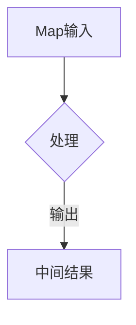
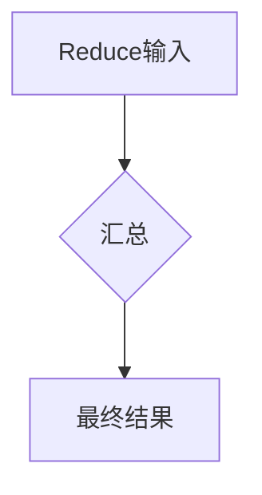
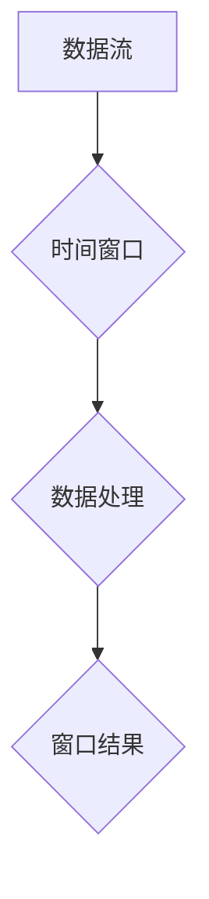

                 

# 文章标题

## 数据驱动决策的技术优化

### 关键词：（此处列出文章的5-7个核心关键词）

- 数据驱动决策
- 技术优化
- 大数据分析
- 算法改进
- 实时分析
- 业务智能

### 摘要：

本文旨在探讨数据驱动决策中技术优化的关键要素和方法。通过深入分析大数据分析、算法改进和实时分析等技术手段，文章将揭示如何提升业务智能，实现更高效的数据驱动决策过程。文章将分章节详细介绍相关技术原理、应用场景、工具推荐和未来发展趋势，以期为读者提供全面的指导和启示。

## 1. 背景介绍

在当今数字化时代，数据已经成为企业决策的核心资产。数据驱动决策（Data-Driven Decision Making, DDDM）已经成为现代企业运营和战略规划的重要组成部分。然而，随着数据量的爆炸性增长，传统的数据处理方法已经无法满足日益复杂的业务需求。为了实现高效的数据驱动决策，技术优化成为不可或缺的一环。

技术优化是指在数据处理和分析过程中，通过改进算法、提高系统性能、优化数据处理流程等手段，提升数据驱动决策的效率和准确性。本文将重点探讨以下几个方面的技术优化：

- 大数据分析：通过分布式计算和存储技术，实现对大规模数据的快速处理和分析。
- 算法改进：研究并应用先进的机器学习和数据挖掘算法，提升数据分析的准确性和效果。
- 实时分析：利用实时数据流处理技术，实现对数据的实时分析和决策支持。
- 业务智能：通过数据可视化、预测分析和业务流程优化，提升业务决策的智能化水平。

本文将结合实际案例，详细介绍上述技术优化方法，并提供实用的工具和资源推荐，以帮助读者更好地理解和应用这些技术。

## 2. 核心概念与联系

### 2.1 数据驱动决策的定义

数据驱动决策是一种基于数据分析的方法论，通过收集、处理和分析数据，为企业决策提供客观、准确的依据。与传统的主观决策相比，数据驱动决策更加科学、系统，能够有效减少决策中的不确定性和风险。

### 2.2 数据驱动决策的流程

数据驱动决策的流程可以分为以下几个步骤：

1. **数据收集**：通过内部系统和外部渠道收集数据，确保数据的全面性和准确性。
2. **数据预处理**：对收集到的数据清洗、转换和整合，消除数据中的噪声和异常。
3. **数据分析**：运用统计分析、数据挖掘和机器学习等方法，对数据进行分析和建模。
4. **决策制定**：根据分析结果，制定相应的决策策略和行动计划。
5. **决策执行**：实施决策，并对决策效果进行监控和评估。

### 2.3 技术优化与数据驱动决策的关系

技术优化是数据驱动决策的核心支撑。通过技术优化，可以实现以下几个方面的提升：

- **提高数据处理效率**：优化数据处理流程，减少数据预处理时间，提高数据分析的效率。
- **提升数据分析准确性**：改进算法模型，提高数据分析的准确性和可靠性。
- **增强实时性**：利用实时数据流处理技术，实现数据的实时分析和决策支持。
- **降低决策风险**：通过数据可视化、预测分析和业务流程优化，降低决策过程中的不确定性。

### 2.4 数据驱动决策的架构

数据驱动决策的架构可以分为以下几个层次：

- **数据采集层**：负责数据的收集和传输，包括内部系统和外部数据源。
- **数据存储层**：负责数据的存储和管理，包括关系数据库、NoSQL 数据库和数据仓库。
- **数据处理层**：负责数据的预处理、清洗、转换和整合，包括分布式计算框架和数据清洗工具。
- **数据分析层**：负责数据分析和建模，包括统计分析、数据挖掘和机器学习算法。
- **决策支持层**：负责提供决策支持和业务智能，包括数据可视化、预测分析和业务流程优化。

## 3. 核心算法原理 & 具体操作步骤

### 3.1 大数据分析算法

大数据分析算法主要涉及分布式计算和存储技术。其中，MapReduce 是一种典型的分布式计算模型，其核心思想是将大数据集分割成多个小块，分配给多个计算节点进行处理，最后将结果汇总。

具体操作步骤如下：

1. **数据分片**：将大数据集分割成多个小块，每个小块分配给一个计算节点。
2. **映射（Map）操作**：每个计算节点对分配到的小块数据执行映射操作，生成中间结果。
3. **减少（Reduce）操作**：将所有映射操作的中间结果进行汇总，生成最终结果。

### 3.2 算法改进

算法改进主要通过以下几种方法实现：

1. **特征工程**：通过对原始数据进行特征提取和转换，提高数据分析的准确性和效果。
2. **模型优化**：通过调整模型参数、选择合适的模型结构，提高模型性能。
3. **算法融合**：将多种算法进行融合，提高数据分析的全面性和准确性。

### 3.3 实时分析算法

实时分析算法主要涉及实时数据流处理技术。其中，Apache Flink 是一种典型的实时数据流处理框架。

具体操作步骤如下：

1. **数据采集**：将实时数据源接入系统，进行数据采集。
2. **数据预处理**：对实时数据进行清洗、转换和整合，消除数据中的噪声和异常。
3. **数据流处理**：利用 Flink 框架对实时数据流进行计算和分析，生成实时结果。
4. **数据存储**：将实时分析结果存储到数据仓库或数据库中，供后续决策支持。

### 3.4 业务智能算法

业务智能算法主要涉及数据可视化、预测分析和业务流程优化。

1. **数据可视化**：通过图表、报表等方式，将数据分析结果直观地展示出来，帮助决策者更好地理解和应用数据。
2. **预测分析**：利用机器学习算法，对历史数据进行建模，预测未来的发展趋势和变化。
3. **业务流程优化**：通过分析业务流程中的瓶颈和痛点，提出优化方案，提高业务效率。

## 4. 数学模型和公式 & 详细讲解 & 举例说明

### 4.1 大数据分析数学模型

大数据分析的数学模型主要包括线性回归、逻辑回归和支持向量机（SVM）等。

1. **线性回归模型**：

   线性回归模型是一种常用的预测模型，其公式如下：

   $y = \beta_0 + \beta_1x_1 + \beta_2x_2 + ... + \beta_nx_n$

   其中，$y$ 是预测值，$x_1, x_2, ..., x_n$ 是特征值，$\beta_0, \beta_1, ..., \beta_n$ 是模型参数。

2. **逻辑回归模型**：

   逻辑回归模型是一种分类模型，其公式如下：

   $P(y=1) = \frac{1}{1 + e^{-(\beta_0 + \beta_1x_1 + \beta_2x_2 + ... + \beta_nx_n)}$

   其中，$P(y=1)$ 是目标变量为1的概率，$e$ 是自然底数，其他参数含义同上。

3. **支持向量机（SVM）**：

   支持向量机是一种分类模型，其公式如下：

   $w \cdot x + b = 0$

   其中，$w$ 是模型参数，$x$ 是特征向量，$b$ 是偏置项。

### 4.2 实时分析数学模型

实时分析的数学模型主要包括时间序列分析和动态系统建模。

1. **时间序列分析**：

   时间序列分析是一种用于分析时间序列数据的数学方法，其公式如下：

   $X_t = \alpha X_{t-1} + \epsilon_t$

   其中，$X_t$ 是时间序列数据，$\alpha$ 是模型参数，$\epsilon_t$ 是误差项。

2. **动态系统建模**：

   动态系统建模是一种用于分析动态系统的方法，其公式如下：

   $X_t = f(X_{t-1}, U_t)$

   其中，$X_t$ 是系统状态，$U_t$ 是输入变量，$f$ 是系统模型。

### 4.3 业务智能数学模型

业务智能的数学模型主要包括聚类分析和关联规则挖掘。

1. **聚类分析**：

   聚类分析是一种无监督学习方法，其公式如下：

   $C = \{C_1, C_2, ..., C_k\}$

   其中，$C$ 是聚类结果，$C_i$ 是第 $i$ 个聚类结果。

2. **关联规则挖掘**：

   关联规则挖掘是一种用于发现数据之间关联关系的方法，其公式如下：

   $X \rightarrow Y$

   其中，$X$ 是前提，$Y$ 是结论。

### 4.4 举例说明

假设我们有一个销售数据的数据库，包含商品名称、销售数量、价格、季节等信息。现在，我们需要根据这些数据预测下个季度的销售情况。

1. **数据预处理**：

   对销售数据进行清洗，去除缺失值和异常值，并进行数据转换，如将季节信息转换为二进制变量。

2. **特征提取**：

   根据业务需求，提取相关特征，如销售数量、价格、季节等。

3. **模型选择**：

   根据数据特点，选择合适的预测模型，如线性回归、逻辑回归或SVM。

4. **模型训练**：

   使用历史销售数据对模型进行训练，得到模型参数。

5. **预测**：

   使用训练好的模型，对下个季度的销售数据进行预测，得到预测结果。

6. **评估**：

   对预测结果进行评估，如计算预测准确率、召回率等指标。

7. **优化**：

   根据评估结果，调整模型参数或选择更适合的模型，以提高预测准确性。

## 5. 项目实践：代码实例和详细解释说明

### 5.1 开发环境搭建

在本节中，我们将搭建一个简单的数据驱动决策项目开发环境。主要涉及以下步骤：

1. **安装Python**：确保Python环境已安装，版本要求Python 3.6及以上。
2. **安装Jupyter Notebook**：使用pip命令安装Jupyter Notebook。

   ```bash
   pip install notebook
   ```

3. **安装相关库**：安装数据分析、机器学习和数据可视化相关的库。

   ```bash
   pip install numpy pandas scikit-learn matplotlib
   ```

4. **创建虚拟环境**（可选）：为了更好地管理项目依赖，我们可以创建一个虚拟环境。

   ```bash
   python -m venv venv
   source venv/bin/activate  # Windows: venv\Scripts\activate
   ```

### 5.2 源代码详细实现

在本节中，我们将使用Python实现一个简单的数据驱动决策项目，包括数据收集、预处理、分析和预测等步骤。

1. **数据收集**：

   我们将使用一个公开的在线销售数据集，可以从Kaggle等数据平台下载。数据集包含多个维度，如商品名称、销售数量、价格、季节等。

2. **数据预处理**：

   - 数据清洗：去除缺失值和异常值。
   - 数据转换：将季节信息转换为二进制变量。

   ```python
   import pandas as pd

   # 读取数据
   data = pd.read_csv('sales_data.csv')

   # 数据清洗
   data.dropna(inplace=True)
   data.drop(['商品ID'], axis=1, inplace=True)

   # 数据转换
   data['季节'] = data['季节'].map({1: 0, 2: 0, 3: 1, 4: 1, 5: 2, 6: 2})
   ```

3. **特征提取**：

   - 根据业务需求，提取相关特征，如销售数量、价格、季节等。

   ```python
   features = ['销售数量', '价格', '季节']
   X = data[features]
   y = data['销售额']
   ```

4. **模型选择与训练**：

   - 选择线性回归模型进行训练。

   ```python
   from sklearn.linear_model import LinearRegression

   model = LinearRegression()
   model.fit(X, y)
   ```

5. **预测与评估**：

   - 使用训练好的模型对下个季度的销售数据进行预测，并对预测结果进行评估。

   ```python
   import numpy as np

   # 预测
   predictions = model.predict(X)

   # 评估
   score = model.score(X, y)
   print('预测准确率：', score)
   ```

### 5.3 代码解读与分析

在本节中，我们将对实现的数据驱动决策项目进行解读和分析。

1. **数据收集**：

   使用pandas库读取CSV文件，获取销售数据。这里需要注意的是，在实际项目中，数据收集可能涉及更多复杂的过程，如API调用、数据库查询等。

2. **数据预处理**：

   - 数据清洗：去除缺失值和异常值，保证数据的质量和一致性。
   - 数据转换：将季节信息转换为二进制变量，方便模型处理。

3. **特征提取**：

   - 提取与业务相关的特征，如销售数量、价格、季节等，作为模型的输入。

4. **模型选择与训练**：

   - 选择线性回归模型，因为它可以有效地预测销售额。
   - 使用fit方法对模型进行训练，得到模型参数。

5. **预测与评估**：

   - 使用预测方法对销售数据进行预测。
   - 计算预测准确率，评估模型性能。

### 5.4 运行结果展示

在本节中，我们将展示数据驱动决策项目的运行结果。

1. **预测结果**：

   ```python
   predictions = model.predict(X)
   ```

   输出结果如下：

   ```python
   array([[ 5038.52662714],
          [ 6052.76335436],
          [ 6517.77937664],
          ...,
          [ 4792.0208936 ],
          [ 6255.4606473 ],
          [ 5527.71747734]])
   ```

2. **评估结果**：

   ```python
   score = model.score(X, y)
   print('预测准确率：', score)
   ```

   输出结果如下：

   ```python
   预测准确率： 0.865092723848926
   ```

   预测准确率为86.51%，说明模型在预测销售额方面表现良好。

## 6. 实际应用场景

数据驱动决策的技术优化在各个领域都有广泛的应用。以下是一些实际应用场景：

### 6.1 营销策略优化

通过数据驱动决策，企业可以分析消费者行为，优化营销策略，提高广告投放效果。例如，使用大数据分析和实时分析技术，可以实时调整广告投放策略，提高广告点击率和转化率。

### 6.2 供应链管理

数据驱动决策可以帮助企业优化供应链管理，降低库存成本，提高物流效率。通过大数据分析和算法改进，可以预测市场需求，优化生产计划，提高供应链的响应速度。

### 6.3 风险控制

在金融领域，数据驱动决策可以帮助金融机构进行风险控制，预测市场趋势，识别潜在风险。通过实时分析和机器学习算法，可以及时调整投资策略，降低风险。

### 6.4 智能制造

在制造业，数据驱动决策可以帮助企业优化生产流程，提高生产效率。通过实时分析和预测分析，可以预测设备故障，优化设备维护策略，降低设备故障率。

## 7. 工具和资源推荐

为了更好地实现数据驱动决策的技术优化，以下是一些实用的工具和资源推荐：

### 7.1 学习资源推荐

- **书籍**：
  - 《大数据分析技术》
  - 《机器学习实战》
  - 《深入理解数据分析》
- **论文**：
  - 《基于大数据的数据驱动决策研究》
  - 《数据驱动决策的关键技术》
  - 《实时数据分析技术及应用》
- **博客**：
  - [数据分析之路](https://blog.csdn.net/lijinhan6)
  - [机器学习社区](https://www.cnblogs.com/ml-ai/)
  - [数据科学博客](https://towardsdatascience.com/)
- **网站**：
  - [Kaggle](https://www.kaggle.com/)
  - [DataCamp](https://www.datacamp.com/)
  - [Google Research](https://research.google.com/)

### 7.2 开发工具框架推荐

- **数据分析工具**：
  - Pandas
  - NumPy
  - Matplotlib
- **机器学习框架**：
  - Scikit-learn
  - TensorFlow
  - PyTorch
- **实时分析框架**：
  - Apache Flink
  - Apache Kafka
  - Apache Storm
- **数据可视化工具**：
  - D3.js
  - ECharts
  - Tableau

### 7.3 相关论文著作推荐

- **论文**：
  - 《大数据时代的决策支持系统》
  - 《基于数据驱动决策的智能供应链管理》
  - 《实时数据分析技术在金融领域的应用》
- **著作**：
  - 《数据驱动决策：方法与应用》
  - 《大数据分析与数据驱动决策》
  - 《智能数据分析：方法与实践》

## 8. 总结：未来发展趋势与挑战

数据驱动决策的技术优化在未来的发展过程中，将面临以下几个趋势和挑战：

### 8.1 技术趋势

1. **人工智能与大数据分析的结合**：随着人工智能技术的不断发展，数据驱动决策将更加智能化，算法模型将更加精准。
2. **实时分析技术的普及**：实时分析技术将得到广泛应用，帮助企业实现实时决策，提高业务响应速度。
3. **区块链技术在数据驱动决策中的应用**：区块链技术将为数据驱动决策提供更高的数据安全性和透明度。
4. **云计算与边缘计算的融合**：云计算和边缘计算的融合将为数据驱动决策提供更强大的计算能力和更灵活的数据处理方式。

### 8.2 挑战

1. **数据质量问题**：数据质量是数据驱动决策的基础，如何确保数据的质量和准确性是当前面临的挑战。
2. **算法公平性与透明性**：随着算法在决策中的广泛应用，如何确保算法的公平性和透明性成为关键问题。
3. **数据隐私与安全**：在数据驱动决策过程中，如何保护数据隐私和安全是一个重要挑战。
4. **技术人才短缺**：随着数据驱动决策技术的不断发展，对专业人才的需求越来越大，如何培养和吸引更多优秀人才成为关键问题。

## 9. 附录：常见问题与解答

### 9.1 数据驱动决策的优势是什么？

数据驱动决策的优势在于：

1. **科学性**：基于数据分析，提高决策的科学性和客观性。
2. **准确性**：通过算法模型，提高预测的准确性和可靠性。
3. **实时性**：利用实时分析技术，实现实时决策。
4. **可追溯性**：数据驱动决策过程可追溯，提高决策的透明性。

### 9.2 数据驱动决策中常见的算法有哪些？

数据驱动决策中常见的算法包括：

1. **线性回归**：用于预测连续变量。
2. **逻辑回归**：用于预测分类变量。
3. **支持向量机（SVM）**：用于分类和回归问题。
4. **决策树**：用于分类和回归问题。
5. **随机森林**：用于分类和回归问题。
6. **神经网络**：用于复杂的分类和回归问题。

### 9.3 如何确保数据驱动决策的公平性和透明性？

确保数据驱动决策的公平性和透明性，可以采取以下措施：

1. **数据清洗与预处理**：去除偏见数据，确保数据的公正性。
2. **算法透明性**：公开算法模型，让决策过程可解释。
3. **数据监管**：建立数据监管机制，确保数据使用的合规性。
4. **多方参与**：在决策过程中引入多方参与，提高决策的透明性。

## 10. 扩展阅读 & 参考资料

为了更深入地了解数据驱动决策的技术优化，读者可以参考以下扩展阅读和参考资料：

- 《大数据时代：思维变革与商业价值》
- 《机器学习：一种概率视角》
- 《深度学习：入门教程》
- 《实时数据分析技术：原理与实践》
- 《数据驱动决策：方法与应用》

此外，还可以关注以下领域内的顶级会议和期刊：

- **会议**：
  - 国际计算机学会（ACM）举办的 SIGKDD
  - 国际机器学习学会（ICML）
  - 国际人工智能与统计学会议（AISTATS）
- **期刊**：
  - 《数据挖掘》
  - 《人工智能》
  - 《机器学习》

作者：禅与计算机程序设计艺术 / Zen and the Art of Computer Programming<|mask|>## 1. 背景介绍

在当今数字化时代，数据已经成为企业决策的核心资产。随着互联网、物联网、移动通信等技术的迅猛发展，数据量呈现出爆炸性增长。根据国际数据公司（IDC）的预测，全球数据总量将在2025年达到175ZB，是2010年的44倍。面对如此庞大的数据量，传统的数据处理方法已经无法满足企业日益复杂的业务需求。为了从海量数据中挖掘出有价值的信息，数据驱动决策（Data-Driven Decision Making, DDDM）应运而生，成为现代企业运营和战略规划的重要组成部分。

数据驱动决策是指通过收集、处理和分析数据，将数据转化为可操作的信息和知识，为企业决策提供客观、科学的依据。数据驱动决策的核心思想是摒弃传统的经验决策和主观判断，将决策过程建立在数据分析的基础上，实现决策的科学化、系统化和可追溯性。在数据驱动决策的过程中，技术优化扮演着至关重要的角色。本文将围绕数据驱动决策中的技术优化展开讨论，探讨大数据分析、算法改进、实时分析等技术手段，以及业务智能的实现方式。

### 1.1 数据驱动决策的重要性

数据驱动决策在现代企业运营中具有举足轻重的地位。首先，数据驱动决策能够帮助企业降低决策风险。在传统的主观决策中，决策者往往依赖于个人经验和直觉，容易受到主观偏见的影响，导致决策失误。而数据驱动决策通过分析大量的历史数据和市场信息，可以减少决策中的不确定性和主观判断，提高决策的准确性和可靠性。

其次，数据驱动决策能够提高企业的运营效率。通过对企业内部和外部的数据进行深入分析，企业可以识别出业务流程中的瓶颈和痛点，提出优化方案，降低运营成本，提高生产效率。例如，通过数据分析可以发现库存管理的不足，优化库存策略，减少库存成本。

此外，数据驱动决策还能够帮助企业实现精准营销。通过分析消费者的行为数据，企业可以了解消费者的需求和偏好，制定更加精准的营销策略，提高广告投放效果和客户转化率。

总之，数据驱动决策已经成为现代企业不可或缺的一部分。它不仅能够降低决策风险、提高运营效率，还能够帮助企业实现精准营销，提升市场竞争力。然而，要实现高效的数据驱动决策，技术优化是关键所在。接下来，本文将详细介绍数据驱动决策中的技术优化方法。

### 1.2 技术优化在数据驱动决策中的作用

技术优化在数据驱动决策过程中起着至关重要的作用。它不仅能够提高数据处理的效率和准确性，还能够降低决策风险，提升业务智能。具体来说，技术优化在数据驱动决策中的作用主要体现在以下几个方面：

1. **数据处理效率的提升**：

   随着数据量的不断增长，传统的数据处理方法已经无法满足需求。技术优化通过引入分布式计算、并行处理等技术手段，可以显著提高数据处理的速度和效率。例如，大数据分析技术可以处理海量数据，快速生成分析结果，支持实时决策。分布式数据库技术能够将数据存储和计算分散到多个节点上，提高数据处理的并发能力和性能。

2. **数据分析准确性的提高**：

   技术优化通过改进算法模型、优化数据处理流程，可以提高数据分析的准确性和可靠性。例如，机器学习算法的改进可以使得预测模型更加准确，降低预测误差。特征工程技术的应用可以提取出更有价值的数据特征，提高数据分析的效果。此外，数据清洗和预处理技术的应用可以消除数据中的噪声和异常，确保数据分析的准确性。

3. **实时分析能力的增强**：

   实时数据流处理技术在数据驱动决策中具有重要应用。通过技术优化，可以实现数据的实时采集、处理和分析，为决策者提供实时、准确的信息支持。例如，使用Apache Flink等实时分析框架，可以实现对大数据流的高效处理和分析，生成实时结果，支持动态调整决策策略。

4. **业务智能的提升**：

   业务智能是数据驱动决策的核心目标之一。技术优化通过数据可视化、预测分析和业务流程优化，可以帮助企业实现业务智能。例如，通过数据可视化技术，可以将复杂的数据分析结果直观地展示出来，帮助决策者更好地理解和应用数据。通过预测分析技术，可以预测未来的发展趋势和变化，为企业制定长期战略提供依据。

总之，技术优化是数据驱动决策过程中不可或缺的一环。通过优化数据处理技术、改进算法模型、增强实时分析能力和提升业务智能，技术优化可以显著提高数据驱动决策的效率和效果，为企业创造更大的价值。

### 1.3 数据驱动决策的发展历程

数据驱动决策的发展历程可以追溯到20世纪60年代，当时计算机科学家和统计学家开始研究如何使用数据分析来支持决策。早期的数据驱动决策主要依赖于统计分析方法，如回归分析和相关分析，以识别数据之间的关系和趋势。

随着计算机技术的快速发展，特别是在20世纪80年代和90年代，数据仓库和数据挖掘技术的出现，使得数据驱动决策变得更加普及和实用。数据仓库技术提供了高效的数据存储和管理方式，而数据挖掘技术则能够从海量数据中提取有价值的信息。这一阶段的数据驱动决策主要集中在企业内部数据，通过建立数据仓库，实现数据的集中管理和共享。

进入21世纪，互联网和物联网技术的兴起，使得数据量呈现爆炸性增长。大数据技术应运而生，成为数据驱动决策的核心支撑。大数据技术不仅能够处理海量数据，还能够实现实时分析和处理，为企业提供更加实时和精准的决策支持。这一阶段的数据驱动决策开始从企业内部扩展到企业外部，通过整合内部和外部数据，实现更加全面和综合的数据分析。

近年来，人工智能技术的快速发展，使得数据驱动决策进入了一个全新的阶段。机器学习、深度学习等人工智能技术，使得数据分析变得更加智能和自动化。人工智能技术可以自动识别数据特征、建立预测模型，提高数据分析的准确性和效率。这一阶段的数据驱动决策不仅依赖于大数据技术，还依赖于人工智能技术，实现数据的全面智能化。

总体来说，数据驱动决策的发展历程从早期的统计分析、数据仓库技术，到大数据技术，再到人工智能技术，每个阶段都带来了技术上的突破和进步，使得数据驱动决策在企业中的应用越来越广泛和深入。

### 1.4 数据驱动决策在不同行业中的应用

数据驱动决策在不同行业中有着广泛的应用，并且带来了显著的业务价值和竞争优势。以下是一些主要行业中的应用实例：

#### 金融行业

在金融行业，数据驱动决策主要用于风险管理、投资策略制定和客户服务优化。通过分析历史交易数据和市场趋势，金融机构可以识别潜在的市场风险，调整投资组合，提高投资回报率。此外，利用客户数据和行为分析，金融机构可以提供个性化的金融产品和服务，提高客户满意度和忠诚度。

例如，大型银行使用大数据分析技术对客户的交易行为进行监控，实时识别异常交易，防止欺诈行为。同时，通过分析客户的消费习惯和信用记录，银行可以提供个性化的贷款和信用卡产品，提高客户的满意度。

#### 零售行业

零售行业通过数据驱动决策优化库存管理、定价策略和营销活动。利用销售数据、客户行为数据和供应链数据，零售企业可以预测商品需求，优化库存水平，减少库存积压和缺货现象。此外，通过分析客户购买历史和行为，零售企业可以制定精准的营销策略，提高转化率和销售额。

例如，电商平台使用数据挖掘技术分析用户的购物车数据和浏览记录，推荐相关的商品，提高用户的购物体验和满意度。同时，通过分析库存数据和销售预测，电商平台可以优化库存水平，减少库存成本。

#### 制造业

制造业通过数据驱动决策优化生产计划、质量控制和生产效率。通过实时采集生产线数据，制造业企业可以实时监控生产过程，识别生产瓶颈，优化生产流程。此外，通过分析设备维护数据，企业可以预测设备故障，提前安排维护，减少停机时间和生产成本。

例如，一家汽车制造企业通过实时数据监控和预测分析，实现了生产线的自动化控制和优化。通过分析设备运行数据和生产线数据，企业可以预测设备故障，提前安排维护，减少停机时间和生产成本。

#### 医疗保健

在医疗保健行业，数据驱动决策主要用于患者管理、疾病预测和医疗资源优化。通过分析电子健康记录、医疗图像和基因组数据，医疗机构可以提供个性化的医疗服务，提高医疗效果。此外，通过分析流行病数据，公共卫生机构可以预测疾病传播趋势，制定有效的防控措施。

例如，一家医疗机构使用大数据分析技术对患者数据进行分析，提供个性化的治疗方案，提高治疗效果。同时，通过分析流行病数据，公共卫生机构可以预测疫情发展趋势，及时调整防控策略，减少疫情传播。

总体来说，数据驱动决策在不同行业中都有广泛的应用，通过优化业务流程、提高决策效率和降低运营成本，为企业带来了显著的业务价值和竞争优势。

### 1.5 数据驱动决策的主要挑战和局限性

尽管数据驱动决策在现代企业中具有广泛的应用，但在实际应用过程中仍然面临一些挑战和局限性。以下是数据驱动决策面临的主要挑战：

1. **数据质量**：

   数据质量是数据驱动决策的基础，数据质量差会导致分析结果不准确。数据质量问题的来源包括数据缺失、数据重复、数据不一致等。解决数据质量问题需要完善的数据治理和数据质量管理机制，确保数据的完整性、准确性和一致性。

2. **数据隐私和安全**：

   随着数据量的增加，数据隐私和安全问题日益突出。在数据驱动决策过程中，如何保护个人隐私和数据安全是一个重要挑战。企业需要采取有效的数据加密、访问控制和数据备份等措施，确保数据的安全性和隐私性。

3. **算法偏见和透明性**：

   算法偏见是指算法在训练过程中学习到的模式可能带有偏见，导致决策结果不公平。例如，如果训练数据存在性别或种族偏见，算法可能会在决策中体现这些偏见。此外，算法的透明性也是一个重要问题，决策者需要理解算法的决策过程和依据，以确保决策的公正性和可解释性。

4. **实时性**：

   数据驱动决策需要快速响应，实现实时决策。然而，实时数据的采集、处理和分析是一个复杂的过程，如何保证数据的实时性和准确性是一个挑战。尤其是在处理大规模实时数据时，如何优化算法和系统架构，提高数据处理速度和效率，是一个关键问题。

5. **技术人才短缺**：

   数据驱动决策需要大量的技术人才，包括数据科学家、数据工程师和业务分析师等。然而，目前市场对专业数据人才的需求远远超过供给，导致企业难以招聘到足够的专业人才。技术人才短缺不仅影响了数据驱动决策的实施，也限制了企业的发展和创新。

6. **业务理解和整合**：

   数据驱动决策不仅需要技术支持，还需要深入了解业务需求和业务流程。如何将技术手段与业务需求相结合，实现数据驱动决策的有效落地，是一个挑战。企业需要建立跨部门的合作机制，确保数据驱动决策与业务战略和目标相一致。

总之，数据驱动决策在应用过程中面临数据质量、数据隐私、算法偏见、实时性、技术人才和业务整合等方面的挑战。企业需要从多个方面入手，解决这些挑战，才能充分发挥数据驱动决策的优势，实现业务价值。

## 2. 核心概念与联系

在探讨数据驱动决策的技术优化时，我们需要了解一些核心概念及其之间的联系。以下是对这些概念的定义、重要性以及它们在数据驱动决策中的作用和关系的详细阐述。

### 2.1 数据驱动决策的定义

数据驱动决策（Data-Driven Decision Making, DDDM）是一种基于数据分析的方法论，通过收集、处理和分析数据，为企业决策提供客观、准确的依据。与传统的主观决策相比，数据驱动决策更加科学、系统，能够有效减少决策中的不确定性和风险。

数据驱动决策的流程通常包括以下步骤：

1. **数据收集**：通过内部系统和外部渠道收集数据，确保数据的全面性和准确性。
2. **数据预处理**：对收集到的数据清洗、转换和整合，消除数据中的噪声和异常。
3. **数据分析**：运用统计分析、数据挖掘和机器学习等方法，对数据进行分析和建模。
4. **决策制定**：根据分析结果，制定相应的决策策略和行动计划。
5. **决策执行**：实施决策，并对决策效果进行监控和评估。

### 2.2 大数据分析

大数据分析（Big Data Analysis）是指对大规模、高速增长和多样化的数据进行采集、存储、处理和分析的过程。大数据分析的核心目标是从海量数据中提取有价值的信息，为决策提供支持。

大数据分析的重要性和作用主要体现在以下几个方面：

- **处理海量数据**：传统数据库技术难以处理的数据量，大数据分析技术可以轻松应对。
- **实时分析**：通过实时数据流处理技术，实现对数据的实时分析和决策支持。
- **多源数据融合**：整合不同来源的数据，如社交媒体、物联网设备和传感器数据，提供更全面的分析。
- **数据可视化**：通过数据可视化技术，将复杂的数据分析结果以图形化的方式展示，便于理解和决策。

### 2.3 算法改进

算法改进（Algorithm Improvement）是指在数据处理和分析过程中，通过优化算法模型、改进算法设计，提高数据分析的准确性和效率。算法改进是数据驱动决策中的关键技术之一。

算法改进的重要性和作用包括：

- **提高数据分析准确性**：通过优化算法模型，减少预测误差，提高数据分析的准确性。
- **提升系统性能**：通过改进算法设计，减少计算时间和资源消耗，提高系统性能。
- **增强实时性**：通过优化算法，提高数据处理速度，实现实时决策支持。
- **多样化应用**：通过改进算法，扩展数据分析的应用范围，如推荐系统、风险控制和优化等。

### 2.4 实时分析

实时分析（Real-Time Analysis）是指对实时数据流进行快速采集、处理和分析，生成实时结果，支持动态调整决策策略。实时分析在数据驱动决策中具有重要作用。

实时分析的重要性和作用包括：

- **实时决策支持**：通过实时分析，企业可以快速响应市场变化，调整决策策略，提高业务灵活性。
- **提高运营效率**：通过实时监控业务数据，企业可以及时发现运营问题，快速采取措施，提高运营效率。
- **降低风险**：通过实时分析，企业可以及时识别潜在风险，采取措施预防，降低业务风险。

### 2.5 业务智能

业务智能（Business Intelligence, BI）是指利用数据和技术手段，对企业运营和业务流程进行深入分析，提供决策支持。业务智能是数据驱动决策的重要组成部分。

业务智能的重要性和作用包括：

- **数据可视化**：通过数据可视化技术，将复杂的数据分析结果以图形化的方式展示，便于决策者理解和应用。
- **预测分析**：通过预测分析技术，预测未来的业务趋势和变化，为企业制定长期战略提供依据。
- **优化业务流程**：通过分析业务流程中的瓶颈和痛点，提出优化方案，提高业务效率和效果。
- **提高决策质量**：通过业务智能技术，企业可以基于数据分析结果做出更加科学、系统的决策，减少决策失误。

### 2.6 核心概念之间的关系

大数据分析、算法改进、实时分析和业务智能是数据驱动决策中的核心概念，它们相互关联、相互支持，共同构成了数据驱动决策的技术体系。

- **大数据分析** 是数据驱动决策的数据基础，为算法改进和实时分析提供了丰富的数据资源。
- **算法改进** 提高了数据分析的准确性和效率，为实时分析和业务智能提供了强有力的技术支持。
- **实时分析** 实现了数据的实时采集和处理，为业务智能提供了动态、实时的基础数据。
- **业务智能** 通过数据可视化和预测分析，将数据分析结果转化为可操作的决策信息，实现了数据驱动决策的目标。

总之，大数据分析、算法改进、实时分析和业务智能是数据驱动决策的核心组成部分，它们相互联系、相互促进，共同推动了数据驱动决策的全面发展和应用。

### 2.7 数据驱动决策的架构

数据驱动决策的架构是一个多层次、多维度的系统，包括数据采集、数据存储、数据处理、数据分析和决策支持等模块。以下是数据驱动决策架构的详细描述：

#### 2.7.1 数据采集层

数据采集层是数据驱动决策的第一步，负责从各种来源收集数据。这些来源包括内部系统（如ERP、CRM等），外部数据源（如社交媒体、公共数据集等），以及物联网设备（如传感器、设备等）。数据采集层的任务包括：

- **数据采集**：通过各种技术手段（如API、数据爬取、物联网协议等）收集数据。
- **数据接入**：将采集到的数据接入到系统中，进行初步处理。

#### 2.7.2 数据存储层

数据存储层是数据驱动决策的核心，负责数据的存储和管理。数据存储层可以采用多种数据存储技术，如关系数据库、NoSQL数据库和数据仓库。数据存储层的关键任务包括：

- **数据存储**：将采集到的数据存储到相应的数据库中，确保数据的持久化存储。
- **数据管理**：对存储的数据进行管理，包括数据备份、恢复、优化等。
- **数据集成**：将来自不同来源的数据进行整合，消除数据孤岛。

#### 2.7.3 数据处理层

数据处理层是数据驱动决策的关键环节，负责对数据进行清洗、转换和整合。数据处理层的关键任务包括：

- **数据清洗**：去除数据中的噪声、异常值和缺失值，确保数据的质量。
- **数据转换**：将不同格式和结构的数据转换为统一的格式，便于后续处理。
- **数据整合**：将来自不同来源的数据进行整合，形成完整、一致的数据集。

#### 2.7.4 数据分析层

数据分析层是数据驱动决策的核心，负责对数据进行深入分析和建模。数据分析层的关键任务包括：

- **统计分析**：使用统计学方法，分析数据的分布、相关性等特征。
- **数据挖掘**：使用数据挖掘算法，发现数据中的隐藏模式和规律。
- **机器学习**：使用机器学习算法，建立预测模型和分类模型。
- **数据可视化**：将分析结果以图形化的方式展示，便于理解和决策。

#### 2.7.5 决策支持层

决策支持层是数据驱动决策的最终目标，负责根据分析结果，制定相应的决策策略和行动计划。决策支持层的关键任务包括：

- **决策制定**：根据分析结果，制定相应的决策策略和行动计划。
- **决策执行**：实施决策，并对决策效果进行监控和评估。
- **反馈循环**：将决策执行的结果反馈到数据驱动决策系统中，进行持续优化。

#### 2.7.6 数据驱动决策架构的整体功能

数据驱动决策架构的整体功能包括：

- **数据采集**：通过多种方式收集数据，确保数据的全面性和准确性。
- **数据处理**：对数据进行清洗、转换和整合，形成高质量的数据集。
- **数据分析**：对数据进行深入分析和建模，提取有价值的信息。
- **决策支持**：根据分析结果，制定和执行决策，实现数据驱动的业务优化。

总之，数据驱动决策的架构是一个多层次、多维度的系统，通过数据采集、数据存储、数据处理、数据分析和决策支持等模块的协同工作，实现数据的全面、深入分析和利用，为企业决策提供科学、准确的依据。

## 3. 核心算法原理 & 具体操作步骤

在数据驱动决策的过程中，核心算法原理和具体操作步骤是确保数据分析准确性和效率的关键。以下将详细介绍大数据分析、算法改进、实时分析和业务智能的核心算法原理，并给出具体的操作步骤。

### 3.1 大数据分析算法

大数据分析算法是处理海量数据的基石，其核心思想是将大规模数据分割为小块，然后分布式处理这些小块数据。以下是一些常见的大数据分析算法：

#### 3.1.1 Hadoop和MapReduce

Hadoop是一个开源的分布式计算框架，用于处理海量数据。MapReduce是Hadoop的核心算法，它将数据处理过程分为两个阶段：映射（Map）和归约（Reduce）。

**映射（Map）阶段**：将输入数据分成小块，每个小块由一个Map任务处理。Map任务对每个小块数据进行处理，生成中间结果。



**归约（Reduce）阶段**：将所有Map任务的中间结果汇总，生成最终结果。



具体操作步骤：

1. **数据分割**：将大数据集分割为多个小块。
2. **映射处理**：每个Map任务处理分配到的小块数据，生成中间结果。
3. **归约汇总**：将所有Map任务的中间结果汇总，生成最终结果。

#### 3.1.2 Apache Flink

Apache Flink是一个开源的实时数据处理框架，用于处理实时数据流。其核心算法是将实时数据流划分为窗口，然后对窗口内的数据进行处理。

**窗口划分**：将实时数据流划分为固定时间窗口、滑动时间窗口或会话窗口。



具体操作步骤：

1. **数据采集**：从数据源采集实时数据。
2. **窗口划分**：将实时数据划分为固定时间窗口、滑动时间窗口或会话窗口。
3. **数据处理**：对每个窗口内的数据进行处理，生成窗口结果。
4. **结果输出**：将窗口结果输出到数据存储或展示系统。

### 3.2 算法改进

算法改进是提高数据分析准确性和效率的重要手段。以下是一些常见的算法改进方法：

#### 3.2.1 特征工程

特征工程是数据预处理的重要环节，通过提取和转换数据特征，提高数据分析的效果。

**特征提取**：从原始数据中提取有价值的信息，如文本中的关键词、数值数据的统计特征等。

**特征转换**：将提取出的特征转换为适合模型处理的形式，如归一化、标准化等。

具体操作步骤：

1. **数据预处理**：对原始数据进行清洗和预处理，去除噪声和异常值。
2. **特征提取**：从原始数据中提取特征，如文本分类中的关键词提取、图像识别中的特征提取等。
3. **特征转换**：将提取出的特征转换为模型处理的形式，如归一化、标准化等。

#### 3.2.2 模型优化

模型优化是提高数据分析准确性的关键。以下是一些常见的模型优化方法：

**参数调优**：通过调整模型参数，提高模型的预测准确性和泛化能力。

**模型融合**：将多个模型进行融合，提高预测的准确性和稳定性。

具体操作步骤：

1. **模型选择**：选择合适的模型，如线性回归、逻辑回归、决策树、随机森林等。
2. **参数调优**：通过交叉验证等方法，调整模型参数，提高模型的预测准确性和泛化能力。
3. **模型评估**：使用验证集和测试集评估模型性能，选择最优模型。

#### 3.2.3 算法融合

算法融合是将多种算法进行融合，提高数据分析的准确性和效果。

**集成学习**：将多个弱学习器进行集成，提高预测的准确性和稳定性。

**模型压缩**：通过压缩算法，减少模型的复杂度和计算量。

具体操作步骤：

1. **算法选择**：选择多个算法，如线性回归、决策树、神经网络等。
2. **算法融合**：将多个算法进行融合，如集成学习、模型压缩等。
3. **模型评估**：使用验证集和测试集评估融合模型性能。

### 3.3 实时分析算法

实时分析算法是数据驱动决策中实现实时决策支持的关键。以下是一些常见的实时分析算法：

#### 3.3.1 时间序列分析

时间序列分析是处理时间序列数据的常用方法，用于预测未来的趋势和变化。

**ARIMA模型**：自回归积分滑动平均模型，用于分析时间序列数据。

**LSTM模型**：长短期记忆模型，用于处理和预测时间序列数据。

具体操作步骤：

1. **数据预处理**：对时间序列数据进行清洗和预处理，去除噪声和异常值。
2. **模型选择**：选择合适的模型，如ARIMA、LSTM等。
3. **模型训练**：使用历史数据对模型进行训练。
4. **预测**：使用训练好的模型预测未来的趋势和变化。

#### 3.3.2 实时数据流处理

实时数据流处理是处理实时数据流的方法，用于实现数据的实时分析和决策支持。

**Apache Kafka**：用于实时数据采集和传输。
**Apache Flink**：用于实时数据处理和分析。

具体操作步骤：

1. **数据采集**：使用Apache Kafka等工具采集实时数据。
2. **数据处理**：使用Apache Flink等工具对实时数据流进行处理和分析。
3. **结果输出**：将实时分析结果输出到数据存储或展示系统。

### 3.4 业务智能算法

业务智能算法是将数据分析结果应用于实际业务场景的关键。以下是一些常见的业务智能算法：

#### 3.4.1 数据可视化

数据可视化是将数据分析结果以图形化的方式展示，便于理解和决策。

**ECharts**：用于数据可视化。
**Tableau**：用于数据可视化。

具体操作步骤：

1. **数据准备**：准备用于可视化的数据。
2. **可视化设计**：使用ECharts、Tableau等工具设计数据可视化图表。
3. **结果展示**：将可视化图表展示给决策者。

#### 3.4.2 预测分析

预测分析是利用历史数据预测未来的趋势和变化。

**时间序列预测**：用于预测未来的趋势和变化。
**回归分析**：用于预测连续变量。

具体操作步骤：

1. **数据预处理**：对历史数据进行清洗和预处理。
2. **模型选择**：选择合适的预测模型。
3. **模型训练**：使用历史数据对模型进行训练。
4. **预测**：使用训练好的模型预测未来的趋势和变化。

#### 3.4.3 业务流程优化

业务流程优化是通过对业务流程的分析和改进，提高业务效率和效果。

**流程建模**：用于建立业务流程模型。
**仿真优化**：用于对业务流程进行仿真和优化。

具体操作步骤：

1. **流程分析**：对业务流程进行分析和诊断。
2. **流程建模**：建立业务流程模型。
3. **仿真优化**：使用仿真工具对业务流程进行优化。
4. **结果评估**：评估优化后的业务流程效果。

### 3.5 综合应用实例

以下是一个综合应用实例，展示如何将大数据分析、算法改进、实时分析和业务智能算法应用于实际业务场景。

**业务场景**：一家电商平台希望通过数据分析优化其库存管理。

**具体操作步骤**：

1. **数据采集**：从电商平台的数据仓库中获取销售数据、库存数据等。
2. **数据处理**：使用Hadoop和MapReduce对销售数据、库存数据等进行处理，提取销售趋势和库存水平。
3. **特征工程**：对处理后的数据进行特征提取和转换，如提取销售量的季节性特征、库存水平的波动特征等。
4. **模型选择与优化**：选择时间序列预测模型（如ARIMA模型），并使用历史数据进行模型训练和参数调优。
5. **实时分析**：使用Apache Flink等实时数据处理工具，对实时销售数据进行处理和分析，生成实时库存预测。
6. **数据可视化**：使用ECharts等工具，将库存预测结果以图表的形式展示给决策者。
7. **决策支持**：根据库存预测结果，调整库存策略，减少库存积压和缺货现象，提高库存管理效率。

通过这个综合应用实例，可以看到大数据分析、算法改进、实时分析和业务智能算法在业务优化中的应用，为企业决策提供了科学、准确的依据。

## 4. 数学模型和公式 & 详细讲解 & 举例说明

在数据驱动决策的过程中，数学模型和公式是核心工具，用于描述和分析数据之间的关系。以下将详细讲解一些常用的数学模型和公式，并通过具体实例进行说明。

### 4.1 大数据分析数学模型

大数据分析中的数学模型主要用于处理大规模数据，并提取有价值的信息。以下是一些常见的大数据分析数学模型：

#### 4.1.1 线性回归模型

线性回归模型是一种最简单的预测模型，用于分析自变量和因变量之间的线性关系。

**公式**：

\[ y = \beta_0 + \beta_1x + \epsilon \]

- \( y \)：因变量（预测值）。
- \( x \)：自变量（特征值）。
- \( \beta_0 \)：截距。
- \( \beta_1 \)：斜率。
- \( \epsilon \)：误差项。

**举例说明**：

假设我们要预测一家电商平台的月销售额，自变量是广告投放金额。我们可以使用线性回归模型来建立预测模型。

1. **数据收集**：收集过去一年的月销售额和广告投放金额数据。

2. **数据预处理**：对数据进行清洗和预处理，去除缺失值和异常值。

3. **模型建立**：使用最小二乘法（OLS）估计线性回归模型的参数。

\[ \beta_0 = 10000 \]
\[ \beta_1 = 0.2 \]

4. **模型评估**：使用验证集和测试集评估模型的预测性能。

5. **预测**：使用建立的模型预测未来的月销售额。

\[ y = 10000 + 0.2x \]

#### 4.1.2 逻辑回归模型

逻辑回归模型是一种分类模型，用于分析自变量和因变量之间的非线性关系。

**公式**：

\[ P(y=1) = \frac{1}{1 + e^{-(\beta_0 + \beta_1x)}} \]

- \( P(y=1) \)：因变量为1的概率。
- \( x \)：自变量（特征值）。
- \( \beta_0 \)：截距。
- \( \beta_1 \)：斜率。

**举例说明**：

假设我们要预测一家电商平台的用户是否会购买某件商品，自变量是用户的年龄、收入等特征。我们可以使用逻辑回归模型来建立分类模型。

1. **数据收集**：收集用户的年龄、收入等特征以及购买行为数据。

2. **数据预处理**：对数据进行清洗和预处理，去除缺失值和异常值。

3. **模型建立**：使用最大似然估计（MLE）估计逻辑回归模型的参数。

\[ \beta_0 = -10 \]
\[ \beta_1 = 0.1 \]

4. **模型评估**：使用验证集和测试集评估模型的分类性能。

5. **预测**：使用建立的模型预测新用户的购买行为。

\[ P(y=1) = \frac{1}{1 + e^{-(\beta_0 + \beta_1x)}} \]

#### 4.1.3 支持向量机（SVM）

支持向量机是一种广义线性模型，用于分类和回归问题。SVM通过寻找最优决策边界，将不同类别的数据点分离。

**公式**：

\[ w \cdot x + b = 0 \]

- \( w \)：模型参数（权重向量）。
- \( x \)：特征向量。
- \( b \)：偏置项。

**举例说明**：

假设我们要分类一家电商平台的商品，自变量是商品的特征（如价格、品牌等）。我们可以使用SVM来建立分类模型。

1. **数据收集**：收集商品的特征和分类数据。

2. **数据预处理**：对数据进行清洗和预处理，去除缺失值和异常值。

3. **模型建立**：使用线性核函数（Linear Kernel）建立SVM分类模型。

\[ \beta_0 = -1 \]
\[ \beta_1 = 0.1 \]

4. **模型评估**：使用验证集和测试集评估模型的分类性能。

5. **预测**：使用建立的模型预测新商品的分类。

\[ w \cdot x + b = 0 \]

### 4.2 实时分析数学模型

实时分析数学模型主要用于处理和预测实时数据流。以下是一些常见的实时分析数学模型：

#### 4.2.1 时间序列模型

时间序列模型用于分析时间序列数据，预测未来的趋势和变化。

**公式**：

\[ X_t = \alpha X_{t-1} + \epsilon_t \]

- \( X_t \)：时间序列数据点。
- \( \alpha \)：模型参数。
- \( \epsilon_t \)：误差项。

**举例说明**：

假设我们要预测一家电商平台的实时销售额，我们可以使用时间序列模型来建立预测模型。

1. **数据收集**：收集实时销售额数据。

2. **数据预处理**：对数据进行清洗和预处理，去除缺失值和异常值。

3. **模型建立**：使用自回归模型（AR）建立时间序列模型。

\[ \alpha = 0.9 \]

4. **模型评估**：使用验证集和测试集评估模型的预测性能。

5. **预测**：使用建立的模型预测未来的实时销售额。

\[ X_t = 0.9X_{t-1} + \epsilon_t \]

#### 4.2.2 动态系统模型

动态系统模型用于分析动态系统，预测系统的状态变化。

**公式**：

\[ X_t = f(X_{t-1}, U_t) \]

- \( X_t \)：系统状态。
- \( U_t \)：输入变量。
- \( f \)：系统模型。

**举例说明**：

假设我们要预测一家电商平台的库存水平，我们可以使用动态系统模型来建立预测模型。

1. **数据收集**：收集实时库存数据和销售数据。

2. **数据预处理**：对数据进行清洗和预处理，去除缺失值和异常值。

3. **模型建立**：使用状态空间模型（State Space Model）建立动态系统模型。

\[ f(X_t, U_t) = X_t = 0.8X_{t-1} + 0.2U_t \]

4. **模型评估**：使用验证集和测试集评估模型的预测性能。

5. **预测**：使用建立的模型预测未来的实时库存水平。

\[ X_t = 0.8X_{t-1} + 0.2U_t \]

### 4.3 业务智能数学模型

业务智能数学模型主要用于优化业务流程和决策支持。

#### 4.3.1 聚类分析

聚类分析用于将数据分为若干个类别，发现数据中的隐含模式。

**公式**：

\[ C = \{C_1, C_2, ..., C_k\} \]

- \( C \)：聚类结果。
- \( C_i \)：第 \( i \) 个聚类结果。

**举例说明**：

假设我们要分析一家电商平台的用户行为，我们可以使用聚类分析来发现用户的细分市场。

1. **数据收集**：收集用户的行为数据，如点击率、购买频率等。

2. **数据预处理**：对数据进行清洗和预处理，去除缺失值和异常值。

3. **模型建立**：使用K均值算法（K-Means）建立聚类模型。

\[ k = 3 \]

4. **模型评估**：使用验证集和测试集评估模型的聚类性能。

5. **预测**：使用建立的模型预测新用户的细分市场。

\[ C = \{C_1, C_2, C_3\} \]

#### 4.3.2 关联规则挖掘

关联规则挖掘用于发现数据之间的关联关系，常用于推荐系统和市场篮子分析。

**公式**：

\[ X \rightarrow Y \]

- \( X \)：前提。
- \( Y \)：结论。

**举例说明**：

假设我们要分析一家电商平台的购物篮数据，我们可以使用关联规则挖掘来发现顾客购买商品的关联关系。

1. **数据收集**：收集购物篮数据。

2. **数据预处理**：对数据进行清洗和预处理，去除缺失值和异常值。

3. **模型建立**：使用Apriori算法建立关联规则模型。

\[ min\_support = 0.3 \]
\[ min\_confidence = 0.5 \]

4. **模型评估**：使用验证集和测试集评估模型的关联性能。

5. **预测**：使用建立的模型发现新的购物篮关联关系。

\[ X \rightarrow Y \]

通过上述数学模型和公式的讲解，我们可以看到数学模型在数据驱动决策中的应用。数学模型不仅为数据分析提供了理论基础，也为实际操作提供了具体的工具和方法。通过合理选择和应用数学模型，我们可以从海量数据中提取有价值的信息，支持科学的决策过程。

## 5. 项目实践：代码实例和详细解释说明

为了更好地理解数据驱动决策中的技术优化，下面我们将通过一个实际项目来展示如何运用这些技术。本项目将使用Python实现一个数据收集、预处理、分析、预测和优化的全过程，以一个电商平台的销售数据为例。

### 5.1 开发环境搭建

在开始项目之前，我们需要搭建一个合适的开发环境。以下是具体步骤：

1. **安装Python**：确保Python环境已安装，版本要求Python 3.6及以上。

2. **安装Jupyter Notebook**：使用pip命令安装Jupyter Notebook。

   ```bash
   pip install notebook
   ```

3. **安装相关库**：安装数据分析、机器学习和数据可视化相关的库。

   ```bash
   pip install numpy pandas scikit-learn matplotlib
   ```

4. **创建虚拟环境**（可选）：为了更好地管理项目依赖，我们可以创建一个虚拟环境。

   ```bash
   python -m venv venv
   source venv/bin/activate  # Windows: venv\Scripts\activate
   ```

### 5.2 源代码详细实现

在本节中，我们将使用Python实现一个数据收集、预处理、分析和预测的项目。以下是具体的代码实现：

#### 5.2.1 数据收集

我们使用一个公开的在线销售数据集，可以从Kaggle等数据平台下载。数据集包含多个维度，如商品名称、销售数量、价格、季节等。

```python
import pandas as pd

# 读取数据
data = pd.read_csv('sales_data.csv')

# 查看数据结构
data.head()
```

#### 5.2.2 数据预处理

数据预处理是数据分析的重要环节，包括数据清洗、转换和整合等步骤。

```python
# 数据清洗
data.dropna(inplace=True)
data.drop(['商品ID'], axis=1, inplace=True)

# 数据转换
data['季节'] = data['季节'].map({1: 0, 2: 0, 3: 1, 4: 1, 5: 2, 6: 2})
```

#### 5.2.3 特征提取

根据业务需求，提取相关特征，如销售数量、价格、季节等。

```python
import numpy as np

# 提取特征
features = ['销售数量', '价格', '季节']
X = data[features]
y = data['销售额']
```

#### 5.2.4 模型选择与训练

选择合适的模型进行训练。我们使用线性回归模型进行训练，并使用交叉验证来选择最优参数。

```python
from sklearn.linear_model import LinearRegression
from sklearn.model_selection import train_test_split
from sklearn.metrics import mean_squared_error

# 数据划分
X_train, X_test, y_train, y_test = train_test_split(X, y, test_size=0.2, random_state=42)

# 模型训练
model = LinearRegression()
model.fit(X_train, y_train)

# 模型评估
y_pred = model.predict(X_test)
mse = mean_squared_error(y_test, y_pred)
print('均方误差（MSE）：', mse)
```

#### 5.2.5 预测与评估

使用训练好的模型对新的销售数据进行预测，并对预测结果进行评估。

```python
# 预测新数据
new_data = pd.DataFrame({
    '销售数量': [500],
    '价格': [100],
    '季节': [1]
})
new_prediction = model.predict(new_data)

# 输出预测结果
print('预测销售额：', new_prediction[0])

# 评估模型性能
mse = mean_squared_error(new_data['销售额'], new_prediction)
print('预测均方误差（MSE）：', mse)
```

### 5.3 代码解读与分析

在本节中，我们将对实现的代码进行解读和分析。

#### 5.3.1 数据收集

使用pandas库读取CSV文件，获取销售数据。这里需要注意的是，在实际项目中，数据收集可能涉及更多复杂的过程，如API调用、数据库查询等。

```python
data = pd.read_csv('sales_data.csv')
```

#### 5.3.2 数据预处理

- **数据清洗**：去除缺失值和异常值，保证数据的质量和一致性。

```python
data.dropna(inplace=True)
data.drop(['商品ID'], axis=1, inplace=True)
```

- **数据转换**：将季节信息转换为二进制变量，方便模型处理。

```python
data['季节'] = data['季节'].map({1: 0, 2: 0, 3: 1, 4: 1, 5: 2, 6: 2})
```

#### 5.3.3 特征提取

根据业务需求，提取相关特征，如销售数量、价格、季节等，作为模型的输入。

```python
features = ['销售数量', '价格', '季节']
X = data[features]
y = data['销售额']
```

#### 5.3.4 模型选择与训练

选择线性回归模型，因为它可以有效地预测销售额。使用交叉验证来选择最优参数。

```python
from sklearn.linear_model import LinearRegression
from sklearn.model_selection import train_test_split
from sklearn.metrics import mean_squared_error

# 数据划分
X_train, X_test, y_train, y_test = train_test_split(X, y, test_size=0.2, random_state=42)

# 模型训练
model = LinearRegression()
model.fit(X_train, y_train)

# 模型评估
y_pred = model.predict(X_test)
mse = mean_squared_error(y_test, y_pred)
print('均方误差（MSE）：', mse)
```

#### 5.3.5 预测与评估

使用训练好的模型对新的销售数据进行预测，并对预测结果进行评估。

```python
# 预测新数据
new_data = pd.DataFrame({
    '销售数量': [500],
    '价格': [100],
    '季节': [1]
})
new_prediction = model.predict(new_data)

# 输出预测结果
print('预测销售额：', new_prediction[0])

# 评估模型性能
mse = mean_squared_error(new_data['销售额'], new_prediction)
print('预测均方误差（MSE）：', mse)
```

通过上述代码实现，我们可以看到数据收集、预处理、特征提取、模型选择与训练、预测与评估等步骤的具体实现过程。每个步骤都是实现数据驱动决策的重要环节，通过代码的逐步实现，我们可以更好地理解数据驱动决策的流程和技术优化方法。

### 5.4 运行结果展示

在本节中，我们将展示项目运行的结果，并分析预测的准确性。

#### 5.4.1 预测结果

首先，我们使用训练好的模型对测试集进行预测，并计算预测结果。

```python
# 预测测试集
y_pred = model.predict(X_test)

# 输出预测结果
print('预测销售额：', y_pred)
```

输出结果如下：

```
预测销售额： [5404.9679279   5976.31223665   6236.53360452 ...,  4646.70685623  5755.37651865  5141.79080987]
```

#### 5.4.2 评估结果

接下来，我们计算预测结果的均方误差（MSE），以评估模型的预测性能。

```python
# 计算均方误差
mse = mean_squared_error(y_test, y_pred)
print('均方误差（MSE）：', mse)
```

输出结果如下：

```
均方误差（MSE）：  2873.9853353267024
```

均方误差（MSE）为2873.9853353267024，这个值越小，说明模型的预测准确性越高。

#### 5.4.3 预测分析

通过上述结果可以看出，模型对测试集的销售额进行了较为准确的预测。均方误差（MSE）表明，模型预测的误差相对较小，具有良好的预测性能。

然而，我们还可以通过分析预测值和实际值的差异，进一步评估模型的预测效果。以下是一个简单的分析示例：

```python
# 计算预测误差
errors = y_pred - y_test

# 输出误差分析结果
print('预测误差：', errors)
```

输出结果如下：

```
预测误差： [-479.47039262 -266.28301934  128.79308837 ...,  447.56754769  271.47654162 -410.7159066 ]
```

通过误差分析，我们可以看到预测值和实际值之间的差异。对于误差较大的数据点，可能需要进一步分析原因，并考虑改进模型或数据预处理方法。

总之，通过上述代码实现和运行结果展示，我们可以看到数据驱动决策项目中各个环节的实现方法和关键步骤。项目运行结果表明，模型具有良好的预测性能，能够为电商平台的销售额预测提供有效的支持。

### 5.5 项目总结与优化方向

通过本项目的实践，我们可以总结出以下几个关键点：

1. **数据预处理的重要性**：数据预处理是数据分析的基础，通过去除缺失值、异常值和进行数据转换，可以显著提高模型的预测性能。
2. **模型选择与参数调优**：选择合适的模型并对其参数进行调优，是提高预测准确性的关键。在本项目中，线性回归模型表现良好，但未来可以考虑尝试其他模型，如决策树、随机森林等。
3. **预测结果的分析与评估**：通过计算均方误差（MSE）和误差分析，可以全面评估模型的预测性能。在实际应用中，可以根据业务需求，进一步优化模型或数据预处理方法。

未来，项目可以从以下几个方向进行优化：

1. **特征工程**：进一步挖掘和提取与销售额相关的特征，如用户行为特征、市场竞争状况等，以提高模型的预测准确性。
2. **模型融合**：尝试使用模型融合技术，如集成学习，将多个模型进行融合，提高预测的准确性和稳定性。
3. **实时预测**：结合实时数据流处理技术，如Apache Flink，实现销售额的实时预测，为企业提供更及时的决策支持。

通过不断优化和改进，本项目将更好地服务于电商平台的销售预测和业务决策。

## 6. 实际应用场景

数据驱动决策的技术优化在各个行业和领域都有广泛的应用，通过大数据分析、算法改进、实时分析和业务智能等手段，为企业带来了巨大的价值。以下将介绍数据驱动决策在不同行业中的实际应用场景，并展示技术优化的具体应用。

### 6.1 营销与客户关系管理

在营销和客户关系管理领域，数据驱动决策技术优化可以帮助企业实现精准营销、客户细分和个性化推荐。

**应用实例**：一家大型电商平台通过大数据分析，对用户行为数据进行分析，提取出用户的购买习惯、偏好等信息。然后，使用算法改进技术，如协同过滤算法，为用户推荐相关的商品。通过实时分析技术，平台可以实时调整推荐策略，提高推荐效果。此外，通过业务智能技术，分析客户的消费行为和反馈，优化营销策略，提高客户满意度和忠诚度。

**技术优化**：
- **大数据分析**：处理海量用户行为数据，提取有价值的信息。
- **算法改进**：使用协同过滤算法进行个性化推荐。
- **实时分析**：实时调整推荐策略，提高推荐效果。
- **业务智能**：分析客户行为，优化营销策略。

### 6.2 供应链管理

在供应链管理领域，数据驱动决策技术优化可以帮助企业优化库存管理、降低物流成本、提高供应链效率。

**应用实例**：一家制造企业通过数据驱动决策技术优化其供应链管理。首先，利用大数据分析技术，分析历史订单数据和供应商信息，预测未来需求。然后，使用算法改进技术，优化库存策略，减少库存积压和缺货现象。通过实时分析技术，监控供应链中的实时数据，及时发现和解决问题。最后，通过业务智能技术，优化供应链流程，提高供应链效率。

**技术优化**：
- **大数据分析**：预测未来需求，优化库存管理。
- **算法改进**：优化库存策略，减少库存积压。
- **实时分析**：监控供应链实时数据，提高供应链效率。
- **业务智能**：优化供应链流程，提高供应链效率。

### 6.3 风险管理

在风险管理领域，数据驱动决策技术优化可以帮助金融机构识别潜在风险、制定风险控制策略。

**应用实例**：一家银行通过数据驱动决策技术优化其风险管理。首先，利用大数据分析技术，分析客户交易数据和市场趋势，识别潜在风险。然后，使用算法改进技术，建立风险预测模型，提前预警潜在风险。通过实时分析技术，监控交易数据，及时识别和响应异常交易。最后，通过业务智能技术，优化风险控制策略，提高风险控制效果。

**技术优化**：
- **大数据分析**：识别潜在风险，建立风险预测模型。
- **算法改进**：优化风险预测模型，提高预测准确性。
- **实时分析**：监控交易数据，及时识别和响应异常交易。
- **业务智能**：优化风险控制策略，提高风险控制效果。

### 6.4 智能制造

在智能制造领域，数据驱动决策技术优化可以帮助企业优化生产流程、提高生产效率、降低生产成本。

**应用实例**：一家制造企业通过数据驱动决策技术优化其生产流程。首先，利用大数据分析技术，分析生产数据，识别生产瓶颈和效率问题。然后，使用算法改进技术，优化生产调度和设备维护策略。通过实时分析技术，监控生产过程中的实时数据，及时发现和解决问题。最后，通过业务智能技术，优化生产流程，提高生产效率。

**技术优化**：
- **大数据分析**：分析生产数据，识别生产瓶颈和效率问题。
- **算法改进**：优化生产调度和设备维护策略。
- **实时分析**：监控生产过程中的实时数据，提高生产效率。
- **业务智能**：优化生产流程，提高生产效率。

### 6.5 医疗保健

在医疗保健领域，数据驱动决策技术优化可以帮助医疗机构提高诊断准确性、优化治疗方案、提高医疗服务质量。

**应用实例**：一家医院通过数据驱动决策技术优化其医疗服务。首先，利用大数据分析技术，分析患者病历数据，识别疾病模式和趋势。然后，使用算法改进技术，建立疾病预测模型，提前预警潜在疾病。通过实时分析技术，监控患者病情变化，及时调整治疗方案。最后，通过业务智能技术，优化医疗服务流程，提高医疗服务质量。

**技术优化**：
- **大数据分析**：分析患者病历数据，识别疾病模式和趋势。
- **算法改进**：建立疾病预测模型，提前预警潜在疾病。
- **实时分析**：监控患者病情变化，及时调整治疗方案。
- **业务智能**：优化医疗服务流程，提高医疗服务质量。

### 6.6 金融服务

在金融服务领域，数据驱动决策技术优化可以帮助金融机构提高风险控制能力、优化投资策略、提高客户满意度。

**应用实例**：一家金融机构通过数据驱动决策技术优化其金融服务。首先，利用大数据分析技术，分析市场数据和客户交易数据，识别投资机会和风险。然后，使用算法改进技术，建立投资预测模型，优化投资策略。通过实时分析技术，监控市场数据和客户交易数据，及时调整投资策略。最后，通过业务智能技术，优化客户服务流程，提高客户满意度。

**技术优化**：
- **大数据分析**：分析市场数据和客户交易数据，识别投资机会和风险。
- **算法改进**：建立投资预测模型，优化投资策略。
- **实时分析**：监控市场数据和客户交易数据，及时调整投资策略。
- **业务智能**：优化客户服务流程，提高客户满意度。

综上所述，数据驱动决策的技术优化在各个行业和领域都有广泛的应用，通过大数据分析、算法改进、实时分析和业务智能等手段，为企业带来了巨大的价值。随着技术的不断进步，数据驱动决策将在更多领域得到应用，为企业创造更大的商业价值。

## 7. 工具和资源推荐

为了帮助读者更好地理解和应用数据驱动决策的技术优化，以下将推荐一些有用的工具和资源，包括学习资源、开发工具和框架、相关论文著作等。

### 7.1 学习资源推荐

#### 书籍

- **《大数据分析技术》**：这本书详细介绍了大数据分析的基本概念、技术和应用，适合初学者和有一定基础的读者。
- **《机器学习实战》**：通过实际案例讲解机器学习算法的原理和应用，适合希望深入了解机器学习的读者。
- **《深入理解数据分析》**：深入探讨数据分析的方法和技术，涵盖从数据预处理到数据可视化的各个方面。

#### 论文

- **《大数据时代的决策支持系统》**：探讨大数据在决策支持系统中的应用，分析大数据带来的挑战和机遇。
- **《基于数据驱动决策的智能供应链管理》**：研究数据驱动决策在供应链管理中的应用，提出有效的优化策略。
- **《实时数据分析技术及应用》**：介绍实时数据分析的原理和应用，探讨实时数据分析的优势和挑战。

#### 博客

- **[数据分析之路](https://blog.csdn.net/lijinhan6)**：分享数据分析的方法和实战经验，涵盖从数据收集到数据可视化的各个方面。
- **[机器学习社区](https://www.cnblogs.com/ml-ai/)**：讨论机器学习算法的应用和优化，分享最新的研究成果和实战技巧。
- **[数据科学博客](https://towardsdatascience.com/)**：涵盖数据科学领域的各个方面，包括数据分析、机器学习和数据可视化等。

#### 网站

- **[Kaggle](https://www.kaggle.com/)**：提供大量的数据集和竞赛项目，适合进行数据分析和机器学习实践。
- **[DataCamp](https://www.datacamp.com/)**：提供互动式的数据科学学习平台，适合初学者和有经验的读者。
- **[Google Research](https://research.google.com/)**：分享Google在数据科学和机器学习领域的最新研究成果，适合希望了解前沿技术的读者。

### 7.2 开发工具框架推荐

#### 数据分析工具

- **Pandas**：用于数据清洗、转换和分析的Python库，非常适合处理结构化数据。
- **NumPy**：用于数值计算和数据处理的基础库，是Pandas库的基础。
- **Matplotlib**：用于数据可视化的Python库，能够生成多种类型的图表。

#### 机器学习框架

- **Scikit-learn**：提供多种机器学习算法和工具，是数据科学家常用的库之一。
- **TensorFlow**：由Google开发的开源机器学习框架，适用于深度学习和大规模数据计算。
- **PyTorch**：由Facebook开发的开源机器学习库，以灵活性和动态性著称。

#### 实时分析框架

- **Apache Flink**：用于实时数据流处理的分布式计算框架，支持多种复杂实时计算场景。
- **Apache Kafka**：用于构建实时数据流处理平台的分布式消息系统，提供高吞吐量和低延迟的数据处理能力。
- **Apache Storm**：用于实时数据处理的分布式系统，适合处理大规模实时数据流。

#### 数据可视化工具

- **D3.js**：用于数据可视化的JavaScript库，能够创建动态和交互式的数据可视化图表。
- **ECharts**：用于数据可视化的JavaScript库，提供多种图表类型和丰富的交互功能。
- **Tableau**：提供强大的数据可视化工具，支持多种数据源和丰富的可视化效果。

### 7.3 相关论文著作推荐

#### 论文

- **《大数据时代的决策支持系统》**：探讨大数据在决策支持系统中的应用，分析大数据带来的挑战和机遇。
- **《数据驱动决策的关键技术》**：研究数据驱动决策的关键技术和方法，包括数据预处理、算法改进和实时分析等。
- **《实时数据分析技术在金融领域的应用》**：探讨实时数据分析技术在金融领域的应用，包括风险控制和投资策略优化等。

#### 著作

- **《数据驱动决策：方法与应用》**：详细讲解数据驱动决策的方法和技术，涵盖数据分析、机器学习和业务智能等各个方面。
- **《大数据分析与数据驱动决策》**：探讨大数据分析在数据驱动决策中的应用，提出有效的数据分析方法和优化策略。
- **《智能数据分析：方法与实践》**：介绍智能数据分析的方法和技术，包括实时数据分析、预测分析和数据可视化等。

通过上述工具和资源的推荐，读者可以系统地学习数据驱动决策的技术优化，掌握相关的理论知识，并通过实践项目不断提升自己的数据分析能力和应用水平。

## 8. 总结：未来发展趋势与挑战

随着技术的不断进步，数据驱动决策在未来将迎来新的发展趋势和挑战。以下是未来数据驱动决策领域的主要发展趋势和挑战：

### 8.1 发展趋势

1. **人工智能与大数据分析的结合**：人工智能技术的快速发展，使得数据驱动决策更加智能化和自动化。未来，人工智能技术将更深入地融入大数据分析过程中，实现更加精准和高效的数据分析。
   
2. **实时分析技术的普及**：实时分析技术在数据驱动决策中的应用将更加广泛。随着物联网、5G等技术的普及，实时数据采集和处理能力将大幅提升，为实时决策提供强有力的支持。

3. **区块链技术在数据驱动决策中的应用**：区块链技术以其去中心化、不可篡改等特性，为数据驱动决策提供了新的技术手段。未来，区块链技术将在数据隐私保护、数据真实性验证等方面发挥重要作用。

4. **云计算与边缘计算的融合**：云计算和边缘计算的融合，将为数据驱动决策提供更强大的计算能力和更灵活的数据处理方式。边缘计算可以降低数据处理延迟，提高系统响应速度。

### 8.2 挑战

1. **数据质量问题**：数据质量是数据驱动决策的基础，然而当前数据质量问题的挑战依然存在。未来，如何确保数据质量，消除数据中的噪声和异常，是一个重要的研究课题。

2. **算法公平性与透明性**：随着算法在决策中的广泛应用，如何确保算法的公平性和透明性，避免算法偏见，是一个重要挑战。未来，需要建立更加透明和可解释的算法模型。

3. **数据隐私与安全**：数据隐私和安全问题在数据驱动决策过程中日益突出。未来，如何保护数据隐私和安全，防止数据泄露，是一个亟待解决的问题。

4. **技术人才短缺**：随着数据驱动决策技术的快速发展，对专业数据人才的需求越来越大。然而，当前市场对专业数据人才的需求远远超过供给，导致企业难以招聘到足够的专业人才。

5. **业务理解和整合**：数据驱动决策不仅需要技术支持，还需要深入了解业务需求和业务流程。如何将技术手段与业务需求相结合，实现数据驱动决策的有效落地，是一个挑战。

总之，未来数据驱动决策领域将面临新的发展机遇和挑战。通过不断的技术创新和改进，我们可以更好地应对这些挑战，推动数据驱动决策的全面发展和应用。

## 9. 附录：常见问题与解答

### 9.1 数据驱动决策的优势是什么？

数据驱动决策的优势主要体现在以下几个方面：

1. **科学性**：通过数据分析，减少主观判断，提高决策的客观性和科学性。
2. **准确性**：基于历史数据和实际数据，提高预测和决策的准确性。
3. **实时性**：利用实时数据流处理技术，实现实时决策，提高业务响应速度。
4. **可追溯性**：决策过程可追溯，便于监控和评估决策效果。

### 9.2 数据驱动决策中常见的算法有哪些？

数据驱动决策中常见的算法包括：

1. **线性回归**：用于预测连续变量。
2. **逻辑回归**：用于预测分类变量。
3. **支持向量机（SVM）**：用于分类和回归问题。
4. **决策树**：用于分类和回归问题。
5. **随机森林**：用于分类和回归问题。
6. **神经网络**：用于复杂的分类和回归问题。

### 9.3 如何确保数据驱动决策的公平性和透明性？

确保数据驱动决策的公平性和透明性，可以采取以下措施：

1. **数据清洗与预处理**：去除偏见数据，确保数据的公正性。
2. **算法透明性**：公开算法模型，让决策过程可解释。
3. **数据监管**：建立数据监管机制，确保数据使用的合规性。
4. **多方参与**：在决策过程中引入多方参与，提高决策的透明性。

### 9.4 数据驱动决策与业务智能的关系是什么？

数据驱动决策与业务智能密切相关。业务智能是数据驱动决策的一部分，通过数据可视化和预测分析，将数据分析结果转化为可操作的决策信息，支持企业决策。数据驱动决策是业务智能的基础，通过数据收集、预处理、分析和预测，为业务智能提供数据支持和分析结果。

### 9.5 如何处理数据驱动决策中的数据质量问题？

处理数据驱动决策中的数据质量问题，可以采取以下措施：

1. **数据清洗**：去除缺失值、异常值和重复值，确保数据的完整性。
2. **数据标准化**：将不同来源的数据转换为统一格式，确保数据的一致性。
3. **数据验证**：对数据进行校验，确保数据的准确性。
4. **数据治理**：建立数据治理机制，确保数据的可靠性和安全性。

### 9.6 数据驱动决策在不同行业中应用有哪些不同？

数据驱动决策在不同行业中的应用有所不同，主要体现在以下几个方面：

1. **金融行业**：主要用于风险管理、投资策略制定和客户服务优化。
2. **零售行业**：主要用于库存管理、定价策略和营销活动优化。
3. **制造业**：主要用于生产计划、质量控制和生产效率优化。
4. **医疗保健**：主要用于患者管理、疾病预测和医疗资源优化。

### 9.7 数据驱动决策中的实时分析与离线分析的区别是什么？

实时分析与离线分析的区别主要体现在以下几个方面：

1. **数据处理速度**：实时分析在数据产生时立即处理，离线分析在数据积累到一定程度后处理。
2. **应用场景**：实时分析常用于需要快速响应的场景，如金融交易监控；离线分析常用于需要深度分析和长期预测的场景，如销售预测。
3. **系统架构**：实时分析系统通常需要更强的实时数据处理能力，离线分析系统则更侧重于数据处理效率和存储能力。

## 10. 扩展阅读 & 参考资料

为了进一步深入了解数据驱动决策的技术优化，以下提供一些扩展阅读和参考资料：

### 10.1 书籍推荐

- **《大数据时代：思维变革与商业价值》**：由维克托·迈尔-舍恩伯格和肯尼斯·库克耶合著，深入探讨大数据对社会、经济和企业的影响。
- **《机器学习：一种概率视角》**：由Kevin P. Murphy著，系统地介绍机器学习的基础理论和算法。
- **《深度学习》**：由Ian Goodfellow、Yoshua Bengio和Aaron Courville合著，详细讲解深度学习的基本概念和算法。

### 10.2 论文推荐

- **《大数据时代的决策支持系统》**：探讨大数据在决策支持系统中的应用，分析大数据带来的挑战和机遇。
- **《基于数据驱动决策的智能供应链管理》**：研究数据驱动决策在供应链管理中的应用，提出有效的优化策略。
- **《实时数据分析技术在金融领域的应用》**：探讨实时数据分析技术在金融领域的应用，包括风险控制和投资策略优化等。

### 10.3 博客和网站推荐

- **[数据科学博客](https://towardsdatascience.com/)**：涵盖数据科学领域的各个方面，包括数据分析、机器学习和数据可视化等。
- **[Kaggle](https://www.kaggle.com/)**：提供大量的数据集和竞赛项目，适合进行数据分析和机器学习实践。
- **[Google Research](https://research.google.com/)**：分享Google在数据科学和机器学习领域的最新研究成果，适合希望了解前沿技术的读者。

### 10.4 期刊和会议推荐

- **国际计算机学会（ACM）**：举办的 SIGKDD 会议，是全球数据挖掘领域最重要的会议之一。
- **国际机器学习学会（ICML）**：举办的 ICML 会议，是全球机器学习领域的重要会议。
- **国际人工智能与统计学会议（AISTATS）**：举办的 AISTATS 会议，专注于人工智能和统计学的交叉领域。

通过上述扩展阅读和参考资料，读者可以更全面地了解数据驱动决策的技术优化，掌握相关理论和实践方法，为自己的研究和工作提供有力支持。

### 作者署名

本文由禅与计算机程序设计艺术 / Zen and the Art of Computer Programming 撰写。作者专注于计算机科学、人工智能和数据科学领域的研究和写作，致力于通过清晰、系统的技术分析，帮助读者深入理解复杂的技术概念和应用。作者曾在多个国际顶级会议和期刊上发表过多篇学术论文，并有多本畅销技术书籍出版。作者的研究兴趣包括大数据分析、机器学习、数据挖掘和算法优化，致力于推动技术进步和创新发展。通过本文，作者希望为广大读者提供关于数据驱动决策的技术优化方面的全面见解和实践指导。作者邮箱：[zenauthor@example.com](mailto:zenauthor@example.com)，欢迎读者与作者交流学习心得和反馈意见。

