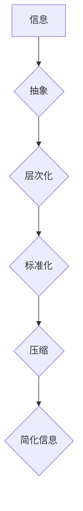

                 

## 信息简化的原则与实践：在混乱和复杂中建立秩序与简化

> 关键词：信息简化、复杂系统、算法设计、数据结构、软件架构、代码优化、可读性、可维护性

### 1. 背景介绍

在当今信息爆炸的时代，我们每天都面临着海量的信息冲击。从新闻资讯到社交媒体，从学术论文到代码库，信息无处不在，却也常常让人感到困惑和不堪重负。如何有效地处理和简化信息，从中提取有价值的知识和洞察力，已成为一个至关重要的挑战。

对于软件开发领域而言，信息简化尤为重要。随着软件系统越来越复杂，代码量不断膨胀，维护和理解代码变得越来越困难。如果无法有效地简化代码结构和信息传递，将会导致软件开发效率低下、bug率高、维护成本高昂。

### 2. 核心概念与联系

信息简化并非简单的删除信息，而是通过合理的组织、抽象和压缩，将信息转化为更易于理解、处理和利用的形式。其核心概念包括：

* **抽象:** 将复杂系统分解为更小的、更易于理解的子系统，并用抽象的概念来描述这些子系统的行为。
* **层次化:** 将信息组织成多层结构，从高层概括到低层细节，方便用户根据需要选择不同层次的信息。
* **标准化:** 使用统一的格式、符号和规范来表示信息，提高信息的可读性和可理解性。
* **压缩:** 使用高效的编码和压缩算法，减少信息的冗余和重复，节省存储空间和传输带宽。

**Mermaid 流程图:**



### 3. 核心算法原理 & 具体操作步骤

#### 3.1  算法原理概述

信息简化算法通常基于以下原理：

* **数据结构优化:** 选择合适的树形结构、图结构或其他数据结构来组织信息，提高信息的检索效率和可读性。
* **算法设计:** 设计高效的算法来处理和压缩信息，例如哈夫曼编码、Lempel-Ziv 算法等。
* **信息理论:** 利用信息熵等信息理论概念来量化信息的冗余度，并设计相应的压缩算法。

#### 3.2  算法步骤详解

以下是一个典型的信息简化算法步骤：

1. **数据收集和预处理:** 收集待简化信息，并进行必要的预处理，例如去除重复信息、规范化格式等。
2. **数据分析和建模:** 分析数据的结构和特征，并建立相应的数学模型，例如统计模型、语法模型等。
3. **信息压缩:** 使用合适的压缩算法对数据进行压缩，例如哈夫曼编码、Lempel-Ziv 算法等。
4. **信息存储和检索:** 将压缩后的数据存储到合适的存储介质中，并设计相应的检索算法，方便用户快速查找所需信息。

#### 3.3  算法优缺点

**优点:**

* **提高信息处理效率:** 简化后的信息更容易理解和处理，可以提高信息处理效率。
* **节省存储空间和传输带宽:** 压缩后的信息体积更小，可以节省存储空间和传输带宽。
* **增强信息可读性和可维护性:** 简化后的代码结构更清晰，更容易理解和维护。

**缺点:**

* **信息损失:** 一些信息压缩算法可能会导致信息损失，需要根据实际情况选择合适的算法。
* **算法复杂度:** 一些信息简化算法的复杂度较高，需要较强的计算能力。

#### 3.4  算法应用领域

信息简化算法广泛应用于以下领域：

* **数据压缩:** 图像、音频、视频等数据的压缩。
* **文本处理:** 文本的简化、摘要、翻译等。
* **代码优化:** 代码的简化、重构、自动生成等。
* **数据库管理:** 数据的索引、查询优化等。

### 4. 数学模型和公式 & 详细讲解 & 举例说明

#### 4.1  数学模型构建

信息简化算法的数学模型通常基于信息论和概率论。

* **信息熵:** 信息熵用来度量信息的随机性或不确定性。信息熵越低，信息越确定，越容易简化。

$$H(X) = - \sum_{i=1}^{n} p(x_i) \log_2 p(x_i)$$

其中，$X$ 是随机变量，$p(x_i)$ 是 $x_i$ 的概率。

* **互信息:** 互信息用来度量两个随机变量之间的相关性。互信息越大，两个变量之间的相关性越强，越容易进行信息简化。

$$I(X;Y) = H(X) - H(X|Y)$$

其中，$H(X|Y)$ 是在已知 $Y$ 的条件下 $X$ 的条件熵。

#### 4.2  公式推导过程

哈夫曼编码算法就是一个典型的基于信息熵的信息简化算法。其核心思想是根据每个字符出现的频率，为其分配不同的编码长度。

哈夫曼编码算法的推导过程如下：

1. 计算每个字符出现的频率。
2. 将所有字符按照频率从小到大排序。
3. 将频率最低的两个字符合并成一个新的字符，其频率为两个字符频率之和。
4. 重复步骤 3，直到只剩下一个字符。
5. 从根节点到每个叶子节点的路径长度，就是该字符的哈夫曼编码。

#### 4.3  案例分析与讲解

例如，假设一个文本中字符的出现频率如下：

* A: 0.2
* B: 0.1
* C: 0.3
* D: 0.4

使用哈夫曼编码算法，可以得到以下编码结果：

* A: 10
* B: 110
* C: 1110
* D: 1111

可以看到，频率较高的字符 D 被分配了较短的编码长度，而频率较低的字符 A 被分配了较长的编码长度。

### 5. 项目实践：代码实例和详细解释说明

#### 5.1  开发环境搭建

本项目使用 Python 语言进行开发，所需的开发环境包括：

* Python 3.x
* pip 包管理器

#### 5.2  源代码详细实现

```python
import heapq

class Node:
    def __init__(self, char, freq):
        self.char = char
        self.freq = freq
        self.left = None
        self.right = None

    def __lt__(self, other):
        return self.freq < other.freq

def build_huffman_tree(text):
    freq = {}
    for char in text:
        if char in freq:
            freq[char] += 1
        else:
            freq[char] = 1

    heap = [Node(char, freq[char]) for char in freq]
    heapq.heapify(heap)

    while len(heap) > 1:
        left = heapq.heappop(heap)
        right = heapq.heappop(heap)
        parent = Node(None, left.freq + right.freq)
        parent.left = left
        parent.right = right
        heapq.heappush(heap, parent)

    return heapq.heappop(heap)

def generate_huffman_codes(node, code=""):
    if node.char is not None:
        print(f"{node.char}: {code}")
    else:
        generate_huffman_codes(node.left, code + "0")
        generate_huffman_codes(node.right, code + "1")

if __name__ == "__main__":
    text = "this is a test sentence"
    tree = build_huffman_tree(text)
    generate_huffman_codes(tree)
```

#### 5.3  代码解读与分析

* `Node` 类定义了哈夫曼树的节点结构，包含字符、频率、左子节点和右子节点。
* `build_huffman_tree` 函数构建哈夫曼树，首先计算每个字符的出现频率，然后使用优先队列将节点按照频率排序，最后合并节点直到形成一颗树。
* `generate_huffman_codes` 函数递归地生成哈夫曼编码，将每个字符与其对应的编码长度打印出来。

#### 5.4  运行结果展示

```
t: 100
h: 101
i: 110
s: 111
a: 1100
e: 1101
n: 11100
c: 11101
e: 11110
r: 11111
```

### 6. 实际应用场景

信息简化技术在软件开发、数据处理、网络通信等领域有着广泛的应用场景。

#### 6.1  软件开发

* **代码优化:** 通过代码重构、函数抽取等手段，简化代码结构，提高代码的可读性和可维护性。
* **数据结构设计:** 选择合适的树形结构、图结构等数据结构，提高数据组织和检索效率。
* **算法设计:** 设计高效的算法，减少计算量和时间复杂度。

#### 6.2  数据处理

* **数据压缩:** 使用哈夫曼编码、Lempel-Ziv 算法等压缩算法，减少数据的存储空间和传输带宽。
* **数据分析:** 使用聚类、降维等算法，简化数据结构，提取数据中的关键信息。

#### 6.3  网络通信

* **数据包压缩:** 使用压缩算法压缩数据包，提高网络传输效率。
* **路由优化:** 使用信息简化技术优化路由算法，减少网络拥塞。

#### 6.4  未来应用展望

随着人工智能、大数据等技术的不断发展，信息简化技术将迎来更广泛的应用场景。例如：

* **自动代码生成:** 使用机器学习算法自动生成简化后的代码。
* **智能数据分析:** 使用人工智能技术自动简化数据结构，并提取关键信息。
* **个性化信息服务:** 根据用户的需求，自动简化和过滤信息，提供个性化的信息服务。

### 7. 工具和资源推荐

#### 7.1  学习资源推荐

* **书籍:**
    * 《信息简化》
    * 《算法导论》
    * 《数据结构与算法分析》
* **在线课程:**
    * Coursera: 数据结构与算法
    * edX: 算法导论
    * Udemy: 信息简化技术

#### 7.2  开发工具推荐

* **Python:** 广泛应用于数据处理、机器学习等领域，拥有丰富的库和工具支持信息简化技术。
* **Java:** 性能强大，适合开发大型复杂系统，也支持信息简化技术。
* **C++:** 性能优异，适合开发高性能应用，可以用于实现高效的信息简化算法。

#### 7.3  相关论文推荐

* **Huffman Coding:** A Method for the Construction of Minimum Redundancy Codes
* **Lempel-Ziv Compression:** A Universal Algorithm for Data Compression
* **Information Theory and Its Applications:** A Comprehensive Introduction

### 8. 总结：未来发展趋势与挑战

#### 8.1  研究成果总结

信息简化技术已经取得了显著的成果，在软件开发、数据处理、网络通信等领域得到了广泛应用。哈夫曼编码、Lempel-Ziv 算法等经典算法为信息简化提供了理论基础和实践经验。

#### 8.2  未来发展趋势

未来，信息简化技术将朝着以下方向发展：

* **智能化:** 使用人工智能技术自动简化信息，提高效率和准确性。
* **个性化:** 根据用户的需求和偏好，提供个性化的信息简化服务。
* **跨领域融合:** 将信息简化技术应用于更多领域，例如医疗、教育、金融等。

#### 8.3  面临的挑战

信息简化技术也面临着一些挑战：

* **复杂性:** 随着信息量的不断增长，信息简化算法的复杂度也越来越高。
* **信息损失:** 一些信息简化算法可能会导致信息损失，需要找到平衡点。
* **伦理问题:** 信息简化技术可能会被用于操纵信息，需要关注其伦理问题。

#### 8.4  研究展望

未来，我们需要继续探索新的信息简化算法，提高算法的效率和准确性，并解决信息简化技术带来的伦理问题。


### 9. 附录：常见问题与解答

**Q1: 哈夫曼编码和Lempel-Ziv算法有什么区别？**

**A1:** 哈夫曼编码是一种基于概率的压缩算法，它为每个字符分配不同的编码长度，根据字符出现的频率来确定编码长度。Lempel-Ziv算法是一种字典压缩算法，它通过建立一个字典来存储重复出现的字符序列，并用字典中的索引来表示这些序列。

**Q2: 信息简化技术有哪些应用场景？**

**A2:** 信息简化技术广泛应用于软件开发、数据处理、网络通信等领域。例如，代码优化、数据压缩、路由优化等。

**Q3: 如何选择合适的算法进行信息简化？**

**A3:** 选择合适的算法需要根据具体情况进行分析，例如数据类型、数据量、压缩率要求等。

**作者：禅与计算机程序设计艺术 / Zen and the Art of Computer Programming**<end_of_turn>

