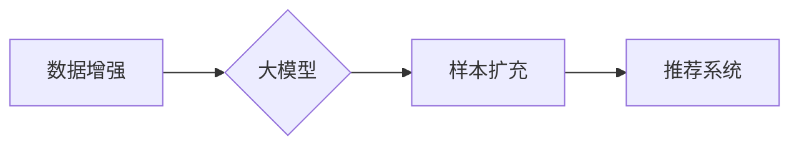

                 

## 利用大模型进行推荐场景的数据增强与样本扩充

> 关键词：大模型、推荐系统、数据增强、样本扩充、迁移学习、冷启动问题

## 1. 背景介绍

推荐系统是现代互联网应用的核心组成部分，广泛应用于电商、社交媒体、视频平台等领域，为用户提供个性化服务，提升用户体验。然而，推荐系统的准确性和效率受到数据质量和样本量的限制。

传统推荐系统依赖于海量用户行为数据进行训练，但现实中，许多场景存在数据稀疏、样本不足等问题，例如新用户、新商品等冷启动问题。这些问题会导致推荐系统性能下降，难以提供精准的推荐结果。

近年来，大模型技术蓬勃发展，其强大的学习能力和泛化能力为解决推荐系统数据增强和样本扩充问题提供了新的思路。大模型能够从海量文本数据中学习到丰富的语义知识和模式，并将其应用于推荐场景，提升推荐系统的性能。

## 2. 核心概念与联系

### 2.1 数据增强

数据增强是指通过对现有数据进行人工或自动的修改，生成新的、类似于原始数据的样本，从而增加训练数据的规模和多样性。

### 2.2 样本扩充

样本扩充是指通过对现有数据进行加工和转换，生成新的样本，以丰富训练数据，解决数据稀疏问题。

### 2.3 大模型

大模型是指参数量巨大、训练数据量庞大的深度学习模型，通常拥有数十亿甚至数千亿个参数。大模型能够学习到更复杂的语义关系和模式，具有强大的泛化能力。

### 2.4 迁移学习

迁移学习是指利用预训练模型在源任务上的知识迁移到目标任务，以提高目标任务的学习效率。

**核心概念与联系流程图**



## 3. 核心算法原理 & 具体操作步骤

### 3.1 算法原理概述

利用大模型进行推荐场景的数据增强和样本扩充，主要基于以下原理：

* **语义理解和生成:** 大模型能够理解用户行为数据背后的语义信息，并生成新的、类似于真实数据的样本。
* **迁移学习:** 利用大模型在其他领域的预训练知识，迁移到推荐场景，提升推荐系统的性能。
* **对抗生成网络 (GAN):** GAN是一种生成模型，能够生成逼真的样本，用于扩充训练数据。

### 3.2 算法步骤详解

1. **预训练大模型:** 使用海量文本数据预训练大模型，使其具备强大的语义理解和生成能力。
2. **数据增强:** 利用大模型对现有用户行为数据进行增强，例如：
    * **文本生成:** 根据用户历史行为，利用大模型生成新的用户评论、浏览记录等文本数据。
    * **数据合成:** 根据用户特征和商品信息，利用大模型合成新的用户-商品交互数据。
3. **样本扩充:** 利用大模型生成新的样本，例如：
    * **文本相似度匹配:** 利用大模型计算用户评论之间的相似度，生成新的用户-商品交互数据。
    * **对抗生成网络 (GAN):** 利用GAN生成新的用户行为数据，例如浏览记录、购买记录等。
4. **训练推荐系统:** 将增强后的数据和原始数据一起用于训练推荐系统模型。

### 3.3 算法优缺点

**优点:**

* 能够有效解决数据稀疏、样本不足等问题。
* 提升推荐系统的准确性和泛化能力。
* 降低对原始数据质量的要求。

**缺点:**

* 需要大量的计算资源和时间进行大模型训练。
* 生成的样本可能与真实数据存在偏差。
* 需要精心设计数据增强和样本扩充策略。

### 3.4 算法应用领域

* **电商推荐:** 增强商品描述、用户评论等数据，提升商品推荐的准确性。
* **社交媒体推荐:** 增强用户兴趣标签、好友关系等数据，提升内容推荐的个性化。
* **视频平台推荐:** 增强用户观看历史、点赞记录等数据，提升视频推荐的精准度。

## 4. 数学模型和公式 & 详细讲解 & 举例说明

### 4.1 数学模型构建

大模型在推荐场景的数据增强和样本扩充中，通常采用基于 Transformer 的模型架构，例如 BERT、GPT 等。这些模型能够学习到复杂的语义关系和模式，并将其应用于数据增强和样本扩充任务。

### 4.2 公式推导过程

Transformer 模型的核心是注意力机制，其能够学习到输入序列中不同词语之间的关系，并赋予每个词语不同的权重。注意力机制的公式如下：

$$
Attention(Q, K, V) = softmax(\frac{QK^T}{\sqrt{d_k}})V
$$

其中：

* $Q$：查询矩阵
* $K$：键矩阵
* $V$：值矩阵
* $d_k$：键向量的维度

### 4.3 案例分析与讲解

例如，在电商推荐场景中，可以使用 Transformer 模型对商品描述进行增强。

1. 将商品描述作为输入序列，构建查询矩阵 $Q$、键矩阵 $K$ 和值矩阵 $V$。
2. 计算注意力权重，并将其与值矩阵相乘，得到加权后的值向量。
3. 将加权后的值向量拼接起来，作为增强后的商品描述。

## 5. 项目实践：代码实例和详细解释说明

### 5.1 开发环境搭建

* Python 3.7+
* PyTorch 1.7+
* Transformers 4.0+

### 5.2 源代码详细实现

```python
from transformers import AutoTokenizer, AutoModelForSeq2SeqLM

# 加载预训练模型和词典
model_name = "bert-base-uncased"
tokenizer = AutoTokenizer.from_pretrained(model_name)
model = AutoModelForSeq2SeqLM.from_pretrained(model_name)

# 定义数据增强函数
def data_augmentation(text):
    inputs = tokenizer(text, return_tensors="pt")
    outputs = model.generate(**inputs)
    augmented_text = tokenizer.decode(outputs[0], skip_special_tokens=True)
    return augmented_text

# 示例代码
original_text = "这是一个商品描述。"
augmented_text = data_augmentation(original_text)
print(f"原始文本: {original_text}")
print(f"增强文本: {augmented_text}")
```

### 5.3 代码解读与分析

* 该代码首先加载预训练的 BERT 模型和词典。
* 然后定义了一个 `data_augmentation` 函数，该函数接受商品描述作为输入，利用 BERT 模型生成增强后的文本。
* 最后，示例代码演示了如何使用该函数对商品描述进行增强。

### 5.4 运行结果展示

运行该代码后，会输出原始文本和增强后的文本。增强后的文本可能与原始文本存在一些差异，例如语法结构、词汇选择等，但总体上能够保留原始文本的语义信息。

## 6. 实际应用场景

### 6.1 电商推荐

* 增强商品描述，提升商品推荐的准确性。
* 生成用户评论，丰富商品信息，提升用户信任度。

### 6.2 社交媒体推荐

* 增强用户兴趣标签，提升内容推荐的个性化。
* 生成用户好友关系，提升社交推荐的精准度。

### 6.3 视频平台推荐

* 增强用户观看历史，提升视频推荐的精准度。
* 生成用户点赞记录，提升视频推荐的个性化。

### 6.4 未来应用展望

* 利用大模型生成更逼真的用户行为数据，提升推荐系统的泛化能力。
* 将大模型与其他推荐算法结合，构建更强大的推荐系统。
* 将大模型应用于更多领域的推荐场景，例如教育、医疗等。

## 7. 工具和资源推荐

### 7.1 学习资源推荐

* **论文:**
    * BERT: Pre-training of Deep Bidirectional Transformers for Language Understanding
    * GPT-3: Language Models are Few-Shot Learners
* **博客:**
    * The Illustrated Transformer
    * Hugging Face Blog

### 7.2 开发工具推荐

* **Transformers:** https://huggingface.co/transformers/
* **PyTorch:** https://pytorch.org/

### 7.3 相关论文推荐

* **Data Augmentation for Recommender Systems: A Survey**
* **Deep Learning for Recommender Systems: A Survey**
* **Transfer Learning for Recommender Systems: A Survey**

## 8. 总结：未来发展趋势与挑战

### 8.1 研究成果总结

利用大模型进行推荐场景的数据增强和样本扩充，取得了显著的成果，有效解决了数据稀疏、样本不足等问题，提升了推荐系统的性能。

### 8.2 未来发展趋势

* **模型规模和能力的提升:** 未来，大模型的规模和能力将继续提升，能够学习到更复杂的语义关系和模式，为数据增强和样本扩充提供更强大的支持。
* **数据增强和样本扩充策略的优化:** 研究人员将继续探索更有效的 data augmentation 和 sample expansion 策略，以生成更逼真、更有效的样本。
* **多模态数据融合:** 将大模型应用于多模态数据融合，例如文本、图像、视频等，为推荐系统提供更丰富的输入信息。

### 8.3 面临的挑战

* **计算资源和训练时间:** 大模型的训练需要大量的计算资源和时间，这对于资源有限的机构或个人来说是一个挑战。
* **数据质量和偏差:** 大模型的性能依赖于训练数据的质量，如果训练数据存在偏差，会导致模型的输出结果也存在偏差。
* **可解释性和透明度:** 大模型的决策过程通常是复杂的，难以解释和透明，这对于推荐系统的可信度和用户信任度是一个挑战。

### 8.4 研究展望

未来，将继续深入研究大模型在推荐场景中的应用，探索更有效的 data augmentation 和 sample expansion 策略，提升推荐系统的性能和可解释性，为用户提供更精准、更个性化的服务。

## 9. 附录：常见问题与解答

**Q1: 大模型的数据增强和样本扩充效果如何？**

A1: 大模型的数据增强和样本扩充效果显著，能够有效解决数据稀疏、样本不足等问题，提升推荐系统的准确性和泛化能力。

**Q2: 如何选择合适的预训练模型？**

A2: 选择预训练模型需要根据具体的应用场景和数据特点进行选择。例如，对于电商推荐场景，可以选择预训练在商品描述和用户评论数据上的模型。

**Q3: 大模型的数据增强和样本扩充需要哪些资源？**

A3: 大模型的数据增强和样本扩充需要强大的计算资源和海量文本数据。

**Q4: 大模型的数据增强和样本扩充存在哪些挑战？**

A4: 大模型的数据增强和样本扩充存在计算资源、数据质量和可解释性等挑战。


作者：禅与计算机程序设计艺术 / Zen and the Art of Computer Programming 
<end_of_turn>

