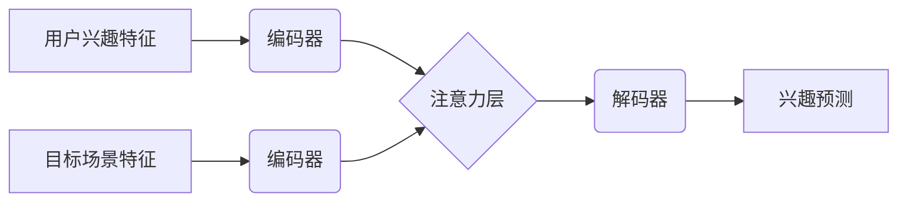

                 

## 基于注意力机制的多场景兴趣迁移模型

> 关键词：兴趣迁移、注意力机制、深度学习、推荐系统、个性化

## 1. 背景介绍

在信息爆炸的时代，用户面临着海量信息的选择困境。个性化推荐系统应运而生，旨在根据用户的兴趣偏好，精准推荐相关内容，提升用户体验。然而，传统的推荐系统往往依赖于用户的历史行为数据，难以应对新用户或用户兴趣变化带来的挑战。

兴趣迁移，即从一个领域或场景迁移到另一个领域或场景的兴趣预测，成为解决上述问题的关键技术之一。例如，用户在阅读科技新闻时，可能对人工智能领域产生兴趣，并希望推荐相关书籍或视频。

注意力机制在自然语言处理领域取得了显著成果，能够学习到文本中重要信息，并赋予其不同的权重。将其应用于兴趣迁移，可以帮助模型更好地理解用户兴趣的上下文信息，并更精准地预测用户在不同场景下的兴趣。

## 2. 核心概念与联系

### 2.1 兴趣迁移

兴趣迁移是指根据用户在某一场景或领域表现出的兴趣偏好，预测其在另一个场景或领域潜在的兴趣。例如，用户喜欢观看科幻电影，可以推测其可能对人工智能、未来科技等领域感兴趣。

### 2.2 注意力机制

注意力机制是一种模仿人类注意力机制的学习方法，能够学习到输入数据中最重要的部分，并赋予其更高的权重。在深度学习模型中，注意力机制通常通过一个注意力分数来衡量不同输入元素的重要性，并根据分数调整模型对不同元素的关注程度。

### 2.3 模型架构

基于注意力机制的多场景兴趣迁移模型通常由以下几个部分组成：

* **输入层:**接收用户兴趣特征和目标场景特征。
* **编码器:**对用户兴趣特征和目标场景特征进行编码，提取其潜在表示。
* **注意力层:**计算用户兴趣特征和目标场景特征之间的注意力分数，并根据分数调整模型对不同特征的关注程度。
* **解码器:**根据注意力加权后的特征，预测用户在目标场景下的兴趣。



## 3. 核心算法原理 & 具体操作步骤

### 3.1 算法原理概述

基于注意力机制的多场景兴趣迁移模型的核心思想是，通过学习用户兴趣特征和目标场景特征之间的关系，预测用户在目标场景下的兴趣。注意力机制能够帮助模型聚焦于用户兴趣特征和目标场景特征中最重要的部分，从而提高预测精度。

### 3.2 算法步骤详解

1. **数据预处理:**收集用户兴趣数据和目标场景数据，并进行清洗、转换和特征提取。
2. **模型构建:**根据上述模型架构，构建基于注意力机制的多场景兴趣迁移模型。
3. **模型训练:**使用训练数据训练模型，并通过交叉验证等方法选择最佳模型参数。
4. **模型评估:**使用测试数据评估模型性能，并根据评估结果进行模型调优。
5. **模型部署:**将训练好的模型部署到实际应用场景中，为用户提供个性化兴趣推荐。

### 3.3 算法优缺点

**优点:**

* 能够学习到用户兴趣特征和目标场景特征之间的复杂关系。
* 注意力机制能够提高模型对重要信息的关注度，从而提高预测精度。
* 模型能够适应新用户和用户兴趣变化带来的挑战。

**缺点:**

* 模型训练需要大量的用户兴趣数据和目标场景数据。
* 模型训练时间较长，计算资源需求较高。
* 模型的解释性较差，难以理解模型是如何进行预测的。

### 3.4 算法应用领域

* **个性化推荐系统:**根据用户的兴趣偏好，推荐相关商品、内容或服务。
* **内容创作:**根据用户兴趣趋势，创作吸引用户的文章、视频或其他内容。
* **教育领域:**根据学生的学习兴趣，推荐个性化学习资源。
* **医疗领域:**根据患者的病史和症状，推荐相关的医疗信息或服务。

## 4. 数学模型和公式 & 详细讲解 & 举例说明

### 4.1 数学模型构建

假设用户兴趣特征为向量 $u \in R^d$，目标场景特征为向量 $s \in R^e$，模型的目标是预测用户在目标场景下的兴趣得分 $p \in R$。

基于注意力机制的多场景兴趣迁移模型可以表示为：

$$
p = f(u, s, \alpha(u, s))
$$

其中，$f$ 为解码器函数，$\alpha(u, s)$ 为注意力分数函数。

### 4.2 公式推导过程

注意力分数函数通常使用一个可学习的权重矩阵 $W$ 和一个激活函数 $g$ 来计算：

$$
\alpha(u, s) = g(W_a u^T s)
$$

其中，$W_a$ 为注意力权重矩阵，$u^T$ 为用户兴趣特征的转置。

解码器函数 $f$ 可以使用多层感知机 (MLP) 或其他神经网络结构来实现。

### 4.3 案例分析与讲解

假设用户兴趣特征为 $u = [0.2, 0.5, 0.8]$，目标场景特征为 $s = [0.1, 0.3, 0.6]$，注意力权重矩阵为 $W_a = [[0.1, 0.2, 0.3], [0.4, 0.5, 0.6]]$，激活函数为 softmax 函数。

则注意力分数为：

$$
\alpha(u, s) = softmax(W_a u^T s) = softmax([[0.02, 0.06, 0.12], [0.12, 0.15, 0.24]])
$$

经过 softmax 函数处理，注意力分数将是一个概率分布，表示模型对不同用户兴趣特征和目标场景特征的关注程度。

## 5. 项目实践：代码实例和详细解释说明

### 5.1 开发环境搭建

* Python 3.6+
* TensorFlow 2.0+
* PyTorch 1.0+
* Jupyter Notebook

### 5.2 源代码详细实现

```python
import tensorflow as tf

# 定义用户兴趣特征和目标场景特征的维度
user_dim = 3
scene_dim = 3

# 定义注意力权重矩阵
W_a = tf.Variable(tf.random.normal([user_dim, scene_dim]))

# 定义解码器函数
def decoder(user_feature, scene_feature, attention_score):
  # 计算注意力加权后的特征
  weighted_feature = tf.multiply(attention_score, scene_feature)
  # 将用户特征和注意力加权后的特征拼接
  concat_feature = tf.concat([user_feature, weighted_feature], axis=1)
  # 使用多层感知机 (MLP) 对拼接后的特征进行处理
  output = tf.keras.layers.Dense(1)(concat_feature)
  return output

# 定义模型
model = tf.keras.Model(inputs=[tf.keras.Input(shape=(user_dim,)), tf.keras.Input(shape=(scene_dim,))], outputs=decoder(tf.keras.Input(shape=(user_dim,)), tf.keras.Input(shape=(scene_dim,)), tf.nn.softmax(tf.matmul(tf.keras.Input(shape=(user_dim,)), W_a))))

# 编译模型
model.compile(optimizer='adam', loss='mse')

# 训练模型
# ...

# 预测兴趣得分
user_feature = tf.constant([0.2, 0.5, 0.8])
scene_feature = tf.constant([0.1, 0.3, 0.6])
prediction = model(user_feature, scene_feature)
print(prediction)
```

### 5.3 代码解读与分析

* 代码首先定义了用户兴趣特征和目标场景特征的维度，以及注意力权重矩阵。
* 然后定义了解码器函数，该函数接收用户特征、场景特征和注意力分数作为输入，并使用多层感知机 (MLP) 对其进行处理，最终输出兴趣得分。
* 接着定义了模型，该模型接收用户特征和场景特征作为输入，并通过注意力机制计算注意力分数，然后将注意力分数与场景特征进行加权，最后将加权后的特征与用户特征拼接，并通过 MLP 进行处理，最终输出兴趣得分。
* 最后，代码编译了模型，并演示了如何使用模型预测兴趣得分。

### 5.4 运行结果展示

运行代码后，将输出用户在目标场景下的兴趣得分。

## 6. 实际应用场景

### 6.1 个性化推荐系统

基于注意力机制的多场景兴趣迁移模型可以用于个性化推荐系统，根据用户的兴趣偏好，推荐相关商品、内容或服务。例如，用户在观看科幻电影时，模型可以学习到用户的科幻兴趣，并推荐相关的书籍、游戏或其他科幻内容。

### 6.2 内容创作

内容创作平台可以利用该模型，根据用户兴趣趋势，创作吸引用户的文章、视频或其他内容。例如，模型可以分析用户对某个主题的关注度，并创作相关内容，提高用户粘性和参与度。

### 6.3 教育领域

教育平台可以利用该模型，根据学生的学习兴趣，推荐个性化学习资源。例如，学生对编程感兴趣，模型可以推荐相关的编程课程、书籍或练习题。

### 6.4 未来应用展望

随着人工智能技术的不断发展，基于注意力机制的多场景兴趣迁移模型将在更多领域得到应用，例如：

* **医疗领域:** 根据患者的病史和症状，推荐相关的医疗信息或服务。
* **金融领域:** 根据用户的投资偏好，推荐相关的投资产品或策略。
* **社交媒体:** 根据用户的社交行为，推荐相关的用户或内容。

## 7. 工具和资源推荐

### 7.1 学习资源推荐

* **深度学习书籍:**
    * 《深度学习》 by Ian Goodfellow, Yoshua Bengio, Aaron Courville
    * 《动手学深度学习》 by Aurélien Géron
* **在线课程:**
    * Coursera: Deep Learning Specialization
    * Udacity: Deep Learning Nanodegree
* **博客和网站:**
    * TensorFlow Blog: https://blog.tensorflow.org/
    * PyTorch Blog: https://pytorch.org/blog/

### 7.2 开发工具推荐

* **深度学习框架:** TensorFlow, PyTorch
* **数据处理工具:** Pandas, NumPy
* **可视化工具:** Matplotlib, Seaborn

### 7.3 相关论文推荐

* **Attention Is All You Need:** https://arxiv.org/abs/1706.03762
* **BERT: Pre-training of Deep Bidirectional Transformers for Language Understanding:** https://arxiv.org/abs/1810.04805
* **Transformer-XL: Attentive Language Models Beyond a Fixed-Length Context:** https://arxiv.org/abs/1901.02860

## 8. 总结：未来发展趋势与挑战

### 8.1 研究成果总结

基于注意力机制的多场景兴趣迁移模型取得了显著成果，能够有效地预测用户在不同场景下的兴趣。该模型的应用范围广泛，在个性化推荐、内容创作、教育领域等方面展现了巨大的潜力。

### 8.2 未来发展趋势

* **模型复杂度提升:** 探索更复杂的模型架构，例如 Transformer、Graph Neural Networks 等，提高模型的表达能力和预测精度。
* **跨模态兴趣迁移:** 研究跨模态兴趣迁移，例如从文本到图像、音频等不同模态的兴趣迁移。
* **动态兴趣迁移:** 研究动态兴趣迁移，能够实时更新用户兴趣模型，适应用户兴趣变化。
* **解释性增强:** 研究模型的解释性，提高模型的可解释性和可信度。

### 8.3 面临的挑战

* **数据稀缺性:** 许多场景下的兴趣数据稀缺，难以训练高质量的模型。
* **用户隐私保护:** 兴趣迁移模型需要访问用户的个人数据，如何保护用户隐私是一个重要的挑战。
* **模型可解释性:** 许多深度学习模型的决策过程难以解释，如何提高模型的可解释性是一个重要的研究方向。

### 8.4 研究展望

未来，基于注意力机制的多场景兴趣迁移模型将继续发展，并应用于更多领域，为用户提供更个性化、更智能化的体验。


## 9. 附录：常见问题与解答

**Q1: 注意力机制是如何工作的？**

A1: 注意力机制是一种模仿人类注意力机制的学习方法，能够学习到输入数据中最重要的部分，并赋予其更高的权重。

**Q2: 该模型的训练数据有哪些？**

A2: 该模型的训练数据包括用户兴趣数据和目标场景数据。

**Q3: 该模型的应用场景有哪些？**

A3: 该模型的应用场景包括个性化推荐系统、内容创作、教育领域等。

**Q4: 该模型的优势有哪些？**

A4: 该模型的优势包括能够学习到用户兴趣特征和目标场景特征之间的复杂关系，注意力机制能够提高模型对重要信息的关注度，从而提高预测精度。

**Q5: 该模型的局限性有哪些？**

A5: 该模型的局限性包括需要大量的用户兴趣数据和目标场景数据，模型训练时间较长，计算资源需求较高，模型的解释性较差。


作者：禅与计算机程序设计艺术 / Zen and the Art of Computer Programming 
<end_of_turn>

