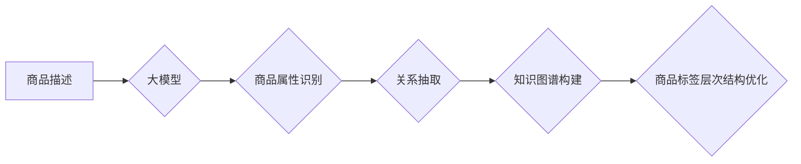

                 

## 大模型在商品标签层次结构优化中的应用

> 关键词：大模型、商品标签、层次结构优化、自然语言处理、推荐系统、知识图谱、信息检索

## 1. 背景介绍

随着电商平台的蓬勃发展，商品标签体系的构建和维护成为了一个至关重要的环节。商品标签不仅是商品信息的重要载体，也是用户搜索和浏览商品的关键入口。一个合理的商品标签层次结构可以有效提升用户体验，提高商品的曝光率和转化率。然而，传统的商品标签体系往往依赖人工标注，效率低下，难以适应海量商品的快速增长和不断变化的市场需求。

近年来，大模型技术在自然语言处理领域取得了突破性进展，展现出强大的文本理解和生成能力。大模型能够学习商品描述、用户评论等海量文本数据，自动识别商品属性和关系，并构建更加智能、灵活的商品标签层次结构。

## 2. 核心概念与联系

### 2.1 商品标签层次结构

商品标签层次结构是指将商品按照一定的逻辑关系进行分类和组织的树形结构。它通常由多个层级组成，从广义到特义，例如：

* **一级分类:** 服装、电子产品、家居用品等
* **二级分类:** 男装、女装、童装等
* **三级分类:** T恤、衬衫、裤子等

### 2.2 大模型

大模型是指参数量巨大、训练数据海量的人工智能模型。它能够学习复杂的文本模式和语义关系，并应用于各种自然语言处理任务，例如文本分类、文本生成、机器翻译等。

### 2.3 自然语言处理 (NLP)

自然语言处理是指让计算机能够理解、处理和生成人类语言的技术。它涉及到许多子领域，例如：

* **文本分类:** 将文本自动归类到预定义的类别中。
* **文本生成:** 根据给定的输入文本生成新的文本。
* **机器翻译:** 将文本从一种语言翻译成另一种语言。

### 2.4 知识图谱

知识图谱是一种结构化的知识表示形式，它将实体和关系以图的形式表示。知识图谱可以帮助大模型理解商品之间的关系，构建更加准确的商品标签层次结构。

**Mermaid 流程图**



## 3. 核心算法原理 & 具体操作步骤

### 3.1 算法原理概述

大模型在商品标签层次结构优化中的应用主要基于以下核心算法：

* **文本嵌入:** 将商品描述和标签文本转换为向量表示，以便大模型进行理解和比较。
* **聚类算法:** 将商品按照其文本嵌入相似度进行聚类，识别出潜在的商品类别。
* **树构建算法:** 将聚类结果构建成层次结构，形成商品标签体系。

### 3.2 算法步骤详解

1. **数据预处理:** 收集商品描述、标签文本等数据，进行清洗、去停用词、分词等预处理操作。
2. **文本嵌入:** 使用预训练的语言模型 (例如BERT、RoBERTa) 对商品描述和标签文本进行嵌入，获得其向量表示。
3. **聚类分析:** 使用聚类算法 (例如K-Means、层次聚类) 将商品按照其文本嵌入相似度进行聚类，识别出潜在的商品类别。
4. **层次结构构建:** 将聚类结果构建成层次结构，形成商品标签体系。可以使用树构建算法 (例如贪婪算法、动态规划算法) 进行层次结构构建。
5. **标签优化:** 根据商品属性、用户反馈等信息，对生成的标签体系进行优化，例如调整标签的名称、层次关系等。

### 3.3 算法优缺点

**优点:**

* 自动化程度高，可以有效提高效率。
* 能够学习商品之间的语义关系，构建更加智能的标签体系。
* 可以根据市场需求动态调整标签体系。

**缺点:**

* 需要大量的训练数据，训练成本较高。
* 算法效果受训练数据质量影响较大。
* 难以完全覆盖所有商品种类和属性。

### 3.4 算法应用领域

* **电商平台商品分类:** 自动构建商品标签体系，提高商品搜索和浏览效率。
* **推荐系统:** 根据商品标签信息，为用户推荐相关商品。
* **知识图谱构建:** 将商品信息融入知识图谱，构建商品知识体系。
* **信息检索:** 根据商品标签信息，提高信息检索的准确性和效率。

## 4. 数学模型和公式 & 详细讲解 & 举例说明

### 4.1 数学模型构建

**文本嵌入模型:**

假设商品描述为文本序列 $x = (x_1, x_2, ..., x_n)$，其中 $x_i$ 为第 $i$ 个单词。可以使用预训练的语言模型将每个单词嵌入到向量空间中，得到其向量表示 $e_i$。

**聚类模型:**

可以使用K-Means聚类算法将商品按照其文本嵌入向量相似度进行聚类。

**K-Means算法:**

1. 随机选择K个商品作为初始聚类中心。
2. 将每个商品分配到与其最近的聚类中心所属的类别。
3. 更新每个聚类中心的坐标为该类别的所有商品的平均向量。
4. 重复步骤2和3，直到聚类中心不再变化。

### 4.2 公式推导过程

**文本嵌入向量计算:**

$$
e_i = f(x_i)
$$

其中，$f$ 为预训练语言模型的嵌入函数。

**距离计算:**

$$
d(e_i, e_j) = ||e_i - e_j||
$$

其中，$||.||$ 为向量的欧几里得距离。

**聚类中心更新:**

$$
c_k = \frac{1}{n_k} \sum_{i \in C_k} e_i
$$

其中，$c_k$ 为第 $k$ 个聚类中心的坐标，$n_k$ 为第 $k$ 个聚类中商品的数量，$C_k$ 为第 $k$ 个聚类包含的所有商品。

### 4.3 案例分析与讲解

假设我们有一个电商平台，需要对服装商品进行分类。可以使用大模型将商品描述嵌入到向量空间中，然后使用K-Means算法进行聚类。

例如，我们可以将商品描述“红色长袖T恤”嵌入到向量空间中，然后将其与其他商品描述进行比较，找到与其最相似的商品。如果发现多个商品描述都与“红色长袖T恤”相似，则可以将它们聚类到同一个类别中。

## 5. 项目实践：代码实例和详细解释说明

### 5.1 开发环境搭建

* Python 3.7+
* TensorFlow 2.0+
* PyTorch 1.0+
* NLTK
* SpaCy

### 5.2 源代码详细实现

```python
# 导入必要的库
import tensorflow as tf
from sklearn.cluster import KMeans

# 定义文本嵌入模型
model = tf.keras.models.load_model('bert_model')

# 预处理商品描述
def preprocess_text(text):
  # ... (文本清洗、去停用词、分词等操作)

# 生成商品描述的文本嵌入向量
def get_text_embedding(text):
  # ... (使用预训练模型生成文本嵌入向量)

# 训练K-Means聚类模型
def train_kmeans(texts, num_clusters):
  embeddings = [get_text_embedding(text) for text in texts]
  kmeans = KMeans(n_clusters=num_clusters)
  kmeans.fit(embeddings)
  return kmeans

# 构建商品标签层次结构
def build_hierarchy(kmeans, texts):
  # ... (根据聚类结果构建层次结构)

# ... (其他代码)
```

### 5.3 代码解读与分析

* **文本嵌入模型:** 使用预训练的BERT模型生成商品描述的文本嵌入向量。
* **预处理文本:** 对商品描述进行清洗、去停用词、分词等预处理操作，以便模型更好地理解文本内容。
* **训练K-Means聚类模型:** 使用K-Means算法将商品按照其文本嵌入向量相似度进行聚类。
* **构建商品标签层次结构:** 根据聚类结果构建商品标签层次结构，例如将每个聚类作为一级分类，进一步细化到二级、三级分类等。

### 5.4 运行结果展示

* 可视化商品标签层次结构
* 展示聚类结果的准确率和召回率
* 分析商品标签体系的覆盖率和完整性

## 6. 实际应用场景

### 6.1 电商平台商品分类

大模型可以自动构建商品标签体系，提高商品搜索和浏览效率。例如，淘宝、京东等电商平台可以使用大模型将商品描述自动分类，方便用户查找所需商品。

### 6.2 推荐系统

根据商品标签信息，可以为用户推荐相关商品。例如，如果用户购买了“红色长袖T恤”，则可以根据标签信息推荐其他颜色、款式、品牌的T恤。

### 6.3 知识图谱构建

将商品信息融入知识图谱，构建商品知识体系。例如，可以将商品的属性、品牌、价格等信息存储在知识图谱中，方便用户查询和分析商品信息。

### 6.4 未来应用展望

* **个性化商品标签:** 根据用户的购买历史、浏览记录等信息，为用户个性化定制商品标签体系。
* **跨平台商品标签共享:** 建立跨平台商品标签共享机制，方便用户在不同平台搜索和购买商品。
* **商品标签自动更新:** 根据市场需求和商品信息变化，自动更新商品标签体系，保持其准确性和时效性。

## 7. 工具和资源推荐

### 7.1 学习资源推荐

* **书籍:**
    * 《深度学习》 by Ian Goodfellow, Yoshua Bengio, Aaron Courville
    * 《自然语言处理》 by Dan Jurafsky, James H. Martin
* **在线课程:**
    * Coursera: Natural Language Processing Specialization
    * Udacity: Deep Learning Nanodegree
* **博客和网站:**
    * TensorFlow Blog: https://blog.tensorflow.org/
    * PyTorch Blog: https://pytorch.org/blog/
    * Hugging Face: https://huggingface.co/

### 7.2 开发工具推荐

* **TensorFlow:** https://www.tensorflow.org/
* **PyTorch:** https://pytorch.org/
* **NLTK:** https://www.nltk.org/
* **SpaCy:** https://spacy.io/

### 7.3 相关论文推荐

* **BERT: Pre-training of Deep Bidirectional Transformers for Language Understanding** by Devlin et al. (2018)
* **RoBERTa: A Robustly Optimized BERT Pretraining Approach** by Liu et al. (2019)
* **K-Means Clustering** by MacQueen (1967)

## 8. 总结：未来发展趋势与挑战

### 8.1 研究成果总结

大模型在商品标签层次结构优化领域取得了显著进展，能够自动构建更加智能、灵活的商品标签体系，提高商品搜索和浏览效率，为电商平台和用户带来更好的体验。

### 8.2 未来发展趋势

* **模型规模和能力提升:** 随着计算资源的不断发展，大模型的规模和能力将进一步提升，能够学习更加复杂的商品关系和语义信息。
* **多模态融合:** 将文本、图像、视频等多模态信息融合到商品标签体系中，构建更加全面的商品知识图谱。
* **个性化定制:** 根据用户的个性化需求，定制更加精准的商品标签体系。

### 8.3 面临的挑战

* **数据质量和标注成本:** 大模型的训练需要海量高质量的数据，数据标注成本较高。
* **算法解释性和可解释性:** 大模型的决策过程往往难以解释，需要进一步研究算法的解释性和可解释性。
* **公平性和偏见:** 大模型可能存在公平性和偏见问题，需要进行充分的测试和评估，确保其输出结果公平公正。

### 8.4 研究展望

未来，大模型在商品标签层次结构优化领域将继续发挥重要作用，推动电商平台和用户体验的进一步提升。需要加强对大模型算法的理论研究，提高其效率、准确性和可解释性，并解决其公平性和偏见问题，使其更好地服务于社会发展。

## 9. 附录：常见问题与解答

**Q1: 大模型需要多少数据才能训练？**

A1: 大模型的训练数据量通常非常庞大，可能需要数百万甚至数十亿条文本数据。

**Q2: 如何评估大模型的性能？**

A2: 可以使用准确率、召回率、F1-score等指标来评估大模型的性能。

**Q3: 大模型的训练成本很高吗？**

A3: 是的，大模型的训练成本较高，需要强大的计算资源和专业技术人员。


作者：禅与计算机程序设计艺术 / Zen and the Art of Computer Programming 
<end_of_turn>

