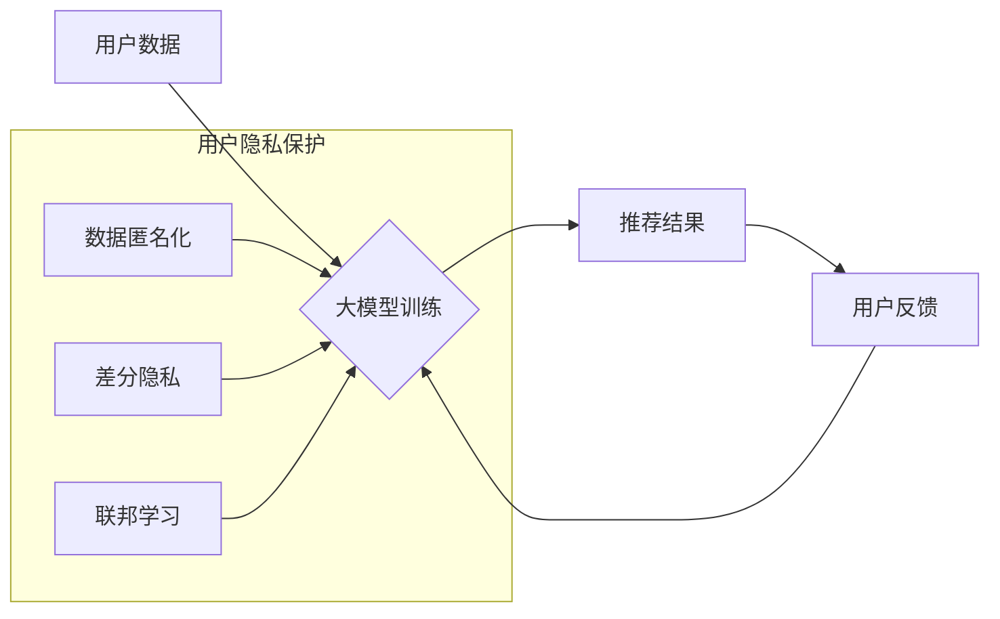

                 

## 大模型推荐中的用户隐私与安全问题思考

> 关键词：大模型推荐、用户隐私、数据安全、联邦学习、差分隐私、对抗攻击、模型可解释性

## 1. 背景介绍

近年来，大模型在推荐系统领域取得了显著的进展，其强大的学习能力和泛化能力使得推荐效果大幅提升，为用户提供更加个性化、精准的服务。然而，大模型推荐系统也面临着严峻的挑战，其中用户隐私和数据安全问题尤为突出。

大模型推荐系统通常依赖于海量用户数据进行训练，这些数据包含用户的兴趣偏好、行为模式、个人信息等敏感数据。如果这些数据被泄露或滥用，将可能导致用户隐私泄露、身份盗窃、信息欺诈等严重后果。

## 2. 核心概念与联系

### 2.1 用户隐私

用户隐私是指用户个人信息不被未经授权的第三方获取、使用、披露或利用的权利。在推荐系统中，用户隐私涉及到以下几个方面：

* **数据敏感性:** 用户数据可能包含敏感信息，例如姓名、地址、电话号码、购物记录、浏览历史等。
* **数据可识别性:** 用户数据可能能够被用于识别用户的身份，例如通过用户的兴趣偏好和行为模式推断出用户的真实身份。
* **数据控制权:** 用户应该有权控制自己的数据，例如选择哪些数据被收集、使用和共享。

### 2.2 数据安全

数据安全是指保护用户数据免受未经授权的访问、使用、披露或修改的措施。在推荐系统中，数据安全涉及到以下几个方面：

* **数据加密:** 使用加密技术保护用户数据在传输和存储过程中不被窃取。
* **访问控制:** 通过身份验证和授权机制控制用户数据的访问权限。
* **数据备份和恢复:** 定期备份用户数据，并建立数据恢复机制，以防数据丢失或损坏。

### 2.3 核心概念联系

大模型推荐系统需要大量用户数据进行训练，而这些数据也包含着用户的隐私信息。因此，在设计和部署大模型推荐系统时，需要兼顾推荐效果和用户隐私安全。

**Mermaid 流程图**



## 3. 核心算法原理 & 具体操作步骤

### 3.1 算法原理概述

大模型推荐算法通常基于深度学习技术，例如Transformer、BERT等，通过学习用户行为数据和物品特征数据之间的关系，预测用户对特定物品的兴趣。

### 3.2 算法步骤详解

1. **数据预处理:** 收集用户行为数据和物品特征数据，并进行清洗、转换、编码等预处理操作。
2. **模型构建:** 选择合适的深度学习模型架构，并根据训练数据进行模型参数初始化。
3. **模型训练:** 使用训练数据训练模型，并通过优化算法调整模型参数，使得模型能够准确预测用户兴趣。
4. **模型评估:** 使用测试数据评估模型性能，并根据评估结果进行模型调优。
5. **模型部署:** 将训练好的模型部署到线上环境，用于实时推荐。

### 3.3 算法优缺点

**优点:**

* 推荐效果显著提升
* 能够处理海量数据
* 具备强大的泛化能力

**缺点:**

* 训练成本高
* 对数据质量要求高
* 模型解释性差

### 3.4 算法应用领域

大模型推荐算法广泛应用于以下领域:

* 电子商务推荐
* 内容推荐
* 社交推荐
* 搜索推荐

## 4. 数学模型和公式 & 详细讲解 & 举例说明

### 4.1 数学模型构建

大模型推荐系统通常使用协同过滤模型，例如矩阵分解模型，来预测用户对物品的评分。

**矩阵分解模型**

假设用户集合为U，物品集合为I，用户-物品评分矩阵为R，其中R(u,i)表示用户u对物品i的评分。矩阵分解模型将用户-物品评分矩阵分解成两个低维矩阵：用户特征矩阵U和物品特征矩阵V。

**公式:**

$$R(u,i) \approx u^T v_i$$

其中，u是用户u的特征向量，v_i是物品i的特征向量。

### 4.2 公式推导过程

矩阵分解模型的目标是找到最优的用户特征矩阵U和物品特征矩阵V，使得预测评分与实际评分之间的误差最小。

可以使用最小二乘法或梯度下降法来优化模型参数。

### 4.3 案例分析与讲解

例如，假设有一个用户-物品评分矩阵R，其中包含了用户对电影的评分信息。

可以使用矩阵分解模型将用户和电影分别表示为低维特征向量，并通过训练模型来学习用户和电影之间的关系。

最终，可以利用训练好的模型来预测用户对未观看的电影的评分。

## 5. 项目实践：代码实例和详细解释说明

### 5.1 开发环境搭建

* Python 3.6+
* TensorFlow/PyTorch
* Jupyter Notebook

### 5.2 源代码详细实现

```python
import tensorflow as tf

# 定义用户特征矩阵U和物品特征矩阵V
U = tf.Variable(tf.random.normal([num_users, embedding_dim]))
V = tf.Variable(tf.random.normal([num_items, embedding_dim]))

# 定义预测评分函数
def predict_rating(u, i):
  return tf.reduce_sum(U[u] * V[i])

# 定义损失函数
def loss_function(R, predictions):
  return tf.reduce_mean(tf.square(R - predictions))

# 定义优化器
optimizer = tf.keras.optimizers.Adam()

# 训练模型
for epoch in range(num_epochs):
  for u in range(num_users):
    for i in range(num_items):
      # 计算预测评分
      prediction = predict_rating(u, i)
      # 计算损失
      loss = loss_function(R, prediction)
      # 更新模型参数
      optimizer.minimize(loss)

# 保存模型
tf.saved_model.save(model, "model")
```

### 5.3 代码解读与分析

* 代码首先定义了用户特征矩阵U和物品特征矩阵V，并使用随机值初始化。
* 然后定义了预测评分函数，该函数使用用户特征向量和物品特征向量进行点积运算来预测评分。
* 损失函数使用均方误差来衡量预测评分与实际评分之间的差异。
* 使用Adam优化器来更新模型参数，使得损失函数最小化。
* 最后，将训练好的模型保存为SavedModel格式。

### 5.4 运行结果展示

训练完成后，可以使用保存的模型来预测用户对未观看的电影的评分。

## 6. 实际应用场景

### 6.1 电子商务推荐

大模型推荐系统可以用于推荐商品、优惠券、促销活动等，提高用户购物体验和转化率。

### 6.2 内容推荐

大模型推荐系统可以用于推荐新闻、视频、音乐、书籍等内容，满足用户个性化需求。

### 6.3 社交推荐

大模型推荐系统可以用于推荐好友、群组、活动等，帮助用户拓展社交圈。

### 6.4 未来应用展望

大模型推荐系统将在以下方面得到进一步发展:

* **更精准的推荐:** 利用更先进的深度学习算法和数据分析技术，提供更精准的推荐结果。
* **更个性化的推荐:** 结合用户行为数据、兴趣偏好、生活习惯等多方面信息，提供更个性化的推荐服务。
* **更智能的推荐:** 利用自然语言处理、知识图谱等技术，实现更智能的推荐，例如根据用户的意图进行推荐。

## 7. 工具和资源推荐

### 7.1 学习资源推荐

* **书籍:**
    * Deep Learning by Ian Goodfellow
    * Recommender Systems by Alessandro Biffo
* **在线课程:**
    * Coursera: Machine Learning
    * Udacity: Deep Learning Nanodegree
* **博客和论坛:**
    * Towards Data Science
    * Kaggle

### 7.2 开发工具推荐

* **Python:** 
    * TensorFlow
    * PyTorch
    * Scikit-learn
* **云平台:**
    * AWS
    * Google Cloud Platform
    * Azure

### 7.3 相关论文推荐

* **BERT for Recommender Systems**
* **Deep Learning for Recommender Systems: A Survey**
* **Federated Learning for Recommender Systems**

## 8. 总结：未来发展趋势与挑战

### 8.1 研究成果总结

大模型推荐系统在推荐效果、个性化程度、智能化程度等方面取得了显著的进展，为用户提供更加便捷、高效的推荐服务。

### 8.2 未来发展趋势

大模型推荐系统将朝着以下方向发展:

* **更精准的推荐:** 利用更先进的深度学习算法和数据分析技术，提供更精准的推荐结果。
* **更个性化的推荐:** 结合用户行为数据、兴趣偏好、生活习惯等多方面信息，提供更个性化的推荐服务。
* **更智能的推荐:** 利用自然语言处理、知识图谱等技术，实现更智能的推荐，例如根据用户的意图进行推荐。

### 8.3 面临的挑战

大模型推荐系统也面临着一些挑战:

* **数据隐私和安全:** 大模型推荐系统依赖于海量用户数据，如何保护用户隐私和数据安全是关键问题。
* **模型解释性:** 大模型的决策过程往往是复杂的，难以解释，这可能会导致用户对推荐结果缺乏信任。
* **公平性和偏见:** 大模型可能会学习到数据中的偏见，导致推荐结果不公平。

### 8.4 研究展望

未来，需要进一步研究以下问题:

* 如何设计更有效的隐私保护机制，保障用户数据安全。
* 如何提高大模型的解释性，增强用户对推荐结果的信任。
* 如何缓解大模型中的公平性和偏见问题，确保推荐结果公平公正。


## 9. 附录：常见问题与解答

### 9.1 如何保护用户隐私？

* **数据匿名化:** 将用户数据中的敏感信息进行脱敏处理，例如替换用户ID、姓名等敏感信息。
* **差分隐私:** 使用差分隐私技术来保护用户数据隐私，使得模型训练过程中无法识别单个用户的隐私信息。
* **联邦学习:** 使用联邦学习技术来训练模型，使得模型训练数据不会集中在单一服务器上，从而降低数据泄露风险。

### 9.2 如何提高模型解释性？

* **可解释性模型:** 使用可解释性模型，例如线性回归、决策树等，来替代复杂的深度学习模型。
* **模型可视化:** 使用模型可视化技术，例如特征重要性分析、决策边界可视化等，来帮助用户理解模型的决策过程。
* **人工解释:** 通过人工分析模型的决策过程，并提供解释性报告，帮助用户理解推荐结果。


作者：禅与计算机程序设计艺术 / Zen and the Art of Computer Programming 
<end_of_turn>

