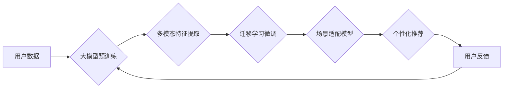

                 

## 大模型驱动的推荐系统多场景适配

> 关键词：大模型、推荐系统、场景适配、多模态、个性化、迁移学习、联邦学习

## 1. 背景介绍

推荐系统作为互联网时代的核心技术之一，在电商、社交媒体、视频平台等领域发挥着至关重要的作用。传统的推荐系统主要依赖于用户行为数据和协同过滤算法，但随着数据规模的增长和用户需求的多样化，传统的推荐系统面临着以下挑战：

* **数据稀疏性:** 用户行为数据往往存在稀疏性，难以捕捉用户细粒度的兴趣偏好。
* **冷启动问题:** 新用户和新商品难以获得准确的推荐，导致推荐效果不佳。
* **场景多样性:** 用户在不同的场景下，对推荐内容的需求和偏好可能存在差异，传统的单一推荐模型难以满足多场景需求。

近年来，大模型的兴起为推荐系统的发展带来了新的机遇。大模型具备强大的泛化能力和知识表示能力，能够从海量数据中学习到更深层的用户兴趣和商品特征，从而提升推荐系统的准确性和个性化程度。

## 2. 核心概念与联系

大模型驱动的推荐系统主要通过以下核心概念实现多场景适配：

* **大模型:** 指参数规模庞大、训练数据海量的人工智能模型，例如BERT、GPT-3等。
* **多模态学习:**  融合文本、图像、音频等多种数据类型，构建更全面的用户和商品表示。
* **迁移学习:** 利用预训练的大模型，在目标场景下进行微调，提升模型的适应性和效率。
* **联邦学习:** 在不共享原始数据的情况下，通过模型参数的迭代更新，实现多场景数据的联合训练。

**核心架构流程图:**



## 3. 核心算法原理 & 具体操作步骤

### 3.1  算法原理概述

大模型驱动的推荐系统主要基于以下算法原理：

* **深度学习:** 利用多层神经网络，学习用户和商品之间的复杂关系。
* **注意力机制:**  关注用户兴趣相关的关键信息，提升推荐的精准度。
* **自编码器:**  学习用户和商品的潜在特征表示，增强推荐的泛化能力。

### 3.2  算法步骤详解

1. **数据预处理:** 收集用户行为数据、商品信息等数据，进行清洗、格式化和特征工程。
2. **大模型预训练:** 利用海量数据对大模型进行预训练，学习通用语言表示和知识。
3. **多模态特征提取:** 将文本、图像、音频等数据转换为可学习的特征向量，融合多模态信息。
4. **迁移学习微调:**  将预训练的大模型迁移到目标场景，利用少量目标数据进行微调，提升模型的适应性。
5. **场景适配模型构建:**  根据不同的场景需求，构建个性化的推荐模型，例如基于用户的场景模型、基于商品的场景模型等。
6. **个性化推荐:**  根据用户的历史行为、偏好和当前场景，生成个性化的推荐结果。
7. **用户反馈收集:** 收集用户的点击、评分、购买等反馈信息，用于模型的持续优化和迭代。

### 3.3  算法优缺点

**优点:**

* **提升推荐精准度:** 大模型的强大学习能力能够捕捉用户细粒度的兴趣偏好，提升推荐的精准度。
* **解决冷启动问题:**  迁移学习能够利用预训练模型的知识，有效解决新用户和新商品的冷启动问题。
* **支持多场景适配:**  场景适配模型能够根据不同的场景需求，提供个性化的推荐服务。

**缺点:**

* **训练成本高:** 大模型的训练需要大量的计算资源和时间。
* **数据隐私问题:**  大模型的训练需要大量用户数据，需要妥善处理数据隐私问题。
* **模型解释性差:**  大模型的决策过程较为复杂，难以解释模型的推荐结果。

### 3.4  算法应用领域

大模型驱动的推荐系统广泛应用于以下领域:

* **电商推荐:**  推荐商品、优惠券、促销活动等。
* **社交媒体推荐:**  推荐好友、话题、内容等。
* **视频平台推荐:**  推荐视频、直播、用户等。
* **音乐平台推荐:**  推荐歌曲、专辑、歌手等。

## 4. 数学模型和公式 & 详细讲解 & 举例说明

### 4.1  数学模型构建

大模型驱动的推荐系统通常采用基于用户的协同过滤模型或基于内容的协同过滤模型。

**基于用户的协同过滤模型:**

该模型假设用户具有相似的兴趣偏好，通过计算用户之间的相似度，推荐用户喜欢的商品。

**数学公式:**

$$
Sim(u_i, u_j) = \frac{\sum_{k=1}^{N} r_{i,k} * r_{j,k}}{\sqrt{\sum_{k=1}^{N} r_{i,k}^2} * \sqrt{\sum_{k=1}^{N} r_{j,k}^2}}
$$

其中:

* $Sim(u_i, u_j)$ 表示用户 $u_i$ 和 $u_j$ 之间的相似度。
* $r_{i,k}$ 表示用户 $u_i$ 对商品 $k$ 的评分。
* $N$ 表示商品总数。

**基于内容的协同过滤模型:**

该模型假设用户对商品的兴趣与商品的特征相关，通过计算商品之间的相似度，推荐用户喜欢的商品。

**数学公式:**

$$
Sim(i, j) = \frac{\sum_{f=1}^{F} v_{i,f} * v_{j,f}}{\sqrt{\sum_{f=1}^{F} v_{i,f}^2} * \sqrt{\sum_{f=1}^{F} v_{j,f}^2}}
$$

其中:

* $Sim(i, j)$ 表示商品 $i$ 和 $j$ 之间的相似度。
* $v_{i,f}$ 表示商品 $i$ 的特征 $f$ 的值。
* $F$ 表示特征总数。

### 4.2  公式推导过程

上述公式的推导过程基于余弦相似度计算。余弦相似度能够衡量两个向量的夹角大小，从而反映两个向量的相似程度。

### 4.3  案例分析与讲解

假设有两个用户 $u_1$ 和 $u_2$，他们对以下三个商品的评分如下:

* 商品 $1$: $u_1$ 评分为 $5$，$u_2$ 评分为 $4$。
* 商品 $2$: $u_1$ 评分为 $3$，$u_2$ 评分为 $2$。
* 商品 $3$: $u_1$ 评分为 $4$，$u_2$ 评分为 $5$。

根据基于用户的协同过滤模型的公式，我们可以计算出 $u_1$ 和 $u_2$ 之间的相似度为:

$$
Sim(u_1, u_2) = \frac{5*4 + 3*2 + 4*5}{\sqrt{5^2 + 3^2 + 4^2} * \sqrt{4^2 + 2^2 + 5^2}} = 0.8
$$

该结果表明 $u_1$ 和 $u_2$ 之间存在一定的相似性，因此可以推荐 $u_2$ 喜欢的商品给 $u_1$。

## 5. 项目实践：代码实例和详细解释说明

### 5.1  开发环境搭建

推荐系统开发环境通常包括以下组件:

* **编程语言:** Python 是推荐系统开发的常用语言，拥有丰富的机器学习库和工具。
* **深度学习框架:** TensorFlow、PyTorch 等深度学习框架提供高效的模型训练和推理能力。
* **数据存储:**  MySQL、MongoDB 等数据库用于存储用户行为数据、商品信息等。
* **云计算平台:**  AWS、Azure、GCP 等云计算平台提供强大的计算资源和服务。

### 5.2  源代码详细实现

以下是一个基于 PyTorch 的大模型驱动的推荐系统代码示例:

```python
import torch
import torch.nn as nn

class Recommender(nn.Module):
    def __init__(self, embedding_dim, num_users, num_items):
        super(Recommender, self).__init__()
        self.user_embedding = nn.Embedding(num_users, embedding_dim)
        self.item_embedding = nn.Embedding(num_items, embedding_dim)
        self.fc = nn.Linear(embedding_dim * 2, 1)

    def forward(self, user_id, item_id):
        user_embedding = self.user_embedding(user_id)
        item_embedding = self.item_embedding(item_id)
        concat = torch.cat((user_embedding, item_embedding), dim=1)
        output = self.fc(concat)
        return output

# ... 其他代码 ...
```

### 5.3  代码解读与分析

该代码定义了一个简单的推荐模型，包含用户嵌入层、商品嵌入层和全连接层。

* 用户嵌入层和商品嵌入层将用户 ID 和商品 ID 映射到低维的嵌入向量。
* 全连接层将用户嵌入向量和商品嵌入向量拼接，并输出预测评分。

### 5.4  运行结果展示

模型训练完成后，可以利用测试数据评估模型的性能，例如使用均方误差 (MSE) 或排名精度 (Hit Rate) 等指标。

## 6. 实际应用场景

### 6.1  电商推荐

大模型驱动的推荐系统可以为电商平台提供个性化的商品推荐，提升用户购物体验和转化率。例如，根据用户的浏览历史、购买记录和兴趣偏好，推荐相关的商品、优惠券和促销活动。

### 6.2  社交媒体推荐

大模型可以分析用户的社交行为、兴趣爱好和好友关系，推荐相关的用户、话题、内容等，提升用户粘性和活跃度。例如，推荐用户可能感兴趣的群组、好友动态和热门话题。

### 6.3  视频平台推荐

大模型可以分析用户的观看历史、点赞记录和评论内容，推荐相关的视频、直播和用户等，提升用户观看时长和用户留存率。例如，推荐用户可能感兴趣的视频类型、主播和用户。

### 6.4  未来应用展望

大模型驱动的推荐系统未来将朝着以下方向发展:

* **更精准的个性化推荐:**  利用更丰富的用户数据和更先进的算法，实现更精准的个性化推荐。
* **多模态融合:**  融合文本、图像、音频等多种数据类型，构建更全面的用户和商品表示，提升推荐的准确性和多样性。
* **场景化推荐:**  根据用户的场景需求，提供更精准和相关的推荐服务。
* **解释性增强:**  提升模型的解释性，帮助用户理解推荐结果背后的逻辑。

## 7. 工具和资源推荐

### 7.1  学习资源推荐

* **书籍:**
    * 《深度学习》 by Ian Goodfellow, Yoshua Bengio, Aaron Courville
    * 《推荐系统实践》 by  Richard S. Sutton, Andrew G. Barto
* **在线课程:**
    * Coursera: Machine Learning by Andrew Ng
    * Udacity: Deep Learning Nanodegree
* **博客和网站:**
    * Towards Data Science
    * Machine Learning Mastery

### 7.2  开发工具推荐

* **深度学习框架:** TensorFlow, PyTorch, Keras
* **数据存储:** MySQL, MongoDB, Redis
* **云计算平台:** AWS, Azure, GCP

### 7.3  相关论文推荐

* **BERT:** Devlin, J., Chang, M. W., Lee, K., & Toutanova, K. (2018). BERT: Pre-training of deep bidirectional transformers for language understanding. arXiv preprint arXiv:1810.04805.
* **GPT-3:** Brown, T. B., Mann, B., Ryder, N., Subbiah, M., Kaplan, J., Dhariwal, P., ... & Amodei, D. (2020). Language models are few-shot learners. arXiv preprint arXiv:2005.14165.
* **推荐系统:**
    * Rendle, S. (2010). Factorization machines. In Proceedings of the 2010 IEEE International Conference on Data Mining (pp. 995-1000). IEEE.

## 8. 总结：未来发展趋势与挑战

### 8.1  研究成果总结

大模型驱动的推荐系统取得了显著的成果，在提升推荐精准度、解决冷启动问题和支持多场景适配方面展现出强大的潜力。

### 8.2  未来发展趋势

未来，大模型驱动的推荐系统将朝着以下方向发展:

* **更强大的模型:**  开发更强大的大模型，例如Transformer-XL、T5等，提升模型的学习能力和泛化能力。
* **更丰富的用户数据:**  收集和利用更丰富的用户数据，例如用户画像、行为轨迹、情感倾向等，构建更全面的用户表示。
* **更智能的推荐策略:**  开发更智能的推荐策略，例如基于用户的动态需求、场景变化和交互反馈进行个性化推荐。

### 8.3  面临的挑战

大模型驱动的推荐系统也面临着一些挑战:

* **训练成本高:**  大模型的训练需要大量的计算资源和时间，成本较高。
* **数据隐私问题:**  大模型的训练需要大量用户数据，需要妥善处理数据隐私问题。
* **模型解释性差:**  大模型的决策过程较为复杂，难以解释模型的推荐结果。

### 8.4  研究展望

未来，我们需要继续探索大模型驱动的推荐系统的新技术和应用场景，解决其面临的挑战，并将其应用于更多领域，为用户提供更智能、更个性化的服务。

## 9. 附录：常见问题与解答

**Q1: 大模型驱动的推荐系统与传统的推荐系统相比有什么优势？**

**A1:** 大模型驱动的推荐系统相比传统的推荐系统，具有以下优势:

* **提升推荐精准度:**  大模型的强大学习能力能够捕捉用户细粒度的兴趣偏好，提升推荐的精准度。
* **解决冷启动问题:**  迁移学习能够利用预训练模型的知识，有效解决新用户和新商品的冷启动问题。
* **支持多场景适配:**  场景适配模型能够根据不同的场景需求，提供个性化的推荐服务。

**Q2: 如何解决大模型训练成本高的问题？**

**A2:** 

* **模型压缩:**  通过模型剪枝、量化等技术，减少模型参数量，降低训练成本。
* **分布式训练:**  将模型训练任务分发到多个机器上进行并行训练，缩短训练时间。
* **云计算平台:**  利用云计算平台的强大计算资源和服务，降低训练成本。

**Q3: 如何处理大模型训练过程中数据隐私问题？**

**A3:** 

* **联邦学习:**  在不共享原始数据的情况下，通过模型参数的迭代更新，实现多场景数据的联合训练。
* **差分隐私:**  通过添加噪声，保护用户数据隐私，同时保证模型训练的有效性。
* **数据脱敏:**  对用户数据进行脱敏处理，去除敏感信息，降低隐私风险。


作者：禅与计算机程序设计艺术 / Zen and the Art of Computer Programming<end_of_turn>

