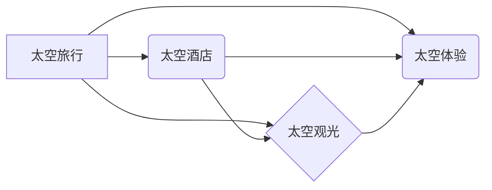

                 

## 太空旅游创业：开拓太空商业的先驱

> 关键词：太空旅游、商业航天、人工智能、软件架构、云计算、大数据、风险管理

### 1. 背景介绍

人类对太空的探索从未停止，从最初的卫星发射到如今的国际空间站，我们不断突破技术瓶颈，将梦想一步步变为现实。而太空旅游，作为人类探索宇宙的新领域，正逐渐从科幻小说走向现实。随着航天技术的进步和成本的降低，太空旅游将成为未来的一项热门产业，为人类带来全新的体验和机遇。

然而，太空旅游创业并非易事。它面临着诸多挑战，包括技术难度、安全风险、成本高昂、监管政策等。为了成功开拓太空商业，需要具备强大的技术实力、敏锐的市场洞察力和有效的风险管理能力。

### 2. 核心概念与联系

太空旅游的核心概念包括：

* **太空旅行：**指人类乘坐航天器进入太空进行短时间或长时间的旅行。
* **太空酒店：**指在太空建造的酒店，为游客提供住宿、餐饮、娱乐等服务。
* **太空观光：**指乘坐航天器观赏地球、月球、星系等天体景观。
* **太空体验：**指在太空进行各种体验活动，例如太空漫步、太空实验等。

这些概念相互关联，共同构成了太空旅游的生态系统。

**核心概念架构：**



### 3. 核心算法原理 & 具体操作步骤

太空旅游创业需要运用多种核心算法，例如：

* **轨道计算算法：**用于计算航天器在太空的飞行轨迹，确保安全抵达目的地。
* **导航控制算法：**用于控制航天器的姿态和速度，使其在太空稳定飞行。
* **资源管理算法：**用于优化太空资源的分配和利用，例如燃料、氧气、水等。
* **风险评估算法：**用于评估太空旅行的潜在风险，并制定相应的应对措施。

#### 3.1  算法原理概述

这些算法通常基于物理学、数学和计算机科学的原理，通过复杂的计算和模拟，实现太空旅行的各个环节。例如，轨道计算算法需要考虑地球的引力、航天器的质量和速度等因素，才能精确计算出航天器的飞行轨迹。

#### 3.2  算法步骤详解

具体操作步骤可以根据不同的算法而有所不同，但一般包括以下几个阶段：

1. **数据采集：**收集有关航天器、目标天体、环境等方面的相关数据。
2. **数据预处理：**对采集到的数据进行清洗、转换和格式化，使其能够被算法处理。
3. **模型构建：**根据算法原理，构建数学模型或程序代码，用于模拟和计算。
4. **参数优化：**通过调整算法参数，优化模型的精度和效率。
5. **结果分析：**对算法计算的结果进行分析和解释，并将其应用于实际操作。

#### 3.3  算法优缺点

不同的算法具有不同的优缺点，需要根据实际情况选择合适的算法。例如，一些算法计算速度快，但精度较低；而另一些算法精度高，但计算速度慢。

#### 3.4  算法应用领域

除了太空旅游，这些算法还广泛应用于其他领域，例如：

* **卫星导航：**GPS、北斗等卫星导航系统依赖于精确的轨道计算和导航控制算法。
* **空间探测：**探测器需要利用这些算法进行精确的飞行控制和数据分析。
* **军事航天：**导弹、卫星等军事航天器也需要这些算法进行精确的控制和导航。

### 4. 数学模型和公式 & 详细讲解 & 举例说明

太空旅游创业涉及到许多复杂的数学模型和公式，例如：

#### 4.1  数学模型构建

* **轨道模型：**描述航天器在太空的运动轨迹，通常基于牛顿万有引力定律和航天器的动力学方程。
* **姿态模型：**描述航天器的姿态变化，例如偏航、俯仰和滚转角，通常基于航天器的惯性矩和控制力矩。
* **资源消耗模型：**描述航天器在太空飞行过程中消耗的资源，例如燃料、氧气、水等，通常基于航天器的性能参数和飞行任务需求。

#### 4.2  公式推导过程

例如，轨道模型的推导过程如下：

根据牛顿万有引力定律，航天器受到地球引力的作用，其运动轨迹满足以下方程：

$$
\frac{d^2\mathbf{r}}{dt^2} = -\frac{GM}{r^3}\mathbf{r}
$$

其中：

* $\mathbf{r}$ 是航天器的位置矢量
* $t$ 是时间
* $G$ 是万有引力常数
* $M$ 是地球质量
* $r$ 是航天器到地球中心的距离

通过解这个微分方程，可以得到航天器的轨道方程，从而预测其在太空的飞行轨迹。

#### 4.3  案例分析与讲解

例如，我们可以利用轨道模型计算一颗卫星绕地球运行的轨道高度和周期。通过输入卫星的质量、速度和地球的物理参数，我们可以得到卫星的轨道方程，从而计算出其轨道高度和周期。

### 5. 项目实践：代码实例和详细解释说明

太空旅游创业需要开发各种软件系统，例如：

* **航天器控制系统：**用于控制航天器的飞行姿态、速度和轨道。
* **地面监控系统：**用于监控航天器的运行状态和收集数据。
* **游客管理系统：**用于管理游客的预订、支付和行程安排。

#### 5.1  开发环境搭建

开发环境通常包括：

* **操作系统：**Linux、Windows等
* **编程语言：**C++、Python、Java等
* **开发工具：**IDE、编译器、调试器等

#### 5.2  源代码详细实现

以下是一个简单的C++代码示例，用于计算航天器的轨道高度：

```cpp
#include <iostream>
#include <cmath>

using namespace std;

int main() {
  // 地球物理参数
  double G = 6.67430e-11; // 万有引力常数
  double M = 5.972e24; // 地球质量
  double R = 6371e3; // 地球半径

  // 航天器参数
  double v = 7800; // 航天器速度 (m/s)

  // 计算轨道高度
  double h = sqrt((v * v * R) / (G * M)) - R;

  // 输出结果
  cout << "轨道高度: " << h << " m" << endl;

  return 0;
}
```

#### 5.3  代码解读与分析

这段代码首先定义了地球物理参数和航天器参数，然后利用轨道模型公式计算出航天器的轨道高度。最后，将结果输出到控制台。

#### 5.4  运行结果展示

运行这段代码后，会输出航天器的轨道高度。

### 6. 实际应用场景

太空旅游创业的实际应用场景非常广泛，例如：

* **太空观光：**乘坐航天器观赏地球、月球、星系等天体景观。
* **太空酒店：**在太空建造酒店，为游客提供住宿、餐饮、娱乐等服务。
* **太空体验：**在太空进行各种体验活动，例如太空漫步、太空实验等。
* **太空研究：**利用太空环境进行科学研究，例如生物学、物理学、天文学等。

#### 6.4  未来应用展望

未来，太空旅游将更加普及和多样化，例如：

* **太空旅行变得更加便捷和经济：**随着航天技术的进步和成本的降低，太空旅行将变得更加便捷和经济。
* **太空酒店和太空体验设施更加完善：**太空酒店和太空体验设施将更加完善，为游客提供更加舒适和丰富的体验。
* **太空旅游将成为一种新的旅游方式：**太空旅游将成为一种新的旅游方式，吸引更多人探索宇宙。

### 7. 工具和资源推荐

#### 7.1  学习资源推荐

* **书籍：**《太空旅行：从梦想到现实》
* **网站：**NASA官网、SpaceX官网
* **课程：**Coursera上的太空探索课程

#### 7.2  开发工具推荐

* **IDE：**Visual Studio Code、Eclipse
* **编程语言：**C++、Python、Java
* **仿真软件：**STK、Simulink

#### 7.3  相关论文推荐

* **太空旅行的安全性评估**
* **太空酒店的设计与建造**
* **太空旅游的经济效益分析**

### 8. 总结：未来发展趋势与挑战

太空旅游创业是一个充满机遇和挑战的领域。未来，随着航天技术的进步和成本的降低，太空旅游将更加普及和多样化。然而，太空旅游也面临着诸多挑战，例如：

* **技术难度：**太空旅行的技术难度非常高，需要不断突破和创新。
* **安全风险：**太空旅行存在着一定的安全风险，需要采取有效的措施保障游客安全。
* **成本高昂：**太空旅行的成本非常高，需要找到有效的商业模式。
* **监管政策：**太空旅游的监管政策尚不完善，需要制定相应的法律法规。

#### 8.1  研究成果总结

太空旅游创业的研究成果主要集中在以下几个方面：

* **轨道计算算法：**开发了更加精确和高效的轨道计算算法。
* **航天器控制系统：**设计了更加智能和可靠的航天器控制系统。
* **太空环境模拟：**建立了更加逼真的太空环境模拟系统。

#### 8.2  未来发展趋势

未来，太空旅游创业的发展趋势主要包括：

* **商业化发展：**太空旅游将更加商业化，出现更多商业航天公司。
* **技术创新：**太空旅游的技术将不断创新，例如开发更加经济的火箭、更加舒适的太空舱等。
* **国际合作：**太空旅游将更加国际化，各国将加强合作，共同推动太空旅游的发展。

#### 8.3  面临的挑战

太空旅游创业面临的挑战主要包括：

* **技术瓶颈：**太空旅行的技术仍然存在一些瓶颈，例如航天器的可靠性、太空环境的恶劣性等。
* **成本问题：**太空旅行的成本仍然很高，需要找到更加经济的解决方案。
* **安全风险：**太空旅行存在着一定的安全风险，需要采取更加有效的措施保障游客安全。
* **监管政策：**太空旅游的监管政策尚不完善，需要制定更加完善的法律法规。

#### 8.4  研究展望

未来，太空旅游创业的研究将更加注重以下几个方面：

* **降低太空旅行成本：**研究更加经济的航天器设计和发射技术。
* **提高太空旅行安全性：**研究更加可靠的航天器控制系统和安全保障措施。
* **开发更加舒适的太空环境：**研究更加舒适的太空舱设计和生活设施。
* **探索新的太空旅游模式：**例如太空观光、太空度假、太空研究等。


### 9. 附录：常见问题与解答

**Q1：太空旅游真的安全吗？**

**A1：**太空旅游的安全是一个非常重要的问题。目前，太空旅行的安全性已经得到很大程度的提高，但仍然存在一些风险。例如，航天器故障、太空环境的恶劣性等。为了保障游客安全，太空旅游公司会采取多种措施，例如：

* 使用可靠的航天器和设备
* 进行严格的飞行训练和安全检查
* 制定完善的应急预案

**Q2：太空旅游的成本是多少？**

**A2：**太空旅游的成本目前仍然很高，通常需要花费数百万美元。随着航天技术的进步和成本的降低，未来太空旅游的成本可能会降低。

**Q3：太空旅游需要什么条件？**

**A3：**太空旅游需要一定的健康条件和心理素质。例如，游客需要能够承受长时间的失重状态、封闭环境和心理压力。

**Q4：未来太空旅游会发展到什么程度？**

**A4：**未来太空旅游的发展前景非常广阔。随着航天技术的进步和成本的降低，太空旅游将更加普及和多样化。例如，未来可能会出现更加经济的太空旅行方式、更加舒适的太空酒店和更加丰富的太空体验活动。


作者：禅与计算机程序设计艺术 / Zen and the Art of Computer Programming 
<end_of_turn>

