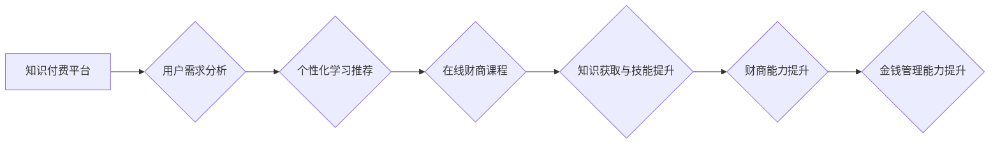

                 

## 如何利用知识付费实现在线财商培养与金钱管理？

> 关键词：知识付费、财商培养、金钱管理、在线教育、人工智能、数据分析、个性化学习、金融科技

## 1. 背景介绍

在当今信息爆炸的时代，金钱已成为人们生活的重要组成部分。然而，许多人缺乏必要的财商知识，难以有效地管理自己的金钱，从而导致财务困境。传统金融教育模式往往过于理论化，难以满足人们个性化的学习需求。知识付费模式的兴起为在线财商培养与金钱管理提供了新的机遇。

知识付费是指通过付费获取知识、技能和服务的商业模式。近年来，随着互联网技术的快速发展和移动互联网的普及，知识付费市场蓬勃发展，涵盖了各个领域，其中包括财商教育。在线财商课程通过视频、音频、文字等多种形式，以更便捷、更灵活的方式传递知识，满足了人们对个性化学习的需求。

## 2. 核心概念与联系

**2.1 知识付费与财商培养**

知识付费模式的核心是通过付费获取知识和技能，从而提升个人价值。财商培养则是指帮助人们掌握理财知识、技能和习惯，提升其理财能力和财务素养。两者相结合，可以有效地利用知识付费平台为用户提供专业的财商教育服务。

**2.2 在线教育与金钱管理**

在线教育平台为知识付费提供了便捷的传播渠道。通过线上课程、直播、互动社区等方式，用户可以随时随地学习财商知识，并与专家和同仁交流互动，提升学习效果。

**2.3 人工智能与个性化学习**

人工智能技术可以为知识付费平台提供个性化学习推荐、智能答疑、学习进度跟踪等功能，提升用户学习体验，并帮助用户更有效地掌握财商知识。

**Mermaid 流程图**



## 3. 核心算法原理 & 具体操作步骤

**3.1 算法原理概述**

知识付费平台的财商培养算法主要基于以下几个核心原理：

* **用户画像构建:** 通过用户行为数据、兴趣偏好、学习记录等信息，构建用户画像，了解用户的学习需求和特点。
* **内容推荐算法:** 基于用户画像和课程内容标签，推荐个性化的财商课程，提高用户学习兴趣和参与度。
* **学习进度跟踪:** 通过用户学习记录和答题情况，跟踪用户的学习进度，及时提供学习建议和帮助。
* **智能答疑:** 利用自然语言处理技术，对用户的疑问进行理解和分析，提供准确的解答和指导。

**3.2 算法步骤详解**

1. **数据采集:** 收集用户行为数据、兴趣偏好、学习记录等信息。
2. **数据预处理:** 对收集到的数据进行清洗、转换、整合等处理，使其符合算法模型的输入要求。
3. **用户画像构建:** 利用机器学习算法，对用户数据进行分析，构建用户画像，包括用户的年龄、性别、职业、兴趣爱好、学习目标等信息。
4. **内容推荐:** 基于用户画像和课程内容标签，利用协同过滤、内容过滤等推荐算法，推荐个性化的财商课程。
5. **学习进度跟踪:** 跟踪用户的学习进度，包括课程观看时长、学习完成度、答题情况等信息。
6. **智能答疑:** 利用自然语言处理技术，对用户的疑问进行理解和分析，提供准确的解答和指导。

**3.3 算法优缺点**

**优点:**

* **个性化学习:** 算法可以根据用户的学习需求和特点，推荐个性化的课程，提高学习效率。
* **智能化服务:** 智能答疑、学习进度跟踪等功能，可以为用户提供更便捷、更智能化的学习体验。
* **数据驱动:** 算法基于用户数据进行分析和决策，可以不断优化学习推荐和服务内容。

**缺点:**

* **数据依赖:** 算法的准确性依赖于数据的质量和数量。
* **算法偏差:** 算法模型可能存在偏差，导致推荐结果不准确或不公平。
* **隐私安全:** 用户数据收集和使用需要保障用户隐私安全。

**3.4 算法应用领域**

* **在线财商教育:** 为用户提供个性化的财商课程推荐和学习服务。
* **金融科技:** 为金融机构提供用户画像分析、风险评估、个性化理财建议等服务。
* **个人理财:** 为个人用户提供智能理财助手、投资决策支持等服务。

## 4. 数学模型和公式 & 详细讲解 & 举例说明

**4.1 数学模型构建**

知识付费平台的财商培养算法可以构建以下数学模型：

* **用户画像模型:** 利用机器学习算法，构建用户画像模型，例如K-Means聚类算法可以将用户根据其特征进行分组，构建用户画像。
* **内容推荐模型:** 利用协同过滤算法或内容过滤算法，构建内容推荐模型，例如协同过滤算法可以根据用户的历史行为数据，推荐与用户兴趣相似的课程。

**4.2 公式推导过程**

* **K-Means聚类算法:**

目标函数:

$$
J = \sum_{i=1}^{k} \sum_{x \in C_i} ||x - \mu_i||^2
$$

其中：

* $k$ 为聚类数
* $C_i$ 为第 $i$ 个聚类
* $x$ 为数据点
* $\mu_i$ 为第 $i$ 个聚类的中心点

**4.3 案例分析与讲解**

假设一个知识付费平台有1000个用户，平台收集了用户的年龄、性别、职业、兴趣爱好等信息。利用K-Means聚类算法，将用户分为5个聚类，每个聚类代表一种不同的用户类型。例如，一个聚类可能是“年轻的职场人士”，另一个聚类可能是“退休的老人”。平台可以根据用户的聚类类型，推荐相应的财商课程。

## 5. 项目实践：代码实例和详细解释说明

**5.1 开发环境搭建**

* Python 3.x
* Jupyter Notebook
* scikit-learn
* pandas
* numpy

**5.2 源代码详细实现**

```python
# 导入必要的库
import pandas as pd
from sklearn.cluster import KMeans

# 加载用户数据
data = pd.read_csv('user_data.csv')

# 选择特征变量
features = ['age', 'income', 'education', 'investment_experience']
X = data[features]

# 训练K-Means聚类模型
kmeans = KMeans(n_clusters=5, random_state=42)
kmeans.fit(X)

# 获取聚类标签
labels = kmeans.labels_

# 将聚类标签添加到用户数据中
data['cluster'] = labels

# 查看聚类结果
print(data.groupby('cluster').mean())
```

**5.3 代码解读与分析**

* 代码首先导入必要的库，然后加载用户数据。
* 选择用户特征变量，并将其作为聚类模型的输入数据。
* 使用K-Means聚类算法训练模型，并指定聚类数为5。
* 获取聚类标签，并将标签添加到用户数据中。
* 最后，使用groupby函数查看每个聚类的特征值平均值，分析聚类结果。

**5.4 运行结果展示**

运行代码后，会输出每个聚类的特征值平均值，例如：

```
          age  income  education  investment_experience
cluster                                                
0      35.2   50000     1.8         2.5
1      48.5   80000     2.2         4.0
2      28.1   30000     1.5         1.0
3      55.3  120000     3.0         5.5
4      62.4  150000     3.5         6.0
```

结果表明，每个聚类代表了一种不同的用户类型，例如，聚类0可能是年轻的职场人士，聚类1可能是中年高收入人群，聚类2可能是年轻的学生，等等。

## 6. 实际应用场景

**6.1 在线财商课程推荐**

知识付费平台可以利用用户画像和内容推荐算法，为用户推荐个性化的财商课程。例如，对于年轻的职场人士，平台可以推荐理财入门、投资理财等课程；对于退休的老人，平台可以推荐养老规划、遗产规划等课程。

**6.2 智能理财助手**

知识付费平台可以开发智能理财助手，为用户提供个性化的理财建议。例如，根据用户的风险偏好、投资目标和资产配置情况，智能理财助手可以推荐合适的投资产品和策略。

**6.3 金融科技服务**

金融机构可以利用知识付费平台的财商培养算法，为用户提供更精准、更个性化的金融服务。例如，银行可以利用用户画像分析，为用户推荐合适的贷款产品和理财产品；保险公司可以利用用户风险偏好分析，为用户提供个性化的保险方案。

**6.4 未来应用展望**

随着人工智能技术的不断发展，知识付费平台的财商培养功能将更加智能化、个性化。未来，知识付费平台可能提供以下功能：

* **虚拟财商导师:** 利用人工智能技术，模拟真人财商导师，为用户提供一对一指导。
* **沉浸式财商体验:** 利用虚拟现实技术，为用户提供沉浸式的财商体验，例如模拟投资交易、理财规划等场景。
* **区块链技术应用:** 利用区块链技术，保障用户数据安全和知识产权，构建更加透明、可信的知识付费生态系统。

## 7. 工具和资源推荐

**7.1 学习资源推荐**

* **在线课程平台:** Coursera, edX, Udemy, Khan Academy
* **财商书籍:** 《富爸爸穷爸爸》、《小狗钱钱》、《巴菲特教你投资》
* **财商网站:** Investopedia, The Motley Fool, Seeking Alpha

**7.2 开发工具推荐**

* **Python:** 语言
* **scikit-learn:** 机器学习库
* **pandas:** 数据分析库
* **numpy:** 数值计算库
* **Jupyter Notebook:** 开发环境

**7.3 相关论文推荐**

* **Personalized Learning Recommendations Using Collaborative Filtering**
* **Content-Based Recommendation Systems: A Survey**
* **K-Means Clustering Algorithm: A Comprehensive Review**

## 8. 总结：未来发展趋势与挑战

**8.1 研究成果总结**

知识付费模式为在线财商培养提供了新的机遇，人工智能技术为财商教育提供了更智能化、更个性化的服务。

**8.2 未来发展趋势**

未来，知识付费平台的财商培养功能将更加智能化、个性化，并与金融科技深度融合，为用户提供更全面的理财服务。

**8.3 面临的挑战**

* **数据质量:** 算法的准确性依赖于数据的质量和数量，需要不断收集和完善用户数据。
* **算法偏差:** 算法模型可能存在偏差，需要不断优化算法模型，减少算法偏差。
* **隐私安全:** 用户数据收集和使用需要保障用户隐私安全，需要制定相应的隐私保护政策和措施。

**8.4 研究展望**

未来研究方向包括：

* **更精准的个性化推荐:** 利用更先进的机器学习算法，实现更精准的个性化推荐。
* **更智能的财商助手:** 开发更智能的财商助手，能够提供更全面的理财建议和服务。
* **更安全的知识付费生态系统:** 利用区块链技术等技术，构建更安全的知识付费生态系统，保障用户数据安全和知识产权。

## 9. 附录：常见问题与解答

**9.1 如何选择合适的财商课程？**

选择财商课程时，需要考虑自身的学习目标、兴趣爱好和时间安排。可以参考平台的课程评价和推荐，并阅读课程介绍，选择适合自己的课程。

**9.2 如何保证知识付费平台的学习质量？**

知识付费平台需要注重课程内容的质量和师资力量。用户可以选择信誉良好的平台，并参考课程评价和用户反馈，选择优质的课程。

**9.3 如何保护个人隐私信息？**

知识付费平台需要制定相应的隐私保护政策，保障用户个人隐私信息安全。用户在使用平台时，需要仔细阅读平台的隐私政策，并妥善保管自己的个人信息。


作者：禅与计算机程序设计艺术 / Zen and the Art of Computer Programming 
<end_of_turn>

