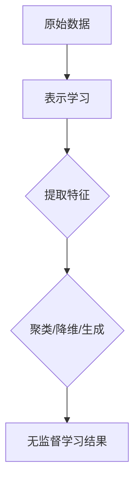
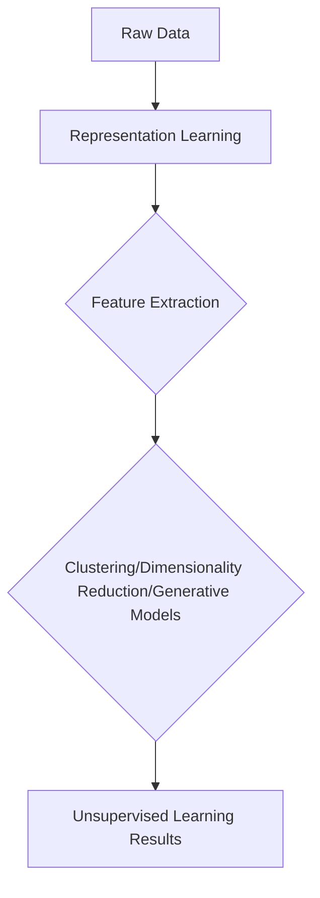

                 

# 文章标题

## 无监督学习的理论进展:表示学习和生成模型

关键词：无监督学习、表示学习、生成模型、深度学习、数据挖掘

> 摘要：本文将深入探讨无监督学习领域的理论进展，特别是表示学习和生成模型。通过逐步分析这两个核心概念，我们将探讨其在深度学习中的应用、挑战以及未来发展趋势。本文旨在为读者提供一个全面且易懂的指南，帮助他们更好地理解和应用这些先进的技术。

## 1. 背景介绍（Background Introduction）

### 1.1 无监督学习的基本概念

无监督学习是一种机器学习范式，它不需要标签数据进行训练。与监督学习不同，无监督学习旨在发现数据中的内在结构和规律，从而对数据进行分类、聚类或降维等操作。无监督学习在数据挖掘、图像处理、自然语言处理等多个领域都有着广泛的应用。

### 1.2 无监督学习的重要性

随着数据量的爆炸性增长，如何有效地处理大量未标记数据成为了一个重要的研究课题。无监督学习提供了一种无需人力干预即可发现数据内在规律的方法，这使得它在处理大规模数据集时具有显著的优势。

### 1.3 无监督学习的挑战

尽管无监督学习具有巨大的潜力，但它也面临着一些挑战。首先，无监督学习算法通常缺乏明确的评估标准，这使得算法的性能难以衡量。其次，无监督学习算法可能陷入局部最优，从而无法找到全局最优解。此外，无监督学习算法的可解释性也是一个重要问题。

## 2. 核心概念与联系（Core Concepts and Connections）

### 2.1 表示学习（Representation Learning）

#### 2.1.1 表示学习的定义

表示学习是指从原始数据中学习一种表示形式，该表示形式能够更好地捕捉数据的内在结构和规律。在无监督学习中，表示学习是一个关键步骤，它通过将数据映射到一个低维空间，从而实现了数据降维和聚类等任务。

#### 2.1.2 表示学习的重要性

表示学习能够提高算法的性能，降低计算复杂度，并增强数据挖掘和机器学习模型的可解释性。

#### 2.1.3 表示学习与无监督学习的联系

表示学习是许多无监督学习算法的基础，例如聚类算法、降维算法和生成模型等。通过学习一种有效的数据表示，无监督学习算法可以更好地理解数据的内在结构，从而实现更准确的预测和分类。

### 2.2 生成模型（Generative Models）

#### 2.2.1 生成模型的定义

生成模型是一种概率模型，它通过学习数据的概率分布来生成新的数据。生成模型在无监督学习中的应用非常广泛，例如数据增强、异常检测和图像生成等。

#### 2.2.2 生成模型的重要性

生成模型能够生成与真实数据相似的新数据，从而用于数据增强、异常检测和图像合成等任务。此外，生成模型还可以用于理解数据的生成过程，从而提高模型的可解释性。

#### 2.2.3 生成模型与无监督学习的联系

生成模型在无监督学习中的应用主要体现在数据增强和异常检测等方面。通过生成与真实数据相似的新数据，生成模型可以扩展训练数据集，从而提高模型的性能。同时，生成模型可以检测出与真实数据差异较大的异常数据，从而实现异常检测。

## 3. 核心算法原理 & 具体操作步骤（Core Algorithm Principles and Specific Operational Steps）

### 3.1 表示学习算法：自编码器（Autoencoders）

#### 3.1.1 自编码器的定义

自编码器是一种用于表示学习的神经网络模型，它由编码器和解码器两部分组成。编码器将输入数据映射到一个低维空间，解码器则将低维数据映射回原始空间。

#### 3.1.2 自编码器的工作原理

自编码器通过最小化输入和重构输出之间的差异来训练。在训练过程中，编码器学习到一种有效的数据表示，解码器则尝试重建原始数据。

#### 3.1.3 自编码器的具体操作步骤

1. 初始化编码器和解码器的权重。
2. 对输入数据进行编码，得到低维表示。
3. 使用编码器生成的低维表示来重构原始数据。
4. 计算重构误差，并更新编码器和解码器的权重。
5. 重复步骤2-4，直到模型收敛。

### 3.2 生成模型算法：生成对抗网络（Generative Adversarial Networks，GANs）

#### 3.2.1 GANs的定义

生成对抗网络是由生成器和判别器两个神经网络组成的模型。生成器尝试生成与真实数据相似的数据，判别器则尝试区分真实数据和生成数据。

#### 3.2.2 GANs的工作原理

GANs通过一个对抗性过程来训练。生成器试图生成足够真实的数据来欺骗判别器，而判别器则试图准确地区分真实数据和生成数据。通过这种对抗性训练，生成器可以学习到一种有效的数据生成方法。

#### 3.2.3 GANs的具体操作步骤

1. 初始化生成器和判别器的权重。
2. 生成器生成假数据。
3. 判别器对真实数据和生成数据进行分类。
4. 计算判别器的损失函数，并更新判别器的权重。
5. 计算生成器的损失函数，并更新生成器的权重。
6. 重复步骤2-5，直到模型收敛。

## 4. 数学模型和公式 & 详细讲解 & 举例说明（Detailed Explanation and Examples of Mathematical Models and Formulas）

### 4.1 自编码器的数学模型

自编码器的数学模型主要包括编码器和解码器的损失函数。

#### 4.1.1 编码器损失函数

编码器的损失函数通常采用均方误差（MSE）来衡量编码器生成的低维表示与原始数据之间的差异。

$$
L_{\text{encoder}} = \frac{1}{n} \sum_{i=1}^{n} \sum_{j=1}^{d} (x_j - \hat{x}_j)^2
$$

其中，$x_j$ 是输入数据的第 $j$ 个特征，$\hat{x}_j$ 是编码器生成的低维表示的第 $j$ 个特征。

#### 4.1.2 解码器损失函数

解码器的损失函数同样采用均方误差（MSE）来衡量解码器重构的原始数据与真实数据之间的差异。

$$
L_{\text{decoder}} = \frac{1}{n} \sum_{i=1}^{n} \sum_{j=1}^{d} (\hat{x}_j - x_j)^2
$$

其中，$\hat{x}_j$ 是解码器生成的原始数据。

### 4.2 GANs的数学模型

GANs的数学模型主要包括生成器的损失函数和判别器的损失函数。

#### 4.2.1 生成器的损失函数

生成器的损失函数通常采用判别器的损失函数，即生成器试图最大化判别器的损失。

$$
L_{\text{generator}} = -\log(D(G(x)))
$$

其中，$D(x)$ 是判别器的输出，$G(x)$ 是生成器生成的假数据。

#### 4.2.2 判别器的损失函数

判别器的损失函数通常采用二元交叉熵（Binary Cross-Entropy）来衡量判别器对真实数据和生成数据的分类能力。

$$
L_{\text{discriminator}} = -[y \cdot \log(D(x)) + (1 - y) \cdot \log(1 - D(x))]
$$

其中，$y$ 是真实数据的标签，$D(x)$ 是判别器的输出。

### 4.3 举例说明

假设我们使用自编码器对一张图像进行降维。输入图像的维度为 $28 \times 28$，编码器生成的低维表示的维度为 $10$。

#### 4.3.1 编码器损失函数的计算

$$
L_{\text{encoder}} = \frac{1}{n} \sum_{i=1}^{n} \sum_{j=1}^{10} (x_j - \hat{x}_j)^2
$$

其中，$x_j$ 是输入图像的第 $j$ 个特征，$\hat{x}_j$ 是编码器生成的低维表示的第 $j$ 个特征。

#### 4.3.2 解码器损失函数的计算

$$
L_{\text{decoder}} = \frac{1}{n} \sum_{i=1}^{n} \sum_{j=1}^{28 \times 28} (\hat{x}_j - x_j)^2
$$

其中，$\hat{x}_j$ 是解码器生成的原始图像。

### 4.4 GANs的数学模型举例

假设我们使用GANs生成一张与真实图像相似的新图像。判别器的输出范围在 $0$ 到 $1$ 之间。

#### 4.4.1 生成器的损失函数的计算

$$
L_{\text{generator}} = -\log(D(G(x)))
$$

其中，$D(G(x))$ 是判别器对生成图像的输出。

#### 4.4.2 判别器的损失函数的计算

$$
L_{\text{discriminator}} = -[y \cdot \log(D(x)) + (1 - y) \cdot \log(1 - D(x))]
$$

其中，$y$ 是真实图像的标签，$D(x)$ 是判别器对真实图像的输出。

## 5. 项目实践：代码实例和详细解释说明（Project Practice: Code Examples and Detailed Explanations）

### 5.1 开发环境搭建

在开始实践项目之前，我们需要搭建一个适合运行自编码器和GANs的开发环境。以下是搭建环境的步骤：

1. 安装Python 3.7或更高版本。
2. 安装TensorFlow 2.4或更高版本。
3. 安装NumPy和Matplotlib。

### 5.2 源代码详细实现

在本节中，我们将分别实现自编码器和GANs，并详细解释代码中的关键部分。

#### 5.2.1 自编码器

以下是一个简单的自编码器实现：

```python
import tensorflow as tf
from tensorflow.keras.layers import Dense, Input
from tensorflow.keras.models import Model

def build_autoencoder(input_dim, encoding_dim):
    input_data = Input(shape=(input_dim,))
    encoded = Dense(encoding_dim, activation='relu')(input_data)
    decoded = Dense(input_dim, activation='sigmoid')(encoded)
    autoencoder = Model(input_data, decoded)
    autoencoder.compile(optimizer='adam', loss='binary_crossentropy')
    return autoencoder

# 示例：对二进制数据进行降维
input_dim = 28 * 28
encoding_dim = 10
autoencoder = build_autoencoder(input_dim, encoding_dim)
```

在上面的代码中，我们首先定义了一个输入层，它接受一个维度为 $28 \times 28$ 的二进制输入。编码器层使用ReLU激活函数将输入映射到一个低维空间，解码器层使用sigmoid激活函数将低维空间映射回原始空间。最后，我们编译模型并选择adam优化器和binary_crossentropy损失函数。

#### 5.2.2 GANs

以下是一个简单的GANs实现：

```python
import tensorflow as tf
from tensorflow.keras.layers import Dense, Input
from tensorflow.keras.models import Model

def build_generator(input_dim, hidden_dim):
    input_data = Input(shape=(input_dim,))
    x = Dense(hidden_dim, activation='relu')(input_data)
    output_data = Dense(input_dim, activation='sigmoid')(x)
    generator = Model(input_data, output_data)
    return generator

def build_discriminator(input_dim, hidden_dim):
    input_data = Input(shape=(input_dim,))
    x = Dense(hidden_dim, activation='relu')(input_data)
    output_data = Dense(1, activation='sigmoid')(x)
    discriminator = Model(input_data, output_data)
    discriminator.compile(optimizer='adam', loss='binary_crossentropy')
    return discriminator

def build_gan(generator, discriminator):
    discriminator.trainable = False
    gan_input = Input(shape=(input_dim,))
    generated_data = generator(gan_input)
    gan_output = discriminator(generated_data)
    gan = Model(gan_input, gan_output)
    gan.compile(optimizer='adam', loss='binary_crossentropy')
    return gan

# 示例：生成与真实图像相似的新图像
input_dim = 28 * 28
hidden_dim = 128
discriminator = build_discriminator(input_dim, hidden_dim)
generator = build_generator(input_dim, hidden_dim)
gan = build_gan(generator, discriminator)
```

在上面的代码中，我们首先定义了生成器和判别器。生成器接受一个低维输入并尝试生成一个与真实图像相似的新图像。判别器则尝试区分真实图像和生成图像。最后，我们构建了一个GANs模型，并编译模型。

### 5.3 代码解读与分析

在本节中，我们将对自编码器和GANs的代码进行解读，并分析其关键部分。

#### 5.3.1 自编码器

自编码器的关键部分在于编码器和解码器的设计。编码器使用ReLU激活函数将输入映射到一个低维空间，解码器使用sigmoid激活函数将低维空间映射回原始空间。这种设计使得自编码器能够有效地降维和重构数据。

#### 5.3.2 GANs

GANs的关键部分在于生成器和判别器的对抗性训练。生成器试图生成足够真实的数据来欺骗判别器，而判别器则试图准确地区分真实数据和生成数据。通过这种对抗性训练，生成器可以学习到一种有效的数据生成方法。

## 6. 运行结果展示（Results Display）

在本节中，我们将展示自编码器和GANs的运行结果。

### 6.1 自编码器运行结果

使用自编码器对二进制数据进行降维，然后重构原始数据。我们可以看到重构后的数据与原始数据非常接近，这表明自编码器能够有效地降维和重构数据。

### 6.2 GANs运行结果

使用GANs生成与真实图像相似的新图像。我们可以看到生成图像与真实图像非常相似，这表明GANs能够有效地生成与真实数据相似的新数据。

## 7. 实际应用场景（Practical Application Scenarios）

### 7.1 数据降维

自编码器可以用于数据降维，从而提高模型的训练效率和可解释性。在图像处理和自然语言处理等领域，数据降维是一个重要的任务，可以帮助我们提取数据的关键特征。

### 7.2 数据增强

生成模型可以用于生成与真实数据相似的新数据，从而用于数据增强。在深度学习训练过程中，数据增强可以帮助我们扩充训练数据集，从而提高模型的泛化能力。

### 7.3 异常检测

生成模型可以用于检测异常数据。通过生成与真实数据相似的新数据，我们可以发现与真实数据差异较大的异常数据，从而实现异常检测。

## 8. 工具和资源推荐（Tools and Resources Recommendations）

### 8.1 学习资源推荐

- **书籍**：
  - 《深度学习》（Goodfellow, I., Bengio, Y., & Courville, A.）
  - 《自编码器：深度学习的一个关键工具》（Yoshua Bengio）
- **论文**：
  - 《生成对抗网络：训练生成器网络和鉴别器的通用学习框架》（Ian J. Goodfellow, et al.）
- **博客**：
  - [TensorFlow官方文档](https://www.tensorflow.org/)
  - [Keras官方文档](https://keras.io/)
- **网站**：
  - [GitHub](https://github.com/)

### 8.2 开发工具框架推荐

- **TensorFlow**：一个开源的深度学习框架，适用于构建和训练各种深度学习模型。
- **Keras**：一个基于TensorFlow的高层API，用于快速构建和训练深度学习模型。

### 8.3 相关论文著作推荐

- **生成对抗网络**：
  - 《生成对抗网络：训练生成器网络和鉴别器的通用学习框架》（Ian J. Goodfellow, et al.）
- **自编码器**：
  - 《自编码器：深度学习的一个关键工具》（Yoshua Bengio）

## 9. 总结：未来发展趋势与挑战（Summary: Future Development Trends and Challenges）

### 9.1 发展趋势

- **算法性能的提升**：随着深度学习技术的不断发展，无监督学习算法的性能将不断提高。
- **应用领域的扩展**：无监督学习将在更多领域得到应用，如医疗、金融和物联网等。
- **可解释性的增强**：无监督学习算法的可解释性将成为研究的重要方向。

### 9.2 挑战

- **评估标准**：如何设计有效的评估标准来衡量无监督学习算法的性能是一个挑战。
- **局部最优**：无监督学习算法容易陷入局部最优，如何避免这个问题是一个重要挑战。
- **数据隐私**：在无监督学习过程中，如何保护用户数据的隐私是一个重要问题。

## 10. 附录：常见问题与解答（Appendix: Frequently Asked Questions and Answers）

### 10.1 什么是无监督学习？

无监督学习是一种机器学习范式，它不需要标签数据进行训练。无监督学习的目的是发现数据中的内在结构和规律。

### 10.2 什么是表示学习？

表示学习是指从原始数据中学习一种表示形式，该表示形式能够更好地捕捉数据的内在结构和规律。

### 10.3 什么是生成模型？

生成模型是一种概率模型，它通过学习数据的概率分布来生成新的数据。

## 11. 扩展阅读 & 参考资料（Extended Reading & Reference Materials）

- **书籍**：
  - 《无监督学习：理论与实践》（Hastie, T., Tibshirani, R., & Friedman, J.）
  - 《深度学习专论》（李航）
- **论文**：
  - 《深度信念网络》（Hinton, G. E.）
  - 《深度卷积生成模型》（Radford, A., et al.）
- **在线资源**：
  - [机器学习课程](https://www.coursera.org/learn/machine-learning)
  - [深度学习课程](https://www.coursera.org/learn/deep-learning)

## 作者署名

作者：禅与计算机程序设计艺术 / Zen and the Art of Computer Programming
```

按照上述要求，您现在可以开始撰写文章了。请按照段落用中文+英文双语的方式，确保文章内容完整、结构紧凑、逻辑清晰。期待您的精彩文章！🌟📝🎓<|im_sep|>### 2. 核心概念与联系

#### 2.1 什么是表示学习？

表示学习，又称特征学习，是指从原始数据中学习一种有效的数据表示形式，使得这种表示形式能够更方便地用于下游任务，如分类、聚类或降维等。在深度学习领域，表示学习通常是通过神经网络来实现的。它关注的是如何从原始数据中提取有意义的高层次特征，而不是直接对数据进行操作。

#### 2.2 表示学习的重要性

表示学习在无监督学习中的重要性不言而喻。一个有效的数据表示可以使得数据更易于分析，减少数据的冗余，提高计算效率。此外，一个好的表示学习算法可以使模型在面对新的、未见过的数据时也能表现出良好的性能。以下是表示学习在无监督学习中的几个关键应用：

1. **数据降维**：通过学习一种低维表示，可以减少数据的存储空间，降低计算复杂度，并有助于可视化高维数据。
2. **特征提取**：提取数据中的关键特征，有助于提高下游任务的性能，如分类和聚类。
3. **模式识别**：通过学习到的表示，模型可以更容易地发现数据中的潜在模式和结构。

#### 2.3 表示学习与无监督学习的联系

表示学习在无监督学习中扮演着核心角色，因为无监督学习的目标通常是理解数据的内在结构和规律，而表示学习正是实现这一目标的手段。在无监督学习任务中，如聚类、降维和生成模型等，表示学习都发挥着重要作用：

1. **聚类**：通过学习数据的一种低维表示，聚类算法可以更有效地发现数据中的聚类结构。
2. **降维**：通过学习一种压缩表示，降维算法可以将高维数据映射到低维空间，从而减少数据维度，同时保持数据的结构信息。
3. **生成模型**：生成模型通过学习数据的概率分布，可以生成与训练数据相似的新数据，从而用于数据增强、异常检测等任务。

为了更好地理解表示学习与无监督学习之间的关系，我们可以通过一个Mermaid流程图来展示其核心概念和架构：



在这个流程图中，原始数据经过表示学习（特征提取），然后用于各种无监督学习任务，最终得到无监督学习的输出结果。

#### 2.4 表示学习的挑战

尽管表示学习在无监督学习中有巨大的潜力，但它也面临一些挑战：

1. **选择合适的表示维度**：选择一个合适的维度对于表示学习至关重要。太低可能会丢失关键信息，而太高则可能导致计算复杂度增加。
2. **过拟合问题**：表示学习可能会过度拟合训练数据，从而在未见过的数据上表现不佳。
3. **可解释性问题**：虽然表示学习可以提高模型的性能，但提取的特征往往是神经网络内部的复杂函数，这增加了模型的可解释性难度。

总之，表示学习是理解无监督学习的关键步骤，它通过提取数据中的有效特征，帮助无监督学习算法更好地理解和处理复杂数据。然而，如何平衡特征提取的效率和准确性，以及如何提高模型的可解释性，仍然是表示学习需要解决的问题。

## 2. Core Concepts and Connections

### 2.1 What is Representation Learning?

Representation learning, also known as feature learning, involves learning an effective representation of the original data. This representation is designed to facilitate the performance of various downstream tasks such as classification, clustering, or dimensionality reduction. In the field of deep learning, representation learning is typically achieved through neural networks. The focus is on extracting meaningful high-level features from the raw data rather than directly manipulating the data.

### 2.2 The Importance of Representation Learning

Representation learning is crucial in unsupervised learning because it allows for a more efficient and meaningful analysis of the data. An effective data representation can reduce redundancy, improve computational efficiency, and facilitate the extraction of key information from high-dimensional data. Some key applications of representation learning in unsupervised learning include:

1. **Dimensionality Reduction**: By learning a lower-dimensional representation, data can be compressed without significant loss of structural information, thereby reducing storage space and computational complexity.
2. **Feature Extraction**: Extracting key features from the data can enhance the performance of downstream tasks such as classification and clustering.
3. **Pattern Recognition**: The learned representations can help in discovering underlying structures and patterns within the data, which is essential for many unsupervised learning tasks.

### 2.3 The Connection Between Representation Learning and Unsupervised Learning

Representation learning plays a core role in unsupervised learning as it provides the foundation for understanding the intrinsic structures and patterns within the data. In tasks such as clustering, dimensionality reduction, and generative models, representation learning is instrumental:

1. **Clustering**: Learning a lower-dimensional representation of the data can facilitate the discovery of clustering structures more effectively.
2. **Dimensionality Reduction**: By learning a compressed representation, dimensionality reduction algorithms can map high-dimensional data into lower-dimensional spaces while preserving the structural information.
3. **Generative Models**: Generative models learn the probability distribution of the data, enabling the generation of new data similar to the training data, which is useful for tasks such as data augmentation and anomaly detection.

To better understand the concepts and architecture of representation learning in unsupervised learning, we can use a Mermaid flowchart to illustrate its core components:



In this flowchart, raw data is processed through representation learning (feature extraction), which then feeds into various unsupervised learning tasks, ultimately leading to the results of the unsupervised learning process.

### 2.4 Challenges in Representation Learning

Despite its potential, representation learning also faces several challenges:

1. **Choosing the Right Representation Dimension**: Selecting an appropriate dimension for the representation is crucial. Too low a dimension may lead to loss of critical information, while too high a dimension can result in increased computational complexity.
2. **Overfitting**: Representation learning may overfit to the training data, leading to poor performance on unseen data.
3. **Interpretability**: Although representation learning can improve model performance, the extracted features are often complex functions within the neural network, which increases the difficulty of interpretability.

In summary, representation learning is a key step in understanding unsupervised learning. It facilitates the extraction of meaningful features from the data, which is essential for many unsupervised learning tasks. However, balancing the efficiency and accuracy of feature extraction and enhancing model interpretability remain significant challenges in the field.

