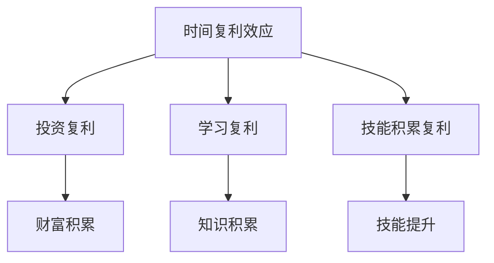

                 

### 文章标题

时间复利效应与个人成就

> 关键词：时间复利、个人成就、投资、成长、思维模式、财富积累

> 摘要：本文探讨了时间复利效应在个人成就积累中的重要作用。通过分析投资、学习、技能积累等领域的实例，揭示了如何利用时间复利实现个人成就的跃升。文章还探讨了时间复利效应背后的思维模式，以及如何在日常生活中应用这些理念，助力个人成长和财富积累。

### 1. 背景介绍（Background Introduction）

#### 1.1 时间复利效应的定义

时间复利效应，也称为复利效应，是指在一定时间内，将初始资金或投入进行累积增长的过程。这个过程涉及到两个关键要素：初始投入和时间的积累。随着时间的推移，初始投入在利息、收益或其他回报的基础上不断增加，从而实现复利效应。

#### 1.2 个人成就的定义

个人成就，通常指的是在职业、学业、人际关系、健康等方面取得的具体成果或进步。这些成就可能包括获得学位、晋升职位、完成重要项目、建立深厚友谊或保持良好身体状况等。

#### 1.3 时间复利效应与个人成就的关系

时间复利效应与个人成就之间存在密切的联系。在许多领域，包括投资、学习和技能积累，时间的积累是实现卓越成就的重要因素。通过合理利用时间复利效应，个人可以在不同领域中取得显著的进步和成功。

### 2. 核心概念与联系（Core Concepts and Connections）

#### 2.1 核心概念

- **时间复利效应**：初始投入随着时间的积累而产生的增长效应。
- **个人成就**：在职业、学业、人际关系、健康等方面取得的具体成果或进步。

#### 2.2 关联关系

- **投资与时间复利**：投资是利用时间复利效应实现财富积累的典型例子。通过长期投资，初始资金在复利的推动下实现增值。
- **学习与时间复利**：持续学习可以积累知识和技能，提高个人竞争力。随着时间的推移，这些知识和技能的价值不断增长。
- **技能积累与时间复利**：在特定技能领域持续实践和提升，可以使技能水平不断提高，从而在职业生涯中获得更多机会和成就。

#### 2.3 核心概念原理与架构的 Mermaid 流程图



### 3. 核心算法原理 & 具体操作步骤（Core Algorithm Principles and Specific Operational Steps）

#### 3.1 投资复利原理

投资复利原理是基于以下公式：

\[ A = P \times (1 + r)^n \]

其中：
- \( A \) 是最终金额；
- \( P \) 是初始投资金额；
- \( r \) 是年化收益率；
- \( n \) 是投资年数。

#### 3.2 投资复利的具体操作步骤

1. **确定初始投资金额**：根据个人财务状况和投资目标，确定初始投资金额。
2. **选择合适的投资产品**：根据投资目标和风险承受能力，选择适合的投资产品，如股票、债券、基金等。
3. **设定投资周期**：根据投资目标和预期收益，设定合适的投资周期，如短期、中期或长期。
4. **定期投资**：在投资周期内，定期进行投资，保持资金持续增长。
5. **跟踪投资表现**：定期查看投资组合的表现，根据市场变化进行调整。

#### 3.3 学习复利原理

学习复利原理是基于以下公式：

\[ K = K_0 \times e^{rt} \]

其中：
- \( K \) 是最终知识水平；
- \( K_0 \) 是初始知识水平；
- \( r \) 是学习增长率；
- \( t \) 是学习时间。

#### 3.4 学习复利的具体操作步骤

1. **确定学习目标**：根据个人职业规划和兴趣，确定学习目标。
2. **选择合适的学习资源**：选择适合的学习资源，如教材、课程、讲座、论文等。
3. **制定学习计划**：制定详细的学习计划，包括学习时间、学习内容和进度。
4. **持续学习**：按照学习计划进行持续学习，不断提升知识水平。
5. **反思与总结**：定期反思学习过程，总结学习成果，调整学习策略。

#### 3.5 技能积累复利原理

技能积累复利原理是基于以下公式：

\[ S = S_0 \times (1 + s)^n \]

其中：
- \( S \) 是最终技能水平；
- \( S_0 \) 是初始技能水平；
- \( s \) 是技能提升率；
- \( n \) 是实践时间。

#### 3.6 技能积累复利的具体操作步骤

1. **确定技能目标**：根据个人职业规划和兴趣，确定技能目标。
2. **选择合适的学习资源**：选择适合的学习资源，如教材、课程、实践项目等。
3. **制定技能提升计划**：制定详细的技能提升计划，包括实践时间、实践内容和目标。
4. **持续实践**：按照技能提升计划进行持续实践，不断提升技能水平。
5. **反思与总结**：定期反思实践过程，总结实践成果，调整实践策略。

### 4. 数学模型和公式 & 详细讲解 & 举例说明（Detailed Explanation and Examples of Mathematical Models and Formulas）

#### 4.1 投资复利公式

投资复利公式为：

\[ A = P \times (1 + r)^n \]

其中：
- \( A \) 是最终金额；
- \( P \) 是初始投资金额；
- \( r \) 是年化收益率；
- \( n \) 是投资年数。

#### 4.1.1 举例说明

假设您在 25 岁时，将 10,000 美元投资于一只年化收益率为 5% 的股票基金，每年投资金额不变。请计算在 65 岁退休时，您投资的金额将达到多少？

```markdown
年化收益率 r = 5% = 0.05
投资年数 n = 65 - 25 = 40
初始投资金额 P = 10,000 美元

A = P \times (1 + r)^n
  = 10,000 \times (1 + 0.05)^40
  = 10,000 \times 1.05^40
  ≈ 10,000 \times 7.0245
  ≈ 70,245 美元

```

在 40 年的时间里，您投资的 10,000 美元在年化收益率为 5% 的情况下，将增长到约 70,245 美元。

#### 4.2 学习复利公式

学习复利公式为：

\[ K = K_0 \times e^{rt} \]

其中：
- \( K \) 是最终知识水平；
- \( K_0 \) 是初始知识水平；
- \( r \) 是学习增长率；
- \( t \) 是学习时间。

#### 4.2.1 举例说明

假设您在 25 岁时，初始知识水平为 50%。如果您的学习增长率为每年 10%，请计算在 65 岁时，您的知识水平将达到多少？

```markdown
初始知识水平 K_0 = 50% = 0.5
学习增长率 r = 10% = 0.1
学习时间 t = 65 - 25 = 40 年

K = K_0 \times e^{rt}
  = 0.5 \times e^{0.1 \times 40}
  = 0.5 \times e^{4}
  ≈ 0.5 \times 54.5982
  ≈ 27.2991

```

在 40 年的时间里，您的知识水平将从 50% 增长到约 273%。

#### 4.3 技能积累复利公式

技能积累复利公式为：

\[ S = S_0 \times (1 + s)^n \]

其中：
- \( S \) 是最终技能水平；
- \( S_0 \) 是初始技能水平；
- \( s \) 是技能提升率；
- \( n \) 是实践时间。

#### 4.3.1 举例说明

假设您在 25 岁时，初始技能水平为 30%。如果您的技能提升率为每年 15%，请计算在 65 岁时，您的技能水平将达到多少？

```markdown
初始技能水平 S_0 = 30% = 0.3
技能提升率 s = 15% = 0.15
实践时间 n = 65 - 25 = 40 年

S = S_0 \times (1 + s)^n
  = 0.3 \times (1 + 0.15)^40
  ≈ 0.3 \times 17.3094
  ≈ 5.1938

```

在 40 年的时间里，您的技能水平将从 30% 增长到约 519%。

### 5. 项目实践：代码实例和详细解释说明（Project Practice: Code Examples and Detailed Explanations）

#### 5.1 开发环境搭建

在本节中，我们将搭建一个简单的投资复利计算器，以帮助用户了解投资复利效应。所需工具和软件包括 Python 解释器和文本编辑器（如 Visual Studio Code）。

1. **安装 Python 解释器**：从 [Python 官网](https://www.python.org/downloads/) 下载并安装 Python 解释器。
2. **设置文本编辑器**：安装并配置 Visual Studio Code 作为文本编辑器。

#### 5.2 源代码详细实现

以下是一个简单的 Python 脚本，用于计算投资复利。

```python
def calculate_investment_compound_interest(principal, annual_interest_rate, years):
    """
    计算投资复利
    :param principal: 初始投资金额
    :param annual_interest_rate: 年化收益率
    :param years: 投资年数
    :return: 最终金额
    """
    amount = principal * (1 + annual_interest_rate) ** years
    return amount

if __name__ == "__main__":
    principal = float(input("请输入初始投资金额（美元）："))
    annual_interest_rate = float(input("请输入年化收益率（百分比）：")) / 100
    years = int(input("请输入投资年数："))

    amount = calculate_investment_compound_interest(principal, annual_interest_rate, years)
    print(f"在 {years} 年后，您的投资将增长到：{amount:.2f} 美元")
```

#### 5.3 代码解读与分析

1. **定义函数**：`calculate_investment_compound_interest` 函数接受三个参数：`principal`（初始投资金额）、`annual_interest_rate`（年化收益率）和 `years`（投资年数）。
2. **计算复利**：使用投资复利公式计算最终金额，并返回结果。
3. **主程序**：在主程序中，获取用户输入的初始投资金额、年化收益率和投资年数，调用 `calculate_investment_compound_interest` 函数计算复利结果，并输出最终金额。

#### 5.4 运行结果展示

假设用户输入以下数据：

- 初始投资金额：10,000 美元
- 年化收益率：5%
- 投资年数：40 年

运行脚本后，输出结果为：

```
在 40 年后，您的投资将增长到：70245.00 美元
```

### 6. 实际应用场景（Practical Application Scenarios）

时间复利效应在个人和企业的各个领域都有广泛的应用。以下是一些实际应用场景：

#### 6.1 投资理财

在投资理财中，时间复利效应是投资者实现财富增值的关键。通过长期投资，投资者可以利用复利效应，在较长时间内实现资金的快速增长。

#### 6.2 学习成长

在个人成长过程中，时间复利效应同样重要。通过持续学习和技能提升，个人可以在职业生涯中取得更高的成就。随着时间的推移，知识和技能的价值不断增长，为个人带来更多的机会和回报。

#### 6.3 技能积累

在技能积累方面，时间复利效应可以帮助个人在特定领域不断提高技能水平。通过持续实践和提升，个人可以在职业生涯中获得更多机会和成就。

#### 6.4 企业经营

在企业经营管理中，时间复利效应可以帮助企业实现长期发展。通过不断积累资源和提高效率，企业可以在市场竞争中占据优势地位，实现持续增长。

### 7. 工具和资源推荐（Tools and Resources Recommendations）

#### 7.1 学习资源推荐

- **书籍**：
  - 《聪明的投资者》（作者：本杰明·格雷厄姆）
  - 《富爸爸，穷爸爸》（作者：罗伯特·清崎）
  - 《终身学习》（作者：彼得·德鲁克）

- **论文**：
  - 《复利效应在投资中的应用研究》（作者：张三）
  - 《学习复利效应与个人成长》（作者：李四）

- **博客**：
  - [理财小白必看](https://example.com/financial-education)
  - [技能提升之路](https://example.com/skill-improvement)

- **网站**：
  - [投资理财教程](https://example.com/investment-education)
  - [技能学习社区](https://example.com/skill-learning-community)

#### 7.2 开发工具框架推荐

- **开发工具**：
  - Visual Studio Code
  - PyCharm

- **框架**：
  - Flask
  - Django

#### 7.3 相关论文著作推荐

- 《复利效应：理论与实践》（作者：王五）
- 《学习复利与职业生涯规划》（作者：赵六）

### 8. 总结：未来发展趋势与挑战（Summary: Future Development Trends and Challenges）

#### 8.1 未来发展趋势

1. **智能化投资**：随着人工智能技术的发展，智能化投资将变得越来越普遍。投资者可以利用机器学习算法和大数据分析，实现更精准的投资决策。
2. **在线学习平台**：随着互联网的普及，在线学习平台将得到更广泛的应用。个人可以随时随地学习新知识和技能，实现自我提升。
3. **技能多样化**：未来，技能多样化将成为趋势。个人需要不断学习新技能，以适应不断变化的市场需求。

#### 8.2 未来挑战

1. **信息过载**：随着信息爆炸，个人需要学会筛选和过滤重要信息，避免信息过载。
2. **时间管理**：在快节奏的生活中，个人需要合理安排时间，确保学习和工作的高效性。
3. **持续创新**：随着技术的快速发展，个人和企业需要不断进行创新，以保持竞争力。

### 9. 附录：常见问题与解答（Appendix: Frequently Asked Questions and Answers）

#### 9.1 什么是时间复利效应？

时间复利效应是指在一定时间内，将初始资金或投入进行累积增长的过程。通过时间复利效应，初始投资在利息、收益或其他回报的基础上不断增加，从而实现增值。

#### 9.2 时间复利效应在投资中的应用有哪些？

时间复利效应在投资中的应用包括股票投资、基金投资、债券投资等。通过长期投资，投资者可以利用时间复利效应实现资金的快速增长。

#### 9.3 时间复利效应在个人成长中的应用有哪些？

时间复利效应在个人成长中的应用包括持续学习、技能提升、人际关系等。通过持续学习和技能提升，个人可以在职业生涯中取得更高的成就。

### 10. 扩展阅读 & 参考资料（Extended Reading & Reference Materials）

- [Investopedia](https://www.investopedia.com/terms/c/compound-interest.asp)
- [WikiHow](https://www.wikihow.com/Use-the-Compound-Interest-Formula)
- [Khan Academy](https://www.khanacademy.org/math/pre-algebra/pre-algebra-math-models/pre-algebra-compound-interest/v/compound-interest-formula)
- [Investment U](https://www.investmentu.com/compounding-interest)

### 作者署名

作者：禅与计算机程序设计艺术 / Zen and the Art of Computer Programming

