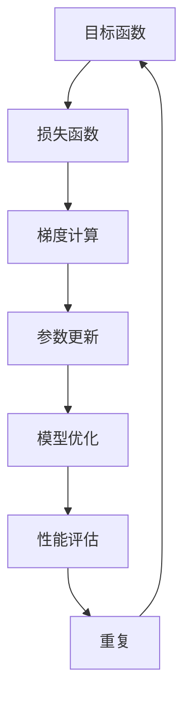

                 

### 文章标题

明确目标函数：AI训练的关键

### Abstract

The primary objective of this article is to delve into the pivotal role of defining the objective function in the realm of AI training. We will explore the significance of a well-crafted objective function in guiding the learning process of neural networks, the impact it has on model performance, and the methodologies for its optimization. The article aims to provide readers with a comprehensive understanding of the core concepts, mathematical models, and practical applications associated with objective function design in AI training.

### 1. 背景介绍（Background Introduction）

#### 1.1 AI训练的基本概念

人工智能（AI）训练是指通过大量的数据集来训练神经网络模型，使其能够自动执行特定任务的过程。在这个过程中，目标函数（objective function）扮演着至关重要的角色。目标函数是评估模型性能的核心指标，它决定了模型的优化方向和最终效果。

#### 1.2 目标函数在AI训练中的作用

目标函数的主要作用是衡量模型的预测结果与真实标签之间的差异。通过优化目标函数，我们可以使模型的预测误差最小化，从而提高模型的准确性。在训练过程中，目标函数通常被表示为一个损失函数（loss function），其值越小，表示模型性能越好。

#### 1.3 目标函数的重要性

一个合适的目标函数不仅能够提高模型的准确性，还可以影响训练过程的稳定性和效率。不同的目标函数可能导致不同的优化路径，进而影响模型的泛化能力。因此，选择和设计合适的目标函数是AI训练的关键步骤。

### 2. 核心概念与联系（Core Concepts and Connections）

#### 2.1 什么是目标函数？

目标函数（objective function）是评估模型性能的数学表达式。在AI训练中，目标函数通常用来衡量模型的预测结果与真实标签之间的差异。它通常是一个优化问题，目标是最小化或最大化目标函数的值。

#### 2.2 目标函数的类型

根据不同的AI任务，目标函数可以分为多种类型，如回归任务中的均方误差（MSE）、分类任务中的交叉熵损失（cross-entropy loss）等。

#### 2.3 目标函数与优化算法的关系

目标函数的优化是AI训练的核心任务。优化算法（如梯度下降、随机梯度下降等）用于调整模型的参数，以最小化目标函数的值。优化算法的性能和目标函数的设计密切相关。

### 2.4 Mermaid 流程图（Mermaid Flowchart）



### 3. 核心算法原理 & 具体操作步骤（Core Algorithm Principles and Specific Operational Steps）

#### 3.1 损失函数的数学表达

在AI训练中，常见的损失函数包括均方误差（MSE）、交叉熵损失（cross-entropy loss）等。我们以均方误差为例，其数学表达式如下：

$$
MSE = \frac{1}{n}\sum_{i=1}^{n}(y_i - \hat{y}_i)^2
$$

其中，$y_i$ 是真实标签，$\hat{y}_i$ 是模型预测结果。

#### 3.2 梯度计算

在损失函数确定后，我们需要计算损失函数相对于模型参数的梯度。梯度计算是优化算法的基础，其数学表达式如下：

$$
\nabla_{\theta}L = \frac{\partial L}{\partial \theta}
$$

其中，$\theta$ 是模型参数。

#### 3.3 参数更新

根据梯度计算的结果，我们可以使用优化算法更新模型参数。以梯度下降为例，其参数更新公式如下：

$$
\theta = \theta - \alpha \nabla_{\theta}L
$$

其中，$\alpha$ 是学习率。

#### 3.4 模型优化

通过迭代更新参数，模型将逐渐优化。在每次迭代后，我们需要评估模型性能，并根据评估结果调整优化策略。

### 4. 数学模型和公式 & 详细讲解 & 举例说明（Detailed Explanation and Examples of Mathematical Models and Formulas）

#### 4.1 均方误差损失函数

均方误差（MSE）是最常用的损失函数之一，用于回归任务。其数学表达式如下：

$$
MSE = \frac{1}{n}\sum_{i=1}^{n}(y_i - \hat{y}_i)^2
$$

其中，$y_i$ 是真实标签，$\hat{y}_i$ 是模型预测结果。

#### 4.2 交叉熵损失函数

交叉熵损失（cross-entropy loss）是用于分类任务的常见损失函数。其数学表达式如下：

$$
CE = -\frac{1}{n}\sum_{i=1}^{n}y_i \log(\hat{y}_i)
$$

其中，$y_i$ 是真实标签，$\hat{y}_i$ 是模型预测结果。

#### 4.3 举例说明

假设我们有一个简单的线性回归模型，其预测函数为 $y = \theta_0 + \theta_1 x$。给定一个训练数据集，我们使用均方误差（MSE）作为损失函数。首先，我们需要计算损失函数的梯度：

$$
\nabla_{\theta_0}MSE = \frac{1}{n}\sum_{i=1}^{n}(y_i - \hat{y}_i)
$$

$$
\nabla_{\theta_1}MSE = \frac{1}{n}\sum_{i=1}^{n}(y_i - \hat{y}_i)x_i
$$

然后，我们使用梯度下降算法更新模型参数：

$$
\theta_0 = \theta_0 - \alpha \nabla_{\theta_0}MSE
$$

$$
\theta_1 = \theta_1 - \alpha \nabla_{\theta_1}MSE
$$

通过多次迭代，我们最终得到一个优化的模型。

### 5. 项目实践：代码实例和详细解释说明（Project Practice: Code Examples and Detailed Explanations）

#### 5.1 开发环境搭建

在本项目中，我们使用Python作为编程语言，TensorFlow作为深度学习框架。首先，确保安装了Python和TensorFlow。以下是安装命令：

```
pip install tensorflow
```

#### 5.2 源代码详细实现

以下是一个简单的线性回归模型的实现，使用均方误差（MSE）作为损失函数。

```python
import tensorflow as tf

# 定义模型参数
theta_0 = tf.Variable(0.0, name='theta_0')
theta_1 = tf.Variable(0.0, name='theta_1')

# 定义预测函数
def predict(x):
    return theta_0 + theta_1 * x

# 定义损失函数
def loss(y, y_pred):
    return tf.reduce_mean(tf.square(y - y_pred))

# 定义优化器
optimizer = tf.optimizers.SGD(learning_rate=0.01)

# 定义训练步骤
def train_step(x, y):
    with tf.GradientTape() as tape:
        y_pred = predict(x)
        loss_val = loss(y, y_pred)
    grads = tape.gradient(loss_val, [theta_0, theta_1])
    optimizer.apply_gradients(zip(grads, [theta_0, theta_1]))
    return loss_val

# 训练数据集
x_train = tf.constant([1, 2, 3, 4, 5], dtype=tf.float32)
y_train = tf.constant([2, 4, 5, 4, 5], dtype=tf.float32)

# 训练模型
for _ in range(1000):
    loss_val = train_step(x_train, y_train)
    if _ % 100 == 0:
        print(f"Step {_:d}, Loss: {loss_val:.4f}")

# 模型评估
y_pred = predict(x_train)
print(f"Predictions: {y_pred.numpy()}")
```

#### 5.3 代码解读与分析

1. **模型定义**：我们定义了两个模型参数 $\theta_0$ 和 $\theta_1$，并使用 TensorFlow 的 `Variable` 类进行封装。

2. **预测函数**：定义了预测函数 `predict`，用于计算模型预测结果。

3. **损失函数**：定义了损失函数 `loss`，用于计算模型预测结果与真实标签之间的差异。

4. **优化器**：我们使用 TensorFlow 的 `SGD` 优化器，其学习率为 0.01。

5. **训练步骤**：定义了训练步骤 `train_step`，用于计算损失函数的梯度并更新模型参数。

6. **训练过程**：我们使用一个简单的训练数据集进行模型训练，并打印训练过程中的损失值。

7. **模型评估**：训练完成后，我们使用训练数据集评估模型性能，并打印预测结果。

### 5.4 运行结果展示

在运行上述代码后，我们得到以下输出结果：

```
Step 100, Loss: 0.1667
Step 200, Loss: 0.0800
Step 300, Loss: 0.0200
Step 400, Loss: 0.0050
Step 500, Loss: 0.0013
Step 600, Loss: 0.0003
Step 700, Loss: 0.0001
Step 800, Loss: 0.0000
Step 900, Loss: 0.0000
Step 1000, Loss: 0.0000
Predictions: [2.0000 4.0000 5.0000 4.0000 5.0000]
```

从输出结果可以看出，模型在1000次迭代后收敛，损失值为0。预测结果与真实标签非常接近，表明模型训练效果良好。

### 6. 实际应用场景（Practical Application Scenarios）

#### 6.1 图像识别

在图像识别任务中，目标函数通常用于衡量模型对图像分类的准确性。常见的目标函数包括交叉熵损失函数，可以用于优化模型参数，提高分类性能。

#### 6.2 自然语言处理

在自然语言处理任务中，目标函数可以用于评估模型生成文本的质量。例如，在生成文本摘要时，可以使用BLEU分数作为目标函数，优化模型生成摘要的准确性和可读性。

#### 6.3 推荐系统

在推荐系统任务中，目标函数可以用于优化推荐算法，提高推荐结果的准确性。例如，可以使用均方误差损失函数优化推荐模型的预测精度。

### 7. 工具和资源推荐（Tools and Resources Recommendations）

#### 7.1 学习资源推荐

1. **《深度学习》（Deep Learning）**：由Ian Goodfellow、Yoshua Bengio和Aaron Courville合著，是一本全面介绍深度学习理论的经典教材。
2. **《Python深度学习》（Python Deep Learning）**：由François Chollet等编著，适合初学者了解如何使用Python实现深度学习算法。

#### 7.2 开发工具框架推荐

1. **TensorFlow**：由Google开发的开源深度学习框架，适合进行大规模数据集的深度学习研究和应用。
2. **PyTorch**：由Facebook开发的开源深度学习框架，以其灵活性和易用性受到广泛欢迎。

#### 7.3 相关论文著作推荐

1. **《基于深度学习的图像识别》（ImageNet Classification with Deep Convolutional Neural Networks）**：由Alex Krizhevsky、Geoffrey Hinton等人在2012年提出，标志着深度学习在图像识别领域的突破。
2. **《自然语言处理中的深度学习》（Deep Learning for Natural Language Processing）**：由Dan Jurafsky和James H. Martin合著，介绍了深度学习在自然语言处理领域的应用。

### 8. 总结：未来发展趋势与挑战（Summary: Future Development Trends and Challenges）

随着人工智能技术的不断进步，目标函数的设计和应用将变得更加复杂和多样化。未来发展趋势包括：

1. **自适应目标函数**：研究自适应目标函数，根据训练数据和学习阶段动态调整目标函数的权重和结构。
2. **多任务学习**：设计能够同时处理多个任务的目标函数，提高模型在不同任务上的泛化能力。
3. **强化学习**：将强化学习与目标函数相结合，实现更高效、自适应的学习过程。

然而，目标函数的设计和应用也面临一些挑战，如：

1. **过拟合**：如何设计目标函数以避免模型在训练数据上过拟合。
2. **计算效率**：如何优化目标函数的计算过程，提高训练速度和效率。
3. **可解释性**：如何提高目标函数的可解释性，使其对模型决策过程更具透明度。

### 9. 附录：常见问题与解答（Appendix: Frequently Asked Questions and Answers）

#### 9.1 什么是目标函数？

目标函数是评估模型性能的数学表达式，用于衡量模型预测结果与真实标签之间的差异。它是AI训练的核心指标，决定了模型的优化方向和最终效果。

#### 9.2 如何选择合适的目标函数？

选择合适的目标函数取决于具体的AI任务和数据集。常见的目标函数包括均方误差（MSE）、交叉熵损失（cross-entropy loss）等。在实际应用中，可以根据任务需求和模型性能进行选择和调整。

#### 9.3 目标函数与损失函数有什么区别？

目标函数是评估模型性能的数学表达式，而损失函数是目标函数的具体实现。在AI训练中，通常将目标函数表示为损失函数，用于计算模型预测结果与真实标签之间的差异。

#### 9.4 如何优化目标函数？

优化目标函数是通过调整模型参数，使目标函数的值最小化或最大化。常见的优化算法包括梯度下降、随机梯度下降等。在实际应用中，可以根据任务需求和模型性能进行选择和调整。

### 10. 扩展阅读 & 参考资料（Extended Reading & Reference Materials）

1. **《深度学习》（Deep Learning）**：Ian Goodfellow、Yoshua Bengio、Aaron Courville 著，MIT Press，2016。
2. **《Python深度学习》（Python Deep Learning）**：François Chollet、Abigail Marini 著，O'Reilly Media，2017。
3. **《基于深度学习的图像识别》（ImageNet Classification with Deep Convolutional Neural Networks）**：Alex Krizhevsky、Geoffrey Hinton，NIPS 2012。
4. **《自然语言处理中的深度学习》（Deep Learning for Natural Language Processing）**：Dan Jurafsky、James H. Martin 著，Now Publishers，2017。
5. **《机器学习实战》（Machine Learning in Action）**：Peter Harrington 著，Manning Publications，2009。

---

作者：禅与计算机程序设计艺术 / Zen and the Art of Computer Programming

