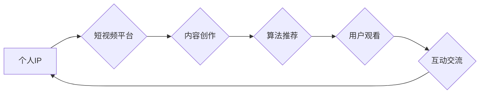

                 

## 如何利用短视频平台建立个人IP

> 关键词：短视频平台、个人IP、内容创作、算法推荐、用户运营、品牌建设、商业变现

### 1. 背景介绍

在数字时代，信息爆炸和内容泛滥的背景下，个人品牌建设变得尤为重要。短视频平台作为当下最火爆的社交媒体之一，其用户规模庞大、传播速度快、互动性强，为个人IP的打造提供了绝佳的舞台。

传统媒体的传播模式单向，而短视频平台则打破了这种局限，实现了用户与内容创作者的双向互动。用户可以通过点赞、评论、分享等方式表达自己的观点和喜好，而内容创作者则可以根据用户的反馈及时调整创作方向，打造更符合用户需求的内容。

### 2. 核心概念与联系

#### 2.1 个人IP的概念

个人IP是指个人在特定领域或平台积累的独特声誉、影响力和认知度。它是一种个人品牌的抽象化体现，代表着个人在特定领域的专业性、个性和价值观。

#### 2.2 短视频平台的特性

短视频平台拥有以下核心特性：

* **碎片化内容:** 短视频内容时长短，易于快速浏览和消化。
* **视觉化表达:** 短视频以视频为主，更具视觉冲击力和感染力。
* **互动性强:** 用户可以通过点赞、评论、分享等方式与内容创作者互动。
* **算法推荐:** 平台通过算法推荐，将用户感兴趣的内容推送给用户。

#### 2.3 个人IP与短视频平台的联系

个人IP的建立需要持续输出优质内容，而短视频平台为个人IP的打造提供了以下优势：

* **快速传播:** 短视频内容传播速度快，可以快速积累粉丝和影响力。
* **精准触达:** 算法推荐可以将内容精准推送给目标用户。
* **互动交流:** 短视频平台的互动功能可以帮助个人IP与粉丝建立更紧密的联系。

**Mermaid 流程图**



### 3. 核心算法原理 & 具体操作步骤

#### 3.1 算法原理概述

短视频平台的推荐算法主要基于用户行为数据和内容特征数据，通过机器学习模型预测用户对特定内容的兴趣，并将其推荐给用户。

#### 3.2 算法步骤详解

1. **数据采集:** 收集用户观看历史、点赞、评论、分享等行为数据，以及视频内容的标签、描述、时长等特征数据。
2. **数据预处理:** 对采集到的数据进行清洗、转换和特征工程，以便于模型训练。
3. **模型训练:** 使用机器学习算法，例如协同过滤、深度学习等，训练推荐模型。
4. **模型预测:** 将新用户或新视频输入模型，预测用户对该视频的兴趣评分。
5. **结果排序:** 根据预测评分对视频进行排序，推荐给用户。

#### 3.3 算法优缺点

**优点:**

* **精准推荐:** 算法可以根据用户的兴趣偏好精准推荐内容。
* **个性化体验:** 每个用户的推荐结果都是个性化的，可以满足用户的不同需求。
* **内容发现:** 算法可以帮助用户发现新的内容和创作者。

**缺点:**

* **信息茧房:** 算法可能会导致用户只看到自己感兴趣的内容，缺乏多元化信息获取。
* **数据隐私:** 算法需要收集大量的用户数据，可能会引发数据隐私问题。
* **算法偏差:** 算法模型可能会存在偏差，导致推荐结果不公平或不准确。

#### 3.4 算法应用领域

短视频平台的推荐算法广泛应用于以下领域:

* **内容推荐:** 推荐用户感兴趣的视频内容。
* **用户画像:** 建立用户画像，了解用户的兴趣爱好和行为模式。
* **广告投放:** 精准投放广告，提高广告效果。
* **内容创作:** 为内容创作者提供数据分析和创作建议。

### 4. 数学模型和公式 & 详细讲解 & 举例说明

#### 4.1 数学模型构建

短视频平台的推荐算法通常采用协同过滤模型，该模型基于用户的行为数据和内容特征数据，预测用户对特定内容的兴趣评分。

**协同过滤模型的基本假设:**

* 用户对相似内容的兴趣相似。
* 用户对相似用户的兴趣相似。

#### 4.2 公式推导过程

协同过滤模型的评分预测公式如下:

$$
r_{ui} = \mu + b_u + b_i + \epsilon_{ui}
$$

其中:

* $r_{ui}$: 用户 $u$ 对物品 $i$ 的评分。
* $\mu$: 全局平均评分。
* $b_u$: 用户 $u$ 的偏置评分。
* $b_i$: 物品 $i$ 的偏置评分。
* $\epsilon_{ui}$: 随机误差项。

#### 4.3 案例分析与讲解

假设用户 $A$ 对电影 $X$ 评分为 5，用户 $B$ 对电影 $X$ 评分为 4，用户 $A$ 对电影 $Y$ 评分为 4，用户 $B$ 对电影 $Y$ 评分为 5。

根据协同过滤模型，我们可以预测用户 $A$ 对电影 $Y$ 的评分，以及用户 $B$ 对电影 $X$ 的评分。

### 5. 项目实践：代码实例和详细解释说明

#### 5.1 开发环境搭建

* Python 3.x
* TensorFlow 或 PyTorch
* Jupyter Notebook

#### 5.2 源代码详细实现

```python
# 导入必要的库
import tensorflow as tf

# 定义模型
model = tf.keras.Sequential([
    tf.keras.layers.Dense(64, activation='relu'),
    tf.keras.layers.Dense(10, activation='softmax')
])

# 编译模型
model.compile(optimizer='adam',
              loss='sparse_categorical_crossentropy',
              metrics=['accuracy'])

# 训练模型
model.fit(x_train, y_train, epochs=10)

# 评估模型
loss, accuracy = model.evaluate(x_test, y_test)
print('Loss:', loss)
print('Accuracy:', accuracy)
```

#### 5.3 代码解读与分析

* 首先，我们导入必要的库，包括 TensorFlow 库。
* 然后，我们定义一个简单的深度学习模型，该模型包含两个全连接层。
* 接着，我们编译模型，指定优化器、损失函数和评估指标。
* 接下来，我们训练模型，使用训练数据进行训练。
* 最后，我们评估模型，使用测试数据计算模型的损失和准确率。

#### 5.4 运行结果展示

训练完成后，我们可以查看模型的损失和准确率，并根据结果进行模型调优。

### 6. 实际应用场景

#### 6.1 内容推荐

短视频平台可以利用推荐算法推荐用户感兴趣的内容，提高用户粘性和活跃度。

#### 6.2 用户运营

短视频平台可以利用用户行为数据分析用户画像，制定精准的用户运营策略。

#### 6.3 品牌建设

个人IP可以通过短视频平台建立品牌形象，提升个人影响力，并实现商业变现。

#### 6.4 未来应用展望

随着人工智能技术的不断发展，短视频平台的推荐算法将会更加精准、个性化和智能化。

### 7. 工具和资源推荐

#### 7.1 学习资源推荐

* **书籍:**
    * 《推荐系统实践》
    * 《深度学习》
* **在线课程:**
    * Coursera: Recommender Systems
    * Udacity: Deep Learning Nanodegree

#### 7.2 开发工具推荐

* **Python:** 
    * TensorFlow
    * PyTorch
* **数据分析工具:**
    * Pandas
    * Scikit-learn

#### 7.3 相关论文推荐

* **Collaborative Filtering for Implicit Feedback Datasets**
* **Deep Learning for Recommender Systems**

### 8. 总结：未来发展趋势与挑战

#### 8.1 研究成果总结

短视频平台的推荐算法已经取得了显著的成果，能够精准推荐用户感兴趣的内容，提高用户体验。

#### 8.2 未来发展趋势

* **更精准的推荐:** 利用更先进的机器学习算法和数据分析技术，实现更精准的推荐。
* **更个性化的体验:** 根据用户的兴趣爱好、行为模式和上下文信息，提供更个性化的推荐体验。
* **更智能的交互:** 利用自然语言处理和语音识别技术，实现更智能的交互体验。

#### 8.3 面临的挑战

* **数据隐私:** 算法需要收集大量的用户数据，如何保护用户隐私是一个重要的挑战。
* **算法偏差:** 算法模型可能会存在偏差，导致推荐结果不公平或不准确。
* **内容质量:** 短视频平台上存在大量低质量内容，如何提高内容质量是一个重要的挑战。

#### 8.4 研究展望

未来，短视频平台的推荐算法将会更加智能化、个性化和人性化，为用户提供更优质的体验。


### 9. 附录：常见问题与解答

#### 9.1 如何提高短视频的推荐排名?

* **创作优质内容:** 创作内容要符合用户需求，具有吸引力和趣味性。
* **优化视频标题和描述:** 使用关键词，吸引用户点击。
* **互动与传播:** 鼓励用户点赞、评论、分享，提高视频的曝光度。
* **关注平台规则:** 遵守平台的规则和规范，避免被封号或降权。

#### 9.2 如何建立个人IP?

* **确定定位:** 选择一个自己擅长的领域，并打造独特的个人风格。
* **持续输出优质内容:** 定期发布高质量的短视频内容，吸引粉丝关注。
* **与粉丝互动:** 积极回复粉丝评论，建立良好的互动关系。
* **拓展平台:** 将个人IP推广到其他平台，扩大影响力。


作者：禅与计算机程序设计艺术 / Zen and the Art of Computer Programming 
<end_of_turn>

