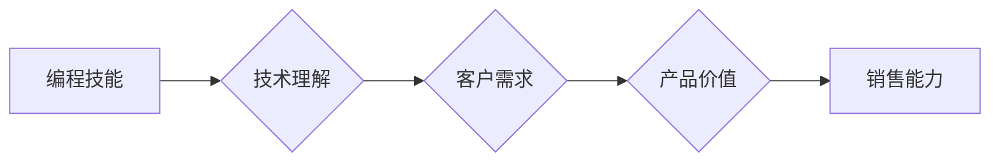

                 

## 如何将编程技能转化为销售能力

> 关键词：编程技能、销售能力、沟通技巧、技术理解、产品价值、客户需求、演示技巧、谈判策略、数据分析

### 1. 背景介绍

在当今科技日新月异的时代，编程技能已成为一项宝贵的资产。然而，仅仅掌握编程技术并不能保证职业成功。越来越多的技术领域需要具备强烈的沟通能力和销售意识，将技术转化为商业价值。对于程序员来说，学习如何将编程技能转化为销售能力，将打开通往更高层次职业发展的道路。

传统观念认为，程序员和销售人员是两个截然不同的职业群体。程序员专注于代码编写和技术实现，而销售人员则负责与客户沟通、建立关系并促成交易。然而，随着科技行业的快速发展，这两个领域之间的界限正在逐渐模糊。

现代软件产品和技术解决方案越来越复杂，需要程序员具备更深入的理解客户需求的能力，并能够清晰地向客户传达产品的价值和优势。同时，销售人员也需要具备一定的技术基础，才能更好地理解产品的功能和特点，并与技术团队进行有效的沟通。

### 2. 核心概念与联系

将编程技能转化为销售能力的核心在于建立**技术与商业价值的桥梁**。

程序员需要将自己的技术知识和经验转化为客户能够理解的语言，并突出产品的核心价值和优势。销售人员需要了解技术的原理和应用场景，才能更好地与客户沟通和谈判。

**Mermaid 流程图：**



### 3. 核心算法原理 & 具体操作步骤

#### 3.1  算法原理概述

将编程技能转化为销售能力的核心算法可以概括为以下几个步骤：

1. **技术分析:** 深入理解产品的技术架构、功能特点和优势。
2. **需求挖掘:** 通过与客户沟通，了解他们的具体需求和痛点。
3. **价值构建:** 将产品的技术优势与客户需求相结合，构建产品价值主张。
4. **沟通表达:** 使用清晰简洁的语言，向客户传达产品的价值和优势。
5. **谈判策略:** 根据客户的需求和反馈，制定有效的谈判策略。

#### 3.2  算法步骤详解

1. **技术分析:** 程序员需要具备对产品的深入理解，包括其技术架构、功能特点、性能指标和安全机制等。通过阅读技术文档、参与代码审查和测试，可以积累对产品的技术知识。

2. **需求挖掘:** 销售人员需要与客户进行充分的沟通，了解他们的业务场景、痛点问题和期望目标。可以通过问答、案例分析和现场调研等方式，收集客户的需求信息。

3. **价值构建:** 将产品的技术优势与客户需求相结合，构建产品价值主张。例如，如果产品具有高性能的特点，可以强调其能够提高客户的效率和生产力；如果产品具有安全性，可以强调其能够保护客户的隐私和数据安全。

4. **沟通表达:** 使用清晰简洁的语言，向客户传达产品的价值和优势。避免使用过于专业的术语，而是用客户能够理解的语言描述产品的功能和特点。可以使用演示、案例分析和数据图表等方式，增强沟通的有效性。

5. **谈判策略:** 根据客户的需求和反馈，制定有效的谈判策略。例如，如果客户对产品的价格有顾虑，可以提供定制化的方案或分期付款方式；如果客户对产品的功能不满意，可以提供技术支持或升级服务。

#### 3.3  算法优缺点

**优点:**

* 能够将技术优势转化为商业价值。
* 能够提高客户的满意度和忠诚度。
* 能够促进公司业务的增长和发展。

**缺点:**

* 需要程序员具备一定的沟通和销售能力。
* 需要销售人员具备一定的技术基础。
* 需要公司建立有效的技术与销售的协作机制。

#### 3.4  算法应用领域

该算法适用于所有需要将技术转化为商业价值的领域，例如：

* 软件开发
* IT咨询
* 技术服务
* 新产品开发
* 市场营销

### 4. 数学模型和公式 & 详细讲解 & 举例说明

将编程技能转化为销售能力可以看作是一个优化问题，目标是最大化产品的价值和销售额。

#### 4.1  数学模型构建

我们可以用以下数学模型来表示该问题：

$$
Value = f(Technical\_Capability, Customer\_Need, Communication\_Effectiveness)
$$

其中：

* Value: 产品的价值，可以表示为销售额、客户满意度等指标。
* Technical\_Capability: 产品的技术能力，可以表示为性能、功能、安全性等指标。
* Customer\_Need: 客户的需求，可以表示为业务场景、痛点问题、期望目标等指标。
* Communication\_Effectiveness: 沟通的有效性，可以表示为客户理解程度、信任度、购买意愿等指标。

#### 4.2  公式推导过程

该公式表明，产品的价值取决于三个因素的综合作用。

* 技术能力是产品的基础，需要满足客户的基本需求。
* 客户需求是产品的导向，需要针对客户的具体问题提供解决方案。
* 沟通的有效性是关键，需要将产品的价值清晰地传达给客户。

#### 4.3  案例分析与讲解

例如，一家开发云计算平台的公司，其技术能力非常强大，但缺乏对客户需求的深入了解。

* 他们开发的产品功能非常丰富，但并没有针对特定行业的客户需求进行优化。
* 他们的销售人员缺乏技术背景，无法有效地向客户传达产品的价值。

最终，该公司的产品未能获得市场认可，销售额惨淡。

通过分析该案例，我们可以看到，仅仅拥有强大的技术能力并不能保证成功的销售。需要将技术能力与客户需求相结合，并通过有效的沟通将产品的价值传递给客户。

### 5. 项目实践：代码实例和详细解释说明

#### 5.1  开发环境搭建

为了更好地理解如何将编程技能转化为销售能力，我们可以创建一个简单的项目，模拟销售流程。

开发环境可以搭建在任何支持Python的平台上，例如：

* Windows
* macOS
* Linux

需要安装以下软件：

* Python 3.x
* Jupyter Notebook

#### 5.2  源代码详细实现

```python
class Product:
    def __init__(self, name, price, features):
        self.name = name
        self.price = price
        self.features = features

    def describe(self):
        print(f"产品名称: {self.name}")
        print(f"价格: {self.price}")
        print(f"功能: {self.features}")

class Customer:
    def __init__(self, name, needs):
        self.name = name
        self.needs = needs

    def express_interest(self, product):
        print(f"{self.name} 对 {product.name} 感兴趣")

    def evaluate_product(self, product):
        print(f"{self.name} 正在评估 {product.name} 是否满足其需求")

# 创建产品实例
product = Product("云计算平台", 10000, ["高性能", "安全性", "可扩展性"])

# 创建客户实例
customer = Customer("公司A", ["高性能", "安全性"])

# 产品演示
product.describe()

# 客户表达兴趣
customer.express_interest(product)

# 客户评估产品
customer.evaluate_product(product)
```

#### 5.3  代码解读与分析

该代码模拟了产品演示、客户表达兴趣和客户评估产品三个步骤。

* `Product` 类代表产品，包含产品名称、价格和功能等属性。
* `Customer` 类代表客户，包含客户名称和需求等属性。
* `describe()` 方法用于展示产品的详细信息。
* `express_interest()` 方法模拟客户对产品的兴趣。
* `evaluate_product()` 方法模拟客户对产品的评估。

#### 5.4  运行结果展示

运行该代码，可以得到以下输出：

```
产品名称: 云计算平台
价格: 10000
功能: ['高性能', '安全性', '可扩展性']
公司A 对 云计算平台 感兴趣
公司A 正在评估 云计算平台 是否满足其需求
```

### 6. 实际应用场景

将编程技能转化为销售能力在实际应用场景中具有广泛的应用价值。

#### 6.1  软件开发

软件开发人员需要能够理解客户的需求，并将其转化为技术方案。

* 通过与客户沟通，了解他们的业务场景、痛点问题和期望目标。
* 根据客户的需求，设计和开发符合其要求的软件产品。
* 向客户演示软件的功能和特点，并解释其价值。

#### 6.2  IT咨询

IT咨询人员需要具备对技术的深入理解，并能够将其应用于解决客户的业务问题。

* 帮助客户分析其业务需求，并提出相应的技术解决方案。
* 评估现有技术的优缺点，并推荐合适的技术方案。
* 协助客户实施技术解决方案，并提供技术支持。

#### 6.3  技术服务

技术服务人员需要能够解决客户的技术问题，并提供技术支持。

* 了解客户的技术环境和需求。
* 诊断和解决客户的技术问题。
* 提供技术培训和指导。

#### 6.4  未来应用展望

随着人工智能、大数据和云计算等技术的快速发展，将编程技能转化为销售能力将变得更加重要。

* 人工智能可以帮助程序员自动生成代码，提高开发效率。
* 大数据可以帮助程序员分析客户需求，提供更精准的解决方案。
* 云计算可以帮助程序员快速部署和扩展软件产品。

### 7. 工具和资源推荐

#### 7.1  学习资源推荐

* **书籍:**

    * 《The Pragmatic Programmer》
    * 《Selling Technical Solutions》
    * 《Influence: The Psychology of Persuasion》

* **在线课程:**

    * Coursera: "Sales Fundamentals"
    * Udemy: "Technical Sales Mastery"
    * LinkedIn Learning: "Effective Communication for Technical Professionals"

#### 7.2  开发工具推荐

* **版本控制系统:** Git
* **代码编辑器:** Visual Studio Code, Sublime Text
* **项目管理工具:** Jira, Trello

#### 7.3  相关论文推荐

* "The Impact of Technical Skills on Sales Performance"
* "Bridging the Gap Between Technology and Sales"
* "The Role of Communication in Technical Sales"

### 8. 总结：未来发展趋势与挑战

#### 8.1  研究成果总结

将编程技能转化为销售能力是一个重要的研究方向，它可以帮助程序员更好地理解客户需求，并将其转化为商业价值。

* 通过技术分析、需求挖掘、价值构建和沟通表达等步骤，可以提高产品的销售额和客户满意度。
* 人工智能、大数据和云计算等技术的快速发展，将为该领域带来新的机遇和挑战。

#### 8.2  未来发展趋势

未来，将编程技能转化为销售能力将更加重要，并呈现以下趋势：

* **技术与销售的融合:** 技术人员和销售人员将更加紧密地合作，共同推动产品的销售。
* **数据驱动的销售:** 数据分析将被更加广泛地应用于销售决策，帮助程序员和销售人员更好地理解客户需求。
* **个性化销售:** 随着人工智能的发展，将能够提供更加个性化的销售服务，满足不同客户的需求。

#### 8.3  面临的挑战

将编程技能转化为销售能力也面临一些挑战：

* **跨学科沟通:** 程序员和销售人员来自不同的背景，需要克服沟通障碍。
* **销售技能培训:** 程序员需要接受专业的销售技能培训，才能更好地进行销售工作。
* **技术变化:** 技术发展迅速，程序员需要不断学习新技术，才能保持竞争力。

#### 8.4  研究展望

未来，需要进一步研究以下问题：

* 如何更好地融合技术和销售？
* 如何利用数据分析提高销售效率？
* 如何培养程序员的销售技能？


### 9. 附录：常见问题与解答

**问题 1:** 如何才能将技术知识转化为客户能够理解的语言？

**解答:**

* 使用通俗易懂的语言，避免使用过于专业的术语。
* 以客户的视角思考问题，理解他们的需求和痛点。
* 使用案例和图表等方式，将技术知识进行可视化展示。

**问题 2:** 如何才能有效地与客户沟通，建立信任关系？

**解答:**

* 积极倾听客户的需求，并给予真诚的回应。
* 坦诚地表达产品的优势和局限性。
* 提供专业的技术支持，解决客户的疑问和问题。

**问题 3:** 如何才能提升自己的销售技能？

**解答:**

* 阅读相关书籍和文章，学习销售技巧和策略。
* 参加销售培训课程，获得专业的指导和实践经验。
* 多与销售人员交流学习，分享经验和心得。


作者：禅与计算机程序设计艺术 / Zen and the Art of Computer Programming 
<end_of_turn>

