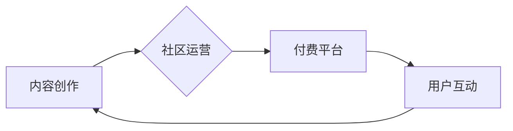

                 

## 如何打造个人知识付费影响力圈

> 关键词：知识付费、个人品牌、影响力圈、内容创作、社区运营、技术博客、在线课程

### 1. 背景介绍

在互联网时代，知识成为最宝贵的资源。随着信息爆炸和学习需求的不断增长，知识付费模式逐渐兴起，成为一种新的商业模式和个人价值实现途径。个人知识付费是指个人通过分享自己的专业知识、技能和经验，向他人提供付费学习服务，从而获得收益。

打造个人知识付费影响力圈，意味着建立一个围绕你个人品牌和知识体系的生态系统，吸引并服务于你的目标受众。这不仅可以带来经济收益，更重要的是可以提升个人影响力、建立专业声誉，并与志同道合的人建立连接。

### 2. 核心概念与联系

#### 2.1 知识付费生态系统

知识付费生态系统是一个由内容创作、社区运营、付费平台、用户互动等多个环节组成的闭环系统。

**Mermaid 流程图:**



#### 2.2 个人品牌建设

个人品牌是个人在特定领域或行业内所建立的独特形象和声誉。打造个人品牌，需要清晰定位目标受众，突出个人优势和价值，并通过持续输出优质内容和互动，与受众建立信任关系。

#### 2.3 影响力圈构建

影响力圈是指围绕个人品牌建立的网络关系，包括粉丝、读者、客户、合作伙伴等。构建影响力圈，需要积极参与行业活动、建立线上线下社群，并通过分享价值、提供帮助，与目标受众建立深度连接。

### 3. 核心算法原理 & 具体操作步骤

#### 3.1 算法原理概述

打造个人知识付费影响力圈的核心算法，可以概括为“价值交换”和“关系积累”。

* **价值交换:** 提供高质量、有价值的内容，满足目标受众的学习需求，并通过付费服务获得回报。
* **关系积累:** 建立信任关系，与目标受众互动交流，形成稳定的影响力圈。

#### 3.2 算法步骤详解

1. **定位目标受众:** 确定你的知识领域和目标受众，了解他们的需求、痛点和学习习惯。
2. **打造个人品牌:** 构建独特的个人品牌形象，突出你的专业优势和价值主张。
3. **内容创作:** 持续输出高质量、有价值的内容，例如博客文章、视频教程、音频课程等。
4. **社区运营:** 建立线上线下社群，与目标受众互动交流，提供帮助和支持。
5. **付费平台搭建:** 选择合适的付费平台，例如微信公众号、付费网站、在线课程平台等。
6. **推广营销:** 利用社交媒体、搜索引擎优化等手段，推广你的知识付费产品和服务。
7. **数据分析:** 跟踪用户行为数据，分析用户反馈，不断优化内容和服务。

#### 3.3 算法优缺点

* **优点:** 
    * 能够有效地将个人知识转化为经济价值。
    * 可以提升个人影响力，建立专业声誉。
    * 可以与目标受众建立深度连接，形成稳定的关系。
* **缺点:** 
    * 需要投入大量时间和精力进行内容创作和社区运营。
    * 需要具备一定的营销推广能力，才能吸引用户。
    * 需要不断学习和更新知识，才能保持竞争力。

#### 3.4 算法应用领域

* **技术领域:** 软件开发、数据分析、人工智能等。
* **商业领域:** 营销推广、销售管理、创业投资等。
* **生活领域:** 语言学习、健康养生、旅行攻略等。

### 4. 数学模型和公式 & 详细讲解 & 举例说明

#### 4.1 数学模型构建

我们可以用一个简单的数学模型来描述知识付费的影响力圈增长：

$$
\text{影响力} = \text{内容价值} \times \text{传播效率} \times \text{用户粘性}
$$

其中：

* **内容价值:** 指的是你的知识付费内容的质量和实用性。
* **传播效率:** 指的是你的内容传播的范围和速度。
* **用户粘性:** 指的是用户对你的内容和品牌忠诚度。

#### 4.2 公式推导过程

* **内容价值:** 可以通过用户反馈、点赞、评论等数据来衡量。
* **传播效率:** 可以通过社交媒体分享量、网站流量、搜索引擎排名等数据来衡量。
* **用户粘性:** 可以通过用户复购率、活跃度、留存率等数据来衡量。

#### 4.3 案例分析与讲解

假设一个技术博客作者，他的博客内容质量很高，能够吸引大量读者，传播效率也比较高，但用户粘性较低。

* 为了提高用户粘性，他可以建立一个付费会员群，提供独家内容和互动交流机会。
* 也可以定期举办线上线下活动，与读者建立更深层的连接。

通过这些措施，可以提高用户粘性，从而提升整体的影响力。

### 5. 项目实践：代码实例和详细解释说明

#### 5.1 开发环境搭建

* **操作系统:** Linux/macOS/Windows
* **编程语言:** Python
* **开发工具:** VS Code/Atom/Sublime Text
* **数据库:** MySQL/PostgreSQL

#### 5.2 源代码详细实现

```python
# 这是一个简单的博客文章发布脚本

import requests

def publish_article(title, content, url):
    """
    发布博客文章

    Args:
        title (str): 文章标题
        content (str): 文章内容
        url (str): 博客平台 API 地址
    """
    headers = {
        'Authorization': 'Bearer your_api_token'
    }
    data = {
        'title': title,
        'content': content
    }
    response = requests.post(url, headers=headers, json=data)
    if response.status_code == 200:
        print('文章发布成功！')
    else:
        print('文章发布失败！')

# 示例用法
title = '如何打造个人知识付费影响力圈'
content = '...'
url = 'https://api.your_blog_platform.com/articles'
publish_article(title, content, url)
```

#### 5.3 代码解读与分析

* 该脚本使用 Python 的 `requests` 库发送 HTTP POST 请求，将文章标题和内容发送到博客平台的 API 地址。
* 需要将 `your_api_token` 替换为你的博客平台 API 令牌。
* 脚本会根据 API 返回的状态码判断文章是否发布成功。

#### 5.4 运行结果展示

如果文章发布成功，则会在控制台输出“文章发布成功！”的消息。

### 6. 实际应用场景

#### 6.1 技术博客

技术博客作者可以通过分享自己的技术经验和知识，吸引读者关注，并通过付费课程、会员服务等方式获得收益。

#### 6.2 在线课程平台

在线课程平台可以提供各种类型的知识付费课程，例如编程、设计、营销等。

#### 6.3 社区运营

一些社区可以提供付费会员服务，为会员提供独家内容、互动交流机会和资源支持。

#### 6.4 未来应用展望

随着互联网技术的不断发展，知识付费模式将更加多样化和智能化。

* **人工智能:** AI 可以帮助自动生成内容、个性化推荐课程、提供智能客服等。
* **元宇宙:** 元宇宙将为知识付费提供更加沉浸式的体验，例如虚拟课堂、互动游戏等。
* **区块链:** 区块链可以保障知识产权，提高知识付费的透明度和安全性。

### 7. 工具和资源推荐

#### 7.1 学习资源推荐

* **书籍:** 《零基础学编程》、《Python编程入门》、《数据结构与算法》
* **在线课程:** Coursera、edX、Udemy
* **博客:** CSDN、掘金、SegmentFault

#### 7.2 开发工具推荐

* **代码编辑器:** VS Code、Atom、Sublime Text
* **数据库:** MySQL、PostgreSQL、MongoDB
* **云平台:** AWS、Azure、GCP

#### 7.3 相关论文推荐

* **知识付费模式研究:** 《知识付费模式的现状与发展趋势》
* **影响力圈构建理论:** 《影响力圈的构建与运营》
* **人工智能在知识付费中的应用:** 《人工智能技术在知识付费领域的应用研究》

### 8. 总结：未来发展趋势与挑战

#### 8.1 研究成果总结

打造个人知识付费影响力圈需要结合内容创作、社区运营、付费平台搭建等多个环节，并不断优化算法模型，提升用户体验。

#### 8.2 未来发展趋势

未来知识付费将更加个性化、智能化和沉浸式，人工智能、元宇宙等技术将推动知识付费模式的创新发展。

#### 8.3 面临的挑战

* **内容质量:** 需要持续输出高质量、有价值的内容，才能吸引和留住用户。
* **用户粘性:** 需要建立信任关系，与用户建立深度连接，才能提高用户粘性。
* **商业模式:** 需要探索新的商业模式，才能实现可持续发展。

#### 8.4 研究展望

未来研究将重点关注人工智能在知识付费中的应用，以及元宇宙对知识付费的影响。

### 9. 附录：常见问题与解答

#### 9.1 如何提高内容质量？

* 关注用户需求，提供有价值的信息和解决方案。
* 坚持原创，避免抄袭和伪原创。
* 多方学习，不断提升自己的专业水平。

#### 9.2 如何建立用户粘性？

* 提供独家内容和互动交流机会。
* 定期举办线上线下活动，与用户建立更深层的连接。
* 提供优质的客户服务，解决用户遇到的问题。

#### 9.3 如何选择合适的付费平台？

* 考虑目标受众、内容类型和商业模式。
* 比较不同平台的收费标准、功能和服务。
* 选择信誉良好、用户体验好的平台。


作者：禅与计算机程序设计艺术 / Zen and the Art of Computer Programming 
<end_of_turn>

