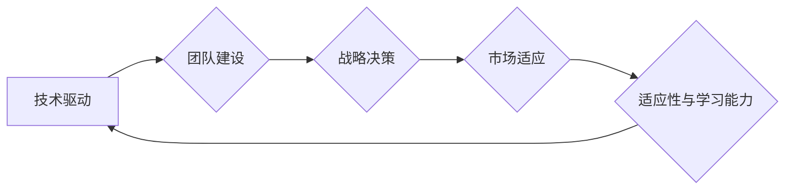

                 

## 学习做CEO：贾扬清在创业中成长，适应领导角色

> 关键词：CEO, 创业, 领导力, 团队建设, 技术驱动, 战略决策, 创新, 适应性

## 1. 背景介绍

在当今瞬息万变的科技时代，创业者们肩负着推动创新、创造价值的重任。而作为一家科技公司的CEO，不仅需要精通技术领域，更需要具备卓越的领导力、战略眼光和团队管理能力。贾扬清，作为知名的创业者和技术专家，其在创业历程中所展现出的领导力成长和适应能力，为我们提供了宝贵的学习借鉴。

贾扬清，毕业于清华大学计算机系，曾任职于微软研究院，后创立了人工智能公司“旷世科技”。他带领团队在计算机视觉领域取得了突破性进展，并成功将技术应用于实际场景，如人脸识别、图像分析等。在创业过程中，贾扬清经历了从技术专家到领导者的转变，不断学习和适应新的角色和挑战。

## 2. 核心概念与联系

**2.1 领导力与技术驱动**

科技创业的核心在于技术创新，而技术驱动型的领导力则指以技术为导向，以技术进步为核心竞争力，并以此推动企业发展。贾扬清作为一名技术专家，深谙技术的魅力和力量，他将技术视为企业发展的基石，并将其融入到公司的战略决策和团队建设中。

**2.2 团队建设与人才培养**

成功的创业离不开优秀的人才团队。贾扬清非常重视团队建设，他注重人才的培养和成长，为团队成员提供学习和成长的平台，并鼓励他们积极探索和创新。他相信，只有团队成员共同成长，才能推动企业不断进步。

**2.3 战略决策与市场适应**

创业者需要具备敏锐的市场洞察力和战略决策能力。贾扬清在带领旷世科技发展过程中，始终关注市场需求和技术趋势，并根据实际情况调整战略方向，以适应不断变化的市场环境。

**2.4 适应性与学习能力**

创业是一个充满挑战和变数的过程，创业者需要具备强大的适应性和学习能力。贾扬清在创业过程中不断学习和成长，他积极拥抱新的技术和理念，并不断调整自己的思维方式，以适应不断变化的市场环境和行业发展趋势。

**Mermaid 流程图**

## 3. 核心算法原理 & 具体操作步骤

**3.1 算法原理概述**

在人工智能领域，旷世科技在人脸识别技术方面取得了领先地位。其核心算法基于深度学习技术，利用卷积神经网络（CNN）对人脸图像进行特征提取和识别。

**3.2 算法步骤详解**

1. **数据采集和预处理:** 收集大量的人脸图像数据，并进行预处理，例如图像裁剪、增强、归一化等。
2. **模型训练:** 利用深度学习框架，例如TensorFlow或PyTorch，训练CNN模型。训练过程中，模型会学习人脸图像的特征表示，并将其映射到一个低维空间。
3. **特征提取:** 将待识别的图像输入到训练好的CNN模型中，模型会提取图像的人脸特征。
4. **相似度计算:** 将提取出的特征与数据库中已知的人脸特征进行比较，计算相似度。
5. **识别结果:** 根据相似度阈值，判断图像中是否存在已知的人脸，并返回识别结果。

**3.3 算法优缺点**

**优点:**

* 高识别精度: 深度学习算法能够学习到人脸图像的复杂特征，从而实现高精度的识别。
* 鲁棒性强: 对光照、姿态、表情等变化具有较强的鲁棒性。
* 可扩展性强: 可以利用更多的训练数据和更复杂的模型架构，进一步提高识别精度。

**缺点:**

* 计算量大: 深度学习模型训练和推理需要大量的计算资源。
* 数据依赖性强: 算法的性能取决于训练数据的质量和数量。
* 隐私安全问题: 人脸识别技术可能引发隐私安全问题，需要谨慎使用。

**3.4 算法应用领域**

人脸识别技术在各个领域都有广泛的应用，例如:

* **安全监控:** 人脸识别可以用于身份验证、人员追踪、违禁物品检测等。
* **金融服务:** 人脸识别可以用于身份认证、风险控制、反欺诈等。
* **零售业:** 人脸识别可以用于个性化营销、顾客行为分析、库存管理等。
* **医疗保健:** 人脸识别可以用于患者身份识别、病历管理、远程医疗等。

## 4. 数学模型和公式 & 详细讲解 & 举例说明

**4.1 数学模型构建**

人脸识别算法的核心是利用深度学习模型学习人脸图像的特征表示。深度学习模型通常由多个卷积层、池化层和全连接层组成。

**4.2 公式推导过程**

卷积神经网络的训练过程基于反向传播算法，其目标是最小化模型预测结果与真实标签之间的误差。

**损失函数:**

$$L = \frac{1}{N} \sum_{i=1}^{N} \left\| y_i - \hat{y}_i \right\|^2$$

其中:

* $L$ 为损失函数
* $N$ 为样本数量
* $y_i$ 为真实标签
* $\hat{y}_i$ 为模型预测结果

**梯度下降:**

模型参数更新通过梯度下降算法实现，其目标是沿着梯度方向调整参数，以最小化损失函数。

$$\theta = \theta - \alpha \nabla L(\theta)$$

其中:

* $\theta$ 为模型参数
* $\alpha$ 为学习率
* $\nabla L(\theta)$ 为损失函数对参数的梯度

**4.3 案例分析与讲解**

在旷世科技的人脸识别系统中，使用了大量的训练数据和复杂的模型架构，例如ResNet、Inception等。通过训练，模型能够学习到人脸图像的特征表示，并将其映射到一个低维空间。

## 5. 项目实践：代码实例和详细解释说明

**5.1 开发环境搭建**

开发人脸识别系统需要搭建相应的开发环境，包括操作系统、深度学习框架、硬件资源等。

**5.2 源代码详细实现**

人脸识别系统的源代码通常包含以下部分:

* 数据预处理模块: 对人脸图像进行裁剪、增强、归一化等预处理操作。
* 模型训练模块: 利用深度学习框架训练CNN模型。
* 特征提取模块: 将待识别的图像输入到训练好的模型中，提取人脸特征。
* 相似度计算模块: 计算提取出的特征与数据库中已知的人脸特征的相似度。
* 识别结果模块: 根据相似度阈值，判断图像中是否存在已知的人脸，并返回识别结果。

**5.3 代码解读与分析**

代码的实现细节取决于具体的算法和框架选择。

**5.4 运行结果展示**

运行人脸识别系统可以得到识别结果，例如识别出的身份信息、置信度等。

## 6. 实际应用场景

**6.1 安全监控**

人脸识别技术可以用于监控系统，识别人员身份，并进行报警或记录。

**6.2 身份验证**

人脸识别可以作为身份验证方式，例如在银行、机场等场所进行身份核验。

**6.3 个性化营销**

人脸识别可以用于识别顾客身份，并根据顾客的喜好和行为进行个性化营销。

**6.4 未来应用展望**

人脸识别技术的发展将带来更多应用场景，例如虚拟现实、增强现实、医疗诊断等。

## 7. 工具和资源推荐

**7.1 学习资源推荐**

* 深度学习书籍: 《深度学习》
* 在线课程: Coursera、edX

**7.2 开发工具推荐**

* 深度学习框架: TensorFlow、PyTorch
* 人脸识别库: dlib、OpenCV

**7.3 相关论文推荐**

* 《ImageNet Classification with Deep Convolutional Neural Networks》
* 《FaceNet: A Unified Embedding for Face Recognition and Clustering》

## 8. 总结：未来发展趋势与挑战

**8.1 研究成果总结**

人脸识别技术取得了显著进展，识别精度不断提高，应用场景不断扩展。

**8.2 未来发展趋势**

未来人脸识别技术将更加智能化、个性化、安全可靠。

**8.3 面临的挑战**

人脸识别技术还面临着一些挑战，例如隐私安全问题、算法公平性问题等。

**8.4 研究展望**

未来研究将重点关注人脸识别技术的安全性、公平性和可解释性。

## 9. 附录：常见问题与解答

**9.1 人脸识别技术是否安全可靠？**

人脸识别技术本身具有安全风险，例如数据泄露、身份盗用等。

**9.2 人脸识别技术是否公平公正？**

人脸识别算法可能存在偏见，导致对不同种族、性别、年龄的人群识别精度不同。

**9.3 如何保护个人隐私？**

在使用人脸识别技术时，应注意保护个人隐私，例如获取用户同意、匿名化处理数据等。

作者：禅与计算机程序设计艺术 / Zen and the Art of Computer Programming 
<end_of_turn>

