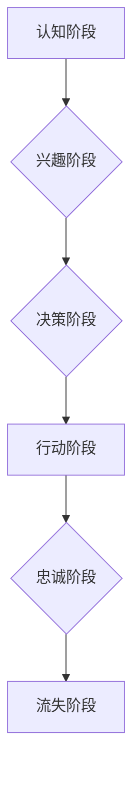

                 

## 建立忠实用户群体的方法

> 关键词：用户增长、用户留存、用户体验、社区建设、内容营销、数据分析、用户画像

### 1. 背景介绍

在当今数字化时代，拥有忠实的用户群体是任何成功的商业模式和技术产品的基石。用户群体不仅代表着产品的市场份额和收入来源，更重要的是，他们构成了产品的口碑传播和品牌建设的重要力量。然而，建立一个忠实的用户群体并非易事，需要企业和开发者付出持续的努力和投入，并不断优化用户体验、提供优质内容和服务，以及构建紧密的社区氛围。

### 2. 核心概念与联系

**2.1 用户生命周期**

用户生命周期 (User Lifecycle) 是指用户从首次接触产品到最终流失的整个过程，通常可以分为以下几个阶段：

* **认知阶段 (Awareness):** 用户首次了解到产品的存在。
* **兴趣阶段 (Interest):** 用户对产品产生兴趣，开始关注相关信息。
* **决策阶段 (Decision):** 用户评估产品是否满足其需求，并做出使用决策。
* **行动阶段 (Action):** 用户开始使用产品，体验其功能和价值。
* **忠诚阶段 (Loyalty):** 用户对产品感到满意，并持续使用，甚至推荐给其他人。
* **流失阶段 (Churn):** 用户停止使用产品，不再参与产品生态。

**2.2 用户留存率**

用户留存率 (User Retention Rate) 是衡量用户生命周期中用户持续使用产品的关键指标，通常指在特定时间段内，仍然活跃使用产品的用户比例。

**2.3 用户转化率**

用户转化率 (User Conversion Rate) 是衡量用户在不同生命周期阶段转换到下一个阶段的比例，例如，从兴趣阶段转化为决策阶段，从决策阶段转化为行动阶段等。

**2.4 用户价值**

用户价值 (User Value) 是指用户对产品或服务的贡献度，可以从多种角度衡量，例如，用户付费金额、用户参与度、用户口碑传播等。

**2.5 用户画像**

用户画像 (User Persona) 是对目标用户群体的深入分析和描述，包括用户 demographics、psychographics、行为特征等，帮助企业和开发者更好地理解用户需求和行为模式。

**2.6 Mermaid 流程图**



### 3. 核心算法原理 & 具体操作步骤

**3.1 算法原理概述**

建立忠实用户群体的核心算法并非单一的算法，而是基于用户生命周期、用户留存率、用户转化率、用户价值和用户画像等多方面因素的综合分析和优化策略。

**3.2 算法步骤详解**

1. **用户画像构建:** 通过数据分析和用户调研，构建详细的用户画像，了解目标用户的特征、需求和行为模式。
2. **用户生命周期分析:** 分析用户在不同生命周期阶段的行为数据，识别用户流失的痛点和潜在的转化机会。
3. **用户留存策略制定:** 根据用户生命周期分析结果，制定针对不同阶段用户的留存策略，例如，提供新手引导、个性化推荐、积分奖励等。
4. **用户转化策略优化:** 通过 A/B 测试和数据分析，优化用户转化路径，提高用户在不同阶段的转化率。
5. **用户价值最大化:** 通过用户行为分析和数据挖掘，识别高价值用户，并提供更优质的服务和体验，提升用户忠诚度和价值贡献。
6. **社区建设和内容营销:** 构建用户社区，鼓励用户互动和分享，并提供优质的内容和服务，增强用户粘性和品牌忠诚度。
7. **数据分析和持续优化:** 持续收集和分析用户数据，对策略进行调整和优化，不断提升用户体验和留存率。

**3.3 算法优缺点**

* **优点:** 能够有效地提高用户留存率、转化率和用户价值，构建忠实用户群体。
* **缺点:** 需要投入大量的时间和资源进行数据分析、策略制定和运营维护。

**3.4 算法应用领域**

* **电商平台:** 提高用户复购率、提升用户忠诚度。
* **社交媒体:** 增强用户粘性、提升用户活跃度。
* **游戏行业:** 提高用户留存率、提升游戏收入。
* **SaaS 产品:** 提高用户续订率、提升用户生命周期价值。

### 4. 数学模型和公式 & 详细讲解 & 举例说明

**4.1 数学模型构建**

用户留存率可以表示为：

$$
Retention Rate = \frac{Number of users retained at the end of a period}{Number of users at the beginning of the period}
$$

**4.2 公式推导过程**

用户留存率公式的推导过程很简单，就是将特定时间段内仍然活跃使用产品的用户数量除以该时间段开始时用户总数。

**4.3 案例分析与讲解**

假设一个电商平台在第一天有 1000 个用户，第二天仍然活跃使用产品的用户有 800 个，那么该平台的第二天留存率为：

$$
Retention Rate = \frac{800}{1000} = 0.8 = 80\%
$$

### 5. 项目实践：代码实例和详细解释说明

**5.1 开发环境搭建**

* 语言: Python
* 库: Pandas, NumPy, Matplotlib

**5.2 源代码详细实现**

```python
import pandas as pd

# 假设用户数据存储在 CSV 文件中
data = pd.read_csv("user_data.csv")

# 计算用户留存率
retention_rate = (data["day2_active"] / data["day1_active"]) * 100

# 打印结果
print(f"用户留存率: {retention_rate:.2f}%")

# 绘制用户留存曲线
plt.plot(data["day"], retention_rate)
plt.xlabel("日期")
plt.ylabel("留存率")
plt.title("用户留存曲线")
plt.show()
```

**5.3 代码解读与分析**

* 该代码首先读取用户数据，假设数据包含用户在第一天和第二天是否活跃的信息。
* 然后计算用户留存率，并将其打印出来。
* 最后，绘制用户留存曲线，直观地展示用户留存率的变化趋势。

**5.4 运行结果展示**

运行该代码后，会输出用户留存率的值，并生成一个用户留存曲线的图表。

### 6. 实际应用场景

**6.1 电商平台**

电商平台可以利用用户留存率数据，分析用户购买行为、产品偏好等，并针对不同用户群体制定个性化的营销策略，提高用户复购率和忠诚度。

**6.2 社交媒体**

社交媒体平台可以根据用户留存率数据，优化用户体验、内容推荐算法等，增强用户粘性和活跃度。

**6.3 游戏行业**

游戏行业可以利用用户留存率数据，分析用户游戏行为、游戏体验等，并针对不同游戏阶段的用户制定留存策略，提高用户活跃度和游戏收入。

**6.4 未来应用展望**

随着人工智能和机器学习技术的不断发展，用户留存率分析和优化将更加智能化和个性化。未来，我们可以期待看到更加精准的用户画像、更加有效的留存策略和更加个性化的用户体验。

### 7. 工具和资源推荐

**7.1 学习资源推荐**

* **书籍:** 《用户增长黑客》(Growth Hacking)
* **课程:** Coursera 上的《用户增长》(User Growth) 课程

**7.2 开发工具推荐**

* **数据分析工具:** Google Analytics, Mixpanel
* **用户画像工具:** UserZoom, Hotjar

**7.3 相关论文推荐**

* **《用户留存率预测模型研究》(User Retention Rate Prediction Model Research)**
* **《基于机器学习的用户留存分析》(User Retention Analysis Based on Machine Learning)**

### 8. 总结：未来发展趋势与挑战

**8.1 研究成果总结**

建立忠实用户群体的方法是一个复杂而多方面的课题，需要综合考虑用户生命周期、用户留存率、用户转化率、用户价值和用户画像等因素。通过数据分析、策略制定和运营维护，企业和开发者可以有效地提高用户留存率、转化率和用户价值，构建忠实用户群体。

**8.2 未来发展趋势**

未来，用户留存率分析和优化将更加智能化和个性化。人工智能和机器学习技术将被更加广泛地应用于用户画像构建、留存策略制定和用户体验优化等方面。

**8.3 面临的挑战**

* **数据隐私保护:** 用户数据隐私保护是一个重要的伦理问题，需要企业和开发者认真对待。
* **算法公平性:** 算法模型的公平性是一个重要的技术挑战，需要确保算法不会对特定用户群体产生歧视。
* **用户体验的持续优化:** 用户体验是一个不断变化的领域，需要企业和开发者持续关注用户需求，并不断优化产品和服务。

**8.4 研究展望**

未来，我们需要继续探索更加有效的用户留存率分析和优化方法，并解决数据隐私保护、算法公平性和用户体验持续优化等挑战。


### 9. 附录：常见问题与解答

**9.1 如何提高用户留存率？**

提高用户留存率的方法有很多，例如：

* 提供优质的产品和服务
* 构建紧密的社区氛围
* 提供个性化的用户体验
* 定期推出新的功能和内容
* 积极收集用户反馈，并进行改进

**9.2 如何构建用户画像？**

构建用户画像可以通过以下方式实现：

* 用户调研
* 数据分析
* 用户行为跟踪

**9.3 如何选择合适的留存策略？**

选择合适的留存策略需要根据用户的特点、产品的特点和业务目标等因素进行综合考虑。


作者：禅与计算机程序设计艺术 / Zen and the Art of Computer Programming 
<end_of_turn>

