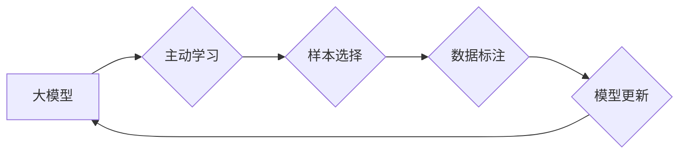

                 

## 推荐系统中的大模型主动学习与样本选择

> 关键词：推荐系统、大模型、主动学习、样本选择、数据效率、模型性能

## 1. 背景介绍

推荐系统作为信息过滤和个性化服务的重要组成部分，在电商、社交媒体、视频平台等领域发挥着越来越重要的作用。传统的推荐系统主要依赖于用户的历史行为数据，但这些数据往往存在稀疏性和冷启动问题，难以有效地捕捉用户的动态变化和潜在兴趣。

近年来，大模型的兴起为推荐系统带来了新的机遇。大模型凭借其强大的表示能力和泛化能力，能够从海量数据中学习更丰富的用户和物品特征，从而提升推荐系统的准确性和个性化程度。然而，大模型的训练需要大量的标注数据，而获取高质量标注数据的成本高昂且耗时。

主动学习 (Active Learning) 作为一种数据高效的机器学习策略，可以帮助推荐系统更智能地选择需要标注的数据，从而降低标注成本，提高模型性能。

## 2. 核心概念与联系

**2.1  推荐系统**

推荐系统旨在根据用户的历史行为、偏好和上下文信息，预测用户对特定物品的兴趣，并推荐用户可能感兴趣的物品。

**2.2  大模型**

大模型是指参数量巨大、训练数据量庞大的深度学习模型。大模型通常具有强大的表示能力和泛化能力，能够从海量数据中学习更丰富的特征，从而提升模型性能。

**2.3  主动学习**

主动学习是一种机器学习策略，旨在通过智能地选择需要标注的数据，来提高模型训练效率和准确性。主动学习算法通常包括以下步骤：

1. **模型训练:** 使用初始数据训练模型。
2. **数据选择:** 模型根据自身预测不确定性或其他策略选择需要标注的数据。
3. **数据标注:** 选择的数据由人工或其他方式标注。
4. **模型更新:** 使用标注数据更新模型。

**2.4  样本选择**

样本选择是主动学习的核心环节，其目标是选择最能帮助模型学习的数据。常用的样本选择策略包括：

* **不确定性采样:** 选择模型预测不确定性最大的数据。
* **多样性采样:** 选择能够丰富模型训练数据的样本。
* **边界采样:** 选择位于模型决策边界附近的样本。

**2.5  核心架构**



## 3. 核心算法原理 & 具体操作步骤

### 3.1  算法原理概述

大模型主动学习与样本选择结合，可以有效地提高推荐系统的效率和准确性。

大模型可以学习到更丰富的用户和物品特征，从而提高推荐的准确性。主动学习可以帮助模型更智能地选择需要标注的数据，从而降低标注成本，提高模型训练效率。

### 3.2  算法步骤详解

1. **初始化:** 使用初始数据训练一个大模型，并选择一个样本选择策略。
2. **数据选择:** 模型根据样本选择策略选择需要标注的数据。
3. **数据标注:** 选择的数据由人工或其他方式标注。
4. **模型更新:** 使用标注数据更新大模型。
5. **迭代:** 重复步骤2-4，直到模型性能达到预期目标。

### 3.3  算法优缺点

**优点:**

* **数据效率:** 通过智能地选择需要标注的数据，可以显著降低标注成本。
* **模型性能:** 可以提高模型的准确性和泛化能力。
* **可扩展性:** 可以应用于各种推荐场景，包括电商、社交媒体、视频平台等。

**缺点:**

* **算法复杂度:** 一些主动学习算法的复杂度较高，需要更多的计算资源。
* **标注成本:** 虽然可以降低标注成本，但仍然需要一定的标注工作。
* **样本选择策略:** 选择合适的样本选择策略对于算法效果至关重要。

### 3.4  算法应用领域

* **电商推荐:** 提高商品推荐的准确性和个性化程度。
* **社交媒体推荐:** 推荐用户可能感兴趣的内容和用户。
* **视频平台推荐:** 推荐用户可能喜欢的视频和频道。
* **新闻推荐:** 推荐用户可能感兴趣的新闻和资讯。

## 4. 数学模型和公式 & 详细讲解 & 举例说明

### 4.1  数学模型构建

假设我们有一个推荐系统，包含用户集合 $U$，物品集合 $I$，以及用户对物品的评分矩阵 $R$。我们的目标是预测用户 $u$ 对物品 $i$ 的评分 $r_{ui}$。

我们可以使用一个基于大模型的推荐模型来实现这个目标。例如，我们可以使用一个 Transformer 模型来学习用户和物品的表示，并预测用户对物品的评分。

### 4.2  公式推导过程

Transformer 模型的输出可以表示为：

$$
\hat{r}_{ui} = f(h_u, h_i)
$$

其中，$h_u$ 和 $h_i$ 分别是用户 $u$ 和物品 $i$ 的表示，$f$ 是一个评分预测函数。

我们可以使用交叉熵损失函数来训练这个模型：

$$
L = -\sum_{u \in U, i \in I} r_{ui} \log(\hat{r}_{ui}) + (1 - r_{ui}) \log(1 - \hat{r}_{ui})
$$

### 4.3  案例分析与讲解

假设我们有一个电商平台，用户 $u$ 对商品 $i$ 的评分 $r_{ui}$ 为 5，表示用户非常喜欢这个商品。

我们可以使用 Transformer 模型来学习用户 $u$ 和商品 $i$ 的表示，并预测用户对商品 $i$ 的评分 $\hat{r}_{ui}$。

如果模型训练成功，则 $\hat{r}_{ui}$ 应该接近 5。

## 5. 项目实践：代码实例和详细解释说明

### 5.1  开发环境搭建

* Python 3.7+
* PyTorch 1.7+
* Transformers 4.0+

### 5.2  源代码详细实现

```python
import torch
from transformers import AutoModelForSequenceClassification, AutoTokenizer

# 加载预训练模型和词典
model_name = "bert-base-uncased"
tokenizer = AutoTokenizer.from_pretrained(model_name)
model = AutoModelForSequenceClassification.from_pretrained(model_name)

# 定义数据加载器
def load_data(data_path):
    # ...

# 定义训练函数
def train(model, data_loader, optimizer, loss_fn, epochs):
    # ...

# 定义评估函数
def evaluate(model, data_loader, loss_fn):
    # ...

# 主程序
if __name__ == "__main__":
    # 加载数据
    data_loader = load_data("data.csv")

    # 定义优化器和损失函数
    optimizer = torch.optim.Adam(model.parameters(), lr=1e-5)
    loss_fn = torch.nn.CrossEntropyLoss()

    # 训练模型
    train(model, data_loader, optimizer, loss_fn, epochs=10)

    # 评估模型
    evaluate(model, data_loader, loss_fn)
```

### 5.3  代码解读与分析

* 代码首先加载预训练的 BERT 模型和词典。
* 然后定义了数据加载器、训练函数和评估函数。
* 主程序中，首先加载数据，然后定义优化器和损失函数。
* 最后，调用训练函数和评估函数进行模型训练和评估。

### 5.4  运行结果展示

* 模型训练完成后，可以输出模型的准确率、召回率等指标。
* 也可以使用模型对新的数据进行预测，并展示预测结果。

## 6. 实际应用场景

### 6.1  电商推荐

* 利用大模型学习用户和商品的特征，并结合主动学习策略选择需要标注的数据，可以提高电商平台的商品推荐准确性和个性化程度。

### 6.2  社交媒体推荐

* 大模型可以学习用户在社交媒体上的行为和兴趣，结合主动学习策略选择需要标注的数据，可以推荐用户可能感兴趣的内容和用户。

### 6.3  视频平台推荐

* 大模型可以学习用户观看视频的历史和偏好，结合主动学习策略选择需要标注的数据，可以推荐用户可能喜欢的视频和频道。

### 6.4  未来应用展望

* 大模型主动学习与样本选择在推荐系统领域的应用前景广阔，未来可以应用于更多场景，例如新闻推荐、音乐推荐、游戏推荐等。
* 随着大模型技术的不断发展，我们可以期待看到更智能、更精准的推荐系统。

## 7. 工具和资源推荐

### 7.1  学习资源推荐

* **书籍:**
    * Deep Learning by Ian Goodfellow, Yoshua Bengio, and Aaron Courville
    * Hands-On Machine Learning with Scikit-Learn, Keras & TensorFlow by Aurélien Géron
* **课程:**
    * Stanford CS224N: Natural Language Processing with Deep Learning
    * DeepLearning.AI TensorFlow Specialization

### 7.2  开发工具推荐

* **Python:** 
    * PyTorch
    * TensorFlow
* **Transformers:** 
    * Hugging Face Transformers

### 7.3  相关论文推荐

* Active Learning for Recommender Systems: A Survey
* Deep Active Learning for Recommender Systems
* Self-Training with Noisy Student Improves Neural Machine Translation

## 8. 总结：未来发展趋势与挑战

### 8.1  研究成果总结

大模型主动学习与样本选择在推荐系统领域取得了显著的成果，可以有效地提高推荐系统的效率和准确性。

### 8.2  未来发展趋势

* **模型架构创新:** 研究更适合主动学习的推荐模型架构，例如基于图神经网络的模型、基于强化学习的模型等。
* **样本选择策略优化:** 研究更有效的样本选择策略，例如基于模型不确定性的策略、基于数据多样性的策略等。
* **多模态推荐:** 将大模型主动学习与样本选择应用于多模态推荐场景，例如文本、图像、视频等多模态数据的融合。

### 8.3  面临的挑战

* **数据标注成本:** 尽管主动学习可以降低标注成本，但仍然需要一定的标注工作，如何进一步降低标注成本是未来研究的一个重要方向。
* **算法复杂度:** 一些主动学习算法的复杂度较高，需要更多的计算资源，如何设计更有效的算法，降低计算复杂度也是一个挑战。
* **模型解释性:** 大模型的决策过程往往难以解释，如何提高模型的解释性，帮助用户理解推荐结果也是一个重要的研究方向。

### 8.4  研究展望

未来，大模型主动学习与样本选择将在推荐系统领域发挥越来越重要的作用，并推动推荐系统的智能化、个性化和数据效率的提升。


## 9. 附录：常见问题与解答

* **Q1: 什么是主动学习？**

A1: 主动学习是一种机器学习策略，旨在通过智能地选择需要标注的数据，来提高模型训练效率和准确性。

* **Q2: 大模型主动学习与样本选择有什么优势？**

A2: 大模型主动学习与样本选择可以有效地提高推荐系统的效率和准确性，降低标注成本，并提升模型的泛化能力。

* **Q3: 如何选择合适的样本选择策略？**

A3: 选择合适的样本选择策略取决于具体的推荐场景和模型架构。常用的样本选择策略包括不确定性采样、多样性采样和边界采样等。

* **Q4: 大模型主动学习与样本选择有哪些挑战？**

A4: 大模型主动学习与样本选择面临的挑战包括数据标注成本、算法复杂度和模型解释性等。

* **Q5: 未来大模型主动学习与样本选择的发展趋势是什么？**

A5: 未来大模型主动学习与样本选择将朝着模型架构创新、样本选择策略优化和多模态推荐等方向发展。


作者：禅与计算机程序设计艺术 / Zen and the Art of Computer Programming 
<end_of_turn>

