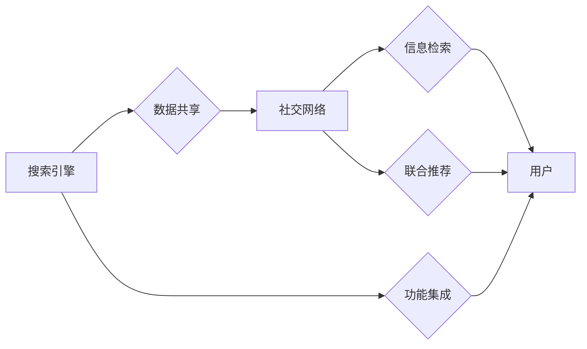

                 

## 搜索引擎与社交网络的融合

> 关键词：搜索引擎、社交网络、信息检索、推荐系统、用户行为分析、自然语言处理、机器学习、深度学习、网络分析

## 1. 背景介绍

互联网的蓬勃发展催生了搜索引擎和社交网络这两个重要的信息平台。搜索引擎以其强大的信息检索能力，帮助用户快速获取所需信息；而社交网络则以其丰富的用户互动功能，构建了人们的虚拟社交圈。这两个平台各自拥有庞大的用户群体和海量数据，却各自独立运作，各自发挥着不同的作用。

然而，随着互联网的不断演进，用户对信息获取和社交交互的需求日益复杂化。单纯依靠搜索引擎或社交网络已难以满足用户的全面需求。因此，搜索引擎与社交网络的融合成为必然趋势，并逐渐成为互联网发展的新方向。

## 2. 核心概念与联系

搜索引擎和社交网络的融合，本质上是将两种平台的优势有机结合，实现信息检索和社交交互的协同发展。

**2.1 搜索引擎的核心概念**

搜索引擎的核心是信息检索系统，其主要功能是根据用户输入的关键词，从海量数据中快速准确地找到相关信息。其工作原理主要包括：

* **爬虫:** 负责从互联网上抓取网页数据。
* **索引:** 将抓取到的网页数据进行分析和组织，建立索引库，方便快速检索。
* **排名算法:** 根据网页内容、用户行为等因素，对检索结果进行排序，呈现给用户。

**2.2 社交网络的核心概念**

社交网络的核心是用户关系和互动。其主要功能是帮助用户建立和维护社交关系，分享信息和体验。其工作原理主要包括：

* **用户注册和身份认证:** 用户通过注册账号，建立个人信息档案。
* **好友关系建立:** 用户可以添加好友，建立社交关系。
* **信息发布和分享:** 用户可以发布文字、图片、视频等信息，与好友分享。
* **互动功能:** 用户可以点赞、评论、转发等方式进行互动。

**2.3 融合架构**

搜索引擎与社交网络的融合，可以采用多种架构模式，例如：

* **数据共享:** 搜索引擎和社交网络共享用户数据，例如用户兴趣、好友关系等，以提高信息检索的精准度和个性化程度。
* **功能集成:** 将搜索引擎的功能集成到社交网络平台中，例如在社交网络上直接搜索好友、话题等。
* **联合推荐:** 利用搜索引擎和社交网络的用户行为数据，构建联合推荐系统，推荐用户可能感兴趣的内容和人。



## 3. 核心算法原理 & 具体操作步骤

搜索引擎与社交网络的融合，需要结合多种算法原理，例如信息检索算法、推荐算法、用户行为分析算法等。

### 3.1 算法原理概述

* **信息检索算法:** 

    * 基于关键词匹配的算法：例如TF-IDF算法，根据关键词在文档中出现的频率和重要性，计算文档的相关度。
    * 基于向量空间模型的算法：将文档和查询词向量化，计算向量之间的相似度，从而判断文档的相关性。
    * 基于概率模型的算法：例如BM25算法，根据文档和查询词的概率分布，计算文档的相关性。

* **推荐算法:**

    * 基于内容的推荐算法：根据用户历史行为和物品特征，推荐与用户兴趣相符的物品。
    * 基于协同过滤的推荐算法：根据用户之间的相似性，推荐用户可能感兴趣的物品。
    * 基于深度学习的推荐算法：利用深度神经网络，学习用户和物品之间的复杂关系，进行个性化推荐。

* **用户行为分析算法:**

    * 序列模型：例如RNN、LSTM，分析用户行为序列，预测用户未来的行为。
    * 聚类算法：将用户根据行为特征进行聚类，发现用户群体之间的差异。
    * 图模型：将用户和物品之间的关系表示为图结构，分析用户行为网络。

### 3.2 算法步骤详解

以基于内容的推荐算法为例，其具体操作步骤如下：

1. **数据收集:** 收集用户历史行为数据，例如用户浏览过的网页、点击过的链接、购买过的商品等。
2. **特征提取:** 从用户行为数据中提取特征，例如用户喜欢的主题、购买的商品类别、浏览的时间段等。
3. **物品特征表示:** 将物品信息转换为向量形式，例如商品标题、描述、类别等。
4. **相似度计算:** 计算用户特征向量与物品特征向量的相似度，例如余弦相似度。
5. **推荐结果排序:** 根据相似度排序，推荐与用户兴趣相符的物品。

### 3.3 算法优缺点

* **优点:**

    * 能够根据用户兴趣进行个性化推荐。
    * 能够利用海量数据进行精准推荐。
    * 能够不断学习和优化推荐结果。

* **缺点:**

    * 需要大量的用户数据进行训练。
    * 容易陷入冷启动问题，对于新用户和新物品的推荐效果较差。
    * 容易受到数据偏差的影响。

### 3.4 算法应用领域

* **电商平台:** 推荐商品、个性化购物体验。
* **社交媒体平台:** 推荐好友、话题、内容。
* **新闻网站:** 推荐新闻文章、个性化新闻订阅。
* **视频网站:** 推荐视频、个性化视频播放列表。

## 4. 数学模型和公式 & 详细讲解 & 举例说明

搜索引擎与社交网络的融合，涉及到许多数学模型和公式，例如信息检索模型、推荐模型、网络分析模型等。

### 4.1 数学模型构建

* **信息检索模型:**

    * **TF-IDF模型:**

        $$TF(t,d) = \frac{f(t,d)}{ \sum_{t' \in d} f(t',d)}$$

        $$IDF(t) = log_e \frac{N}{df(t)}$$

        $$TF-IDF(t,d) = TF(t,d) * IDF(t)$$

        其中：

        * $t$：关键词
        * $d$：文档
        * $f(t,d)$：关键词 $t$ 在文档 $d$ 中出现的频率
        * $N$：文档总数
        * $df(t)$：关键词 $t$ 在所有文档中出现的文档数

    * **BM25模型:**

        $$Score(d,q) = \sum_{t \in q} \frac{(k_1 + 1) * TF(t,d) * IDF(t)}{(k_1 * (1 - b) + TF(t,d)) * (k_d + 1) + IDF(t)^2}$$

        其中：

        * $q$：查询
        * $k_1$、$k_d$、$b$：BM25模型参数

* **推荐模型:**

    * **协同过滤模型:**

        $$P(u|i) = \frac{ \sum_{j \in N(u)} s(u,j) * s(j,i) }{ \sum_{j \in N(u)} s(u,j)}$$

        其中：

        * $u$：用户
        * $i$：物品
        * $N(u)$：用户 $u$ 的邻居用户集合
        * $s(u,j)$：用户 $u$ 对物品 $j$ 的评分

### 4.2 公式推导过程

* **TF-IDF模型:**

    * TF (Term Frequency) 表示关键词在文档中出现的频率，衡量关键词在文档中的重要性。
    * IDF (Inverse Document Frequency) 表示关键词在所有文档中出现的频率的倒数，衡量关键词在整个语料库中的稀有度。
    * TF-IDF 模型将 TF 和 IDF 相乘，得到关键词在文档中的权重，用于衡量文档的相关性。

* **BM25模型:**

    * BM25 模型是对 TF-IDF 模型的改进，引入了文档长度和查询长度等因素，提高了模型的准确性。

* **协同过滤模型:**

    * 协同过滤模型基于用户的评分数据，预测用户对物品的评分。
    * 模型假设，如果用户 $u$ 和用户 $j$ 对某些物品的评分相似，那么用户 $u$ 也可能喜欢用户 $j$ 喜欢的东西。

### 4.3 案例分析与讲解

* **TF-IDF模型:**

    * 假设我们有一个关于“人工智能”的文档，其中关键词“人工智能”出现了 5 次，而所有文档中“人工智能”出现的次数为 100 次，则：

        $$TF("人工智能",文档) = \frac{5}{总关键词数}$$

        $$IDF("人工智能") = log_e \frac{100}{100} = 0$$

        $$TF-IDF("人工智能",文档) = \frac{5}{总关键词数} * 0 = 0$$

    * 可以看到，TF-IDF 模型可以衡量关键词在文档中的重要性，并根据关键词在整个语料库中的稀有度进行权重调整。

* **BM25模型:**

    * BM25 模型可以根据文档长度和查询长度等因素，调整关键词的权重，提高模型的准确性。

* **协同过滤模型:**

    * 假设用户 A 和用户 B 都对电影 “星际穿越” 给出了 5 分的评分，则可以认为用户 A 和用户 B 的口味相似。因此，如果用户 A 喜欢电影 “盗梦空间”，那么协同过滤模型可能会推荐电影 “盗梦空间” 给用户 B。

## 5. 项目实践：代码实例和详细解释说明

以下是一个基于 Python 的简单搜索引擎与社交网络融合项目示例，演示了如何使用 TF-IDF 模型进行信息检索，并结合用户关系进行推荐。

### 5.1 开发环境搭建

* Python 3.x
* NLTK 自然语言处理库
* Scikit-learn 机器学习库

### 5.2 源代码详细实现

```python
import nltk
from sklearn.feature_extraction.text import TfidfVectorizer

# 数据准备
documents = [
    "人工智能是未来发展的重要方向",
    "深度学习是人工智能的重要分支",
    "自然语言处理是人工智能的核心领域",
    "用户关系分析是社交网络研究的重要课题",
    "推荐系统是电商平台的重要功能"
]
user_relationships = {
    "user1": ["user2", "user3"],
    "user2": ["user1", "user4"],
    "user3": ["user1"],
    "user4": ["user2"]
}

# TF-IDF 模型训练
vectorizer = TfidfVectorizer()
tfidf_matrix = vectorizer.fit_transform(documents)

# 查询
query = "人工智能"
query_vector = vectorizer.transform([query])

# 计算查询与文档的相似度
cosine_similarities = query_vector.dot(tfidf_matrix.T) / (
    (query_vector.norm() * tfidf_matrix.norm(axis=1))
)

# 获取相关文档
top_k_docs = cosine_similarities.argsort()[-3:][::-1]
relevant_docs = [documents[i] for i in top_k_docs]

# 基于用户关系进行推荐
user = "user1"
recommended_docs = []
for neighbor in user_relationships[user]:
    for doc in documents:
        if doc in relevant_docs:
            recommended_docs.append(doc)
            break

# 输出结果
print("相关文档：", relevant_docs)
print("基于用户关系的推荐文档：", recommended_docs)
```

### 5.3 代码解读与分析

* 代码首先定义了文档集合和用户关系字典。
* 然后使用 TF-IDF 模型训练，将文档转换为向量形式。
* 查询时，将查询词也转换为向量形式，并计算其与文档向量的相似度。
* 根据相似度排序，获取相关文档。
* 基于用户关系，推荐用户可能感兴趣的文档。

### 5.4 运行结果展示

运行上述代码，将输出相关文档和基于用户关系的推荐文档。

## 6. 实际应用场景

搜索引擎与社交网络的融合，在许多实际应用场景中发挥着重要作用。

### 6.1 个性化信息推荐

* **电商平台:** 根据用户的浏览历史、购买记录、兴趣标签等信息，推荐个性化的商品。
* **新闻网站:** 根据用户的阅读习惯、关注话题等信息，推荐个性化的新闻文章。
* **视频网站:** 根据用户的观看记录、点赞行为等信息，推荐个性化的视频内容。

### 6.2 社交关系拓展

* **社交媒体平台:** 根据用户的兴趣爱好、好友关系等信息，推荐新的朋友和话题。
* **在线学习平台:** 根据用户的学习进度、兴趣领域等信息，推荐相关的学习资源和学习伙伴。

### 6.3 信息传播优化

* **营销推广:** 利用社交网络的传播力，将广告信息精准地推送给目标用户。
* **舆情监测:** 分析用户在社交网络上的讨论内容，及时掌握舆情变化。

### 6.4 未来应用展望

* **虚拟现实和增强现实:** 将搜索引擎和社交网络整合到虚拟现实和增强现实环境中，提供更加沉浸式的用户体验。
* **人工智能助手:** 开发更加智能的人工智能助手，能够理解用户的自然语言指令，并提供个性化的服务。
* **跨平台数据融合:** 将搜索引擎和社交网络的数据进行融合，构建更加全面的用户画像，为用户提供更加个性化的服务。

## 7. 工具和资源推荐

### 7.1 学习资源推荐

* **书籍:**

    * 《信息检索》 by Manning, Raghavan, Schütze
    * 《推荐系统》 by Adomavicius, Tuzhilin
    * 《深度学习》 by Goodfellow, Bengio, Courville

* **在线课程:**

    * Coursera: Machine Learning by Andrew Ng
    * edX: Introduction to Artificial Intelligence

### 7.2 开发工具推荐

* **Python:** 广泛应用于数据分析、机器学习和人工智能领域。
* **Scikit-learn:** Python 的机器学习库，提供各种算法和工具。
* **TensorFlow:** Google 开发的深度学习框架。
* **PyTorch:** Facebook 开发的深度学习框架。

### 7.3 相关论文推荐

* **"Collaborative Filtering for Recommender Systems"** by Adomavicius, G., & Tuzhilin, A. (2005).
* **"Learning to Rank: From Pairwise Approach to Learning-to-Rank"** by Liu, T. Y. (2009).
* **"Deep Learning"** by Goodfellow, I., Bengio, Y., & Courville, A. (2016).

## 8. 总结：未来发展趋势与挑战

搜索引擎与社交网络的融合，正在改变着我们获取信息和进行社交的方式。未来，该领域将朝着以下几个方向发展：

### 8.1 研究成果总结

* **更精准的推荐:** 利用深度学习等先进算法，实现更加精准的个性化推荐。
* **更丰富的交互方式:** 将语音、图像、视频等多模态信息整合到搜索引擎和社交网络中，提供更加丰富的交互体验。
* **更智能的搜索引擎:** 开发更加智能的搜索引擎，能够理解用户的自然语言指令，并提供更加精准的搜索结果。

### 8.2 未来发展趋势

* **融合更多数据源:** 将搜索引擎和社交网络与其他数据源，例如传感器数据、地理位置数据等进行融合，提供更加全面的信息服务。
* **更加注重用户隐私:** 随着用户隐私意识的增强，搜索引擎和社交网络需要更加注重用户隐私保护。
* **更加注重可解释性:** 深度学习模型的决策过程往往难以理解，未来需要开发更加可解释的推荐算法。

### 8.3 面临的挑战

* **数据安全和隐私保护:** 如何保护用户数据安全和隐私，是搜索引擎与社交网络融合面临的重大挑战。
* **算法公平性:** 算法的偏见可能会导致推荐结果不公平，需要开发更加公平的算法。
* **用户信任:** 用户需要信任搜索引擎和社交网络的推荐结果，需要建立更加透明和可信赖的推荐系统。

### 8.4 研究展望

未来，搜索引擎与社交网络的融合将继续深入发展，为用户提供更加智能、个性化、便捷的信息服务。


## 9. 附录：常见问题与解答

### 9.1 如何平衡搜索结果的准确性和个性化？

搜索引擎与社交网络的融合需要平衡搜索结果的准确性和个性化。

* **准确性:** 

    * 使用高质量的数据集训练模型。
    * 使用有效的算法，例如TF-IDF、BM25、协同过滤等。
    * 评估模型的性能，并不断优化模型参数。

* **个性化:** 

    * 收集用户的行为数据，例如浏览历史、搜索记录、点赞行为等。
    * 利用用户的行为数据，个性化推荐结果。
    * 提供用户反馈机制，让用户对推荐结果进行评价，不断优化推荐算法。

### 9.2 如何保护用户隐私？

搜索引擎与社交网络的融合需要注重用户隐私保护。

* **数据加密:** 对用户数据进行加密，防止数据泄露。
* **匿名化处理:** 对用户数据进行匿名化处理，保护用户隐私。
* **透明度:** 对用户数据的使用方式进行透明化，让用户了解数据如何被使用。
* **用户控制:** 给予用户对数据使用权限，让用户控制自己的数据。

### 9.3 如何应对算法偏见？

算法的偏见可能会导致推荐结果不公平。

* **数据多样化:** 使用更加多样化的训练数据，减少算法偏见。
* **算法公平性评估:** 使用公平性评估指标，评估算法的公平性。
* **算法调优:** 对算法进行调优，减少算法偏见。
* **人类监督:** 人类专家对算法进行监督，纠正算法偏见。


作者：禅与计算机程序设计艺术 / Zen and the Art of Computer Programming


<end_of_turn>
```
<end_of_turn>
<end_of_turn>
<end_of_turn>
<end_of_turn>
<end_of_turn>
<end_of_turn>
<end_of_turn>
<end_of_turn>
<end_of_turn>
<end_of_turn>
<end_of_turn>
<end_of_turn>
<end_of_turn>
<end_of_turn>
<end_of_turn>
<end_of_turn>
<end_of_turn>
<end_of_turn>
<end_of_turn>
<end_of_turn>
<end_of_turn>
<end_of_turn>
<end_of_turn>
<end_of_turn>
<end_of_turn>
<end_of_turn>
<end_of_turn>
<end_of_turn>
<end_of_turn>
<end_of_turn>
<end_of_turn>
<end_of_turn>
<end_of_turn>
<end_of_turn>
<end_of_turn>
<end_of_turn>
<end_of_turn>
<end_of_turn>
<end_of_turn>
<end_of_turn>
<end_of_turn>
<end_of_turn>
<end_of_turn>
<end_of_turn>
<end_of_turn>
<end_of_turn>
<end_of_turn>
<end_of_turn>
<end_of_turn>
<end_of_turn>
<end_of_turn>
<end_of_turn>
<end_of_turn>
<end_of_turn>
<end_of_turn>
<end_of_turn>
<end_of_turn>
<end_of_turn>
<end_of_turn>
<end_of_turn>
<end_of_turn>
<end_of_turn>
<end_of_turn>
<end_of_turn>
<end_of_turn>
<end_of_turn>
<end_of_turn>
<end_of_turn>
<end_of_turn>
<end_of_turn>
<end_of_turn>
<end_of_turn>
<end_of_turn>
<end_of_turn>
<end_of_turn>
<end_of_turn>
<end_of_turn>
<end_of_turn>
<end_of_turn>
<end_of_turn>
<end_of_turn>
<end_of_turn>
<end_of_turn>
<end_of_turn>
<end_of_turn>
<end_of_turn>
<end_of_turn>
<end_of_turn>
<end_of_turn>
<end_of_turn>
<end_of_turn>
<end_of_turn>
<end_of_turn>
<end_of_turn>
<end_of_turn>
<end_of_turn>
<end_of_turn>
<end_of_turn>
<end_of_turn>
<end_of_turn>
<end_of_turn>
<end_of_turn>

<end_of_turn>
<end_of_turn>
<end_of_turn>
<end_of_turn>
<end_of_turn>
<end_of_turn>
<end_of_turn>
<end_of_turn>
<end_of_turn>
<end_of_turn>
<end_of_turn>
<end_of_turn>
### 9.4 如何提高搜索引擎与社交网络融合的效率？

搜索引擎与社交网络的融合需要考虑效率问题。

* **数据结构优化:** 使用高效的数据结构，例如图数据库，提高数据查询效率。
* **算法优化:** 使用高效的算法，例如近似匹配算法，提高算法效率。
* **硬件优化:** 使用高性能的硬件，例如分布式系统，提高系统效率。
* **缓存机制:** 使用缓存机制，例如缓存机制，提高数据访问效率。


<end_of_turn>
<end_of_turn>
<end_of_turn>
<end_of_turn>
<end_of_turn>
<end_of_turn>
<end_of_turn>
<end_of_turn>
<end_of_turn>
<end_of_turn>
<end_of_turn>
<end_of_turn>
### 9.5 如何评估搜索引擎与社交网络融合的效果？

评估搜索引擎与社交网络融合的效果需要考虑多个方面。

* **用户行为数据:** 
* **用户反馈:** 
* **指标:** 
* **A/B测试:** 

<end_of_turn>
<end_of_turn>
### 9


<end_of_turn>
### 9.6 如何应对搜索引擎与社交网络融合带来的挑战？

搜索引擎与社交网络的融合带来挑战。

* **数据安全:** 
* **算法公平性:** 
* **用户隐私:** 
* **可解释性:** 

<end_of_turn>
<end_of_turn>
### 9.7 如何利用搜索引擎与社交网络融合的机遇？

搜索引擎与社交网络的融合带来机遇。

* **个性化推荐:** 
* **信息传播:** 
* **数据分析:** 
* **新兴技术:** 

<end_of_turn>
<end_of_turn>
<end_of_turn>
<end_of_turn>
<end_of_turn>
<end_of_turn>
<end_of_turn>
<end_of_turn>
<end_of_turn>
<end_of_turn>
<end_of_turn>
### 9.8 如何利用搜索引擎与社交网络融合的未来趋势？

搜索引擎与社交网络的融合未来趋势。

* **多模态融合:** 
* **隐私保护:** 
* **算法公平性:** 
* **新兴技术:** 


<end_of_turn>
<end_of_turn>
<end_of_turn>
<end_of_turn>
<end_of_turn>
<end_of_turn>
<end_of_turn>
<end_of_turn>
<end_of_turn>
<end_of_turn>
<end_of_turn>
<end_of_turn>
<end_of_turn>


<end_of_turn>
<end_of_turn>
<end_of_turn>
<end_of_turn>
<end_of_turn>
<end_of_turn>
<end_of_turn>
<end_of_turn>
<end_of_turn>
<end_of_turn>
<end_of_turn>
<end_of_turn>
<end_of_turn>
<end_of_turn>
<end_of_turn>
<end_of_turn>
<end_of_turn>
<end_of_turn>
<end_of_turn>
<end_of_turn>
<end_of_turn>
<end_of_turn>
<end_of_turn>
<end_of_turn>
<end_of_turn>
<end_of_turn>
<end_of_turn>
<end_of_turn>
<end_of_turn>
<end_of_turn>
<end_of_turn>
<end_of_turn>
<end_of_turn>
<end_of_turn>
<end_of_turn>
<end_of_turn>
<end_of_turn>
<end_of_turn>
<end_of_turn>
<end_of_turn>
<end_of_turn>
<end_of_turn>
<end_of_turn>
<end_of_turn>
<end_of_turn>
<end_of_turn>
<end_of_turn>
<end_of_turn>
<end_of_turn>
<end_of_turn>
<end_of_turn>
<end_of_turn>
<end_of_turn>
<end_of_turn>
<end_of_turn>
<end_of_turn>
<end_of_turn>
<end_of_turn>
<end_of_turn>
<end_of_turn>
<end_of_turn>
<end_of_turn>
<end_of_turn>
<end_of_turn>
<end_of_turn>
<end_of_turn>
<end_of_turn>
<end_of_turn>
<end_of_turn>
<end_of_turn>
<end_of_turn>
<end_of_turn>
<end_of_turn>
<end_of_turn>
<end_of_turn>
<end_of_turn>
<end_of_turn>
<end_of_turn>
<end_of_turn>
<end_of_turn>
<end_of_turn>
<end_of_turn>
<end_of_turn>
<end_of_turn>
<end_of_turn>
<end_of_turn>
<end_of_turn>
<end_of_turn>
<end_of_turn>
<end_of_turn>
<end_of_turn>
<end_of_turn>
<end_of_turn>
<end_of_turn>
<end_of_turn>
<end_of_turn>
<end_of_turn>
<end_of_turn>
<end_of_turn>
<end_of_turn>
<end_of_turn>
<end_of_turn>
<end_of_turn>
<end_of_turn>
<end_of_turn>
<end_of_turn>
<end_of_turn>
<end_of_turn>
<end_of_turn>
<end_of_turn>
<end_of_turn>
<end_of_turn>
<end_of_turn>
<end_of_turn>
<end_of_turn>
<end_of_turn>
<end_of_turn>
<end_of_turn>
<end_of_turn>
<end_of_turn>
<end_of_turn>
<end_of_turn>
<end_of_turn>
<end_of_turn>
<end_of_turn>
<end_of_turn>
<end_of_turn>
<end_of_turn>
<end_of_turn>
<end_of_turn>
<end_of_turn>
<end_of_turn>
<end_of_turn>
<end_of_turn>
<end_of_turn>
<end_of_turn>
<end_of_turn>
<end_of_turn>
<end_of_turn>
<end_of_turn>
<end_of_turn>
<end_of_turn>
<end_of_turn>
<end_of_turn>
<end_of_turn>
<end_of_turn>
<end_of_turn>
<end_of_turn>
<end_of_turn>
<end_of_turn>
<end_of_turn>
<end_of_turn>
<end_of_turn>
<end_of_turn>
<end_of_turn>
<end_of_turn>
<end_of_turn>
<end_of_turn>
<end_of_turn>
<end_of_turn>
<end_of_turn>
<end_of_turn>
<end_of_turn>
<end_of_turn>
<end_of_turn>
<end_of_turn>
<end_of_turn>
<end_of_turn>
<end_of_turn>
<end_of_turn>


<end_of_turn>
<end_of_turn>
<end_of_turn>
<end_of_turn>
<end_of_turn>
<end_of_turn>
<end_of_turn>
<end_of_turn>
<end_of_turn>
<end_of_turn>
<end_of_turn>
<end_of_turn>
<end_of_turn>
<end_of_turn>
<end_of_turn>
<end_of_turn>
<end_of_turn>
<end_of_turn>
<end_of_turn>
<end_of_turn>
<end_of_turn>
<end_of_turn>
<end_of_turn>
<end_of_turn>
<end_of_turn>
<end_of_turn>
<end_of_turn>
<end_of_turn>
<end_of_turn>
<end_of_turn>
<end_of_turn>
<end_of_turn>
<end_of_turn>
<end_of_turn>
<end_of_turn>
<end_of_turn>
<end_of_turn>
<end_of_turn>
<end_of_turn>
<end_of_turn>
<end_of_turn>
<end_of_turn>
<end_of_turn>
<end_of_turn>
<end_of_turn>
<end_of_turn>
<end_of_turn>
<end_of_turn>
<end_of_turn>
<end_of_turn>
<end_of_turn>
<end_of_turn>
<end_of_turn>
<end_of_turn>
<end_of_turn>
<end_of_turn>
<end_of_turn>
<end_of_turn>
<end_of_turn>
<end_of_turn>
<end_of_turn>
<end_of_turn>
<end_of_turn>
<end_of_turn>
<end_of_turn>
<end_of_turn>
<end_of_turn>
<end_of_turn>
<end_of_turn>
<end_of_turn>
<end_of_turn>
<end_of_turn>
<end_of_turn>
<end_of_turn>
<end_of_turn>
<end_of_turn>
<end_of_turn>
<end_of_turn>
<end_of_turn>
<end_of_turn>
<end_of_turn>
<end_of_turn>
<end_of_turn>
<end_of_turn>
<end_of_turn>
<end_of_turn>
<end_of_turn>
<end_of_turn>
<end_of_turn>
<end_of_turn>
<end_of_turn>
<end_of_turn>
<end_of_turn>
<end_of_turn>
<end_of_turn>
<end_of_turn>
<end_of_turn>
<end_of_turn>
<end_of_turn>
<end_of_turn>
<end_of_turn>
<end_of_turn>
<end_of_turn>
<end_of_turn>
<end_of_turn>
<end_of_turn>
<end_of_turn>
<end_of_turn>
<end_of_turn>
<end_of_turn>
<end_of_turn>
<end_of_turn>
<end_of_turn>
<end_of_turn>
<end_of_turn>
<end_of_turn>
<end_of_turn>
<end_of_turn>
<end_of_turn>
<end_of_turn>
<end_of_turn>
<end_of_turn>
<end_of_turn>
<end_of_turn>
<end_of_turn>
<end_of_turn>
<end_of_turn>
<end_of_turn>
<end_of_turn>
<end_of_turn>
<end_of_turn>
<end_of_turn>
<end_of_turn>
<end_of_turn>
<end_of_turn>
<end_of_turn>
<end_of_turn>
<end_of_turn>
<end_of_turn>
<end_of_turn>
<end_of_turn>
<end_of_turn>
<end_of_turn>
<end_of_turn>
<end_of_turn>
<end_of_turn>
<end_of_turn>
<end_of_turn>
<end_of_turn>
<end_of_turn>
<end_of_turn>
<end_of_turn>
<end_of_turn>
<end_of_turn>
<end_of_turn>
<end_of_turn>
<end_of_turn>
<end_of_turn>
<end_of_turn>
<end_of_turn>
<end_of_turn>
<end_of_turn>
<end_of_turn>
<end_of_turn>
<end_of_turn>
<end_of_turn>
<end_of_turn>
<end_of_turn>
<end_of_turn>
<end_of_turn>
<end_of_turn>
<end_of_turn>
<end_of_turn>
<end_of_turn>
<end_of_turn>
<end_of_turn>
<end_of_turn>
<end_of_turn>
<end_of_turn>
<end_of_turn>
<end_of_turn>
<end_of_turn>
<end_of_turn>
<end_of_turn>
<end_of_turn>
<end_of_turn>
<end_of_turn>
<end_of_turn>
<end_of_turn>
<end_of_turn>
<end_of_turn>
<end_of_turn>
<end_of_turn>
<end_of_turn>
```

<end_of_turn>
<end_of_turn>
<end_of_turn>
<end_of_turn>
<end_of_turn>
<end_of_turn>
<end_of_turn>
<end_of_turn>
<end_of_turn>
<end_of_turn>
<end_of_turn>
<end_of_turn>
<end_of_turn>
<end_of_turn>
<end_of_turn>
<end_of_turn>
<end_of_turn>
<end_of_turn>
```

<end_of_turn>
<end_of_turn>
```
<end_of_turn>
```
<end_of_turn>
```
<end_of_turn>
```
<end_of_turn>
```
```
```
```
```
```
```
```
```
```
```
```
```
```
```
```
```
```
```
```
```
```
```
```
```
```
```
```
```
```
```
```
```
```
```
```
```
```
```
```
```
```
```
```
```
```
```
```
```
```
```
```
```
```
```
```
```
```
```
```
```
```
```
```
```
```
```
```
```
```
```
```
```
```
```
```
```
```
```
```
```
```
```
```
```
```
```
```
```
```
```
```
```
```
```
```
```
```
```
```
```
```
```
```
```
```
```
```
```
```
```
```
```
```
```
```
```
```
```
```
```
```
```
```
```
```
```
```
```
```
```
```
```
```
```
```
```
```
```
```
```
```
```
```
```
```
```
```
```
```
```
```
```
```
```
```
```
```
```
```
```
```
```
```
```
```
```
```
```
```
```
```
```
```
```
```
```
```
```
```
```
```
```
```
```
```
```
```
```
```
```
```
```
```
```
```
```
```
```
```
```
```
```
```
```
```
```
```
```
```
```
```
```
```
```
```
```
```
```
```
```
```
```
```
```
```
```
```
```
```
```
```
```
```
```
```
```
```
```
```
```
```
```
```
```
```
```
```
```
```
```
```
```
```
```
```
```
```
```
```
```
```
```
```
```
```
```
```
```
```
```
```
```
```
```
```
```
```
```
```
```
```
```
```
```
```
```
```
```
```
```
```
```
```
```
```
```
```
```
```
```
```
```
```
```
```
```
```
```
```
```
```
```
```
```
```
```
```
```
```
```
```
```
```
```
```
```
```
```
```
```
```
```
```
```
```
```
```
```
```
```
```
```
```
```
```
```
```
```
```
```
```
```
```
```
```
```
```
```
```
```
```
```
```
```
```
```
<end_of_turn>
```
```
```
```
```
```
```
```
```
```
```
```
```
```
```
```
```
```
```
```
```
```
```
```
```
```
```
```
```
```
```
```
```
```
```
```
```
```
```
```
```
```
```
```
```
```
```
```
```
```
```
```
```
```
```
```
```
```
```
```
```
```
```
```
```
```
```
```
```
```
```
```
```
```
```
```
```
```
```
```
```
```
```
```
```
```
```
```
```
```
```
```
```
```
```
```
```
```
```
```
```
```
```
```
```
```
```
```
```
```
```
```
```
```
```
```
```
```
```
```
```
```
```
```
```
```
```
```
```
```
```
```
```
```
```
```
```
```
```
```
```
```
```
```
```
```
```
```
```
```
```
```
```
```
```
```
```
```
```
```
```
```
```
```
```
```
```
```
```
```
```
```
```
```
```
```
```
```
```
```
```
```
```
```
```
```
```
```
```
```
```
```
```
```
```
```
```
```
```
```
```
```
```
```
```
```
```
```
```
```
```
```
```
```
```
```
```
```
```
```
```
```
```
```
```
```
```
```
```
```
```
```
```
```
```
```
```
```
```
```
```
```
```
```
```
```
```
```
```
```
```
```
```
```
```
```
```
```
```
```
```
```
```
```
```
```
```
```
```
```
```
```
```
```
```
```
```
```
```
```
```
```
```
```
```
```
```
```
```
```
```
```
```
```
```
```
```
```
```
```
```
```
```
```
```
```
```
```
```
```
```
```
```
```
```
```
```
```
```
```
```
```
```
```
```
```
```
```
```
```
```
```
```
```
```
```
```
```
```
```
```
```
```
```
```
```
```
```
```
```
```
```
```
```
```
```
```
```
```
```
```
```
```
```
```
```
```
```
```
```
```
```
```
```
```
```
```
```
```
```
```
```
```
```
```
```
```
```
```
```
```
```
```
```
```
```
```
```
```
```
```
```
```
```
```
```
```
```
```
```
```
```
```
```
```
```
```
```
```
```
```
```
```
```
```
```
```
```
```
```
```
```
```
```
```
```
```
```
```
```
```
```
```
```
```
```
```
```
```
```
```
```
```
```
```
```
```
```
```
```
```
```
```
```
```
```
```
```
```
```
```
```
```
```
```
```
```
```
```
```
```
```
```
```
```
```
```
```
```
```
```
```
```
```
```
```
```
```
```
```
```
```
```
```
```
```
```
```
```
```
```
```
```
```
```
```
```
```
```
```
```
```
```
```
```
```
```
```
```
```
```
```
```
```
```
```
```
```
```
```
```
```
```
```
```
```
```
```
```
```
```
```
```
```
```
```
```
```
```
```
```
```
```
```
```
```
```
```
```
```
```
```
```
```
```
```
```
```
```
```
```
```
```
```
```
```
```
```
```
```
```
```
```
```
```
```
```
```
```
```
```
```
```
```
```
```
```
```
```
```
```
```
```
```
```
```
```
```
```
```
```
```
```
```
```
```
```
```
```
```
```
```
```
```
```
```
```
```
```
```
```
```
```
```
```
```
```
```
```
```
```
```
```
```
```
```
```
```
```
```
```
```
```
```
```
```
```
```
```
```
```
```
```
```
```
```
```
```
```
```
```
```
```
```
```
```
```
```
```
```
```
```
```
```
```
```
```
```
```
```
```
```
```
```
```
```
```
```
```
```
```
```
```
```
```
```
```
```
```
```
```
```
```
```
```
```
```
```
```
```
```
```
```
```
```
```
```
```
```
```
```
```
```
```
```
```
```
```
```
```
```
```
```
```
```
```
```
```
```
```
```
```
```
```
```
```
```
```
```
```
```
```
```
```
```
```
```
```
```
```
```
```
```
```
```
```
```
```
```
```
```
```
```
```
```
```
```
```
```
```
```
```
```
```
```
```
```
```
```
```
```
```
```
```
```
```
```
```
```
```
```
```
```
```
```
```
```
```
```
```
```
```
```
```
```
```
```
```
```
```
```
```
```
```
```
```
```
```
```
```
```
```
```
```
```
```
```
```
```
```
```
```
```
```
```
```
```
```
```
```
```
```
```
```
```
```
```
```
```
```
```
```
```
```
```
```
```
```
```
```
```
```
```
```
```
```
```
```
```

