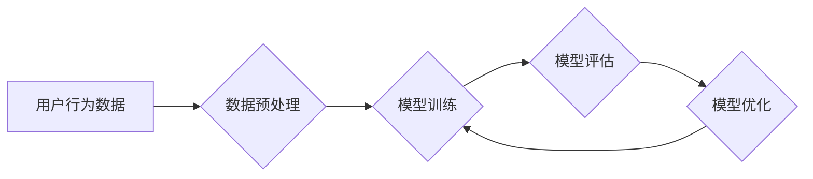

                 

## 1. 背景介绍

在当今数据爆炸的时代，搜索推荐系统已成为互联网应用的核心组成部分，其作用涵盖电商、社交媒体、内容平台等各个领域。用户体验的提升和商业效益的增长都离不开搜索推荐系统的精准性和效率。然而，随着用户行为的复杂化和数据规模的扩大，传统搜索推荐算法面临着越来越大的挑战。

传统的基于规则和特征工程的搜索推荐系统，往往难以捕捉用户行为的隐性特征和复杂关系，导致推荐结果的准确率和个性化程度不足。而近年来，深度学习技术的兴起为搜索推荐系统带来了新的机遇。基于深度学习的AI大模型，凭借其强大的学习能力和泛化能力，能够从海量数据中挖掘更深层次的特征，从而实现更精准、更个性化的推荐。

## 2. 核心概念与联系

### 2.1 搜索推荐系统

搜索推荐系统旨在根据用户的历史行为、偏好和上下文信息，预测用户对特定商品、内容或服务的兴趣，并将其推荐给用户。其核心目标是提高用户满意度和转化率。

### 2.2 AI大模型

AI大模型是指在海量数据上训练的深度学习模型，其参数数量巨大，能够学习到复杂的模式和关系。在搜索推荐系统中，AI大模型可以用于用户画像、兴趣预测、推荐排序等多个环节，提升推荐系统的整体性能。

### 2.3 优化策略

为了提高AI大模型在搜索推荐系统中的效率和效果，需要从模型架构、训练方法、数据处理等多个方面进行优化。

**Mermaid 流程图**



## 3. 核心算法原理 & 具体操作步骤

### 3.1 算法原理概述

在搜索推荐系统中，常用的AI大模型算法包括：

* **协同过滤算法:** 基于用户的历史行为和商品的相似性进行推荐。
* **内容基元模型:** 基于商品的特征和用户偏好进行推荐。
* **深度神经网络模型:** 利用多层神经网络学习用户行为和商品特征之间的复杂关系，进行推荐。

### 3.2 算法步骤详解

以深度神经网络模型为例，其训练步骤如下：

1. **数据预处理:** 将用户行为数据和商品特征数据进行清洗、转换和编码。
2. **模型构建:** 设计深度神经网络模型结构，包括输入层、隐藏层和输出层。
3. **模型训练:** 使用训练数据训练模型，调整模型参数，使模型能够准确预测用户对商品的兴趣。
4. **模型评估:** 使用测试数据评估模型的性能，例如准确率、召回率和NDCG。
5. **模型优化:** 根据评估结果，调整模型参数、模型结构或训练方法，提高模型性能。

### 3.3 算法优缺点

**深度神经网络模型**

* **优点:** 能够学习到复杂的特征关系，推荐效果更精准。
* **缺点:** 需要海量数据进行训练，训练时间长，模型参数量大，部署成本高。

### 3.4 算法应用领域

深度神经网络模型广泛应用于搜索推荐系统，例如：

* **电商推荐:** 推荐商品、优惠券、促销活动等。
* **内容推荐:** 推荐新闻、视频、音乐等内容。
* **社交媒体推荐:** 推荐好友、群组、话题等。

## 4. 数学模型和公式 & 详细讲解 & 举例说明

### 4.1 数学模型构建

深度神经网络模型可以看作是一个复杂的函数映射，其输入是用户行为数据和商品特征数据，输出是用户对商品的兴趣预测。

假设用户 $u$ 对商品 $i$ 的兴趣评分为 $r_{ui}$，则可以使用以下公式表示：

$$r_{ui} = f(x_u, x_i, \theta)$$

其中：

* $x_u$ 是用户 $u$ 的特征向量。
* $x_i$ 是商品 $i$ 的特征向量。
* $\theta$ 是模型参数。
* $f$ 是深度神经网络模型的激活函数。

### 4.2 公式推导过程

深度神经网络模型的训练过程本质上是参数 $\theta$ 的优化过程。可以使用梯度下降算法来优化参数，其目标函数是预测评分与真实评分之间的误差。

$$L(\theta) = \sum_{u,i} (r_{ui} - \hat{r}_{ui})^2$$

其中：

* $L(\theta)$ 是损失函数。
* $\hat{r}_{ui}$ 是模型预测的用户 $u$ 对商品 $i$ 的兴趣评分。

通过计算损失函数的梯度，并根据梯度下降算法的规则更新参数 $\theta$，可以逐步降低损失函数的值，从而提高模型的预测精度。

### 4.3 案例分析与讲解

假设我们有一个电商平台，需要推荐商品给用户。我们可以使用深度神经网络模型，将用户的历史购买记录、浏览记录、评分记录等作为用户特征，将商品的类别、价格、描述等作为商品特征。

通过训练模型，我们可以得到一个能够预测用户对商品兴趣的函数。当用户访问平台时，我们可以根据用户的特征和商品的特征，预测用户对每个商品的兴趣评分，并将其排序，推荐给用户。

## 5. 项目实践：代码实例和详细解释说明

### 5.1 开发环境搭建

为了实现搜索推荐系统的AI大模型优化，我们需要搭建一个合适的开发环境。

* **操作系统:** Linux 或 macOS
* **编程语言:** Python
* **深度学习框架:** TensorFlow 或 PyTorch
* **数据处理工具:** Pandas 或 NumPy

### 5.2 源代码详细实现

以下是一个使用TensorFlow实现深度神经网络模型的简单代码示例：

```python
import tensorflow as tf

# 定义模型结构
model = tf.keras.Sequential([
    tf.keras.layers.Dense(64, activation='relu', input_shape=(10,)),
    tf.keras.layers.Dense(32, activation='relu'),
    tf.keras.layers.Dense(1)
])

# 定义损失函数和优化器
model.compile(loss='mse', optimizer='adam')

# 训练模型
model.fit(x_train, y_train, epochs=10)

# 评估模型
loss = model.evaluate(x_test, y_test)
```

### 5.3 代码解读与分析

* **模型结构:** 代码定义了一个简单的深度神经网络模型，包含三个全连接层。
* **激活函数:** 使用ReLU激活函数，可以提高模型的表达能力。
* **损失函数:** 使用均方误差损失函数，可以衡量模型预测值与真实值的差距。
* **优化器:** 使用Adam优化器，可以快速收敛到模型的最佳参数。

### 5.4 运行结果展示

训练完成后，我们可以使用测试数据评估模型的性能，例如计算模型的均方误差。

## 6. 实际应用场景

### 6.1 电商推荐

AI大模型可以用于推荐商品、优惠券、促销活动等，提高用户购物体验和转化率。

### 6.2 内容推荐

AI大模型可以用于推荐新闻、视频、音乐等内容，满足用户个性化需求。

### 6.3 社交媒体推荐

AI大模型可以用于推荐好友、群组、话题等，增强用户社交互动。

### 6.4 未来应用展望

随着AI技术的不断发展，搜索推荐系统将更加智能化、个性化和精准化。

## 7. 工具和资源推荐

### 7.1 学习资源推荐

* **书籍:**
    * Deep Learning by Ian Goodfellow, Yoshua Bengio, and Aaron Courville
    * Hands-On Machine Learning with Scikit-Learn, Keras & TensorFlow by Aurélien Géron
* **在线课程:**
    * TensorFlow Tutorials: https://www.tensorflow.org/tutorials
    * PyTorch Tutorials: https://pytorch.org/tutorials/

### 7.2 开发工具推荐

* **深度学习框架:** TensorFlow, PyTorch
* **数据处理工具:** Pandas, NumPy
* **云计算平台:** AWS, Azure, GCP

### 7.3 相关论文推荐

* **BERT:** Devlin, J., Chang, M. W., Lee, K., & Toutanova, K. (2018). BERT: Pre-training of deep bidirectional transformers for language understanding. arXiv preprint arXiv:1810.04805.
* **GPT-3:** Brown, T. B., Mann, B., Ryder, N., Subbiah, M., Kaplan, J., Dhariwal, P., ... & Amodei, D. (2020). Language models are few-shot learners. arXiv preprint arXiv:2005.14165.

## 8. 总结：未来发展趋势与挑战

### 8.1 研究成果总结

近年来，AI大模型在搜索推荐系统中的应用取得了显著成果，提升了推荐系统的精准度和个性化程度。

### 8.2 未来发展趋势

* **模型规模和能力的提升:** 未来，AI大模型的规模和能力将进一步提升，能够学习到更复杂的特征关系，提供更精准的推荐。
* **多模态融合:** 未来，AI大模型将融合文本、图像、音频等多模态数据，提供更丰富的推荐体验。
* **个性化和可解释性:** 未来，AI大模型将更加注重个性化和可解释性，能够提供更符合用户需求的推荐，并解释推荐结果背后的逻辑。

### 8.3 面临的挑战

* **数据隐私和安全:** AI大模型的训练需要海量数据，如何保护用户数据隐私和安全是一个重要的挑战。
* **模型可解释性和信任度:** AI大模型的决策过程往往是复杂的，如何提高模型的可解释性和信任度是一个重要的研究方向。
* **模型部署和效率:** AI大模型的部署和推理效率是一个重要的挑战，需要不断优化模型架构和训练方法。

### 8.4 研究展望

未来，搜索推荐系统将朝着更加智能化、个性化和精准化的方向发展，AI大模型将发挥越来越重要的作用。

## 9. 附录：常见问题与解答

### 9.1 如何选择合适的AI大模型？

选择合适的AI大模型需要根据具体的应用场景和数据特点进行考虑。

### 9.2 如何优化AI大模型的性能？

可以从模型架构、训练方法、数据处理等多个方面进行优化。

### 9.3 如何解决AI大模型的部署和效率问题？

可以使用模型压缩、量化和并行推理等技术来提高模型的部署和推理效率。


作者：禅与计算机程序设计艺术 / Zen and the Art of Computer Programming 
<end_of_turn>

