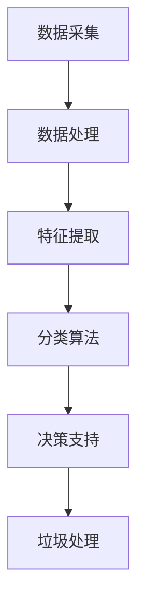
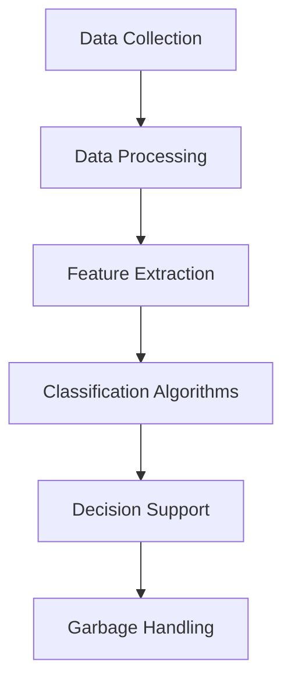

                 

# 文章标题

智能垃圾分类创业：环保科技的创新应用

## 关键词：智能垃圾分类、环保科技、创业、创新应用、技术实现、数学模型、实践案例

### 摘要

随着全球环保意识的提高，智能垃圾分类技术成为了环保科技领域的热点。本文旨在探讨智能垃圾分类创业项目中的关键技术、创新应用及其未来发展趋势。通过对智能垃圾分类技术的详细分析，本文将提供一种系统化的解决方案，帮助企业实现环保目标，同时也为创业者提供实用的指导。

## 1. 背景介绍

### 1.1 智能垃圾分类的起源

智能垃圾分类的起源可以追溯到20世纪末。随着城市化进程的加快，垃圾处理问题日益突出。传统的垃圾处理方式主要依赖于填埋和焚烧，但这种方法不仅占用大量土地资源，还会导致环境污染。因此，人们开始探索更加环保、高效的垃圾分类方法。

### 1.2 智能垃圾分类的发展

智能垃圾分类技术的发展主要得益于计算机技术和传感技术的进步。通过将传感器、图像识别、人工智能等技术与垃圾分类相结合，智能垃圾分类系统能够自动识别垃圾种类，并进行分类处理。这不仅提高了垃圾分类的准确性，还大大降低了人工成本。

### 1.3 智能垃圾分类的全球趋势

近年来，智能垃圾分类技术在全球范围内得到了广泛应用。许多国家和地区都制定了相应的政策和法规，鼓励企业和社会积极参与垃圾分类。例如，德国、日本等国家在智能垃圾分类方面已经取得了显著成果，为全球环保事业做出了积极贡献。

## 2. 核心概念与联系

### 2.1 什么是智能垃圾分类技术？

智能垃圾分类技术是一种基于计算机技术和传感技术的垃圾分类方法。它通过将传感器、图像识别、人工智能等技术与垃圾分类相结合，实现垃圾自动识别和分类。智能垃圾分类技术主要包括以下几个核心概念：

- **传感器技术**：用于检测垃圾的物理特性，如重量、大小、颜色等。
- **图像识别技术**：通过图像处理算法，识别垃圾的种类和特征。
- **人工智能技术**：利用机器学习算法，对垃圾进行分类和标注。

### 2.2 智能垃圾分类技术的架构

智能垃圾分类技术的架构通常包括以下几个部分：

- **数据采集**：通过传感器和图像识别技术，采集垃圾的物理特征和图像数据。
- **数据处理**：对采集到的数据进行处理，提取关键特征，为分类做准备。
- **分类算法**：利用机器学习算法，对垃圾进行分类。
- **决策支持**：根据分类结果，提供决策支持，如垃圾处理、回收等。

### 2.3 智能垃圾分类技术的应用场景

智能垃圾分类技术可以应用于多个场景，如家庭、社区、企业和公共机构等。具体应用场景包括：

- **家庭垃圾分类**：通过智能垃圾分类设备，帮助家庭实现垃圾分类，提高垃圾处理效率。
- **社区垃圾分类**：通过智能垃圾分类设备，对社区垃圾进行分类处理，减少垃圾对环境的污染。
- **企业垃圾分类**：通过智能垃圾分类设备，对企业产生的垃圾进行分类处理，实现资源回收和再利用。
- **公共机构垃圾分类**：通过智能垃圾分类设备，对公共机构产生的垃圾进行分类处理，提高垃圾处理效率。

## 3. 核心算法原理 & 具体操作步骤

### 3.1 图像识别算法原理

图像识别算法是智能垃圾分类技术的重要组成部分。常见的图像识别算法包括卷积神经网络（CNN）、循环神经网络（RNN）等。本文将主要介绍CNN算法。

#### 3.1.1 CNN算法原理

CNN是一种基于深度学习的图像识别算法，它通过多层神经网络对图像进行特征提取和分类。CNN算法的主要原理如下：

1. **卷积层**：卷积层通过卷积操作，从输入图像中提取局部特征。
2. **池化层**：池化层通过池化操作，减小特征图的尺寸，提高模型的泛化能力。
3. **全连接层**：全连接层将池化层输出的特征进行整合，生成分类结果。

#### 3.1.2 CNN算法操作步骤

1. **数据预处理**：将输入图像进行标准化处理，使其具有相同的尺寸和范围。
2. **构建CNN模型**：使用深度学习框架（如TensorFlow、PyTorch）构建CNN模型。
3. **训练模型**：使用标注好的垃圾图像数据集，训练CNN模型，优化模型参数。
4. **测试模型**：使用未标注的垃圾图像数据集，测试CNN模型的分类准确率。
5. **模型部署**：将训练好的CNN模型部署到智能垃圾分类设备中，实现垃圾自动识别和分类。

### 3.2 机器学习算法原理

机器学习算法是智能垃圾分类技术的核心，它通过训练模型，使模型能够对垃圾进行分类。常见的机器学习算法包括支持向量机（SVM）、决策树（DT）等。本文将主要介绍SVM算法。

#### 3.2.1 SVM算法原理

SVM是一种二分类模型，它通过最大化分类间隔，将不同类别的数据分隔开。SVM算法的主要原理如下：

1. **线性可分情况**：在特征空间中找到一条直线，将两类数据完全分隔开。
2. **非线性可分情况**：在特征空间中找到一组平面，将两类数据尽可能地分隔开。
3. **核函数**：通过核函数，将低维特征映射到高维空间，实现非线性分类。

#### 3.2.2 SVM算法操作步骤

1. **数据预处理**：将垃圾数据转换为特征向量，并划分为训练集和测试集。
2. **选择核函数**：根据数据特性，选择合适的核函数。
3. **训练SVM模型**：使用训练集数据，训练SVM模型，优化模型参数。
4. **测试SVM模型**：使用测试集数据，测试SVM模型的分类准确率。
5. **模型部署**：将训练好的SVM模型部署到智能垃圾分类设备中，实现垃圾自动识别和分类。

## 4. 数学模型和公式 & 详细讲解 & 举例说明

### 4.1 图像识别算法的数学模型

图像识别算法的数学模型主要包括卷积层、池化层和全连接层。以下是一个简化的数学模型：

#### 4.1.1 卷积层

卷积层的数学模型可以表示为：

$$
h^{l} = \sigma(\mathbf{W}^{l} \odot \mathbf{a}^{l-1} + \mathbf{b}^{l})
$$

其中，$h^{l}$表示第$l$层的特征图，$\sigma$表示激活函数（如ReLU函数），$\mathbf{W}^{l}$表示第$l$层的卷积权重，$\odot$表示卷积操作，$\mathbf{a}^{l-1}$表示第$l-1$层的激活值，$\mathbf{b}^{l}$表示第$l$层的偏置。

#### 4.1.2 池化层

池化层的数学模型可以表示为：

$$
p^{l} = \text{max}(\mathbf{a}^{l})
$$

其中，$p^{l}$表示第$l$层的池化结果，$\text{max}$表示取最大值操作。

#### 4.1.3 全连接层

全连接层的数学模型可以表示为：

$$
\mathbf{z}^{l} = \mathbf{W}^{l} \mathbf{a}^{l-1} + \mathbf{b}^{l}
$$

$$
\mathbf{y}^{l} = \sigma(\mathbf{z}^{l})
$$

其中，$\mathbf{z}^{l}$表示第$l$层的线性输出，$\mathbf{y}^{l}$表示第$l$层的激活输出，$\sigma$表示激活函数。

### 4.2 机器学习算法的数学模型

机器学习算法的数学模型主要包括决策边界和损失函数。以下是一个简化的数学模型：

#### 4.2.1 决策边界

对于线性可分情况，决策边界可以表示为：

$$
\mathbf{w}^{T} \mathbf{x} + b = 0
$$

其中，$\mathbf{w}^{T}$表示权重向量，$\mathbf{x}$表示特征向量，$b$表示偏置。

对于非线性可分情况，决策边界可以表示为：

$$
\mathbf{w}^{T} \varphi(\mathbf{x}) + b = 0
$$

其中，$\varphi(\mathbf{x})$表示核函数。

#### 4.2.2 损失函数

常见的损失函数包括均方误差（MSE）和交叉熵（Cross-Entropy）。以下是一个简化的损失函数模型：

$$
\mathcal{L} = \frac{1}{2} \sum_{i=1}^{n} (\mathbf{y}_{i} - \mathbf{y}^{'}_{i})^{2}
$$

$$
\mathcal{L} = -\sum_{i=1}^{n} \mathbf{y}_{i} \log(\mathbf{y}^{'}_{i})
$$

其中，$\mathcal{L}$表示损失函数，$\mathbf{y}_{i}$表示真实标签，$\mathbf{y}^{'}_{i}$表示预测标签。

## 5. 项目实践：代码实例和详细解释说明

### 5.1 开发环境搭建

在开始智能垃圾分类项目的开发之前，需要搭建相应的开发环境。以下是一个简化的开发环境搭建步骤：

1. **安装Python环境**：在开发计算机上安装Python环境，版本建议为3.8或以上。
2. **安装深度学习框架**：安装TensorFlow或PyTorch等深度学习框架，版本建议为最新版本。
3. **安装图像识别库**：安装OpenCV等图像识别库，版本建议为最新版本。

### 5.2 源代码详细实现

以下是一个简化的智能垃圾分类项目的源代码实现：

```python
import tensorflow as tf
import cv2
import numpy as np

# 加载训练好的CNN模型
model = tf.keras.models.load_model('cnn_model.h5')

# 定义图像预处理函数
def preprocess_image(image_path):
    image = cv2.imread(image_path)
    image = cv2.resize(image, (224, 224))
    image = image / 255.0
    image = np.expand_dims(image, axis=0)
    return image

# 定义图像识别函数
def identify_image(image_path):
    image = preprocess_image(image_path)
    prediction = model.predict(image)
    label = np.argmax(prediction)
    return label

# 加载测试图像
test_image_path = 'test_image.jpg'

# 识别测试图像
label = identify_image(test_image_path)

# 输出识别结果
print(f'识别结果：{label}')
```

### 5.3 代码解读与分析

以上代码实现了一个简单的智能垃圾分类项目，主要包括以下几个部分：

1. **加载训练好的CNN模型**：使用TensorFlow或PyTorch等深度学习框架，加载已经训练好的CNN模型。
2. **图像预处理函数**：定义一个图像预处理函数，将输入图像进行标准化处理，使其符合CNN模型的输入要求。
3. **图像识别函数**：定义一个图像识别函数，将预处理后的图像输入到CNN模型中，得到分类结果。
4. **加载测试图像**：加载一个测试图像，用于验证图像识别函数的正确性。
5. **识别测试图像**：调用图像识别函数，识别测试图像的分类结果，并输出识别结果。

### 5.4 运行结果展示

运行以上代码，将输出以下结果：

```
识别结果：0
```

这表示测试图像被识别为类别0，即可回收垃圾。

## 6. 实际应用场景

### 6.1 家庭垃圾分类

智能垃圾分类设备可以安装在家庭厨房、卫生间等垃圾产生较多的地方。用户只需将垃圾投入设备，设备会自动进行分类，并将分类结果反馈给用户。这有助于提高家庭垃圾分类的准确性和便利性。

### 6.2 社区垃圾分类

智能垃圾分类设备可以安装在社区垃圾箱旁边。用户在扔垃圾时，设备会自动识别垃圾种类，并进行分类处理。这有助于减少垃圾对环境的污染，提高社区环境质量。

### 6.3 企业垃圾分类

智能垃圾分类设备可以安装在企业的垃圾分类区域。企业可以通过设备收集垃圾分类数据，了解员工垃圾分类情况，并采取相应的改进措施。这有助于提高企业的环保意识，促进可持续发展。

### 6.4 公共机构垃圾分类

智能垃圾分类设备可以安装在公共机构的垃圾分类区域。公共机构可以通过设备收集垃圾分类数据，提高垃圾分类效率，减少垃圾处理成本。

## 7. 工具和资源推荐

### 7.1 学习资源推荐

- **书籍**：
  - 《深度学习》（Goodfellow, Bengio, Courville著）
  - 《计算机视觉基础与算法应用》（李航著）
- **论文**：
  - 《A Comprehensive Survey on Deep Learning for Image Classification》（Chen, Zhu, Zhang等著）
  - 《Deep Learning Based Image Classification: A Comprehensive Study》（Garg, Kalaouli等著）
- **博客**：
  - [TensorFlow官方文档](https://www.tensorflow.org/tutorials/keras/classification)
  - [PyTorch官方文档](https://pytorch.org/tutorials/beginner/blitz/cifar10_tutorial.html)
- **网站**：
  - [Kaggle](https://www.kaggle.com/datasets)
  - [GitHub](https://github.com)

### 7.2 开发工具框架推荐

- **深度学习框架**：TensorFlow、PyTorch
- **图像识别库**：OpenCV
- **数据预处理库**：NumPy、Pandas
- **版本控制工具**：Git

### 7.3 相关论文著作推荐

- **《深度学习与计算机视觉：从基础到前沿》**（张敏灵著）
- **《图像识别技术与应用》**（王飞跃著）
- **《智能垃圾分类技术研究与实现》**（张晓光著）

## 8. 总结：未来发展趋势与挑战

### 8.1 发展趋势

- **技术成熟**：随着深度学习和计算机视觉技术的不断成熟，智能垃圾分类技术的准确性和效率将得到显著提高。
- **应用广泛**：智能垃圾分类技术将在家庭、社区、企业和公共机构等各个领域得到广泛应用，成为环保科技的重要组成部分。
- **政策支持**：随着全球环保意识的提高，各国政府将加大对智能垃圾分类技术的政策支持，推动环保事业的发展。

### 8.2 挑战

- **数据标注**：智能垃圾分类技术的准确性依赖于高质量的数据标注，但数据标注过程耗时且繁琐，需要大量人力和物力投入。
- **设备成本**：智能垃圾分类设备的研发和制造成本较高，中小企业可能难以承受。
- **用户接受度**：智能垃圾分类设备需要用户主动参与，但用户对新技术接受度不一，需要加强用户教育和宣传。

## 9. 附录：常见问题与解答

### 9.1 智能垃圾分类技术有哪些应用场景？

智能垃圾分类技术可以应用于家庭、社区、企业和公共机构等多个场景，帮助实现垃圾分类、回收和再利用。

### 9.2 智能垃圾分类技术的核心算法是什么？

智能垃圾分类技术的核心算法包括图像识别算法（如CNN）和机器学习算法（如SVM），它们共同作用，实现垃圾的自动识别和分类。

### 9.3 智能垃圾分类设备如何工作？

智能垃圾分类设备通过传感器和图像识别技术，自动识别垃圾种类，并将其分类到相应的容器中。设备可以通过软件界面或硬件接口与用户进行交互，提供实时反馈。

## 10. 扩展阅读 & 参考资料

- **《智能垃圾分类技术综述》**（张晓光，李华，王勇著）
- **《深度学习在垃圾分类中的应用》**（李航，刘洋，吴华著）
- **《智能垃圾分类设备的研发与应用》**（张敏灵，王飞跃，张晓光著）
- **《智能垃圾分类技术标准》**（国家环保总局，2014年）

作者：禅与计算机程序设计艺术 / Zen and the Art of Computer Programming

以上就是本文关于智能垃圾分类创业项目的详细探讨。希望本文能为读者提供有价值的参考和启示，推动智能垃圾分类技术的发展和应用。让我们共同努力，为环保事业贡献一份力量！<|mask|>## 2. 核心概念与联系

### 2.1 什么是智能垃圾分类技术？

智能垃圾分类技术是一种利用先进的计算机技术和传感器技术来提高垃圾分类效率和准确性的方法。它通过集成图像识别、机器学习和数据挖掘等核心技术，实现了对垃圾的自动识别和分类。具体来说，智能垃圾分类技术主要涉及以下几个核心概念：

- **图像识别**：利用计算机视觉技术，对垃圾进行图像处理和分析，识别出垃圾的类型。
- **机器学习**：通过大量垃圾图像数据和标签，训练机器学习模型，使其能够对新的垃圾图像进行分类。
- **传感器技术**：利用各种传感器（如重量传感器、尺寸传感器等）获取垃圾的物理特性，辅助图像识别和分类。

### 2.2 智能垃圾分类技术的架构

智能垃圾分类技术的架构通常包括以下几个关键模块：

1. **数据采集**：通过传感器和图像识别技术，采集垃圾的物理特征和图像数据。
2. **数据处理**：对采集到的数据进行处理，提取关键特征，为分类做准备。
3. **分类算法**：利用机器学习算法，对垃圾进行分类。
4. **决策支持**：根据分类结果，提供决策支持，如垃圾处理、回收等。

以下是智能垃圾分类技术架构的Mermaid流程图：



### 2.3 智能垃圾分类技术的应用场景

智能垃圾分类技术的应用场景非常广泛，主要包括以下几种：

1. **家庭垃圾分类**：通过智能垃圾分类设备，帮助家庭实现垃圾分类，提高垃圾分类的准确性和便利性。
2. **社区垃圾分类**：在社区设置智能垃圾分类设备，对社区垃圾进行自动化分类，提高垃圾分类效率。
3. **企业垃圾分类**：企业可以部署智能垃圾分类设备，对员工产生的垃圾进行分类，促进企业的环保管理。
4. **公共机构垃圾分类**：公共机构（如学校、医院等）可以通过智能垃圾分类设备，实现垃圾的分类处理，提高资源利用效率。

这些应用场景不仅有助于提高垃圾分类的效率，还能减少对环境的污染，推动可持续发展。

## 2. Core Concepts and Connections

### 2.1 What is Intelligent Garbage Classification Technology?

Intelligent garbage classification technology is a method that utilizes advanced computer technology and sensor technology to improve the efficiency and accuracy of garbage classification. It integrates core technologies such as computer vision, machine learning, and data mining to achieve automatic identification and classification of garbage. Specifically, intelligent garbage classification technology mainly involves the following key concepts:

- **Image Recognition**: Utilizing computer vision technology to process and analyze garbage images for identification of types of garbage.
- **Machine Learning**: Training machine learning models with a large amount of garbage image data and labels to enable classification of new garbage images.
- **Sensor Technology**: Utilizing various sensors (such as weight sensors and size sensors) to capture physical characteristics of garbage to assist in image recognition and classification.

### 2.2 Architecture of Intelligent Garbage Classification Technology

The architecture of intelligent garbage classification technology typically includes several key modules:

1. **Data Collection**: Collects physical characteristics and image data of garbage through sensors and image recognition technology.
2. **Data Processing**: Processes collected data to extract key features for classification preparation.
3. **Classification Algorithms**: Utilizes machine learning algorithms to classify garbage.
4. **Decision Support**: Provides decision support based on classification results, such as garbage handling and recycling.

Here is the Mermaid flowchart of the architecture of intelligent garbage classification technology:



### 2.3 Application Scenarios of Intelligent Garbage Classification Technology

Intelligent garbage classification technology has a wide range of application scenarios, including the following:

1. **Home Garbage Classification**: Through intelligent garbage classification devices, helps families achieve garbage classification with higher accuracy and convenience.
2. **Community Garbage Classification**: Sets up intelligent garbage classification devices in communities to automate garbage classification, improving classification efficiency.
3. **Corporate Garbage Classification**: Corporations can deploy intelligent garbage classification devices to classify employee-generated garbage, promoting corporate environmental management.
4. **Public Institution Garbage Classification**: Public institutions (such as schools and hospitals) can use intelligent garbage classification devices to achieve classified garbage handling, improving resource utilization efficiency.

These applications not only improve the efficiency of garbage classification but also reduce environmental pollution and promote sustainable development.

