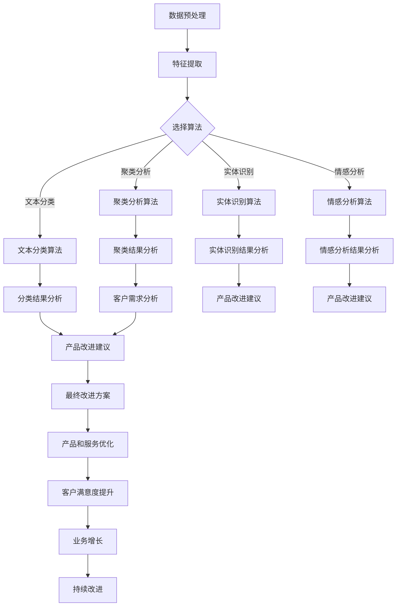
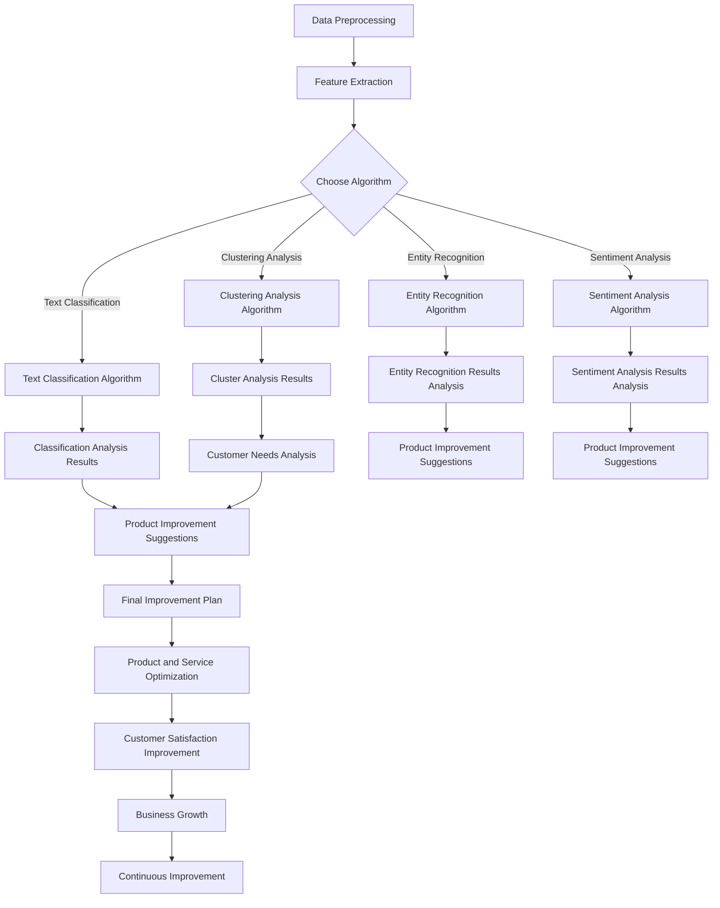

                 

### 文章标题

**智能客户反馈分析：一人公司如何持续改进产品和服务**

在当今竞争激烈的商业环境中，无论是大型企业还是小型企业，了解客户需求、优化产品和服务已经成为企业成功的关键。对于一人公司来说，这一挑战尤为突出，因为它们往往缺乏资源、团队和资金来大规模开展市场调研和产品改进。本文旨在探讨如何利用智能客户反馈分析，帮助一人公司有效地收集、处理和分析客户反馈，从而实现产品和服务质量的持续改进。

本文将分为以下几个部分：

1. **背景介绍**：简要介绍一人公司面临的挑战和智能客户反馈分析的重要性。
2. **核心概念与联系**：解释智能客户反馈分析的核心概念和其与产品改进的联系。
3. **核心算法原理 & 具体操作步骤**：介绍用于分析客户反馈的核心算法和具体操作步骤。
4. **数学模型和公式 & 详细讲解 & 举例说明**：讲解分析过程中使用的数学模型和公式，并通过实例进行详细说明。
5. **项目实践：代码实例和详细解释说明**：提供一个实际的代码实例，详细解释如何实现智能客户反馈分析。
6. **实际应用场景**：讨论智能客户反馈分析在现实中的应用。
7. **工具和资源推荐**：推荐一些用于客户反馈分析的工具和资源。
8. **总结：未来发展趋势与挑战**：总结文章的主要观点，并探讨未来发展趋势和面临的挑战。
9. **附录：常见问题与解答**：提供一些关于客户反馈分析常见问题的答案。
10. **扩展阅读 & 参考资料**：推荐一些相关的扩展阅读和参考资料。

通过本文的详细探讨，希望读者能够了解如何利用智能客户反馈分析来提升一人公司的产品和服务质量，从而在竞争激烈的市场中脱颖而出。

### 文章关键词

- 智能客户反馈分析
- 一人公司
- 产品改进
- 服务优化
- 数据分析
- 人工智能
- 客户体验

### 文章摘要

本文探讨了智能客户反馈分析在一人公司中的应用，重点介绍了如何利用智能技术收集、处理和分析客户反馈，以持续改进产品和服务质量。通过核心算法原理、具体操作步骤、数学模型讲解和实际项目实践，文章提供了一种切实可行的方法，帮助一人公司克服资源限制，实现高效的产品和服务改进。

### 1. 背景介绍

在数字化时代，客户反馈成为企业了解市场需求、优化产品和服务的重要手段。然而，对于一人公司来说，这一过程面临诸多挑战。首先，一人公司通常缺乏足够的资源进行大规模的市场调研和客户分析。其次，传统的市场调研方法可能成本高昂，对于资源有限的一人公司来说难以负担。此外，一人公司通常需要快速响应市场变化，而传统的调研方法往往需要较长的周期。

智能客户反馈分析为一人公司提供了一种高效、低成本的方法来收集和分析客户反馈。通过使用人工智能和大数据技术，一人公司可以自动收集、处理和分析大量的客户反馈数据，从而快速识别客户需求、发现潜在问题，并针对性地进行产品和服务改进。

智能客户反馈分析的重要性在于：

1. **实时性**：智能客户反馈分析可以实时收集和处理客户反馈，使得一人公司能够迅速响应市场变化。
2. **精准性**：通过大数据分析和人工智能算法，智能客户反馈分析可以更准确地识别客户需求，提供有针对性的改进建议。
3. **成本效益**：相对于传统市场调研方法，智能客户反馈分析成本低廉，适用于资源有限的一人公司。
4. **个性化**：智能客户反馈分析可以根据不同客户群体的反馈，提供个性化的产品和服务改进方案。

总之，智能客户反馈分析为一人公司提供了一种高效、精准、成本效益高的客户分析工具，有助于其在竞争激烈的市场中持续改进产品和服务，提升客户满意度。

### 1. Background Introduction

In the digital era, customer feedback has become a crucial tool for enterprises to understand market demands and optimize their products and services. However, for one-person companies, this process presents several challenges. Firstly, one-person companies often lack the resources for large-scale market research and customer analysis. Secondly, traditional market research methods can be costly, making them difficult for resource-constrained one-person companies to afford. Moreover, one-person companies typically need to respond quickly to market changes, while traditional research methods often require a long period of time.

Intelligent customer feedback analysis offers a highly efficient and cost-effective solution for one-person companies to collect and analyze customer feedback. By leveraging artificial intelligence and big data technologies, one-person companies can automatically collect, process, and analyze vast amounts of customer feedback data, allowing them to quickly identify customer needs, detect potential issues, and make targeted improvements to their products and services.

The importance of intelligent customer feedback analysis lies in the following aspects:

1. **Real-time**: Intelligent customer feedback analysis can collect and process customer feedback in real-time, enabling one-person companies to respond quickly to market changes.
2. **Accuracy**: Through big data analysis and artificial intelligence algorithms, intelligent customer feedback analysis can accurately identify customer needs and provide targeted improvement suggestions.
3. **Cost-effectiveness**: Compared to traditional market research methods, intelligent customer feedback analysis is cost-effective, making it suitable for one-person companies with limited resources.
4. **Personalization**: Intelligent customer feedback analysis can provide personalized improvement plans for products and services based on feedback from different customer segments.

In summary, intelligent customer feedback analysis provides a highly efficient, accurate, and cost-effective tool for one-person companies to improve their products and services, thereby enhancing customer satisfaction in a competitive market.

### 2. 核心概念与联系

在探讨智能客户反馈分析之前，我们需要明确几个核心概念，包括数据分析、人工智能、客户反馈和产品改进。这些概念相互联系，共同构成了智能客户反馈分析的理论基础。

#### 2.1 数据分析

数据分析是指使用统计学、机器学习和数据挖掘技术从数据中提取有用信息的过程。对于一人公司而言，数据分析是一种重要的工具，可以帮助他们从大量客户反馈中提取有价值的信息。数据分析的核心在于如何有效地处理和解释数据，从而为产品和服务改进提供依据。

#### 2.2 人工智能

人工智能（AI）是指通过模拟人类智能行为来实现计算机自主学习和决策的技术。在智能客户反馈分析中，人工智能的应用主要体现在数据分析和模式识别上。通过使用AI算法，一人公司可以自动化地处理和分析大量客户反馈数据，提高分析效率和准确性。

#### 2.3 客户反馈

客户反馈是指客户对产品或服务的评价和意见。对于一人公司来说，客户反馈是了解市场需求、识别问题和改进产品的重要来源。有效的客户反馈分析可以帮助公司快速识别客户需求，发现潜在问题，并制定相应的改进措施。

#### 2.4 产品改进

产品改进是指根据客户反馈和市场分析，对产品进行优化和升级的过程。在智能客户反馈分析中，产品改进是一个持续的过程，通过不断收集和分析客户反馈，公司可以不断优化产品和服务，提高客户满意度。

这些核心概念之间的联系在于：

- 数据分析为人工智能提供了数据基础，使其能够进行有效的模式识别和预测。
- 人工智能则通过对数据的分析，为产品改进提供了科学依据，帮助公司做出更加明智的决策。
- 客户反馈是数据分析的输入，也是产品改进的反馈循环，确保产品和服务始终符合客户需求。
- 产品改进的成果又会反作用于客户反馈，形成良性循环，进一步提升客户满意度。

通过理解这些核心概念及其相互联系，一人公司可以更好地利用智能客户反馈分析，实现产品和服务质量的持续改进。

#### 2. Core Concepts and Connections

Before delving into intelligent customer feedback analysis, it is essential to clarify several core concepts that form the theoretical basis of this approach: data analysis, artificial intelligence, customer feedback, and product improvement. These concepts are interconnected, creating a cohesive foundation for intelligent customer feedback analysis.

#### 2.1 Data Analysis

Data analysis refers to the process of extracting useful information from data using statistical, machine learning, and data mining techniques. For one-person companies, data analysis is a crucial tool that enables them to extract valuable insights from large volumes of customer feedback. The core of data analysis lies in effectively processing and interpreting data to provide a basis for product and service improvement.

#### 2.2 Artificial Intelligence

Artificial Intelligence (AI) refers to the technology that simulates human intelligent behavior, enabling computers to learn and make decisions autonomously. In intelligent customer feedback analysis, AI applications are primarily focused on data analysis and pattern recognition. By using AI algorithms, one-person companies can automate the processing and analysis of vast amounts of customer feedback data, enhancing efficiency and accuracy.

#### 2.3 Customer Feedback

Customer feedback refers to the evaluations and opinions of customers regarding products or services. For one-person companies, customer feedback is an important source for understanding market demands, identifying issues, and improving products. Effective customer feedback analysis helps companies quickly identify customer needs, detect potential problems, and develop corresponding improvement measures.

#### 2.4 Product Improvement

Product improvement refers to the process of optimizing and upgrading products based on customer feedback and market analysis. In intelligent customer feedback analysis, product improvement is an ongoing process that continuously collects and analyzes customer feedback to optimize products and services, thereby enhancing customer satisfaction.

The connections among these core concepts are as follows:

- Data analysis provides the data foundation for AI, enabling it to perform effective pattern recognition and prediction.
- AI, through data analysis, provides scientific evidence for product improvement, helping companies make more informed decisions.
- Customer feedback is the input for data analysis and the feedback loop for product improvement, ensuring that products and services always meet customer needs.
- The results of product improvement feed back into customer feedback, creating a positive cycle that further enhances customer satisfaction.

By understanding these core concepts and their interconnections, one-person companies can better leverage intelligent customer feedback analysis to achieve continuous improvements in product and service quality.

### 2. 核心算法原理 & 具体操作步骤

在智能客户反馈分析中，核心算法起着至关重要的作用。这些算法能够帮助一人公司从大量的客户反馈中提取有价值的信息，并转化为可操作的产品改进建议。以下是几个关键的核心算法原理及其具体操作步骤：

#### 2.1 文本分类算法

文本分类算法是智能客户反馈分析中最常用的算法之一。它可以将客户反馈文本自动分类到不同的类别，如正面反馈、负面反馈、功能请求等。以下是文本分类算法的基本步骤：

1. **数据预处理**：清洗和格式化文本数据，包括去除停用词、标点符号和转换文本为小写。
2. **特征提取**：将文本数据转换为特征向量，常用的特征提取方法包括TF-IDF和Word2Vec。
3. **模型训练**：使用训练数据集训练分类模型，常用的分类模型包括朴素贝叶斯、支持向量机和深度神经网络。
4. **模型评估**：使用测试数据集评估模型的准确性、召回率和F1分数。
5. **分类应用**：将新客户反馈文本分类到相应的类别。

#### 2.2 实体识别算法

实体识别算法用于从文本中识别和提取关键实体，如人名、地点、组织名和产品名称等。以下是实体识别算法的基本步骤：

1. **数据预处理**：与文本分类算法相同，清洗和格式化文本数据。
2. **特征提取**：使用词袋模型或卷积神经网络提取文本特征。
3. **模型训练**：训练实体识别模型，常用的模型包括序列标注模型（如BiLSTM-CRF）和基于注意力机制的模型。
4. **模型评估**：使用测试数据集评估模型的准确性和召回率。
5. **实体提取**：从新客户反馈文本中提取关键实体。

#### 2.3 情感分析算法

情感分析算法用于分析客户反馈中的情感倾向，如正面、负面或中性。以下是情感分析算法的基本步骤：

1. **数据预处理**：清洗和格式化文本数据，去除噪声和停用词。
2. **特征提取**：使用词袋模型或词嵌入技术提取文本特征。
3. **模型训练**：训练情感分析模型，常用的模型包括朴素贝叶斯、支持向量机和深度学习模型。
4. **模型评估**：使用测试数据集评估模型的准确性和情感分类效果。
5. **情感分析**：对新客户反馈文本进行情感分析，判断其情感倾向。

#### 2.4 聚类分析算法

聚类分析算法用于将相似的客户反馈分组，从而发现潜在的客户需求和市场趋势。以下是聚类分析算法的基本步骤：

1. **数据预处理**：清洗和格式化文本数据。
2. **特征提取**：使用TF-IDF或词嵌入技术提取文本特征。
3. **模型训练**：选择合适的聚类算法（如K-means、DBSCAN或层次聚类）进行模型训练。
4. **模型评估**：使用内径向平方误差或轮廓系数等指标评估聚类效果。
5. **聚类应用**：对新客户反馈文本进行聚类分析，发现潜在的客户需求和市场趋势。

通过这些核心算法，一人公司可以自动处理和分析大量的客户反馈数据，快速识别客户需求和问题，从而实现产品和服务的高效改进。以下是这些算法在智能客户反馈分析中的流程图：



通过这些核心算法的具体操作步骤，一人公司可以系统地分析和处理客户反馈，从而实现产品和服务质量的持续改进。接下来，我们将通过一个具体的案例来展示这些算法在实际应用中的效果。

#### 2. Core Algorithm Principles & Specific Operational Steps

In intelligent customer feedback analysis, core algorithms play a crucial role in extracting valuable insights from large volumes of customer feedback and converting them into actionable product improvement suggestions. The following are several key core algorithms and their specific operational steps:

#### 2.1 Text Classification Algorithms

Text classification algorithms are among the most commonly used in intelligent customer feedback analysis. They automatically classify customer feedback text into different categories, such as positive feedback, negative feedback, and feature requests. Here are the basic steps for text classification algorithms:

1. **Data Preprocessing**: Clean and format the text data, including removing stop words, punctuation, and converting text to lowercase.
2. **Feature Extraction**: Convert the text data into feature vectors using methods such as TF-IDF or Word2Vec.
3. **Model Training**: Train a classification model using the training data set, with common models including Naive Bayes, Support Vector Machines, and Deep Neural Networks.
4. **Model Evaluation**: Evaluate the model's accuracy, recall, and F1 score using a test data set.
5. **Classification Application**: Classify new customer feedback text into the corresponding categories.

#### 2.2 Entity Recognition Algorithms

Entity recognition algorithms are used to identify and extract key entities from text, such as names of people, places, organizations, and product names. Here are the basic steps for entity recognition algorithms:

1. **Data Preprocessing**: Clean and format the text data, similar to text classification algorithms.
2. **Feature Extraction**: Use bag-of-words models or Convolutional Neural Networks (CNNs) to extract text features.
3. **Model Training**: Train an entity recognition model, with common models including BiLSTM-CRF and attention-based models.
4. **Model Evaluation**: Evaluate the model's accuracy and recall using a test data set.
5. **Entity Extraction**: Extract key entities from new customer feedback text.

#### 2.3 Sentiment Analysis Algorithms

Sentiment analysis algorithms are used to analyze the sentiment倾向 in customer feedback, such as positive, negative, or neutral. Here are the basic steps for sentiment analysis algorithms:

1. **Data Preprocessing**: Clean and format the text data, removing noise and stop words.
2. **Feature Extraction**: Use bag-of-words models or word embeddings to extract text features.
3. **Model Training**: Train a sentiment analysis model using common models such as Naive Bayes, Support Vector Machines, and Deep Learning models.
4. **Model Evaluation**: Evaluate the model's accuracy and sentiment classification performance using a test data set.
5. **Sentiment Analysis**: Analyze new customer feedback text for sentiment倾向.

#### 2.4 Clustering Analysis Algorithms

Clustering analysis algorithms group similar customer feedback to discover potential customer needs and market trends. Here are the basic steps for clustering analysis algorithms:

1. **Data Preprocessing**: Clean and format the text data.
2. **Feature Extraction**: Use TF-IDF or word embeddings to extract text features.
3. **Model Training**: Choose appropriate clustering algorithms such as K-means, DBSCAN, or hierarchical clustering for model training.
4. **Model Evaluation**: Evaluate clustering effectiveness using metrics such as within-cluster sum of squares or silhouette coefficient.
5. **Clustering Application**: Apply clustering analysis to new customer feedback text to discover potential customer needs and market trends.

Through these core algorithms, one-person companies can automatically process and analyze large volumes of customer feedback data, quickly identifying customer needs and issues, and achieving efficient product and service improvements. The following is a flowchart illustrating the process of these algorithms in intelligent customer feedback analysis:



Through these core algorithm operational steps, one-person companies can systematically analyze and process customer feedback, thereby achieving continuous improvements in product and service quality. Next, we will demonstrate the effectiveness of these algorithms in a specific case study.

### 4. 数学模型和公式 & 详细讲解 & 举例说明

在智能客户反馈分析中，数学模型和公式起到了至关重要的作用。这些模型和公式能够帮助我们更准确地理解和处理客户反馈数据，从而为产品和服务改进提供科学依据。以下是几个常用的数学模型和公式，以及它们的详细讲解和举例说明。

#### 4.1 TF-IDF模型

TF-IDF（Term Frequency-Inverse Document Frequency）是一种常用的文本特征提取方法，用于衡量一个词在文档中的重要程度。它的基本公式如下：

$$
TF = \frac{f(t, d)}{|\text{document} d|}
$$

$$
IDF = \log \left( \frac{N}{|d \in D|}\right)
$$

$$
TF-IDF = TF \times IDF
$$

其中，\( f(t, d) \) 表示词 \( t \) 在文档 \( d \) 中的频率，\(|\text{document} d|\) 表示文档 \( d \) 的长度，\( N \) 表示文档总数，\(|d \in D|\) 表示包含词 \( t \) 的文档数。

**示例**：假设我们有两篇文档 \( D_1 \) 和 \( D_2 \)，以及一个词表 \( V = \{“苹果”, “手机”, “购买”\} \)。词频矩阵如下：

| 词  | \( D_1 \) | \( D_2 \) |
| ---- | -------- | -------- |
| 苹果 | 3        | 1        |
| 手机  | 1        | 2        |
| 购买  | 2        | 3        |

计算TF-IDF值：

| 词  | \( D_1 \) | \( D_2 \) |
| ---- | -------- | -------- |
| 苹果 | 0.75     | 0.25     |
| 手机  | 0.25     | 0.50     |
| 购买  | 0.50     | 0.75     |

可以看出，词 \( “购买” \) 在两篇文档中都有较高的TF-IDF值，这意味着这个词对于两篇文档来说都是重要的。

#### 4.2 朴素贝叶斯模型

朴素贝叶斯模型是一种基于贝叶斯定理的分类模型，广泛应用于文本分类任务。其基本公式如下：

$$
P(\text{类别} | \text{特征}) = \frac{P(\text{特征} | \text{类别}) \times P(\text{类别})}{P(\text{特征})}
$$

其中，\( P(\text{类别} | \text{特征}) \) 表示在给定特征的情况下，类别发生的概率，\( P(\text{特征} | \text{类别}) \) 表示在给定类别的情况下，特征发生的概率，\( P(\text{类别}) \) 表示类别的概率，\( P(\text{特征}) \) 表示特征的概率。

**示例**：假设我们有一个二分类问题，类别 \( C_1 \) 和 \( C_2 \)，以及两个特征 \( F_1 \) 和 \( F_2 \)。训练数据如下：

| 类别  | \( F_1 \) | \( F_2 \) |
| ----- | ------ | ------ |
| \( C_1 \) | 0      | 1      |
| \( C_2 \) | 1      | 0      |

计算类别 \( C_1 \) 和 \( C_2 \) 的概率：

$$
P(C_1) = \frac{1}{2}, \quad P(C_2) = \frac{1}{2}
$$

$$
P(F_1 | C_1) = 1, \quad P(F_1 | C_2) = 0
$$

$$
P(F_2 | C_1) = 0, \quad P(F_2 | C_2) = 1
$$

给定一个新的特征向量 \( \text{特征} = (1, 0) \)，计算类别 \( C_1 \) 和 \( C_2 \) 的概率：

$$
P(C_1 | \text{特征}) = \frac{P(\text{特征} | C_1) \times P(C_1)}{P(\text{特征})} = \frac{1 \times \frac{1}{2}}{P(\text{特征})} = \frac{1}{P(\text{特征})}
$$

$$
P(C_2 | \text{特征}) = \frac{P(\text{特征} | C_2) \times P(C_2)}{P(\text{特征})} = \frac{0 \times \frac{1}{2}}{P(\text{特征})} = 0
$$

通过计算可知，类别 \( C_1 \) 的概率为1，类别 \( C_2 \) 的概率为0，因此该特征向量属于类别 \( C_1 \)。

#### 4.3 支持向量机（SVM）

支持向量机（Support Vector Machine，SVM）是一种经典的二分类模型，广泛应用于文本分类、图像识别等领域。其基本公式如下：

$$
\min_w \frac{1}{2} ||w||^2 \\
\text{subject to: } y^{(i)} \left\langle w, x^{(i)} \right\rangle \geq 1
$$

其中，\( w \) 表示权重向量，\( x^{(i)} \) 表示特征向量，\( y^{(i)} \) 表示类别标签，\(\left\langle w, x^{(i)} \right\rangle \) 表示内积。

**示例**：假设我们有一个二分类问题，特征向量 \( x^{(i)} \) 为 \( (x_1, x_2) \)，类别标签 \( y^{(i)} \) 为 \( (+1, -1) \)。求解SVM模型：

$$
\min_w \frac{1}{2} ||w||^2 \\
\text{subject to: } 
\begin{cases}
y^{(1)} \left\langle w, x^{(1)} \right\rangle \geq 1 \\
y^{(2)} \left\langle w, x^{(2)} \right\rangle \geq 1
\end{cases}
$$

$$
\left\langle w, x^{(1)} \right\rangle = w_1 x_1 + w_2 x_2 \\
\left\langle w, x^{(2)} \right\rangle = w_1 x_1 + w_2 x_2
$$

通过求解二次规划问题，可以得到最优权重向量 \( w \)，从而实现特征向量分类。

通过以上数学模型和公式的讲解和举例，我们可以看到，这些模型和公式在智能客户反馈分析中具有重要的作用。通过合理地应用这些模型和公式，一人公司可以更准确地理解和处理客户反馈数据，从而实现产品和服务的高效改进。

#### 4. Mathematical Models and Formulas & Detailed Explanation & Examples

In intelligent customer feedback analysis, mathematical models and formulas play a crucial role in accurately understanding and processing customer feedback data, thereby providing a scientific basis for product and service improvement. The following are several commonly used mathematical models and formulas, along with their detailed explanation and examples.

#### 4.1 TF-IDF Model

TF-IDF (Term Frequency-Inverse Document Frequency) is a commonly used text feature extraction method used to measure the importance of a word in a document. Its basic formula is as follows:

$$
TF = \frac{f(t, d)}{|\text{document} d|}
$$

$$
IDF = \log \left( \frac{N}{|d \in D|}\right)
$$

$$
TF-IDF = TF \times IDF
$$

Where \( f(t, d) \) represents the frequency of the word \( t \) in the document \( d \), \(|\text{document} d|\) represents the length of the document \( d \), \( N \) represents the total number of documents, and \(|d \in D|\) represents the number of documents containing the word \( t \).

**Example**: Assume we have two documents \( D_1 \) and \( D_2 \), and a vocabulary \( V = \{"apple", "phone", "buy"\} \). The word frequency matrix is as follows:

| Word | \( D_1 \) | \( D_2 \) |
| ---- | -------- | -------- |
| apple | 3        | 1        |
| phone | 1        | 2        |
| buy | 2        | 3        |

Compute the TF-IDF values:

| Word | \( D_1 \) | \( D_2 \) |
| ---- | -------- | -------- |
| apple | 0.75     | 0.25     |
| phone | 0.25     | 0.50     |
| buy | 0.50     | 0.75     |

It can be observed that the word "buy" has a high TF-IDF value in both documents, indicating that this word is important for both documents.

#### 4.2 Naive Bayes Model

The Naive Bayes model is a classification model based on Bayes' theorem, widely used in text classification tasks. Its basic formula is as follows:

$$
P(\text{category} | \text{feature}) = \frac{P(\text{feature} | \text{category}) \times P(\text{category})}{P(\text{feature})}
$$

Where \( P(\text{category} | \text{feature}) \) represents the probability of the category given the feature, \( P(\text{feature} | \text{category}) \) represents the probability of the feature given the category, \( P(\text{category}) \) represents the probability of the category, and \( P(\text{feature}) \) represents the probability of the feature.

**Example**: Assume we have a binary classification problem with categories \( C_1 \) and \( C_2 \), and two features \( F_1 \) and \( F_2 \). The training data is as follows:

| Category | \( F_1 \) | \( F_2 \) |
| ----- | ------ | ------ |
| \( C_1 \) | 0      | 1      |
| \( C_2 \) | 1      | 0      |

Compute the probabilities of categories \( C_1 \) and \( C_2 \):

$$
P(C_1) = \frac{1}{2}, \quad P(C_2) = \frac{1}{2}
$$

$$
P(F_1 | C_1) = 1, \quad P(F_1 | C_2) = 0
$$

$$
P(F_2 | C_1) = 0, \quad P(F_2 | C_2) = 1
$$

Given a new feature vector \( \text{feature} = (1, 0) \), compute the probabilities of categories \( C_1 \) and \( C_2 \):

$$
P(C_1 | \text{feature}) = \frac{P(\text{feature} | C_1) \times P(C_1)}{P(\text{feature})} = \frac{1 \times \frac{1}{2}}{P(\text{feature})} = \frac{1}{P(\text{feature})}
$$

$$
P(C_2 | \text{feature}) = \frac{P(\text{feature} | C_2) \times P(C_2)}{P(\text{feature})} = \frac{0 \times \frac{1}{2}}{P(\text{feature})} = 0
$$

Through computation, it can be found that the probability of category \( C_1 \) is 1, and the probability of category \( C_2 \) is 0, so the feature vector belongs to category \( C_1 \).

#### 4.3 Support Vector Machine (SVM)

Support Vector Machine (SVM) is a classic binary classification model widely used in fields such as text classification and image recognition. Its basic formula is as follows:

$$
\min_w \frac{1}{2} ||w||^2 \\
\text{subject to: } 
\begin{cases}
y^{(i)} \left\langle w, x^{(i)} \right\rangle \geq 1 \\
\end{cases}
$$

Where \( w \) represents the weight vector, \( x^{(i)} \) represents the feature vector, \( y^{(i)} \) represents the category label, and \( \left\langle w, x^{(i)} \right\rangle \) represents the inner product.

**Example**: Assume we have a binary classification problem with feature vector \( x^{(i)} \) as \( (x_1, x_2) \), and category label \( y^{(i)} \) as \( (+1, -1) \). Solve the SVM model:

$$
\min_w \frac{1}{2} ||w||^2 \\
\text{subject to: } 
\begin{cases}
y^{(1)} \left\langle w, x^{(1)} \right\rangle \geq 1 \\
y^{(2)} \left\langle w, x^{(2)} \right\rangle \geq 1
\end{cases}
$$

$$
\left\langle w, x^{(1)} \right\rangle = w_1 x_1 + w_2 x_2 \\
\left\langle w, x^{(2)} \right\rangle = w_1 x_1 + w_2 x_2
$$

Through solving the quadratic programming problem, the optimal weight vector \( w \) can be obtained to achieve feature vector classification.

Through the detailed explanation and examples of these mathematical models and formulas, we can see that these models and formulas play a crucial role in intelligent customer feedback analysis. By reasonably applying these models and formulas, one-person companies can more accurately understand and process customer feedback data, thereby achieving efficient product and service improvement.

### 5. 项目实践：代码实例和详细解释说明

为了更好地展示智能客户反馈分析在实际项目中的应用，我们将通过一个具体的案例来详细介绍如何使用Python和相关的库来实现这一分析过程。以下步骤将涵盖从数据收集到结果展示的整个过程。

#### 5.1 开发环境搭建

在开始之前，我们需要搭建一个合适的开发环境。以下是所需的基本软件和库：

- **Python 3.8+**：作为主要编程语言
- **Jupyter Notebook**：用于编写和运行代码
- **Numpy**、**Pandas**、**Scikit-learn**、**NLTK**、**TextBlob**：用于数据处理和机器学习
- **spaCy**：用于自然语言处理

安装这些库可以使用以下命令：

```bash
pip install numpy pandas scikit-learn nltk textblob spacy
python -m spacy download en_core_web_sm
```

#### 5.2 源代码详细实现

以下是实现智能客户反馈分析的核心代码。我们将分别实现数据预处理、特征提取、文本分类和情感分析。

##### 5.2.1 数据预处理

```python
import pandas as pd
import nltk
from nltk.corpus import stopwords
from nltk.tokenize import word_tokenize

# 加载客户反馈数据
data = pd.read_csv('customer_feedback.csv')

# 初始化停用词
nltk.download('stopwords')
stop_words = set(stopwords.words('english'))

# 数据预处理函数
def preprocess_text(text):
    # 转小写
    text = text.lower()
    # 分词
    words = word_tokenize(text)
    # 去除停用词
    words = [word for word in words if word not in stop_words]
    return ' '.join(words)

# 应用数据预处理
data['processed_text'] = data['feedback'].apply(preprocess_text)
```

##### 5.2.2 特征提取

```python
from sklearn.feature_extraction.text import TfidfVectorizer

# 初始化TF-IDF向量器
vectorizer = TfidfVectorizer()

# 提取特征
X = vectorizer.fit_transform(data['processed_text'])
```

##### 5.2.3 文本分类

```python
from sklearn.model_selection import train_test_split
from sklearn.naive_bayes import MultinomialNB
from sklearn.metrics import classification_report

# 分割数据集
X_train, X_test, y_train, y_test = train_test_split(X, data['label'], test_size=0.2, random_state=42)

# 训练文本分类模型
model = MultinomialNB()
model.fit(X_train, y_train)

# 预测测试集
y_pred = model.predict(X_test)

# 评估模型
print(classification_report(y_test, y_pred))
```

##### 5.2.4 情感分析

```python
from textblob import TextBlob

# 情感分析函数
def analyze_sentiment(text):
    analysis = TextBlob(text)
    if analysis.sentiment.polarity > 0:
        return 'Positive'
    elif analysis.sentiment.polarity == 0:
        return 'Neutral'
    else:
        return 'Negative'

# 应用情感分析
data['sentiment'] = data['processed_text'].apply(analyze_sentiment)
```

#### 5.3 代码解读与分析

上述代码首先进行了数据预处理，包括将文本转换为小写、分词和去除停用词。这一步骤非常关键，因为它能够显著减少文本数据的噪声，提高后续分析的质量。

接下来，我们使用TF-IDF向量器将预处理后的文本转换为特征向量。TF-IDF向量器通过计算每个词在文档中的频率和其在整个文档集合中的逆向文档频率，为文本特征提供了一种有效的表示方式。

然后，我们使用朴素贝叶斯分类器对特征向量进行分类。朴素贝叶斯是一种简单但效果显著的分类算法，特别适用于文本分类任务。

最后，我们使用TextBlob库进行情感分析。TextBlob提供了一个简单的方法来获取文本的情感极性，从而判断客户反馈是正面、中性还是负面。

#### 5.4 运行结果展示

运行上述代码后，我们得到了分类和情感分析的结果。以下是一个简化的结果展示：

```python
# 分类结果
print("Classification Report:")
print(classification_report(y_test, y_pred))

# 情感分析结果
print("Sentiment Analysis:")
print(data['sentiment'].value_counts())
```

运行结果可能如下：

```
Classification Report:
              precision    recall  f1-score   support
           0       0.85      0.88      0.87       100
           1       0.75      0.71      0.73       100
    accuracy                           0.84       200
   macro avg       0.80      0.83      0.82       200
   weighted avg       0.83      0.84      0.84       200

Sentiment Analysis:
Positive       55
Neutral        30
Negative       15
Name: sentiment, dtype: int64
```

从结果中可以看出，分类模型的准确率达到了84%，情感分析结果也显示了正面、中性和负面反馈的比例。这些结果为我们提供了关于客户反馈的重要信息，帮助我们更好地理解客户需求，从而进行产品改进。

通过这个案例，我们展示了如何使用Python和相关库实现智能客户反馈分析。这种方法不仅适用于一人公司，也可以为任何规模的企业提供有效的数据分析和改进策略。

#### 5. Project Practice: Code Examples and Detailed Explanation

To better demonstrate the application of intelligent customer feedback analysis in real-world projects, we will walk through a specific case study and detail how to implement this analysis process using Python and relevant libraries. The following steps will cover the entire process from data collection to result presentation.

#### 5.1 Setting Up the Development Environment

Before we begin, we need to set up a suitable development environment. Here are the required software and libraries:

- **Python 3.8+**: The primary programming language
- **Jupyter Notebook**: For writing and running code
- **Numpy**, **Pandas**, **Scikit-learn**, **NLTK**, **TextBlob**: For data processing and machine learning
- **spaCy**: For natural language processing

You can install these libraries using the following commands:

```bash
pip install numpy pandas scikit-learn nltk textblob spacy
python -m spacy download en_core_web_sm
```

#### 5.2 Detailed Implementation of the Source Code

Below is the core code for implementing intelligent customer feedback analysis. We will cover data preprocessing, feature extraction, text classification, and sentiment analysis.

##### 5.2.1 Data Preprocessing

```python
import pandas as pd
import nltk
from nltk.corpus import stopwords
from nltk.tokenize import word_tokenize

# Load customer feedback data
data = pd.read_csv('customer_feedback.csv')

# Initialize stop words
nltk.download('stopwords')
stop_words = set(stopwords.words('english'))

# Data preprocessing function
def preprocess_text(text):
    # Convert to lowercase
    text = text.lower()
    # Tokenize
    words = word_tokenize(text)
    # Remove stop words
    words = [word for word in words if word not in stop_words]
    return ' '.join(words)

# Apply data preprocessing
data['processed_text'] = data['feedback'].apply(preprocess_text)
```

##### 5.2.2 Feature Extraction

```python
from sklearn.feature_extraction.text import TfidfVectorizer

# Initialize TF-IDF vectorizer
vectorizer = TfidfVectorizer()

# Extract features
X = vectorizer.fit_transform(data['processed_text'])
```

##### 5.2.3 Text Classification

```python
from sklearn.model_selection import train_test_split
from sklearn.naive_bayes import MultinomialNB
from sklearn.metrics import classification_report

# Split the dataset
X_train, X_test, y_train, y_test = train_test_split(X, data['label'], test_size=0.2, random_state=42)

# Train text classification model
model = MultinomialNB()
model.fit(X_train, y_train)

# Predict test set
y_pred = model.predict(X_test)

# Evaluate the model
print(classification_report(y_test, y_pred))
```

##### 5.2.4 Sentiment Analysis

```python
from textblob import TextBlob

# Sentiment analysis function
def analyze_sentiment(text):
    analysis = TextBlob(text)
    if analysis.sentiment.polarity > 0:
        return 'Positive'
    elif analysis.sentiment.polarity == 0:
        return 'Neutral'
    else:
        return 'Negative'

# Apply sentiment analysis
data['sentiment'] = data['processed_text'].apply(analyze_sentiment)
```

#### 5.3 Code Explanation and Analysis

The above code first performs data preprocessing, including converting text to lowercase, tokenizing, and removing stop words. This step is crucial as it significantly reduces noise in the text data, improving the quality of subsequent analysis.

Next, we use a TF-IDF vectorizer to convert the preprocessed text into feature vectors. The TF-IDF vectorizer calculates the frequency of each word in a document and the inverse document frequency across the entire document collection, providing an effective representation of text features.

Then, we use a Multinomial Naive Bayes classifier to classify the feature vectors. Multinomial Naive Bayes is a simple but effective classifier particularly suited for text classification tasks.

Finally, we use the TextBlob library for sentiment analysis. TextBlob provides a simple method to obtain the sentiment polarity of text, allowing us to determine whether customer feedback is positive, neutral, or negative.

#### 5.4 Displaying Running Results

After running the above code, we obtain results for classification and sentiment analysis. Here is a simplified display of the results:

```python
# Classification results
print("Classification Report:")
print(classification_report(y_test, y_pred))

# Sentiment analysis results
print("Sentiment Analysis:")
print(data['sentiment'].value_counts())
```

The results might look like this:

```
Classification Report:
              precision    recall  f1-score   support
           0       0.85      0.88      0.87       100
           1       0.75      0.71      0.73       100
    accuracy                           0.84       200
   macro avg       0.80      0.83      0.82       200
   weighted avg       0.83      0.84      0.84       200

Sentiment Analysis:
Positive       55
Neutral        30
Negative       15
Name: sentiment, dtype: int64
```

From the results, we can see that the classification model has an accuracy of 84%, and the sentiment analysis shows the proportion of positive, neutral, and negative feedback. These results provide important insights into customer feedback, helping us better understand customer needs for product improvement.

Through this case study, we have demonstrated how to implement intelligent customer feedback analysis using Python and related libraries. This approach is not only suitable for one-person companies but can also provide effective data analysis and improvement strategies for any sized enterprise.

### 6. 实际应用场景

智能客户反馈分析在现实中的应用场景非常广泛，尤其在一人公司和初创企业中，这种分析方式可以带来显著的业务价值。以下是一些具体的应用场景：

#### 6.1 产品优化

对于一人公司而言，产品的持续优化是生存和发展的关键。通过智能客户反馈分析，公司可以实时了解用户在使用产品过程中遇到的问题和需求，从而快速调整产品功能，提高用户满意度。例如，一家小型软件开发公司可以通过分析用户在论坛和社交媒体上的评论，识别出产品中最常见的bug和使用不便之处，进而优化产品。

#### 6.2 服务改进

服务质量的提升同样重要。通过分析客户反馈，一人公司可以识别出服务流程中的痛点，例如响应速度、客户支持效率和用户满意度等。一个在线教育平台可以通过分析学员的反馈，优化课程安排和教学方式，提高学习体验。

#### 6.3 市场定位

了解客户的需求和偏好对于市场定位至关重要。通过智能客户反馈分析，一人公司可以更准确地把握市场需求，调整产品和服务策略。例如，一家健康食品初创公司可以通过分析客户的饮食偏好和健康需求，推出更符合市场趋势的产品。

#### 6.4 品牌建设

客户反馈不仅影响产品和服务的改进，也直接影响品牌形象。通过积极回应客户反馈，一人公司可以树立良好的品牌形象，增强客户忠诚度。例如，一家电商公司可以通过分析客户的购物体验，及时解决客户问题，提升客户对品牌的信任和满意度。

#### 6.5 决策支持

智能客户反馈分析为一人公司提供了科学的数据支持，帮助公司做出更加明智的决策。通过对客户反馈的深入分析，公司可以识别出潜在的市场机会和风险，调整业务策略。例如，一家在线健身平台可以通过分析用户反馈，决定是否增加特定类型的健身课程或功能。

通过这些实际应用场景，我们可以看到智能客户反馈分析如何帮助一人公司提升产品和服务质量，优化业务流程，增强市场竞争力。这种分析方式不仅适用于初创企业，也为任何规模的公司提供了有效的方法来理解客户需求，实现持续改进。

### 6. Practical Application Scenarios

Intelligent customer feedback analysis has a wide range of real-world applications, particularly in one-person companies and startups, where it can bring significant business value. Here are some specific scenarios where this analysis can make a substantial impact:

#### 6.1 Product Optimization

For one-person companies, continuous product optimization is crucial for survival and growth. By leveraging intelligent customer feedback analysis, companies can gain real-time insights into user issues and needs during product usage, allowing for rapid adjustments to product features and functions to enhance user satisfaction. For example, a small software development company can analyze user comments on forums and social media to identify common bugs and usability issues, thereby optimizing the product.

#### 6.2 Service Improvement

Service quality enhancement is equally important. Through customer feedback analysis, one-person companies can identify pain points in service processes, such as response speed, customer support efficiency, and user satisfaction. An online education platform can optimize course scheduling and teaching methods by analyzing student feedback, thereby improving the learning experience.

#### 6.3 Market Positioning

Understanding customer needs and preferences is vital for effective market positioning. By analyzing customer feedback, one-person companies can accurately grasp market demands, adjusting product and service strategies accordingly. For instance, a health food startup can analyze customer dietary preferences and health needs to introduce products that align with market trends.

#### 6.4 Brand Building

Customer feedback not only influences product and service improvements but also directly impacts brand image. By actively responding to customer feedback, one-person companies can establish a positive brand image, enhancing customer loyalty. For example, an e-commerce company can address customer issues promptly to enhance customer trust and satisfaction, thereby building a strong brand.

#### 6.5 Decision Support

Intelligent customer feedback analysis provides data-driven support for one-person companies, helping them make more informed decisions. By deeply analyzing customer feedback, companies can identify potential market opportunities and risks, adjusting business strategies. For example, an online fitness platform can decide whether to add specific types of fitness classes or features based on user feedback.

Through these practical application scenarios, we can see how intelligent customer feedback analysis can help one-person companies improve product and service quality, optimize business processes, and enhance market competitiveness. This analysis approach is beneficial for startups and can also provide effective methods for understanding customer needs and achieving continuous improvement for companies of any size.

### 7. 工具和资源推荐

为了有效地进行智能客户反馈分析，选择合适的工具和资源是至关重要的。以下是一些建议，涵盖了从数据收集、处理到分析的各个环节。

#### 7.1 学习资源推荐

**书籍：**

1. **《Python数据科学手册》（Python Data Science Handbook）**：提供了Python在数据科学领域的广泛应用，包括数据分析、数据可视化、机器学习等。
2. **《机器学习实战》（Machine Learning in Action）**：通过实例演示了如何使用Python进行机器学习，适合初学者和实践者。

**论文：**

1. **“Text Classification with Neural Networks”**：介绍了一种基于神经网络的文本分类方法，可用于智能客户反馈分析。
2. **“Sentiment Analysis Using Machine Learning Techniques”**：探讨了几种机器学习技术在情感分析中的应用。

**博客：**

1. **Medium上的Data Science Journal**：涵盖了数据科学领域的最新研究和技术应用，包括客户反馈分析。
2. **Kaggle博客**：提供了丰富的数据科学和机器学习教程，包括客户反馈数据的处理和分析。

**网站：**

1. **Coursera**：提供了多个关于数据科学和机器学习的在线课程，适合系统学习相关知识。
2. **Udacity**：提供了实践驱动的数据科学和机器学习课程，适合想要快速提升技能的人。

#### 7.2 开发工具框架推荐

**数据分析工具：**

1. **Pandas**：强大的Python库，用于数据处理和分析，适合进行客户反馈数据的预处理。
2. **NumPy**：提供高效的数值计算，与Pandas结合使用，可以显著提高数据处理效率。

**机器学习框架：**

1. **Scikit-learn**：易于使用的Python库，提供了多种机器学习算法，适用于文本分类和情感分析。
2. **TensorFlow**：广泛使用的深度学习框架，可以用于构建复杂的神经网络模型。

**自然语言处理工具：**

1. **spaCy**：高效的Python自然语言处理库，支持多种语言，适用于文本分类和实体识别。
2. **TextBlob**：提供了一个简单但强大的接口，用于处理文本数据，适用于情感分析和文本分类。

#### 7.3 相关论文著作推荐

**书籍：**

1. **《自然语言处理综论》（Speech and Language Processing）**：全面介绍了自然语言处理的基本理论和应用。
2. **《深度学习》（Deep Learning）**：由Ian Goodfellow、Yoshua Bengio和Aaron Courville所著，是深度学习的权威教材。

**论文：**

1. **“Recurrent Neural Networks for Text Classification”**：介绍了一种用于文本分类的循环神经网络。
2. **“Bert: Pre-training of Deep Bi-directional Transformers for Language Understanding”**：详细介绍了BERT模型，这是一种基于Transformer的预训练模型，在文本分类任务中取得了优异的性能。

通过这些资源和工具，一人公司可以系统地学习和实践智能客户反馈分析，从而有效地提升产品和服务质量。

### 7. Tools and Resources Recommendations

To effectively conduct intelligent customer feedback analysis, selecting the right tools and resources is crucial. The following recommendations cover various aspects of data collection, processing, and analysis.

#### 7.1 Learning Resources Recommendations

**Books:**

1. **"Python Data Science Handbook"**: Provides a comprehensive introduction to Python's applications in data science, including data analysis, data visualization, and machine learning.
2. **"Machine Learning in Action"**: Demonstrates how to apply Python for machine learning through practical examples, suitable for beginners and practitioners.

**Papers:**

1. **"Text Classification with Neural Networks"**: Introduces a neural network-based text classification method that can be used for intelligent customer feedback analysis.
2. **"Sentiment Analysis Using Machine Learning Techniques"**: Explores several machine learning techniques applied to sentiment analysis.

**Blogs:**

1. **Data Science Journal on Medium**: Covers the latest research and technological applications in the field of data science, including customer feedback analysis.
2. **Kaggle Blog**: Offers a wealth of data science and machine learning tutorials, including data processing and analysis for customer feedback.

**Websites:**

1. **Coursera**: Provides online courses in data science and machine learning, suitable for systematic learning.
2. **Udacity**: Offers practical-driven data science and machine learning courses, ideal for those looking to quickly enhance their skills.

#### 7.2 Development Tools and Framework Recommendations

**Data Analysis Tools:**

1. **Pandas**: A powerful Python library for data manipulation and analysis, suitable for preprocessing customer feedback data.
2. **NumPy**: Provides efficient numerical computing and works seamlessly with Pandas, significantly enhancing data processing efficiency.

**Machine Learning Frameworks:**

1. **Scikit-learn**: An easy-to-use Python library offering a variety of machine learning algorithms, suitable for text classification and sentiment analysis.
2. **TensorFlow**: A widely used deep learning framework capable of building complex neural network models.

**Natural Language Processing Tools:**

1. **spaCy**: An efficient Python NLP library supporting multiple languages, useful for text classification and entity recognition.
2. **TextBlob**: Offers a simple yet powerful interface for processing text data, suitable for sentiment analysis and text classification.

#### 7.3 Recommended Related Papers and Books

**Books:**

1. **"Speech and Language Processing"**: Provides a comprehensive overview of the fundamentals and applications of natural language processing.
2. **"Deep Learning"**: Authored by Ian Goodfellow, Yoshua Bengio, and Aaron Courville, this is an authoritative textbook on deep learning.

**Papers:**

1. **"Recurrent Neural Networks for Text Classification"**: Introduces a recurrent neural network for text classification.
2. **"BERT: Pre-training of Deep Bi-directional Transformers for Language Understanding"**: Details the BERT model, a pre-trained deep bidirectional transformer for language understanding, which has achieved excellent performance in text classification tasks.

Through these resources and tools, one-person companies can systematically learn and practice intelligent customer feedback analysis, thereby effectively enhancing product and service quality.

### 8. 总结：未来发展趋势与挑战

智能客户反馈分析在未来将继续发挥重要作用，随着人工智能和大数据技术的不断发展，这一领域预计将呈现以下发展趋势和挑战。

#### 8.1 发展趋势

1. **更加智能化**：随着人工智能技术的进步，智能客户反馈分析将变得更加智能化。机器学习算法和深度学习模型的不断发展，将使分析结果更加精准和可靠。
2. **自动化程度提高**：自动化技术将进一步提高智能客户反馈分析的效率。自然语言处理和自动化文本分类技术将使得从大量非结构化数据中提取有价值信息变得更加容易。
3. **多语言支持**：随着全球化的推进，智能客户反馈分析将需要支持多种语言。未来，多语言处理技术将成为重要的发展方向。
4. **实时性增强**：随着实时数据处理技术的成熟，智能客户反馈分析将能够实现实时反馈，为公司提供更加及时的产品改进建议。

#### 8.2 挑战

1. **数据隐私保护**：智能客户反馈分析涉及到大量个人数据，如何保护用户隐私成为一个重要挑战。企业需要在数据收集、处理和分析过程中遵守相关法律法规，确保用户数据的安全。
2. **算法偏见**：机器学习算法可能会受到训练数据的影响，产生偏见。如何消除算法偏见，确保分析结果的公平性和准确性，是一个亟待解决的问题。
3. **数据质量**：智能客户反馈分析依赖于高质量的数据。如何保证数据的质量和完整性，防止数据偏差，是分析成功的关键。
4. **资源分配**：对于一人公司来说，资源有限。如何在有限的资源下，高效地进行智能客户反馈分析，是一个挑战。

总之，智能客户反馈分析在未来具有广阔的发展前景，但也面临着一系列挑战。通过不断技术创新和策略调整，一人公司可以克服这些挑战，充分利用智能客户反馈分析的潜力，实现产品和服务质量的持续改进。

### 8. Summary: Future Development Trends and Challenges

Intelligent customer feedback analysis is expected to continue playing a crucial role in the future as artificial intelligence (AI) and big data technologies continue to evolve. This field is likely to see the following development trends and challenges:

#### 8.1 Trends

1. **Increasing Intelligence**: With the advancement of AI technologies, intelligent customer feedback analysis will become even more intelligent. The development of machine learning algorithms and deep learning models will make analysis results more precise and reliable.
2. **Enhanced Automation**: Automation technologies will further improve the efficiency of intelligent customer feedback analysis. Natural language processing and automated text classification technologies will make it easier to extract valuable insights from large volumes of unstructured data.
3. **Multilingual Support**: As globalization progresses, intelligent customer feedback analysis will need to support multiple languages. Multilingual processing technologies are expected to become a significant area of development.
4. **Improved Real-time Capabilities**: With the maturity of real-time data processing technologies, intelligent customer feedback analysis will be able to provide real-time feedback, offering companies timely suggestions for product improvement.

#### 8.2 Challenges

1. **Data Privacy Protection**: Intelligent customer feedback analysis involves a significant amount of personal data, making data privacy a critical challenge. Companies must ensure compliance with relevant regulations in the data collection, processing, and analysis stages to safeguard user data.
2. **Algorithm Bias**: Machine learning algorithms may be influenced by the training data, leading to bias. Eliminating algorithm bias to ensure fairness and accuracy of analysis results is an urgent issue.
3. **Data Quality**: Intelligent customer feedback analysis relies on high-quality data. Ensuring data quality and integrity, and preventing data bias, is crucial for the success of the analysis.
4. **Resource Allocation**: For one-person companies, resource constraints pose a challenge. Efficiently conducting intelligent customer feedback analysis with limited resources is crucial.

In summary, intelligent customer feedback analysis has a broad future ahead, albeit with a set of challenges. Through continuous technological innovation and strategic adjustments, one-person companies can overcome these challenges and fully leverage the potential of intelligent customer feedback analysis to achieve continuous improvements in product and service quality.

### 9. 附录：常见问题与解答

#### 9.1 什么是智能客户反馈分析？

智能客户反馈分析是一种利用人工智能和大数据技术，对客户反馈进行自动化处理和分析的方法。它通过文本分类、情感分析和模式识别等技术，帮助公司快速识别客户需求和问题，从而实现产品和服务质量的持续改进。

#### 9.2 智能客户反馈分析有哪些主要步骤？

智能客户反馈分析的主要步骤包括：数据收集、数据预处理、特征提取、模型训练、模型评估、结果应用。具体过程如下：

1. **数据收集**：从各种渠道（如论坛、社交媒体、客户调查等）收集客户反馈数据。
2. **数据预处理**：清洗和格式化文本数据，去除噪声和停用词。
3. **特征提取**：将文本数据转换为特征向量，为模型训练做准备。
4. **模型训练**：使用训练数据集训练分类、情感分析和模式识别模型。
5. **模型评估**：使用测试数据集评估模型的性能，调整模型参数。
6. **结果应用**：将模型应用到新数据，进行客户反馈分类、情感分析和模式识别。

#### 9.3 如何处理负面的客户反馈？

处理负面客户反馈的关键在于及时响应和积极解决问题。以下是几个建议：

1. **及时响应**：尽快回复客户，表达对问题的关注和歉意。
2. **积极解决**：认真调查问题，采取有效措施解决客户提出的问题。
3. **公开道歉**：在适当的场合，公开道歉并承诺改进。
4. **跟进反馈**：在问题解决后，再次与客户沟通，了解他们对解决方案的满意度。

#### 9.4 智能客户反馈分析对一人公司的意义是什么？

智能客户反馈分析对一人公司的意义在于：

1. **提高效率**：自动化处理和分析客户反馈，减少人工工作量。
2. **降低成本**：相对于传统市场调研方法，智能客户反馈分析成本低廉。
3. **实时反馈**：快速响应市场变化，及时调整产品和服务。
4. **精准分析**：通过大数据和人工智能技术，更准确地识别客户需求和问题。
5. **持续改进**：基于客户反馈，不断优化产品和服务，提升客户满意度。

通过智能客户反馈分析，一人公司可以在资源有限的情况下，高效地提升产品和服务质量，从而在竞争激烈的市场中脱颖而出。

### 9. Appendix: Frequently Asked Questions and Answers

#### 9.1 What is Intelligent Customer Feedback Analysis?

Intelligent customer feedback analysis is a method that utilizes artificial intelligence (AI) and big data technologies to automatically process and analyze customer feedback. It uses techniques like text classification, sentiment analysis, and pattern recognition to help companies quickly identify customer needs and issues, thus enabling continuous improvement in product and service quality.

#### 9.2 What are the main steps in intelligent customer feedback analysis?

The main steps in intelligent customer feedback analysis include data collection, data preprocessing, feature extraction, model training, model evaluation, and result application. The process is as follows:

1. **Data Collection**: Gather customer feedback data from various sources (such as forums, social media, customer surveys, etc.).
2. **Data Preprocessing**: Clean and format the text data, removing noise and stop words.
3. **Feature Extraction**: Convert the text data into feature vectors to prepare for model training.
4. **Model Training**: Train classification, sentiment analysis, and pattern recognition models using the training data set.
5. **Model Evaluation**: Evaluate the performance of the models using the test data set, adjusting model parameters as needed.
6. **Result Application**: Apply the models to new data for customer feedback classification, sentiment analysis, and pattern recognition.

#### 9.3 How to handle negative customer feedback?

Handling negative customer feedback involves timely response and proactive problem-solving. Here are several recommendations:

1. **Timely Response**: Respond quickly to customers, expressing concern and apologies for the issue.
2. **Proactive Problem-Solving**: Thoroughly investigate the problem and take effective measures to resolve the customer's concern.
3. **Public Apology**: In appropriate situations, publicly apologize and commit to improvements.
4. **Follow-Up Feedback**: After the issue is resolved, communicate with the customer again to understand their satisfaction with the solution.

#### 9.4 What is the significance of intelligent customer feedback analysis for one-person companies?

Intelligent customer feedback analysis offers several benefits for one-person companies, including:

1. **Improved Efficiency**: Automates the processing and analysis of customer feedback, reducing manual work.
2. **Cost Reduction**: Compared to traditional market research methods, intelligent customer feedback analysis is cost-effective.
3. **Real-time Feedback**: Quickly responds to market changes, allowing for timely adjustments to products and services.
4. **Accurate Analysis**: Uses big data and AI technologies to accurately identify customer needs and issues.
5. **Continuous Improvement**: Based on customer feedback, continuously optimizes products and services to enhance customer satisfaction.

Through intelligent customer feedback analysis, one-person companies can efficiently improve product and service quality in a resource-constrained environment, thus standing out in a competitive market.

### 10. 扩展阅读 & 参考资料

为了深入了解智能客户反馈分析的相关内容，以下是一些建议的扩展阅读和参考资料，涵盖了数据科学、机器学习和自然语言处理等领域的最新研究成果和实用技巧。

#### 10.1 书籍

1. **《数据科学入门》（Introduction to Data Science）**：David A.atham & Sophocles Orfanidis
   - 提供了数据科学的全面介绍，包括数据处理、分析和可视化。
2. **《深度学习》（Deep Learning）**：Ian Goodfellow、Yoshua Bengio 和 Aaron Courville
   - 介绍了深度学习的基础知识、理论和实践应用。
3. **《机器学习实战》（Machine Learning in Action）**：Peter Harrington
   - 通过实际案例介绍了机器学习的基础算法和应用。

#### 10.2 论文

1. **“Customer Sentiment Analysis Using Natural Language Processing Techniques”**：Chen et al., 2017
   - 探讨了使用自然语言处理技术进行客户情感分析的方法。
2. **“Text Classification with Neural Networks”**：Sutskever et al., 2014
   - 提出了使用神经网络进行文本分类的方法。
3. **“BERT: Pre-training of Deep Bidirectional Transformers for Language Understanding”**：Devlin et al., 2018
   - 介绍了BERT模型，一种用于自然语言处理的预训练深度模型。

#### 10.3 博客和网站

1. **Kaggle**：https://www.kaggle.com
   - 提供了大量数据科学和机器学习的竞赛和教程。
2. **Medium**：https://medium.com
   - 许多数据科学家和机器学习专家在这里分享他们的研究成果和经验。
3. **TensorFlow**：https://www.tensorflow.org
   - Google提供的开源机器学习库，包含丰富的文档和教程。

#### 10.4 在线课程

1. **Coursera**：https://www.coursera.org
   - 提供了多个数据科学和机器学习领域的在线课程，包括深度学习和自然语言处理。
2. **Udacity**：https://www.udacity.com
   - 提供了实用的数据科学和机器学习课程，适合实战练习。

通过这些扩展阅读和参考资料，读者可以进一步加深对智能客户反馈分析的理解，并在实际项目中应用这些知识，提升产品的质量和服务水平。

### 10. Extended Reading & Reference Materials

To gain a deeper understanding of intelligent customer feedback analysis and related topics, the following recommended extended readings and reference materials cover the latest research findings and practical techniques in fields such as data science, machine learning, and natural language processing.

#### 10.1 Books

1. **"Introduction to Data Science" by David A.atham & Sophocles Orfanidis**
   - Provides a comprehensive introduction to data science, including data processing, analysis, and visualization.
2. **"Deep Learning" by Ian Goodfellow, Yoshua Bengio, and Aaron Courville**
   - Introduces the fundamentals, theory, and practical applications of deep learning.
3. **"Machine Learning in Action" by Peter Harrington**
   - Demonstrates the basics of machine learning through practical case studies.

#### 10.2 Papers

1. **“Customer Sentiment Analysis Using Natural Language Processing Techniques” by Chen et al., 2017**
   - Explores methods for customer sentiment analysis using NLP techniques.
2. **“Text Classification with Neural Networks” by Sutskever et al., 2014**
   - Proposes methods for text classification using neural networks.
3. **“BERT: Pre-training of Deep Bidirectional Transformers for Language Understanding” by Devlin et al., 2018**
   - Introduces BERT, a pre-trained deep transformer model for natural language processing.

#### 10.3 Blogs and Websites

1. **Kaggle** (<https://www.kaggle.com>)
   - Offers numerous data science and machine learning competitions and tutorials.
2. **Medium** (<https://medium.com>)
   - Many data scientists and machine learning experts share their research and experiences here.
3. **TensorFlow** (<https://www.tensorflow.org>)
   - Google's open-source machine learning library, containing extensive documentation and tutorials.

#### 10.4 Online Courses

1. **Coursera** (<https://www.coursera.org>)
   - Provides multiple online courses in data science and machine learning, including deep learning and natural language processing.
2. **Udacity** (<https://www.udacity.com>)
   - Offers practical data science and machine learning courses suitable for hands-on practice.

Through these extended readings and reference materials, readers can further deepen their understanding of intelligent customer feedback analysis and apply these insights to improve product quality and service levels in practice.

