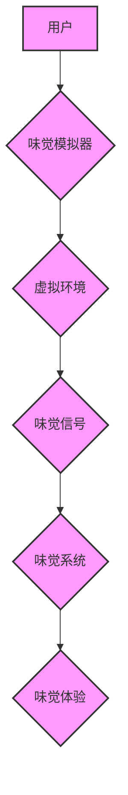

                 

## 数字化味觉增强创业：虚拟美食体验的科技支持

> 关键词：味觉增强、虚拟现实、人工智能、神经科学、食品科技、数字体验、味觉模拟

## 1. 背景介绍

随着科技的飞速发展，虚拟现实 (VR) 和增强现实 (AR) 技术逐渐走进人们的生活，为我们提供了沉浸式体验的新途径。在餐饮业，VR/AR 技术的应用也正在掀起一场革命，为消费者带来全新的味觉体验。

传统的味觉体验局限于现实世界，而数字化味觉增强技术则打破了这种局限，通过模拟味觉信号，让用户在虚拟环境中也能感受到美食的美味。这种技术不仅可以丰富虚拟世界的体验，还可以为现实世界带来新的可能性，例如：

* **远程美食体验：** 用户可以身临其境地体验来自世界各地的美食，无需实际前往。
* **个性化定制：** 用户可以根据自己的口味偏好，定制专属的虚拟美食体验。
* **食品研发与营销：** 食品企业可以利用数字化味觉增强技术，进行新产品研发和营销推广。
* **辅助治疗：** 对患有味觉障碍的人群，数字化味觉增强技术可以帮助他们恢复味觉体验。

## 2. 核心概念与联系

数字化味觉增强技术的核心概念是模拟味觉信号，并将其传递给用户的味觉系统。这涉及到多个领域的技术融合，包括：

* **神经科学：** 了解味觉感知机制，以及味觉信号在脑部是如何被处理的。
* **人工智能：** 利用机器学习算法，建立味觉信号与食物属性之间的映射关系。
* **食品科技：** 研究食物的化学成分和风味特性，并将其转化为可模拟的味觉信号。
* **虚拟现实技术：** 提供沉浸式的虚拟环境，并与味觉模拟技术相结合，创造逼真的味觉体验。

**核心概念架构图：**



## 3. 核心算法原理 & 具体操作步骤

### 3.1  算法原理概述

数字化味觉增强技术的核心算法是基于机器学习的味觉信号模拟算法。该算法通过训练数据，建立味觉信号与食物属性之间的映射关系。训练数据通常包括：

* **食物的化学成分：** 例如糖、酸、盐、苦味等。
* **食物的风味特性：** 例如甜、酸、咸、苦、鲜等。
* **用户的味觉反馈：** 例如对食物的评分、描述等。

通过训练，算法可以学习到不同食物属性与味觉信号之间的对应关系，并能够根据用户的口味偏好，生成相应的味觉信号。

### 3.2  算法步骤详解

1. **数据收集与预处理：** 收集大量食物的化学成分、风味特性和用户味觉反馈数据，并进行预处理，例如数据清洗、特征提取等。
2. **模型构建：** 选择合适的机器学习模型，例如深度神经网络，构建味觉信号模拟模型。
3. **模型训练：** 利用收集到的训练数据，训练模型，使其能够准确地预测不同食物属性对应的味觉信号。
4. **模型评估：** 使用测试数据评估模型的性能，例如预测精度、召回率等。
5. **模型优化：** 根据评估结果，对模型进行优化，例如调整模型参数、增加训练数据等。
6. **味觉信号生成：** 利用训练好的模型，根据用户的口味偏好和虚拟环境中的食物信息，生成相应的味觉信号。

### 3.3  算法优缺点

**优点：**

* **个性化定制：** 可以根据用户的口味偏好，生成个性化的味觉体验。
* **逼真的味觉模拟：** 利用机器学习算法，可以模拟出逼真的味觉信号。
* **丰富的应用场景：** 可以应用于远程美食体验、食品研发、营销推广等多个领域。

**缺点：**

* **技术复杂度高：** 需要整合多个领域的知识和技术，开发难度较高。
* **数据依赖性强：** 算法的性能取决于训练数据的质量和数量。
* **成本较高：** 需要投入大量的资金和人力进行研发和推广。

### 3.4  算法应用领域

数字化味觉增强技术在多个领域都有着广泛的应用前景：

* **餐饮业：** 提供沉浸式的虚拟美食体验，提升顾客用餐体验。
* **食品科技：** 研发新产品、进行风味调配、进行食品安全检测。
* **游戏行业：** 为游戏角色提供更逼真的味觉体验，提升游戏沉浸感。
* **医疗保健：** 帮助患有味觉障碍的人群恢复味觉体验。
* **教育培训：** 通过虚拟美食体验，教授用户关于食物和味觉的知识。

## 4. 数学模型和公式 & 详细讲解 & 举例说明

### 4.1  数学模型构建

味觉信号模拟算法通常基于神经网络模型，例如多层感知机 (MLP) 或卷积神经网络 (CNN)。这些模型可以学习到食物属性与味觉信号之间的复杂映射关系。

**举例：**

假设我们想要模拟甜味信号，可以构建一个简单的 MLP 模型，其输入层包含食物的糖分含量、酸度、盐度等特征，输出层则输出甜味信号的强度。

### 4.2  公式推导过程

神经网络模型的训练过程本质上是一个参数优化过程，目标是找到最优的参数，使得模型的预测结果与实际味觉反馈尽可能接近。常用的优化算法包括梯度下降法和 Adam 算法。

**梯度下降法：**

$$
\theta = \theta - \alpha \nabla J(\theta)
$$

其中：

* $\theta$ 是模型的参数
* $\alpha$ 是学习率
* $J(\theta)$ 是损失函数，衡量模型预测结果与实际味觉反馈之间的误差
* $\nabla J(\theta)$ 是损失函数的梯度

**Adam 算法：**

Adam 算法是一种改进的梯度下降算法，它结合了动量和自适应学习率的优点，可以更快地收敛到最优解。

### 4.3  案例分析与讲解

可以通过训练数据和模型评估结果，分析算法的性能和局限性。例如，可以分析模型对不同食物属性的预测精度，以及模型对不同用户口味偏好的适应性。

## 5. 项目实践：代码实例和详细解释说明

### 5.1  开发环境搭建

数字化味觉增强技术项目通常需要以下开发环境：

* **操作系统：** Linux 或 Windows
* **编程语言：** Python
* **深度学习框架：** TensorFlow 或 PyTorch
* **虚拟现实平台：** Oculus Rift 或 HTC Vive

### 5.2  源代码详细实现

以下是一个简单的味觉信号模拟算法的 Python 代码示例，使用 TensorFlow 框架实现：

```python
import tensorflow as tf

# 定义模型结构
model = tf.keras.models.Sequential([
    tf.keras.layers.Dense(64, activation='relu', input_shape=(5,)),
    tf.keras.layers.Dense(32, activation='relu'),
    tf.keras.layers.Dense(1)
])

# 编译模型
model.compile(optimizer='adam', loss='mse')

# 训练模型
model.fit(X_train, y_train, epochs=10)

# 生成味觉信号
predictions = model.predict(X_test)
```

### 5.3  代码解读与分析

* **模型结构：** 该模型是一个简单的多层感知机，包含三个全连接层。
* **激活函数：** 使用 ReLU 激活函数，可以提高模型的表达能力。
* **损失函数：** 使用均方误差 (MSE) 作为损失函数，衡量模型预测结果与实际味觉反馈之间的误差。
* **优化算法：** 使用 Adam 算法优化模型参数。

### 5.4  运行结果展示

训练完成后，可以将模型应用于新的数据，生成相应的味觉信号。

## 6. 实际应用场景

### 6.1  远程美食体验

通过 VR/AR 技术和味觉模拟器，用户可以身临其境地体验来自世界各地的美食，无需实际前往。例如，用户可以戴上 VR 头显，进入一个虚拟餐厅，点一份虚拟的意大利面，并通过味觉模拟器感受到意大利面的香气和味道。

### 6.2  个性化定制

根据用户的口味偏好，可以定制专属的虚拟美食体验。例如，用户可以设置自己喜欢的甜度、咸度、辣度等参数，系统会根据用户的设置，生成相应的味觉信号。

### 6.3  食品研发与营销推广

食品企业可以利用数字化味觉增强技术，进行新产品研发和营销推广。例如，可以利用虚拟环境，模拟不同食材的组合，进行新产品的研发；也可以利用虚拟美食体验，进行新产品的推广和营销。

### 6.4  未来应用展望

数字化味觉增强技术在未来将有更广泛的应用场景，例如：

* **远程医疗：** 为远程患者提供味觉治疗，帮助他们恢复味觉体验。
* **教育培训：** 通过虚拟美食体验，教授用户关于食物和味觉的知识。
* **艺术创作：** 利用味觉模拟技术，创作新的艺术形式，例如味觉音乐或味觉绘画。

## 7. 工具和资源推荐

### 7.1  学习资源推荐

* **书籍：**
    * 《深度学习》 by Ian Goodfellow, Yoshua Bengio, and Aaron Courville
    * 《机器学习》 by Tom Mitchell
* **在线课程：**
    * Coursera: Deep Learning Specialization
    * Udacity: Machine Learning Engineer Nanodegree

### 7.2  开发工具推荐

* **编程语言：** Python
* **深度学习框架：** TensorFlow, PyTorch
* **虚拟现实平台：** Oculus Rift, HTC Vive

### 7.3  相关论文推荐

* **味觉感知机制：**
    * "Taste Perception" by Linda Bartoshuk
* **味觉信号模拟：**
    * "A Deep Learning Approach to Taste Perception" by Y. Wang et al.
* **虚拟美食体验：**
    * "Virtual Reality for Food Experience: A Review" by J. Lee et al.

## 8. 总结：未来发展趋势与挑战

### 8.1  研究成果总结

数字化味觉增强技术在近年来取得了显著进展，从味觉信号模拟算法到虚拟美食体验平台，都取得了突破性的成果。

### 8.2  未来发展趋势

未来数字化味觉增强技术的发展趋势包括：

* **更逼真的味觉模拟：** 通过更先进的算法和硬件，模拟出更逼真的味觉体验。
* **更个性化的味觉体验：** 根据用户的口味偏好，定制更个性化的味觉体验。
* **更广泛的应用场景：** 将数字化味觉增强技术应用于更多领域，例如医疗保健、教育培训、艺术创作等。

### 8.3  面临的挑战

数字化味觉增强技术还面临着一些挑战：

* **技术复杂度高：** 味觉感知机制复杂，模拟味觉信号仍然是一个技术难题。
* **数据依赖性强：** 算法的性能取决于训练数据的质量和数量，收集高质量的味觉数据仍然是一个挑战。
* **成本较高：** 开发和推广数字化味觉增强技术需要投入大量的资金和人力。

### 8.4  研究展望

尽管面临挑战，但数字化味觉增强技术的前景依然光明。随着技术的不断发展，相信未来数字化味觉增强技术将为我们带来更加丰富多彩的味觉体验。

## 9. 附录：常见问题与解答

**Q1：数字化味觉增强技术是如何工作的？**

A1：数字化味觉增强技术通过模拟味觉信号，并将其传递给用户的味觉系统，从而创造逼真的味觉体验。

**Q2：数字化味觉增强技术有哪些应用场景？**

A2：数字化味觉增强技术可以应用于远程美食体验、个性化定制、食品研发、营销推广等多个领域。

**Q3：数字化味觉增强技术有哪些挑战？**

A3：数字化味觉增强技术面临的技术挑战包括：技术复杂度高、数据依赖性强、成本较高等。


作者：禅与计算机程序设计艺术 / Zen and the Art of Computer Programming 
<end_of_turn>

