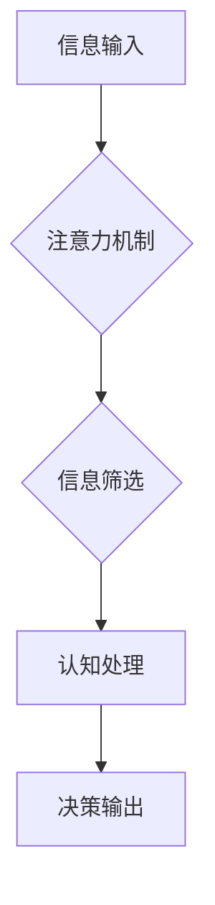

                 

## 1. 背景介绍

在数字化时代，信息爆炸和网络技术的飞速发展，为我们带来了前所未有的便利和机遇。然而，同时也带来了新的挑战，其中最为突出的是注意力分散问题。

### 1.1  注意力经济的兴起

注意力，被誉为21世纪最宝贵的资源。在信息过载的时代，人们的注意力受到来自各个方向的竞争，从社交媒体的推送通知到电子邮件的提醒，从新闻网站的滚动条到视频平台的推荐算法，无处不在地争夺着我们的注意力。

这种“注意力经济”的兴起，使得注意力成为了一个可交易的商品。广告商、平台运营商、内容创作者，都在试图通过各种手段获取用户的注意力，并将其转化为商业价值。

### 1.2  注意力分散的危害

注意力分散对个人和社会都带来了负面影响。

* **个人层面:** 
    * 学习效率下降：注意力分散会影响学习的深度和效率，难以集中精力理解和记忆知识。
    * 工作效率降低：注意力难以集中会导致工作效率下降，难以完成任务，增加出错率。
    * 精神状态不佳：长期注意力分散会导致焦虑、抑郁等精神状态问题。
* **社会层面:** 
    * 知识传播受阻：注意力分散会导致人们难以深入思考和理解信息，影响知识的传播和积累。
    * 创新能力下降：注意力分散会阻碍人们进行深入研究和探索，降低创新的能力。
    * 社会分化加剧：注意力经济的运作模式，可能会导致人们陷入信息茧房，加剧社会分化。

## 2. 核心概念与联系

注意力分散问题本质上是一个信息处理和认知能力的挑战。

### 2.1  注意力机制

注意力机制是一种模仿人类注意力机制的机器学习模型，它能够学习到哪些信息对当前任务最为重要，并将其重点关注。

### 2.2  认知心理学

认知心理学研究人类的思维过程，包括注意力、记忆、语言、决策等。

### 2.3  神经科学

神经科学研究大脑的结构和功能，包括注意力相关的脑区和神经机制。

**Mermaid 流程图:**



## 3. 核心算法原理 & 具体操作步骤

### 3.1  算法原理概述

注意力机制的核心原理是通过一个加权机制，将输入信息分配不同的权重，从而突出重要信息，抑制无关信息。

### 3.2  算法步骤详解

1. **输入数据:** 将输入数据（例如文本、图像）转换为向量表示。
2. **计算注意力权重:** 使用注意力函数计算每个输入元素的注意力权重，权重越高表示该元素越重要。
3. **加权求和:** 将输入元素与注意力权重相乘，并求和，得到一个加权后的输出向量。
4. **输出结果:** 将加权后的输出向量作为后续处理的输入。

### 3.3  算法优缺点

**优点:**

* 可以有效地提高模型对重要信息的关注度。
* 可以处理长序列数据，例如文本和视频。
* 可以学习到不同任务中不同类型的注意力模式。

**缺点:**

* 计算复杂度较高。
* 需要大量的训练数据。
* 难以解释注意力权重的含义。

### 3.4  算法应用领域

注意力机制在自然语言处理、计算机视觉、语音识别等领域都有广泛的应用。

* **机器翻译:** 使用注意力机制可以提高机器翻译的准确性和流畅度。
* **文本摘要:** 使用注意力机制可以生成更准确和相关的文本摘要。
* **图像识别:** 使用注意力机制可以提高图像识别的准确性和鲁棒性。

## 4. 数学模型和公式 & 详细讲解 & 举例说明

### 4.1  数学模型构建

注意力机制的数学模型通常基于一个注意力函数，该函数将输入元素映射到一个注意力权重。

**注意力函数:**

$$
\text{Attention}(Q, K, V) = \text{softmax}\left(\frac{Q K^T}{\sqrt{d_k}}\right) V
$$

其中:

* $Q$：查询向量
* $K$：键向量
* $V$：值向量
* $d_k$：键向量的维度
* $\text{softmax}$：softmax函数，用于将注意力权重归一化到[0, 1]之间。

### 4.2  公式推导过程

注意力函数的推导过程基于以下几个假设：

* 查询向量 $Q$ 代表当前需要关注的信息。
* 键向量 $K$ 代表输入元素的特征表示。
* 值向量 $V$ 代表输入元素的实际内容。

注意力函数的目标是计算每个输入元素与查询向量之间的相关性，并将其作为注意力权重。

* **点积:** $QK^T$ 计算查询向量与每个键向量的点积，表示相关性得分。
* **缩放:**  $\frac{QK^T}{\sqrt{d_k}}$ 通过缩放操作，将相关性得分调整到一个合理的范围。
* **softmax:** $\text{softmax}$ 函数将相关性得分转换为注意力权重，使得权重之和为1。

### 4.3  案例分析与讲解

假设我们有一个句子 "我爱学习编程"，想要计算每个单词的注意力权重。

* $Q$：查询向量表示当前需要关注的词语。
* $K$：每个单词的特征向量表示。
* $V$：每个单词的词义向量表示。

通过计算注意力函数，可以得到每个单词的注意力权重，例如 "学习" 的注意力权重可能比 "我" 或 "编程" 更高，因为 "学习" 与当前任务（例如理解句子含义）更相关。

## 5. 项目实践：代码实例和详细解释说明

### 5.1  开发环境搭建

* Python 3.x
* TensorFlow 或 PyTorch

### 5.2  源代码详细实现

```python
import tensorflow as tf

# 定义注意力函数
def attention_function(query, keys, values):
    # 计算相关性得分
    scores = tf.matmul(query, keys, transpose_b=True) / tf.math.sqrt(tf.cast(keys.shape[-1], tf.float32))
    # 应用 softmax 函数
    attention_weights = tf.nn.softmax(scores, axis=-1)
    # 加权求和
    context_vector = tf.matmul(attention_weights, values)
    return context_vector

# 示例代码
query = tf.constant([[1, 2, 3]])
keys = tf.constant([[4, 5, 6], [7, 8, 9], [10, 11, 12]])
values = tf.constant([[13, 14, 15], [16, 17, 18], [19, 20, 21]])

context_vector = attention_function(query, keys, values)
print(context_vector)
```

### 5.3  代码解读与分析

* `attention_function` 函数实现了注意力机制的核心逻辑。
* `tf.matmul` 函数计算矩阵乘法，用于计算相关性得分。
* `tf.nn.softmax` 函数将相关性得分转换为注意力权重。
* `tf.math.sqrt` 函数计算平方根，用于缩放操作。
* 示例代码演示了如何使用 `attention_function` 函数计算注意力权重。

### 5.4  运行结果展示

运行上述代码，输出结果为一个 1x3 的张量，表示每个输入元素的加权后的输出向量。

## 6. 实际应用场景

### 6.1  新闻推荐系统

注意力机制可以用于新闻推荐系统，根据用户的阅读历史和兴趣偏好，推荐更相关的新闻内容。

### 6.2  个性化教育

注意力机制可以用于个性化教育，根据学生的学习进度和理解能力，提供个性化的学习内容和辅导。

### 6.3  医疗诊断

注意力机制可以用于医疗诊断，帮助医生识别病人的关键症状和体征，提高诊断的准确性。

### 6.4  未来应用展望

注意力机制在未来将有更广泛的应用，例如：

* **自动驾驶:** 用于识别道路上的关键信息，例如行人、车辆和交通信号。
* **机器人控制:** 用于帮助机器人理解环境信息，并做出更精准的控制动作。
* **人机交互:** 用于开发更自然和智能的人机交互系统。

## 7. 工具和资源推荐

### 7.1  学习资源推荐

* **书籍:**
    * "Deep Learning" by Ian Goodfellow, Yoshua Bengio, and Aaron Courville
    * "Attention Is All You Need" by Vaswani et al.
* **在线课程:**
    * Coursera: Deep Learning Specialization
    * Udacity: Deep Learning Nanodegree

### 7.2  开发工具推荐

* **TensorFlow:** https://www.tensorflow.org/
* **PyTorch:** https://pytorch.org/

### 7.3  相关论文推荐

* "Attention Is All You Need" (https://arxiv.org/abs/1706.03762)
* "BERT: Pre-training of Deep Bidirectional Transformers for Language Understanding" (https://arxiv.org/abs/1810.04805)

## 8. 总结：未来发展趋势与挑战

### 8.1  研究成果总结

注意力机制在近年来取得了显著的进展，并在多个领域取得了优异的性能。

### 8.2  未来发展趋势

* **更有效的注意力机制:** 研究更有效的注意力机制，例如自注意力机制、多头注意力机制等。
* **注意力机制的解释性:** 研究注意力机制的解释性，使得注意力权重的含义更加清晰。
* **注意力机制的应用扩展:** 将注意力机制应用到更多领域，例如自动驾驶、机器人控制等。

### 8.3  面临的挑战

* **计算复杂度:** 现有的注意力机制计算复杂度较高，难以应用于大规模数据处理。
* **数据依赖性:** 注意力机制需要大量的训练数据，难以应用于数据稀缺的领域。
* **可解释性:** 注意力机制的决策过程难以解释，难以被人类理解和信任。

### 8.4  研究展望

未来研究将重点关注解决注意力机制的计算复杂度、数据依赖性和可解释性等挑战，并将其应用到更多领域，推动人工智能技术的发展。

## 9. 附录：常见问题与解答

### 9.1  Q1: 注意力机制和深度学习的关系是什么？

**A1:** 注意力机制是一种深度学习模型中的重要组件，它可以帮助模型更好地理解和处理序列数据。

### 9.2  Q2: 注意力机制有哪些不同的类型？

**A2:** 常见的注意力机制类型包括自注意力机制、多头注意力机制、位置感知注意力机制等。

### 9.3  Q3: 注意力机制的应用场景有哪些？

**A3:** 注意力机制在自然语言处理、计算机视觉、语音识别等领域都有广泛的应用。


作者：禅与计算机程序设计艺术 / Zen and the Art of Computer Programming 
<end_of_turn>

