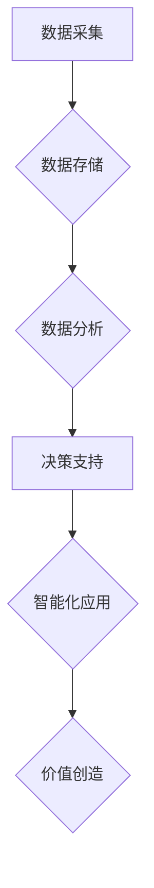

                 

## 数字经济：社会发展的助推器

> 关键词：数字经济、数据驱动、人工智能、云计算、大数据、物联网、区块链

### 1. 背景介绍

21世纪，信息技术飞速发展，互联网、移动互联网、云计算、大数据等技术的蓬勃发展，深刻地改变了人类社会生产、生活方式，催生了全新的经济形态——数字经济。数字经济是指以数字化、网络化、智能化为特征的经济活动，其核心是利用数字技术对生产要素进行优化配置，创造新的价值。

数字经济的兴起，标志着人类社会进入了一个新的发展阶段。它打破了传统经济的地域限制，促进了全球资源的流动和配置，加速了经济全球化进程。同时，数字经济也为社会带来了诸多机遇和挑战，例如：

* **机遇：**
    * **提高生产效率：** 数字技术可以自动化生产流程，提高生产效率和降低成本。
    * **创造新业态：** 数字经济催生了电商、共享经济、在线教育等新兴业态，为人们创造了新的就业机会。
    * **提升生活品质：** 数字技术可以提供更便捷、高效、个性化的服务，提升人们的生活品质。
* **挑战：**
    * **数字鸿沟：** 数字技术发展不平衡，导致不同地区、不同人群之间存在数字鸿沟，加剧社会不平等。
    * **数据安全：** 数字经济依赖于大数据，数据安全问题日益突出，需要加强数据保护和隐私安全。
    * **伦理道德：** 数字技术发展带来新的伦理道德问题，例如人工智能的伦理问题、网络欺凌等，需要社会共同探讨和解决。

### 2. 核心概念与联系

数字经济的核心概念包括：

* **数据驱动：** 数字经济以数据为核心驱动力，通过收集、分析和利用数据，实现对经济活动的优化配置。
* **网络化：** 数字经济依赖于网络基础设施，通过网络连接不同参与者，实现资源共享和信息流通。
* **智能化：** 数字经济利用人工智能、机器学习等智能技术，提高生产效率、优化决策和提升服务质量。

这些核心概念相互关联，共同构成了数字经济的运行机制。

**Mermaid 流程图**



### 3. 核心算法原理 & 具体操作步骤

数字经济的运行离不开各种算法的支持。以下介绍几种重要的算法及其原理：

#### 3.1  算法原理概述

* **机器学习算法：** 机器学习算法通过训练数据，学习数据的规律，并根据学习到的规律进行预测或分类。常见的机器学习算法包括线性回归、逻辑回归、决策树、支持向量机、神经网络等。
* **深度学习算法：** 深度学习算法是一种更高级的机器学习算法，它利用多层神经网络，能够学习更复杂的模式和特征。深度学习算法在图像识别、语音识别、自然语言处理等领域取得了突破性进展。
* **推荐算法：** 推荐算法通过分析用户的行为数据，预测用户可能感兴趣的内容，并将其推荐给用户。常见的推荐算法包括协同过滤、内容过滤、基于知识的推荐等。

#### 3.2  算法步骤详解

以机器学习算法为例，其基本步骤如下：

1. **数据收集和预处理：** 收集相关数据，并进行清洗、转换、特征工程等预处理操作，以确保数据质量和算法的有效性。
2. **模型选择：** 根据具体任务选择合适的机器学习算法模型。
3. **模型训练：** 使用训练数据训练模型，调整模型参数，使其能够准确地预测或分类。
4. **模型评估：** 使用测试数据评估模型的性能，例如准确率、召回率、F1-score等。
5. **模型部署：** 将训练好的模型部署到实际应用场景中，用于预测或分类新的数据。

#### 3.3  算法优缺点

不同的算法具有不同的优缺点，需要根据具体任务选择合适的算法。

* **机器学习算法：** 优点：能够学习数据的复杂模式，具有较高的预测精度。缺点：需要大量的训练数据，训练过程耗时较长。
* **深度学习算法：** 优点：能够学习更复杂的模式，在某些领域取得了突破性进展。缺点：需要更强大的计算资源，训练过程更加耗时。
* **推荐算法：** 优点：能够根据用户的兴趣推荐个性化的内容，提高用户体验。缺点：容易陷入“推荐陷阱”，导致用户缺乏探索新内容的动力。

#### 3.4  算法应用领域

机器学习、深度学习和推荐算法在各个领域都有广泛的应用，例如：

* **电商：** 商品推荐、用户画像、价格预测
* **金融：** 欺诈检测、风险评估、信用评分
* **医疗：** 疾病诊断、药物研发、患者管理
* **交通：** 智能驾驶、交通流量预测、路线规划

### 4. 数学模型和公式 & 详细讲解 & 举例说明

数字经济的运行可以抽象为各种数学模型，例如：

#### 4.1  数学模型构建

* **数据增长模型：** 描述数据量的增长趋势，例如指数增长模型、Logistic增长模型等。
* **网络效应模型：** 描述网络平台用户数量与平台价值之间的关系，例如Metcalfe's Law。
* **价值创造模型：** 描述数字经济活动如何创造价值，例如价值链模型、商业模式创新模型等。

#### 4.2  公式推导过程

以数据增长模型为例，指数增长模型的公式为：

$$
D(t) = D_0 \cdot e^{rt}
$$

其中：

* $D(t)$ 表示时间 $t$ 时刻的数据量
* $D_0$ 表示初始数据量
* $r$ 表示数据增长率
* $t$ 表示时间

该公式表明，数据量随着时间的推移呈指数增长，增长率 $r$ 是一个常数。

#### 4.3  案例分析与讲解

假设一个社交媒体平台的初始用户数为1000人，用户增长率为10% per year，则根据指数增长模型，该平台的用户数在5年后将达到：

$$
D(5) = 1000 \cdot e^{0.1 \cdot 5} \approx 1649人
$$

### 5. 项目实践：代码实例和详细解释说明

以下是一个使用Python语言实现简单的机器学习算法的代码实例：

#### 5.1  开发环境搭建

需要安装Python语言和机器学习库，例如scikit-learn。

#### 5.2  源代码详细实现

```python
from sklearn.linear_model import LinearRegression
from sklearn.model_selection import train_test_split
import numpy as np

# 生成示例数据
X = np.array([[1], [2], [3], [4], [5]])
y = np.array([2, 4, 5, 4, 5])

# 将数据分成训练集和测试集
X_train, X_test, y_train, y_test = train_test_split(X, y, test_size=0.2)

# 创建线性回归模型
model = LinearRegression()

# 训练模型
model.fit(X_train, y_train)

# 使用模型预测测试集数据
y_pred = model.predict(X_test)

# 打印预测结果
print(y_pred)
```

#### 5.3  代码解读与分析

该代码首先生成示例数据，然后将数据分成训练集和测试集。接着创建线性回归模型，并使用训练集数据训练模型。最后使用训练好的模型预测测试集数据，并打印预测结果。

#### 5.4  运行结果展示

运行该代码后，将输出测试集数据的预测结果。

### 6. 实际应用场景

数字经济的应用场景非常广泛，例如：

* **电商平台：** 利用数据分析和推荐算法，为用户提供个性化的商品推荐，提高用户体验和转化率。
* **金融机构：** 利用机器学习算法，进行风险评估、欺诈检测、信用评分等，提高金融服务的效率和安全性。
* **医疗机构：** 利用人工智能技术，辅助医生进行疾病诊断、药物研发、患者管理等，提高医疗服务的质量和效率。
* **交通运输：** 利用智能交通系统，优化交通流量，提高道路安全和出行效率。

### 6.4  未来应用展望

数字经济的发展前景广阔，未来将更加深入地融入各个领域，例如：

* **工业互联网：** 利用物联网、云计算、大数据等技术，实现工业生产的智能化、自动化和数字化。
* **智慧城市：** 利用数字技术，建设智慧交通、智慧医疗、智慧教育等城市服务，提高城市管理水平和居民生活质量。
* **数字文化：** 利用数字技术，推动文化产业发展，丰富人们的精神文化生活。

### 7. 工具和资源推荐

#### 7.1  学习资源推荐

* **在线课程：** Coursera、edX、Udacity等平台提供丰富的数字经济相关课程。
* **书籍：** 《数字经济》、《数据驱动》、《人工智能》等书籍可以帮助读者深入了解数字经济相关知识。
* **学术期刊：** 《Communications of the ACM》、《Journal of Management Information Systems》等期刊发表了大量关于数字经济的研究成果。

#### 7.2  开发工具推荐

* **Python：** 广泛应用于数据分析、机器学习、人工智能等领域。
* **R：** 专注于统计分析和数据可视化。
* **Hadoop：** 用于大数据处理和分析。
* **Spark：** 用于大规模数据处理和机器学习。

#### 7.3  相关论文推荐

* **The Digital Economy: A Review of the Literature**
* **The Impact of Digital Technologies on Economic Growth**
* **The Future of Work in the Digital Economy**

### 8. 总结：未来发展趋势与挑战

数字经济正在深刻地改变着人类社会，为经济发展带来了新的机遇和挑战。

#### 8.1  研究成果总结

数字经济的研究取得了显著成果，例如：

* **数据分析技术：** 能够从海量数据中挖掘出有价值的信息，为决策提供支持。
* **机器学习算法：** 能够自动学习数据的规律，提高预测和分类的准确性。
* **云计算平台：** 提供了强大的计算资源和存储空间，支持数字经济的快速发展。

#### 8.2  未来发展趋势

数字经济的未来发展趋势包括：

* **更加智能化：** 人工智能技术将更加深入地融入数字经济各个环节，提高效率和智能化水平。
* **更加个性化：** 数字经济将更加注重用户个性化需求，提供更加定制化的服务。
* **更加融合化：** 数字经济将与其他经济领域更加融合，形成更加完整的产业生态系统。

#### 8.3  面临的挑战

数字经济发展也面临着一些挑战，例如：

* **数据安全：** 数据泄露和隐私保护问题日益突出，需要加强数据安全技术和法律法规建设。
* **数字鸿沟：** 数字技术发展不平衡，导致不同地区、不同人群之间存在数字鸿沟，需要采取措施缩小数字鸿沟。
* **伦理道德：** 数字技术发展带来新的伦理道德问题，需要社会共同探讨和解决。

#### 8.4  研究展望

未来，需要加强对数字经济的理论研究和实践探索，推动数字经济的健康发展，为人类社会创造更加美好的未来。

### 9. 附录：常见问题与解答

* **什么是数字经济？** 数字经济是指以数字化、网络化、智能化为特征的经济活动，其核心是利用数字技术对生产要素进行优化配置，创造新的价值。
* **数字经济有哪些核心概念？** 数字经济的核心概念包括数据驱动、网络化和智能化。
* **数字经济有哪些应用场景？** 数字经济的应用场景非常广泛，例如电商平台、金融机构、医疗机构、交通运输等。
* **数字经济有哪些发展趋势？** 数字经济的未来发展趋势包括更加智能化、更加个性化和更加融合化。
* **数字经济有哪些挑战？** 数字经济发展也面临着一些挑战，例如数据安全、数字鸿沟和伦理道德问题。


作者：禅与计算机程序设计艺术 / Zen and the Art of Computer Programming 
<end_of_turn>

