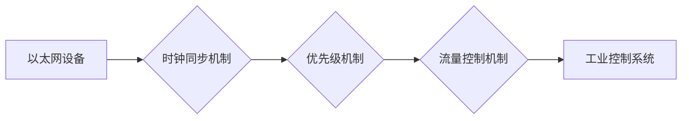

                 

## 时间敏感网络（TSN）：工业级实时以太网

> 关键词：时间敏感网络（TSN）、实时以太网、工业自动化、工业互联网、网络时延、网络同步、IEEE 802.1AS、IEEE 802.1Qbv、工业控制系统

## 1. 背景介绍

随着工业自动化和智能制造的快速发展，对工业网络的实时性和可靠性要求越来越高。传统的以太网协议虽然在数据传输方面表现出色，但其缺乏对时延和抖动的严格控制，难以满足工业控制系统的实时需求。为了解决这一问题，IEEE 802.1 标准组织制定了时间敏感网络（Time-Sensitive Networking，TSN）标准，旨在为工业自动化应用提供一个可靠、实时、低延迟的网络解决方案。

TSN 基于现有的以太网基础，通过引入新的时钟同步机制、流量控制机制和优先级机制，实现对网络流量的严格控制，从而满足工业控制系统的实时性要求。TSN 标准的推出，为工业自动化领域带来了新的发展机遇，推动了工业互联网和智能制造的快速发展。

## 2. 核心概念与联系

### 2.1 核心概念

* **实时性 (Real-Time):** 指网络能够在规定时间内可靠地传输数据的能力。对于工业控制系统来说，实时性至关重要，因为任何延迟都可能导致设备故障或生产事故。
* **时延 (Latency):** 指数据从发送端到接收端传输所花费的时间。TSN 旨在将网络时延降至最低，以满足工业控制系统的实时需求。
* **抖动 (Jitter):** 指网络传输时延的波动。抖动会影响数据的准确性和可靠性，TSN 通过引入时钟同步机制来减少抖动。
* **流量控制 (Traffic Shaping):** 指对网络流量进行管理，以确保关键数据能够及时传输。TSN 通过引入优先级机制和流量控制机制来保证关键数据的实时性。

### 2.2 架构

TSN 的架构基于现有的以太网基础，并引入了以下关键组件：

* **时钟同步机制 (IEEE 802.1AS):** 用于实现网络节点之间的时间同步，确保数据传输的时序准确性。
* **优先级机制 (IEEE 802.1Qbv):** 用于对网络流量进行优先级划分，确保关键数据能够优先传输。
* **流量控制机制 (IEEE 802.1Qci):** 用于对网络流量进行控制，以确保关键数据能够及时传输。

**TSN 架构流程图**



## 3. 核心算法原理 & 具体操作步骤

### 3.1 算法原理概述

TSN 的核心算法原理主要包括时钟同步算法、优先级调度算法和流量控制算法。

* **时钟同步算法:** 

TSN 使用 IEEE 802.1AS 标准定义的时钟同步机制，通过网络节点之间的时钟校准，实现网络节点之间的时间同步。该算法基于 PTP（Precision Time Protocol）协议，通过发送同步信号和校准信号，使网络节点的时钟误差保持在可接受范围内。

* **优先级调度算法:** 

TSN 使用 IEEE 802.1Qbv 标准定义的优先级调度机制，对网络流量进行优先级划分，确保关键数据能够优先传输。该算法将网络流量分为不同的优先级，并根据优先级进行调度，优先处理高优先级的流量。

* **流量控制算法:** 

TSN 使用 IEEE 802.1Qci 标准定义的流量控制机制，对网络流量进行控制，以确保关键数据能够及时传输。该算法通过设置流量限制和缓冲区大小，控制网络流量的传输速率，避免网络拥塞。

### 3.2 算法步骤详解

**时钟同步算法步骤:**

1. **节点发现:** 网络节点通过广播消息发现其他节点。
2. **同步信号传输:** 一台节点作为时钟源，发送同步信号到网络中。
3. **校准信号传输:** 节点接收同步信号后，发送校准信号到时钟源，校准自身时钟。
4. **时钟校准:** 时钟源根据接收到的校准信号，调整自身时钟，并向网络中广播新的同步信号。
5. **持续同步:** 节点之间持续发送同步和校准信号，保持网络时钟同步。

**优先级调度算法步骤:**

1. **流量标记:** 数据包根据其优先级进行标记。
2. **优先级队列:** 交换机根据优先级划分多个队列，将数据包放入相应的队列。
3. **调度机制:** 交换机根据队列的优先级，调度数据包进行传输。

**流量控制算法步骤:**

1. **流量限制:** 设置每个流量流的传输速率限制。
2. **缓冲区管理:** 为每个流量流分配缓冲区，控制数据包的积压量。
3. **流量控制机制:** 根据缓冲区大小和流量限制，控制数据包的传输速率。

### 3.3 算法优缺点

**时钟同步算法:**

* **优点:** 能够实现高精度的时间同步，满足工业控制系统的实时需求。
* **缺点:** 需要额外的硬件支持，部署成本较高。

**优先级调度算法:**

* **优点:** 能够保证关键数据优先传输，提高网络效率。
* **缺点:** 可能会导致非关键数据传输延迟。

**流量控制算法:**

* **优点:** 能够防止网络拥塞，保证网络稳定性。
* **缺点:** 可能导致数据包丢包，降低网络吞吐量。

### 3.4 算法应用领域

TSN 算法广泛应用于工业自动化领域，例如：

* **工业控制系统 (ICS):** 用于控制工业生产过程，需要实时性和可靠性。
* **机器人控制系统:** 用于控制机器人的运动和操作，需要高精度的时间同步。
* **智能制造:** 用于实现工厂自动化和智能化，需要实时数据传输和处理。

## 4. 数学模型和公式 & 详细讲解 & 举例说明

### 4.1 数学模型构建

TSN 的时钟同步算法基于 PTP 协议，其核心数学模型是基于时间差的同步算法。假设两个节点 A 和 B 之间的时钟偏差为 Δt，则节点 A 发送一个同步信号到节点 B，节点 B 接收该信号的时间为 t_B，节点 A 发送该信号的时间为 t_A。则节点 B 的时钟偏差为：

$$
\Delta t = t_B - t_A
$$

### 4.2 公式推导过程

为了消除时钟偏差，需要对节点 B 的时钟进行校准。校准过程可以通过以下公式进行计算：

$$
t_B' = t_B - \Delta t
$$

其中，t_B' 是校准后的节点 B 的时间。

### 4.3 案例分析与讲解

假设节点 A 的时钟精度为 1 μs，节点 B 的时钟精度为 10 μs，节点 A 发送一个同步信号到节点 B，节点 B 接收该信号的时间为 t_B = 100 ms，节点 A 发送该信号的时间为 t_A = 99.9 ms。则节点 B 的时钟偏差为：

$$
\Delta t = t_B - t_A = 100 ms - 99.9 ms = 0.1 ms
$$

根据公式，节点 B 的校准时间为：

$$
t_B' = t_B - \Delta t = 100 ms - 0.1 ms = 99.9 ms
$$

通过校准，节点 B 的时钟偏差被消除，实现了网络节点之间的时间同步。

## 5. 项目实践：代码实例和详细解释说明

### 5.1 开发环境搭建

TSN 项目开发环境搭建需要以下软件和硬件：

* **操作系统:** Linux
* **网络设备:** 支持 TSN 功能的交换机和网卡
* **开发工具:** 
    * **编译器:** GCC 或 Clang
    * **调试工具:** GDB 或 LLDB
    * **网络分析工具:** Wireshark

### 5.2 源代码详细实现

以下是一个简单的 TSN 代码实例，演示了如何使用 TSN API 发送和接收数据包：

```c
#include <stdio.h>
#include <stdlib.h>
#include <unistd.h>
#include <string.h>
#include <sys/socket.h>
#include <netinet/in.h>
#include <arpa/inet.h>
#include <linux/if_ether.h>
#include <linux/ip.h>
#include <linux/udp.h>
#include <linux/if_packet.h>

#define ETH_ALEN 6
#define IP_HDRLEN 20
#define UDP_HDRLEN 8

int main() {
    int sockfd;
    struct sockaddr_ll socket_address;
    struct ethhdr eth_header;
    struct iphdr ip_header;
    struct udphdr udp_header;
    char data[1024];

    // 创建套接字
    sockfd = socket(AF_PACKET, SOCK_RAW, htons(ETH_P_ALL));
    if (sockfd == -1) {
        perror("socket creation failed");
        exit(1);
    }

    // 设置套接字地址
    memset(&socket_address, 0, sizeof(socket_address));
    socket_address.sll_family = AF_PACKET;
    socket_address.sll_protocol = htons(ETH_P_ALL);
    socket_address.sll_ifindex = if_nametoindex("eth0"); // 替换为您的网卡名称

    // 发送数据包
    memset(&eth_header, 0, sizeof(eth_header));
    memcpy(eth_header.h_source, "00:11:22:33:44:55", ETH_ALEN); // 替换为您的源 MAC 地址
    memcpy(eth_header.h_dest, "00:11:22:33:44:66", ETH_ALEN); // 替换为目标 MAC 地址
    eth_header.h_proto = htons(ETH_P_IP);

    memset(&ip_header, 0, sizeof(ip_header));
    ip_header.version = 4;
    ip_header.ihl = IP_HDRLEN / 4;
    ip_header.tot_len = sizeof(ip_header) + sizeof(udp_header) + strlen(data);
    ip_header.protocol = IPPROTO_UDP;

    memset(&udp_header, 0, sizeof(udp_header));
    udp_header.source = htons(5000);
    udp_header.dest = htons(6000);
    udp_header.len = htons(sizeof(udp_header) + strlen(data));

    // 发送数据包
    sendto(sockfd, &eth_header, sizeof(eth_header), 0, (struct sockaddr *)&socket_address, sizeof(socket_address));

    // 关闭套接字
    close(sockfd);

    return 0;
}
```

### 5.3 代码解读与分析

该代码实例演示了如何使用 Linux 的套接字 API 发送一个 UDP 数据包。

* **创建套接字:** 使用 `socket()` 函数创建了一个 RAW 套接字，用于发送和接收以太网数据包。
* **设置套接字地址:** 使用 `struct sockaddr_ll` 结构体设置套接字地址，指定以太网接口和协议类型。
* **填充数据包头:** 使用 `struct ethhdr`、`struct iphdr` 和 `struct udphdr` 结构体填充以太网、IP 和 UDP 数据包头。
* **发送数据包:** 使用 `sendto()` 函数发送数据包到指定的目标地址。
* **关闭套接字:** 使用 `close()` 函数关闭套接字。

### 5.4 运行结果展示

运行该代码实例后，将发送一个 UDP 数据包到目标地址。可以使用 Wireshark 等网络分析工具捕获和查看发送的数据包。

## 6. 实际应用场景

TSN 已经应用于各种工业自动化场景，例如：

* **工业机器人控制:** TSN 能够保证机器人控制信号的实时性和可靠性，提高机器人的控制精度和响应速度。
* **智能制造:** TSN 可以实现工厂设备之间的实时数据传输和同步，提高生产效率和产品质量。
* **电力系统:** TSN 可以用于电力系统中的保护、控制和监测，提高电力系统的可靠性和安全性。

### 6.4 未来应用展望

随着工业互联网和智能制造的发展，TSN 的应用场景将更加广泛，例如：

* **5G 工业网络:** TSN 将成为 5G 工业网络的关键技术，为工业应用提供高带宽、低延迟、高可靠性的网络连接。
* **边缘计算:** TSN 可以用于边缘计算场景，实现数据在边缘设备之间的实时传输和处理。
* **工业物联网:** TSN 可以为工业物联网设备提供实时数据传输和同步，实现设备之间的互联互通。

## 7. 工具和资源推荐

### 7.1 学习资源推荐

* **IEEE 802.1 TSN 标准文档:** https://standards.ieee.org/standard/802_1as-2011.html
* **TSN 相关书籍:**
    * Time-Sensitive Networking: Architectures, Protocols, and Applications
    * Industrial Ethernet: The Definitive Guide
* **TSN 在线课程:**
    * Coursera: Industrial Ethernet and Time-Sensitive Networking
    * Udemy: Time-Sensitive Networking (TSN) for Industrial Automation

### 7.2 开发工具推荐

* **网络分析工具:** Wireshark
* **嵌入式开发环境:** Eclipse CDT
* **仿真工具:** OPNET, NS-3

### 7.3 相关论文推荐

* **Time-Sensitive Networking (TSN): A Survey**
* **Performance Evaluation of Time-Sensitive Networking (TSN) for Industrial Automation**
* **A Novel Time-Sensitive Networking (TSN) Architecture for Industrial Wireless Sensor Networks**

## 8. 总结：未来发展趋势与挑战

### 8.1 研究成果总结

TSN 标准的制定和发展，为工业自动化领域带来了新的发展机遇，推动了工业互联网和智能制造的快速发展。TSN 能够提供高实时性、高可靠性和低延迟的网络连接，满足工业控制系统的需求。

### 8.2 未来发展趋势

* **TSN 标准的完善:** IEEE 802.1 标准组织将继续完善 TSN 标准，增加新的功能和特性，提高 TSN 的性能和可靠性。
* **TSN 的应用场景扩展:** TSN 将应用于更多工业自动化场景，例如 5G 工业网络、边缘计算和工业物联网。
* **TSN 技术的融合:** TSN 将与其他工业自动化技术融合，例如工业云计算、人工智能和机器学习，形成更加强大的解决方案。

### 8.3 面临的挑战

* **TSN 的部署成本:** TSN 需要额外的硬件支持，部署成本较高。
* **TSN 的复杂性:** TSN 标准比较复杂，需要专业的技术人员进行部署和维护。
* **TSN 的生态系统:** TSN 的生态系统还比较薄弱，需要更多的厂商和开发者参与。

### 8.4 研究展望

未来，TSN 研究将集中在以下几个方面：

* **降低 TSN 的部署成本:** 研究更经济高效的 TSN 部署方案。
* **简化 TSN 的配置和维护:** 研究更易于使用的 TSN 工具和技术。
* **扩展 TSN 的应用场景:** 研究 TSN 在更多工业自动化场景中的应用。


## 9. 附录：常见问题与解答

**Q1: TSN 和工业以太网有什么区别？**

**A1:** 

工业以太网是一种基于以太网协议的工业通信标准，而 TSN 是工业以太网的一种扩展，它在工业以太网的基础上，引入了时钟同步、优先级调度和流量控制机制，以满足工业控制系统的实时性需求。

**Q2: TSN 的应用场景有哪些？**

**A2:** TSN 的应用场景包括工业机器人控制、智能制造、电力系统、医疗设备控制等。

**Q3: TSN 的部署成本高吗？**

**A3:** 

TSN 的部署成本较高，因为它需要额外的硬件支持。但随着技术的成熟，部署成本将会降低。

**Q4: TSN 的生态系统怎么样？**

**A4:** TSN 的生态系统还比较薄弱，需要更多的厂商和开发者参与。


作者：禅与计算机程序设计艺术 / Zen and the Art of Computer Programming<end_of_turn>
<end_of_turn>

