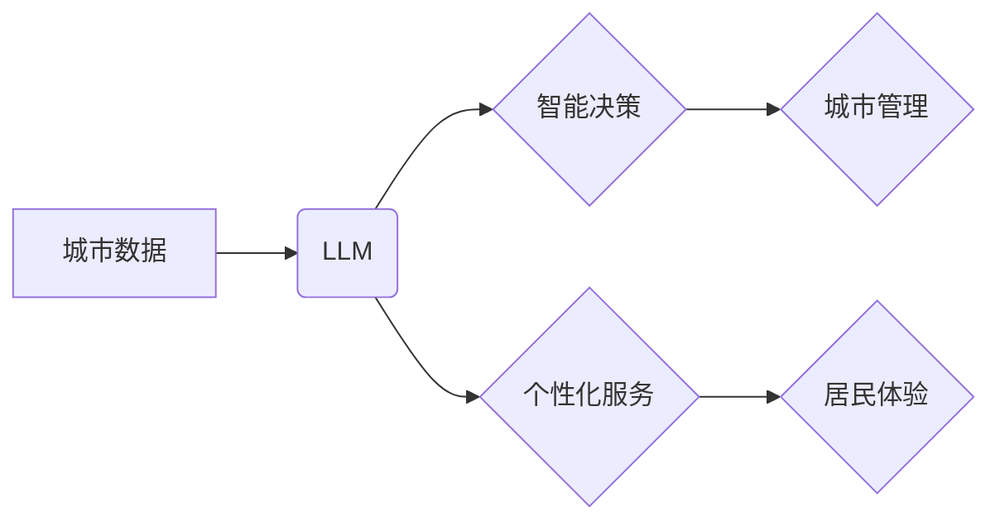

                 

## 智慧城市：LLM 增强的城市管理和服务

> 关键词：智慧城市、LLM、自然语言处理、城市管理、城市服务、人工智能、数据分析

### 1. 背景介绍

随着城市化进程的加速，城市面临着日益严峻的挑战，包括人口增长、资源短缺、环境污染、交通拥堵等。传统城市管理模式已难以满足现代城市发展的需求，因此，智慧城市应运而生。智慧城市利用信息技术和数据分析手段，提升城市管理效率、优化城市服务、提高居民生活质量。

近年来，大型语言模型（LLM）的快速发展为智慧城市建设提供了新的机遇。LLM 拥有强大的自然语言处理能力，能够理解和生成人类语言，并进行复杂的逻辑推理和知识表示。将 LLM 应用于城市管理和服务，可以实现以下方面的突破：

* **智能化城市服务:** LLM 可以理解和响应居民的自然语言请求，提供个性化、便捷的城市服务，例如查询公共交通信息、预约医疗服务、缴纳水电费等。
* **高效的城市决策支持:** LLM 可以分析海量城市数据，识别城市发展趋势和潜在问题，为城市决策提供数据支撑和智能建议。
* **精准的城市管理:** LLM 可以辅助城市管理部门进行风险预警、事件处理、资源调度等工作，提高城市管理效率和精准度。
* **个性化的城市体验:** LLM 可以根据居民的兴趣和需求，提供个性化的城市信息和服务，提升居民的城市生活体验。

### 2. 核心概念与联系

**2.1 智慧城市**

智慧城市是指利用信息技术和互联网等手段，对城市进行数字化、智能化改造，提升城市管理效率、优化城市服务、提高居民生活质量的城市形态。

**2.2 LLM（大型语言模型）**

LLM 是指参数量巨大、训练数据海量的人工智能模型，能够理解和生成人类语言，并进行复杂的逻辑推理和知识表示。

**2.3 核心概念联系**

LLM 可以为智慧城市建设提供强大的技术支撑，通过以下方式实现智慧城市的功能：

* **数据分析和挖掘:** LLM 可以分析城市的海量数据，例如人口数据、交通数据、环境数据等，挖掘城市发展趋势和潜在问题。
* **智能决策支持:** LLM 可以根据数据分析结果，为城市决策提供智能建议，帮助城市管理部门做出更科学、更有效的决策。
* **个性化服务:** LLM 可以理解和响应居民的自然语言请求，提供个性化、便捷的城市服务。
* **智能化管理:** LLM 可以辅助城市管理部门进行风险预警、事件处理、资源调度等工作，提高城市管理效率和精准度。

**2.4 架构图**



### 3. 核心算法原理 & 具体操作步骤

**3.1 算法原理概述**

LLM 的核心算法是基于 Transformer 架构的深度学习模型。Transformer 模型利用自注意力机制，能够捕捉文本序列中的长距离依赖关系，从而实现更准确的语言理解和生成。

**3.2 算法步骤详解**

1. **数据预处理:** 将城市数据进行清洗、格式化和编码，使其能够被 LLM 模型理解。
2. **模型训练:** 使用 Transformer 模型架构，训练 LLM 模型，使其能够理解和生成城市相关的文本信息。
3. **模型评估:** 使用测试数据评估模型的性能，例如准确率、召回率、F1-score 等。
4. **模型部署:** 将训练好的 LLM 模型部署到云平台或边缘设备，使其能够实时处理城市数据和提供服务。

**3.3 算法优缺点**

**优点:**

* 强大的语言理解和生成能力
* 能够捕捉文本序列中的长距离依赖关系
* 可处理海量数据

**缺点:**

* 训练成本高
* 模型参数量大，部署成本高
* 容易受到数据偏差的影响

**3.4 算法应用领域**

* 智能客服
* 文本分类
* 语言翻译
* 文本摘要
* 代码生成

### 4. 数学模型和公式 & 详细讲解 & 举例说明

**4.1 数学模型构建**

LLM 的数学模型主要基于 Transformer 架构，其核心是自注意力机制。自注意力机制可以计算每个词在句子中与其他词之间的相关性，从而捕捉文本序列中的长距离依赖关系。

**4.2 公式推导过程**

自注意力机制的计算公式如下：

$$
Attention(Q, K, V) = softmax(\frac{QK^T}{\sqrt{d_k}})V
$$

其中：

* $Q$：查询矩阵
* $K$：键矩阵
* $V$：值矩阵
* $d_k$：键向量的维度
* $softmax$：softmax 函数

**4.3 案例分析与讲解**

例如，在处理一个句子“我爱吃苹果”时，自注意力机制可以计算每个词与其他词之间的相关性。例如，“我”与“爱”的相关性较高，因为它们共同表达了说话者的情感；“吃”与“苹果”的相关性较高，因为它们共同表达了说话者的行为。

### 5. 项目实践：代码实例和详细解释说明

**5.1 开发环境搭建**

* Python 3.7+
* TensorFlow 或 PyTorch
* CUDA 和 cuDNN

**5.2 源代码详细实现**

```python
import tensorflow as tf

# 定义 Transformer 模型
class Transformer(tf.keras.Model):
    def __init__(self, vocab_size, embedding_dim, num_heads, num_layers):
        super(Transformer, self).__init__()
        self.embedding = tf.keras.layers.Embedding(vocab_size, embedding_dim)
        self.transformer_layers = tf.keras.layers.StackedRNNCells([
            tf.keras.layers.MultiHeadAttention(num_heads=num_heads, key_dim=embedding_dim)
            for _ in range(num_layers)
        ])
        self.dense = tf.keras.layers.Dense(vocab_size)

    def call(self, inputs):
        x = self.embedding(inputs)
        x = self.transformer_layers(x)
        x = self.dense(x)
        return x

# 实例化 Transformer 模型
model = Transformer(vocab_size=10000, embedding_dim=128, num_heads=8, num_layers=6)

# 训练模型
model.compile(optimizer='adam', loss='sparse_categorical_crossentropy', metrics=['accuracy'])
model.fit(train_data, train_labels, epochs=10)
```

**5.3 代码解读与分析**

* 代码定义了一个 Transformer 模型，包含嵌入层、多头注意力层和全连接层。
* 嵌入层将单词转换为向量表示。
* 多头注意力层捕捉文本序列中的长距离依赖关系。
* 全连接层将注意力输出转换为预测概率。
* 代码使用 Adam 优化器和交叉熵损失函数训练模型。

**5.4 运行结果展示**

训练完成后，模型可以用于预测下一个单词，生成文本，翻译语言等任务。

### 6. 实际应用场景

**6.1 智能客服**

LLM 可以构建智能客服系统，理解居民的自然语言问题，并提供准确、及时、个性化的服务。例如，居民可以通过聊天机器人查询公共交通信息、预约医疗服务、缴纳水电费等。

**6.2 城市规划和管理**

LLM 可以分析城市规划数据，识别城市发展趋势和潜在问题，为城市规划和管理提供数据支撑。例如，LLM 可以分析交通流量数据，预测交通拥堵区域，并提出优化交通方案。

**6.3 环境监测和预警**

LLM 可以分析环境监测数据，识别环境污染源，并进行预警。例如，LLM 可以分析空气质量数据，识别空气污染源，并向居民发出预警信息。

**6.4 公共安全保障**

LLM 可以分析公共安全数据，识别潜在安全风险，并进行预警。例如，LLM 可以分析视频监控数据，识别可疑人员，并向警方发出预警信息。

**6.5 未来应用展望**

随着 LLM 技术的不断发展，其在智慧城市建设中的应用场景将更加广泛。例如，LLM 可以用于个性化城市服务、智能交通管理、智慧医疗、智慧教育等领域。

### 7. 工具和资源推荐

**7.1 学习资源推荐**

* **书籍:**
    * 《深度学习》
    * 《自然语言处理》
* **在线课程:**
    * Coursera: 自然语言处理
    * edX: 深度学习
* **开源项目:**
    * TensorFlow
    * PyTorch

**7.2 开发工具推荐**

* **编程语言:** Python
* **深度学习框架:** TensorFlow, PyTorch
* **云平台:** AWS, Azure, GCP

**7.3 相关论文推荐**

* Attention Is All You Need
* BERT: Pre-training of Deep Bidirectional Transformers for Language Understanding
* GPT-3: Language Models are Few-Shot Learners

### 8. 总结：未来发展趋势与挑战

**8.1 研究成果总结**

LLM 在智慧城市建设领域取得了显著成果，例如智能客服、城市规划、环境监测等方面都取得了突破。

**8.2 未来发展趋势**

* **模型规模和能力提升:** 未来 LLM 模型的规模和能力将进一步提升，能够处理更复杂的任务，提供更精准的服务。
* **多模态融合:** LLM 将与其他模态数据（例如图像、音频、视频）融合，实现更全面的城市感知和服务。
* **边缘计算部署:** LLM 将部署到边缘设备，实现更低延迟、更高效率的城市服务。

**8.3 面临的挑战**

* **数据安全和隐私保护:** LLM 的训练和应用需要大量数据，如何保证数据安全和隐私保护是一个重要挑战。
* **算法可解释性和信任度:** LLM 的决策过程往往是复杂的，如何提高算法的可解释性和信任度是一个重要问题。
* **伦理和社会影响:** LLM 的应用可能带来一些伦理和社会问题，例如算法偏见、就业影响等，需要进行深入研究和探讨。

**8.4 研究展望**

未来，LLM 在智慧城市建设领域将继续发挥重要作用，需要加强基础研究，解决技术挑战，并关注伦理和社会影响，推动 LLM 技术的健康发展。

### 9. 附录：常见问题与解答

**9.1 如何选择合适的 LLM 模型？**

选择合适的 LLM 模型需要考虑以下因素：

* 任务类型
* 数据规模
* 计算资源
* 模型精度

**9.2 如何保证 LLM 模型的安全性？**

保证 LLM 模型的安全性需要采取以下措施：

* 数据加密和脱敏
* 模型攻击防御
* 审计和监控

**9.3 如何提高 LLM 模型的准确性？**

提高 LLM 模型的准确性需要采取以下措施：

* 增强训练数据质量
* 优化模型架构
* 调节超参数


作者：禅与计算机程序设计艺术 / Zen and the Art of Computer Programming 
<end_of_turn>

