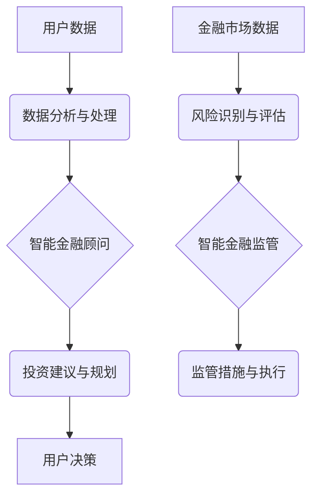

                 

## 关键词：人工智能、金融科技、智能金融顾问、智能监管、机器学习、深度学习、风险管理、数据分析

## 1. 背景介绍

金融行业正在经历一场由人工智能（AI）驱动的变革。随着计算能力的飞速发展和算法的不断进步，AI技术已开始渗透到金融服务的各个方面，从传统的投资管理和风险评估到更前沿的个性化金融规划和欺诈检测。

2050年，AI将彻底改变金融行业的面貌。智能金融顾问将成为主流，为个人和机构提供定制化的财务建议和投资策略。智能监管系统将加强金融市场稳定性，并有效应对新的金融风险。

## 2. 核心概念与联系

**2.1 智能金融顾问**

智能金融顾问是一种基于AI技术的虚拟助手，能够根据用户的个人财务状况、风险偏好和目标，提供个性化的投资建议和理财规划。

**2.2 智能金融监管**

智能金融监管是指利用AI技术，对金融市场进行实时监控和分析，识别潜在的风险和违规行为，并采取相应的措施进行监管。

**2.3 核心概念架构**



## 3. 核心算法原理 & 具体操作步骤

**3.1 算法原理概述**

智能金融顾问和智能金融监管的核心算法原理主要包括：

* **机器学习:** 通过训练模型，从历史数据中学习金融市场规律和用户行为模式。
* **深度学习:** 利用多层神经网络，对复杂的数据进行更深入的分析和理解。
* **自然语言处理:** 理解和处理用户的自然语言输入，提供更人性化的交互体验。

**3.2 算法步骤详解**

**3.2.1 智能金融顾问**

1. **数据收集:** 收集用户的个人财务信息、投资目标、风险偏好等数据。
2. **数据预处理:** 对收集到的数据进行清洗、转换和特征工程，以便模型训练。
3. **模型训练:** 利用机器学习或深度学习算法，训练一个能够预测用户投资收益和风险的模型。
4. **投资建议生成:** 根据用户的个人情况和模型预测结果，生成个性化的投资建议和理财规划。
5. **用户交互:** 通过聊天机器人或其他交互方式，与用户进行沟通，解释建议并提供支持。

**3.2.2 智能金融监管**

1. **数据采集:** 收集金融市场交易数据、用户行为数据、公司财务数据等。
2. **异常检测:** 利用机器学习算法，识别异常交易行为或潜在的风险信号。
3. **风险评估:** 利用深度学习算法，对风险进行量化评估，并预测其潜在影响。
4. **监管措施制定:** 根据风险评估结果，制定相应的监管措施，例如限制交易、冻结账户等。
5. **监管执行:** 通过自动化系统，执行监管措施并进行监控。

**3.3 算法优缺点**

**3.3.1 智能金融顾问**

* **优点:**

    * 提供个性化服务，满足不同用户的需求。
    * 降低投资门槛，让更多人能够获得专业的理财建议。
    * 提高投资效率，节省用户的时间和精力。

* **缺点:**

    * 模型训练需要大量数据，数据质量直接影响模型性能。
    * 算法无法完全预测市场风险，存在一定的投资风险。
    * 用户需要信任AI系统的建议，并承担相应的责任。

**3.3.2 智能金融监管**

* **优点:**

    * 提高监管效率，及时识别和应对风险。
    * 降低监管成本，减少人力资源投入。
    * 增强市场透明度，维护金融市场稳定。

* **缺点:**

    * 算法可能存在偏差，导致监管不公平。
    * 监管系统需要不断更新和完善，以应对新的技术和风险。
    * 需要加强监管制度建设，确保AI技术的合法合规使用。

**3.4 算法应用领域**

* **智能金融顾问:** 个人投资理财、财富管理、退休规划等。
* **智能金融监管:** 欺诈检测、反洗钱、市场操纵等。

## 4. 数学模型和公式 & 详细讲解 & 举例说明

**4.1 数学模型构建**

智能金融顾问和智能金融监管的数学模型通常基于统计学、概率论和机器学习算法。

**4.1.1 投资组合优化模型**

投资组合优化模型的目标是根据用户的风险偏好和投资目标，构建一个能够最大化收益并最小化风险的投资组合。

一个常见的投资组合优化模型是Markowitz模型，其核心公式为：

$$
\min \sigma^2(w)
$$

$$
\text{subject to }
$$

$$
\mu(w) = r
$$

其中：

* $\sigma^2(w)$ 是投资组合的方差，代表风险水平。
* $\mu(w)$ 是投资组合的预期收益率。
* $r$ 是用户的预期收益目标。
* $w$ 是投资组合的资产配置向量。

**4.1.2 风险评估模型**

风险评估模型的目标是量化金融市场或特定资产的风险水平。

一个常用的风险评估模型是Value at Risk (VaR)模型，其核心公式为：

$$
VaR_p(w, T) = \inf \{x \in R | P(L(w, T) \leq -x) \geq p\}
$$

其中：

* $VaR_p(w, T)$ 是在置信水平 $p$ 下，投资组合 $w$ 在时间 $T$ 内的最大可能损失。
* $L(w, T)$ 是投资组合 $w$ 在时间 $T$ 内的损失。
* $P$ 是概率函数。

**4.2 公式推导过程**

以上公式的推导过程涉及到概率论、统计学和线性代数等数学知识。

**4.3 案例分析与讲解**

**4.3.1 投资组合优化模型案例**

假设用户A希望投资100万元，其风险偏好为中等，预期收益目标为5%。利用Markowitz模型，可以根据用户的风险偏好和市场数据，构建一个最优的投资组合，例如：

* 股票投资：60%
* 债券投资：40%

**4.3.2 风险评估模型案例**

假设投资组合B在95%的置信水平下，在1年内最大可能损失为10%。这意味着，在95%的情况下，投资组合B的损失不会超过10%。

## 5. 项目实践：代码实例和详细解释说明

**5.1 开发环境搭建**

* Python 3.7+
* TensorFlow 2.0+
* PyTorch 1.0+
* Jupyter Notebook

**5.2 源代码详细实现**

以下是一个简单的智能金融顾问代码示例，使用Python和TensorFlow框架实现：

```python
import tensorflow as tf

# 定义模型结构
model = tf.keras.models.Sequential([
    tf.keras.layers.Dense(64, activation='relu', input_shape=(10,)),
    tf.keras.layers.Dense(32, activation='relu'),
    tf.keras.layers.Dense(1)
])

# 编译模型
model.compile(optimizer='adam', loss='mse')

# 训练模型
model.fit(X_train, y_train, epochs=10)

# 预测用户投资收益
prediction = model.predict(X_new)
```

**5.3 代码解读与分析**

* 该代码定义了一个简单的深度学习模型，用于预测用户的投资收益。
* 模型输入是用户的个人财务信息和投资目标，输出是预测的投资收益。
* 模型使用Adam优化器和均方误差损失函数进行训练。
* 训练完成后，可以使用模型预测新的用户的投资收益。

**5.4 运行结果展示**

训练完成后，可以将模型应用于实际数据，并评估其预测准确率。

## 6. 实际应用场景

**6.1 智能金融顾问应用场景**

* **个人理财:** 为个人用户提供个性化的投资建议和理财规划，帮助他们实现财务目标。
* **财富管理:** 为高净值客户提供定制化的财富管理服务，包括资产配置、风险管理和税务规划。
* **退休规划:** 为退休前用户提供退休规划建议，帮助他们规划退休后的生活。

**6.2 智能金融监管应用场景**

* **欺诈检测:** 利用机器学习算法识别异常交易行为，防止金融欺诈。
* **反洗钱:** 利用AI技术分析交易数据，识别洗钱行为并进行拦截。
* **市场操纵:** 利用深度学习算法识别市场操纵行为，维护市场公平性。

**6.4 未来应用展望**

未来，智能金融顾问和智能金融监管将更加智能化、个性化和自动化。

* **更精准的预测:** 利用更先进的机器学习算法和更丰富的用户数据，提供更精准的投资建议和风险评估。
* **更个性化的服务:** 利用自然语言处理技术，提供更人性化的交互体验，满足不同用户的个性化需求。
* **更强大的监管能力:** 利用AI技术，加强对金融市场的监管，有效应对新的金融风险。

## 7. 工具和资源推荐

**7.1 学习资源推荐**

* **书籍:**

    * 《深度学习》
    * 《机器学习实战》
    * 《金融时间序列分析》

* **在线课程:**

    * Coursera
    * edX
    * Udacity

**7.2 开发工具推荐**

* **Python:** 

    * TensorFlow
    * PyTorch
    * Scikit-learn

* **数据可视化工具:**

    * Matplotlib
    * Seaborn

**7.3 相关论文推荐**

* **智能金融顾问:**

    * "A Survey of Financial Advisor Chatbots"
    * "Personalized Financial Advice with Deep Reinforcement Learning"

* **智能金融监管:**

    * "AI-Powered Fraud Detection in Finance"
    * "Deep Learning for Financial Risk Management"

## 8. 总结：未来发展趋势与挑战

**8.1 研究成果总结**

近年来，AI技术在金融领域的应用取得了显著进展，智能金融顾问和智能金融监管已经成为现实。

**8.2 未来发展趋势**

未来，AI技术将继续推动金融行业的变革，智能金融顾问和智能金融监管将更加智能化、个性化和自动化。

**8.3 面临的挑战**

* **数据安全和隐私保护:** AI模型需要大量数据进行训练，如何确保数据的安全性和隐私保护是一个重要挑战。
* **算法公平性和可解释性:** AI算法可能存在偏差，导致监管不公平。如何提高算法的公平性和可解释性是一个重要的研究方向。
* **监管框架建设:** 如何制定有效的监管框架，引导AI技术在金融领域的健康发展是一个重要的课题。

**8.4 研究展望**

未来，我们需要继续加强对AI技术的研发和应用，并积极应对其带来的挑战，推动AI技术在金融领域的健康发展。


## 9. 附录：常见问题与解答

**9.1 智能金融顾问是否会取代人类理财师？**

智能金融顾问可以提供更便捷、更个性化的服务，但它无法完全取代人类理财师。人类理财师拥有丰富的经验和专业知识，能够提供更全面的财务建议和情感支持。

**9.2 智能金融监管是否会侵犯个人隐私？**

智能金融监管需要收集和分析用户数据，但需要严格遵守隐私保护法律法规，并采取相应的技术措施保障数据安全。

**9.3 如何评估智能金融顾问的可靠性？**

选择可靠的智能金融顾问平台，并仔细阅读其服务条款和隐私政策。可以参考第三方机构的评价和用户反馈，并进行试用后再决定是否使用。


作者：禅与计算机程序设计艺术 / Zen and the Art of Computer Programming 
<end_of_turn>

