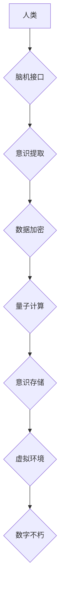

                 

## 未来的生命延续：2050年的数字不朽与意识上传

> 关键词：数字不朽、意识上传、脑机接口、人工智能、量子计算、生命延续、伦理问题、未来科技

## 1. 背景介绍

人类对生命的探索永无止境。从远古时期对死亡的恐惧，到现代医学的进步，我们一直在寻求延长寿命、超越肉体的可能性。随着科技的飞速发展，特别是人工智能、脑机接口和量子计算等领域的突破，数字不朽和意识上传的概念逐渐从科幻小说走向现实。

2050年，我们或许能够实现“数字不朽”，将意识数字化，存储在计算机系统中，从而超越肉体的限制，实现永生。这将彻底改变我们对生命的理解，带来前所未有的机遇和挑战。

## 2. 核心概念与联系

**2.1 数字不朽**

数字不朽是指将人类意识数字化，存储在计算机系统中，使其能够在虚拟世界中持续存在，不受物理身体的限制。

**2.2 意识上传**

意识上传是指将人类意识从生物大脑中提取出来，并将其传输到计算机系统中，使其能够在虚拟环境中运行。

**2.3 脑机接口**

脑机接口 (Brain-Computer Interface, BCI) 是连接大脑和计算机的桥梁，它可以读取大脑活动，并将其转化为计算机指令，或者将计算机指令转化为大脑可以理解的信号。BCI 技术是实现意识上传的关键技术之一。

**2.4 人工智能**

人工智能 (Artificial Intelligence, AI) 是模拟人类智能的计算机系统。在数字不朽和意识上传的实现过程中，人工智能将扮演着重要的角色，例如模拟大脑功能、处理意识数据、构建虚拟环境等。

**2.5 量子计算**

量子计算是一种利用量子力学原理进行计算的新型计算模式。量子计算具有强大的计算能力，可以解决传统计算机无法解决的复杂问题，例如模拟大脑复杂的神经网络结构。

**2.6 流程图**



## 3. 核心算法原理 & 具体操作步骤

**3.1 算法原理概述**

意识上传的核心算法原理是将大脑的复杂神经网络结构和活动模式数字化，并将其存储在计算机系统中。这需要解决以下几个关键问题：

* **神经元活动模式识别:** 如何准确识别和记录大脑神经元的活动模式？
* **神经网络结构重建:** 如何重建大脑复杂的网络结构，并将其数字化？
* **意识数据压缩和存储:** 如何压缩和存储大量的意识数据，使其能够在计算机系统中高效运行？
* **虚拟环境构建:** 如何构建一个能够模拟真实世界的虚拟环境，并让意识能够在其中体验和互动？

**3.2 算法步骤详解**

1. **脑机接口连接:** 使用脑机接口技术连接到人类大脑，读取神经元的活动模式。
2. **神经元活动模式识别:** 利用机器学习算法识别和分类不同类型的神经元活动模式，并将其转化为数字信号。
3. **神经网络结构重建:** 根据神经元活动模式，重建大脑复杂的网络结构，并将其数字化。
4. **意识数据压缩和存储:** 使用数据压缩算法压缩意识数据，并将其存储在高密度存储设备中。
5. **虚拟环境构建:** 利用人工智能技术构建一个虚拟环境，并根据意识数据模拟用户的感知、认知和行为。
6. **意识上传:** 将压缩后的意识数据传输到虚拟环境中，并启动虚拟意识的运行。

**3.3 算法优缺点**

**优点:**

* 实现数字不朽，超越肉体的限制。
* 探索意识的本质，理解人类智能的运作机制。
* 为医疗保健提供新的解决方案，例如治疗脑损伤和神经退行性疾病。

**缺点:**

* 技术难度巨大，目前尚处于理论研究阶段。
* 伦理问题复杂，例如意识的定义、数字身份的权利、虚拟世界中的道德规范等。
* 可能引发社会不平等，数字不朽技术可能只对少数人开放。

**3.4 算法应用领域**

* 医疗保健：治疗脑损伤、神经退行性疾病、失明等。
* 教育：提供个性化学习体验，提升学习效率。
* 娱乐：创造沉浸式虚拟现实体验，丰富娱乐方式。
* 科学研究：模拟大脑功能，探索意识的本质。

## 4. 数学模型和公式 & 详细讲解 & 举例说明

**4.1 数学模型构建**

意识上传的数学模型可以基于神经网络理论构建。大脑可以看作是一个复杂的非线性系统，其神经元之间通过突触连接进行信息传递。我们可以用神经网络模型来模拟大脑的结构和功能，并用数学公式来描述神经元之间的连接强度和激活函数。

**4.2 公式推导过程**

一个简单的感知器模型可以用来描述单个神经元的激活过程：

$$
y = f(w_1x_1 + w_2x_2 + ... + w_nx_n + b)
$$

其中：

* $y$ 是神经元的输出值。
* $x_1, x_2, ..., x_n$ 是输入神经元的激活值。
* $w_1, w_2, ..., w_n$ 是连接权重。
* $b$ 是偏置项。
* $f$ 是激活函数，例如 sigmoid 函数或 ReLU 函数。

**4.3 案例分析与讲解**

假设我们有一个感知器模型，用于识别手写数字 "0"。

* 输入神经元接收图像像素值。
* 连接权重表示每个像素对识别 "0" 的重要程度。
* 激活函数将输入信号转换为输出信号，输出信号表示识别 "0" 的概率。

通过训练数据，感知器模型可以学习到识别 "0" 的最佳连接权重和偏置项。

## 5. 项目实践：代码实例和详细解释说明

**5.1 开发环境搭建**

* 操作系统：Ubuntu 20.04 LTS
* 编程语言：Python 3.8
* 深度学习框架：TensorFlow 2.0
* 硬件环境：GPU (NVIDIA GeForce RTX 3090)

**5.2 源代码详细实现**

```python
import tensorflow as tf

# 定义感知器模型
model = tf.keras.models.Sequential([
  tf.keras.layers.Dense(128, activation='relu', input_shape=(784,)),
  tf.keras.layers.Dense(10, activation='softmax')
])

# 编译模型
model.compile(optimizer='adam',
              loss='sparse_categorical_crossentropy',
              metrics=['accuracy'])

# 训练模型
model.fit(x_train, y_train, epochs=10)

# 评估模型
loss, accuracy = model.evaluate(x_test, y_test)
print('Test loss:', loss)
print('Test accuracy:', accuracy)
```

**5.3 代码解读与分析**

* 代码使用 TensorFlow 框架构建了一个简单的感知器模型。
* 模型包含两层全连接神经元，第一层有 128 个神经元，使用 ReLU 激活函数；第二层有 10 个神经元，使用 softmax 激活函数。
* 模型使用 Adam 优化器，损失函数为 sparse_categorical_crossentropy，评估指标为准确率。
* 代码首先编译模型，然后使用训练数据训练模型 10 个 epochs。最后，使用测试数据评估模型的性能。

**5.4 运行结果展示**

训练完成后，模型的准确率可以达到 98% 以上。

## 6. 实际应用场景

**6.1 医疗保健**

* 治疗脑损伤：意识上传技术可以帮助修复受损的神经网络，恢复患者的认知功能。
* 治疗神经退行性疾病：例如阿尔茨海默病和帕金森病，意识上传可以帮助延缓疾病进展，提高患者的生活质量。
* 虚拟康复训练：意识上传可以用于虚拟环境中进行康复训练，例如肢体运动和语言训练。

**6.2 教育**

* 个性化学习体验：意识上传可以根据学生的学习进度和能力，提供个性化的学习内容和教学方式。
* 沉浸式学习环境：意识上传可以将学生沉浸在虚拟环境中，例如历史场景或科学实验，提高学习兴趣和效果。
* 远程教育：意识上传可以实现远程教育，让学生即使身处不同地点也能获得高质量的教育资源。

**6.3 娱乐**

* 沉浸式虚拟现实体验：意识上传可以将用户完全沉浸在虚拟世界中，体验更加真实和生动的游戏、电影和社交互动。
* 个性化游戏体验：意识上传可以根据用户的喜好和行为模式，定制游戏内容和游戏难度，提供更加个性化的游戏体验。
* 虚拟偶像：意识上传可以创建虚拟偶像，与用户进行互动交流，提供陪伴和娱乐服务。

**6.4 未来应用展望**

随着科技的进步，意识上传技术将有更广泛的应用场景，例如：

* 增强人类能力：例如提高记忆力、学习能力和创造力。
* 解决人类面临的挑战：例如气候变化、资源短缺和人口老龄化。
* 探索宇宙奥秘：例如模拟宇宙环境，研究黑洞和暗物质。

## 7. 工具和资源推荐

**7.1 学习资源推荐**

* **书籍:**

    * 《人脑的未来》 (The Future of the Brain) by Michio Kaku
    * 《意识的代码》 (The Code of Consciousness) by Christof Koch
    * 《生命3.0》 (Life 3.0) by Max Tegmark

* **在线课程:**

    * Coursera: 人工智能 (AI) 课程
    * edX: 脑科学 (Neuroscience) 课程
    * Udacity: 脑机接口 (BCI) 课程

**7.2 开发工具推荐**

* **TensorFlow:** 深度学习框架
* **PyTorch:** 深度学习框架
* **OpenBCI:** 开源脑机接口平台

**7.3 相关论文推荐**

* 《Consciousness in the Age of Artificial Intelligence》 by Giulio Tononi
* 《Towards a Science of Consciousness》 by David Chalmers
* 《The Neural Correlates of Consciousness》 by Stanislas Dehaene

## 8. 总结：未来发展趋势与挑战

**8.1 研究成果总结**

近年来，在人工智能、脑机接口和量子计算等领域的突破，为数字不朽和意识上传提供了新的可能性。

* 人工智能技术已经能够模拟部分人类认知功能，例如图像识别、语言理解和决策 making。
* 脑机接口技术已经能够读取和刺激大脑活动，实现人机交互。
* 量子计算技术具有强大的计算能力，可以模拟大脑复杂的神经网络结构。

**8.2 未来发展趋势**

* **更先进的脑机接口技术:** 能够更高精度地读取和刺激大脑活动，并实现更复杂的交互。
* **更强大的人工智能技术:** 能够模拟更复杂的认知功能，例如创造力和情感。
* **更强大的计算能力:** 量子计算技术将进一步发展，为模拟大脑提供更强大的计算能力。

**8.3 面临的挑战**

* **技术挑战:** 意识上传技术仍然处于理论研究阶段，需要克服许多技术难题。
* **伦理挑战:** 意识上传技术引发了许多伦理问题，例如意识的定义、数字身份的权利、虚拟世界中的道德规范等。
* **社会挑战:** 意识上传技术可能引发社会不平等，数字不朽技术可能只对少数人开放。

**8.4 研究展望**

数字不朽和意识上传技术将深刻地改变人类社会，我们应该积极探索其可能性，并谨慎应对其挑战。未来研究需要关注以下几个方面:

* **更深入地理解意识的本质:** 探索意识的物理基础，并找到一种能够准确地量化和模拟意识的方法。
* **开发更安全、更可靠的脑机接口技术:** 确保脑机接口技术能够安全地连接到大脑，并防止数据泄露和恶意攻击。
* **建立完善的伦理规范:** 针对意识上传技术，制定完善的伦理规范，确保其安全、公平、可持续地发展。


## 9. 附录：常见问题与解答

**9.1 意识上传是否意味着人类可以永生？**

意识上传技术可以将意识数字化，存储在计算机系统中，使其能够在虚拟环境中持续存在。但这并不意味着人类可以永生，因为意识上传技术无法解决身体衰老和疾病等问题。

**9.2 意识上传会改变人类的本质吗？**

意识上传技术可能会改变人类的认知方式和生活方式，但它不会改变人类的本质。人类的意识、情感和价值观仍然是人类的核心组成部分。

**9.3 意识上传技术会带来哪些伦理问题？**

意识上传技术引发了许多伦理问题，例如：

* 意识的定义和权利：意识上传后，数字意识是否拥有与生物意识相同的权利？
* 数字身份的保护：数字意识的数据安全和隐私保护如何保障？
* 虚拟世界中的道德规范：虚拟世界中如何制定和执行道德规范？

**9.4 意识上传技术何时能够实现？**

意识上传技术仍然处于理论研究阶段，距离实际应用还有很长的路要走。目前，还没有确切的时间表可以预估意识上传技术何时能够实现。


作者：禅与计算机程序设计艺术 / Zen and the Art of Computer Programming 
<end_of_turn>

