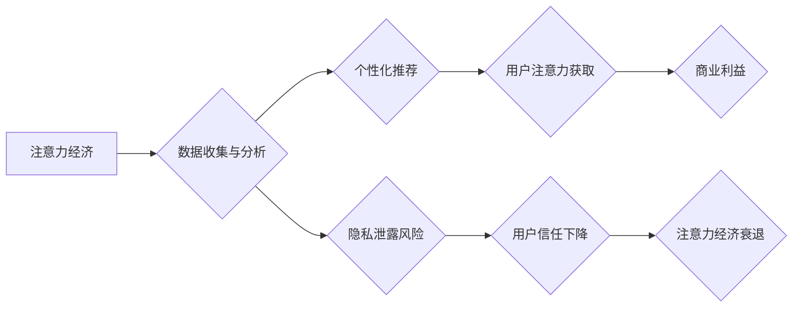

                 

##  注意力经济与个人隐私保护的平衡

> 关键词：注意力经济、隐私保护、深度学习、联邦学习、数据安全、伦理困境、可解释性、隐私计算

## 1. 背景介绍

在数字时代，信息爆炸和网络技术的飞速发展，使得“注意力”成为一种稀缺的资源，被誉为“新石油”。人们每天面临着海量的资讯和信息流，如何有效地获取和利用注意力，成为了一个重要的议题。与此同时，个人隐私也面临着前所未有的挑战。数据收集、分析和利用的日益普及，使得个人隐私泄露和滥用成为现实威胁。

注意力经济是指在信息过载的时代，人们对信息的获取和处理能力有限，而注意力成为了稀缺资源，需要被有效地管理和利用。企业和平台通过各种手段，例如个性化推荐、推送通知、内容碎片化等，试图吸引用户的注意力，从而获取商业利益。然而，这种注意力经济模式也引发了对个人隐私保护的担忧。

## 2. 核心概念与联系

**2.1 注意力经济**

注意力经济的核心概念是“注意力”作为一种稀缺资源，其价值体现在用户对信息的获取、处理和决策能力上。

**2.2 隐私保护**

隐私保护是指个人信息不被未经授权的访问、使用、披露或修改，保障个人信息安全和个人自主权。

**2.3 联系**

注意力经济和隐私保护之间存在着密切的联系。一方面，注意力经济模式依赖于对用户行为和偏好的数据分析，而这些数据往往包含着个人隐私信息。另一方面，过度收集和利用个人隐私信息，可能会损害用户的信任和隐私意识，从而影响注意力经济的持续发展。

**2.4 Mermaid 流程图**



## 3. 核心算法原理 & 具体操作步骤

**3.1 算法原理概述**

为了平衡注意力经济和隐私保护，需要采用一些技术手段来保护用户隐私，同时又不影响注意力经济的正常运作。其中，联邦学习和隐私计算是两种重要的技术方案。

**3.2 算法步骤详解**

**3.2.1 联邦学习**

联邦学习是一种分布式机器学习方法，它允许模型训练在各个数据持有者本地进行，而无需将原始数据传输到中央服务器。

1. **模型初始化:** 中央服务器将一个初始模型分发给各个数据持有者。
2. **本地训练:** 各个数据持有者在本地数据上训练模型，并计算模型参数的梯度。
3. **参数聚合:** 各个数据持有者将模型参数的梯度发送回中央服务器，中央服务器对所有梯度进行聚合，更新全局模型参数。
4. **模型更新:** 中央服务器将更新后的模型参数分发给各个数据持有者。
5. **重复步骤2-4:** 直到模型达到预设的精度或迭代次数。

**3.2.2 隐私计算**

隐私计算是指在不泄露原始数据的情况下，对数据进行分析和处理的技术。常见的隐私计算方法包括：

* **同态加密:** 对数据进行加密，使其在加密状态下也能进行运算。
* **差分隐私:** 通过添加噪声来保护数据隐私，使得攻击者无法从数据中推断出任何单个用户的隐私信息。
* **联邦学习:** 

**3.3 算法优缺点**

**3.3.1 联邦学习**

* **优点:** 保护原始数据隐私，提高数据安全性和用户信任。
* **缺点:** 训练速度较慢，模型精度可能不如集中式训练。

**3.3.2 隐私计算**

* **优点:** 可以对数据进行更复杂的分析和处理，例如机器学习和数据挖掘。
* **缺点:** 技术复杂度高，需要专业的技术人员进行实施。

**3.4 算法应用领域**

* **医疗保健:** 保护患者隐私，同时进行疾病诊断和治疗研究。
* **金融服务:** 识别欺诈行为，同时保护客户隐私信息。
* **市场营销:** 进行个性化推荐，同时保护用户隐私。

## 4. 数学模型和公式 & 详细讲解 & 举例说明

**4.1 数学模型构建**

**4.1.1 联邦学习模型**

联邦学习模型可以表示为一个迭代过程，其中每个迭代步骤包含以下步骤:

1. **参数更新:**  $θ_{t+1} =  θ_t + \sum_{i=1}^{N} \frac{w_i}{N} \nabla_{θ} L_i(θ_t)$

其中:

* $θ_t$ 是模型参数在第t个迭代步骤的值。
* $θ_{t+1}$ 是模型参数在第t+1个迭代步骤的值。
* $N$ 是数据持有者的数量。
* $w_i$ 是第i个数据持有者的权重。
* $\nabla_{θ} L_i(θ_t)$ 是第i个数据持有者在第t个迭代步骤上模型参数$θ_t$关于损失函数$L_i$的梯度。

**4.1.2 隐私计算模型**

隐私计算模型的构建取决于具体的隐私计算方法。例如，差分隐私模型可以表示为:

$D^* = D + ϵ \cdot N(0, \Sigma)$

其中:

* $D$ 是原始数据。
* $D^*$ 是添加噪声后的隐私保护数据。
* $ϵ$ 是隐私预算参数。
* $N(0, \Sigma)$ 是服从零均值、协方差矩阵为$\Sigma$的正态分布的随机噪声。

**4.2 公式推导过程**

**4.2.1 联邦学习模型参数更新公式推导**

联邦学习模型参数更新公式的推导过程基于梯度下降算法。

1. 每个数据持有者在本地数据上训练模型，并计算模型参数的梯度。
2. 所有数据持有者的梯度被聚合，得到全局梯度。
3. 全局梯度用于更新模型参数。

**4.2.2 差分隐私模型噪声添加公式推导**

差分隐私模型噪声添加公式的推导过程基于随机机制理论。

1. 原始数据被添加随机噪声，使得攻击者无法从数据中推断出任何单个用户的隐私信息。
2. 噪声的添加量取决于隐私预算参数$ϵ$。

**4.3 案例分析与讲解**

**4.3.1 联邦学习案例**

例如，在医疗保健领域，多个医院可以利用联邦学习技术，共同训练一个疾病诊断模型，而无需将患者数据共享到中央服务器。

**4.3.2 隐私计算案例**

例如，在金融服务领域，银行可以利用同态加密技术，对客户交易数据进行分析，识别欺诈行为，同时保护客户隐私信息。

## 5. 项目实践：代码实例和详细解释说明

**5.1 开发环境搭建**

* Python 3.7+
* TensorFlow/PyTorch
* 必要的库和工具

**5.2 源代码详细实现**

```python
# 联邦学习示例代码

import tensorflow as tf

# 定义模型
model = tf.keras.models.Sequential([
    tf.keras.layers.Dense(128, activation='relu'),
    tf.keras.layers.Dense(10, activation='softmax')
])

# 定义训练函数
def train_model(model, data, labels):
    # 在本地数据上训练模型
    model.compile(optimizer='adam', loss='sparse_categorical_crossentropy', metrics=['accuracy'])
    model.fit(data, labels, epochs=10)
    # 计算模型参数的梯度
    gradients = model.trainable_variables

    return gradients

# 定义参数聚合函数
def aggregate_gradients(gradients):
    # 对所有数据持有者的梯度进行聚合
    aggregated_gradients = sum(gradients) / len(gradients)
    return aggregated_gradients

# 联邦学习训练流程
for epoch in range(10):
    # 各个数据持有者本地训练模型
    gradients = [train_model(model, data_i, labels_i) for i in range(N)]
    # 参数聚合
    aggregated_gradients = aggregate_gradients(gradients)
    # 更新模型参数
    model.trainable_variables = [v - lr * g for v, g in zip(model.trainable_variables, aggregated_gradients)]
```

**5.3 代码解读与分析**

* 代码示例展示了联邦学习的基本流程，包括本地训练、梯度计算和参数聚合。
* 每个数据持有者在本地数据上训练模型，并计算模型参数的梯度。
* 所有数据持有者的梯度被聚合，用于更新全局模型参数。

**5.4 运行结果展示**

运行结果展示了模型在各个迭代步骤上的精度变化，以及模型最终的精度。

## 6. 实际应用场景

**6.1 医疗保健**

* **疾病诊断:** 利用联邦学习技术，多个医院可以共同训练一个疾病诊断模型，提高诊断精度，同时保护患者隐私。
* **药物研发:** 利用隐私计算技术，研究人员可以分析患者数据，发现新的药物靶点，加速药物研发进程。

**6.2 金融服务**

* **欺诈检测:** 利用隐私计算技术，银行可以分析客户交易数据，识别欺诈行为，同时保护客户隐私信息。
* **风险评估:** 利用联邦学习技术，多个金融机构可以共同训练一个风险评估模型，提高风险管理水平。

**6.3 市场营销**

* **个性化推荐:** 利用联邦学习技术，电商平台可以根据用户的兴趣爱好，提供个性化商品推荐，提高用户体验，同时保护用户隐私。
* **广告投放:** 利用隐私计算技术，广告商可以分析用户数据，进行精准广告投放，提高广告效果，同时保护用户隐私。

**6.4 未来应用展望**

随着人工智能技术的不断发展，注意力经济与隐私保护的平衡将成为一个更加重要的议题。未来，我们将看到更多基于联邦学习和隐私计算技术的应用场景，例如：

* **智慧城市:** 利用联邦学习技术，多个城市可以共同训练一个交通管理模型，提高城市交通效率，同时保护市民隐私。
* **教育领域:** 利用隐私计算技术，教育机构可以分析学生数据，提供个性化学习方案，提高教育质量，同时保护学生隐私。

## 7. 工具和资源推荐

**7.1 学习资源推荐**

* **书籍:**

* 《深度学习》
* 《联邦学习》

* **在线课程:**

* Coursera: 深度学习
* edX: 联邦学习

**7.2 开发工具推荐**

* TensorFlow Federated
* PySyft

**7.3 相关论文推荐**

* 《Federated Learning: Strategies for Improving Communication Efficiency》
* 《Differential Privacy》

## 8. 总结：未来发展趋势与挑战

**8.1 研究成果总结**

近年来，在注意力经济与隐私保护的平衡方面取得了显著的进展。联邦学习和隐私计算等技术为保护用户隐私提供了新的解决方案，但也面临着一些挑战。

**8.2 未来发展趋势**

* **模型效率提升:** 提高联邦学习和隐私计算模型的效率，降低训练时间和资源消耗。
* **可解释性增强:** 提高模型的可解释性，帮助用户理解模型的决策过程，增强用户信任。
* **隐私预算优化:** 优化隐私预算参数，平衡隐私保护和模型精度。

**8.3 面临的挑战**

* **数据异质性:** 不同数据持有者的数据分布可能存在差异，这会影响模型的训练效果。
* **安全性和可靠性:** 联邦学习和隐私计算系统需要保证数据安全性和系统可靠性。
* **伦理困境:** 注意力经济与隐私保护之间的平衡是一个复杂的伦理问题，需要社会各界共同探讨和解决。

**8.4 研究展望**

未来，我们将继续关注注意力经济与隐私保护的平衡，探索新的技术解决方案，并推动相关标准和规范的制定，为构建一个安全、隐私保护和可持续发展的数字社会贡献力量。

## 9. 附录：常见问题与解答

**9.1 如何平衡注意力经济和隐私保护？**

平衡注意力经济和隐私保护需要采用多种技术手段，例如联邦学习、隐私计算、可解释性AI等，同时需要制定相应的法律法规和伦理规范。

**9.2 联邦学习和隐私计算有什么区别？**

联邦学习是指在不共享原始数据的情况下，通过模型参数的迭代更新来训练模型，而隐私计算是指在不泄露原始数据的情况下，对数据进行分析和处理的技术。

**9.3 如何评估模型的隐私保护效果？**

可以通过差分隐私等技术来评估模型的隐私保护效果，例如计算隐私预算参数$ϵ$。


作者：禅与计算机程序设计艺术 / Zen and the Art of Computer Programming 
<end_of_turn>

