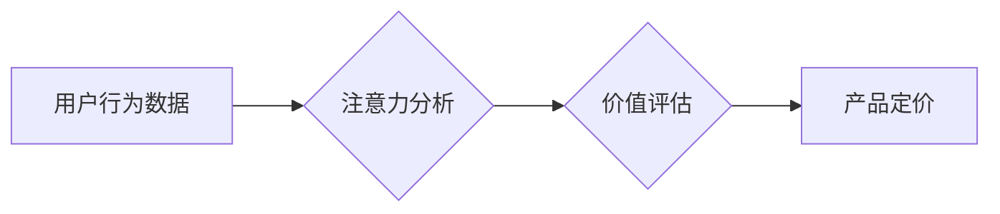

                 

##  注意力经济对企业产品定价的新要求

> 关键词：注意力经济、产品定价、用户行为、价值评估、算法模型、数据驱动

## 1. 背景介绍

在当今信息爆炸的时代，人们面临着前所未有的信息过载。注意力已成为稀缺的资源，而企业的产品和服务则需要争夺用户有限的注意力。这种现象被称为“注意力经济”。

传统的产品定价模型往往基于成本加成、市场竞争等因素，而忽略了用户注意力价值的评估。随着注意力经济的兴起，企业需要重新思考产品定价策略，将用户注意力作为核心要素，制定更精准、更有效的定价方案。

## 2. 核心概念与联系

### 2.1 注意力经济

注意力经济是指在信息过载的时代，人们对信息的筛选和选择能力成为重要的经济资源。企业需要通过提供更具吸引力和价值的产品和服务，来获取用户的注意力，从而实现商业价值。

### 2.2 产品定价

产品定价是指企业根据市场需求、成本结构、竞争环境等因素，为产品或服务设定价格的过程。

### 2.3 用户行为

用户行为是指用户在使用产品或服务时所采取的各种行动，例如浏览页面、点击链接、购买商品等。

**注意力经济与产品定价的关系**

用户注意力是产品定价的重要基础。企业需要通过分析用户行为数据，了解用户对不同产品和服务的注意力分配情况，从而制定更精准的定价策略。

**Mermaid 流程图**



## 3. 核心算法原理 & 具体操作步骤

### 3.1 算法原理概述

注意力经济的产品定价算法通常基于以下核心原理：

* **用户价值评估:** 通过分析用户行为数据，评估用户对不同产品和服务的注意力价值。
* **注意力分配模型:** 建立注意力分配模型，预测用户在不同时间段内对不同产品的注意力分配情况。
* **动态定价策略:** 根据用户注意力价值和注意力分配模型，制定动态的定价策略，以最大化企业收益。

### 3.2 算法步骤详解

1. **数据收集:** 收集用户行为数据，例如浏览记录、点击记录、停留时间等。
2. **数据预处理:** 对收集到的数据进行清洗、转换和格式化，以便于后续分析。
3. **用户画像构建:** 根据用户行为数据，构建用户画像，例如用户兴趣、偏好、消费习惯等。
4. **注意力价值评估:** 利用机器学习算法，评估用户对不同产品和服务的注意力价值。
5. **注意力分配模型训练:** 利用用户画像和注意力价值评估结果，训练注意力分配模型，预测用户在不同时间段内对不同产品的注意力分配情况。
6. **动态定价策略制定:** 根据注意力分配模型的预测结果，制定动态的定价策略，例如根据用户注意力价值调整价格、根据时间段调整价格等。
7. **效果评估:** 定期评估动态定价策略的效果，并根据评估结果进行调整优化。

### 3.3 算法优缺点

**优点:**

* 更精准地评估用户注意力价值。
* 能够根据用户行为动态调整定价策略。
* 有助于企业最大化收益。

**缺点:**

* 需要大量用户行为数据进行训练。
* 算法模型的复杂性可能导致实施难度较高。
* 需要不断进行数据更新和模型优化。

### 3.4 算法应用领域

注意力经济的产品定价算法可以应用于各种领域，例如：

* **电商平台:** 根据用户浏览记录和购买历史，动态调整商品价格。
* **内容平台:** 根据用户阅读时长和点赞数，调整内容付费价格。
* **广告平台:** 根据用户注意力分配情况，优化广告投放策略。

## 4. 数学模型和公式 & 详细讲解 & 举例说明

### 4.1 数学模型构建

注意力经济的产品定价模型可以基于以下数学模型构建：

**用户价值函数:**

$$V(u,p) = f(A(u,p),B(u,p))$$

其中：

* $V(u,p)$ 表示用户 $u$ 对产品 $p$ 的价值。
* $A(u,p)$ 表示用户 $u$ 对产品 $p$ 的注意力分配。
* $B(u,p)$ 表示用户 $u$ 对产品 $p$ 的认知度。
* $f$ 是一个非线性函数，用于将注意力分配和认知度转换为用户价值。

**注意力分配模型:**

$$A(u,p) = g(H(u),C(p))$$

其中：

* $H(u)$ 表示用户 $u$ 的兴趣和偏好特征。
* $C(p)$ 表示产品 $p$ 的内容和功能特征。
* $g$ 是一个注意力分配函数，用于根据用户特征和产品特征预测用户注意力分配。

### 4.2 公式推导过程

用户价值函数和注意力分配模型可以根据用户行为数据和产品特征进行训练和优化。

例如，可以使用回归算法训练用户价值函数，将用户行为数据作为输入，用户对产品的评价作为输出。可以使用神经网络训练注意力分配模型，将用户特征和产品特征作为输入，用户对产品的注意力分配作为输出。

### 4.3 案例分析与讲解

假设一家电商平台想要根据用户注意力价值调整商品价格。

1. **数据收集:** 收集用户浏览记录、点击记录、停留时间等数据。
2. **用户画像构建:** 根据用户行为数据，构建用户画像，例如用户兴趣、偏好、消费习惯等。
3. **注意力价值评估:** 利用机器学习算法，评估用户对不同商品的注意力价值。
4. **动态定价策略制定:** 根据用户注意力价值和商品特征，制定动态的定价策略。例如，对高注意力价值的商品，可以设定更高的价格。

## 5. 项目实践：代码实例和详细解释说明

### 5.1 开发环境搭建

* Python 3.x
* Jupyter Notebook
* pandas
* scikit-learn
* TensorFlow/PyTorch

### 5.2 源代码详细实现

```python
# 导入必要的库
import pandas as pd
from sklearn.linear_model import LinearRegression

# 加载用户行为数据
data = pd.read_csv('user_behavior_data.csv')

# 提取用户注意力价值特征
attention_features = data[['浏览时长', '点击次数', '停留次数']]

# 提取商品特征
product_features = data[['商品类别', '商品价格', '商品评分']]

# 训练用户价值评估模型
model = LinearRegression()
model.fit(attention_features, data['用户评价'])

# 预测用户对商品的注意力价值
predicted_value = model.predict(attention_features)

# 根据注意力价值调整商品价格
adjusted_price = product_features['商品价格'] * (predicted_value + 1)
```

### 5.3 代码解读与分析

* 代码首先导入必要的库，并加载用户行为数据。
* 然后，提取用户注意力价值特征和商品特征。
* 使用线性回归模型训练用户价值评估模型，并将用户行为数据作为输入，用户对产品的评价作为输出。
* 训练好的模型可以用于预测用户对商品的注意力价值。
* 最后，根据注意力价值调整商品价格。

### 5.4 运行结果展示

运行代码后，可以得到用户对不同商品的注意力价值预测结果，以及根据注意力价值调整后的商品价格。

## 6. 实际应用场景

### 6.1 电商平台

电商平台可以根据用户对商品的注意力价值，动态调整商品价格，提高转化率和收益。例如，对用户关注度高的商品，可以设定更高的价格，而对用户关注度低的商品，可以设定更低的折扣价格。

### 6.2 内容平台

内容平台可以根据用户对内容的注意力价值，制定不同的付费策略。例如，对用户阅读时长和点赞数高的内容，可以设定更高的付费价格，而对用户阅读时长和点赞数低的內容，可以设定更低的订阅价格。

### 6.3 广告平台

广告平台可以根据用户对广告的注意力分配情况，优化广告投放策略。例如，可以将广告投放给用户注意力集中在相关领域的页面上，提高广告点击率和转化率。

### 6.4 未来应用展望

随着注意力经济的深入发展，产品定价算法将更加智能化、个性化和精准化。未来，产品定价算法将能够更加深入地理解用户需求和行为，并根据用户个体差异，制定更加个性化的定价策略。

## 7. 工具和资源推荐

### 7.1 学习资源推荐

* **书籍:**
    * 《注意力经济》
    * 《数字营销》
    * 《数据驱动决策》
* **在线课程:**
    * Coursera: 数据科学
    * edX: 机器学习
    * Udemy: 产品管理

### 7.2 开发工具推荐

* **Python:** 
    * pandas
    * scikit-learn
    * TensorFlow/PyTorch
* **数据可视化工具:**
    * Tableau
    * Power BI
    * matplotlib

### 7.3 相关论文推荐

* **Attention Is All You Need**
* **BERT: Pre-training of Deep Bidirectional Transformers for Language Understanding**
* **Deep Reinforcement Learning for Dynamic Pricing**

## 8. 总结：未来发展趋势与挑战

### 8.1 研究成果总结

注意力经济的产品定价算法为企业提供了新的思路和方法，能够更加精准地评估用户注意力价值，并制定动态的定价策略。

### 8.2 未来发展趋势

未来，注意力经济的产品定价算法将更加智能化、个性化和精准化。

* **更深入的用户行为分析:** 利用更先进的机器学习算法，更加深入地分析用户行为数据，挖掘用户注意力价值的更多特征。
* **更个性化的定价策略:** 根据用户的个体差异，制定更加个性化的定价策略，例如根据用户的购买历史、浏览习惯、兴趣偏好等因素，调整商品价格。
* **更实时动态的定价机制:** 利用实时数据流，动态调整商品价格，以适应不断变化的市场需求和用户行为。

### 8.3 面临的挑战

* **数据隐私保护:** 用户行为数据涉及到用户的隐私信息，需要采取有效的措施保护用户隐私。
* **算法公平性:** 算法模型的训练数据可能存在偏差，导致算法结果不公平。需要采取措施确保算法模型的公平性。
* **用户信任:** 用户需要对产品定价算法的透明度和公平性有足够的信任，否则可能会导致用户反感和抵触。

### 8.4 研究展望

未来，注意力经济的产品定价算法将继续发展和完善，为企业提供更加精准、高效的定价解决方案。


## 9. 附录：常见问题与解答

**Q1: 注意力经济的产品定价算法是否会损害用户的利益？**

**A1:** 注意力经济的产品定价算法的目标是帮助企业更好地理解用户需求，并提供更加个性化、价值更高的产品和服务。如果算法能够公平、透明地运作，并保护用户的隐私信息，那么它不会损害用户的利益。

**Q2: 如何确保注意力经济的产品定价算法的公平性？**

**A2:** 确保算法公平性的关键在于使用高质量、无偏的数据进行训练，并定期评估算法模型的公平性。

**Q3: 如何提高用户对注意力经济的产品定价算法的信任？**

**A3:** 企业需要提高算法的透明度，让用户了解算法是如何运作的。同时，还需要确保算法的公平性和安全性，并提供用户反馈机制，及时解决用户的问题和疑虑。


作者：禅与计算机程序设计艺术 / Zen and the Art of Computer Programming 
<end_of_turn>

