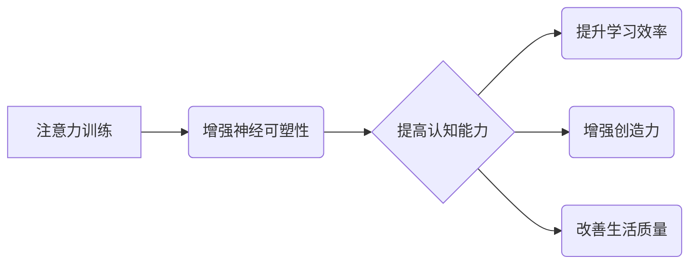

                 

## 1. 背景介绍

在当今信息爆炸的时代，人类面临着前所未有的认知挑战。我们被无休止的通知、信息流和任务分散所包围，这使得专注力变得越来越稀缺，认知能力也受到严重影响。注意力，作为认知的核心功能之一，直接关系到我们的学习、工作、生活和整体幸福感。 

注意力训练，旨在通过特定的练习和技巧来增强我们的注意力能力，从而提高认知效率、提升学习效果、增强创造力，并最终实现大脑的自我提升。近年来，注意力训练的研究和应用日益受到关注，并取得了显著的成果。

## 2. 核心概念与联系

### 2.1 注意力机制

注意力机制是机器学习领域中一个重要的概念，它模拟了人类对信息选择性关注的机制。在深度学习模型中，注意力机制可以帮助模型聚焦于输入数据中最重要的部分，从而提高模型的准确性和效率。

### 2.2 神经可塑性

神经可塑性是指大脑神经元连接和功能在经历学习和经验后发生改变的能力。注意力训练通过刺激大脑神经元活动，促进神经元之间的连接和强化，从而增强大脑的认知功能和神经可塑性。

**注意力训练与大脑增强关系图**



## 3. 核心算法原理 & 具体操作步骤

### 3.1 算法原理概述

注意力训练算法通常基于以下原理：

* **重复性训练:** 通过反复练习特定任务，例如专注于特定刺激、抑制干扰信息等，来增强大脑对这些任务的处理能力。
* **渐进式难度:** 从简单的任务开始，逐渐增加任务难度，挑战大脑的认知极限，促进神经可塑性。
* **反馈机制:** 提供实时反馈，帮助用户了解自己的注意力水平，并根据反馈调整训练策略。

### 3.2 算法步骤详解

1. **任务选择:** 根据用户的目标和需求，选择合适的注意力训练任务，例如视觉注意力、听觉注意力、工作记忆等。
2. **训练环境搭建:** 创建一个专注的训练环境，尽量减少干扰因素，例如噪音、手机通知等。
3. **任务执行:** 用户按照训练指令执行注意力训练任务，例如追踪移动目标、识别特定信息、记忆序列等。
4. **反馈收集:** 训练过程中收集用户注意力水平的反馈数据，例如反应时间、错误率、心率等。
5. **数据分析:** 分析反馈数据，评估用户的注意力水平和训练效果，并根据分析结果调整训练策略。
6. **训练迭代:** 重复上述步骤，不断训练和优化用户的注意力能力。

### 3.3 算法优缺点

**优点:**

* **可量化评估:** 注意力训练算法可以量化评估用户的注意力水平，并跟踪训练效果。
* **个性化定制:** 训练任务和难度可以根据用户的需求和能力进行定制。
* **持续改进:** 通过不断训练和迭代，用户可以持续提升注意力能力。

**缺点:**

* **训练时间:** 注意力训练需要持续的练习和投入时间。
* **效果差异:** 不同用户的训练效果可能存在差异，取决于个体差异和训练方法。
* **缺乏标准化:** 目前注意力训练算法缺乏统一的标准和规范，不同平台和工具的训练效果可能存在差异。

### 3.4 算法应用领域

注意力训练算法在以下领域具有广泛的应用前景:

* **教育:** 提高学生的注意力和学习效率。
* **医疗:** 治疗注意力缺陷多动障碍 (ADHD) 等注意力相关疾病。
* **职场:** 提升员工的工作效率和专注力。
* **游戏:** 设计更具沉浸性和挑战性的游戏体验。

## 4. 数学模型和公式 & 详细讲解 & 举例说明

### 4.1 数学模型构建

注意力机制通常使用一个加权机制来分配不同输入元素的权重，从而突出重要信息。一个常见的数学模型是基于softmax函数的注意力机制：

$$
\text{Attention}(Q, K, V) = \text{softmax}\left(\frac{Q K^T}{\sqrt{d_k}}\right) V
$$

其中：

* $Q$：查询矩阵
* $K$：键矩阵
* $V$：值矩阵
* $d_k$：键向量的维度
* $\text{softmax}$：softmax函数，用于将权重归一化到0到1之间。

### 4.2 公式推导过程

该公式的推导过程基于以下原理：

* **计算相似度:** 使用点积计算查询向量 $Q$ 和键向量 $K$ 之间的相似度。
* **归一化权重:** 使用softmax函数将相似度值归一化到0到1之间，得到每个键向量的权重。
* **加权求和:** 将权重与值向量 $V$ 进行加权求和，得到最终的注意力输出。

### 4.3 案例分析与讲解

例如，在机器翻译任务中，可以使用注意力机制来帮助模型关注源语言句子中与目标语言句子相关的重要词语。

* $Q$：目标语言句子中的词向量
* $K$：源语言句子中的词向量
* $V$：源语言句子中的词向量

通过计算 $Q$ 和 $K$ 之间的相似度，模型可以识别出源语言句子中与目标语言句子相关的重要词语，并将其对应的词向量 $V$ 加权求和，得到最终的翻译结果。

## 5. 项目实践：代码实例和详细解释说明

### 5.1 开发环境搭建

* Python 3.x
* TensorFlow 或 PyTorch 深度学习框架
* Jupyter Notebook 或 VS Code 代码编辑器

### 5.2 源代码详细实现

```python
import tensorflow as tf

# 定义注意力机制层
class AttentionLayer(tf.keras.layers.Layer):
    def __init__(self, units):
        super(AttentionLayer, self).__init__()
        self.Wq = tf.keras.layers.Dense(units)
        self.Wk = tf.keras.layers.Dense(units)
        self.Wv = tf.keras.layers.Dense(units)
        self.softmax = tf.keras.layers.Softmax()

    def call(self, inputs):
        Q = self.Wq(inputs[0])
        K = self.Wk(inputs[1])
        V = self.Wv(inputs[2])
        attention_weights = self.softmax(tf.matmul(Q, K, transpose_b=True) / tf.math.sqrt(tf.cast(units, tf.float32)))
        output = tf.matmul(attention_weights, V)
        return output

# 示例使用
inputs = [tf.random.normal((10, 512)), tf.random.normal((10, 512)), tf.random.normal((10, 512))]
attention_layer = AttentionLayer(units=128)
output = attention_layer(inputs)
print(output.shape)
```

### 5.3 代码解读与分析

* 该代码定义了一个注意力机制层 `AttentionLayer`，它包含三个稠密层 `Wq`、`Wk` 和 `Wv`，用于分别处理查询、键和值向量。
* `softmax` 函数用于计算每个键向量的权重，并将权重归一化到0到1之间。
* `tf.matmul` 函数用于计算查询向量和键向量的点积，并进行加权求和，得到最终的注意力输出。

### 5.4 运行结果展示

运行该代码将输出一个形状为`(10, 128)`的张量，表示注意力机制层的输出。

## 6. 实际应用场景

### 6.1 教育领域

注意力训练应用于教育领域，可以帮助学生提高专注力、记忆力和学习效率。例如，一些教育软件和游戏利用注意力训练技术，帮助学生集中注意力在学习内容上，并通过游戏化的方式提高学习兴趣。

### 6.2 医疗领域

注意力训练在治疗注意力缺陷多动障碍 (ADHD) 等注意力相关疾病方面也展现出潜力。通过专门设计的注意力训练程序，可以帮助患者增强注意力控制能力，改善日常生活和学习能力。

### 6.3 职场领域

在职场中，注意力训练可以帮助员工提高工作效率、专注力和决策能力。一些公司提供注意力训练课程或工具，帮助员工应对工作压力，提升工作表现。

### 6.4 未来应用展望

随着注意力训练技术的不断发展，其应用场景将更加广泛。未来，注意力训练可能被应用于以下领域：

* **个性化学习:** 根据用户的注意力特点，定制个性化的学习方案。
* **脑机接口:** 利用注意力训练来控制脑机接口设备，实现人机交互的新方式。
* **虚拟现实:** 在虚拟现实环境中，注意力训练可以增强用户沉浸感和体验。

## 7. 工具和资源推荐

### 7.1 学习资源推荐

* **书籍:**
    * 《注意力训练与大脑增强》
    * 《深度学习》
    * 《神经网络与深度学习》
* **在线课程:**
    * Coursera: 深度学习
    * edX: 神经网络与深度学习
    * Udacity: 机器学习工程师

### 7.2 开发工具推荐

* **TensorFlow:** 开源深度学习框架
* **PyTorch:** 开源深度学习框架
* **Jupyter Notebook:** 交互式代码编辑器
* **VS Code:** 代码编辑器

### 7.3 相关论文推荐

* **Attention Is All You Need**
* **BERT: Pre-training of Deep Bidirectional Transformers for Language Understanding**
* **Transformer-XL: Attentive Language Models Beyond a Fixed-Length Context**

## 8. 总结：未来发展趋势与挑战

### 8.1 研究成果总结

注意力训练技术近年来取得了显著的进展，在认知增强、疾病治疗和人工智能等领域展现出巨大的潜力。

### 8.2 未来发展趋势

* **更精准的注意力训练:** 通过更深入的认知科学研究，开发更精准、更有效的注意力训练方法。
* **个性化注意力训练:** 根据用户的个体差异和需求，定制个性化的注意力训练方案。
* **多模态注意力训练:** 将注意力训练扩展到多模态数据，例如文本、图像、音频等。

### 8.3 面临的挑战

* **缺乏标准化:** 目前注意力训练算法缺乏统一的标准和规范，需要进一步的研究和规范。
* **效果评估:** 评估注意力训练效果的指标体系尚不完善，需要开发更客观、更全面的评估方法。
* **伦理问题:** 注意力训练技术可能带来一些伦理问题，例如数据隐私、信息操控等，需要谨慎对待。

### 8.4 研究展望

未来，注意力训练技术将继续朝着更精准、更个性化、更智能的方向发展，并将在更多领域发挥重要作用。


## 9. 附录：常见问题与解答

**Q1: 注意力训练真的能增强大脑功能吗？**

A1: 目前大量的研究表明，注意力训练确实可以增强大脑功能，包括提高注意力、记忆力和学习效率。

**Q2: 注意力训练需要多长时间才能看到效果？**

A2: 注意力训练的效果因人而异，一般需要持续练习一段时间才能看到明显的效果。建议每周练习至少3-5次，每次30-60分钟。

**Q3: 注意力训练适合所有人吗？**

A3: 注意力训练对大多数人都有益，但对于一些特定人群，例如患有注意力缺陷多动障碍 (ADHD) 的患者，需要在专业医生的指导下进行。


作者：禅与计算机程序设计艺术 / Zen and the Art of Computer Programming 
<end_of_turn>

