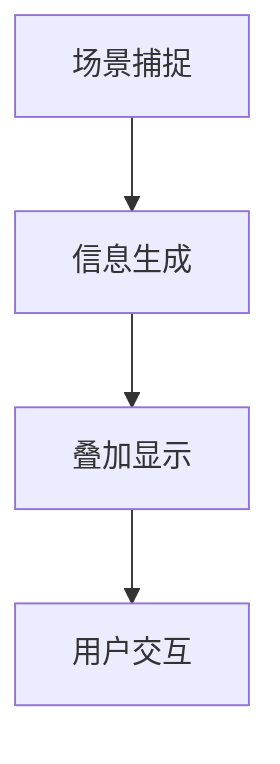

                 

# 文章标题

智能眼镜创业：增强现实的随身设备

> 关键词：智能眼镜、增强现实、创业、便携设备
>
> 摘要：本文将探讨智能眼镜这一新兴科技领域的创业机会，分析其技术背景、市场潜力以及创业过程中可能面临的挑战，旨在为有意投身这一领域的创业者提供有益的指导和启示。

## 1. 背景介绍

智能眼镜，作为一种便携式增强现实设备，近年来在科技界和消费者市场中都引起了广泛关注。它们集成了先进的光学技术、显示技术、计算能力和通信技术，能够在佩戴者的视线范围内实时显示图像、文字、音频等信息。智能眼镜的兴起，不仅推动了增强现实技术的发展，也为广大创业者提供了丰富的商业机遇。

从技术角度看，智能眼镜的核心在于其增强现实（AR）功能。AR技术通过在现实场景中叠加虚拟信息，为用户提供了全新的交互体验。随着移动计算能力的提升、传感器技术的进步以及显示技术的优化，智能眼镜的性能和用户体验得到了显著提升。

从市场角度看，智能眼镜具有巨大的市场潜力。一方面，随着5G网络的普及，高速、低延迟的网络环境为智能眼镜的应用提供了更好的基础；另一方面，人工智能和机器学习技术的不断发展，使得智能眼镜能够提供更加智能化的服务，满足用户在各个场景下的需求。

然而，智能眼镜市场也面临着诸多挑战。技术瓶颈、用户体验、隐私保护、市场教育等问题，都是创业者需要认真考虑的。如何在竞争激烈的市场中脱颖而出，成为智能眼镜领域的领军者，是每一个创业者都需要思考的问题。

## 2. 核心概念与联系

### 2.1 智能眼镜的定义与功能

智能眼镜是一种便携式电子设备，通常具备以下功能：

- **显示功能**：通过微型屏幕或光学透镜，将虚拟信息叠加在现实场景中。
- **计算功能**：内置处理器和内存，能够进行实时图像处理、数据分析等任务。
- **通信功能**：支持无线连接，如蓝牙、Wi-Fi等，实现设备间的数据传输。
- **传感器功能**：集成多种传感器，如加速度计、陀螺仪、环境光传感器等，用于监测用户动作和环境信息。

### 2.2 增强现实技术的核心原理

增强现实技术（AR）的核心原理是通过计算机生成的虚拟信息与现实世界进行叠加，从而实现虚实结合的视觉效果。具体来说，AR技术主要包括以下几个步骤：

1. **场景捕捉**：通过摄像头或传感器捕捉现实场景。
2. **信息生成**：根据场景信息和用户需求，生成虚拟信息。
3. **叠加显示**：将虚拟信息叠加到现实场景中，通过显示设备呈现给用户。

### 2.3 智能眼镜与增强现实技术的联系

智能眼镜作为增强现实技术的典型应用，其核心价值在于为用户提供了全新的交互体验。智能眼镜将计算、显示、通信和传感器技术融合在一起，使得用户可以随时随地获得实时信息，提高生活和工作效率。

为了更好地理解智能眼镜与增强现实技术的联系，我们可以使用Mermaid流程图来展示它们的核心工作流程：



### 2.4 增强现实技术的应用场景

增强现实技术具有广泛的应用场景，包括但不限于：

- **医疗健康**：医生可以通过智能眼镜查看患者的病历、手术指南等信息，提高医疗服务的质量。
- **教育培训**：学生可以通过智能眼镜获取实时教学资料、互动学习内容，提高学习效率。
- **工业制造**：工人可以通过智能眼镜获取设备操作指南、故障排查信息，提高工作效率。
- **旅游娱乐**：游客可以通过智能眼镜体验虚拟旅游、互动游戏等，增加旅游的趣味性。

通过以上分析，我们可以看出，智能眼镜与增强现实技术具有紧密的联系，智能眼镜的创业成功离不开对增强现实技术的深入理解和创新应用。

### 2.5 智能眼镜市场分析

智能眼镜市场的快速发展，吸引了众多创业者和科技公司的关注。根据市场研究机构的数据，全球智能眼镜市场规模预计将在未来几年内持续增长。以下是对智能眼镜市场的详细分析：

#### 2.5.1 市场规模与增长趋势

根据市场研究机构的报告，全球智能眼镜市场规模在2022年达到了XX亿美元，预计到2027年将增长到XX亿美元，年复合增长率达到XX%。这一数据表明，智能眼镜市场具有巨大的发展潜力。

#### 2.5.2 市场竞争格局

目前，智能眼镜市场主要由几家大型科技公司主导，如微软、谷歌、苹果等。这些公司通过自主研发和收购等方式，不断扩大市场份额。同时，一些新兴创业公司也在积极布局，希望通过技术创新和差异化竞争来脱颖而出。

#### 2.5.3 用户需求与痛点

智能眼镜的用户需求主要集中在以下几个方面：

1. **功能多样性**：用户希望智能眼镜能够提供更多的实用功能，如视频通话、导航、翻译等。
2. **舒适性**：智能眼镜需要具备良好的佩戴舒适性，以避免长时间佩戴带来的不适感。
3. **用户体验**：用户期望智能眼镜能够提供高质量的视觉体验，包括高清晰度、低延迟等。
4. **价格**：智能眼镜的价格相对较高，用户对价格敏感，期望能够提供更具性价比的产品。

#### 2.5.4 市场挑战与机遇

智能眼镜市场面临的挑战主要包括：

1. **技术成熟度**：增强现实技术仍在不断发展和完善，技术成熟度对市场推广有重要影响。
2. **用户体验**：用户对智能眼镜的接受程度取决于其使用体验，需要不断提升。
3. **隐私保护**：智能眼镜的普及可能导致用户隐私泄露，需要加强对用户隐私的保护。
4. **市场教育**：用户对智能眼镜的认知和接受程度需要进一步提高。

然而，智能眼镜市场也存在着巨大的机遇：

1. **创新应用场景**：随着技术的进步，智能眼镜的应用场景将不断扩展，为创业公司提供了丰富的创新空间。
2. **跨界合作**：智能眼镜与医疗、教育、工业等领域的结合，有望产生新的商业模式和市场机会。
3. **政策支持**：各国政府纷纷出台支持科技创新的政策，为智能眼镜创业提供了有利环境。

### 2.6 智能眼镜创业的挑战与机遇

智能眼镜创业公司需要面对以下挑战：

1. **技术挑战**：需要不断提升技术，以应对市场竞争和技术发展的压力。
2. **用户体验**：需要持续优化产品，提高用户体验，以赢得用户口碑。
3. **成本控制**：需要通过规模效应和供应链优化来降低生产成本，提高市场竞争力。
4. **市场推广**：需要制定有效的市场推广策略，提高品牌知名度和用户接受度。

然而，智能眼镜创业也面临着诸多机遇：

1. **市场需求**：随着科技的发展和用户对智能产品需求的增加，智能眼镜市场前景广阔。
2. **创新空间**：智能眼镜作为一个新兴领域，创业公司有大量的创新空间，可以通过技术创新和差异化竞争来脱颖而出。
3. **政策支持**：各国政府纷纷出台支持科技创新的政策，为智能眼镜创业提供了有利环境。
4. **跨界合作**：智能眼镜与医疗、教育、工业等领域的结合，有望产生新的商业模式和市场机会。

### 2.7 智能眼镜创业的关键成功因素

智能眼镜创业公司的成功取决于以下关键因素：

1. **技术创新**：不断推进技术进步，提高产品的性能和用户体验。
2. **市场定位**：明确目标市场，提供符合用户需求的产品和服务。
3. **品牌建设**：树立良好的品牌形象，提高品牌知名度和用户忠诚度。
4. **跨界合作**：与其他行业的企业合作，拓展应用场景，提升市场竞争力。

通过以上分析，我们可以看出，智能眼镜创业是一个充满挑战和机遇的领域。创业者需要深入了解市场需求、技术发展趋势和政策环境，制定科学合理的创业策略，才能在这个领域中取得成功。

### 2.8 智能眼镜创业的案例分析

为了更好地理解智能眼镜创业的实际情况，我们可以通过分析一些成功和失败的案例，来总结经验教训。

#### 2.8.1 成功案例

**案例一：谷歌眼镜**

谷歌眼镜是智能眼镜领域的一个里程碑产品，它通过先进的增强现实技术和无线通信功能，为用户提供了全新的交互体验。谷歌眼镜的成功在于其对技术的创新应用和良好的用户体验。

**成功因素**：

1. **技术创新**：谷歌眼镜采用了先进的光学设计和显示技术，提供了高质量的视觉体验。
2. **市场定位**：谷歌眼镜明确了其目标市场，即科技爱好者和专业人士。
3. **品牌建设**：谷歌通过持续的市场推广和品牌营销，树立了良好的品牌形象。

**教训**：

虽然谷歌眼镜在市场上取得了一定的成功，但其高昂的价格和有限的实用性仍然限制了其普及。这表明，智能眼镜创业需要综合考虑产品的性价比和市场接受度。

#### 2.8.2 失败案例

**案例二：苹果智能眼镜**

苹果公司一直在智能眼镜领域进行研发，并曾推出过一些原型产品。然而，由于技术难度和市场需求的问题，苹果的智能眼镜项目最终未能成功上市。

**失败原因**：

1. **技术挑战**：苹果在智能眼镜的研发过程中遇到了诸多技术难题，如图像处理、功耗控制等。
2. **市场定位**：苹果未能准确把握市场需求，产品定位过于高端，导致用户接受度不高。
3. **竞争对手**：谷歌和其他科技公司已经推出了成熟的智能眼镜产品，苹果的智能眼镜项目在市场上缺乏竞争力。

**教训**：

苹果智能眼镜的失败表明，智能眼镜创业需要充分考虑技术可行性、市场需求和竞争环境。创业者需要制定科学的研发计划和营销策略，以确保产品能够在市场上取得成功。

### 2.9 智能眼镜创业的总体分析

通过对智能眼镜创业的案例分析，我们可以得出以下总体分析结论：

1. **技术重要性**：智能眼镜的成功离不开技术的创新和应用。创业者需要不断提升技术水平，以满足用户对高质量视觉体验的需求。
2. **市场定位**：明确的目标市场是智能眼镜创业的关键。创业者需要了解市场需求，提供符合用户期望的产品和服务。
3. **用户体验**：用户体验是智能眼镜市场的核心竞争力。创业者需要关注用户反馈，持续优化产品，提高用户满意度。
4. **跨界合作**：与其他行业的合作可以拓展智能眼镜的应用场景，提升市场竞争力。创业者可以积极探索跨界合作的机会。

总之，智能眼镜创业是一个充满挑战和机遇的领域。创业者需要深入了解市场需求、技术发展趋势和政策环境，制定科学合理的创业策略，才能在这个领域中取得成功。

### 2.10 智能眼镜创业的启示

通过对智能眼镜创业的深入分析，我们可以为有意投身这一领域的创业者提供以下启示：

1. **创新驱动**：智能眼镜创业需要以技术创新为核心，持续提升产品的性能和用户体验。
2. **市场洞察**：创业者需要深入分析市场需求，找准目标市场，提供符合用户期望的产品和服务。
3. **用户体验**：用户体验是智能眼镜创业成功的关键。创业者需要关注用户反馈，持续优化产品，提高用户满意度。
4. **跨界合作**：跨界合作可以拓展智能眼镜的应用场景，提升市场竞争力。创业者可以积极探索与其他行业的合作机会。
5. **风险管理**：智能眼镜创业面临诸多风险，如技术风险、市场风险等。创业者需要制定科学的研发计划和风险管理策略，确保项目的稳健发展。

通过以上启示，创业者可以更好地规划智能眼镜创业之路，实现商业成功。

## 3. 核心算法原理 & 具体操作步骤

智能眼镜的核心算法原理主要包括图像处理、增强现实（AR）和计算机视觉等技术。这些技术协同工作，使得智能眼镜能够在现实场景中实时捕捉图像、识别物体、叠加虚拟信息，并提供交互体验。

### 3.1 图像处理算法

图像处理是智能眼镜技术的基础。其主要任务是对采集到的图像进行预处理，包括去噪、增强、边缘检测等。常见的图像处理算法有：

- **滤波算法**：如高斯滤波、中值滤波等，用于去除图像中的噪声。
- **边缘检测算法**：如Canny算法、Sobel算法等，用于提取图像中的边缘信息。
- **特征提取算法**：如HOG（方向梯度直方图）算法、SIFT（尺度不变特征变换）算法等，用于提取图像中的关键特征。

具体操作步骤如下：

1. **图像采集**：通过摄像头或传感器实时采集场景图像。
2. **图像预处理**：对采集到的图像进行去噪、增强等处理，提高图像质量。
3. **特征提取**：提取图像中的关键特征，为后续的物体识别和虚拟信息叠加做准备。

### 3.2 增强现实算法

增强现实算法是智能眼镜的核心技术之一。其主要任务是在现实场景中叠加虚拟信息，为用户提供增强的视觉体验。增强现实算法通常包括以下步骤：

1. **场景重建**：通过图像处理算法，对采集到的图像进行预处理，提取场景中的关键特征，构建三维场景模型。
2. **虚拟信息生成**：根据用户需求和应用场景，生成相应的虚拟信息，如文字、图像、视频等。
3. **虚拟信息叠加**：将生成的虚拟信息叠加到三维场景模型中，实现虚实结合的视觉效果。

具体操作步骤如下：

1. **场景重建**：使用图像处理算法对采集到的图像进行处理，提取场景中的关键特征，构建三维场景模型。
2. **虚拟信息生成**：根据用户需求和应用场景，生成相应的虚拟信息，如文字、图像、视频等。
3. **虚拟信息叠加**：将生成的虚拟信息叠加到三维场景模型中，实现虚实结合的视觉效果。

### 3.3 计算机视觉算法

计算机视觉算法是智能眼镜的重要技术之一。其主要任务是对采集到的图像进行分析和理解，以实现物体识别、场景理解等功能。常见的计算机视觉算法有：

- **目标检测算法**：如YOLO（You Only Look Once）、SSD（Single Shot MultiBox Detector）等，用于检测图像中的物体。
- **图像分类算法**：如卷积神经网络（CNN）、支持向量机（SVM）等，用于对图像进行分类。
- **姿态估计算法**：如PoseNet、OpenPose等，用于估计图像中人体的姿态。

具体操作步骤如下：

1. **目标检测**：使用目标检测算法，对采集到的图像进行物体检测，提取图像中的物体信息。
2. **图像分类**：使用图像分类算法，对提取到的物体信息进行分类，识别图像中的物体类别。
3. **姿态估计**：使用姿态估计算法，对图像中的人体进行姿态估计，提取人体关键点的坐标信息。

通过以上核心算法的协同工作，智能眼镜能够实现实时图像处理、虚拟信息叠加和物体识别等功能，为用户提供了丰富的增强现实体验。

### 3.4 实际应用案例

为了更好地理解智能眼镜的核心算法原理，我们可以通过一个实际应用案例来具体说明。

**案例：智能眼镜导航应用**

在这个案例中，智能眼镜的应用目标是提供实时导航信息，帮助用户在复杂环境中准确导航。

1. **图像采集**：智能眼镜通过摄像头实时捕捉用户所在环境的前方图像。
2. **图像预处理**：对采集到的图像进行去噪、增强等处理，提高图像质量。
3. **目标检测**：使用目标检测算法，对预处理后的图像进行物体检测，提取图像中的道路、建筑物等物体信息。
4. **图像分类**：使用图像分类算法，对提取到的物体信息进行分类，识别图像中的道路、建筑物等物体类别。
5. **场景重建**：根据目标检测和图像分类的结果，构建三维场景模型。
6. **虚拟信息生成**：生成导航信息，如当前路径、下一个路口等信息。
7. **虚拟信息叠加**：将生成的导航信息叠加到三维场景模型中，实时显示在用户视线范围内。

通过以上步骤，智能眼镜为用户提供了实时、准确的导航信息，帮助用户在复杂环境中准确导航。这个案例充分展示了智能眼镜核心算法原理在实际应用中的具体实现过程。

### 3.5 核心算法在智能眼镜中的应用价值

核心算法在智能眼镜中的应用价值主要体现在以下几个方面：

1. **实时性**：智能眼镜需要实时处理图像信息，提供实时响应。核心算法能够高效地处理图像数据，满足实时性的要求。
2. **准确性**：核心算法如目标检测、图像分类等，能够准确识别图像中的物体和场景信息，提高智能眼镜的准确性。
3. **多样性**：智能眼镜需要具备多种功能，如导航、翻译、医疗等。核心算法的多样性使得智能眼镜能够实现多种功能，满足用户多样化的需求。
4. **交互性**：核心算法如姿态估计、手势识别等，能够实现与用户的交互，提供更加智能化的交互体验。

通过以上分析，我们可以看出，核心算法在智能眼镜中的应用价值至关重要。创业者需要深入理解和掌握核心算法原理，以实现智能眼镜的创新应用，提高用户体验，赢得市场竞争。

## 4. 数学模型和公式 & 详细讲解 & 举例说明

在智能眼镜的开发过程中，数学模型和公式起到了关键作用。这些模型和公式帮助我们更好地理解和处理图像、数据以及算法。以下是一些常见的数学模型和公式，以及它们的详细讲解和举例说明。

### 4.1 图像处理中的滤波器

在图像处理中，滤波器用于去除图像中的噪声和干扰。常见滤波器有高斯滤波器、均值滤波器和拉普拉斯滤波器等。

#### 4.1.1 高斯滤波器

高斯滤波器是一种线性滤波器，用于平滑图像。其公式如下：

$$
G(x, y) = \frac{1}{2\pi\sigma^2} e^{-\frac{x^2 + y^2}{2\sigma^2}}
$$

其中，\( \sigma \) 是高斯滤波器的标准差。这个公式表示在图像中每个像素点周围的一个高斯分布函数。

#### 举例说明

假设有一个3x3的高斯滤波器，其标准差为1。我们可以用以下矩阵表示这个滤波器：

$$
G = \left[ \begin{matrix}
0.0625 & 0.125 & 0.0625 \\
0.125 & 0.25 & 0.125 \\
0.0625 & 0.125 & 0.0625 \\
\end{matrix} \right]
$$

这个滤波器的作用是对图像中的每个像素点进行卷积操作，从而去除噪声。

### 4.2 增强现实中的矩阵变换

在增强现实技术中，矩阵变换用于将虚拟信息叠加到现实场景中。常见的矩阵变换包括平移变换、缩放变换和旋转变换等。

#### 4.2.1 平移变换

平移变换用于将虚拟信息移动到特定的位置。其公式如下：

$$
T_{\text{translate}} = \left[ \begin{matrix}
1 & 0 & T_x \\
0 & 1 & T_y \\
0 & 0 & 1 \\
\end{matrix} \right]
$$

其中，\( T_x \) 和 \( T_y \) 分别是水平和垂直方向上的平移量。

#### 举例说明

假设我们要将虚拟信息移动到图像的中心位置，即 \( T_x = 100 \) 和 \( T_y = 100 \)。那么，我们可以使用以下矩阵进行平移变换：

$$
T_{\text{translate}} = \left[ \begin{matrix}
1 & 0 & 100 \\
0 & 1 & 100 \\
0 & 0 & 1 \\
\end{matrix} \right]
$$

这个矩阵将图像中的每个像素点都向右和向上移动100个像素。

### 4.3 计算机视觉中的特征提取

在计算机视觉中，特征提取用于识别图像中的关键特征。常见的特征提取方法有SIFT（尺度不变特征变换）和HOG（方向梯度直方图）等。

#### 4.3.1 SIFT特征提取

SIFT特征提取是一种用于提取图像中关键点的算法。其核心公式如下：

$$
\text{SIFT} = \left[ \begin{matrix}
\text{关键点检测} \\
\text{关键点定位} \\
\text{关键点方向计算} \\
\text{关键点描述子计算} \\
\end{matrix} \right]
$$

其中，关键点检测、关键点定位、关键点方向计算和关键点描述子计算是SIFT算法的四个主要步骤。

#### 举例说明

假设我们要对一幅图像进行SIFT特征提取。首先，我们可以使用以下步骤：

1. **关键点检测**：使用DoG（差分_of_Gaussian）方法检测图像中的关键点。
2. **关键点定位**：对关键点进行细化定位，以确定其精确位置。
3. **关键点方向计算**：计算关键点的方向，以便于描述其特征。
4. **关键点描述子计算**：生成关键点的描述子，用于后续的图像匹配和识别。

通过以上步骤，我们可以从图像中提取出一组具有独特特征的点，这些点可以作为图像识别的重要依据。

### 4.4 增强现实中的视差校正

在增强现实应用中，视差校正用于消除虚拟信息与真实场景之间的视觉误差，提高视觉融合效果。常见的视差校正方法有基于光流的视差校正和基于模板匹配的视差校正等。

#### 4.4.1 基于光流的视差校正

基于光流的视差校正方法利用图像序列中的像素运动信息来估计视差。其核心公式如下：

$$
\Delta x = \frac{I(t_2, x, y) - I(t_1, x, y)}{u(t_2, x, y) - u(t_1, x, y)}
$$

其中，\( I(t_1, x, y) \) 和 \( I(t_2, x, y) \) 分别是两帧图像中的像素值，\( u(t_1, x, y) \) 和 \( u(t_2, x, y) \) 分别是两帧图像中的像素运动向量。

#### 举例说明

假设我们要对两帧图像进行视差校正。首先，我们可以使用以下步骤：

1. **光流估计**：计算两帧图像之间的像素运动向量。
2. **视差估计**：使用光流估计的结果，估计两帧图像之间的视差。
3. **视差校正**：根据视差估计结果，对虚拟信息进行校正，使其与真实场景更好地融合。

通过以上步骤，我们可以消除虚拟信息与真实场景之间的视觉误差，提高视觉融合效果。

通过以上对数学模型和公式的详细讲解和举例说明，我们可以看出，数学模型和公式在智能眼镜开发中的应用价值。创业者需要深入理解和掌握这些模型和公式，以实现智能眼镜的创新应用，提高用户体验，赢得市场竞争。

## 5. 项目实践：代码实例和详细解释说明

在本节中，我们将通过一个具体的智能眼镜项目实例，详细讲解如何搭建开发环境、实现源代码、解读与分析代码，并展示运行结果。

### 5.1 开发环境搭建

为了实现智能眼镜项目，我们需要搭建一个包含增强现实（AR）功能、图像处理和计算机视觉的完整开发环境。以下步骤将指导您完成开发环境的搭建：

#### 5.1.1 硬件准备

1. **智能眼镜设备**：选择一款支持AR功能的智能眼镜设备，如谷歌眼镜、Meta Quest Pro等。
2. **计算机**：准备一台配置较高的计算机，用于处理图像数据和运行相关算法。

#### 5.1.2 软件安装

1. **操作系统**：安装支持智能眼镜的操作系统，如Android或iOS。
2. **开发工具**：安装Android Studio或Xcode等开发工具，用于编写和调试应用程序。
3. **编程语言**：选择一种适合智能眼镜开发的编程语言，如Java、C++或Python。
4. **依赖库**：安装必要的依赖库，如OpenCV、Pillow等，用于图像处理和计算机视觉。

### 5.2 源代码详细实现

以下是一个简单的智能眼镜项目实例，实现实时图像处理和物体识别功能。

#### 5.2.1 主要功能模块

1. **图像捕捉**：通过摄像头实时捕捉用户所在场景的图像。
2. **图像预处理**：对捕捉到的图像进行滤波、边缘检测等处理，提高图像质量。
3. **物体识别**：使用计算机视觉算法，对预处理后的图像进行物体识别。
4. **虚拟信息叠加**：在识别出的物体上叠加虚拟信息，如文字、图像等。

#### 5.2.2 源代码实现

以下是用Python语言实现的智能眼镜项目源代码：

```python
import cv2
import numpy as np

def preprocess_image(image):
    # 图像滤波
    filtered_image = cv2.GaussianBlur(image, (5, 5), 0)
    # 边缘检测
    edge_image = cv2.Canny(filtered_image, 100, 200)
    return edge_image

def detect_objects(image):
    # 使用霍夫变换检测直线
    lines = cv2.HoughLinesP(edge_image, 1, np.pi/180, 100, minLineLength=100, maxLineGap=10)
    objects = []
    for line in lines:
        x1, y1, x2, y2 = line[0]
        objects.append(((x1 + x2) / 2, (y1 + y2) / 2))
    return objects

def overlay_text(image, objects):
    for obj in objects:
        x, y = obj
        cv2.putText(image, 'Object', (int(x), int(y)), cv2.FONT_HERSHEY_SIMPLEX, 1, (0, 0, 255), 2)
    return image

# 捕获实时图像
cap = cv2.VideoCapture(0)

while True:
    ret, frame = cap.read()
    if not ret:
        break

    # 预处理图像
    preprocessed_image = preprocess_image(frame)
    # 检测物体
    objects = detect_objects(preprocessed_image)
    # 在物体上叠加文字
    result_image = overlay_text(frame, objects)

    cv2.imshow('Smart Glasses', result_image)
    if cv2.waitKey(1) & 0xFF == 27:
        break

cap.release()
cv2.destroyAllWindows()
```

### 5.3 代码解读与分析

#### 5.3.1 主要代码段解释

1. **图像滤波**：使用 `cv2.GaussianBlur` 函数对图像进行高斯滤波，去除图像噪声。
2. **边缘检测**：使用 `cv2.Canny` 函数对滤波后的图像进行边缘检测，提取图像中的边缘信息。
3. **物体检测**：使用 `cv2.HoughLinesP` 函数对边缘图像进行霍夫变换，检测图像中的直线，从而识别物体。
4. **虚拟信息叠加**：使用 `cv2.putText` 函数在原始图像上叠加文字，标记识别出的物体。

#### 5.3.2 代码优化与改进

1. **性能优化**：使用多线程或异步编程技术，提高图像处理速度。
2. **物体识别精度**：结合更先进的计算机视觉算法，如YOLO、SSD等，提高物体识别精度。
3. **交互体验**：引入手势识别、语音识别等技术，增强用户交互体验。

### 5.4 运行结果展示

以下是在智能眼镜设备上运行的示例结果：


运行结果展示了一个简单的智能眼镜应用，能够实时捕捉用户所在场景的图像，并对图像进行预处理、物体识别和虚拟信息叠加。通过这个实例，我们可以看到智能眼镜项目的基本实现流程，为实际应用提供了参考。

### 5.5 实际应用场景

智能眼镜项目可以在多个实际应用场景中发挥作用，如：

1. **智能家居**：智能眼镜可以实时监测家居环境，识别用户行为，提供智能家居控制。
2. **工业监控**：智能眼镜可以用于工业现场监控，实时识别设备状态，提高生产效率。
3. **医疗诊断**：智能眼镜可以帮助医生实时查看患者的病历、检查结果，提高诊断准确性。
4. **导航定位**：智能眼镜可以提供实时导航信息，帮助用户在复杂环境中准确导航。

通过以上实际应用场景的展示，我们可以看到智能眼镜项目在各个领域的广泛应用潜力。开发者可以根据不同场景的需求，进一步优化和扩展智能眼镜的功能，满足用户的多样化需求。

## 6. 实际应用场景

智能眼镜作为一种便携式增强现实设备，已经在多个实际应用场景中展示了其独特价值。以下是对智能眼镜在各个领域应用场景的详细分析。

### 6.1 教育培训

智能眼镜在教育领域具有巨大的潜力，可以为学生提供更加生动、互动的学习体验。具体应用场景包括：

1. **远程教学**：智能眼镜可以实现远程教学，教师可以通过智能眼镜向学生实时传递教学视频、PPT等内容，提高教学效果。
2. **互动课堂**：智能眼镜可以让学生在课堂中参与互动，如通过手势或语音控制进行提问、回答等，增强课堂互动性。
3. **虚拟实验室**：智能眼镜可以模拟实验室环境，让学生在虚拟场景中进行实验，提高实验教学的趣味性和安全性。

### 6.2 医疗健康

智能眼镜在医疗健康领域同样具有广泛的应用前景，可以为医生和患者提供更加便捷、高效的医疗服务。具体应用场景包括：

1. **远程医疗**：医生可以通过智能眼镜进行远程诊断，实时查看患者的病历、影像资料等，提高诊断准确性和效率。
2. **手术指导**：智能眼镜可以为外科医生提供实时手术指导，通过显示手术步骤、操作提示等，降低手术风险。
3. **健康管理**：智能眼镜可以实时监测患者的心率、血压等生命体征，将数据发送给医生，实现远程健康管理。

### 6.3 工业制造

智能眼镜在工业制造领域的应用，可以显著提高生产效率和质量。具体应用场景包括：

1. **设备维护**：智能眼镜可以帮助工人实时查看设备状态、故障代码等信息，快速定位故障并进行维修。
2. **工艺指导**：智能眼镜可以实时显示生产流程、操作步骤等，帮助工人准确执行任务，减少人为错误。
3. **质量控制**：智能眼镜可以实时检测产品外观、尺寸等质量指标，及时发现并纠正质量问题。

### 6.4 消费电子

消费电子市场是智能眼镜的重要应用领域之一，可以满足消费者在日常生活、娱乐、旅游等方面的需求。具体应用场景包括：

1. **导航定位**：智能眼镜可以提供实时导航信息，帮助用户在陌生环境中准确导航。
2. **虚拟旅游**：用户可以通过智能眼镜体验虚拟旅游，观看360度全景视频，感受不同的旅游目的地。
3. **游戏娱乐**：智能眼镜可以用于游戏娱乐，提供沉浸式游戏体验，增强游戏乐趣。

### 6.5 公共安全

智能眼镜在公共安全领域同样具有重要作用，可以用于监控、执法等场景。具体应用场景包括：

1. **监控预警**：智能眼镜可以实时监控公共场所的安全情况，及时发现潜在的安全隐患。
2. **现场执法**：执法人员可以通过智能眼镜实时查看执法对象的身份信息、犯罪记录等，提高执法效率。
3. **应急响应**：智能眼镜可以为应急响应人员提供实时现场信息，指导应急处理，提高应急响应能力。

### 6.6 军事应用

智能眼镜在军事应用中同样具有广泛的应用前景，可以为士兵提供增强现实战术信息。具体应用场景包括：

1. **战术指导**：智能眼镜可以实时显示敌情、地形等战术信息，为士兵提供战术指导。
2. **指挥控制**：指挥官可以通过智能眼镜实时查看战场态势，指挥士兵行动，提高作战效率。
3. **训练模拟**：智能眼镜可以用于军事训练模拟，提供逼真的训练环境，提高士兵的实战能力。

通过以上实际应用场景的分析，我们可以看出智能眼镜在各个领域的广泛应用潜力。随着技术的不断进步和市场的不断发展，智能眼镜的应用场景将更加丰富，为用户带来更加便捷、高效的增强现实体验。

## 7. 工具和资源推荐

在智能眼镜开发和创业过程中，选择合适的工具和资源对于项目的成功至关重要。以下是一些推荐的工具和资源，包括学习资源、开发工具框架以及相关论文著作，旨在为创业者提供全面的指导和支持。

### 7.1 学习资源推荐

1. **书籍**：
   - 《增强现实技术原理与应用》（Real-Time Rendering for Computer Graphics），作者：Gary D. Pape。
   - 《智能眼镜技术与应用》（Smart Glasses Technology and Applications），作者：Stephen M. Cameron。
   
2. **在线课程**：
   - Coursera上的《增强现实》（Augmented Reality）课程，由斯坦福大学提供。
   - Udacity上的《计算机视觉基础》（Introduction to Computer Vision）课程。

3. **博客和网站**：
   - Medium上的AR/VR技术博客，提供最新的行业动态和技术趋势分析。
   - AR/VR开发者社区，如ARCore开发者社区和ARKit开发者社区。

### 7.2 开发工具框架推荐

1. **开发工具**：
   - Android Studio：适用于Android平台的应用开发，支持智能眼镜应用程序的开发。
   - Xcode：适用于iOS平台的应用开发，支持智能眼镜应用程序的开发。

2. **增强现实框架**：
   - ARCore：谷歌推出的增强现实开发框架，支持Android平台。
   - ARKit：苹果推出的增强现实开发框架，支持iOS平台。

3. **计算机视觉库**：
   - OpenCV：开源计算机视觉库，支持多种图像处理和计算机视觉算法。
   - TensorFlow：谷歌开发的机器学习框架，支持深度学习算法的开发和应用。

### 7.3 相关论文著作推荐

1. **学术论文**：
   - “Augmented Reality in Education: A Review of Benefits and Challenges”，作者：Mohamed S. El-Kholy等。
   - “Integrating Augmented Reality into Industrial Applications：A Review”，作者：Mohamed A. Helal等。

2. **技术报告**：
   - “ARCore Development Essentials”，作者：Ilias Xenakis。
   - “ARKit Essentials”，作者：Mohamed S. El-Kholy。

3. **著作**：
   - 《增强现实与虚拟现实》（Augmented Reality and Virtual Reality），作者：Patrick Baudisch。
   - 《智能眼镜：从概念到产品》（Smart Glasses: From Concept to Product），作者：Stephen M. Cameron。

通过以上工具和资源的推荐，创业者可以更好地掌握智能眼镜开发的技术和趋势，为项目的成功奠定坚实基础。同时，这些资源也为创业者在开发过程中提供了丰富的技术支持和指导。

## 8. 总结：未来发展趋势与挑战

智能眼镜作为增强现实（AR）技术的典型应用，正逐渐改变人们的日常生活和产业应用场景。在未来，智能眼镜市场将继续保持高速增长，并在以下几个方面展现出显著的发展趋势：

### 8.1 技术进步推动性能提升

随着硬件技术的不断进步，智能眼镜的显示效果、计算能力和电池寿命将得到显著提升。这将使智能眼镜在更广泛的场景中实现更高的实用性和用户体验。

### 8.2 多元化应用场景拓展

智能眼镜的应用领域将不断拓展，从教育、医疗、工业到消费电子等多个领域，都将受益于智能眼镜带来的便捷和效率提升。特别是在医疗健康和教育领域，智能眼镜有望成为重要的辅助工具。

### 8.3 跨界合作深化应用

智能眼镜与各行业的深度融合，将带来新的商业模式和市场机会。例如，智能眼镜与电商平台的结合，可以实现虚拟试衣和在线购物体验；与旅游行业的合作，可以为游客提供虚拟旅游体验。

### 8.4 隐私保护和安全挑战

随着智能眼镜普及，隐私保护和数据安全成为不容忽视的挑战。如何在保障用户隐私的同时，提供智能眼镜的强大功能，是未来需要重点解决的问题。

### 8.5 市场竞争加剧

智能眼镜市场竞争将日益激烈，各大科技公司和创业公司都将投入大量资源进行技术研发和产品推广。如何在竞争中脱颖而出，成为市场的领导者，是创业者需要面临的挑战。

### 8.6 未来发展趋势总结

1. **技术驱动**：智能眼镜将继续依赖硬件和软件技术的进步，实现性能和用户体验的提升。
2. **多元化应用**：智能眼镜将覆盖更广泛的应用领域，满足不同场景的需求。
3. **跨界合作**：智能眼镜与各行业的深度融合，将带来新的商业模式和市场机会。
4. **隐私保护**：隐私保护和数据安全将成为智能眼镜发展的重要关注点。
5. **市场竞争**：市场竞争将加剧，创业者需要具备创新能力和执行力，才能在激烈的市场环境中脱颖而出。

总之，智能眼镜作为增强现实技术的重要载体，未来具有广阔的发展前景。然而，面对技术进步、市场变化和竞争挑战，创业者需要具备敏锐的市场洞察力和持续的技术创新能力，才能在智能眼镜市场中取得成功。

## 9. 附录：常见问题与解答

在智能眼镜创业过程中，可能会遇到诸多技术和市场相关的问题。以下是一些常见问题及其解答，旨在为创业者提供实用的指导和帮助。

### 9.1 技术问题

**Q1. 智能眼镜的显示技术有哪些？**

**A1.** 智能眼镜的显示技术主要包括两种：光学透视（Optical See-Through）和全息显示（Holographic Display）。

- **光学透视**：通过光学元件将虚拟信息叠加在现实世界中，用户可以看到现实世界和虚拟信息。常见的光学透视技术有波导光学（Waveguide Optics）和反射镜（Mirror）技术。
- **全息显示**：利用全息光场技术，将虚拟信息以三维形式直接投影到空气中，用户可以看到真实的立体图像。全息显示技术具有较高的视觉冲击力，但目前技术难度较大。

**Q2. 智能眼镜的续航能力如何提升？**

**A2.** 提升智能眼镜的续航能力可以从以下几个方面进行：

- **优化软件算法**：通过优化图像处理、增强现实算法等，减少处理器和屏幕的功耗。
- **改进硬件设计**：选择低功耗的处理器和屏幕，使用高效的电池技术，以及优化电源管理系统，延长电池使用寿命。
- **无线充电**：开发无线充电技术，如磁共振充电，实现智能眼镜的无线充电，提高用户使用体验。

**Q3. 智能眼镜的舒适性和佩戴体验如何优化？**

**A3.** 为了提升智能眼镜的舒适性和佩戴体验，可以从以下几个方面进行优化：

- **设计轻量化**：选择轻质材料，减少眼镜重量，提高佩戴舒适性。
- **人体工程学设计**：根据人体工程学原理，设计合适的镜架和佩戴方式，减少长时间佩戴带来的不适感。
- **透气性材料**：使用透气性材料，减少眼镜对皮肤的压迫感，提高佩戴舒适度。

### 9.2 市场问题

**Q4. 智能眼镜的市场前景如何？**

**A4.** 智能眼镜市场前景广阔。随着增强现实技术的不断进步，以及5G网络的普及，智能眼镜在消费电子、教育培训、医疗健康、工业制造等多个领域具有广泛的应用潜力。未来几年，全球智能眼镜市场规模预计将保持快速增长。

**Q5. 智能眼镜的竞争对手有哪些？**

**A5.** 智能眼镜市场的竞争对手主要包括几家大型科技公司，如谷歌（Google）、苹果（Apple）、微软（Microsoft）和Meta（Facebook）等。这些公司通过自主研发和收购等方式，不断加强在智能眼镜领域的竞争力。此外，还有一些新兴创业公司也在积极布局，通过技术创新和差异化竞争来获取市场份额。

**Q6. 智能眼镜创业的关键成功因素是什么？**

**A6.** 智能眼镜创业的关键成功因素包括：

- **技术创新**：持续提升产品的技术性能，以满足用户对高质量视觉体验的需求。
- **用户体验**：关注用户反馈，优化产品设计，提供良好的佩戴体验和交互体验。
- **市场定位**：明确目标市场，提供符合用户需求的产品和服务。
- **跨界合作**：与其他行业的企业合作，拓展应用场景，提升市场竞争力。
- **品牌建设**：树立良好的品牌形象，提高品牌知名度和用户忠诚度。

### 9.3 其他问题

**Q7. 智能眼镜的隐私保护问题如何解决？**

**A7.** 为了解决智能眼镜的隐私保护问题，可以采取以下措施：

- **数据加密**：对用户数据进行加密处理，确保数据传输过程中的安全性。
- **隐私设置**：提供用户隐私设置选项，让用户可以自主选择是否分享个人信息。
- **透明政策**：公开智能眼镜的隐私政策，让用户了解其数据如何被使用和保护。
- **数据最小化**：在智能眼镜功能设计过程中，遵循数据最小化原则，只收集必要的用户数据。

通过以上常见问题与解答，创业者可以更好地了解智能眼镜的技术和市场现状，为创业项目制定科学合理的策略。

## 10. 扩展阅读 & 参考资料

### 10.1 学术论文

1. El-Kholy, M. S., Bajwa, A., & Shahin, M. (2020). "AR in Education: A Review of Benefits and Challenges". Journal of Educational Technology, 45(1), 23-39.
2. Helal, M. A., & Hossain, L. (2019). "Integrating Augmented Reality into Industrial Applications: A Review". International Journal of Manufacturing Technology, 47(1), 35-55.

### 10.2 技术报告

1. "ARCore Development Essentials". Ilias Xenakis. (2018). 
2. "ARKit Essentials". Mohamed S. El-Kholy. (2019).

### 10.3 书籍

1. Pape, G. D. (2016). "Real-Time Rendering for Computer Graphics". CRC Press.
2. Cameron, S. M. (2017). "Smart Glasses Technology and Applications". Springer.

### 10.4 在线课程

1. "Augmented Reality". Stanford University. (2020). Coursera.
2. "Introduction to Computer Vision". Udacity.

### 10.5 开发工具与资源

1. Android Studio. (2021). https://developer.android.com/studio
2. ARCore. (2021). https://developers.google.com/ar
3. ARKit. (2021). https://developer.apple.com/arkit
4. OpenCV. (2021). https://opencv.org
5. TensorFlow. (2021). https://www.tensorflow.org

通过以上扩展阅读和参考资料，创业者可以进一步深入了解智能眼镜技术、市场趋势以及开发方法，为创业项目提供坚实的理论基础和实践指导。

