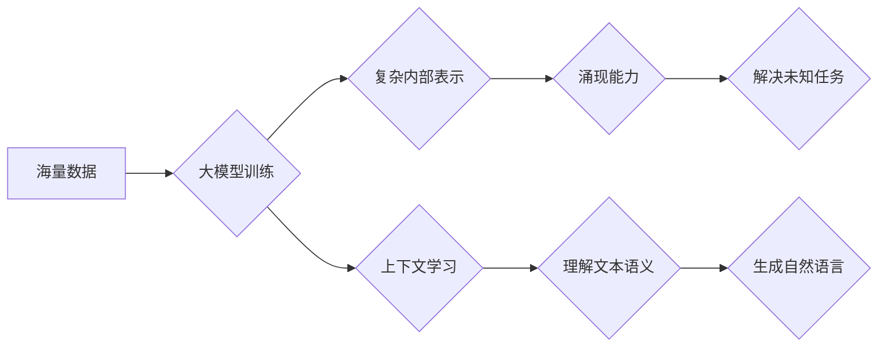

                 

## 涌现能力与上下文学习：大模型的核心优势结合应用

> 关键词：大模型、涌现能力、上下文学习、Transformer、深度学习、自然语言处理

## 1. 背景介绍

近年来，深度学习领域取得了令人瞩目的进展，其中大模型（Large Language Models，LLMs）作为一种新兴技术，展现出强大的学习和泛化能力，在自然语言处理（NLP）、计算机视觉、代码生成等领域取得了突破性成果。大模型的训练通常依赖于海量数据和强大的计算资源，其规模和复杂度远超传统机器学习模型。

大模型的涌现能力是其核心优势之一。涌现能力是指系统在复杂交互中展现出超出单个组成部分能力的新奇行为或特性。大模型通过学习海量数据，构建了复杂的内部表示，使得其能够在处理未知任务时，通过组合和重组已有的知识，产生出新的解决方案。

上下文学习是另一个关键因素，它赋予大模型理解和生成人类语言的能力。大模型通过Transformer架构中的自注意力机制，能够捕捉文本序列中单词之间的长距离依赖关系，从而更好地理解上下文信息，生成更流畅、更自然的文本。

## 2. 核心概念与联系

### 2.1 涌现能力

涌现能力是指复杂系统中，由简单规则的相互作用产生的新颖、不可预测的行为模式。这些行为模式通常超出单个组成部分的本能力，是系统整体特性的体现。

例如，蚂蚁群体虽然个体简单，但通过简单的规则（例如跟随同伴、寻找食物）的相互作用，可以实现复杂的群体行为，如觅食、筑巢、防御入侵等。

### 2.2 上下文学习

上下文学习是指模型根据输入序列中前后单词的语义关系，理解和预测下一个单词或整个序列的含义。

例如，在句子“我爱吃苹果，你喜欢吃___吗？”中，上下文信息表明空格处应该填入一种水果，因此模型可以预测空格中的单词为“香蕉”或“橙子”。

### 2.3 大模型与涌现能力

大模型通过学习海量数据，构建了复杂的内部表示，使得其能够在处理未知任务时，通过组合和重组已有的知识，产生出新的解决方案。

例如，一个训练有素的大语言模型可以根据输入的文本，生成不同的文本风格、完成不同的写作任务，甚至可以创作出新的故事或诗歌。

### 2.4 大模型与上下文学习

大模型通过Transformer架构中的自注意力机制，能够捕捉文本序列中单词之间的长距离依赖关系，从而更好地理解上下文信息，生成更流畅、更自然的文本。

例如，在翻译任务中，大模型可以根据整个句子上下文，准确地翻译出每个单词的最佳含义。

**Mermaid 流程图**



## 3. 核心算法原理 & 具体操作步骤

### 3.1 算法原理概述

大模型的核心算法是深度学习，特别是Transformer架构。Transformer架构通过自注意力机制，能够捕捉文本序列中单词之间的长距离依赖关系，从而更好地理解上下文信息。

### 3.2 算法步骤详解

1. **数据预处理:** 将文本数据进行清洗、分词、词嵌入等预处理操作，使其能够被模型理解。
2. **模型训练:** 使用深度学习算法，例如反向传播算法，训练大模型。训练过程中，模型会不断调整其内部参数，以最小化预测误差。
3. **模型评估:** 使用测试数据评估模型的性能，例如准确率、召回率、F1-score等。
4. **模型部署:** 将训练好的模型部署到实际应用场景中，例如聊天机器人、文本生成、机器翻译等。

### 3.3 算法优缺点

**优点:**

* 强大的学习能力：大模型能够学习海量数据，捕捉复杂的模式和关系。
* 泛化能力强：大模型能够在处理未知任务时，迁移已有的知识，产生出新的解决方案。
* 涌现能力：大模型能够产生出超出单个组成部分能力的新奇行为或特性。

**缺点:**

* 计算资源消耗大：训练大模型需要大量的计算资源和时间。
* 数据依赖性强：大模型的性能取决于训练数据的质量和数量。
* 可解释性差：大模型的内部工作机制复杂，难以解释其决策过程。

### 3.4 算法应用领域

* 自然语言处理：文本分类、情感分析、机器翻译、文本摘要、对话系统等。
* 计算机视觉：图像识别、物体检测、图像生成、视频分析等。
* 代码生成：自动生成代码、代码修复、代码理解等。
* 科学研究：药物发现、材料设计、蛋白质结构预测等。

## 4. 数学模型和公式 & 详细讲解 & 举例说明

### 4.1 数学模型构建

大模型的数学模型通常基于神经网络，其核心是多层感知机（MLP）和自注意力机制。

**多层感知机 (MLP):**

MLP由多个全连接层组成，每个层都有多个神经元。每个神经元接收来自上一层的输出，并通过激活函数进行非线性变换，输出到下一层。

**自注意力机制:**

自注意力机制能够捕捉文本序列中单词之间的长距离依赖关系。其核心思想是计算每个单词与其他单词之间的“注意力”权重，然后根据这些权重，对其他单词进行加权求和，得到每个单词的上下文表示。

### 4.2 公式推导过程

**自注意力机制的计算公式:**

$$
Attention(Q, K, V) = softmax(\frac{QK^T}{\sqrt{d_k}})V
$$

其中：

* $Q$：查询矩阵
* $K$：键矩阵
* $V$：值矩阵
* $d_k$：键向量的维度
* $softmax$：softmax函数

### 4.3 案例分析与讲解

**举例说明:**

假设我们有一个句子“我爱吃苹果”，其词嵌入表示为：

* 我：[0.1, 0.2, 0.3]
* 爱：[0.4, 0.5, 0.6]
* 吃：[0.7, 0.8, 0.9]
* 苹果：[1.0, 1.1, 1.2]

使用自注意力机制，我们可以计算每个单词与其他单词之间的注意力权重，例如，计算“吃”与其他单词的注意力权重：

* “吃”与“我”的注意力权重：

$$
\frac{Q_{吃}K_{我}^T}{\sqrt{d_k}}
$$

* “吃”与“爱”的注意力权重：

$$
\frac{Q_{吃}K_{爱}^T}{\sqrt{d_k}}
$$

* “吃”与“苹果”的注意力权重：

$$
\frac{Q_{吃}K_{苹果}^T}{\sqrt{d_k}}
$$

然后，根据这些注意力权重，对其他单词进行加权求和，得到“吃”的上下文表示。

## 5. 项目实践：代码实例和详细解释说明

### 5.1 开发环境搭建

* Python 3.7+
* PyTorch 1.7+
* CUDA 10.2+ (可选，用于GPU加速)

### 5.2 源代码详细实现

```python
import torch
import torch.nn as nn

class Transformer(nn.Module):
    def __init__(self, vocab_size, embedding_dim, num_heads, num_layers):
        super(Transformer, self).__init__()
        self.embedding = nn.Embedding(vocab_size, embedding_dim)
        self.transformer_layers = nn.ModuleList([
            nn.TransformerEncoderLayer(embedding_dim, num_heads)
            for _ in range(num_layers)
        ])
        self.linear = nn.Linear(embedding_dim, vocab_size)

    def forward(self, x):
        x = self.embedding(x)
        for layer in self.transformer_layers:
            x = layer(x)
        x = self.linear(x)
        return x
```

### 5.3 代码解读与分析

* `__init__` 方法：初始化模型参数，包括词嵌入层、Transformer编码器层和输出层。
* `forward` 方法：定义模型的正向传播过程，将输入序列转换为输出序列。

### 5.4 运行结果展示

训练好的模型可以用于各种自然语言处理任务，例如文本分类、机器翻译、文本摘要等。

## 6. 实际应用场景

### 6.1 聊天机器人

大模型可以用于构建更智能、更自然的聊天机器人，能够理解用户意图，并生成更流畅、更自然的回复。

### 6.2 文本生成

大模型可以用于生成各种类型的文本，例如文章、故事、诗歌、代码等。

### 6.3 机器翻译

大模型可以用于实现更准确、更流畅的机器翻译，能够跨越语言障碍，促进信息交流。

### 6.4 未来应用展望

大模型的应用场景还在不断扩展，未来可能应用于：

* 个性化教育：根据学生的学习情况，提供个性化的学习内容和辅导。
* 医疗诊断：辅助医生进行疾病诊断，提高诊断准确率。
* 科学研究：加速科学发现，推动科技进步。

## 7. 工具和资源推荐

### 7.1 学习资源推荐

* **书籍:**
    * 《深度学习》 by Ian Goodfellow, Yoshua Bengio, Aaron Courville
    * 《自然语言处理》 by Dan Jurafsky, James H. Martin
* **在线课程:**
    * Coursera: Deep Learning Specialization
    * Stanford CS224N: Natural Language Processing with Deep Learning

### 7.2 开发工具推荐

* **PyTorch:** 深度学习框架
* **TensorFlow:** 深度学习框架
* **Hugging Face Transformers:** 预训练大模型库

### 7.3 相关论文推荐

* **Attention Is All You Need:** https://arxiv.org/abs/1706.03762
* **BERT: Pre-training of Deep Bidirectional Transformers for Language Understanding:** https://arxiv.org/abs/1810.04805
* **GPT-3: Language Models are Few-Shot Learners:** https://arxiv.org/abs/2005.14165

## 8. 总结：未来发展趋势与挑战

### 8.1 研究成果总结

大模型在自然语言处理、计算机视觉等领域取得了显著进展，展现出强大的学习和泛化能力。涌现能力和上下文学习是其核心优势，为解决复杂问题提供了新的思路。

### 8.2 未来发展趋势

* 模型规模继续扩大：随着计算资源的不断发展，大模型的规模将继续扩大，从而提升其性能。
* 模型效率提升：研究人员将致力于开发更有效的训练和推理算法，降低大模型的计算成本。
* 多模态学习：大模型将融合文本、图像、音频等多模态数据，实现更全面的理解和生成。
* 伦理与安全问题：随着大模型的应用范围扩大，其伦理和安全问题将受到越来越多的关注。

### 8.3 面临的挑战

* 数据获取和标注：大模型的训练需要海量数据，而高质量数据的获取和标注成本很高。
* 计算资源限制：训练大模型需要大量的计算资源，这对于资源有限的机构或个人来说是一个挑战。
* 可解释性问题：大模型的决策过程复杂，难以解释其背后的逻辑，这可能会导致信任问题。

### 8.4 研究展望

未来，大模型研究将继续朝着更强大、更智能、更安全的方向发展。

## 9. 附录：常见问题与解答

* **Q: 大模型的训练需要多少数据？**

A: 大模型的训练需要海量数据，通常需要数十亿甚至数千亿个样本。

* **Q: 大模型的训练需要多少计算资源？**

A: 大模型的训练需要大量的计算资源，通常需要数百甚至数千个GPU。

* **Q: 如何评估大模型的性能？**

A: 大模型的性能可以评估指标，例如准确率、召回率、F1-score等。

* **Q: 大模型的应用场景有哪些？**

A: 大模型的应用场景非常广泛，例如自然语言处理、计算机视觉、代码生成等。

作者：禅与计算机程序设计艺术 / Zen and the Art of Computer Programming


<end_of_turn>

