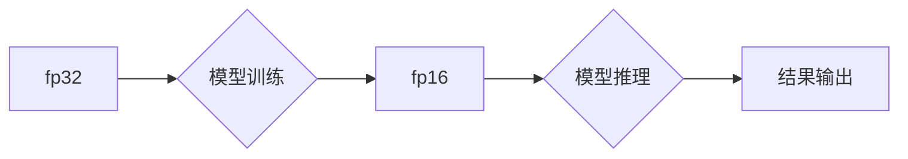

                 

## 混合精度训练：fp16、bf16和fp8的应用与比较

> 关键词：混合精度训练、fp16、bf16、fp8、深度学习、模型加速、内存效率、性能优化

## 1. 背景介绍

深度学习模型的规模不断增长，训练这些庞大模型需要大量的计算资源和内存。传统的32位浮点精度（fp32）虽然精度高，但其计算量和内存占用也十分巨大，限制了模型训练的效率和规模。为了解决这一问题，混合精度训练应运而生。混合精度训练是指在深度学习模型训练过程中，使用不同精度的数据类型，例如fp16、bf16和fp8，来平衡模型精度和训练效率。

混合精度训练的主要目标是：

* **降低内存占用：** fp16、bf16和fp8的数据类型比fp32占用更少的内存空间，可以有效减少内存压力，从而支持更大规模的模型训练。
* **加速训练速度：** 由于低精度数据类型计算量更小，因此可以在GPU上进行更快的计算，从而加速模型训练速度。
* **降低能耗：** 低精度计算需要更少的能量，可以有效降低模型训练的能耗。

## 2. 核心概念与联系

混合精度训练的核心概念是使用不同精度的数据类型来表示模型参数和激活值。

* **fp32:** 32位浮点精度，精度最高，但计算量和内存占用也最大。
* **fp16:** 16位浮点精度，精度相对较低，但计算量和内存占用只有fp32的一半。
* **bf16:**  混合精度浮点类型，在某些情况下比fp16更有效率。

混合精度训练通常采用以下策略：

* **只使用fp16训练模型参数：** 这种策略可以有效降低内存占用和训练时间，但可能会导致模型精度下降。
* **使用fp32训练模型参数，使用fp16训练模型激活值：** 这种策略可以平衡模型精度和训练效率。
* **使用混合精度训练所有模型参数和激活值：** 这种策略可以进一步提高训练效率，但需要更复杂的算法和硬件支持。

**Mermaid 流程图**



## 3. 核心算法原理 & 具体操作步骤

### 3.1  算法原理概述

混合精度训练的核心算法原理是利用低精度数据类型进行计算，并通过一些技巧来保证模型精度。

* **量化：** 将高精度数据类型（如fp32）转换为低精度数据类型（如fp16）。
* **反量化：** 将低精度数据类型转换为高精度数据类型，用于模型推理。
* **梯度融合：** 将低精度梯度转换为高精度梯度，用于更新模型参数。

### 3.2  算法步骤详解

1. **模型转换：** 将原始模型转换为支持混合精度训练的模型。
2. **数据类型转换：** 将模型参数和激活值转换为目标精度（如fp16）。
3. **前向传播：** 使用低精度数据类型进行前向传播计算。
4. **反向传播：** 使用低精度数据类型进行反向传播计算，并使用梯度融合技术将低精度梯度转换为高精度梯度。
5. **参数更新：** 使用高精度梯度更新模型参数。
6. **反量化：** 将更新后的模型参数反量化回高精度数据类型。
7. **模型推理：** 使用高精度数据类型进行模型推理。

### 3.3  算法优缺点

**优点：**

* **降低内存占用：** 使用低精度数据类型可以有效减少内存占用，支持更大规模的模型训练。
* **加速训练速度：** 低精度计算可以更快地完成，从而加速模型训练速度。
* **降低能耗：** 低精度计算需要更少的能量，可以有效降低模型训练的能耗。

**缺点：**

* **精度损失：** 使用低精度数据类型可能会导致模型精度下降。
* **算法复杂度增加：** 混合精度训练需要额外的算法和技巧来保证模型精度，从而增加了算法的复杂度。
* **硬件支持限制：** 混合精度训练需要支持低精度计算的硬件，例如具有Tensor Core的GPU。

### 3.4  算法应用领域

混合精度训练广泛应用于以下领域：

* **计算机视觉：** 图像分类、目标检测、语义分割等任务。
* **自然语言处理：** 文本分类、机器翻译、问答系统等任务。
* **语音识别：** 语音转文本、语音合成等任务。
* **推荐系统：** 用户个性化推荐、商品推荐等任务。

## 4. 数学模型和公式 & 详细讲解 & 举例说明

### 4.1  数学模型构建

混合精度训练的核心数学模型是量化和反量化模型。

* **量化模型：** 将高精度数据类型转换为低精度数据类型，例如将fp32数据转换为fp16数据。
* **反量化模型：** 将低精度数据类型转换为高精度数据类型，例如将fp16数据转换为fp32数据。

### 4.2  公式推导过程

量化和反量化模型的数学公式推导过程比较复杂，涉及到数论、线性代数等多个数学分支。

**举例说明：**

假设我们想要将一个fp32数据类型转换为fp16数据类型，可以使用以下公式：

$$
fp16 = round(fp32 * 2^{16})
$$

其中，$fp32$是fp32数据类型，$fp16$是fp16数据类型，$round$是取整函数。

### 4.3  案例分析与讲解

在实际应用中，混合精度训练的数学模型通常更加复杂，需要考虑数据分布、模型结构等因素。

**案例分析：**

在训练图像分类模型时，可以使用混合精度训练来提高训练效率。

* 将模型参数使用fp16训练，可以有效降低内存占用和训练时间。
* 使用fp32训练模型激活值，可以保证模型精度。
* 在反向传播过程中，使用梯度融合技术将低精度梯度转换为高精度梯度，可以保证模型参数更新的准确性。

## 5. 项目实践：代码实例和详细解释说明

### 5.1  开发环境搭建

混合精度训练需要支持低精度计算的硬件，例如具有Tensor Core的GPU。

**步骤：**

1. 安装深度学习框架，例如PyTorch或TensorFlow。
2. 安装混合精度训练库，例如NVIDIA Apex。
3. 配置GPU环境，确保GPU支持混合精度计算。

### 5.2  源代码详细实现

```python
import torch
import torch.nn as nn

# 定义一个简单的卷积神经网络
class SimpleCNN(nn.Module):
    def __init__(self):
        super(SimpleCNN, self).__init__()
        self.conv1 = nn.Conv2d(3, 16, kernel_size=3, padding=1)
        self.relu = nn.ReLU()
        self.pool = nn.MaxPool2d(kernel_size=2, stride=2)
        self.fc1 = nn.Linear(16 * 7 * 7, 128)
        self.fc2 = nn.Linear(128, 10)

    def forward(self, x):
        x = self.pool(self.relu(self.conv1(x)))
        x = x.view(-1, 16 * 7 * 7)
        x = self.relu(self.fc1(x))
        x = self.fc2(x)
        return x

# 实例化模型
model = SimpleCNN()

# 使用混合精度训练
model.train()
optimizer = torch.optim.Adam(model.parameters(), lr=0.001)
loss_fn = nn.CrossEntropyLoss()

# 训练循环
for epoch in range(10):
    for images, labels in dataloader:
        # 将模型参数和激活值转换为fp16
        with torch.cuda.amp.autocast():
            outputs = model(images)
            loss = loss_fn(outputs, labels)

        # 计算梯度并更新模型参数
        optimizer.zero_grad()
        loss.backward()
        optimizer.step()

```

### 5.3  代码解读与分析

* **torch.cuda.amp.autocast()**: 使用混合精度训练的上下文管理器，自动将模型参数和激活值转换为fp16，并在反向传播过程中进行梯度融合。
* **optimizer**: 使用Adam优化器更新模型参数。
* **loss_fn**: 使用交叉熵损失函数计算模型损失。

### 5.4  运行结果展示

混合精度训练可以显著提高模型训练速度和效率，同时保持模型精度。

## 6. 实际应用场景

### 6.1  图像分类

混合精度训练可以有效提高图像分类模型的训练速度和效率，例如在ImageNet数据集上训练ResNet、Inception等模型。

### 6.2  目标检测

混合精度训练可以提高目标检测模型的训练速度和效率，例如在COCO数据集上训练YOLO、Faster R-CNN等模型。

### 6.3  自然语言处理

混合精度训练可以提高自然语言处理模型的训练速度和效率，例如在GLUE、SuperGLUE等基准数据集上训练BERT、RoBERTa等模型。

### 6.4  未来应用展望

随着深度学习模型规模的不断增长，混合精度训练将成为深度学习训练的必备技术。未来，混合精度训练将应用于更多领域，例如：

* **自动驾驶：** 训练更复杂的自动驾驶模型，提高车辆的安全性。
* **医疗诊断：** 训练更准确的医疗诊断模型，辅助医生进行诊断。
* **药物研发：** 训练更有效的药物研发模型，加速药物研发进程。

## 7. 工具和资源推荐

### 7.1  学习资源推荐

* **NVIDIA Apex:** https://github.com/NVIDIA/apex
* **PyTorch Mixed Precision Training:** https://pytorch.org/docs/stable/notes/amp.html
* **TensorFlow Mixed Precision Training:** https://www.tensorflow.org/guide/mixed_precision

### 7.2  开发工具推荐

* **PyTorch:** https://pytorch.org/
* **TensorFlow:** https://www.tensorflow.org/

### 7.3  相关论文推荐

* **Mixed Precision Training:** https://arxiv.org/abs/1710.03740
* **Training Deep Neural Networks with Mixed Precision:** https://arxiv.org/abs/1901.08262

## 8. 总结：未来发展趋势与挑战

### 8.1  研究成果总结

混合精度训练是一种有效的深度学习训练技术，可以显著提高训练速度和效率，同时保持模型精度。

### 8.2  未来发展趋势

* **更低精度数据类型：** 研究更低精度的数据类型，例如bf16、fp8，以进一步提高训练效率。
* **更智能的混合精度策略：** 研究更智能的混合精度策略，根据模型结构和训练数据自动选择最佳精度。
* **硬件加速：** 开发更强大的硬件加速器，支持更复杂的混合精度训练算法。

### 8.3  面临的挑战

* **精度损失：** 使用低精度数据类型可能会导致模型精度下降，需要找到有效的精度补偿方法。
* **算法复杂度增加：** 混合精度训练需要额外的算法和技巧，增加了算法的复杂度。
* **硬件支持限制：** 混合精度训练需要支持低精度计算的硬件，目前硬件支持还不够完善。

### 8.4  研究展望

未来，混合精度训练将继续是深度学习研究的重要方向，需要进一步探索更低精度数据类型、更智能的混合精度策略和更强大的硬件加速器，以推动深度学习模型的规模化训练和应用。

## 9. 附录：常见问题与解答

### 9.1  Q1: 混合精度训练的精度损失如何解决？

**A1:** 混合精度训练的精度损失可以通过以下方法解决：

* **使用更精确的量化方法：** 例如，使用动态量化技术，根据数据分布动态调整量化精度。
* **使用精度补偿技术：** 例如，在反向传播过程中使用高精度梯度进行参数更新。
* **使用混合精度训练的模型剪枝技术：** 通过移除不重要的模型参数，可以减少精度损失。

### 9.2  Q2: 混合精度训练需要哪些硬件支持？

**A2:** 混合精度训练需要支持低精度计算的硬件，例如具有Tensor Core的NVIDIA GPU。

### 9.3  Q3: 混合精度训练有哪些开源工具？

**A3:** 混合精度训练的开源工具包括：

* **NVIDIA Apex:** https://github.com/NVIDIA/apex
* **PyTorch Mixed Precision Training:** https://pytorch.org/docs/stable/notes/amp.html
* **TensorFlow Mixed Precision Training:** https://www.tensorflow.org/guide/mixed_precision


作者：禅与计算机程序设计艺术 / Zen and the Art of Computer Programming 
<end_of_turn>

