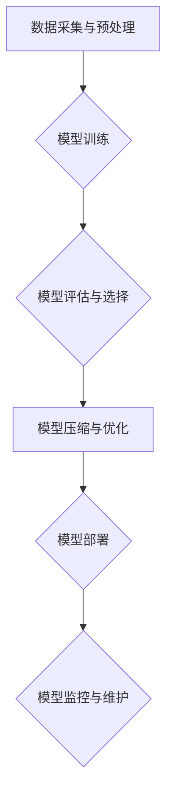

                 

## 电商平台中的AI大模型部署与优化

> 关键词：AI大模型、电商平台、部署优化、模型训练、推理加速、资源管理、微服务架构、云计算

## 1. 背景介绍

随着人工智能技术的飞速发展，大模型在各个领域展现出强大的应用潜力。电商平台作为信息化程度高、数据量庞大的行业，也积极探索大模型的应用，以提升用户体验、优化运营效率。从个性化推荐、智能客服到商品搜索、 fraud detection，大模型正在深刻改变着电商平台的运营模式。

然而，将大模型部署到电商平台并使其高效运行并非易事。大模型通常具有参数量巨大、计算资源需求高、部署复杂等特点，需要克服诸多技术挑战。

## 2. 核心概念与联系

### 2.1  AI大模型

AI大模型是指参数量在百万、千万甚至亿级的大规模神经网络模型，通过海量数据训练，能够学习复杂的模式和关系，并应用于各种自然语言处理、计算机视觉、语音识别等任务。

### 2.2  电商平台

电商平台是指提供商品展示、交易、支付等服务的在线商业平台，其核心功能包括商品信息管理、用户管理、订单处理、物流配送等。

### 2.3  部署与优化

部署是指将训练好的AI大模型部署到实际应用环境中，使其能够接受用户请求并提供服务。优化是指针对部署环境和应用场景，对模型进行调整和配置，以提高模型的性能、效率和稳定性。

**电商平台中的AI大模型部署与优化流程**



## 3. 核心算法原理 & 具体操作步骤

### 3.1  算法原理概述

大模型的训练通常基于深度学习算法，例如Transformer、BERT、GPT等。这些算法通过多层神经网络结构，学习输入数据之间的上下文关系，并生成相应的输出。

### 3.2  算法步骤详解

1. **数据预处理:** 收集并清洗电商平台的数据，例如商品信息、用户行为、评论数据等，将其转换为模型可理解的格式。
2. **模型选择:** 根据具体应用场景选择合适的AI大模型架构，例如推荐系统、搜索引擎、智能客服等。
3. **模型训练:** 使用训练数据训练模型，调整模型参数以最小化预测误差。
4. **模型评估:** 使用测试数据评估模型的性能，例如准确率、召回率、F1-score等。
5. **模型优化:** 根据评估结果，对模型进行调整和优化，例如增加训练数据、调整模型结构、优化训练参数等。
6. **模型部署:** 将训练好的模型部署到电商平台的应用环境中，使其能够接受用户请求并提供服务。

### 3.3  算法优缺点

**优点:**

* **高精度:** 大模型能够学习复杂的模式和关系，从而实现更高的预测精度。
* **泛化能力强:** 大模型在训练过程中学习到的知识能够应用于不同的场景和数据。
* **可扩展性强:** 大模型可以根据需要增加训练数据和模型参数，从而提升性能。

**缺点:**

* **计算资源需求高:** 大模型的训练和推理需要大量的计算资源，成本较高。
* **部署复杂:** 大模型的部署需要考虑模型大小、数据传输、资源分配等多个因素。
* **可解释性差:** 大模型的决策过程较为复杂，难以解释其背后的逻辑。

### 3.4  算法应用领域

* **个性化推荐:** 根据用户的历史行为和偏好，推荐个性化的商品和服务。
* **智能客服:** 使用自然语言处理技术，自动回复用户的咨询和问题。
* **商品搜索:** 理解用户的搜索意图，提供更精准的商品搜索结果。
* **fraud detection:** 检测欺诈行为，保护用户和平台安全。
* **价格预测:** 根据市场趋势和用户行为，预测商品价格走势。

## 4. 数学模型和公式 & 详细讲解 & 举例说明

### 4.1  数学模型构建

大模型的训练通常基于深度学习算法，其数学模型可以概括为以下公式：

$$
y = f(x; \theta)
$$

其中：

* $y$ 是模型的输出
* $x$ 是模型的输入
* $f$ 是激活函数
* $\theta$ 是模型的参数

### 4.2  公式推导过程

深度学习算法通过反向传播算法优化模型参数 $\theta$，使其能够最小化预测误差。反向传播算法的核心思想是利用梯度下降法，不断调整参数 $\theta$，使模型的预测结果与真实值之间的误差最小化。

### 4.3  案例分析与讲解

例如，在推荐系统中，模型的输入可以是用户的历史行为数据，例如浏览记录、购买记录、评分记录等，输出可以是推荐的商品列表。通过训练模型，学习用户偏好的商品特征，并根据用户的历史行为预测用户可能感兴趣的商品。

## 5. 项目实践：代码实例和详细解释说明

### 5.1  开发环境搭建

* **操作系统:** Linux
* **编程语言:** Python
* **深度学习框架:** TensorFlow 或 PyTorch
* **云计算平台:** AWS、Azure 或 GCP

### 5.2  源代码详细实现

```python
# 使用 TensorFlow 框架实现一个简单的推荐系统

import tensorflow as tf

# 定义模型结构
model = tf.keras.Sequential([
    tf.keras.layers.Embedding(input_dim=vocab_size, output_dim=embedding_dim),
    tf.keras.layers.Flatten(),
    tf.keras.layers.Dense(units=num_units, activation='relu'),
    tf.keras.layers.Dense(units=num_classes, activation='softmax')
])

# 编译模型
model.compile(optimizer='adam',
              loss='sparse_categorical_crossentropy',
              metrics=['accuracy'])

# 训练模型
model.fit(x_train, y_train, epochs=10)

# 评估模型
loss, accuracy = model.evaluate(x_test, y_test)
print('Loss:', loss)
print('Accuracy:', accuracy)

# 推理模型
predictions = model.predict(x_new)
```

### 5.3  代码解读与分析

* **Embedding层:** 将用户和商品的ID转换为稠密的向量表示，捕捉其潜在的语义关系。
* **Dense层:** 全连接层，用于学习用户和商品之间的复杂关系。
* **Softmax层:** 将输出结果转换为概率分布，表示每个商品被推荐的可能性。

### 5.4  运行结果展示

训练完成后，可以评估模型的性能，例如准确率、召回率等。并使用模型进行推理，预测用户可能感兴趣的商品。

## 6. 实际应用场景

### 6.1  个性化推荐

电商平台可以利用大模型进行个性化推荐，根据用户的历史行为和偏好，推荐个性化的商品和服务。例如，淘宝的“为你推荐”功能就是利用大模型进行个性化推荐。

### 6.2  智能客服

电商平台可以利用大模型构建智能客服系统，自动回复用户的咨询和问题。例如，京东的“京东小智”就是利用大模型构建的智能客服系统。

### 6.3  商品搜索

电商平台可以利用大模型提升商品搜索的精准度，理解用户的搜索意图，提供更精准的商品搜索结果。例如，亚马逊的搜索引擎就是利用大模型进行商品搜索。

### 6.4  未来应用展望

随着人工智能技术的不断发展，大模型在电商平台的应用场景将更加广泛，例如：

* **智能营销:** 利用大模型分析用户数据，精准推送广告和促销信息。
* **库存管理:** 利用大模型预测商品需求，优化库存管理。
* **物流配送:** 利用大模型优化物流配送路线，提高配送效率。

## 7. 工具和资源推荐

### 7.1  学习资源推荐

* **书籍:**
    * Deep Learning by Ian Goodfellow, Yoshua Bengio, and Aaron Courville
    * Hands-On Machine Learning with Scikit-Learn, Keras & TensorFlow by Aurélien Géron
* **在线课程:**
    * TensorFlow官方教程: https://www.tensorflow.org/tutorials
    * PyTorch官方教程: https://pytorch.org/tutorials/

### 7.2  开发工具推荐

* **深度学习框架:** TensorFlow, PyTorch
* **云计算平台:** AWS, Azure, GCP
* **数据处理工具:** Pandas, NumPy

### 7.3  相关论文推荐

* Attention Is All You Need (Vaswani et al., 2017)
* BERT: Pre-training of Deep Bidirectional Transformers for Language Understanding (Devlin et al., 2018)
* GPT-3: Language Models are Few-Shot Learners (Brown et al., 2020)

## 8. 总结：未来发展趋势与挑战

### 8.1  研究成果总结

近年来，大模型在电商平台的应用取得了显著成果，例如个性化推荐、智能客服、商品搜索等领域取得了突破性进展。

### 8.2  未来发展趋势

* **模型规模与能力提升:** 大模型的规模和能力将继续提升，能够处理更复杂的任务，提供更精准的服务。
* **模型效率优化:** 研究人员将致力于提高大模型的推理效率，使其能够在移动设备和边缘计算环境中运行。
* **模型可解释性增强:** 研究人员将探索提高大模型的可解释性，使其决策过程更加透明和可理解。
* **联邦学习与隐私保护:** 联邦学习技术将被广泛应用于大模型的训练，保障用户隐私数据安全。

### 8.3  面临的挑战

* **数据获取与质量:** 大模型的训练需要海量高质量的数据，数据获取和清洗仍然是一个挑战。
* **计算资源需求:** 大模型的训练和推理需要大量的计算资源，成本较高。
* **模型部署与维护:** 大模型的部署和维护需要专业的技术人员和完善的运维体系。
* **伦理与安全:** 大模型的应用需要考虑伦理和安全问题，例如算法偏见、数据隐私等。

### 8.4  研究展望

未来，大模型将在电商平台的应用场景中发挥越来越重要的作用，为用户提供更加个性化、智能化的服务。研究人员将继续探索大模型的潜力，解决其面临的挑战，推动大模型技术在电商领域的创新发展。

## 9. 附录：常见问题与解答

### 9.1  Q1: 如何选择合适的AI大模型架构？

**A1:** 选择合适的AI大模型架构需要根据具体的应用场景和数据特点进行考虑。例如，对于文本分类任务，BERT模型效果较好；对于图像识别任务，ResNet模型效果较好。

### 9.2  Q2: 如何优化大模型的推理效率？

**A2:** 可以通过模型压缩、量化、模型剪枝等方法优化大模型的推理效率。

### 9.3  Q3: 如何保障大模型的安全性？

**A3:** 可以通过数据加密、模型安全评估、对抗攻击防御等方法保障大模型的安全性。


作者：禅与计算机程序设计艺术 / Zen and the Art of Computer Programming 
<end_of_turn>

