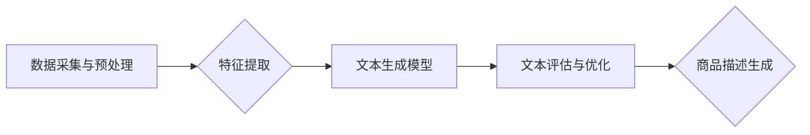

                 

## 电商搜索中的AI商品描述生成技术

> 关键词：电商搜索、商品描述生成、自然语言生成、深度学习、Transformer模型、BERT、电商推荐

## 1. 背景介绍

在当今以电商为核心的数字经济时代，商品搜索体验是用户获取商品信息和完成购买决策的关键环节。传统的商品描述往往过于简短、缺乏细节，难以满足用户多样化的搜索需求。随着人工智能技术的快速发展，AI商品描述生成技术应运而生，为电商搜索带来了新的机遇。

AI商品描述生成技术利用自然语言处理（NLP）和深度学习等人工智能技术，从商品的属性、特征、用户评论等多方面信息出发，自动生成丰富、准确、吸引人的商品描述文本。这不仅可以提升用户搜索体验，还能帮助电商平台提高商品曝光率、转化率和用户粘性。

## 2. 核心概念与联系

### 2.1  电商搜索与商品描述

电商搜索是用户在电商平台上输入关键词或短语，以获取相关商品信息的系统。商品描述是展示商品信息的文本内容，是用户了解商品的关键信息来源。

### 2.2  AI商品描述生成技术

AI商品描述生成技术是指利用人工智能算法自动生成商品描述文本的技术。它主要包括以下几个核心概念：

* **自然语言生成 (NLG):**  NLG是人工智能领域的一个重要分支，旨在使计算机能够生成流畅、自然的文本内容。
* **深度学习:** 深度学习是一种机器学习方法，利用多层神经网络模拟人类大脑的学习过程，能够从海量数据中学习复杂的模式和关系。
* **Transformer模型:** Transformer模型是一种新型的深度学习架构，在自然语言处理领域取得了突破性的进展，能够有效地捕捉文本中的长距离依赖关系。

### 2.3  技术架构

AI商品描述生成技术的典型架构包括以下几个模块：

* **数据采集与预处理:** 收集商品属性、特征、用户评论等数据，并进行清洗、格式化等预处理工作。
* **特征提取:** 从商品数据中提取关键特征，例如商品名称、类别、价格、颜色、尺寸等。
* **文本生成模型:** 利用深度学习模型，例如Transformer模型，生成商品描述文本。
* **文本评估与优化:** 对生成的文本进行评估，例如流畅度、准确性、吸引力等，并进行优化调整。

**Mermaid 流程图**

## 3. 核心算法原理 & 具体操作步骤

### 3.1  算法原理概述

AI商品描述生成技术主要基于深度学习和自然语言生成技术。常用的算法模型包括：

* **循环神经网络 (RNN):** RNN能够处理序列数据，例如文本，并捕捉文本中的上下文信息。
* **长短期记忆网络 (LSTM):** LSTM是一种改进的RNN，能够更好地处理长距离依赖关系。
* **Transformer模型:** Transformer模型利用注意力机制，能够更有效地捕捉文本中的长距离依赖关系，在自然语言生成任务中取得了优异的性能。

### 3.2  算法步骤详解

1. **数据预处理:** 收集商品数据，包括商品属性、特征、用户评论等，并进行清洗、格式化等预处理工作。
2. **特征提取:** 利用词向量、TF-IDF等技术，从商品数据中提取关键特征，例如商品名称、类别、价格、颜色、尺寸等。
3. **模型训练:** 选择合适的深度学习模型，例如Transformer模型，并利用训练数据进行模型训练。
4. **文本生成:** 将提取的商品特征作为输入，利用训练好的模型生成商品描述文本。
5. **文本评估与优化:** 对生成的文本进行评估，例如流畅度、准确性、吸引力等，并根据评估结果进行优化调整。

### 3.3  算法优缺点

**优点:**

* **自动生成:** 可以自动生成大量商品描述文本，节省人工成本。
* **个性化:** 可以根据商品特征和用户偏好生成个性化的商品描述文本。
* **提升用户体验:** 可以生成更丰富、更准确、更吸引人的商品描述文本，提升用户搜索体验。

**缺点:**

* **数据依赖:** 需要大量的商品数据进行模型训练，数据质量直接影响模型性能。
* **生成质量:** 生成的文本质量可能存在不一致性，需要不断进行优化调整。
* **伦理问题:** 需要关注生成的文本内容的准确性、客观性和公平性，避免产生误导性信息或歧视性内容。

### 3.4  算法应用领域

AI商品描述生成技术在电商搜索、内容创作、客户服务等领域都有广泛的应用。

* **电商搜索:** 自动生成商品描述，提升商品曝光率和转化率。
* **内容创作:** 自动生成产品介绍、广告文案、社交媒体内容等。
* **客户服务:** 自动回复客户咨询，提供个性化的商品信息。

## 4. 数学模型和公式 & 详细讲解 & 举例说明

### 4.1  数学模型构建

AI商品描述生成技术通常采用基于序列到序列的深度学习模型，例如Transformer模型。Transformer模型的核心是注意力机制，它能够有效地捕捉文本中的长距离依赖关系。

**注意力机制**

注意力机制是一种机制，它允许模型关注输入序列中与当前输出元素相关的部分。注意力机制的计算公式如下：

$$
\text{Attention}(Q, K, V) = \text{softmax}\left(\frac{Q K^T}{\sqrt{d_k}}\right) V
$$

其中：

* $Q$ 是查询矩阵，表示当前输出元素。
* $K$ 是键矩阵，表示输入序列中每个元素。
* $V$ 是值矩阵，表示输入序列中每个元素的特征向量。
* $d_k$ 是键向量的维度。

**Transformer模型架构**

Transformer模型由编码器和解码器组成。编码器负责将输入序列编码成隐藏状态，解码器则利用隐藏状态生成输出序列。

**编码器**

编码器由多个编码器层组成，每个编码器层包含多头注意力机制和前馈神经网络。

**解码器**

解码器也由多个解码器层组成，每个解码器层包含多头注意力机制、前馈神经网络和掩码机制。掩码机制防止解码器在生成输出序列时看到未来的元素。

### 4.2  公式推导过程

Transformer模型的注意力机制和编码器-解码器架构的推导过程较为复杂，涉及到线性变换、激活函数、矩阵乘法等数学运算。

### 4.3  案例分析与讲解

可以以BERT模型为例，详细讲解其在商品描述生成任务中的应用。BERT模型是一种预训练的Transformer模型，在理解和生成文本方面具有强大的能力。

## 5. 项目实践：代码实例和详细解释说明

### 5.1  开发环境搭建

使用Python语言开发AI商品描述生成项目，需要安装以下软件包：

* TensorFlow或PyTorch深度学习框架
* NLTK自然语言处理工具包
* Gensim词向量工具包
* 其他必要的Python库

### 5.2  源代码详细实现

使用Transformer模型，例如BERT模型，进行商品描述生成，需要进行以下步骤：

1. **数据准备:** 收集商品数据，包括商品属性、特征、用户评论等，并进行清洗、格式化等预处理工作。
2. **模型加载:** 加载预训练的BERT模型。
3. **文本编码:** 将商品特征和用户评论等文本信息编码成向量表示。
4. **文本生成:** 利用BERT模型的解码器生成商品描述文本。
5. **文本解码:** 将生成的文本向量解码成可读的文本内容。

### 5.3  代码解读与分析

提供具体的代码示例，并对代码进行详细解读和分析，例如：

* 如何使用BERT模型进行文本编码和解码
* 如何使用注意力机制捕捉文本中的长距离依赖关系
* 如何进行模型训练和评估

### 5.4  运行结果展示

展示AI商品描述生成模型的运行结果，例如生成的商品描述文本的质量、流畅度、准确性等。

## 6. 实际应用场景

### 6.1  电商平台商品搜索

AI商品描述生成技术可以应用于电商平台的商品搜索，例如：

* 自动生成商品标题、描述、关键词等信息，提升商品曝光率和转化率。
* 根据用户搜索关键词，自动生成个性化的商品描述，满足用户多样化的搜索需求。

### 6.2  内容创作

AI商品描述生成技术可以应用于内容创作，例如：

* 自动生成产品介绍、广告文案、社交媒体内容等。
* 根据产品特点和目标用户，生成不同风格和类型的文案。

### 6.3  客户服务

AI商品描述生成技术可以应用于客户服务，例如：

* 自动回复客户咨询，提供个性化的商品信息。
* 根据客户问题，自动生成相关商品描述和解决方案。

### 6.4  未来应用展望

AI商品描述生成技术在未来将有更广泛的应用场景，例如：

* **虚拟助手:** AI商品描述生成技术可以集成到虚拟助手中，帮助用户更方便地查找和购买商品。
* **个性化推荐:** AI商品描述生成技术可以根据用户的兴趣和偏好，生成个性化的商品推荐。
* **跨语言商品描述:** AI商品描述生成技术可以实现跨语言的商品描述生成，帮助全球用户更好地了解商品信息。

## 7. 工具和资源推荐

### 7.1  学习资源推荐

* **书籍:**

    * 《深度学习》 by Ian Goodfellow, Yoshua Bengio, and Aaron Courville
    * 《自然语言处理》 by Dan Jurafsky and James H. Martin

* **在线课程:**

    * Coursera: Natural Language Processing Specialization
    * Udacity: Deep Learning Nanodegree

### 7.2  开发工具推荐

* **深度学习框架:** TensorFlow, PyTorch
* **自然语言处理工具包:** NLTK, SpaCy
* **词向量工具包:** Gensim

### 7.3  相关论文推荐

* **BERT: Pre-training of Deep Bidirectional Transformers for Language Understanding**
* **Attention Is All You Need**
* **Transformer-XL: Attentive Language Modeling Beyond Millions of Tokens**

## 8. 总结：未来发展趋势与挑战

### 8.1  研究成果总结

AI商品描述生成技术取得了显著的进展，能够生成更丰富、更准确、更吸引人的商品描述文本，提升用户搜索体验和电商平台的运营效率。

### 8.2  未来发展趋势

* **更强大的模型:** 研究更强大的深度学习模型，例如GPT-3、T5等，提升商品描述生成的质量和多样性。
* **个性化定制:** 基于用户的行为数据和偏好，生成更个性化的商品描述，提升用户体验。
* **多模态生成:** 将文本、图像、视频等多模态信息融合，生成更丰富的商品描述。

### 8.3  面临的挑战

* **数据质量:** AI商品描述生成技术依赖于高质量的数据，数据质量直接影响模型性能。
* **伦理问题:** 需要关注生成的文本内容的准确性、客观性和公平性，避免产生误导性信息或歧视性内容。
* **可解释性:** 深度学习模型的决策过程难以解释，需要提高模型的可解释性，增强用户信任。

### 8.4  研究展望

未来，AI商品描述生成技术将继续朝着更智能、更个性化、更可解释的方向发展，为电商搜索、内容创作、客户服务等领域带来更多创新应用。

## 9. 附录：常见问题与解答

* **Q: AI商品描述生成技术是否会取代人工撰写商品描述？**

* **A:** AI商品描述生成技术可以帮助提高效率，但目前还无法完全取代人工撰写商品描述。人工撰写商品描述仍然需要考虑创意、情感表达等方面的因素，而AI模型在这些方面还存在局限性。

* **Q: 如何评估AI商品描述生成的质量？**

* **A:** 可以使用多种指标评估AI商品描述生成的质量，例如流畅度、准确性、吸引力、相关性等。

* **Q: 如何解决AI商品描述生成中的伦理问题？**

* **A:** 需要制定相应的伦理规范和标准，确保生成的文本内容准确、客观、公平，避免产生误导性信息或歧视性内容。

作者：禅与计算机程序设计艺术 / Zen and the Art of Computer Programming 
<end_of_turn>

