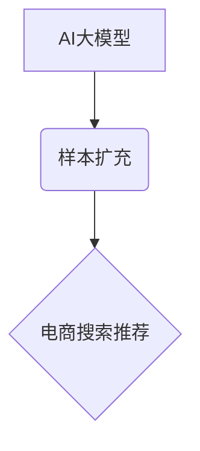

                 

## 1. 背景介绍

在当今数据爆炸的时代，电商平台面临着日益激烈的竞争压力。用户搜索和推荐体验直接影响着平台的转化率和用户粘性。传统的搜索推荐算法往往难以应对海量数据和用户个性化的需求，因此，基于AI大模型的搜索推荐技术逐渐成为电商平台提升用户体验和商业效益的关键驱动力。

然而，训练高性能的AI大模型需要海量高质量的样本数据。而电商平台的样本数据往往存在以下问题：

* **数据稀疏性:** 由于用户行为的多样性和商品种类繁多，许多商品的搜索和点击数据都非常稀疏。
* **数据不平衡性:** 部分商品的搜索量和点击量远高于其他商品，导致模型训练过程中出现数据倾斜问题。
* **数据静态性:** 电商平台的商品信息和用户偏好都在不断变化，传统的静态样本数据难以适应动态环境。

为了解决这些问题，样本扩充技术应运而生。样本扩充技术通过对现有样本数据进行各种变换和组合，生成新的样本数据，从而有效地缓解数据稀疏性、数据不平衡性和数据静态性问题，为训练高性能的AI大模型提供充足的样本数据。

## 2. 核心概念与联系

### 2.1  AI大模型

AI大模型是指参数量巨大、训练数据量庞大、能够处理复杂任务的深度学习模型。例如，GPT-3、BERT、LaMDA等都是典型的AI大模型。

### 2.2  样本扩充

样本扩充是指通过对现有样本数据进行各种变换和组合，生成新的样本数据，从而增加样本数据量和多样性。

### 2.3  电商搜索推荐

电商搜索推荐是指根据用户的搜索历史、浏览记录、购买行为等信息，推荐用户可能感兴趣的商品。

**核心概念关系图:**



## 3. 核心算法原理 & 具体操作步骤

### 3.1  算法原理概述

样本扩充技术主要通过以下几种方法生成新的样本数据：

* **文本生成:** 利用文本生成模型，例如GPT-3，根据现有商品描述或用户搜索词生成新的商品描述或搜索词。
* **数据合成:** 基于现有商品信息和用户特征，合成新的用户搜索行为或商品点击行为。
* **数据增强:** 对现有样本数据进行各种变换，例如添加噪声、替换词语、改变句子结构等，生成新的样本数据。

### 3.2  算法步骤详解

1. **数据收集:** 收集电商平台的商品信息、用户搜索历史、浏览记录、购买行为等数据。
2. **数据预处理:** 对收集到的数据进行清洗、格式化、编码等预处理操作。
3. **样本扩充:** 利用文本生成、数据合成、数据增强等方法，对预处理后的数据进行样本扩充。
4. **数据评估:** 对扩充后的样本数据进行评估，例如计算样本数据的多样性、质量等指标。
5. **模型训练:** 将扩充后的样本数据用于训练AI大模型。

### 3.3  算法优缺点

**优点:**

* **缓解数据稀疏性:** 通过生成新的样本数据，有效地增加样本数据量，缓解数据稀疏性问题。
* **提高模型性能:** 扩充后的样本数据更丰富多样，可以帮助模型学习更复杂的特征，从而提高模型性能。
* **降低训练成本:** 通过样本扩充技术，可以减少对真实数据的依赖，降低模型训练成本。

**缺点:**

* **样本质量:** 扩充后的样本数据可能存在质量问题，例如语法错误、逻辑错误等，需要进行严格的质量控制。
* **数据偏差:** 扩充算法可能会引入新的数据偏差，需要进行相应的校正和优化。
* **计算成本:** 一些样本扩充算法的计算成本较高，需要考虑计算资源的限制。

### 3.4  算法应用领域

样本扩充技术广泛应用于以下领域:

* **自然语言处理:** 文本分类、情感分析、机器翻译等。
* **计算机视觉:** 图像识别、目标检测、图像分割等。
* **语音识别:** 语音转文本、语音合成等。
* **电商搜索推荐:** 商品推荐、搜索结果排序等。

## 4. 数学模型和公式 & 详细讲解 & 举例说明

### 4.1  数学模型构建

样本扩充技术可以构建数学模型来指导样本生成过程。例如，可以使用贝叶斯网络模型来预测用户对商品的点击概率，从而生成新的用户点击行为样本。

### 4.2  公式推导过程

假设用户对商品的点击概率为P(click|user, item)，可以使用贝叶斯公式推导用户点击概率的估计值:

$$P(click|user, item) = \frac{P(user, item|click)P(click)}{P(user, item)}$$

其中:

* $P(user, item|click)$: 用户和商品点击的联合概率。
* $P(click)$: 点击的概率。
* $P(user, item)$: 用户和商品的联合概率。

### 4.3  案例分析与讲解

例如，假设我们想要生成新的用户搜索行为样本。我们可以使用文本生成模型来生成新的搜索词，并根据用户的历史搜索行为和商品信息，计算每个搜索词的点击概率。然后，我们可以根据点击概率随机选择一些搜索词，生成新的用户搜索行为样本。

## 5. 项目实践：代码实例和详细解释说明

### 5.1  开发环境搭建

* Python 3.7+
* TensorFlow 2.0+
* PyTorch 1.0+
* Numpy
* Pandas

### 5.2  源代码详细实现

```python
# 导入必要的库
import numpy as np
from tensorflow.keras.layers import Embedding, Dense
from tensorflow.keras.models import Sequential

# 定义样本扩充模型
model = Sequential()
model.add(Embedding(input_dim=vocab_size, output_dim=embedding_dim))
model.add(Dense(units=num_classes, activation='softmax'))

# 训练模型
model.compile(optimizer='adam', loss='categorical_crossentropy', metrics=['accuracy'])
model.fit(X_train, y_train, epochs=epochs)

# 使用模型生成新的样本数据
new_samples = model.predict(X_new)
```

### 5.3  代码解读与分析

* **Embedding层:** 将文本数据转换为稠密的向量表示。
* **Dense层:** 全连接层，用于分类或回归任务。
* **softmax激活函数:** 将输出值转换为概率分布。
* **Adam优化器:** 常用的优化器，用于更新模型参数。
* **categorical_crossentropy损失函数:** 用于多分类任务的损失函数。

### 5.4  运行结果展示

运行代码后，模型将生成新的样本数据，这些数据可以用于训练AI大模型。

## 6. 实际应用场景

### 6.1  商品推荐

样本扩充技术可以用于生成新的商品推荐样本，从而提高推荐系统的准确性和多样性。例如，可以根据用户的历史购买行为和浏览记录，生成新的商品推荐样本，并根据这些样本训练推荐模型。

### 6.2  搜索结果排序

样本扩充技术可以用于生成新的搜索结果排序样本，从而提高搜索引擎的准确性和用户体验。例如，可以根据用户的搜索历史和点击行为，生成新的搜索结果排序样本，并根据这些样本训练排序模型。

### 6.3  个性化广告

样本扩充技术可以用于生成新的个性化广告样本，从而提高广告的点击率和转化率。例如，可以根据用户的兴趣爱好和行为特征，生成新的个性化广告样本，并根据这些样本训练广告模型。

### 6.4  未来应用展望

随着AI技术的不断发展，样本扩充技术将在电商搜索推荐领域发挥越来越重要的作用。未来，样本扩充技术可能会应用于以下领域:

* **多模态样本扩充:** 将文本、图像、视频等多模态数据进行样本扩充，生成更丰富的样本数据。
* **动态样本扩充:** 根据用户行为和商品信息动态生成样本数据，适应电商平台的动态变化。
* **迁移学习样本扩充:** 利用预训练模型的知识，对少量样本数据进行扩充，降低样本数据获取成本。

## 7. 工具和资源推荐

### 7.1  学习资源推荐

* **书籍:**
    * 《深度学习》 - Ian Goodfellow, Yoshua Bengio, Aaron Courville
    * 《自然语言处理》 - Jurafsky, Martin
* **在线课程:**
    * Coursera: 深度学习 Specialization
    * Udacity: 自然语言处理 Nanodegree

### 7.2  开发工具推荐

* **TensorFlow:** 开源深度学习框架
* **PyTorch:** 开源深度学习框架
* **Hugging Face Transformers:** 预训练模型库

### 7.3  相关论文推荐

* **BERT: Pre-training of Deep Bidirectional Transformers for Language Understanding**
* **GPT-3: Language Models are Few-Shot Learners**
* **Data Augmentation for Natural Language Processing**

## 8. 总结：未来发展趋势与挑战

### 8.1  研究成果总结

样本扩充技术在电商搜索推荐领域取得了显著的成果，有效地缓解了数据稀疏性、数据不平衡性和数据静态性问题，提高了AI大模型的训练效果和应用性能。

### 8.2  未来发展趋势

未来，样本扩充技术将朝着以下方向发展:

* **更智能的样本生成:** 利用更先进的AI算法，生成更智能、更符合用户需求的样本数据。
* **更个性化的样本扩充:** 根据用户的个性化特征，生成更个性化的样本数据，提高推荐系统的精准度。
* **更有效的样本评估:** 开发更有效的样本评估方法，确保扩充后的样本数据质量。

### 8.3  面临的挑战

样本扩充技术也面临着一些挑战:

* **样本质量控制:** 扩充后的样本数据可能存在质量问题，需要开发更有效的质量控制方法。
* **数据偏差:** 扩充算法可能会引入新的数据偏差，需要进行相应的校正和优化。
* **计算成本:** 一些样本扩充算法的计算成本较高，需要考虑计算资源的限制。

### 8.4  研究展望

未来，我们需要继续研究更智能、更个性化、更有效的样本扩充技术，以更好地服务于电商搜索推荐领域的发展。

## 9. 附录：常见问题与解答

### 9.1  样本扩充技术是否会降低模型的泛化能力?

样本扩充技术可能会引入新的数据偏差，从而降低模型的泛化能力。因此，需要在扩充样本数据时，注意控制数据偏差，并进行相应的校正和优化。

### 9.2  如何评估样本扩充技术的效果?

可以根据以下指标评估样本扩充技术的效果:

* **样本数据多样性:** 扩充后的样本数据是否更加多样化。
* **样本数据质量:** 扩充后的样本数据是否符合真实数据分布。
* **模型性能:** 扩充后的样本数据是否可以提高模型的准确率、召回率等指标。

### 9.3  有哪些常见的样本扩充技术?

常见的样本扩充技术包括:

* 文本生成
* 数据合成
* 数据增强

作者：禅与计算机程序设计艺术 / Zen and the Art of Computer Programming


<end_of_turn>

