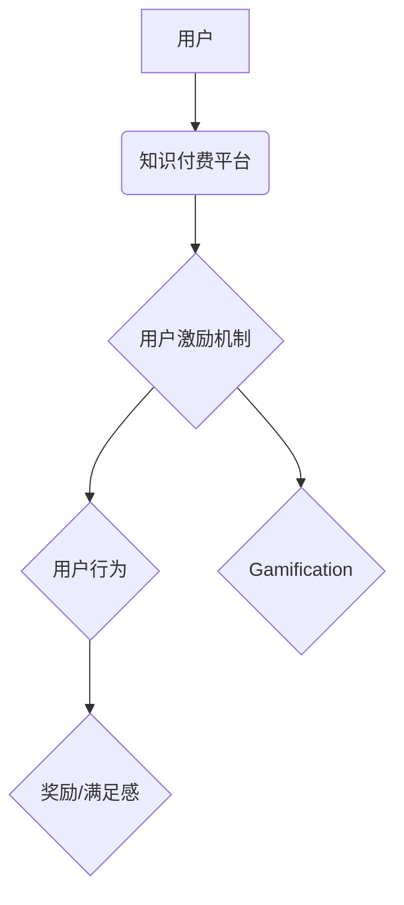

                 

## 知识付费产品的用户激励机制设计

> 关键词：知识付费、用户激励、机制设计、 gamification、社区建设、内容推荐、数据分析

## 1. 背景介绍

知识付费行业近年来发展迅速，从在线课程、付费文章到直播带货等多种形式蓬勃发展。然而，知识付费产品的用户粘性问题一直是行业痛点。如何有效激励用户付费、参与互动、持续学习，是知识付费平台需要解决的关键问题。

传统的激励机制主要依靠价格优惠、积分奖励等方式，但效果有限。随着用户需求的不断变化，知识付费平台需要探索更加创新、有效的激励机制，以提升用户体验，促进平台发展。

## 2. 核心概念与联系

### 2.1 用户激励机制

用户激励机制是指通过设计一系列策略和工具，引导用户完成特定行为，并获得相应的奖励或满足感。

### 2.2 知识付费平台

知识付费平台是指提供知识付费服务的在线平台，包括但不限于在线课程、付费文章、直播带货等。

### 2.3 Gamification

Gamification是指将游戏元素融入非游戏场景，以提高用户参与度和体验。

**核心概念关系图**



## 3. 核心算法原理 & 具体操作步骤

### 3.1 算法原理概述

用户激励机制的设计需要考虑用户行为、平台目标和市场环境等多方面因素。常用的算法原理包括：

* **行为分析:** 通过数据分析，了解用户的学习习惯、偏好和行为模式，为用户提供个性化的激励方案。
* **奖励机制:** 设计合理的奖励体系，激励用户完成学习目标、参与互动、推荐平台等行为。
* **社区建设:** 构建用户社区，鼓励用户之间交流学习，形成知识共享氛围。
* **内容推荐:** 基于用户的学习历史和兴趣，推荐相关内容，提高用户学习效率和兴趣。

### 3.2 算法步骤详解

1. **数据收集:** 收集用户行为数据，包括学习时长、课程进度、互动频率、评价等。
2. **数据分析:** 利用数据挖掘和机器学习算法，分析用户行为模式，识别用户群体和学习特征。
3. **激励方案设计:** 根据用户行为分析结果，设计个性化的激励方案，包括奖励类型、奖励规则和奖励频率。
4. **系统实施:** 将激励方案集成到平台系统中，并进行测试和优化。
5. **效果评估:** 定期评估激励机制的效果，根据数据反馈进行调整和改进。

### 3.3 算法优缺点

**优点:**

* **个性化:** 可以根据用户的不同需求和行为模式，设计个性化的激励方案。
* **有效性:** 通过合理的奖励机制和游戏化元素，可以有效提高用户参与度和学习效率。
* **可持续性:** 通过社区建设和内容推荐，可以形成良性循环，促进平台长期发展。

**缺点:**

* **数据依赖:** 需要大量用户行为数据作为基础，才能设计有效的激励方案。
* **算法复杂性:** 需要复杂的算法模型和数据处理技术，才能实现个性化和智能化激励。
* **成本投入:** 需要投入一定的成本进行系统开发、数据分析和运营维护。

### 3.4 算法应用领域

用户激励机制广泛应用于各种领域，包括：

* **教育培训:** 在线课程平台、教育APP等。
* **游戏娱乐:** 游戏平台、游戏APP等。
* **电商平台:** 购物网站、电商APP等。
* **社交平台:** 社交网络、社区平台等。

## 4. 数学模型和公式 & 详细讲解 & 举例说明

### 4.1 数学模型构建

用户激励机制可以构建为一个马尔科夫决策过程 (MDP)，其中：

* **状态:** 用户的学习状态，例如课程进度、学习时长、互动频率等。
* **动作:** 平台可以采取的激励动作，例如提供奖励、推荐内容、推送通知等。
* **奖励:** 用户完成特定行为获得的奖励，例如积分、优惠券、虚拟道具等。
* **转移概率:** 用户从一个状态转移到另一个状态的概率，受用户行为和平台激励的影响。

### 4.2 公式推导过程

MDP 的目标是找到一个最优策略，使得用户在长期内获得最大的总奖励。可以使用动态规划算法或强化学习算法来求解最优策略。

**Bellman 方程:**

$$
V^*(s) = \max_a \left[ R(s,a) + \gamma \sum_{s'} P(s'|s,a) V^*(s') \right]
$$

其中：

* $V^*(s)$ 是状态 $s$ 的最优价值函数。
* $R(s,a)$ 是在状态 $s$ 执行动作 $a$ 得到的奖励。
* $\gamma$ 是折扣因子，表示未来奖励的权重。
* $P(s'|s,a)$ 是从状态 $s$ 执行动作 $a$ 转移到状态 $s'$ 的概率。

### 4.3 案例分析与讲解

假设一个在线课程平台，用户完成课程学习可以获得积分奖励。

* 状态: 用户的课程进度 (例如已完成章节数)。
* 动作: 平台可以提供不同类型的奖励 (例如积分、优惠券、虚拟道具)。
* 奖励: 用户获得的积分数量。
* 转移概率: 用户完成课程进度受学习时长、学习效率等因素影响。

通过 Bellman 方程，平台可以计算出不同课程进度下，提供不同奖励的最佳策略，以最大化用户的学习效率和平台收益。

## 5. 项目实践：代码实例和详细解释说明

### 5.1 开发环境搭建

* 语言: Python
* 库: Pandas, NumPy, Scikit-learn
* 工具: Jupyter Notebook

### 5.2 源代码详细实现

```python
import pandas as pd
from sklearn.cluster import KMeans

# 加载用户行为数据
data = pd.read_csv('user_behavior.csv')

# 数据预处理
# ...

# 使用 KMeans 算法进行用户聚类
kmeans = KMeans(n_clusters=3)
data['cluster'] = kmeans.fit_predict(data[['学习时长', '互动频率']])

# 根据用户聚类，设计个性化激励方案
# ...

# 将激励方案集成到平台系统中
# ...
```

### 5.3 代码解读与分析

* 代码首先加载用户行为数据，并进行预处理。
* 使用 KMeans 算法对用户进行聚类，将用户分为不同的群体。
* 根据用户聚类结果，设计个性化的激励方案。例如，对学习时长较长的用户提供更高的积分奖励，对互动频率较高的用户提供更多社区活动机会。
* 将激励方案集成到平台系统中，并进行测试和优化。

### 5.4 运行结果展示

* 用户行为分析结果，包括用户群体特征、学习模式等。
* 不同用户群体的激励方案设计。
* 激励机制的效果评估，包括用户参与度、学习效率、平台收益等指标。

## 6. 实际应用场景

### 6.1 在线课程平台

* **个性化学习路径:** 根据用户的学习进度和兴趣，推荐个性化的学习路径和课程内容。
* **互动式学习:** 通过论坛、直播等方式，鼓励用户之间互动学习，形成知识共享氛围。
* **积分奖励:** 用户完成学习目标、参与互动、推荐平台等行为，可以获得积分奖励，兑换优惠券、虚拟道具等。

### 6.2 付费文章平台

* **内容推荐:** 根据用户的阅读历史和兴趣，推荐相关付费文章，提高用户阅读体验。
* **会员制度:** 提供不同等级的会员服务，享受不同权益，例如免费阅读、折扣优惠、专属内容等。
* **作者激励:** 通过打赏、订阅等方式，激励作者创作优质内容。

### 6.3 直播带货平台

* **互动直播:** 通过弹幕、投票等方式，提高用户参与度，增强直播效果。
* **限时抢购:** 利用时间限制和稀缺性，刺激用户购买欲望。
* **粉丝福利:** 为粉丝提供专属优惠、抽奖活动等福利，增强用户粘性。

### 6.4 未来应用展望

随着人工智能、大数据等技术的不断发展，用户激励机制将更加智能化、个性化和精准化。未来，知识付费平台将更加注重用户体验，通过更有效的激励机制，吸引更多用户参与学习和消费。

## 7. 工具和资源推荐

### 7.1 学习资源推荐

* **书籍:**
    * 《行为经济学》
    * 《激励机制设计》
    * 《数据分析与机器学习》
* **在线课程:**
    * Coursera: 数据分析、机器学习、行为经济学
    * Udemy: 用户激励机制设计、游戏化设计

### 7.2 开发工具推荐

* **Python:** 数据分析、机器学习、系统开发
* **Pandas:** 数据处理和分析
* **NumPy:** 数值计算
* **Scikit-learn:** 机器学习算法
* **Jupyter Notebook:** 代码开发和数据可视化

### 7.3 相关论文推荐

* **Gamification in Education: A Systematic Review**
* **The Design and Implementation of User Incentive Mechanisms in Online Learning Platforms**
* **A Survey of User Incentive Mechanisms in Online Social Networks**

## 8. 总结：未来发展趋势与挑战

### 8.1 研究成果总结

用户激励机制的设计是知识付费平台发展的重要方向。通过数据分析、算法模型和游戏化元素，可以有效提高用户参与度、学习效率和平台收益。

### 8.2 未来发展趋势

* **更智能化:** 利用人工智能技术，实现更精准的个性化激励。
* **更沉浸式:** 通过虚拟现实、增强现实等技术，打造更沉浸式的学习体验。
* **更生态化:** 建立更完善的知识付费生态系统，促进用户、平台和内容创作者之间的协同发展。

### 8.3 面临的挑战

* **数据隐私:** 如何保护用户数据隐私，同时利用数据进行个性化激励。
* **算法公平性:** 如何设计公平公正的算法模型，避免算法歧视和偏见。
* **用户信任:** 如何建立用户对平台的信任，确保激励机制的有效性和可持续性。

### 8.4 研究展望

未来，用户激励机制的设计将更加注重用户体验、数据隐私和算法公平性，并与人工智能、虚拟现实等新技术融合，为用户提供更智能、更沉浸、更生态的知识付费体验。

## 9. 附录：常见问题与解答

* **Q: 如何设计有效的激励方案？**

A: 需要根据用户行为分析结果，结合平台目标和市场环境，设计个性化、差异化、有吸引力的激励方案。

* **Q: 如何评估激励机制的效果？**

A: 可以通过用户参与度、学习效率、平台收益等指标进行评估，并根据数据反馈进行调整和优化。

* **Q: 如何平衡用户激励和平台收益？**

A: 需要根据平台的商业模式和用户价值，制定合理的激励规则和奖励机制，确保平台可持续发展。


作者：禅与计算机程序设计艺术 / Zen and the Art of Computer Programming 
<end_of_turn>

