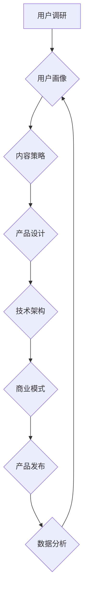

                 

## 知识付费创业的产品矩阵构建

> 关键词：知识付费、产品矩阵、用户画像、内容运营、商业模式、技术架构、数据分析

## 1. 背景介绍

知识付费行业近年来发展迅速，从线上课程、付费咨询到会员体系，各种模式层出不穷。然而，在激烈的市场竞争中，单纯依靠优质内容难以获得持续的成功。构建一个完善的产品矩阵，才能更好地满足用户需求，实现商业可持续发展。

知识付费创业的产品矩阵构建，本质上是围绕用户需求，以产品为载体，构建一个多层次、多维度的价值体系。它需要结合用户画像、内容运营、商业模式、技术架构等多方面因素，才能形成一个完整的生态系统。

## 2. 核心概念与联系

**2.1 知识付费产品矩阵**

知识付费产品矩阵是指一个知识付费平台或企业，根据用户需求和市场趋势，设计和构建的多个不同类型的知识付费产品组合。

**2.2 用户画像**

用户画像是指对目标用户进行深入分析，包括其年龄、性别、职业、兴趣爱好、学习习惯、消费能力等多方面信息，形成一个详细的用户画像。

**2.3 内容运营**

内容运营是指围绕用户需求，策划、创作、发布、推广和管理知识付费内容，以吸引用户并提升用户粘性。

**2.4 商业模式**

商业模式是指知识付费平台或企业如何盈利，包括付费课程、会员体系、咨询服务、线下活动等多种模式。

**2.5 技术架构**

技术架构是指知识付费平台或企业的基础设施和技术支撑，包括内容管理系统、支付系统、用户管理系统、数据分析系统等。

**2.6 数据分析**

数据分析是指对用户行为、内容表现、商业模式等数据进行分析，以优化产品、运营策略和商业模式。

**2.7 产品矩阵构建流程**



## 3. 核心算法原理 & 具体操作步骤

**3.1 算法原理概述**

知识付费产品矩阵构建的核心算法原理是基于用户画像和内容运营策略，通过数据分析和机器学习，推荐个性化内容，提升用户粘性和转化率。

**3.2 算法步骤详解**

1. **用户画像构建:** 收集用户数据，包括用户行为、兴趣爱好、学习习惯等，构建用户画像。

2. **内容分类和标签化:** 对知识付费内容进行分类和标签化，以便于用户搜索和推荐。

3. **推荐算法:** 基于用户画像和内容标签，使用协同过滤、内容过滤、混合推荐等算法，推荐个性化内容。

4. **数据分析和优化:** 分析用户行为数据，例如点击率、观看时长、购买转化率等，优化推荐算法和内容策略。

**3.3 算法优缺点**

**优点:**

* **个性化推荐:** 能够根据用户需求，推荐更符合其兴趣的内容。
* **提升用户粘性:** 个性化推荐能够提高用户参与度和粘性。
* **数据驱动:** 基于数据分析，不断优化推荐算法和内容策略。

**缺点:**

* **数据依赖:** 需要大量用户数据才能训练有效的推荐算法。
* **算法复杂度:** 推荐算法的实现需要一定的技术难度。
* **冷启动问题:** 新用户或新内容难以获得推荐。

**3.4 算法应用领域**

* **在线教育:** 推荐个性化课程和学习资源。
* **知识付费平台:** 推荐付费课程、咨询服务和会员内容。
* **电商平台:** 推荐个性化商品和服务。
* **社交媒体:** 推荐个性化内容和好友。

## 4. 数学模型和公式 & 详细讲解 & 举例说明

**4.1 数学模型构建**

知识付费产品矩阵构建可以采用用户-内容交互矩阵模型，该模型将用户和内容表示为矩阵，其中每个元素表示用户对内容的评分或交互行为。

**4.2 公式推导过程**

协同过滤推荐算法的核心公式是基于用户-内容交互矩阵的相似度计算。

* **余弦相似度:**

$$
\text{相似度} = \frac{\mathbf{u} \cdot \mathbf{v}}{\|\mathbf{u}\| \|\mathbf{v}\|}
$$

其中，$\mathbf{u}$ 和 $\mathbf{v}$ 分别表示两个用户的向量表示，$\cdot$ 表示点积，$\|\mathbf{u}\|$ 和 $\|\mathbf{v}\|$ 分别表示两个向量的模长。

**4.3 案例分析与讲解**

假设有两个用户 A 和 B，他们对三个课程 C1、C2、C3 的评分分别如下：

| 用户 | C1 | C2 | C3 |
|---|---|---|---|
| A | 5 | 3 | 4 |
| B | 4 | 5 | 3 |

我们可以将用户和课程表示为向量，然后计算它们的余弦相似度。

* $\mathbf{u}_A = [5, 3, 4]$
* $\mathbf{u}_B = [4, 5, 3]$

$$
\text{相似度} = \frac{5 \cdot 4 + 3 \cdot 5 + 4 \cdot 3}{\sqrt{5^2 + 3^2 + 4^2} \sqrt{4^2 + 5^2 + 3^2}} = \frac{20 + 15 + 12}{\sqrt{50} \sqrt{50}} = \frac{47}{50} = 0.94
$$

余弦相似度为 0.94，表明用户 A 和 B 的兴趣偏好非常相似。因此，我们可以推荐用户 A 观看用户 B 喜欢的课程。

## 5. 项目实践：代码实例和详细解释说明

**5.1 开发环境搭建**

* Python 3.x
* Flask 或 Django 框架
* MySQL 或 PostgreSQL 数据库
* Redis 或 Memcached 缓存

**5.2 源代码详细实现**

```python
# Flask 示例代码

from flask import Flask, render_template

app = Flask(__name__)

@app.route('/')
def index():
    return render_template('index.html')

if __name__ == '__main__':
    app.run(debug=True)
```

**5.3 代码解读与分析**

* 该代码示例使用 Flask 框架构建了一个简单的知识付费平台首页。
* `render_template('index.html')` 函数渲染 `index.html` 模板文件，该模板文件包含平台首页的布局和内容。

**5.4 运行结果展示**

运行该代码后，访问 `http://127.0.0.1:5000/`，即可看到平台首页。

## 6. 实际应用场景

**6.1 在线教育平台**

知识付费产品矩阵可以帮助在线教育平台提供个性化课程推荐、会员体系、直播课程、线下活动等多种服务，满足不同用户需求。

**6.2 知识付费平台**

知识付费平台可以构建产品矩阵，包括付费课程、咨询服务、会员体系、社区互动等，打造一个完整的知识付费生态系统。

**6.3 企业培训平台**

企业可以利用知识付费产品矩阵，为员工提供个性化培训课程、技能提升服务、职业发展规划等，提升员工素质和竞争力。

**6.4 未来应用展望**

随着人工智能、大数据、云计算等技术的不断发展，知识付费产品矩阵将更加智能化、个性化和多元化。

## 7. 工具和资源推荐

**7.1 学习资源推荐**

* **书籍:** 《产品经理的成长之路》、《互联网产品设计》、《数据分析实战》
* **在线课程:** Coursera、edX、Udemy 等平台提供丰富的知识付费课程。
* **博客和论坛:** CSDN、知乎、Stack Overflow 等平台提供丰富的技术文章和讨论社区。

**7.2 开发工具推荐**

* **Python:** 强大的编程语言，广泛应用于数据分析、机器学习等领域。
* **Flask 或 Django:** Python 框架，用于构建 Web 应用。
* **MySQL 或 PostgreSQL:** 数据库系统，用于存储用户数据和内容数据。
* **Redis 或 Memcached:** 缓存系统，用于加速数据访问。

**7.3 相关论文推荐**

* **协同过滤推荐算法:** "Collaborative Filtering for Recommender Systems" by Su-Yin Lee and Wei-Ling Chen
* **内容过滤推荐算法:** "Content-Based Recommendation Systems" by  Paul Resnick and  Charles T.  Bell

## 8. 总结：未来发展趋势与挑战

**8.1 研究成果总结**

知识付费产品矩阵构建是一个不断发展和完善的领域。通过用户画像、内容运营、商业模式、技术架构等多方面因素的结合，可以构建一个更加完善的知识付费生态系统。

**8.2 未来发展趋势**

* **更智能化:** 利用人工智能技术，实现更加智能化的内容推荐和用户服务。
* **更个性化:** 基于用户行为和偏好，提供更加个性化的学习体验。
* **更多元化:** 拓展知识付费产品矩阵，包括直播课程、线下活动、社区互动等多种服务。

**8.3 面临的挑战**

* **数据安全和隐私保护:** 知识付费平台需要妥善处理用户数据，保障数据安全和隐私。
* **内容质量和原创性:** 知识付费平台需要保证内容质量和原创性，避免低质量内容的泛滥。
* **商业模式的创新:** 知识付费平台需要不断探索新的商业模式，实现可持续发展。

**8.4 研究展望**

未来，知识付费产品矩阵构建的研究将更加注重用户体验、数据安全和商业模式的创新，以满足用户日益增长的需求。


## 9. 附录：常见问题与解答

**9.1 如何构建用户画像？**

可以通过用户行为数据、问卷调查、用户访谈等方式收集用户数据，然后进行分析和归纳，构建用户画像。

**9.2 如何选择合适的推荐算法？**

需要根据平台的特点、用户需求和数据情况，选择合适的推荐算法。

**9.3 如何保证内容质量？**

可以通过建立内容审核机制、邀请专家参与内容创作、鼓励用户反馈等方式保证内容质量。


作者：禅与计算机程序设计艺术 / Zen and the Art of Computer Programming 
<end_of_turn>

