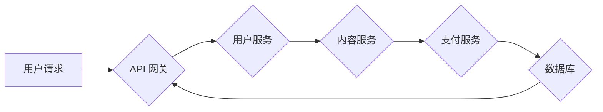

                 

## 知识付费平台的技术架构设计

> 关键词：知识付费平台、微服务架构、云原生、数据库设计、内容分发、用户管理、支付系统、安全保障

## 1. 背景介绍

知识付费平台作为一种新型的教育和内容消费模式，近年来发展迅速，用户规模不断扩大。其核心价值在于将专业知识和技能以付费的形式提供给有需求的用户，满足用户对个性化学习和技能提升的需求。随着平台用户和内容量的不断增长，对平台的技术架构提出了更高的要求。

传统的知识付费平台往往采用单体架构，随着业务规模的扩大，单体架构面临着以下问题：

* **可扩展性差:** 单体架构难以应对突发流量高峰，导致系统性能下降甚至崩溃。
* **维护复杂:** 单体架构代码庞大，修改和维护难度大，开发效率低。
* **功能迭代慢:** 单体架构的修改需要对整个系统进行重新部署，迭代周期长。

为了解决这些问题，知识付费平台需要采用更加灵活、可扩展、可维护的架构模式。

## 2. 核心概念与联系

微服务架构是近年来备受关注的架构模式之一，它将大型应用程序拆分成多个小型、独立的服务，每个服务负责特定的业务功能。微服务架构具有以下特点：

* **松耦合:** 微服务之间通过轻量级的API进行通信，彼此独立，降低了系统间的依赖关系。
* **独立部署:** 每个微服务可以独立部署和更新，提高了系统的灵活性和可扩展性。
* **技术多样性:** 微服务可以采用不同的技术栈，满足不同业务需求。

**Mermaid 流程图:**



## 3. 核心算法原理 & 具体操作步骤

### 3.1  算法原理概述

知识付费平台的核心算法主要涉及内容推荐、用户画像、支付处理等方面。

* **内容推荐算法:** 基于用户历史行为、兴趣偏好等数据，推荐用户可能感兴趣的内容。常用的算法包括协同过滤、内容过滤、深度学习等。
* **用户画像算法:** 通过分析用户行为、社交关系等数据，构建用户画像，了解用户的兴趣、需求、消费习惯等信息。常用的算法包括聚类分析、关联规则挖掘、机器学习等。
* **支付处理算法:** 安全、高效地处理用户支付请求，保障资金安全。常用的算法包括加密算法、数字签名、支付协议等。

### 3.2  算法步骤详解

**内容推荐算法步骤:**

1. 收集用户行为数据，包括浏览记录、购买记录、点赞记录等。
2. 利用机器学习算法对用户行为数据进行分析，构建用户兴趣模型。
3. 根据用户兴趣模型，推荐与用户兴趣相关的知识付费内容。

**用户画像算法步骤:**

1. 收集用户基本信息、行为数据、社交关系等数据。
2. 利用数据挖掘和机器学习算法对用户数据进行分析，提取用户特征。
3. 将用户特征聚类，构建用户画像。

**支付处理算法步骤:**

1. 用户发起支付请求。
2. 系统对支付请求进行验证，确保用户身份和支付信息合法。
3. 使用加密算法对支付信息进行加密，保障支付安全。
4. 将加密后的支付信息发送到支付平台进行处理。
5. 支付平台处理成功后，返回支付结果给系统。
6. 系统根据支付结果更新用户账户信息和订单状态。

### 3.3  算法优缺点

**内容推荐算法:**

* **优点:** 可以根据用户兴趣推荐个性化内容，提高用户体验。
* **缺点:** 容易陷入“推荐陷阱”，只推荐用户已经喜欢的类型，导致用户缺乏探索新内容的机会。

**用户画像算法:**

* **优点:** 可以更深入地了解用户需求，为用户提供更精准的服务。
* **缺点:** 需要大量的数据进行训练，算法模型的准确性依赖于数据质量。

**支付处理算法:**

* **优点:** 可以保障支付安全，防止欺诈行为。
* **缺点:** 需要与第三方支付平台进行集成，增加系统复杂度。

### 3.4  算法应用领域

* **内容推荐:** 电子商务、社交媒体、视频网站等平台。
* **用户画像:** 营销推广、个性化服务、精准广告投放等领域。
* **支付处理:** 在线支付、移动支付、电商平台等场景。

## 4. 数学模型和公式 & 详细讲解 & 举例说明

### 4.1  数学模型构建

**协同过滤算法:**

协同过滤算法基于用户的行为相似性进行推荐。假设用户 $u$ 和用户 $v$ 对物品 $i$ 和物品 $j$ 的评分分别为 $r_{ui}$、$r_{uj}$、$r_{vi}$、$r_{vj}$，则用户 $u$ 对物品 $j$ 的预测评分可以表示为：

$$
\hat{r}_{uj} = \bar{r}_u + \frac{\text{sim}(u,v) \cdot (r_{vi} - \bar{r}_v)}{\text{sim}(u,v) \cdot (r_{vi} - \bar{r}_v) + \epsilon}
$$

其中：

* $\bar{r}_u$ 是用户 $u$ 的平均评分。
* $\bar{r}_v$ 是用户 $v$ 的平均评分。
* $\text{sim}(u,v)$ 是用户 $u$ 和用户 $v$ 之间的相似度。
* $\epsilon$ 是一个小的常数，用于避免分母为零。

### 4.2  公式推导过程

协同过滤算法的相似度计算可以使用余弦相似度、皮尔逊相关系数等方法。

**余弦相似度:**

$$
\text{sim}(u,v) = \frac{u \cdot v}{||u|| ||v||}
$$

其中：

* $u$ 和 $v$ 是用户 $u$ 和用户 $v$ 的评分向量。
* $u \cdot v$ 是 $u$ 和 $v$ 的点积。
* $||u||$ 和 $||v||$ 是 $u$ 和 $v$ 的模长。

### 4.3  案例分析与讲解

假设用户 $A$ 和用户 $B$ 对以下三个课程的评分如下：

| 课程 | 用户 $A$ | 用户 $B$ |
|---|---|---|
| 课程 1 | 5 | 4 |
| 课程 2 | 3 | 5 |
| 课程 3 | 4 | 3 |

我们可以计算用户 $A$ 和用户 $B$ 的余弦相似度：

$$
\text{sim}(A,B) = \frac{(5 \cdot 4) + (3 \cdot 5) + (4 \cdot 3)}{\sqrt{5^2 + 3^2 + 4^2} \cdot \sqrt{4^2 + 5^2 + 3^2}} = 0.75
$$

根据协同过滤算法，我们可以预测用户 $A$ 对课程 4 的评分。

## 5. 项目实践：代码实例和详细解释说明

### 5.1  开发环境搭建

* 操作系统：Linux
* 编程语言：Python
* 框架：Django
* 数据库：MySQL
* 云平台：AWS

### 5.2  源代码详细实现

```python
# views.py
from django.shortcuts import render
from .models import Course

def course_list(request):
    courses = Course.objects.all()
    return render(request, 'course_list.html', {'courses': courses})

# models.py
from django.db import models

class Course(models.Model):
    title = models.CharField(max_length=200)
    description = models.TextField()
    price = models.DecimalField(max_digits=6, decimal_places=2)

# urls.py
from django.urls import path
from . import views

urlpatterns = [
    path('courses/', views.course_list, name='course_list'),
]
```

### 5.3  代码解读与分析

* views.py 文件定义了课程列表页面的视图函数 `course_list`，该函数从数据库中获取所有课程数据，并将其传递给模板 `course_list.html` 进行渲染。
* models.py 文件定义了 `Course` 模型，该模型代表一个课程，包含标题、描述和价格等字段。
* urls.py 文件定义了 URL 路由，将 `/courses/` 路径映射到 `course_list` 视图函数。

### 5.4  运行结果展示

访问 `/courses/` 路径，即可看到课程列表页面，其中包含所有课程的标题、描述和价格信息。

## 6. 实际应用场景

知识付费平台的应用场景非常广泛，包括：

* **在线教育:** 提供各种类型的在线课程，例如编程、设计、语言学习等。
* **技能培训:** 提供职业技能培训课程，帮助用户提升职业竞争力。
* **专业知识分享:** 专家学者分享专业知识和经验，帮助用户学习和成长。
* **兴趣爱好发展:** 提供各种兴趣爱好课程，例如绘画、音乐、写作等。

### 6.4  未来应用展望

随着人工智能、大数据等技术的不断发展，知识付费平台将更加智能化、个性化。未来，知识付费平台可能具备以下特点：

* **智能推荐:** 基于用户行为和兴趣，提供更加精准的课程推荐。
* **个性化学习:** 根据用户的学习进度和能力，提供个性化的学习路径和内容。
* **沉浸式体验:** 利用虚拟现实、增强现实等技术，提供更加沉浸式的学习体验。
* **社区互动:** 建立学习社区，促进用户之间的交流和互动。

## 7. 工具和资源推荐

### 7.1  学习资源推荐

* **书籍:**
    * 《构建微服务架构》
    * 《云原生架构》
    * 《机器学习实战》

* **在线课程:**
    * Coursera
    * Udemy
    * edX

### 7.2  开发工具推荐

* **IDE:**
    * PyCharm
    * VS Code

* **数据库:**
    * MySQL
    * PostgreSQL
    * MongoDB

* **云平台:**
    * AWS
    * Azure
    * Google Cloud Platform

### 7.3  相关论文推荐

* **微服务架构:**
    * Martin Fowler, "Microservices"
* **云原生架构:**
    * Kelsey Hightower, "The Cloud Native Landscape"
* **机器学习:**
    * Andrew Ng, "Machine Learning"

## 8. 总结：未来发展趋势与挑战

### 8.1  研究成果总结

知识付费平台的技术架构设计已经取得了显著的成果，微服务架构、云原生技术、人工智能等技术为平台的建设和发展提供了强大的支撑。

### 8.2  未来发展趋势

未来，知识付费平台的技术架构将更加复杂、智能化。

* **更细粒度的服务拆分:** 将微服务进一步拆分，提高系统的灵活性。
* **更强大的人工智能能力:** 利用人工智能技术，实现更精准的推荐、更个性化的学习体验。
* **更安全的支付体系:** 加强支付安全保障，防止欺诈行为。

### 8.3  面临的挑战

知识付费平台的技术架构设计也面临着一些挑战。

* **系统复杂度:** 随着平台功能的不断增加，系统复杂度不断提高，维护和管理难度加大。
* **数据安全:** 用户数据安全是知识付费平台面临的重大挑战，需要采取有效的措施保障用户数据安全。
* **技术迭代:** 随着技术的不断发展，平台需要不断迭代更新，才能保持竞争力。

### 8.4  研究展望

未来，知识付费平台的技术架构设计将继续深入研究，探索更先进的技术方案，为用户提供更加优质的学习体验。

## 9. 附录：常见问题与解答

* **Q1: 如何选择合适的数据库？**

* **A1:** 选择数据库需要根据平台的业务需求和数据特点进行考虑。例如，如果平台需要存储大量用户数据，可以选择 NoSQL 数据库，例如 MongoDB。如果平台需要进行复杂的查询操作，可以选择关系型数据库，例如 MySQL。

* **Q2: 如何保障支付安全？**

* **A2:** 知识付费平台需要与第三方支付平台进行集成，并采用加密算法、数字签名等技术保障支付安全。

* **Q3: 如何进行系统监控和故障处理？**

* **A3:** 知识付费平台需要建立完善的监控系统，实时监控系统运行状态，并制定相应的故障处理方案。


作者：禅与计算机程序设计艺术 / Zen and the Art of Computer Programming 
<end_of_turn>

