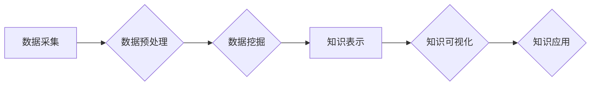

                 

## 知识发现引擎如何加速科学突破

> 关键词：知识发现引擎、机器学习、数据挖掘、科学研究、人工智能、数据分析、模式识别、科学突破

## 1. 背景介绍

科学研究的本质是探索未知，揭示规律，推动人类文明进步。然而，随着科学领域知识的日益增长和复杂化，传统的研究方法面临着巨大的挑战。海量数据、复杂模型、跨学科交叉等因素使得科学发现变得更加困难和耗时。

知识发现引擎 (Knowledge Discovery Engine，KDE) 作为一种新兴的智能技术，正逐渐成为加速科学突破的重要工具。KDE 通过对海量数据进行智能分析和挖掘，能够识别隐藏的模式、发现新的关联和推导新的理论，从而帮助科学家更高效地进行研究，更快地取得突破性进展。

## 2. 核心概念与联系

### 2.1  知识发现引擎 (KDE)

知识发现引擎 (KDE) 是一种基于人工智能和数据挖掘技术的软件系统，旨在从海量数据中自动发现隐藏的知识和模式。KDE 通常由以下几个核心模块组成：

* **数据采集模块:** 从各种数据源收集数据，包括文本、图像、音频、视频等。
* **数据预处理模块:** 对收集到的数据进行清洗、转换、整合等预处理，使其能够被后续算法有效处理。
* **数据挖掘模块:** 使用各种数据挖掘算法，例如关联规则挖掘、分类、聚类等，从数据中发现隐藏的模式和规律。
* **知识表示模块:** 将发现的知识以可理解的形式表示出来，例如知识图谱、规则等。
* **知识可视化模块:** 将知识以直观的方式呈现出来，帮助用户理解和分析发现的知识。

### 2.2  数据挖掘与机器学习

数据挖掘和机器学习是KDE的核心技术。数据挖掘是指从数据中发现隐藏的模式和规律，而机器学习是指让计算机通过学习数据自动提高其性能。

数据挖掘算法可以分为以下几类：

* **关联规则挖掘:** 发现数据中存在关联关系的项集。
* **分类:** 将数据划分为不同的类别。
* **聚类:** 将数据按照相似性进行分组。
* **回归:** 预测连续数值。

机器学习算法可以分为以下几类：

* **监督学习:** 在已标记的数据集上训练模型，用于预测新的数据。
* **无监督学习:** 在未标记的数据集上训练模型，用于发现数据中的隐藏结构。
* **强化学习:** 通过与环境交互，学习最优策略。

### 2.3  KDE 与科学研究

KDE 可以应用于各个科学领域，例如生物学、医学、物理学、化学等。

* **生物学:** KDE 可以用于分析基因组数据、蛋白质结构、药物作用机制等，帮助科学家发现新的生物学规律和药物靶点。
* **医学:** KDE 可以用于分析患者病历、影像数据、基因组数据等，帮助医生诊断疾病、预测病情发展和制定个性化治疗方案。
* **物理学:** KDE 可以用于分析粒子碰撞数据、天文观测数据等，帮助科学家探索宇宙的奥秘和发现新的物理现象。
* **化学:** KDE 可以用于分析化学反应数据、分子结构等，帮助科学家设计新的材料和合成新的化合物。

**Mermaid 流程图**



## 3. 核心算法原理 & 具体操作步骤

### 3.1  算法原理概述

KDE 中常用的算法包括关联规则挖掘、分类、聚类和回归等。这些算法都基于统计学和机器学习的原理，通过对数据进行分析和建模，来发现隐藏的模式和规律。

* **关联规则挖掘:** 寻找数据中频繁出现的项集之间的关联关系。例如，在超市购物数据中，发现“啤酒和香肠”经常一起购买。
* **分类:** 将数据划分为不同的类别。例如，根据用户的行为特征，将用户分为不同的客户群体。
* **聚类:** 将数据按照相似性进行分组。例如，将客户按照消费习惯进行分组。
* **回归:** 预测连续数值。例如，预测房价、股票价格等。

### 3.2  算法步骤详解

以下以关联规则挖掘为例，详细说明算法的步骤：

1. **数据预处理:** 对原始数据进行清洗、转换、整合等操作，使其符合算法的输入要求。
2. **频繁项集挖掘:** 使用 Apriori 算法或 FP-Growth 算法等，从数据中挖掘出频繁出现的项集。
3. **关联规则生成:** 根据频繁项集，使用支持度和置信度等指标，生成关联规则。
4. **规则筛选:** 对生成的关联规则进行筛选，去除不重要的规则，保留有价值的规则。

### 3.3  算法优缺点

**关联规则挖掘算法的优缺点:**

* **优点:** 能够发现数据中隐藏的关联关系，帮助用户理解数据之间的联系。
* **缺点:** 容易产生冗余规则，需要进行规则筛选。

### 3.4  算法应用领域

关联规则挖掘算法广泛应用于以下领域:

* **市场营销:** 分析客户购买行为，发现商品之间的关联关系，进行精准营销。
* **推荐系统:** 根据用户的历史行为，推荐相关的商品或服务。
* **医疗诊断:** 分析患者病历数据，发现疾病之间的关联关系，辅助医生诊断。

## 4. 数学模型和公式 & 详细讲解 & 举例说明

### 4.1  数学模型构建

关联规则挖掘算法的核心是频繁项集挖掘。频繁项集是指在数据集中的出现频率高于某个阈值的项集。

**支持度 (Support):** 

$$Support(X) = \frac{频数(X)}{总数据量}$$

其中，X 是一个项集，频数(X) 是 X 在数据集中的出现次数，总数据量 是数据集的总记录数。

**置信度 (Confidence):**

$$Confidence(X \rightarrow Y) = \frac{频数(X \cup Y)}{频数(X)}$$

其中，X 和 Y 是两个项集，X \rightarrow Y 表示 X 蕴含 Y 的关联规则。

### 4.2  公式推导过程

Apriori 算法是一种常用的频繁项集挖掘算法。其核心思想是基于“频繁项集的子集也是频繁项集”的性质。

**Apriori 算法步骤:**

1. **候选项集生成:** 从数据集的频繁项集列表中，根据频繁项集的子集，生成新的候选项集。
2. **频繁项集筛选:** 对候选项集进行筛选，保留支持度高于阈值的项集。
3. **重复步骤 1 和 2:** 直到不再有新的频繁项集被发现。

### 4.3  案例分析与讲解

**案例:** 假设我们有一个数据集，包含以下购物记录:

* {啤酒, 香肠}
* {牛奶, 面包}
* {啤酒, 香肠, 可乐}
* {牛奶, 鸡蛋}
* {啤酒, 可乐}

**分析:**

* 频繁项集: {啤酒}, {香肠}, {牛奶}, {面包}, {啤酒, 香肠}, {啤酒, 可乐}
* 关联规则: {啤酒} -> {香肠} (支持度 = 0.5, 置信度 = 1)

## 5. 项目实践：代码实例和详细解释说明

### 5.1  开发环境搭建

* **操作系统:** Linux 或 macOS
* **编程语言:** Python
* **库:** pandas, scikit-learn, matplotlib

### 5.2  源代码详细实现

```python
import pandas as pd
from collections import defaultdict

# 数据加载
data = pd.read_csv('shopping_data.csv')

# 数据预处理
transactions = data.values.tolist()

# 频繁项集挖掘
def apriori(transactions, min_support):
    # ... (实现 Apriori 算法)

# 关联规则生成
def generate_rules(frequent_itemsets, min_confidence):
    # ... (生成关联规则)

# 主程序
if __name__ == '__main__':
    min_support = 0.3
    min_confidence = 0.7

    frequent_itemsets = apriori(transactions, min_support)
    rules = generate_rules(frequent_itemsets, min_confidence)

    print(rules)
```

### 5.3  代码解读与分析

* **数据加载:** 使用 pandas 库加载数据。
* **数据预处理:** 将数据转换为交易记录列表。
* **频繁项集挖掘:** 使用 Apriori 算法挖掘频繁项集。
* **关联规则生成:** 使用频繁项集生成关联规则。
* **主程序:** 设置支持度和置信度阈值，执行频繁项集挖掘和关联规则生成。

### 5.4  运行结果展示

运行代码后，将输出符合条件的关联规则。例如:

```
{啤酒} -> {香肠} (支持度 = 0.5, 置信度 = 1)
```

## 6. 实际应用场景

### 6.1  生物医学领域

* **药物研发:** KDE 可以分析基因组数据、蛋白质结构等，帮助科学家发现新的药物靶点和药物候选物。
* **疾病诊断:** KDE 可以分析患者病历、影像数据等，帮助医生更准确地诊断疾病。
* **个性化医疗:** KDE 可以分析患者的基因组数据、生活习惯等，为患者提供个性化的治疗方案。

### 6.2  金融领域

* **欺诈检测:** KDE 可以分析交易数据、用户行为等，识别潜在的欺诈行为。
* **风险管理:** KDE 可以分析市场数据、客户数据等，评估金融风险。
* **投资决策:** KDE 可以分析市场趋势、公司财务数据等，为投资者提供决策支持。

### 6.3  制造业领域

* **产品质量控制:** KDE 可以分析生产数据、设备运行数据等，识别产品质量问题。
* **生产过程优化:** KDE 可以分析生产流程、设备性能等，优化生产过程，提高效率。
* **预测性维护:** KDE 可以分析设备运行数据，预测设备故障，进行及时维护。

### 6.4  未来应用展望

随着人工智能技术的不断发展，KDE 将在更多领域得到应用，例如：

* **科学发现:** KDE 将帮助科学家更快地发现新的科学规律，推动科学进步。
* **社会治理:** KDE 将帮助政府部门更好地了解社会问题，制定更有效的政策。
* **个人生活:** KDE 将帮助人们更好地管理自己的生活，提高生活质量。

## 7. 工具和资源推荐

### 7.1  学习资源推荐

* **书籍:**
    * 《数据挖掘：概念与技术》
    * 《机器学习》
    * 《人工智能：现代方法》
* **在线课程:**
    * Coursera: 数据挖掘和机器学习
    * edX: 人工智能
    * Udacity: 数据科学

### 7.2  开发工具推荐

* **Python:** 广泛应用于数据挖掘和机器学习领域，拥有丰富的库和工具。
* **R:** 专注于统计分析和数据可视化，也用于数据挖掘和机器学习。
* **Weka:** 一个开源的机器学习工具包，提供各种数据挖掘算法和工具。

### 7.3  相关论文推荐

* **Association Rule Mining: A Data Mining Task**
* **Apriori: A Probabilistic Algorithm for Discovering Frequent Itemsets**
* **FP-Growth: A Fast Algorithm for Mining Frequent Patterns**

## 8. 总结：未来发展趋势与挑战

### 8.1  研究成果总结

KDE 在科学研究领域取得了显著的成果，例如：

* **加速药物研发:** KDE 帮助科学家更快地发现新的药物靶点和药物候选物。
* **提高疾病诊断准确率:** KDE 帮助医生更准确地诊断疾病。
* **推动科学发现:** KDE 帮助科学家发现新的科学规律，推动科学进步。

### 8.2  未来发展趋势

KDE 的未来发展趋势包括:

* **更强大的算法:** 开发更强大的数据挖掘和机器学习算法，能够发现更复杂和更隐蔽的模式。
* **更丰富的知识表示:** 开发更丰富的知识表示方法，能够更好地表达和理解发现的知识。
* **更智能的应用:** 开发更智能的KDE应用，能够自动学习和适应用户的需求。

### 8.3  面临的挑战

KDE 还面临着一些挑战:

* **数据质量:** KDE 的效果依赖于数据质量，而现实世界的数据往往是脏乱的、不完整的。
* **算法解释性:** 许多数据挖掘和机器学习算法是黑箱模型，难以解释其决策过程。
* **伦理问题:** KDE 的应用可能引发一些伦理问题，例如数据隐私和算法偏见。

### 8.4  研究展望

未来，KDE 将继续朝着更智能、更强大、更安全的方向发展，为科学研究、社会治理和个人生活带来更多价值。


## 9. 附录：常见问题与解答

**Q1: KDE 和数据分析有什么区别？**

**A1:** 数据分析是指对数据进行收集、整理、分析和解释，以发现数据中的规律和趋势。KDE 是数据分析的一种特殊形式，它利用人工智能和机器学习技术，自动发现数据中的隐藏模式和关联关系。

**Q2: KDE 的应用领域有哪些？**

**A2:** KDE 的应用领域非常广泛，包括生物医学、金融、制造业、零售、教育等。

**Q3: 如何选择合适的 KDE 工具？**

**A3:** 选择 KDE 工具需要考虑以下因素:

* 数据类型和规模
* 需要挖掘的知识类型
* 算法性能和解释性
* 开发成本和维护成本

**Q4: KDE 的伦理问题有哪些？**

**A4:** KDE 的应用可能引发一些伦理问题，例如:

* 数据隐私: KDE 需要处理大量个人数据，需要确保数据的安全和隐私。
* 算法偏见: KDE 算法可能存在偏见，导致不公平的结果。
* 透明度和可解释性: KDE 算法的决策过程往往是黑箱模型，难以解释，这可能导致人们对结果的信任度降低。


作者：禅与计算机程序设计艺术 / Zen and the Art of Computer Programming<end_of_turn>

