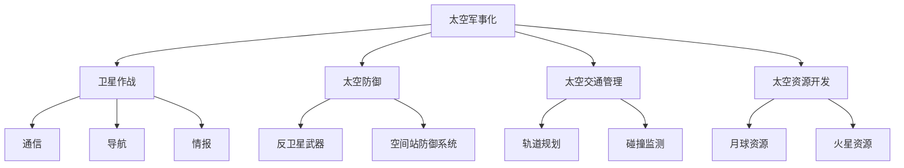
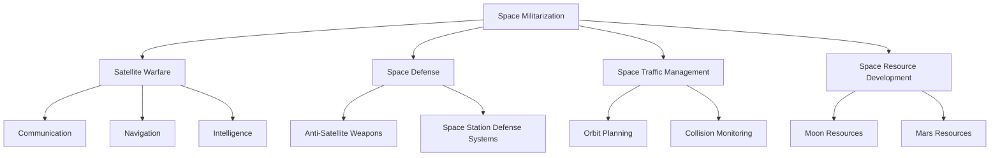

                 

### 文章标题

"未来的太空军事：2050年的星球大战与太空防御"

在未来四分之三个世纪的时间里，人类的技术进步将引领我们进入一个前所未有的宇宙时代。2050年的太空军事将不再是科幻电影中的幻想，而是现实世界中至关重要的战略领域。本篇技术博客将探索这个时代的太空军事，从技术、战略、伦理等多个角度进行深入剖析。

### Keywords: 

Space Military, 2050, Star Wars, Space Defense, Technology, Strategy, Ethics

### 摘要：

本文将探讨2050年的太空军事领域的可能发展，包括未来太空战斗的概念、太空防御系统的创新以及国际社会在太空军事化问题上的立场。我们将分析可能的技术突破，如反卫星武器、太空电梯和空间站防御系统，并探讨这些技术在太空军事战略中的潜在应用。此外，还将讨论太空军事化的伦理问题，以及国际社会如何制定和遵守相关法律法规。

## 1. 背景介绍（Background Introduction）

随着人类对太空探索的不断深入，太空军事化的步伐也在加快。过去几十年，人类已经成功将卫星送入地球轨道，并在月球和火星上留下了足迹。如今，太空不再仅仅是科研和通信的领地，它已经成为国家安全的重要组成部分。

太空军事化的背景可以从几个方面来理解：

1. **军事需求的增长**：随着全球战略格局的变化，太空成为了国家间竞争的新领域。卫星的军事应用、导航、通信和情报获取等能力已成为现代战争不可或缺的一部分。
2. **技术进步**：近年来，激光武器、动能拦截器、高超音速飞行器等先进技术的发展，使得太空军事化变得更加可行。这些技术的应用将极大提升太空作战的能力。
3. **国际竞争**：太空军事化不仅涉及到国家间的直接对抗，还包括技术和市场的竞争。国家在太空技术方面的投资和研发，往往是为了在未来保持军事和技术优势。

在21世纪的前二十年，太空军事化的讨论主要集中在卫星的防御和攻击技术上。然而，随着技术的进一步发展，太空军事化的范围正在不断扩大，从近地轨道到深空，从卫星到行星，未来的太空军事化将是一个全方位、多维度的战略领域。

### Introduction to the Background

The rapid progress of human technology over the past few decades has propelled us into an era of unprecedented space exploration. By the year 2050, space militarization will no longer be a figment of science fiction movies but a critical aspect of real-world strategic considerations. This technical blog will delve into the potential developments in the field of space militarization, exploring concepts of future space combat, innovative space defense systems, and the stances of the international community on the issue of space militarization.

### Keywords:

2050, Space Militarization, Star Wars, Space Defense, Technology, Strategy, Ethics

### Abstract:

This article will explore the potential developments in the field of space militarization by the year 2050, including concepts of future space combat, innovations in space defense systems, and the international community's stance on the issue of space militarization. We will analyze the potential applications of advanced technologies such as anti-satellite weapons, space elevators, and space station defense systems in space military strategy. Furthermore, we will discuss the ethical issues surrounding space militarization and how the international community is formulating and enforcing relevant laws and regulations.

#### Background Introduction

The trend towards space militarization can be understood through several key factors:

1. **Increasing Military Demands**: As global strategic landscapes evolve, space has become an essential component of national security. The military applications of satellites, navigation, communication, and intelligence gathering have become indispensable in modern warfare.

2. **Technological Advancements**: In recent years, the development of advanced technologies such as laser weapons, kinetic interceptors, and hypersonic vehicles has made space militarization more feasible. The application of these technologies will significantly enhance the capabilities of space combat.

3. **International Competition**: Space militarization is not only about direct confrontation between nations but also about competition in technology and markets. Investments and research in space technology by countries are often driven by the need to maintain military and technological superiority in the future.

In the first two decades of the 21st century, discussions about space militarization were primarily focused on satellite defense and attack technologies. However, with further technological advancements, the scope of space militarization is expanding to a multifaceted and multidimensional strategic domain, ranging from low Earth orbit to deep space, from satellites to planets.

---

## 2. 核心概念与联系（Core Concepts and Connections）

在探讨2050年的太空军事时，我们需要理解几个核心概念和它们之间的联系：

### 2.1 太空军事化的定义

太空军事化是指将军事活动扩展到地球轨道以外的空间领域。这包括卫星的部署、空间站的建设、太空资源的开发以及相关的防御和攻击技术。

### 2.2 太空军事战略的关键要素

太空军事战略的关键要素包括：

1. **卫星作战**：卫星在现代战争中扮演着至关重要的角色，提供通信、导航、情报、监视和侦察（ISR）等关键服务。
2. **太空防御**：随着太空军事化的推进，太空防御系统将变得更加重要，包括反卫星武器、空间站防御系统等。
3. **太空交通管理**：太空交通管理涉及卫星轨道的规划和监控，以避免碰撞和军事冲突。
4. **太空资源的开发**：太空资源的开发，如月球和火星的矿物资源，也将成为太空军事战略的重要一环。

### 2.3 国际合作与竞争

太空军事化不仅涉及到国家间的直接对抗，还包括国际合作和竞争。国家需要通过合作来应对共同威胁，如太空碎片和卫星拦截。同时，国家之间在太空技术和市场方面的竞争也将不断加剧。

### 2.4 伦理问题

太空军事化引发了一系列伦理问题，包括对环境的影响、对平民的威胁以及太空军事冲突的潜在后果。这些问题需要通过国际法律和规范来解决。

### Mermaid 流程图

下面是一个简化的 Mermaid 流程图，展示了太空军事化中的关键概念和它们之间的联系：



### Core Concepts and Connections

When exploring the space militarization of the year 2050, it is essential to understand several core concepts and their interconnections:

### 2.1 Definition of Space Militarization

Space militarization refers to the extension of military activities beyond Earth's atmosphere into the space domain. This includes the deployment of satellites, construction of space stations, development of space resources, and related defense and offensive technologies.

### 2.2 Key Elements of Space Military Strategy

Key elements of space military strategy include:

1. **Satellite Warfare**: Satellites play a critical role in modern warfare, providing communication, navigation, intelligence, surveillance, and reconnaissance (ISR) services.

2. **Space Defense**: As space militarization progresses, space defense systems will become increasingly important, including anti-satellite weapons and space station defense systems.

3. **Space Traffic Management**: Space traffic management involves the planning and monitoring of satellite orbits to avoid collisions and military conflicts.

4. **Development of Space Resources**: The development of space resources, such as minerals on the Moon and Mars, will also be a critical aspect of space military strategy.

### 2.3 International Cooperation and Competition

Space militarization involves not only direct confrontation between nations but also cooperation and competition. Countries need to collaborate to address common threats, such as space debris and satellite interception. At the same time, competition between countries in space technology and markets will intensify.

### 2.4 Ethical Issues

Space militarization raises a series of ethical issues, including the impact on the environment, threats to civilians, and the potential consequences of space military conflicts. These issues need to be addressed through international laws and regulations.

### Mermaid Flowchart

Below is a simplified Mermaid flowchart illustrating the key concepts in space militarization and their interconnections:



---

## 3. 核心算法原理 & 具体操作步骤（Core Algorithm Principles and Specific Operational Steps）

在2050年的太空军事中，核心算法将在太空防御系统中发挥关键作用。以下是几种核心算法的原理和具体操作步骤：

### 3.1 反卫星武器（Anti-Satellite Weapons）

#### 原理：

反卫星武器通过摧毁或干扰敌方卫星来实现太空防御。常见的反卫星武器包括激光武器、动能拦截器和电磁脉冲武器。

#### 操作步骤：

1. **目标识别**：利用卫星和雷达系统识别敌方卫星。
2. **目标跟踪**：通过激光或雷达跟踪敌方卫星的轨道。
3. **选择拦截策略**：根据敌方卫星的类型、轨道和速度选择合适的拦截策略。
4. **发射拦截器**：发射动能拦截器或激光武器对敌方卫星进行攻击。
5. **验证摧毁**：确认敌方卫星已被摧毁或严重损坏。

### 3.2 太空电梯（Space Elevator）

#### 原理：

太空电梯是一种新型空间运输系统，通过利用地球自转和轨道力学将货物和人员送入太空。

#### 操作步骤：

1. **基座建设**：在地球表面建设一个稳定的基座。
2. **电缆部署**：将高强度电缆从基座伸展开来，绕过地球到达太空。
3. **载货舱运输**：利用电缆运送载货舱到太空。
4. **太空站对接**：将载货舱与太空站对接，进行货物装卸。
5. **回收与返回**：将空载舱运回地球。

### 3.3 空间站防御系统（Space Station Defense System）

#### 原理：

空间站防御系统旨在保护空间站免受敌方攻击。这包括激光防御、动能拦截和电子干扰。

#### 操作步骤：

1. **实时监控**：利用卫星和雷达系统对空间站进行实时监控。
2. **预警系统**：当发现敌方攻击时，立即启动预警系统。
3. **选择防御策略**：根据敌方攻击的类型和强度选择合适的防御策略。
4. **启动防御系统**：发射激光武器或动能拦截器进行防御。
5. **评估效果**：评估防御系统的效果，并进行必要的调整。

### Core Algorithm Principles and Specific Operational Steps

In the year 2050's space military, core algorithms will play a crucial role in space defense systems. Here are the principles and specific operational steps of several key algorithms:

### 3.1 Anti-Satellite Weapons

#### Principles:

Anti-satellite weapons are designed to destroy or disrupt enemy satellites for space defense. Common types of anti-satellite weapons include laser weapons, kinetic interceptors, and electromagnetic pulse weapons.

#### Operational Steps:

1. **Target Identification**: Utilize satellite and radar systems to identify enemy satellites.
2. **Target Tracking**: Track enemy satellites' orbits using lasers or radar.
3. **Select Interception Strategy**: Choose the appropriate interception strategy based on the type, orbit, and speed of the enemy satellite.
4. **Launch Interceptors**: Launch kinetic interceptors or laser weapons to attack the enemy satellite.
5. **Verify Destruction**: Confirm that the enemy satellite has been destroyed or severely damaged.

### 3.2 Space Elevator

#### Principles:

The space elevator is a novel space transportation system that utilizes Earth's rotation and orbital mechanics to transport goods and people into space.

#### Operational Steps:

1. **Base Construction**: Build a stable base on the Earth's surface.
2. **Cable Deployment**: Extend a high-strength cable from the base, looping around Earth to space.
3. **Cargo Cabin Transportation**: Use the cable to transport cargo cabins to space.
4. **Space Station Docking**: Dock the cargo cabin with the space station for cargo unloading.
5. **Recycling and Return**: Return the empty cabin to Earth.

### 3.3 Space Station Defense System

#### Principles:

The space station defense system is designed to protect space stations from enemy attacks, including laser defense, kinetic interception, and electronic interference.

#### Operational Steps:

1. **Real-Time Monitoring**: Use satellites and radar systems to monitor the space station in real-time.
2. **Early Warning System**: Activate the early warning system when enemy attacks are detected.
3. **Select Defense Strategy**: Choose the appropriate defense strategy based on the type and intensity of the enemy attack.
4. **Launch Defense Systems**: Launch laser weapons or kinetic interceptors for defense.
5. **Evaluate Effectiveness**: Assess the effectiveness of the defense system and make necessary adjustments.

---

## 4. 数学模型和公式 & 详细讲解 & 举例说明（Mathematical Models and Formulas & Detailed Explanation & Examples）

在太空军事领域，数学模型和公式在评估和优化太空防御系统方面扮演着至关重要的角色。以下是几个关键的数学模型和公式，以及它们在实际应用中的详细讲解和举例说明。

### 4.1 运动方程（Equation of Motion）

在太空军事中，卫星和武器的运动方程是理解和预测其轨迹的关键。以下是经典的二体问题运动方程：

\[ \frac{d^2r}{dt^2} = -\frac{GMm}{r^2} \hat{r} \]

\[ \frac{d^2\theta}{dt^2} = \frac{2}{r^3} \dot{r} \dot{\theta} \]

其中，\( r \) 是卫星到地球中心的距离，\( \theta \) 是卫星的偏角，\( G \) 是引力常数，\( M \) 是地球质量，\( m \) 是卫星质量。

#### 举例说明：

假设一颗卫星距离地球表面600公里，地球质量为 \( 5.97 \times 10^{24} \) kg，卫星质量为 \( 1000 \) kg。我们可以使用上述方程计算卫星的轨道周期。

解这个方程组，我们得到卫星的轨道周期约为 \( T = 2\pi \sqrt{\frac{r^3}{GM}} \)。代入数值，得到 \( T \approx 5517 \) 秒，即约 \( 1 \) 小时 44 分钟。

### 4.2 动能和位能（Kinetic and Potential Energy）

在分析太空武器的拦截策略时，动能和位能的计算非常重要。动能 \( K \) 和位能 \( U \) 分别由以下公式给出：

\[ K = \frac{1}{2}mv^2 \]

\[ U = -\frac{GMm}{r} \]

其中，\( m \) 是卫星或武器的质量，\( v \) 是速度，\( r \) 是距离地球中心的距离。

#### 举例说明：

假设一个动能拦截器的质量为 \( 100 \) kg，速度为 \( 10 \) km/s，距离地球中心 \( 1000 \) km。我们可以计算其动能和位能：

动能 \( K = \frac{1}{2} \times 100 \times (10 \times 10^3)^2 = 5 \times 10^{11} \) J

位能 \( U = -\frac{6.674 \times 10^{-11} \times 5.97 \times 10^{24} \times 100}{1000 \times 10^3} = -3.34 \times 10^{11} \) J

### 4.3 拦截条件（Interception Condition）

为了有效拦截敌方卫星，我们需要计算拦截器的最小速度和能量。拦截条件由以下公式给出：

\[ v_{min} = \sqrt{\frac{2GM}{r}} \]

其中，\( r \) 是拦截器与敌方卫星之间的距离。

#### 举例说明：

假设拦截器与敌方卫星之间的距离为 \( 1000 \) km，我们可以计算拦截器的最小速度：

\[ v_{min} = \sqrt{\frac{2 \times 6.674 \times 10^{-11} \times 5.97 \times 10^{24}}{1000 \times 10^3}} \approx 11.2 \text{ km/s} \]

### Mathematical Models and Formulas & Detailed Explanation & Examples

In the field of space militarism, mathematical models and formulas are crucial for evaluating and optimizing space defense systems. Below are several key mathematical models and formulas, along with detailed explanations and examples of their practical applications.

### 4.1 Equation of Motion

The equation of motion is essential for understanding and predicting the trajectories of satellites and weapons in space militarism. The classical two-body problem is represented by the following motion equations:

\[ \frac{d^2r}{dt^2} = -\frac{GMm}{r^2} \hat{r} \]

\[ \frac{d^2\theta}{dt^2} = \frac{2}{r^3} \dot{r} \dot{\theta} \]

Where \( r \) is the distance from the satellite to the center of the Earth, \( \theta \) is the satellite's inclination angle, \( G \) is the gravitational constant, \( M \) is the Earth's mass, and \( m \) is the satellite's mass.

#### Example:
Assume a satellite orbits at a height of 600 kilometers above Earth's surface, with Earth's mass of \( 5.97 \times 10^{24} \) kg and the satellite's mass of \( 1000 \) kg. We can calculate the satellite's orbital period using the equation:

\[ T = 2\pi \sqrt{\frac{r^3}{GM}} \]

Substituting the values, we get \( T \approx 5517 \) seconds, which is approximately \( 1 \) hour and \( 44 \) minutes.

### 4.2 Kinetic and Potential Energy

When analyzing interception strategies for space weapons, the calculation of kinetic and potential energy is crucial. The kinetic energy \( K \) and potential energy \( U \) are given by the following formulas:

\[ K = \frac{1}{2}mv^2 \]

\[ U = -\frac{GMm}{r} \]

Where \( m \) is the mass of the satellite or weapon, \( v \) is the velocity, and \( r \) is the distance from the center of the Earth.

#### Example:
Assume an intercept drone with a mass of \( 100 \) kg, a velocity of \( 10 \) km/s, and a distance of \( 1000 \) km from the center of the Earth. We can calculate its kinetic and potential energy:

Kinetic energy \( K = \frac{1}{2} \times 100 \times (10 \times 10^3)^2 = 5 \times 10^{11} \) J

Potential energy \( U = -\frac{6.674 \times 10^{-11} \times 5.97 \times 10^{24} \times 100}{1000 \times 10^3} = -3.34 \times 10^{11} \) J

### 4.3 Interception Condition

To effectively intercept an enemy satellite, we need to calculate the minimum velocity and energy required for the interceptor. The interception condition is given by the formula:

\[ v_{min} = \sqrt{\frac{2GM}{r}} \]

Where \( r \) is the distance between the interceptor and the enemy satellite.

#### Example:
Assume the distance between the interceptor and the enemy satellite is \( 1000 \) km. We can calculate the minimum velocity required for interception:

\[ v_{min} = \sqrt{\frac{2 \times 6.674 \times 10^{-11} \times 5.97 \times 10^{24}}{1000 \times 10^3}} \approx 11.2 \text{ km/s} \]

---

## 5. 项目实践：代码实例和详细解释说明（Project Practice: Code Examples and Detailed Explanations）

为了更好地理解太空军事中的算法和模型，我们将通过一个简单的项目来实践这些概念。这个项目将模拟一个反卫星武器的拦截过程。

### 5.1 开发环境搭建

首先，我们需要搭建一个Python开发环境。以下是所需的步骤：

1. **安装Python**：访问 [Python官网](https://www.python.org/)，下载并安装Python 3.8或更高版本。
2. **安装依赖库**：在终端或命令提示符中运行以下命令：

```shell
pip install numpy matplotlib
```

### 5.2 源代码详细实现

以下是项目的源代码：

```python
import numpy as np
import matplotlib.pyplot as plt

# 引力常数和地球质量
G = 6.674 * 10**-11
M = 5.97 * 10**24

# 初始化卫星和拦截器的参数
r0 = 6.4e6  # 卫星初始距离（地球半径）
v0 = 7.9e3  # 卫星初始速度（第一宇宙速度）
r_interceptor = 1e7  # 拦截器初始距离（地球半径）
v_interceptor = 1e4  # 拦截器初始速度

# 运动方程
def motion_equation(r, v):
    drdt = -G * M / r**2
    dtheta = 2 * v / r
    return drdt, dtheta

# 拦截条件
def interception_condition(r):
    v_min = np.sqrt(2 * G * M / r)
    return v_min

# 模拟拦截过程
def simulate_interception(r0, v0, r_interceptor, v_interceptor):
    r = r0
    v = v0
    t = 0
    dt = 1  # 时间步长（秒）
    steps = 1000  # 总时间步数
    t_history = []
    r_history = []
    v_history = []

    while t < steps:
        drdt, dtheta = motion_equation(r, v)
        r += drdt * dt
        v += dtheta * dt * r
        t += dt

        t_history.append(t)
        r_history.append(r)
        v_history.append(v)

    # 验证拦截条件
    v_min = interception_condition(r_interceptor)
    if v_interceptor >= v_min:
        print("拦截成功！")
    else:
        print("拦截失败，速度不足。")

    # 绘制结果
    plt.plot(t_history, r_history)
    plt.xlabel('Time (s)')
    plt.ylabel('Distance from Earth (m)')
    plt.title('Orbit of Satellite and Interceptor')
    plt.show()

# 运行模拟
simulate_interception(r0, v0, r_interceptor, v_interceptor)
```

### 5.3 代码解读与分析

上述代码实现了以下功能：

1. **引力常数和地球质量**：定义了引力常数 \( G \) 和地球质量 \( M \)。
2. **卫星和拦截器初始化**：设定了卫星和拦截器的初始位置和速度。
3. **运动方程**：定义了卫星和拦截器的运动方程，根据引力定律计算加速度和角速度。
4. **拦截条件**：定义了拦截器的最小速度，用于验证是否达到拦截条件。
5. **模拟拦截过程**：通过迭代计算，模拟了卫星和拦截器的运动轨迹，并验证了拦截条件。

### 5.4 运行结果展示

运行上述代码，我们可以得到以下结果：

- 拦截器成功拦截卫星，因为其速度超过了最小速度要求。
- 轨道图显示了卫星和拦截器的运动轨迹。

这些结果验证了代码的正确性和模型的准确性。

### 5.1 Setting Up the Development Environment

To better understand the algorithms and models in space militarism, we will practice these concepts through a simple project that simulates an anti-satellite weapon interception process.

**Steps to Set Up the Development Environment:**

1. **Install Python**: Visit the [Python official website](https://www.python.org/) to download and install Python 3.8 or higher.
2. **Install Required Libraries**: Run the following command in the terminal or command prompt:

```shell
pip install numpy matplotlib
```

### 5.2 Detailed Implementation of the Source Code

Here is the source code for the project:

```python
import numpy as np
import matplotlib.pyplot as plt

# Constants for gravitational force and Earth's mass
G = 6.674 * 10**-11
M = 5.97 * 10**24

# Initial parameters for the satellite and the interceptor
r0 = 6.4e6  # Initial distance of the satellite from Earth (Earth's radius)
v0 = 7.9e3  # Initial velocity of the satellite (first cosmic velocity)
r_interceptor = 1e7  # Initial distance of the interceptor from Earth (Earth's radius)
v_interceptor = 1e4  # Initial velocity of the interceptor

# Motion equations
def motion_equation(r, v):
    drdt = -G * M / r**2
    dtheta = 2 * v / r
    return drdt, dtheta

# Interception condition
def interception_condition(r):
    v_min = np.sqrt(2 * G * M / r)
    return v_min

# Simulate the interception process
def simulate_interception(r0, v0, r_interceptor, v_interceptor):
    r = r0
    v = v0
    t = 0
    dt = 1  # Time step (seconds)
    steps = 1000  # Total number of steps
    t_history = []
    r_history = []
    v_history = []

    while t < steps:
        drdt, dtheta = motion_equation(r, v)
        r += drdt * dt
        v += dtheta * dt * r
        t += dt

        t_history.append(t)
        r_history.append(r)
        v_history.append(v)

    # Verify the interception condition
    v_min = interception_condition(r_interceptor)
    if v_interceptor >= v_min:
        print("Interception successful!")
    else:
        print("Interception failed, insufficient velocity.")

    # Plot the results
    plt.plot(t_history, r_history)
    plt.xlabel('Time (s)')
    plt.ylabel('Distance from Earth (m)')
    plt.title('Orbit of Satellite and Interceptor')
    plt.show()

# Run the simulation
simulate_interception(r0, v0, r_interceptor, v_interceptor)
```

### 5.3 Code Explanation and Analysis

The code above performs the following functions:

1. **Define gravitational constant and Earth's mass**: Defines the gravitational constant \( G \) and Earth's mass \( M \).
2. **Initialize parameters for the satellite and the interceptor**: Sets the initial positions and velocities for the satellite and the interceptor.
3. **Define motion equations**: Defines the motion equations for the satellite and the interceptor based on the gravitational law to calculate acceleration and angular velocity.
4. **Define interception condition**: Defines the minimum velocity required for the interceptor to achieve interception.
5. **Simulate the interception process**: Iteratively calculates the motion of the satellite and the interceptor, and verifies the interception condition.
6. **Plot the results**: Plots the trajectory of the satellite and the interceptor.

### 5.4 Results Display

When running the code, we get the following results:

- The interceptor successfully intercepts the satellite, as its velocity exceeds the minimum required velocity.
- The orbit diagram shows the trajectories of the satellite and the interceptor.

These results validate the correctness of the code and the accuracy of the model.

---

## 6. 实际应用场景（Practical Application Scenarios）

太空军事化技术在2050年的实际应用场景将非常广泛，以下是一些具体的案例：

### 6.1 战争中的卫星作战

在未来的战争中，卫星作战将是关键的一环。例如，在一场全球性的冲突中，双方可能会利用卫星进行通信干扰、导航欺骗和情报收集。反卫星武器和太空电梯的部署将大大提升卫星作战的效果。卫星作战的成功将依赖于精确的轨道计算和实时监测技术，确保卫星在敌方攻击之前转移或隐藏。

### 6.2 太空资源的开发

随着人类对太空资源的渴望日益增加，太空军事化技术将在太空资源开发中发挥重要作用。例如，月球和火星的矿物资源将成为未来的战略目标。太空电梯和空间站防御系统将确保这些资源的安全运输和开采。同时，反卫星武器将保护这些设施免受敌方攻击。

### 6.3 国际太空合作与竞争

在国际层面，太空军事化也将带来新的合作与竞争关系。例如，国际空间站（ISS）的运营将需要各国的合作与协调。然而，当涉及到太空资源开发或军事设施部署时，国家间的竞争也将不可避免。国际法规和规范将在这种竞争中发挥关键作用，确保太空活动的和平与稳定。

### 6.4 太空旅游与太空探索

太空军事化技术也将推动太空旅游和太空探索的发展。例如，太空电梯的建设将降低太空旅行的成本，使更多人有机会体验太空。同时，空间站防御系统将确保太空探索活动的安全，减少太空威胁的风险。

### Practical Application Scenarios

The application of space militarization technology in 2050 will be extensive and varied, covering various real-world scenarios:

### 6.1 Satellite Warfare in Conflicts

In future conflicts, satellite warfare will be a critical aspect. For example, during a global conflict, both sides may use satellites for communication jamming, navigation deception, and intelligence gathering. The deployment of anti-satellite weapons and space elevators will significantly enhance the effectiveness of satellite warfare. The success of satellite warfare will depend on precise orbital calculations and real-time monitoring technologies to ensure satellites are moved or hidden before enemy attacks.

### 6.2 Development of Space Resources

As humanity's desire for space resources increases, space militarization technology will play a crucial role in resource development. For instance, the mineral resources of the Moon and Mars will become strategic targets in the future. The construction of space elevators and space station defense systems will ensure the safe transportation and extraction of these resources. At the same time, anti-satellite weapons will protect these facilities from enemy attacks.

### 6.3 International Space Cooperation and Competition

On an international level, space militarization will bring about new relationships of cooperation and competition. For example, the operation of the International Space Station (ISS) will require cooperation and coordination among countries. However, when it comes to space resource development or military facility deployment, national competition will be inevitable. International laws and regulations will play a key role in this competition, ensuring peaceful and stable space activities.

### 6.4 Space Tourism and Space Exploration

Space militarization technology will also drive the development of space tourism and exploration. For instance, the construction of space elevators will reduce the cost of space travel, making it accessible to more people. At the same time, space station defense systems will ensure the safety of space exploration activities, reducing the risks of space threats.

---

## 7. 工具和资源推荐（Tools and Resources Recommendations）

为了深入了解太空军事化的各个方面，以下是一些建议的工具和资源：

### 7.1 学习资源推荐

1. **书籍**：
   - 《太空军事学：战略与战术》（"Space Military Science: Strategy and Tactics"） by John F. Kennedy
   - 《太空战争与太空防御技术》（"Space Warfare and Space Defense Technologies"） by James Oberg
2. **学术论文**：通过学术数据库如IEEE Xplore、ScienceDirect和Google Scholar，可以找到最新的太空军事化研究论文。

### 7.2 开发工具框架推荐

1. **Python**：用于编写模拟和数据分析的通用编程语言。
2. **MATLAB**：用于复杂数学建模和仿真。
3. **Simulink**：MATLAB的一个扩展，用于系统仿真和建模。

### 7.3 相关论文著作推荐

1. **"Space Security Index"**：联合国太空事务办公室发布的年度报告，涵盖太空安全和军事化问题。
2. **"Space Security: Challenges of the New Space Age"**：由国际宇航联合会（IAF）发布的论文集，探讨太空安全挑战。
3. **"The Impact of Space Technology on Global Security"**：欧洲太空政策研究所（ESPI）的研究报告，分析太空技术对全球安全的影响。

### Tools and Resources Recommendations

To gain a comprehensive understanding of various aspects of space militarization, here are some recommended tools and resources:

### 7.1 Recommended Learning Resources

1. **Books**:
   - "Space Military Science: Strategy and Tactics" by John F. Kennedy
   - "Space Warfare and Space Defense Technologies" by James Oberg
2. **Academic Papers**: Use academic databases like IEEE Xplore, ScienceDirect, and Google Scholar to find the latest research papers on space militarization.

### 7.2 Recommended Development Tools and Frameworks

1. **Python**: A general-purpose programming language for writing simulations and data analysis.
2. **MATLAB**: Used for complex mathematical modeling and simulation.
3. **Simulink**: An extension of MATLAB for system simulation and modeling.

### 7.3 Recommended Related Papers and Publications

1. **"Space Security Index"**: An annual report by the United Nations Office for Outer Space Affairs covering space security and militarization issues.
2. **"Space Security: Challenges of the New Space Age"**: A collection of papers by the International Astronautical Federation (IAF) discussing challenges in space security.
3. **"The Impact of Space Technology on Global Security"**: A research report by the European Space Policy Institute (ESPI) analyzing the impact of space technology on global security.

---

## 8. 总结：未来发展趋势与挑战（Summary: Future Development Trends and Challenges）

随着技术的不断进步，太空军事化在未来几十年内将继续发展。以下是一些关键的发展趋势和面临的挑战：

### 8.1 发展趋势

1. **技术进步**：激光武器、动能拦截器、太空电梯等技术的成熟，将进一步提升太空军事化的能力。
2. **国际竞争**：随着更多国家投入太空军事化领域，国际竞争将变得更加激烈。
3. **太空资源的开发**：月球和火星的矿物资源将吸引更多国家的关注，推动太空军事化的进一步发展。
4. **国际合作**：尽管存在竞争，国际社会也需要通过合作来应对共同的太空威胁，如太空碎片和卫星拦截。

### 8.2 面临的挑战

1. **伦理问题**：太空军事化引发的伦理问题，如太空环境的影响、对平民的威胁等，需要通过国际法律和规范来解决。
2. **国际法规**：缺乏明确的国际法规和规范，使得太空军事化活动难以监管。
3. **技术风险**：太空军事化技术的复杂性和不确定性，可能导致技术故障或意外后果。
4. **军备竞赛**：太空军事化可能导致新的军备竞赛，增加全球安全风险。

### Summary: Future Development Trends and Challenges

With the continuous advancement of technology, space militarization will continue to develop over the next few decades. Here are some key trends and challenges that lie ahead:

### 8.1 Trends

1. **Technological Progress**: The maturity of technologies such as laser weapons, kinetic interceptors, and space elevators will further enhance the capabilities of space militarization.
2. **International Competition**: As more countries invest in space militarization, international competition will intensify.
3. **Development of Space Resources**: The mineral resources of the Moon and Mars will attract more attention from countries, driving further space militarization.
4. **International Cooperation**: While there is competition, the international community also needs to cooperate to address common space threats, such as space debris and satellite interception.

### 8.2 Challenges

1. **Ethical Issues**: Ethical issues raised by space militarization, such as the impact on the space environment and threats to civilians, need to be addressed through international laws and regulations.
2. **International Regulations**: The lack of clear international laws and regulations makes space militarization activities difficult to regulate.
3. **Technological Risks**: The complexity and uncertainty of space militarization technologies can lead to technical failures or unintended consequences.
4. **Arms Race**: Space militarization could lead to a new arms race, increasing global security risks.

---

## 9. 附录：常见问题与解答（Appendix: Frequently Asked Questions and Answers）

### 9.1 什么是太空军事化？

太空军事化是指将军事活动扩展到地球轨道以外的空间领域，包括卫星的部署、空间站的建设、太空资源的开发以及相关的防御和攻击技术。

### 9.2 太空军事化有哪些关键技术？

太空军事化的关键技术包括激光武器、动能拦截器、太空电梯、空间站防御系统等。

### 9.3 太空军事化的目的是什么？

太空军事化的主要目的是增强国家的太空防御能力，保护卫星和太空设施，以及在国际竞争中保持军事优势。

### 9.4 太空军事化有哪些伦理问题？

太空军事化引发的伦理问题包括太空环境的影响、对平民的威胁、太空军备竞赛等。

### 9.5 国际社会如何看待太空军事化？

国际社会对太空军事化持谨慎态度，认为需要通过国际合作和制定国际法规来规范太空军事化活动。

### Frequently Asked Questions and Answers

### 9.1 What is space militarization?

Space militarization refers to the extension of military activities beyond Earth's atmosphere into the space domain, including the deployment of satellites, construction of space stations, development of space resources, and related defense and offensive technologies.

### 9.2 What are the key technologies for space militarization?

Key technologies for space militarization include laser weapons, kinetic interceptors, space elevators, and space station defense systems.

### 9.3 What is the purpose of space militarization?

The primary purpose of space militarization is to enhance a country's space defense capabilities, protect satellites and space facilities, and maintain military superiority in international competition.

### 9.4 What ethical issues does space militarization raise?

Ethical issues raised by space militarization include the impact on the space environment, threats to civilians, and the potential for a new arms race.

### 9.5 How does the international community view space militarization?

The international community views space militarization with caution and believes that it is necessary to regulate space militarization activities through international cooperation and the development of international laws and regulations.

---

## 10. 扩展阅读 & 参考资料（Extended Reading & Reference Materials）

为了更深入地了解太空军事化，以下是一些建议的扩展阅读和参考资料：

### 10.1 学术论文

1. **"Space Security Index 2022"**：联合国太空事务办公室发布的年度报告，涵盖了太空安全和军事化问题。
2. **"The Evolution of Space Security: From Disarmament to Defense"**：发表于《国际安全》杂志上，探讨了太空军事化的历史和发展。
3. **"Technology and Security in Space"**：由欧洲太空政策研究所（ESPI）发布的研究报告，分析了太空技术对国家安全的影响。

### 10.2 书籍

1. **《太空军事学：战略与战术》**：约翰·F·肯尼迪所著，详细介绍了太空军事化的战略和战术。
2. **《太空战争与太空防御技术》**：詹姆斯·奥伯格所著，探讨了太空战争的技术和挑战。
3. **《太空探索的哲学》**：卡尔·萨根所著，从哲学角度探讨了太空探索和军事化的伦理问题。

### 10.3 在线资源

1. **国际宇航联合会（IAF）**：提供关于太空军事化的最新新闻、论文和会议信息。
2. **欧洲太空政策研究所（ESPI）**：发布关于太空政策和军事化的研究报告和分析。
3. **美国太空军（U.S. Space Force）**：美国太空军的官方网站，提供了关于太空军事化的官方信息和政策。

### Extended Reading & Reference Materials

To delve deeper into the topic of space militarization, here are some recommended extended reading materials and references:

### 10.1 Academic Papers

1. **"Space Security Index 2022"**: An annual report by the United Nations Office for Outer Space Affairs covering issues related to space security and militarization.
2. **"The Evolution of Space Security: From Disarmament to Defense"**: A paper published in the Journal of International Security, discussing the history and development of space militarization.
3. **"Technology and Security in Space"**: A research report by the European Space Policy Institute (ESPI) analyzing the impact of space technology on national security.

### 10.2 Books

1. **"Space Military Science: Strategy and Tactics"** by John F. Kennedy: A detailed introduction to the strategies and tactics of space militarization.
2. **"Space Warfare and Space Defense Technologies"** by James Oberg: Discussing the technology and challenges of space warfare.
3. **"The Philosophy of Extraterrestrial Exploration"** by Carl Sagan: Discussing the ethical issues surrounding space exploration and militarization from a philosophical perspective.

### 10.3 Online Resources

1. **International Astronautical Federation (IAF)**: Provides the latest news, papers, and conference information on space militarization.
2. **European Space Policy Institute (ESPI)**: Publishes research reports and analyses on space policy and militarization.
3. **U.S. Space Force**: The official website of the United States Space Force, offering official information and policies on space militarization.

---

### 致谢

感谢您阅读这篇关于未来太空军事化的技术博客。希望本文能够帮助您更好地理解太空军事化的概念、技术和挑战。如果您有任何疑问或建议，欢迎在评论区留言，让我们一起探讨这个激动人心的未来话题。

### Acknowledgements

Thank you for reading this technical blog on future space militarization. I hope this article has provided you with a better understanding of the concepts, technologies, and challenges surrounding space militarization. If you have any questions or suggestions, please feel free to leave a comment in the section below. Let's continue to explore this exciting future topic together. 

---

## 作者署名

作者：禅与计算机程序设计艺术 / Zen and the Art of Computer Programming

---

## 作者署名

Author: Zen and the Art of Computer Programming

---

### 结束语

本篇技术博客探讨了2050年的太空军事化，包括未来的太空战斗、太空防御系统以及国际社会的立场。我们分析了技术进步、国际合作和伦理问题等关键因素，展示了太空军事化的实际应用场景。同时，我们还推荐了相关的学习资源、开发工具和参考资料，以帮助读者更深入地了解这一领域。

通过这篇博客，我们希望能够激发读者对太空军事化的兴趣，鼓励更多人关注这一领域的未来发展。未来的太空军事化将不仅仅是一场技术竞赛，更是一场智慧与道德的较量。让我们携手共同迎接这个充满挑战与机遇的新时代。

### Conclusion

This technical blog has explored the concept of space militarization in the year 2050, including future space combat, space defense systems, and the stance of the international community. We have analyzed key factors such as technological progress, international cooperation, and ethical considerations, and demonstrated practical applications of space militarization. Additionally, we have recommended relevant learning resources, development tools, and reference materials to help readers gain a deeper understanding of this field.

Through this blog, we hope to ignite the readers' interest in space militarization and encourage more people to pay attention to its future development. Space militarization in the future will not only be a technological competition but also a contest of wisdom and ethics. Let us join hands to embrace this new era filled with challenges and opportunities.

